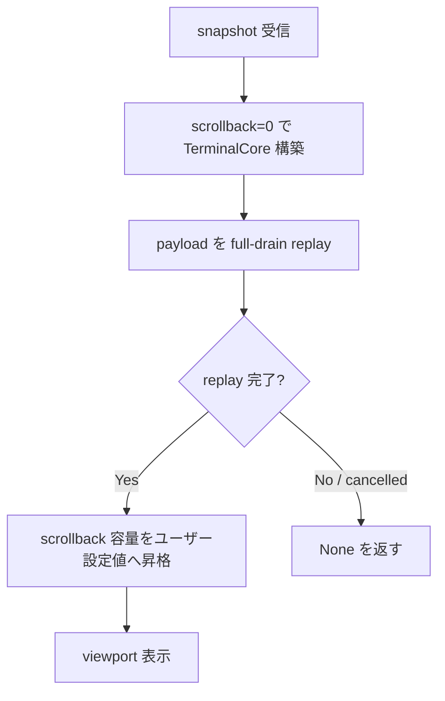

# snapshot-replay-perf - 要件定義書

## 1. 概要

### 1.1 背景

mux モードで大量出力（例: `seq 1 10000000`）を持つタブに切り替えると、画面復元に 2〜3 秒かかる。
事前調査 (`tmp/mux-snapshot-replay-bottleneck-20260621.md`) により以下が判明:

- daemon → client へ送る snapshot payload は 2 MiB 程度で、転送・フィルタ自体は速い
  - `strip_replayable_rich_content` (2 MiB): 3.0 ms
  - `ScrollbackRingBuffer::read_all`     : 60 μs
- 律速は client 側の `TerminalCore::build_from_snapshot` で、2 MiB の `seq 1 N` 風 payload を replay すると **4040 ms** かかる (0.5 MiB/s)
- そのうち約 4 s は ANSI パース自体ではなく、`ring_push_blank` 内の SlimCell 圧縮ループ (`cell_to_slim` + `release_slim_row`) が占める
  - 同じ payload を `scrollback_lines=0` で replay すると 51 ms (約 80 倍速) で完了する

要するに「ANSI パースは速いが、replay 中に発生する scroll の度に毎行 scrollback へ intern コピーするのが重い」状況。

### 1.2 目的

snapshot replay の合計時間を **タブ切替が「もたつかない」と感じられる水準**まで短縮する。
具体的には `snapshot_replay_bench_2mib_seq` (`crates/term_core/src/bench.rs`) で:

- MUST: < 1000 ms (現状 4040 ms)
- SHOULD: < 200 ms
- STRETCH: < 100 ms (= scrollback=0 構成の理論値近傍)

### 1.3 スコープ

**対象**:

- client 側 `build_from_snapshot` 経路に限定した最適化（候補1: replay 中は `scrollback_lines=0` で TerminalCore を組み立て、replay 完了後に通常 grid に転写）
- 既存ベンチ (`snapshot_replay_bench_2mib_seq`, `snapshot_replay_attribution_2mib_seq`) の `assert!` による回帰ガード化
- 副ベンチ (`strip_replayable_rich_content_bench_2mib_plain`, `scrollback_read_all_bench_2mib_wrapped`) への閾値追加

**対象外**:

- candidate #2 (replay 時の intern skip)、candidate #3 (lazy compression)、candidate #4 (grid binary シリアライズ)
- daemon → client の protocol 変更
- replay 後に viewport 外（client 側 scrollback）を表示する機能の維持
  - 本 feature 完了直後、reattach されたタブの client 側 scrollback は viewport ぶんのみとなる
  - viewport 外を後で見たい場合は別 task として扱う（要設計）

## 2. ビジネス要件

### 2.1 ビジネス目標

mux モードのタブ切替体感を tmux と同等以上にする。eMterm の差別化要素「AI 時代に使えるターミナル」の前提として、Claude Code のような大量出力ワークフローでも遅延を感じないこと。

### 2.2 対象ユーザー

| ユーザータイプ | 説明 |
|----------------|------|
| mux ヘビーユーザー | 複数タブを開き AI コーディングや大量ログ出力を行う開発者 |

### 2.3 期待される効果

- 大量出力済みタブへの切替時間が 4 s → 1 s 以下（MUST 達成時）
- 体感「もたつき」消失（SHOULD 達成時）
- 既存メモリ `project_mux_output_pipeline_perf` の「切替2-3秒」が解消される

## 3. ユースケース

### 3.1 ユースケース一覧

| ID | ユースケース名 | アクター | 優先度 |
|----|----------------|----------|--------|
| UC01 | 大量出力タブへの切替 | mux ユーザー | 高 |
| UC02 | reattach 後の初回描画 | mux ユーザー | 高 |
| UC03 | 既存スクロール挙動の維持 | mux ユーザー | 中 |

### 3.2 ユースケース詳細

#### UC01: 大量出力タブへの切替

**アクター**: mux モードで複数タブを使う開発者

**事前条件**:
- emterm が mux モードで起動済み
- タブA で `seq 1 10000000` 等の大量出力が完了
- 別タブB がアクティブ

**基本フロー**:
1. ユーザーが mux キーバインドでタブA に切替
2. daemon が pane snapshot を組み立て client へ送信
3. client が snapshot を受け取り `build_from_snapshot` で復元
4. viewport が表示される

**事後条件**:
- 復元所要時間（手順3）が現状 4 s 超から MUST < 1000 ms へ短縮

#### UC02: reattach 後の初回描画

**アクター**: emterm を再起動したユーザー

**事前条件**:
- daemon が socket で生存している
- client が新たに起動し、既存 pane に再アタッチする

**基本フロー**:
1. client が `RequestPaneSnapshot` を送る
2. daemon が scrollback 付き snapshot を返す
3. client が replay する

**事後条件**:
- 初回描画までの時間が UC01 と同水準まで短縮される

#### UC03: 既存スクロール挙動の維持

**アクター**: mux ユーザー

**事前条件**:
- 大量出力後にタブを切替終わった状態

**基本フロー**:
1. ユーザーがマウスホイール / キーで scroll up を試みる

**事後条件**:
- 復元直後はスクロール可能範囲が viewport のみ（client scrollback は 0）
- 以降の新規出力は通常通り client scrollback に蓄積される

## 4. 機能要件

### 4.1 機能一覧

| ID | 機能名 | 説明 | 優先度 |
|----|--------|------|--------|
| F01 | replay 時 scrollback バイパス | snapshot replay の間だけ scrollback 容量を 0 とみなして TerminalCore を組み立てる | 高 |
| F02 | replay 完了後の通常容量復帰 | replay 終了直後から、新規出力はユーザー設定 `scrollback_lines` に従って蓄積する | 高 |
| F03 | 主目標ベンチへの閾値アサート | `snapshot_replay_bench_2mib_seq` に `assert!` で MUST < 1000 ms を回帰ガードとして組み込む | 高 |
| F04 | 副ベンチへの回帰ガード | `strip_replayable_rich_content_bench_2mib_plain` (<30 ms), `scrollback_read_all_bench_2mib_wrapped` (<1 ms), `snapshot_replay_attribution_2mib_seq` (scrollback無効 <200 ms) に閾値追加 | 中 |

### 4.2 機能詳細

#### F01: replay 時 scrollback バイパス

**説明**: client が snapshot を replay する経路 (`build_from_snapshot` 起点) で、ユーザー設定の `scrollback_lines` を **0 として** `TerminalCore::new` を呼ぶ。replay 完了後の TerminalCore はそのまま使うのではなく、現行のグリッド/ステートだけ抽出して通常容量 (`scrollback_lines` = ユーザー設定) の新しい TerminalCore に転写するか、または `TerminalCore` 側に「replay 完了後に scrollback 容量を昇格させる」ホットスワップ手段を新設する。実装手段はどちらでも構わない（採否は実装計画フェーズで決定）。

**入力**: 既存 `build_from_snapshot(cols, rows, scrollback_lines, payload, cancel)` 呼び出し側からの引数

**出力**: replay 完了状態の `TerminalCore`

**処理フロー**:

**ビジネスルール**:
- F01 は replay 経路に限定する。通常 PTY からの 1 文字ずつ流れる入力には影響しない
- replay 完了後の TerminalCore は、その後の通常 output で scrollback を蓄積できる状態でなければならない（F02）

**エラーケース**:
- cancel フラグが立っている場合は既存挙動どおり `None` を返す
- replay 中 OOM 等は既存挙動踏襲（明示的な対応は本 feature では行わない）

#### F02: replay 完了後の通常容量復帰

**説明**: F01 で構築した TerminalCore は、replay 完了時点で `scrollback_capacity = scrollback_lines (ユーザー設定値)` となっており、以降の通常出力で scrollback に蓄積される。replay 中に「捨てた」scrollback は復元されない（スコープ §1.3 参照）。

**ビジネスルール**:
- 復元直後の `core.scrollback_count()` は 0
- 以降の `ring_push_blank` 呼び出しで通常通り `scrollback_capacity` まで scrollback に蓄積される

#### F03: 主目標ベンチへの閾値アサート

**説明**: `crates/term_core/src/bench.rs::snapshot_replay_bench_2mib_seq` に `assert!(per_call < Duration::from_millis(1000))` を追加し、改善が将来退行したら CI で検知する。

**ビジネスルール**:
- 閾値は MUST = 1000 ms。10〜20 倍のローカル実測マージンを取り CI flaky を避ける
- ベンチは引き続き `#[ignore]` のまま（明示実行のみ）

#### F04: 副ベンチへの回帰ガード

**説明**: 関連する周辺コンポーネントが将来遅くなって全体退行することを防ぐため、以下に `assert!` を追加:

| ベンチ | 閾値 |
|---|---|
| `strip_replayable_rich_content_bench_2mib_plain` | < 30 ms |
| `scrollback_read_all_bench_2mib_wrapped` | < 1 ms |
| `snapshot_replay_attribution_2mib_seq` (scrollback無効ケース) | < 200 ms |

**ビジネスルール**:
- 全て `#[ignore]` 維持
- 副ベンチは「scrollback 無効ケース」のみアサート対象。baseline / no-scroll の数値は参考表示のみで assert しない

## 5. 非機能要件

### 5.1 パフォーマンス要件

- 主指標: `snapshot_replay_bench_2mib_seq` per-call
  - MUST: < 1000 ms (現状 4040 ms)
  - SHOULD: < 200 ms
  - STRETCH: < 100 ms

### 5.2 セキュリティ要件

該当なし（外部入力境界に変更なし、protocol 不変）

### 5.3 可用性要件

該当なし

### 5.4 保守性要件

- 主目標／副ベンチが `assert!` 入りで CI に組み込まれている (`#[ignore]` 解除はしない)
- `memory/project_mux_output_pipeline_perf` の関連項目を更新する

### 5.5 互換性要件

- mux IPC protocol 不変
- daemon 側コード不変
- snapshot バイナリ形式不変
- Linux / Windows / CLI-only (`--no-default-features`) 全ビルドが green

## 6. UI/UX要件

### 6.1 画面設計要件

UI 自体に視覚的変更はない。タブ切替時のスピードのみ向上する。

### 6.2 復元後 scrollback 挙動

- タブ切替直後・reattach 直後: client 側 scrollback は viewport のみ
- 以降の出力: ユーザー設定 `scrollback_lines` に従って蓄積
- ユーザーへの明示通知は行わない（透過的）

## 7. データ要件

該当なし（永続化データの変更なし）

## 8. 外部連携

該当なし

## 9. 制約条件

### 9.1 技術的制約

- 改修対象は基本的に `crates/term_core` と、replay を呼ぶ client 側 (`src-tauri/src/mux/` 周辺) のみ
- `build_from_snapshot` の関数シグネチャを変えるかどうかは実装判断。変える場合は呼び出し側を漏らさず更新すること
- `TerminalCore` のフィールド (`ring_capacity` 等) は内部表現の変更を許容するが、外部 API は最小限の変更に留める

### 9.2 ビジネス上の制約

なし

### 9.3 スケジュール制約

なし

## 10. 想定される課題とリスク

### 10.1 技術的課題

| 課題 | 影響度 | 対応策 |
|------|--------|--------|
| `scrollback_capacity` 動的変更が既存 ring_buffer 不変条件を壊す可能性 | 中 | 「容量昇格」は new 直後の状態のみで行う方針に限定（既存 scrollback が空であることを前提に capacity だけ書き換える）。または毎回 TerminalCore を新規 alloc して grid のみ転写 |
| `resize_reflow` が `scrollback_lines=0` 状態で呼ばれた場合の挙動 | 低 | replay 中に resize は起きない設計とする。タイミング的に発生し得るなら別途防御 |
| FR3 ベンチが CI 環境で flaky | 中 | 10〜20 倍マージン採用 (実測 51 ms に対し閾値 200 ms 等)。それでも flaky なら閾値再調整 |

### 10.2 ビジネスリスク

| リスク | 発生確率 | 影響度 | 対応策 |
|--------|----------|--------|--------|
| reattach 直後に scrollback を辿りたいユーザーが混乱 | 低 | 中 | スコープ §1.3 で明記済み。混乱が顕在化したら follow-up task で daemon→client 部分 scrollback 復元を設計 |

## 11. 成功基準

### 11.1 受け入れ基準

- [ ] `snapshot_replay_bench_2mib_seq` per-call < 1000 ms (MUST 達成)
- [ ] F04 の各副ベンチ assert が green
- [ ] 既存 `cargo test` 全 green (`--no-default-features` 含む)
- [ ] mux 実機検証で「seq 1 10000000 タブへの切替がもたつかない」ことを目視確認
- [ ] `memory/project_mux_output_pipeline_perf.md` を本タスクの結論で更新

### 11.2 KPI

| 指標 | 目標値 | 測定方法 |
|------|--------|----------|
| snapshot replay per-call | < 1000 ms (MUST) | `snapshot_replay_bench_2mib_seq` |
| 同上 stretch | < 100 ms | 同上 |
| 副ベンチ scrollback無効ケース | < 200 ms | `snapshot_replay_attribution_2mib_seq` |
| 副ベンチ filter | < 30 ms | `strip_replayable_rich_content_bench_2mib_plain` |
| 副ベンチ read_all | < 1 ms | `scrollback_read_all_bench_2mib_wrapped` |

## 12. テストシナリオ

### 12.1 テスト観点

- [ ] 正常系: 2 MiB seq-N payload を replay し、viewport が正しく復元される（既存 `test_build_from_snapshot_matches_reset_and_replay` 系の挙動を維持）
- [ ] 正常系: replay 完了後、追加で PTY 出力を流すと scrollback に蓄積される
- [ ] 境界値: payload が空のとき従来通り動作する
- [ ] 境界値: payload が cancel された場合 None が返る
- [ ] パフォーマンス: 上記 KPI ベンチ全 assert green
- [ ] 既存退行: `cargo test --manifest-path src-tauri/Cargo.toml` および `--no-default-features` での `cargo check` が全 green
- [ ] 体感: mux 実機で大量出力タブ切替がもたつかない

## 13. 用語定義

| 用語 | 定義 |
|------|------|
| snapshot replay | mux daemon から受け取った pane snapshot (ANSI バイト列) を client 側で再パースして TerminalCore を組み立てる処理 |
| scrollback | viewport の上にスクロールアウトした行を保持するリングバッファ |
| SlimCell | scrollback 行を圧縮表現に変換したセル形式（StyleTable / CharTable に intern） |
| `ring_push_blank` | viewport 最上行を scrollback に追い出し、最下行に新規空行を挿入する操作 |

## 14. 確認事項

### 14.1 確認済み事項

- [x] 実装スコープ: 候補1 のみ（snapshot replay 時に scrollback_lines=0）
- [x] replay 直後の client scrollback: viewport のみ復元で許容（viewport 外復元は別 task）
- [x] feature 名: `snapshot-replay-perf`

### 14.2 未確認・保留事項

- [ ] `scrollback_lines` 昇格の実装手段（毎回新規 TerminalCore + grid 転写 vs. 既存 core 内部での capacity 昇格）— 実装計画フェーズで決定

## 15. 参考資料

- 調査レポート: `tmp/mux-snapshot-replay-bottleneck-20260621.md`
- 関連メモ: `memory/project_mux_output_pipeline_perf.md`
- 関連先行 task: `doc/tasks/mux-snapshot-reparse-offthread/`
- 主要対象コード:
  - `crates/term_core/src/terminal_core.rs::build_from_snapshot`
  - `crates/term_core/src/ring_buffer.rs::ring_push_blank`
  - `crates/term_core/src/bench.rs`
