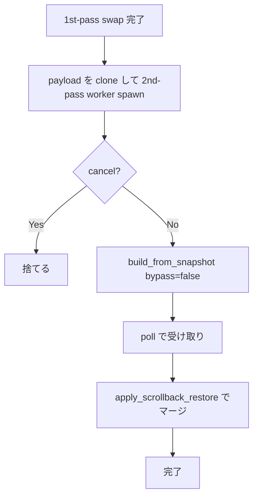
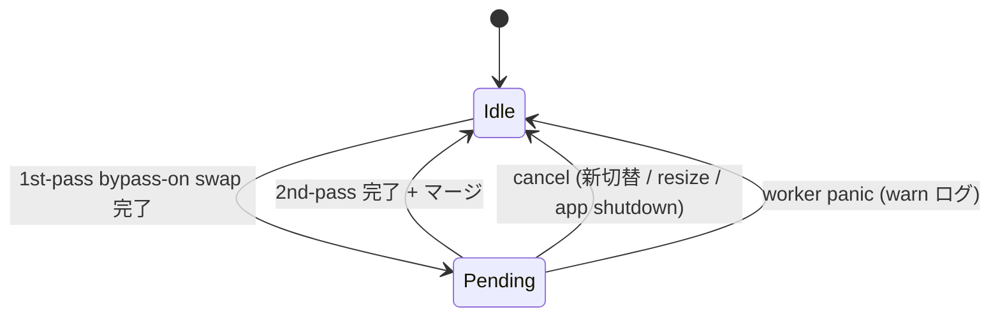

# snapshot-replay-scrollback-restore - 要件定義書

## 1. 概要

### 1.1 背景

mux ウィンドウ切替時の snapshot replay は、直前の perf 改善で
2 MiB 級 payload でも 4040 ms → 51 ms 程度まで短縮された
(コミット `6b47754` / `9ceac36`)。これは payload が
`OFFTHREAD_REPLAY_THRESHOLD_BYTES = 64 KiB` を超える時に、
worker thread 上で `TerminalCore::build_from_snapshot` を
`scrollback_bypass = true` で実行し、SlimCell 圧縮 + scrollback deque
への push をスキップすることで実現している。

ただしこの bypass 経路は **可視グリッド (rows × cols) しか復元しない**。
履歴 (`scrollback_slim` / `scrollback_wrapped`) は空のまま swap される。
結果として「切替直後にスクロールアップしても履歴が空」というリグレッションが
残っている。

一方、64 KiB 未満の synchronous `reset_frame_for_replay` 経路は
従来どおり scrollback も復元する。つまり **threshold で挙動が分岐する
contract drift** (multi-review 指摘) が現状ある。

### 1.2 目的

off-thread bypass 経路を通った場合でも、ユーザーがスクロールアップで
履歴を辿れる状態に復元する。**UI の応答性を犠牲にしない** (= 切替直後の
ブロックを再導入しない) ことを満たしたうえで実現する。

### 1.3 スコープ

#### 対象

- mux ウィンドウ/タブ切替時の snapshot replay 経路
  (`src-tauri/src/tabs.rs` + `crates/term_core/src/terminal_core.rs`)
- payload が `OFFTHREAD_REPLAY_THRESHOLD_BYTES` 以上のときの履歴復元
- 64 KiB 未満経路は既存仕様のまま (回帰させない)

#### 対象外

- daemon 側 scrollback 容量上限 (2 MiB 固定) の変更
- 64 KiB threshold 自体の見直し
- WebView 版 (`src/`) — `refactor/native-terminal-hybrid` ブランチでは
  WebView を変更しない方針 (MEMORY: `project_native_poc_branch_policy`)

## 2. ビジネス要件

### 2.1 ビジネス目標

mux 切替後のユーザー体験を、perf 改善以前 (UI ブロック 4 秒) と
perf 改善後 (UI 応答は速いが履歴なし) の **両方より良い** 状態にする:

- 切替直後の UI 応答性は perf 改善後を維持する
- 履歴を見たい時にはユーザーが意識せず使える形で復元されている

### 2.2 対象ユーザー

| ユーザータイプ                       | 説明                                                                                     |
| ------------------------------------ | ---------------------------------------------------------------------------------------- |
| emterm のヘビーユーザー (mux 利用者) | 複数 mux window を頻繁に切り替えながら作業し、切替先で過去の出力を遡って参照する        |
| Claude Code 利用者                   | 長い AI 出力ログのある pane に切替直後にスクロールアップして過去のメッセージを参照したい |

### 2.3 期待される効果

- 切替直後に履歴が空という驚き挙動を解消
- threshold 跨ぎの contract drift を解消し、コードベースの認知負荷を下げる
- 「履歴が見えない」既知問題の解消による品質感の向上

## 3. ユースケース

### 3.1 ユースケース一覧

| ID   | ユースケース名                                            | アクター     | 優先度 |
| ---- | --------------------------------------------------------- | ------------ | ------ |
| UC01 | 大 payload の mux window に切替後、履歴を遡って参照する   | mux ユーザー | 高     |
| UC02 | 復元が完了する前に再度切替を行う                          | mux ユーザー | 中     |
| UC03 | 復元中に grid resize (ウィンドウサイズ変更) が発生する    | mux ユーザー | 低     |
| UC04 | 復元 worker がパニック / 起動失敗する                     | (システム)   | 低     |
| UC05 | 64 KiB 未満の小 payload で切替を行う (既存挙動が変わらない) | mux ユーザー | 高     |

### 3.2 ユースケース詳細

#### UC01: 大 payload の mux window に切替後、履歴を遡って参照する

**アクター**: mux ユーザー

**事前条件**:

- 切替先 mux window pane の snapshot payload が 64 KiB 以上
- pane に履歴 (scrollback) がある

**基本フロー**:

1. ユーザーが mux window を切替操作する
2. emterm は `MessageType::Snapshot` payload を受信する
3. 1st-pass: bypass-on worker で `build_from_snapshot` が走り、
   可視グリッドのみが復元された `TerminalCore` が swap される
4. ユーザーの操作は即時 (50ms 前後) に応答可能になる
5. emterm は同じ payload で **2nd-pass** worker を別 thread で起動する
   (bypass-off)
6. 数秒以内 (最悪 2 MiB で 4 秒前後) に 2nd-pass が完了
7. live core に履歴部分をマージ (`scrollback_slim` の先頭挿入)
8. ユーザーがスクロールアップすると履歴が表示される

**代替フロー**:

- 2nd-pass 完了前にユーザーがスクロールアップした場合: その時点では
  履歴は空。完了後、ユーザーが再度スクロールすると履歴が見える
  (履歴の前方挿入は scroll viewport を変えない)

**事後条件**:

- live core の `scrollback_slim` / `scrollback_wrapped` に
  履歴行が積まれている
- `scrollback_evicted_total` の monotonic 性は保たれている
- 同期経路 (`reset_frame_for_replay`) で復元した場合と
  **観測可能な状態が同等** (履歴行数・各行の内容)

#### UC02: 復元が完了する前に再度切替を行う

**アクター**: mux ユーザー

**事前条件**: 進行中の 2nd-pass 復元がある

**基本フロー**:

1. 既存の 2nd-pass worker に cancel フラグを立てる
2. 新しい切替の 1st-pass を通常どおり起動する
3. 新しい切替後、必要なら新しい 2nd-pass を起動する

**事後条件**: 古い 2nd-pass の結果は live core に取り込まれない。

#### UC03: 復元中に grid resize が発生する

**アクター**: mux ユーザー

**事前条件**: 進行中の 2nd-pass 復元がある

**基本フロー**:

1. resize イベントを検知
2. 進行中の 2nd-pass を cancel して捨てる
3. 履歴復元は諦める (= 履歴は空のまま)

**事後条件**: live core の grid は新サイズで再構築済み。履歴は無し。
2nd-pass を新 grid で再起動しなおすことはしない (シンプル優先)。

#### UC04: 復元 worker がパニック / 起動失敗する

**アクター**: (システム)

**事前条件**: 1st-pass 完了直後

**基本フロー**:

1. `std::thread::spawn` が失敗する、または worker thread が panic
2. `log::warn!` で記録
3. 履歴復元は諦める (履歴は空のまま)

**事後条件**: アプリは継続動作する。次回の切替には影響しない。

#### UC05: 64 KiB 未満の小 payload で切替を行う

**アクター**: mux ユーザー

**事前条件**: 切替先 payload が 64 KiB 未満

**基本フロー**:

1. 既存の synchronous `reset_frame_for_replay` 経路で履歴も含めて復元
2. **2nd-pass は起動しない**

**事後条件**: 既存挙動と同等。回帰なし。

## 4. 機能要件

### 4.1 機能一覧

| ID  | 機能名                            | 説明                                                                    | 優先度 |
| --- | --------------------------------- | ----------------------------------------------------------------------- | ------ |
| F01 | 2nd-pass scrollback restore       | bypass-on 1st-pass swap 後に bypass-off の 2nd-pass を別 worker で実行  | 高     |
| F02 | 履歴のマージ                      | 2nd-pass 完了時に live core 先頭へ scrollback を前方挿入する            | 高     |
| F03 | live drain 競合の整合             | 1st-pass 後 〜 2nd-pass 完了の間に live PTY が積んだ分を重複させない    | 高     |
| F04 | StyleTable / CharTable の統合     | 2nd-pass core の id 空間を live core にリマップ (intern し直し) する    | 高     |
| F05 | 2nd-pass の cancel / supersede    | 切替連続・resize 等で進行中の 2nd-pass を捨てる                         | 高     |
| F06 | worker 失敗時のフォールバック     | spawn 失敗・panic を warn ログのみで処理し、履歴復元を諦める            | 中     |
| F07 | 64 KiB 未満は 2nd-pass を起動しない | 既存 synchronous 経路を変えない (回帰防止)                              | 高     |

### 4.2 機能詳細

#### F01: 2nd-pass scrollback restore

**説明**: 1st-pass の `apply_offthread_swap` 末尾で、同じ snapshot payload を
clone して新しい worker を起動し、bypass 無効で `build_from_snapshot` 相当を
回す。

**入力**:

- `payload`: `Vec<u8>` — 1st-pass で使った snapshot payload (clone)
- `cols`, `rows`: `u16` — 1st-pass swap 完了時点の grid
- `scrollback_lines`: `u32` — live core の設定値
- `cancel`: `Arc<AtomicBool>` — supersede / resize / app shutdown でセット

**出力**:

- `ScrollbackBuild { rebuilt_core, evicted_total_at_end }` 相当を
  `std::sync::mpsc::Receiver` 経由で受け取る

**処理フロー**:



**ビジネスルール**:

- 起動条件: 1st-pass が bypass-on 経路を通った時のみ
  (= `payload.len() >= OFFTHREAD_REPLAY_THRESHOLD_BYTES`)
- 同時に走る 2nd-pass は **1 つまで**。既存があれば cancel して上書き
- worker は cooperative cancellation (`process_pty_data_fully_cancellable`) を
  尊重する

#### F02: 履歴のマージ (`apply_scrollback_restore`)

**説明**: 2nd-pass で構築した `rebuilt_core` の `scrollback_slim` /
`scrollback_wrapped` を、live core の **先頭** に挿入する。

**処理フロー**:

1. live core の現在の `scrollback_evicted_total` を取得 (`live_now`)
2. `live_growth = live_now - base_evicted_total` を計算
   (= 1st-pass swap 完了から今まで live PTY が積んだ行数)
3. 2nd-pass core の `scrollback_slim` 末尾 `live_growth` 行を捨てる
4. 2nd-pass core の SlimCell に対し
   `style_id` / `char_id` を live core の `StyleTable` / `CharTable` で
   intern し直し、新 id に打ち替える
5. live core の `scrollback_slim` / `scrollback_wrapped` の **先頭** に
   2nd-pass の (打ち直し済み) 行を挿入する
6. `scrollback_evicted_total` は触らない (monotonic 契約を守る)

**ビジネスルール**:

- `prompt_marks` / `fold_marks` / `bypass_b_mark_texts` は
  1st-pass で live core に反映済み。2nd-pass のものは **使わない**
- 復元中に live core が `scrollback_slim` の容量上限 (`scrollback_lines`) に
  達して古い行を evict 開始した場合、2nd-pass の挿入もその上限を尊重する
  (溢れ分は捨てる)

**エラーケース**:

| エラー                                | 条件                                              | 対応                                |
| ------------------------------------- | ------------------------------------------------- | ----------------------------------- |
| `live_growth` が 2nd-pass scrollback 行数を超える | live drain が想定より速い                          | 2nd-pass は全捨て (= 履歴なしを継続) |
| `intern` 中に何らかの不整合検出       | (現実には起きないが防御的に)                      | 復元中断、warn ログ                 |

#### F03: live drain 競合の整合

**説明**: 1st-pass swap 直後の `scrollback_evicted_total` を
`base_evicted_total` として保持する。マージ時に `live_now - base` を計算し、
2nd-pass の scrollback 末尾を切り詰めることで重複を避ける。

#### F04: StyleTable / CharTable の統合

**説明**: SlimCell の `style_id` / `char_id` は core ローカルの index。
2nd-pass core の id をそのまま live core に持ち込むと意味が変わる。
2nd-pass の各 SlimCell について live core の `StyleTable::intern` /
`CharTable::intern` を呼び、新 id に打ち替える。

#### F05: 2nd-pass の cancel / supersede

**説明**: 既存の `pending_switch` と同じ Supersede ルールに従う:

- 新しい切替 (`dispatch_offthread_replay`): 進行中 2nd-pass を cancel
- grid resize: 進行中 2nd-pass を cancel (履歴復元を諦める)
- app shutdown: cancel して join (放置でも OK だがリーク防止)

#### F06: worker 失敗時のフォールバック

**説明**:

- `std::thread::spawn` 失敗: `log::warn!` のみ、機能継続
- worker panic (`Disconnected`): `log::warn!` のみ、機能継続
- 同期再パースのリトライは行わない (history は望ましいが不可欠ではない)

#### F07: 64 KiB 未満は 2nd-pass を起動しない

**説明**: `pump_all` で `payload.len() < OFFTHREAD_REPLAY_THRESHOLD_BYTES` の
ときは既存どおり `reset_frame_for_replay` 経路を通り、その後 2nd-pass は
起動しない。既存仕様と同等。

## 5. 非機能要件

### 5.1 パフォーマンス要件

- **1st-pass swap までの体感応答時間**: 既存の bypass-on 経路と
  同等水準を維持する (2 MiB で 51 ms 前後)。 2nd-pass を導入することで
  ここを悪化させない
- **2nd-pass 復元完了時間**: 2 MiB payload で 5 秒以内 (= bypass-off
  単発の `build_from_snapshot` 実測 4040 ms に 1 秒程度のマージ + 安全余裕)
- **UI への影響**: 2nd-pass は UI thread を一切ブロックしない
  (poll は `try_recv` ベース)
- **マージ自体のコスト**: poll で `try_recv` が `Ok` になった 1 フレーム内で
  処理が完了する想定。理論上は `O(scrollback_lines × cols)` の
  intern + push_front

### 5.2 信頼性要件

- 復元が失敗しても **アプリのクラッシュ・データ破損を起こさない**
- `scrollback_evicted_total` の monotonic 性は破られない
- 同期経路 (`reset_frame_for_replay`) と off-thread 経路で、
  復元完了後の観測可能状態が **等価**

### 5.3 保守性要件

- threshold 跨ぎの contract drift を解消する。
  - 「64 KiB 未満 = 履歴あり、64 KiB 以上 = 履歴あり (2nd-pass 経由)」
- ログ: 2nd-pass の起動 / cancel / 完了は `log::warn!` または `log::info!`
  で記録 (release は `warn` 以上のみ persist)
- ドキュメント: SPEC.md と IMPLEMENTATION.md の参照リンクを `README.md` に
  追記する

### 5.4 互換性要件

- 既存の `SnapshotReplay` 型・`build_from_snapshot` API は破壊しない
  (bypass-off 経路は引数化 or 別関数で追加する)
- snapshot wire format は変更しない (daemon ↔ client の互換性維持)

## 6. UI/UX要件

ユーザーから見て積極的な UI 変化は **無い**:

- 切替時のスピナー等は追加しない
- 2nd-pass が走っていることを示す表示も追加しない
- 完了通知も出さない

「気付かないうちに履歴が戻っている」体験を目指す。

## 7. データ要件

### 7.1 状態モデル

`Tab` に追加するフィールド:

```rust
pub(crate) struct PendingScrollbackRestore {
    pub(crate) target_pane: u32,
    pub(crate) cols: u16,
    pub(crate) rows: u16,
    /// 1st-pass swap 完了時点での `scrollback_evicted_total`
    pub(crate) base_evicted_total: u64,
    pub(crate) done: std::sync::mpsc::Receiver<ScrollbackBuild>,
    pub(crate) cancel: Arc<AtomicBool>,
}

pub(crate) struct ScrollbackBuild {
    pub(crate) rebuilt_core: TerminalCore,
    pub(crate) evicted_total_at_end: u64,
}
```

`PendingScrollbackRestore` は 1 タブにつき高々 1 つ。

### 7.2 ライフサイクル



## 8. 外部連携

無し。daemon との wire は変更しない。

## 9. 制約条件

### 9.1 技術的制約

- `SlimCell` の id 空間は core ローカル。2nd-pass core から live core へ
  そのままコピーできない (F04 で対応)
- `scrollback_evicted_total` は外部観測契約上 monotonic
- `refactor/native-terminal-hybrid` ブランチ運用方針により WebView (`src/`)
  は変更しない

### 9.2 ビジネス上の制約

無し (内部品質改善)

## 10. 想定される課題とリスク

### 10.1 技術的課題

| 課題                                                                   | 影響度 | 対応策                                                                                                          |
| ---------------------------------------------------------------------- | ------ | --------------------------------------------------------------------------------------------------------------- |
| 2nd-pass のマージで `StyleTable` / `CharTable` の id 重複              | 高     | F04 の intern リマップで吸収。実装時に対応するユニットテストを必須化                                            |
| live drain との競合 (重複行・欠落行)                                   | 高     | `scrollback_evicted_total` 差分で末尾切り詰め (F03)                                                              |
| 復元中の resize で grid 不整合                                         | 中     | UC03: 進行中 2nd-pass を cancel して履歴復元を諦める                                                            |
| 連続切替時の worker リソース消費                                       | 中     | 同時に走る 2nd-pass は 1 つだけ。新しい切替で旧 worker は cancel                                                |
| 2 MiB payload で 4 秒 CPU 使用                                         | 低     | 単一 worker thread に隔離、UI 非ブロック。release では warn ログのみ出力                                        |
| マージ実装の単体テスト書きづらさ (`TerminalCore` 内部状態への直接アクセス) | 中     | 必要なら crate-pub テスト用ヘルパーを追加。`SnapshotReplay` 風に rebuild 結果を返して比較するテストを基本形にする |

### 10.2 ビジネスリスク

| リスク                                              | 発生確率 | 影響度 | 対応策                                                                  |
| --------------------------------------------------- | -------- | ------ | ----------------------------------------------------------------------- |
| 2nd-pass の追加でメモリ消費が一時的に倍増 (2nd core 分) | 中       | 中     | 2 MiB 圧縮済み scrollback ≒ 数 MB。許容範囲。完了時に rebuilt_core は drop |
| 2 MiB 復元待ちが体感に影響                          | 低       | 低     | バックグラウンド処理であり UI には影響しない。完了前のスクロールアップは履歴なし表示で受け入れる |

## 11. 成功基準

### 11.1 受け入れ基準

- [ ] 64 KiB 未満の payload に対する挙動が変わらない (回帰なし)
- [ ] 64 KiB 以上の payload で切替直後の UI 応答時間が perf 改善後と
      同水準を維持する (= 1st-pass swap の時間が悪化しない)
- [ ] 64 KiB 以上の payload で 2nd-pass 完了後、
      synchronous 経路で復元したときと **観測可能な状態が同等** になる
      (scrollback 行数・各行内容)
- [ ] 連続切替で 2nd-pass が cancel される
- [ ] resize で 2nd-pass が cancel される (履歴は空のまま継続)
- [ ] worker panic で warn ログのみが出力され、アプリが継続動作する
- [ ] `scrollback_evicted_total` の monotonic 性が壊れていない

### 11.2 KPI

| 指標                                                    | 目標値       | 測定方法                                                                       |
| ------------------------------------------------------- | ------------ | ------------------------------------------------------------------------------ |
| 1st-pass swap 完了までの所要時間 (2 MiB payload)        | ≤ 60 ms      | bench で測定 (既存 perf 改善後と同水準)                                        |
| 2nd-pass 完了までの所要時間 (2 MiB payload, 単発)        | ≤ 5 秒       | 新規 bench で測定                                                              |
| 復元後の scrollback 行数の同期経路との一致              | 100%         | unit テストで比較                                                              |

## 12. テストシナリオ

### 12.1 テスト観点

- [x] **正常系**: 1st-pass + 2nd-pass を通したときの履歴復元
- [x] **同期との等価性**: bypass-on + 2nd-pass を通した結果が、bypass-off
      の synchronous build と「scrollback 内容・evicted_total」で一致する
- [x] **異常系 (cancel)**: 2nd-pass 完了前に新しい切替が来た場合、
      古い 2nd-pass の結果が捨てられる
- [x] **異常系 (resize)**: 復元中に resize が来た場合、2nd-pass を cancel
- [x] **異常系 (panic)**: worker panic 時に warn ログのみ、アプリ継続
- [x] **境界値**: payload が threshold 直上 / 直下 で挙動が contract に従う
- [x] **競合**: 1st-pass swap 後・2nd-pass 完了前に live PTY が出力し、
      その分の重複が無いこと
- [x] **パフォーマンス**: 2 MiB payload に対する bench で目標値を満たす

## 13. 用語定義

| 用語                  | 定義                                                                                                                       |
| --------------------- | -------------------------------------------------------------------------------------------------------------------------- |
| 1st-pass              | bypass-on (`scrollback_bypass = true`) で実行する既存の off-thread replay。可視グリッドのみ復元                            |
| 2nd-pass              | bypass-off で実行する新しい復元 worker。scrollback だけが目的                                                              |
| swap                  | worker で構築した `TerminalCore` を live core と差し替える操作 (`apply_offthread_swap`)                                     |
| merge / restore       | 2nd-pass の scrollback 内容を live core に注入する操作 (`apply_scrollback_restore`)                                          |
| supersede             | 既存の進行中 worker を cancel して上書きする                                                                               |
| scrollback_evicted_total | 切り捨てられた scrollback 行の累積数 (monotonic)                                                                          |
| SlimCell              | scrollback 内の 1 セル表現。`style_id` / `char_id` は core ローカルの index                                                |

## 14. 確認事項

### 14.1 確認済み事項

- [x] 採用方針 = **2nd-pass restore** で確定 (オーケストレータ指定)
- [x] 2nd-pass の起動条件: 1st-pass で bypass-on 経路を通った時のみ
      (= `payload.len() >= OFFTHREAD_REPLAY_THRESHOLD_BYTES`)
- [x] 2nd-pass cancel ポリシー: ユーザーが 2nd-pass 完了前に再切替したら捨てる
- [x] マージ中 resize: 2nd-pass を捨てて履歴復元を諦める
- [x] テスト方針:
      - unit テストで同期経路と等価性を検証 (必須)
      - 新規 bench (`scrollback_restore_bench_2mib_seq` 想定) を追加 (必須)
      - 既存 `snapshot_replay_bench_2mib_seq` 相当の比較も維持
- [x] ユーザー向け UI 変更: 無し (silent restore)
- [x] worker spawn 失敗・panic: warn ログのみで継続、同期再パース fallback はしない

### 14.2 未確認・保留事項

- [ ] 2nd-pass 中の **メモリピーク** の実測値 (mux scrollback 上限が 2 MiB
      固定なので最悪は推定可能だが、実機での確認は実装後に行う)
- [ ] マージ実装の API 配置 (`TerminalCore` に専用関数 `merge_scrollback_from`
      を生やすか、`SnapshotReplay` 風の中間表現を経由するか) — 実装計画
      (sdd.2) で決める

## 15. 参考資料

- 方針レポート: `tmp/snapshot-replay-scrollback-restore-plan-2026-06-21.md`
- follow-up メモ: `doc/tasks/snapshot-replay-scrollback-restore/README.md`
- 関連 perf タスク: `doc/tasks/snapshot-replay-perf/`
- 関連 routing タスク: `doc/tasks/snapshot-replay-daemon-routing/`
- 該当コミット: `6b47754`, `9ceac36`
- 該当コード:
  - `src-tauri/src/tabs.rs` (`OFFTHREAD_REPLAY_THRESHOLD_BYTES`,
    `dispatch_offthread_replay`, `apply_offthread_swap`,
    `poll_pending_switch`)
  - `crates/term_core/src/terminal_core.rs` (`build_from_snapshot`,
    `enable_snapshot_bypass`)
  - `crates/term_core/src/ring_buffer.rs` (`ring_push_blank` bypass branch)
