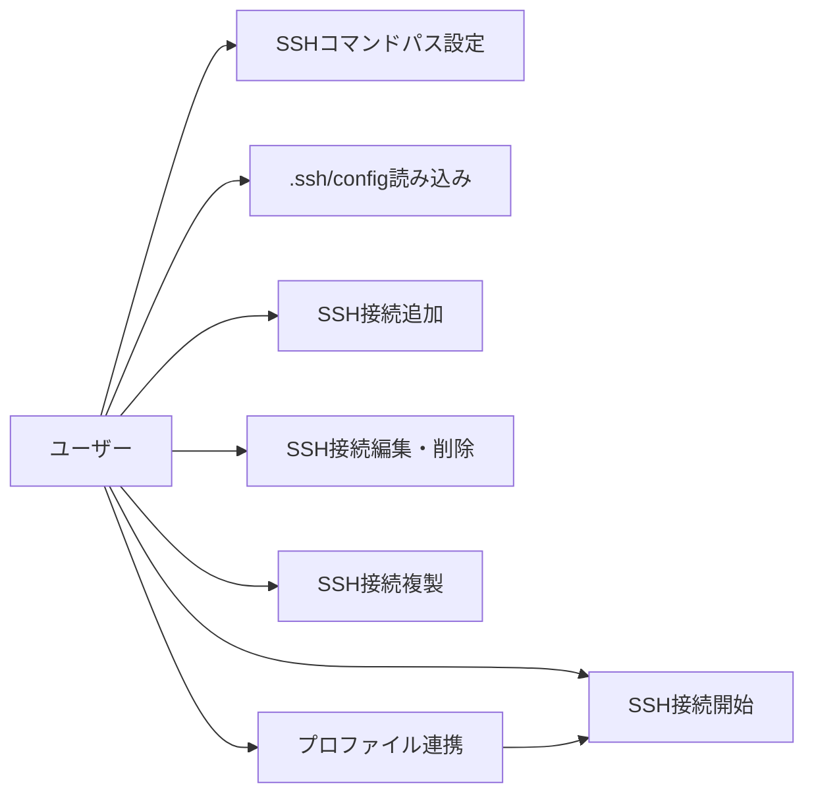
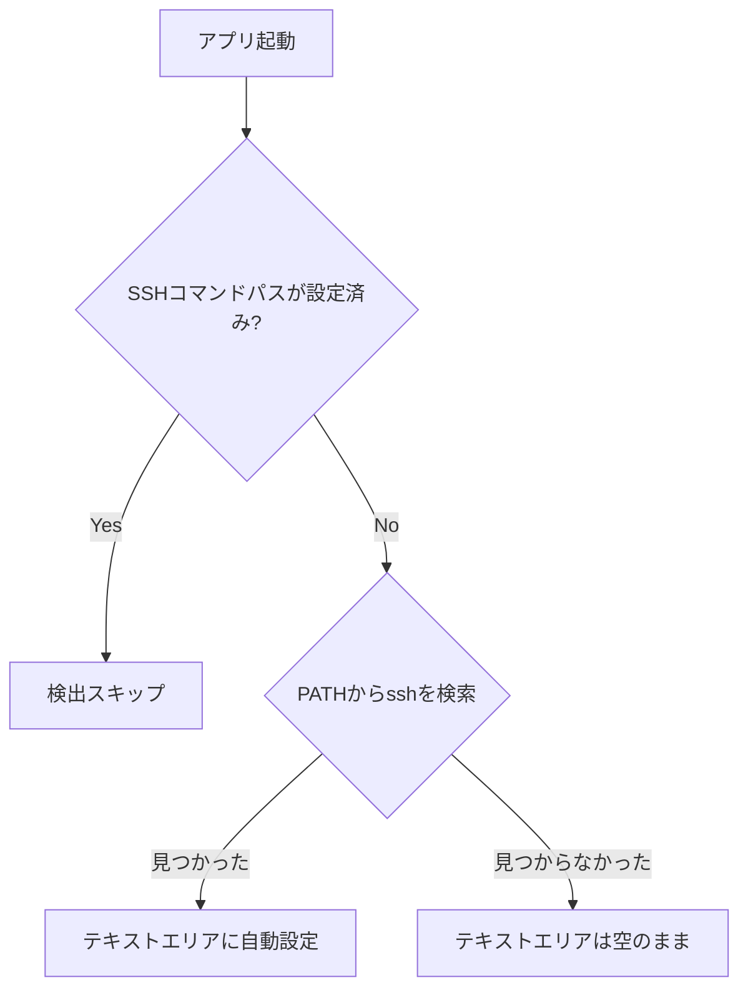
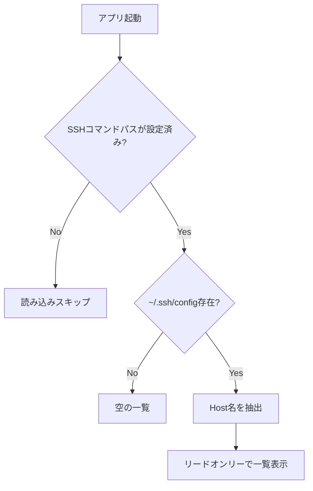
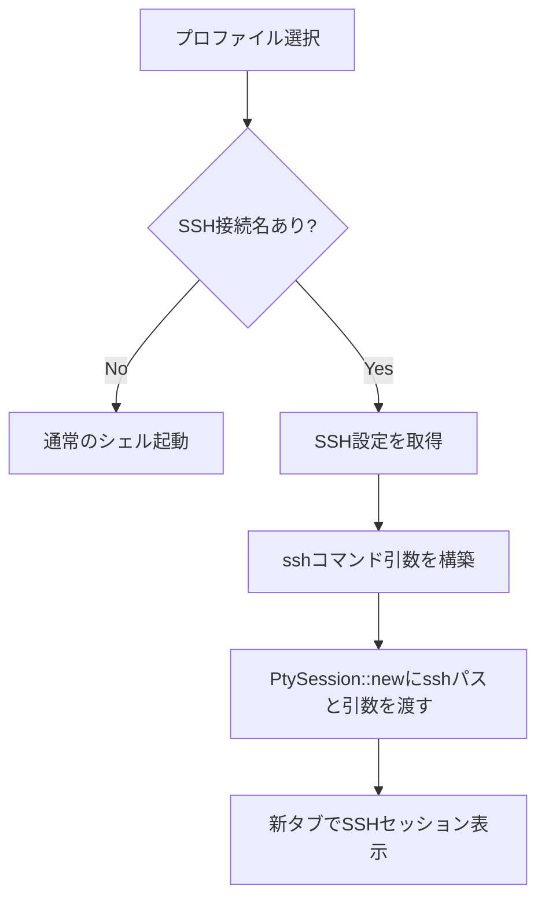
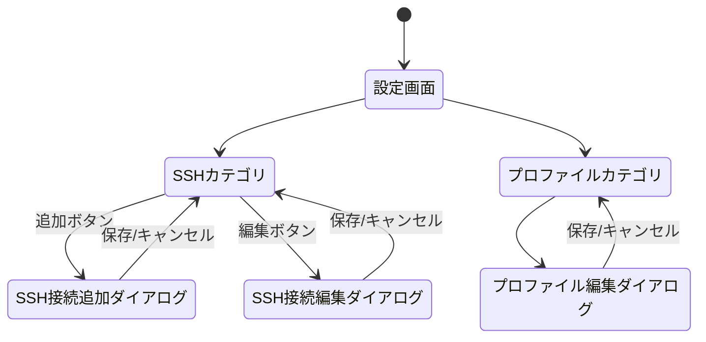
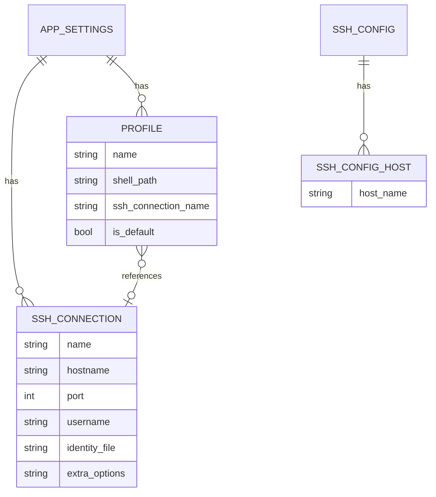

# SSH接続機能 - 要件定義書

## 1. 概要

### 1.1 背景
eMtermはターミナルエミュレータとして動作しているが、SSH接続のためにはユーザーが手動でsshコマンドを入力する必要がある。GUIからSSHホストを選んで接続できる機能が求められている。

### 1.2 目的
- opensshコマンドを利用したSSH接続機能をeMtermに統合する
- .ssh/configの自動読み込みによる接続情報の活用
- eMterm独自のSSH接続設定の管理
- プロファイル機能との連携による+アイコンからの簡易接続

### 1.3 スコープ
- SSHコマンドパスの自動検出と設定
- ~/.ssh/config の読み込みとホスト一覧表示
- eMterm設定でのSSH接続情報の追加・編集・削除・複製
- プロファイルからSSH設定を参照して接続
- Linux/Windows対応

## 2. ビジネス要件

### 2.1 ビジネス目標
ターミナルエミュレータとしての利便性向上。GUIからのSSH接続管理により、複数のリモートホストへの接続を効率化する。

### 2.2 対象ユーザー
| ユーザータイプ | 説明 |
|----------------|------|
| 開発者 | 複数のリモートサーバーに日常的にSSH接続するユーザー |
| システム管理者 | 多数のサーバーを管理し、頻繁にSSH接続するユーザー |

### 2.3 期待される効果
- SSH接続の開始がGUI操作で完結する
- .ssh/configの既存設定をそのまま活用できる
- プロファイルとの連携により、ワンクリックでSSH接続できる

## 3. ユースケース

### 3.1 ユースケース一覧
| ID | ユースケース名 | アクター | 優先度 |
|----|----------------|----------|--------|
| UC01 | SSHコマンドパスの設定 | ユーザー | 高 |
| UC02 | .ssh/configからのホスト一覧表示 | ユーザー | 高 |
| UC03 | SSH接続情報の追加 | ユーザー | 高 |
| UC04 | SSH接続情報の編集・削除 | ユーザー | 高 |
| UC05 | SSH接続情報の複製 | ユーザー | 中 |
| UC06 | プロファイルにSSH接続を関連付け | ユーザー | 高 |
| UC07 | プロファイルからSSH接続を開始 | ユーザー | 高 |

### 3.2 ユースケース詳細

#### UC01: SSHコマンドパスの設定

**アクター**: ユーザー

**事前条件**:
- eMtermが起動している

**基本フロー**:
1. eMterm起動時、SSHコマンドパス設定が空かどうか確認する
2. 空の場合、PATHからopensshコマンドを検索する
3. 見つかった場合、自動的にテキストエリアに設定する
4. 見つからない場合、テキストエリアは空のままとする

**代替フロー**:
- テキストエリアに値が設定済みの場合、起動時の自動検出をスキップする
- PATHに存在しない場所にopensshがある場合、ユーザーが手動でフルパスを入力する
- テキストエリアを手動で空にすれば、次回起動時に再検出が行われる

**事後条件**:
- SSHコマンドパスが設定されている、または空のまま（未検出）

#### UC02: .ssh/configからのホスト一覧表示

**アクター**: ユーザー

**事前条件**:
- SSHコマンドパスが設定されている
- ~/.ssh/config が存在する

**基本フロー**:
1. eMterm起動時に~/.ssh/configを読み込む
2. Host名を抽出する
3. SSH設定画面でリードオンリーの一覧として表示する

**代替フロー**:
- ~/.ssh/config が存在しない場合、.ssh/configセクションは空で表示する
- SSHコマンドパスが未設定の場合、.ssh/configの読み込みは行わない

**事後条件**:
- .ssh/configのHost一覧がUI上に表示されている

#### UC03: SSH接続情報の追加

**アクター**: ユーザー

**事前条件**:
- SSH設定画面が開かれている

**基本フロー**:
1. 追加ボタンをクリックする
2. モーダルダイアログが表示される
3. 接続情報（ホスト名、ポート、ユーザー名、秘密鍵パス、追加オプション）を入力する
4. 保存ボタンをクリックする
5. バリデーションを通過し、一覧に追加される

**代替フロー**:
- バリデーションエラー時、エラーメッセージを表示し再入力を促す

**事後条件**:
- 新しいSSH接続情報がeMterm設定に保存されている

#### UC04: SSH接続情報の編集・削除

**アクター**: ユーザー

**事前条件**:
- eMterm設定にSSH接続情報が存在する

**基本フロー（編集）**:
1. 一覧からeMterm設定のエントリを選択する
2. モーダルダイアログが表示される
3. 情報を変更し保存する

**基本フロー（削除）**:
1. 一覧からeMterm設定のエントリの削除ボタンをクリックする
2. エントリが削除される

**代替フロー**:
- .ssh/configのエントリは編集・削除不可（リードオンリー）

**事後条件**:
- 変更がeMterm設定に反映されている

#### UC05: SSH接続情報の複製

**アクター**: ユーザー

**事前条件**:
- SSH接続一覧にエントリが存在する

**基本フロー**:
1. .ssh/configエントリまたはeMterm設定エントリの複製ボタンをクリックする
2. 選択したエントリの情報がコピーされ、eMterm設定として新規エントリが作成される
3. .ssh/configからの複製の場合、Host名のみがコピーされる

**事後条件**:
- 新しいエントリがeMterm設定に追加されている

#### UC06: プロファイルにSSH接続を関連付け

**アクター**: ユーザー

**事前条件**:
- eMterm設定にSSH接続情報が存在する

**基本フロー**:
1. プロファイル編集画面を開く
2. 「SSH接続名」フィールドからSSH接続設定を選択する
3. プロファイルを保存する

**代替フロー**:
- SSH接続名を空にすれば、通常のローカルシェルプロファイルに戻る

**事後条件**:
- プロファイルにSSH接続名が関連付けられている

#### UC07: プロファイルからSSH接続を開始

**アクター**: ユーザー

**事前条件**:
- SSH接続が関連付けられたプロファイルが存在する
- SSHコマンドパスが設定されている

**基本フロー**:
1. +アイコンをクリックする
2. プロファイル一覧が表示される
3. SSH接続プロファイルを選択する
4. SSHコマンドがPTYセッションとして起動される
5. 新しいタブでSSH接続が開かれる

**事後条件**:
- SSHセッションが新しいタブで開かれている



## 4. 機能要件

### 4.1 機能一覧
| ID | 機能名 | 説明 | 優先度 |
|----|--------|------|--------|
| F01 | SSHコマンド自動検出 | 起動時にPATHからopensshを検索し設定する | 高 |
| F02 | .ssh/config読み込み | ~/.ssh/configからHost名を抽出して一覧表示する | 高 |
| F03 | SSH接続情報管理 | SSH接続情報のCRUDとeMterm設定への永続化 | 高 |
| F04 | SSH接続情報の複製 | .ssh/configエントリやeMtermエントリの複製 | 中 |
| F05 | プロファイル連携 | プロファイルにSSH接続名フィールドを追加 | 高 |
| F06 | SSH PTYセッション起動 | sshコマンドをPTYセッションとして新タブで起動 | 高 |
| F07 | SSH設定UI | 設定画面にSSHカテゴリを追加 | 高 |

### 4.2 機能詳細

#### F01: SSHコマンド自動検出

**説明**: アプリ起動時にSSHコマンドのパスを自動検出する

**処理フロー**:


**プラットフォーム差異**:
- Linux: `which ssh` またはPATH検索
- Windows: `where ssh.exe` または `C:\Windows\System32\OpenSSH\ssh.exe` を確認

#### F02: .ssh/config読み込み

**説明**: ~/.ssh/config からHost名のみを読み取り、リードオンリーの一覧として表示する

**処理フロー**:


**ビジネスルール**:
- .ssh/configの情報はリードオンリー
- 起動時に毎回読み込む（SSHコマンドパスが設定されている場合のみ）
- Host名のみ抽出（HostName, Port等の詳細はopensshに委任）

#### F03: SSH接続情報管理

**説明**: eMterm設定でSSH接続情報を追加・編集・削除する

**入力**:
- name: String - 接続名（識別用）
- hostname: String - ホスト名（必須）
- port: u16 - ポート番号（デフォルト: 22）
- username: String - ユーザー名
- identity_file: String - 秘密鍵のパス
- extra_options: String - 追加SSHオプション

**バリデーション**:
| 項目 | ルール | エラーメッセージ |
|------|--------|------------------|
| hostname | 空でないこと | ホスト名は必須です |
| port | 1-65535 | ポート番号は1-65535の範囲で指定してください |
| identity_file | 指定時にファイルが存在すること | 指定された秘密鍵ファイルが見つかりません |

#### F04: SSH接続情報の複製

**説明**: 既存のSSH接続情報をeMterm設定にコピーする

**ビジネスルール**:
- .ssh/configエントリの複製: Host名のみがコピーされ、eMterm設定の新エントリとして作成される
- eMterm設定エントリの複製: 全フィールドがコピーされる
- 複製後は独立したエントリとなり、元のエントリの変更の影響を受けない

#### F05: プロファイル連携

**説明**: 既存のプロファイルにSSH接続名フィールドを追加し、SSH設定を参照できるようにする

**ビジネスルール**:
- SSH接続名はeMterm設定のSSHエントリのみ参照可能（.ssh/configエントリは直接参照不可）
- SSH接続名が空の場合は通常のローカルシェルプロファイルとして動作する
- 参照先のSSH設定が削除された場合の扱いは、接続時にエラー表示とする

#### F06: SSH PTYセッション起動

**説明**: SSH接続プロファイル選択時に、sshコマンドをPTYセッションとして起動する

**処理フロー**:


**コマンド構築例**:
```
/usr/bin/ssh -p 22 -i ~/.ssh/id_rsa user@hostname
```

**ビジネスルール**:
- パスワードは保持しない（接続時にopensshが端末上で入力を求める）
- 切断時は通常のシェル終了と同じ扱い
- 認証はすべてopensshに委任する

## 5. 非機能要件

### 5.1 パフォーマンス要件
- SSHコマンドパスの自動検出: 起動時に1秒以内に完了すること
- .ssh/config の読み込み: 1秒以内に完了すること
- SSH接続開始: プロファイル選択後2秒以内にPTYセッションが起動すること

### 5.2 セキュリティ要件
- パスワードをeMterm設定に保存しない
- 秘密鍵のパスは設定に保存するが、秘密鍵の内容は読み取らない
- .ssh/configの内容はHost名のみ読み取る

### 5.3 互換性要件
- Linux: openssh-client パッケージのsshコマンド
- Windows: Windows標準のOpenSSH (C:\Windows\System32\OpenSSH\ssh.exe)

### 5.4 保守性要件
- ログ出力: SSH検出結果、.ssh/config読み込み結果、接続試行をログに出力する
- エラー時は適切なエラーメッセージをユーザーに表示する

## 6. UI/UX要件

### 6.1 画面設計要件

**SSH設定カテゴリ**:
1. SSHコマンドパス: テキスト入力フィールド（自動検出結果または手動入力）
2. SSH接続一覧:
   - .ssh/configセクション: リードオンリー、視覚的に区別された一覧
   - eMterm設定セクション: 編集・削除・複製可能な一覧
3. 追加ボタン: モーダルダイアログで新規SSH接続情報を入力
4. 複製ボタン: 各エントリに配置、eMterm設定にコピー

**プロファイル編集ダイアログ**:
- 既存フィールドに加え「SSH接続名」セレクトボックスを追加
- eMterm設定のSSH接続名一覧から選択

### 6.2 画面遷移


## 7. データ要件

### 7.1 データモデル概要


### 7.2 データ項目
| エンティティ | 項目名 | 型 | 必須 | 説明 |
|--------------|--------|-----|------|------|
| SshConnection | name | String | ○ | 接続名（識別用） |
| SshConnection | hostname | String | ○ | ホスト名 |
| SshConnection | port | u16 | ○ | ポート番号（デフォルト22） |
| SshConnection | username | String | × | ユーザー名 |
| SshConnection | identity_file | String | × | 秘密鍵のパス |
| SshConnection | extra_options | String | × | 追加SSHオプション |
| Profile | ssh_connection_name | String | × | SSH接続名（空の場合ローカルシェル） |

### 7.3 データ保持期間
| データ種別 | 保持期間 |
|------------|----------|
| SSH接続設定 | settings.jsonに永続化 |
| .ssh/configホスト | 起動時に毎回読み込み（キャッシュなし） |

## 8. 外部連携

### 8.1 連携システム
| システム名 | 連携方法 | データ |
|------------|----------|--------|
| openssh | プロセス起動 | SSHコマンドと引数 |
| ~/.ssh/config | ファイル読み込み | Host名の抽出 |

## 9. 制約条件

### 9.1 技術的制約
- opensshコマンドに依存する（libssh等のライブラリは使用しない）
- パスワード認証時のパスワードはopensshの端末入力に委任する
- .ssh/configのパスは ~/.ssh/config に固定

### 9.2 ビジネス上の制約
- macOSはサポート対象外（Linux/Windowsのみ）

## 10. 想定される課題とリスク

### 10.1 技術的課題
| 課題 | 影響度 | 対応策 |
|------|--------|--------|
| .ssh/configのパース | 中 | Host行のみを正規表現で抽出するシンプルな実装 |
| Windows環境でのSSH検出 | 中 | C:\Windows\System32\OpenSSH\ssh.exe を優先的にチェック |
| 秘密鍵パスの ~ 展開 | 低 | Rustのhome crateまたはplatform固有の展開処理 |

## 11. 成功基準

### 11.1 受け入れ基準
- [ ] 起動時にSSHコマンドが自動検出される
- [ ] .ssh/configのHost一覧がリードオンリーで表示される
- [ ] SSH接続情報の追加・編集・削除・複製ができる
- [ ] プロファイルにSSH接続を関連付けられる
- [ ] +アイコンからSSHプロファイルを選択してSSH接続が開始できる
- [ ] SSH接続が新タブで開かれる
- [ ] 切断時は通常のシェル終了と同じ挙動をする

## 12. テストシナリオ

### 12.1 テスト観点
- [ ] 正常系: SSHコマンドの自動検出（PATH上に存在する場合）
- [ ] 正常系: .ssh/config からのHost読み込み
- [ ] 正常系: SSH接続情報のCRUD操作
- [ ] 正常系: 複製機能（.ssh/configから、eMterm設定から）
- [ ] 正常系: プロファイルとSSH設定の関連付け
- [ ] 正常系: PTYセッションとしてのSSH接続開始
- [ ] 異常系: SSHコマンドが見つからない場合
- [ ] 異常系: .ssh/configが存在しない場合
- [ ] 異常系: バリデーションエラー（空ホスト名、不正ポート、存在しない秘密鍵）
- [ ] 異常系: 参照先SSH設定が削除された状態でプロファイルから接続試行
- [ ] 境界値: ポート番号1, 65535
- [ ] セキュリティ: パスワードが設定に保存されていないことの確認

## 13. 用語定義

| 用語 | 定義 |
|------|------|
| SSH接続情報 | eMterm設定に保存されるSSH接続先の設定（ホスト名、ポート等） |
| .ssh/configエントリ | ~/.ssh/configから読み込まれたリードオンリーのHost情報 |
| SSH接続名 | プロファイルからSSH接続情報を参照するための識別名 |

## 14. 確認事項

### 14.1 確認済み事項

- [x] SSH接続はopensshコマンドをPTYセッションとして起動する方式
- [x] 起動時にSSHコマンドパスを自動検出、設定済みならスキップ
- [x] .ssh/configからはHost名のみ読み取り、詳細はopensshに委任
- [x] .ssh/configのパスは ~/.ssh/config に固定
- [x] .ssh/configのエントリはリードオンリー、起動時に毎回読み込み
- [x] eMterm設定でSSH接続情報を追加・編集・削除可能
- [x] .ssh/configエントリとeMterm設定エントリの複製機能あり
- [x] プロファイルに「SSH接続名」フィールドを追加しSSH設定を参照
- [x] +アイコン → プロファイル選択 → SSH接続で新タブ
- [x] 設定画面にProfilesの隣にSSHカテゴリを追加
- [x] パスワードは保持しない（opensshの端末入力に委任）
- [x] SSH切断時は通常のシェル終了と同じ扱い
- [x] 認証はすべてopensshに委任
- [x] 秘密鍵パスが指定されている場合はファイル存在チェックを行う
- [x] モーダルダイアログ形式でSSH接続情報を追加・編集
- [x] SSHコマンドパスのクリアボタンは不要（手動で空にすれば再検出）
- [x] Linux: which ssh またはPATH検索
- [x] Windows: where ssh.exe または C:\Windows\System32\OpenSSH\ssh.exe
- [x] Git for Windows同梱のsshは検出対象外

### 14.2 未確認・保留事項
- なし
