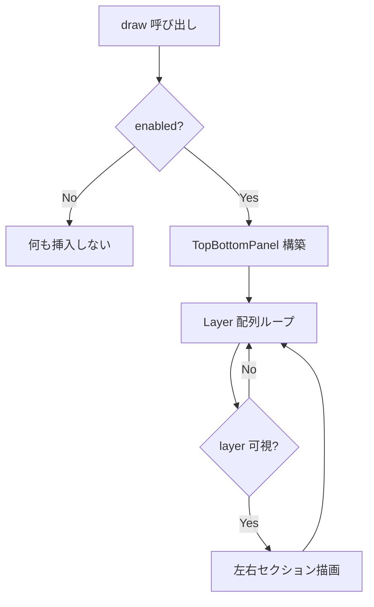
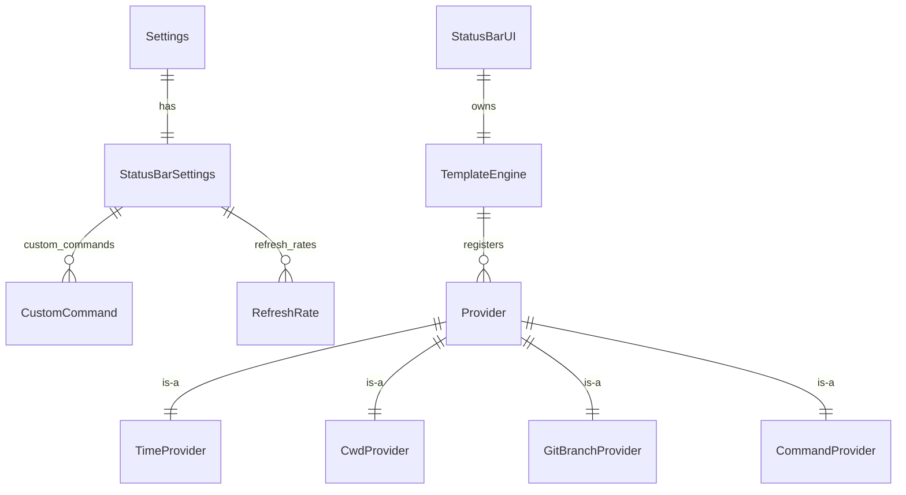

# Status Bar Native Port (egui) - 要件定義書

## 1. 概要

### 1.1 背景

native-poc は WebView 版から egui ベースのネイティブ実装へ移行中である。Phase 4-D で最小限のステータスバー（mux 由来 left/right + ローカル時計のみ）は実装済みだが、WebView 版 (`src/status-bar/`) が持つ以下の機能はまだネイティブに移植されていない:

- テンプレートエンジン (`{time}` `{cwd}` `{git_branch}` `{cmd:*}`)
- TimeProvider / CwdProvider / GitBranchProvider / CommandProvider
- App Line 2（2 行目）の対応
- OSC 777;statusbar の受信ルート
- HTML サブセットの解釈（`<span style="color:...">` 等）

native-poc の Go/No-Go 基準は「WebView 版にあった機能はすべて維持」かつ「パフォーマンス改善」が両立すること。機能パリティを満たさないと PoC は失格となる。

### 1.2 目的

WebView 版ステータスバーの全機能を native-poc (egui) 側に移植し、機能パリティを確保する。同時に、後続フェーズで Markdown viewer のネイティブ移植を行う際に再利用できる HTML パーサー共通基盤を整備する。

### 1.3 スコープ

**含むもの:**

1. テンプレートエンジン（`{time}` `{cwd}` `{git_branch}` `{cmd:name}`）の Rust 実装
2. Variable Provider 4 種（Time / Cwd / GitBranch / Command）の Rust 実装
3. App Line 2（2 行目）対応 — 既存の Line 1 と並行
4. OSC 777;statusbar 受信ルート（`OscLayerController` 相当のネイティブ実装）
5. HTML パーサー共通基盤 — status-bar 用インライン要素サブセット
6. `Settings` 構造体への新フィールド追加（template / font_size / custom_commands / refresh_rates）
   - **デフォルト値のみ使用**。`settings.json` loader は Phase 7 で別途実装

**含まないもの:**

- 設定 UI（egui の設定パネル） — Phase 7 まで保留
- `settings.json` loader 本体 — Phase 7 まで保留
- Markdown viewer 本体の HTML レンダリング機能 — 別タスク
  - ただし HTML パーサーは Markdown viewer 用にブロック要素を後追いできる設計とする

## 2. ビジネス要件

### 2.1 ビジネス目標

WebView 版の全機能を native-poc に移植して PoC Go 判定を取得し、native-poc を本番ブランチへマージする道筋を開ける。

### 2.2 対象ユーザー

| ユーザータイプ | 説明 |
|----------------|------|
| eMterm エンドユーザー | ステータスバーを設定 ON にして時計・カレントディレクトリ・git ブランチを常時参照する開発者 |
| シェルスクリプト開発者 | `OSC 777;statusbar` を使ってカスタム情報をステータスバーに表示する CI / 監視スクリプト作者 |
| mux ユーザー | mux daemon から push される左右ステータス（ホスト名・ウィンドウリスト等）を表示する利用者 |
| eMterm コントリビュータ | 将来 Markdown viewer をネイティブ移植する際に HTML パーサーを再利用する開発者 |

### 2.3 期待される効果

- WebView 版とのステータスバー機能パリティ達成（PoC Go 条件のひとつを満たす）
- ネイティブ実装によりステータスバー更新が WebView レイアウトと独立し、入力レイテンシ・描画コストを抑制
- HTML パーサーが共通基盤化され、Markdown viewer 移植時の二度書きを回避

## 3. ユースケース

### 3.1 ユースケース一覧

| ID | ユースケース名 | アクター | 優先度 |
|----|----------------|----------|--------|
| UC01 | ステータスバーを設定 ON にして時計と cwd を表示する | エンドユーザー | 高 |
| UC02 | テンプレートに `{git_branch}` を含めて dirty/clean 色を確認する | 開発者 | 高 |
| UC03 | カスタムコマンド (`{cmd:name}`) を 2 行目に表示する | パワーユーザー | 中 |
| UC04 | シェルスクリプトから `OSC 777;statusbar;set;left;...` で外部情報を流し込む | スクリプト開発者 | 高 |
| UC05 | mux 接続中に daemon の左右ステータス（3 段目）を見ながら、Line 1/2 のローカルテンプレートも並走する | mux ユーザー | 高 |
| UC06 | 将来の Markdown viewer 実装者が同じ HTML パーサーを再利用する | コントリビュータ | 中（将来） |

### 3.2 ユースケース詳細

#### UC01: ステータスバーで時計と cwd を表示

**アクター**: エンドユーザー

**事前条件**:
- native-poc が起動している
- `settings.statusbar.enabled = true` （Phase 7 まではデフォルト true）

**基本フロー**:
1. ユーザーが native-poc を起動する
2. ステータスバー (App Line 1) が画面下部に表示される
3. 左セクションに現在時刻 (`HH:mm:ss`)、右セクションに cwd の basename が描画される
4. シェルでディレクトリ移動するとステータスバーの cwd が更新される（OSC 7 受信契機）
5. 1 秒経過ごとに時計が更新される

**代替フロー**:
- 設定 OFF: パネル自体が挿入されず、ターミナルが全画面を占める
- OSC 7 を発行しないシェル: cwd が空文字となる（`{cwd}` 部分のみ消える）

**事後条件**:
- ターミナル描画 fps に影響を与えない

#### UC02: git ブランチを色付きで表示

**アクター**: 開発者

**事前条件**:
- カレントディレクトリが git リポジトリ内
- テンプレートに `{git_branch}` が含まれている

**基本フロー**:
1. ユーザーが git リポジトリの作業ディレクトリでシェルを開く
2. `{git_branch}` がブランチ名（例: `main`）に解決される
3. リポジトリが clean ならテーマの primary 色、dirty なら warning 色、untracked のみなら dim 色で表示される
4. ファイルを変更すると次のポーリング（既定 5000ms）で色が dirty に変わる

**代替フロー**:
- 非 git ディレクトリ: ブランチ名が空文字、色も無し（描画されない）
- `git` 実行不可: ブランチ名が空文字、デバッグログ出力

**事後条件**:
- git コマンド実行はバックグラウンドスレッドで行われ、UI スレッドをブロックしない

#### UC03: カスタムコマンドの表示

**アクター**: パワーユーザー

**事前条件**:
- `Settings::default()` 値の段階では空のため、デフォルトでは UC03 は使われない
- 将来的に Phase 7 で `settings.json` から `custom_commands` が読み込まれる前提で API を整備する

**基本フロー**:
1. テンプレートに `{cmd:battery}` 等を含める
2. `custom_commands["battery"] = CustomCommand { executable: "/usr/bin/acpi", interval_ms: 5000 }` が設定される
3. interval_ms ごとに executable が引数なしで実行される
4. stdout の trim 結果がステータスバーに表示される

**代替フロー**:
- executable 起動失敗: 空文字を表示
- 5 秒以上応答が無い: プロセスを kill し、前回値を保持

**事後条件**:
- 引数渡しは禁止。`~/` のみホームディレクトリに展開される

#### UC04: OSC 777;statusbar 経由の外部入力

**アクター**: スクリプト開発者

**事前条件**:
- ステータスバーが有効

**基本フロー**:
1. シェルスクリプトが `printf '\033]777;statusbar;set;left;Hello\033\\'` を出力
2. native-poc の OSC ハンドラがこれを受信
3. HTML タグを **完全に剥がし**た上で OSC レイヤー（3 段目）の left に "Hello" を表示
4. `\033]777;statusbar;clear\033\\` で OSC レイヤーがクリアされる
5. `show` / `hide` でレイヤー表示/非表示が制御される

**代替フロー**:
- 不正なコマンド: 黙ってデバッグログに記録
- 空コンテンツ: 該当セクションが空になり、左右とも空ならレイヤー非表示

**事後条件**:
- OSC 経由コンテンツは XSS 防止のため HTML タグを許可しない

#### UC05: mux 接続中の 3 段並行表示

**アクター**: mux ユーザー

**事前条件**:
- 既存の mux daemon に接続済み
- `mux_status_state` (StatusUpdateMsg) を受信中

**基本フロー**:
1. mux daemon から `StatusUpdateMsg { left, right }` が APC 経由で push される
2. ネイティブ側はこれを OSC レイヤー（3 段目）に表示
3. 同時に App Line 1/2 はクライアント側テンプレートで解決される
4. 3 段は同じバーに見えるよう背景色を共通化し、レイヤー境界を浮かせない

**代替フロー**:
- mux 切断: OSC レイヤーがクリアされる（`exitMuxMode` 相当）
- Line 1/2 が空: 該当行は描画されない

**事後条件**:
- daemon 側テンプレート解決（`StatusBarEngine::resolve_template`）とクライアント側テンプレート解決は**役割を分担**し、二重解決しない

## 4. 機能要件

### 4.1 機能一覧

| ID | 機能名 | 説明 | 優先度 |
|----|--------|------|--------|
| F01 | レイヤー構造 (3 段) | OSC / App Line 1 / App Line 2 を上下に積む。空レイヤーは描画しない | 高 |
| F02 | テンプレートエンジン | `{var}` `{cmd:name}` パターン抽出と解決 | 高 |
| F03 | TimeProvider | フォーマット指定で時計値を返す | 高 |
| F04 | CwdProvider | OSC 7 から得た cwd の basename を返す | 高 |
| F05 | GitBranchProvider | ブランチ名 + 状態色を返す（非同期実行） | 高 |
| F06 | CommandProvider | カスタム executable を間隔実行し stdout を返す | 中 |
| F07 | OSC 777;statusbar 受信ルート | set / clear / show / hide / clear left/right | 高 |
| F08 | HTML パーサー共通基盤 | インライン要素サブセットを AST 化 | 高 |
| F09 | HTML サニタイザ | OSC 経路で全タグ剥がし | 高 |
| F10 | Settings 拡張 | template / time_format / refresh_rates / custom_commands / font_size 追加 | 高 |
| F11 | mux 統合維持 | 既存 StatusUpdateMsg ルートと共存 | 高 |
| F12 | レイヤー可視性自動制御 | OSC / Line 2 は内容が空なら非表示 | 高 |

### 4.2 機能詳細

#### F01: レイヤー構造（3 段）

**説明**: 既存 WebView 版と同じ 3 段構造を egui の `TopBottomPanel` 上に再現する。

- **OSC レイヤー** (1 段目): mux daemon の `StatusUpdateMsg.left/right` または OSC 777;statusbar からのコンテンツ。空なら非表示。
- **App Line 1** (2 段目): `statusbar.app_line1_left` / `_right` テンプレート。常時表示（ステータスバー全体が有効な場合）。
- **App Line 2** (3 段目): `statusbar.app_line2_left` / `_right` テンプレート。空なら非表示。

**ビジネスルール**:
- 3 段全体で 1 つのバーに見せる（背景・border で個別レイヤーを浮かせない）
- 開閉アニメーションは持たない（既存方針に従う）
- ステータスバー全体の挿入位置は `settings.statusbar.position`（Top / Bottom、既存）

**処理フロー**:


#### F02: テンプレートエンジン

**説明**: テンプレート文字列を解析し、登録された Provider で `{var}` を置換する。

**入力**:
- `template: &str` — `"{time} | {cwd}"` 等
- 登録済み Provider マップ

**出力**:
- 解決後文字列（HTML 含む可能性あり）

**処理フロー**:
1. 正規表現 `\{([a-zA-Z_][a-zA-Z0-9_]*(?::[a-zA-Z0-9_-]+)?)\}` で変数を抽出
2. 各変数について Provider を引いて `get_value()` 呼び出し
3. Provider が色情報を返す場合は `<span style="color:..."></span>` でラップ
4. 未知の変数は空文字に置換

**ビジネスルール**:
- 変数名は英数字 + `_` 開始、続けて英数字 / `_`
- `:name` 形式（`cmd:foo`）は名前部分に英数字 / `_` / `-` を許容
- 結果は HTML パーサーに渡るため、Provider が返す色情報は CSS 互換の `#RRGGBB` / `rgb(...)` / 名前付き色

#### F03: TimeProvider

**説明**: 現在時刻を `time_format` トークン置換で文字列化する。

**サポートするフォーマットトークン**:
- `YYYY`: 4 桁年
- `MM`: 2 桁月
- `DD`: 2 桁日
- `HH`: 24 時間制 2 桁時
- `hh`: 12 時間制 2 桁時
- `mm`: 2 桁分
- `ss`: 2 桁秒
- `A`: AM/PM

**ビジネスルール**:
- ローカル時刻を使用（`libc::localtime_r` on unix, Windows は `GetLocalTime` 相当）
- 既定フォーマット: `"HH:mm:ss"`
- トークン置換は長い順に行い、部分一致を回避

#### F04: CwdProvider

**説明**: OSC 7 経由で受け取った cwd を保持し、basename を返す。

**入力ソース**:
- `NativeCallbackState.cwd` — OSC 7 受信時に `NativeCallbacks::handle_cwd` が更新
- アクティブ tab の `cb_state` を `App` 経由で参照

**ビジネスルール**:
- `file://host/path` URI 形式を分解（host 部分を捨ててパス部分を取り出し、percent-decode）
- Windows パス (`C:\foo\bar`) と Unix パス (`/foo/bar`) の両方に対応
- 末尾スラッシュは除去（ただし root `/` は保持）
- 基本名のみ表示
- OSC 7 未受信の場合は空文字

#### F05: GitBranchProvider

**説明**: アクティブ tab の cwd でバックグラウンド git コマンドを定期実行し、ブランチ名と状態色を返す。

**実行コマンド**:
- `git rev-parse --abbrev-ref HEAD` → ブランチ名
- `git status --porcelain` → 状態判定

**状態 → 色マッピング**:
| 状態 | 判定条件 | 色（CSS） |
|------|----------|-----------|
| clean | porcelain 出力が空 | `#4caf50`（テーマ primary 相当） |
| dirty | 非 `??` 行が 1 つ以上 | `#f9a825`（warning） |
| untracked | `??` のみ | `#9e9e9e`（dim） |
| 空 | git 不在 / 失敗 | 色なし（render 時テキストも空） |

**処理方式**:
- 専用ワーカースレッドで `std::process::Command` を起動
- タイムアウト 5 秒、超過時は `Child::kill()` し前回値を保持
- 結果は `Arc<Mutex<GitState>>` で共有、UI スレッドは lock-and-copy で読む
- ポーリング間隔は `settings.statusbar.refresh_rates["git_branch"]`（既定 5000ms）

**ビジネスルール**:
- native-poc は tokio を使用しない（既存依存構成を維持）
- スレッド数は variable ごとに 1 つに制限（同名 provider の二重生成を避ける）
- tab 切替時はアクティブ tab の cwd を参照（cwd 変化時は次の tick で再判定）

#### F06: CommandProvider

**説明**: ユーザー定義の executable を間隔実行して stdout を表示する。

**ビジネスルール**:
- `executable` は単一パスのみ。引数渡し / シェル展開禁止
- `~/` のみホームディレクトリに展開
- `interval_ms` は最低 1000ms にクランプ
- stdout を `trim` した結果を value とする
- 複数行出力の場合は最初の行を採用
- タイムアウト 5 秒、超過時は kill し前回値保持
- 同名 provider は 1 つだけ起動

**バリデーション**:
| 項目 | ルール | 失敗時 |
|------|--------|--------|
| name | `[a-zA-Z0-9_-]+` | 不正名は登録拒否、warn ログ |
| executable | 絶対パスまたは `~/` から始まる | パス解決失敗時は空文字 + warn ログ |
| interval_ms | u64 | < 1000 は 1000 にクランプ |

#### F07: OSC 777;statusbar 受信ルート

**説明**: `OSC 777;statusbar;<command>[;<arg>[;<arg>]]` を受信し、OSC レイヤーを制御する。

**入力経路**:
1. PTY → `TerminalCore::process_pty_data` → OSC ハンドラ
2. `NativeCallbacks::on_osc(action_type=100, data=...)`
3. data の先頭が `statusbar;` で始まる場合、ステータスバー OSC として処理
4. それ以外（既存の viewer / markdown / image）はそのまま `osc_queue` へ

**サポートコマンド**:

| Raw | 意味 |
|-----|------|
| `statusbar;set;left;<content>` | OSC レイヤー左にセット（自動 show） |
| `statusbar;set;right;<content>` | OSC レイヤー右にセット（自動 show） |
| `statusbar;clear` | 左右両方クリア |
| `statusbar;clear;left` | 左のみクリア |
| `statusbar;clear;right` | 右のみクリア |
| `statusbar;show` | レイヤーを強制 show |
| `statusbar;hide` | レイヤーを強制 hide |

**エラーケース**:
| エラー | 条件 | 対応 |
|--------|------|------|
| 不明なコマンド | `statusbar;wat;...` | デバッグログ出力、無視 |
| set にコンテンツ無し | `statusbar;set;left` | 空文字を set（= 空セクション） |
| 不正な section | `statusbar;set;middle;x` | デバッグログ出力、無視 |

**ビジネスルール**:
- コンテンツは **HTML タグを完全に剥がす**（XSS 対策、既存 `stripHtmlTags` と等価）
- mux 接続時の `StatusUpdateMsg` も同じ OSC レイヤーに書き込む（既存ルート互換）
  - daemon 由来コンテンツは別の経路（APC）で来るが書き込み先は同じ
  - daemon 側で既にテンプレート解決済みなので二重解決は発生しない

#### F08: HTML パーサー共通基盤

**説明**: status-bar 用と将来の Markdown viewer 用で再利用できる HTML パーサー。

**第一段階（status-bar 用）でサポートするサブセット**:

| カテゴリ | 要素 / 属性 |
|----------|--------------|
| インライン色付け | `<span style="color: #RRGGBB \| rgb(...) \| name">...</span>` |
| 強調 | `<b>` `<strong>` `<i>` `<em>` `<u>` |
| HTML エンティティ | `&amp;` `&lt;` `&gt;` `&quot;` `&apos;` `&#NN;` |
| 改行 | `<br>` / `<br/>` |

**第二段階（Markdown viewer 用、後続フェーズ）への拡張ポイント**:
- ブロック要素（`<p>` `<div>` `<pre>` `<code>` `<ul>` `<ol>` `<li>` `<blockquote>`）
- 表組み（`<table>` `<tr>` `<td>` `<th>`）
- リンク (`<a href>`) / 画像 (``)
- ヘッダ (`<h1>` ... `<h6>`)

**出力形式**:
- AST: `Vec<Node>` 形式の構造化ツリー
- 各 Node は `Text(String)` / `Span { color, children }` / `Bold(children)` / `Italic(children)` / `Underline(children)` / `LineBreak`
- AST → egui `RichText` リスト変換ヘルパー（`to_rich_text_runs`）を同モジュールで提供
  - これにより呼び出し側（status_bar / 将来の markdown viewer）の二度書きを回避

**配置**:
- `native-poc/src/html/` モジュール内（独立 crate にはしない）
- 公開 API は `pub use crate::html::{parse, Node, to_rich_text_runs}` 想定

**セキュリティ**:
- パーサー自体は安全な AST を返すのみ。`<script>` / `<style>` タグは AST に含めない（コンテンツも捨てる）
- 未知のタグはテキストとして扱うか無視（実装方針: 未知タグ自体は捨て、子要素テキストは保持）

#### F09: HTML サニタイザ（OSC 経路用）

**説明**: OSC 777 経由のコンテンツから全 HTML タグを剥がして純テキストに変換する。

**ビジネスルール**:
- `<script>` `<style>` はタグとその内容ごと削除
- それ以外のタグは開始タグ / 終了タグを削除し、内容（テキスト）のみ残す
- HTML エンティティは元の文字に decode
- 非 HTML な `<` `>` （例: `1 < 2`）は保持

#### F10: Settings 拡張

**説明**: `crate::settings::Settings` に WebView 版相当のフィールドを追加。本タスクでは default 値のみを使用し、Phase 7 で `settings.json` から読み込まれる前提。

**追加フィールド** (`StatusBarSettings` に追加):
| フィールド | 型 | デフォルト | 説明 |
|------------|-----|------------|------|
| `app_line1_left` | `String` | `"{time}"` | Line 1 左テンプレート |
| `app_line1_right` | `String` | `"{cwd}"` | Line 1 右テンプレート |
| `app_line2_left` | `String` | `""` | Line 2 左テンプレート |
| `app_line2_right` | `String` | `""` | Line 2 右テンプレート |
| `time_format` | `String` | `"HH:mm:ss"` | TimeProvider のフォーマット |
| `font_size` | `Option<f32>` | `None` | 文字サイズ（None = UI 既定） |
| `custom_commands` | `HashMap<String, CustomCommand>` | `HashMap::new()` | カスタムコマンド定義 |
| `refresh_rates` | `HashMap<String, u64>` | `HashMap::new()` | 変数別更新間隔（ms） |

**`CustomCommand` 型**:
```rust
pub struct CustomCommand {
    pub executable: String,
    pub interval_ms: u64, // default 1000
}
```

**既定 refresh_rate**（`refresh_rates` に未指定の場合のフォールバック）:
- `time`: 1000ms
- `cwd`: 5000ms（イベント駆動も併用）
- `git_branch`: 5000ms
- `cmd:*`: `CustomCommand.interval_ms`

#### F11: mux 統合維持

**説明**: 既存の `StatusUpdateMsg` 受信ルート（`Tab::apply_mux_message` で `mux_status_state` を更新）はそのまま保持。

**役割分担**:
- **OSC レイヤー（3 段目）**: daemon が解決済みの `left` / `right` 文字列をそのまま表示。クライアント側でテンプレート再解決はしない
- **App Line 1/2**: クライアント側テンプレートエンジンで解決。daemon の知らない情報（ローカルカスタムコマンドなど）はここに置く

**ビジネスルール**:
- 同じ OSC レイヤーに対し、`StatusUpdateMsg` 経路と OSC 777 経路の両方が書き込み可能
- どちらが上書きしてもよい（後勝ち）。daemon と OSC 777 を同時に使う構成はユーザー責任
- mux 切断時は OSC レイヤーをクリア

#### F12: レイヤー可視性自動制御

**説明**: 左右セクションの内容が両方空のとき、該当レイヤーは描画しない。App Line 1 のみ常時表示。

**ビジネスルール**:
- OSC レイヤー: 左右両方空 → 非表示
- App Line 2: 左右両方空 → 非表示
- App Line 1: ステータスバー全体が有効なら常時表示

## 5. 非機能要件

### 5.1 パフォーマンス要件

- ターミナル描画 fps への影響: テンプレート評価 1 回あたり 1ms 未満
- git / カスタムコマンド実行は別スレッド、UI スレッドをブロックしない
- 同じ template 結果の再評価で差分なしの場合、レンダリングを skip（diff-render）

### 5.2 セキュリティ要件

- 入力検証:
  - OSC 経路: HTML タグを完全に剥がす（XSS 防止）
  - テンプレート経路: ユーザー設定なので HTML 許可、ただし HTML パーサーが `<script>` `<style>` を AST から除外
- カスタムコマンド:
  - 引数渡し禁止、シェル経由禁止
  - `~/` のみ展開、他のシェル展開は不可
- パス検証: `executable` 名 (`cmd:name` の `name`) は `[a-zA-Z0-9_-]+` のみ

### 5.3 可用性要件

- カスタムコマンド失敗時もステータスバー全体は描画継続
- git コマンド失敗時もブランチ部分のみ空文字、他の変数は通常動作

### 5.4 保守性要件

- ログ出力: 既存規約に従い `[LEVEL][BACKEND]` プレフィックス
- 単体テスト: テンプレートエンジン / 各 Provider / HTML パーサー / OSC ルーティング
- HTML パーサーは将来拡張ポイントを明示（trait or Node enum に variant 追加で対応可能な設計）

### 5.5 互換性要件

- Linux + Windows 対応（macOS なし）
- `libc::localtime_r` は `#[cfg(unix)]` で囲み、Windows は別実装
- 既存 native-poc の Phase 4-D ステータスバー（mux 表示 + 時計）と機能的に上位互換

## 6. UI/UX要件

### 6.1 画面設計要件

- 既存 WebView 版と同じレイアウト構造
- 各レイヤーは `TopBottomPanel` 内の 1 行
- 左右セクションは `Layout::left_to_right` / `Layout::right_to_left` で配置
- フォント: 等幅 (Monospace)、サイズは `font_size` 設定 or 既定（既存 12pt）

### 6.2 画面遷移

該当なし（ステータスバーは独立部品）

### 6.3 レスポンシブ対応

- ウィンドウ幅変化時、左右セクションが衝突する場合は左セクションが切り詰められる
- 改行は HTML パーサーが `<br>` を `\n` に変換した時のみ発生（ただし高さは 1 行で固定）

## 7. データ要件

### 7.1 データモデル概要



### 7.2 データ項目

| エンティティ | 項目名 | 型 | 必須 | 説明 |
|--------------|--------|-----|------|------|
| StatusBarSettings | enabled | bool | ○ | 全体トグル |
| StatusBarSettings | position | StatusBarPosition | ○ | Top / Bottom |
| StatusBarSettings | app_line1_left | String | ○ | テンプレート |
| StatusBarSettings | app_line1_right | String | ○ | テンプレート |
| StatusBarSettings | app_line2_left | String | ○ | テンプレート |
| StatusBarSettings | app_line2_right | String | ○ | テンプレート |
| StatusBarSettings | time_format | String | ○ | フォーマット文字列 |
| StatusBarSettings | font_size | Option\<f32\> | × | None = UI 既定 |
| StatusBarSettings | custom_commands | HashMap<String, CustomCommand> | ○ | 既定空 |
| StatusBarSettings | refresh_rates | HashMap<String, u64> | ○ | 既定空 |
| CustomCommand | executable | String | ○ | 単一パス |
| CustomCommand | interval_ms | u64 | ○ | ≥1000 |

### 7.3 データ保持期間

| データ種別 | 保持期間 |
|------------|----------|
| Provider 内部キャッシュ（cwd, git_branch, cmd 結果） | プロセスライフタイム |
| OSC レイヤーコンテンツ | 明示的 clear / 上書きまで |

## 8. 外部連携

### 8.1 連携システム

| システム名 | 連携方法 | データ |
|------------|----------|--------|
| mux daemon | APC `StatusUpdateMsg` | `{ left, right }` 文字列 (既存) |
| OS シェル | OSC 7 / OSC 777 シーケンス | cwd / statusbar コマンド |
| OS プロセス | `std::process::Command` | git / カスタム executable |

### 8.2 API仕様要件

- 内部 API のみ。外部公開 API なし。

## 9. 制約条件

### 9.1 技術的制約

- 言語: Rust 安定版
- UI: egui 0.29 / wgpu 22
- 依存追加は最小限。基本は標準ライブラリと既存依存（`parking_lot`, `crossbeam-channel`, `regex` 未導入なので避ける）で完結させる
  - 正規表現は手書きパーサーか、軽量代替 (`regex-lite` 等) を検討
- tokio 不使用（既存 native-poc に tokio 依存なし）
- macOS 非対応

### 9.2 ビジネス上の制約

- WebView 版機能を削減しない（PoC Go 条件）
- 既存の意図的デザイン制約を維持:
  - OSC レイヤーは他レイヤーと背景共通（浮かせない）
  - 開閉アニメーション無し

### 9.3 スケジュール制約

- Phase 7（settings.json loader）に依存しない形で完了させる

## 10. 想定される課題とリスク

### 10.1 技術的課題

| 課題 | 影響度 | 対応策 |
|------|--------|--------|
| 正規表現クレート未導入 | 中 | 軽量手書きパーサーまたは `regex-lite` を選定 |
| git コマンドの非同期実行 | 中 | 専用ワーカースレッド + タイムアウト join |
| HTML パーサーの拡張性 | 中 | Node enum に variant 追加で対応する設計、初期は status-bar 用サブセット |
| OSC 777 既存ペイロード (viewer/markdown/image) との競合 | 高 | `statusbar;` プレフィックスで dispatch 分岐 |
| カスタムコマンドのプロセスリーク | 高 | `Drop` で `kill` を呼ぶ wrapper を用意 |

### 10.2 ビジネスリスク

| リスク | 発生確率 | 影響度 | 対応策 |
|--------|----------|--------|--------|
| WebView 版との見た目が乖離 | 中 | 中 | 既存 UI Design Guidelines のトークンを再利用 |
| パフォーマンス改善が実感できない | 低 | 高 | UI スレッドブロック回避と diff-render を必須化 |

## 11. 成功基準

### 11.1 受け入れ基準

- [ ] 全 FR (F01-F12) が実装されテストパス
- [ ] WebView 版とのデフォルト表示が機能的に等価（time + cwd）
- [ ] OSC 777;statusbar の 7 コマンド全てが動作
- [ ] git_branch の dirty / clean / untracked で色が変わる
- [ ] mux 接続時に Line 1/2 と OSC レイヤー（3 段目）が併存表示
- [ ] HTML パーサーが status-bar サブセットを正しく AST 化
- [ ] OSC 経路で全 HTML タグが剥がれる（XSS テスト合格）
- [ ] cargo test (native-poc, html モジュール) が全件パス
- [ ] Linux + Windows 両方でビルド成功

### 11.2 KPI

| 指標 | 目標値 | 測定方法 |
|------|--------|----------|
| テンプレート評価コスト | < 1ms / frame | bench/profile |
| ステータスバー更新時のターミナル fps 低下 | < 1fps | UI 観察 |
| git コマンド UI スレッドブロック時間 | 0ms | スレッド設計上の保証 |

## 12. テストシナリオ

### 12.1 テスト観点

- [ ] 正常系: 全テンプレート変数の解決
- [ ] 正常系: OSC 777 の 7 コマンド全パターン
- [ ] 正常系: HTML パーサーで `<span style="color:#fff">x</span>` を AST 化
- [ ] 異常系: 不正な OSC コマンド → 無視 + ログ
- [ ] 異常系: 存在しない executable → 空文字
- [ ] 異常系: 5 秒タイムアウト → kill + 前回値保持
- [ ] 境界値: OSC レイヤーが両セクション空 → 非表示
- [ ] 境界値: `~/` パス展開
- [ ] 境界値: 12 時間制 / 24 時間制 / AM/PM トグル
- [ ] セキュリティ: OSC 経由 `<script>alert(1)</script>` → 完全除去
- [ ] セキュリティ: カスタムコマンド名に `;rm -rf` → バリデーション拒否
- [ ] パフォーマンス: ターミナル全画面更新中もステータスバー描画が継続
- [ ] mux 統合: StatusUpdateMsg 受信時に OSC レイヤー（3 段目）が更新される
- [ ] mux 統合: mux 切断時 OSC レイヤーがクリアされる
- [ ] mux 統合: Line 1/2 のローカルテンプレートと併存

## 13. 用語定義

| 用語 | 定義 |
|------|------|
| OSC | Operating System Command。ANSI エスケープシーケンスの一種 |
| OSC 777 | eMterm 独自拡張のシーケンス（viewer/markdown/image/statusbar） |
| OSC レイヤー | ステータスバーの 3 段目。daemon 由来 + OSC 777 由来コンテンツの表示先 |
| App Line | ステータスバーの 1 行目 / 2 行目。クライアント側テンプレートで解決 |
| Provider | テンプレート変数の値を提供するオブジェクト（Time / Cwd / Git / Command） |
| mux daemon | 別プロセスのターミナル多重化サーバー（tmux 相当） |
| StatusUpdateMsg | daemon → クライアントの IPC メッセージ。`{ left, right }` |
| native-poc | Tauri WebView 版から egui ネイティブ版への移行 PoC |

## 14. 確認事項

### 14.1 確認済み事項

- [x] **テンプレート二重解決の役割分担**: OSC レイヤー（3 段目）= daemon が解決済みのものを表示、App Line 1/2 = クライアント側でテンプレート解決。daemon と OSC 777 の両方が同じ OSC レイヤーに書き込めるが、同時利用はユーザー責任の後勝ち
- [x] **HTML パーサー第一段階のスコープ**: インライン要素 (`<span style="color">`, `<b>`, `<strong>`, `<i>`, `<em>`, `<u>`, `<br>`) と HTML エンティティのみ。表 / 画像 / リンクは第二段階（Markdown viewer 移植時）
- [x] **OSC 777;statusbar 受信ルート**: `NativeCallbacks::on_osc(action_type=OSC_EMTERM_EXTENSION=100, data)` で `data` が `statusbar;` で始まる場合に新たな statusbar dispatcher へ。既存の viewer/markdown/image ルートとは独立
- [x] **CwdProvider のソース**: `NativeCallbackState.cwd` (OSC 7 受信時に既に更新済み)。アクティブ tab の `cb_state` を `App` 経由で参照
- [x] **HTML パーサーの配置**: `native-poc/src/html/` モジュール（独立 crate にはしない）。Markdown viewer も同 native-poc 内に乗る予定なので分離不要
- [x] **共通基盤の責務範囲**: パーサー + AST に加え、egui `RichText` への変換ヘルパー (`to_rich_text_runs`) も同モジュール内に提供して呼び出し側の二度書きを回避
- [x] **GitBranchProvider の実行方式**: tokio を使わず、専用 OS スレッド + `std::process::Command` + 5 秒タイムアウト。結果は `Arc<Mutex<...>>` 共有
- [x] **Settings の loader はスコープ外**: 構造体フィールドの追加とデフォルト値のみ。Phase 7 で JSON loader が別途実装される
- [x] **OSC レイヤーのデザイン制約遵守**: 背景・border を他レイヤーと共通化（浮かせない）、開閉アニメーション無し

### 14.2 未確認・保留事項

- [ ] **正規表現クレート選定**: `regex-lite` を導入するか、手書きパーサーで済ませるかは実装計画で決定。仕様には依存しない
- [ ] **font_size 単位**: WebView 版は pt、native-poc 側は egui の Logical Point (lpx)。換算規約は実装で詰める

## 15. 参考資料

- WebView 版 SPEC: `doc/tasks/status-bar/SPEC.md`
- mux 統合 SPEC: `doc/tasks/mux-statusbar/SPEC.md`
- WebView 版実装: `src/status-bar/` 配下
- 既存 native-poc 実装: `native-poc/src/ui/status_bar.rs`, `native-poc/src/settings.rs::StatusBarSettings`
- 既存 OSC ハンドラ: `native-poc/src/callbacks.rs::NativeCallbacks::on_osc`
- mux daemon テンプレート: `src-tauri/src/mux/ipc/statusbar.rs::StatusBarEngine`
- UI Design Guidelines: `doc/UI-DESIGN-GUIDELINES.yaml`
- プロジェクトメモリ: status-bar デザイン制約 / native-poc Go 基準 / HTML パーサー再利用方針
