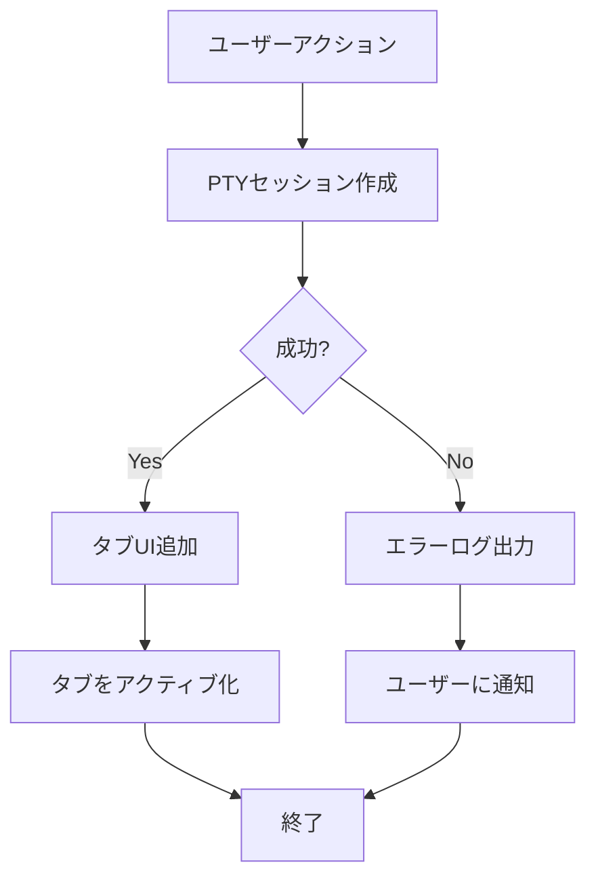
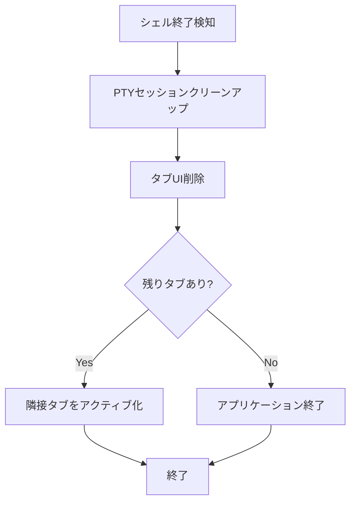

# タブバー機能 - 要件定義書

## 1. 概要

### 1.1 背景
eMtermは単一ターミナルセッションのみをサポートしており、複数のシェルセッションを同時に管理する機能がない。

### 1.2 目的
タブバー機能を追加し、複数のターミナルセッションを効率的に管理できるようにする。

### 1.3 スコープ
- タブバーUIの実装
- 複数PTYセッションの管理
- タブ操作（作成、切り替え、閉じる、並べ替え）
- キーボードショートカット
- 設定画面表示機能

## 2. ビジネス要件

### 2.1 ビジネス目標
ユーザーが複数のターミナルセッションを単一ウィンドウ内で効率的に管理できるようにする。

### 2.2 対象ユーザー
| ユーザータイプ | 説明 |
|----------------|------|
| 開発者 | 複数のターミナルを同時に使用する必要がある |
| システム管理者 | 複数のサーバー/サービスを監視する |

### 2.3 期待される効果
- 作業効率の向上
- ウィンドウ管理の簡素化
- キーボード操作による高速なタブ切り替え

## 3. ユースケース

### 3.1 ユースケース一覧
| ID | ユースケース名 | アクター | 優先度 |
|----|----------------|----------|--------|
| UC01 | 新規タブ作成 | ユーザー | 高 |
| UC02 | タブ切り替え | ユーザー | 高 |
| UC03 | タブを閉じる | システム | 高 |
| UC04 | タブ並べ替え | ユーザー | 中 |
| UC05 | 設定画面表示 | ユーザー | 中 |

### 3.2 ユースケース詳細

#### UC01: 新規タブ作成

**アクター**: ユーザー

**事前条件**:
- アプリケーションが起動している

**基本フロー**:
1. ユーザーが[+]ボタンをクリック、またはCtrl+Tを押下
2. システムが新しいPTYセッションを作成
3. システムがデフォルトシェルを起動
4. 新しいタブがアクティブになる

**代替フロー**:
- PTYセッション作成に失敗した場合、エラーをログに記録し、ユーザーに通知

**事後条件**:
- 新しいタブが追加され、アクティブになっている
- 新しいシェルセッションが開始されている

#### UC02: タブ切り替え

**アクター**: ユーザー

**事前条件**:
- 複数のタブが存在する

**基本フロー**:
1. ユーザーがタブをクリック、またはキーボードショートカットを使用
2. システムが選択されたタブをアクティブにする
3. 対応するターミナルコンテンツが表示される

**代替フロー**:
- Ctrl+Tabで次のタブへ移動
- Ctrl+Shift+Tabで前のタブへ移動
- Ctrl+1〜9で指定番号のタブへ移動

**事後条件**:
- 選択されたタブがアクティブ状態になる
- 対応するターミナル出力が表示される

#### UC03: タブを閉じる

**アクター**: システム

**事前条件**:
- タブに関連付けられたシェルプロセスが存在する

**基本フロー**:
1. シェルプロセスが終了する（exit、ログアウト等）
2. システムがPTYセッションの終了を検知
3. 対応するタブが自動的に閉じる
4. 残りのタブのうち適切なものがアクティブになる

**代替フロー**:
- 最後のタブが閉じた場合、アプリケーションを終了
- Ctrl+Wで現在のタブを強制終了

**事後条件**:
- タブとPTYセッションがクリーンアップされる
- UIが更新される

#### UC04: タブ並べ替え

**アクター**: ユーザー

**事前条件**:
- 複数のタブが存在する

**基本フロー**:
1. ユーザーがタブをドラッグ開始
2. ドラッグ中、挿入位置がビジュアル表示される
3. ユーザーがドロップ
4. タブの順序が更新される

**事後条件**:
- タブが新しい位置に移動している

#### UC05: 設定画面表示

**アクター**: ユーザー

**事前条件**:
- アプリケーションが起動している

**基本フロー**:
1. ユーザーが設定ボタン(歯車アイコン)をクリック
2. 新しいタブとして設定画面が開く
3. 設定画面タブが表示される

**事後条件**:
- 設定画面がタブとして表示されている

## 4. 機能要件

### 4.1 機能一覧
| ID | 機能名 | 説明 | 優先度 |
|----|--------|------|--------|
| F01 | タブバー表示 | タイトルバー下にタブバーを表示 | 高 |
| F02 | タブ作成 | 新規シェルセッションを持つタブを作成 | 高 |
| F03 | タブ切り替え | アクティブタブを変更 | 高 |
| F04 | タブ自動終了 | シェル終了時にタブを閉じる | 高 |
| F05 | タブ強制終了 | ショートカットでタブを閉じる | 高 |
| F06 | タブドラッグ並べ替え | ドラッグ&ドロップでタブ順序変更 | 中 |
| F07 | タブスクロール | タブが収まらない場合に横スクロール | 中 |
| F08 | 設定画面タブ | 設定ボタンで設定画面をタブ表示 | 中 |
| F09 | キーボードショートカット | Ctrl+T, Ctrl+Tab等のショートカット | 高 |

### 4.2 機能詳細

#### F01: タブバー表示

**説明**: OSネイティブタイトルバーの下にカスタムタブバーを表示する

**レイアウト**:
```
┌─────────────────────────────────┐
│ eMterm ver.x.x.x                │← OS Native Titlebar (固定表記)
├─────────────────────────────────┤
│ [Tab1] [Tab2] ...   [+] [設定]  │← Tab bar
│ ↑スクロール領域       ↑固定領域  │
├─────────────────────────────────┤
│ Terminal Content                │
└─────────────────────────────────┘
```

**構成要素**:
- スクロール可能なタブ領域（左側）
- 固定領域：[+]ボタン、設定ボタン（右側）

**タブの表示**:
- 固定幅
- 長いタイトルは`...`で切り詰め
- 閉じるボタンは表示しない

#### F02: タブ作成

**説明**: 新しいPTYセッションを持つタブを作成する

**入力**:
- トリガー: [+]ボタンクリック または Ctrl+T

**出力**:
- 新しいタブがタブバーに追加される
- 新しいPTYセッションが開始される

**処理フロー**:


#### F03: タブ切り替え

**説明**: アクティブなタブを変更し、対応するターミナルコンテンツを表示する

**入力**:
- タブクリック
- キーボードショートカット

**処理**:
1. 現在のタブを非アクティブ状態にする
2. 選択されたタブをアクティブ状態にする
3. 対応するTerminalStateとRendererを画面に表示

#### F04: タブ自動終了

**説明**: シェルプロセスが終了した際に対応するタブを自動的に閉じる

**トリガー**:
- シェルプロセスの終了（exit、ログアウト、SIGTERM等）
- PTYセッションの終了イベント

**処理フロー**:


#### F05: タブ強制終了

**説明**: キーボードショートカットでアクティブタブを強制終了する

**入力**:
- Ctrl+W

**処理**:
1. アクティブタブのPTYセッションを終了（SIGTERM送信）
2. F04の処理が発動

#### F06: タブドラッグ並べ替え

**説明**: ドラッグ&ドロップでタブの順序を変更する

**操作**:
1. タブをマウスでドラッグ開始
2. ドラッグ中、挿入位置インジケーターを表示
3. ドロップでタブ位置を確定

**制約**:
- 設定タブは並べ替え対象外

#### F07: タブスクロール

**説明**: タブが表示領域に収まらない場合、横スクロールで全タブにアクセス可能にする

**動作**:
- タブ領域でマウスホイールスクロール
- スクロール方向: 横方向
- スクロールバー: 非表示（ホイールのみ）

#### F08: 設定画面タブ

**説明**: 設定ボタンをクリックすると設定画面を新規タブとして開く

**動作**:
1. 設定ボタンクリック
2. 既存の設定タブがあればそれをアクティブ化
3. なければ新規設定タブを作成
4. 設定画面コンテンツを表示

**制約**:
- 設定タブは1つのみ
- 設定タブはドラッグ並べ替え対象外
- 設定タブはCtrl+Wで閉じ可能

#### F09: キーボードショートカット

**説明**: 以下のキーボードショートカットを実装する

| ショートカット | 動作 |
|----------------|------|
| Ctrl+T | 新規タブ作成 |
| Ctrl+W | アクティブタブを閉じる |
| Ctrl+Tab | 次のタブへ移動 |
| Ctrl+Shift+Tab | 前のタブへ移動 |
| Ctrl+1 | 1番目のタブへ移動 |
| Ctrl+2 | 2番目のタブへ移動 |
| ... | ... |
| Ctrl+9 | 9番目のタブへ移動（または最後のタブ） |

## 5. 非機能要件

### 5.1 パフォーマンス要件
- タブ切り替え: 50ms以内
- 新規タブ作成: 200ms以内（PTYセッション作成含む）
- UI応答性: 16ms以内（60fps維持）

### 5.2 セキュリティ要件
- タブ間でのPTYセッションの分離
- 設定画面でのXSS防止

### 5.3 可用性要件
- PTYセッション作成失敗時のグレースフルなエラー処理
- シェル異常終了時の適切なクリーンアップ

### 5.4 保守性要件
- ログ出力: タブ操作のログを[LOG][FRONTEND]形式で出力
- エラーログ: [ERROR][FRONTEND]形式でエラー詳細を出力

### 5.5 互換性要件
- Linux/Windows/macOSで動作
- 既存のターミナル機能との互換性維持

## 6. UI/UX要件

### 6.1 画面設計要件

**タイトルバー**:
- OSネイティブタイトルバーを使用
- 表示テキスト: `eMterm ver.{version}` (固定、変更不可)

**タブバー**:
- 高さ: 固定（32px程度）
- 背景色: ターミナルテーマと調和
- タブ幅: 固定幅
- タブタイトル: シェルから提供されるタイトル（OSC 0/2シーケンス）

**タブ状態**:
- アクティブ: 視覚的に区別可能（背景色、ボーダー等）
- 非アクティブ: 控えめな表示
- ホバー: 軽いハイライト

**固定領域**:
- [+]ボタン: 新規タブ作成
- 設定ボタン(歯車アイコン): 設定画面を開く

### 6.2 レスポンシブ対応
- ウィンドウ幅変更時にタブスクロール領域が自動調整
- 最小ウィンドウ幅でも[+]ボタンと設定ボタンは常に表示

## 7. データ要件

### 7.1 データモデル概要

**タブ状態**:
```typescript
interface Tab {
  id: string;           // 一意なタブID
  sessionId: string;    // PTYセッションID
  title: string;        // タブタイトル
  isActive: boolean;    // アクティブ状態
  type: 'terminal' | 'settings';  // タブ種別
}

interface TabBarState {
  tabs: Tab[];
  activeTabId: string | null;
}
```

### 7.2 データ項目
| エンティティ | 項目名 | 型 | 必須 | 説明 |
|--------------|--------|-----|------|------|
| Tab | id | string | Yes | 一意なタブ識別子 |
| Tab | sessionId | string | Yes | 関連するPTYセッションID |
| Tab | title | string | Yes | 表示タイトル |
| Tab | isActive | boolean | Yes | アクティブ状態 |
| Tab | type | enum | Yes | タブ種別 |

## 8. 外部連携

### 8.1 連携システム
| システム名 | 連携方法 | データ |
|------------|----------|--------|
| PTY Manager (Rust) | Tauri Command | セッション作成/終了 |
| OSC Parser | イベント | タイトル変更 |

### 8.2 イベント連携

**フロントエンド → バックエンド**:
- `create_pty_session`: 新規PTYセッション作成
- `kill_pty_session`: PTYセッション終了

**バックエンド → フロントエンド**:
- `pty-exited`: PTYセッション終了イベント
- `pty-output`: ターミナル出力（タイトル変更OSC含む）

## 9. 制約条件

### 9.1 技術的制約
- Vanilla TypeScript（フレームワークなし）
- Tauri 2.x API使用
- 既存のPtyManagerとの統合

### 9.2 ビジネス上の制約
- 閉じるボタンは実装しない（シェル終了で自動クローズ）
- タイトルバーのテキストは固定

## 10. 想定される課題とリスク

### 10.1 技術的課題
| 課題 | 影響度 | 対応策 |
|------|--------|--------|
| 複数タブ間の状態管理 | 中 | TabManagerクラスで一元管理 |
| タブ切り替え時のRenderer再利用 | 中 | 各タブにRendererインスタンスを保持 |
| ドラッグ&ドロップ実装 | 低 | HTML5 Drag and Drop API使用 |

### 10.2 ビジネスリスク
| リスク | 発生確率 | 影響度 | 対応策 |
|--------|----------|--------|--------|
| 複数タブでメモリ増大 | 中 | 中 | 非アクティブタブのバッファ最適化 |

## 11. 成功基準

### 11.1 受け入れ基準
- [ ] 新規タブを作成できる
- [ ] タブをクリックで切り替えられる
- [ ] シェル終了でタブが自動的に閉じる
- [ ] Ctrl+Wでタブを閉じられる
- [ ] 全キーボードショートカットが動作する
- [ ] タブをドラッグで並べ替えられる
- [ ] タブが多い場合にスクロールできる
- [ ] 設定ボタンで設定タブが開く
- [ ] タイトルバーに`eMterm ver.x.x.x`が表示される

### 11.2 KPI
| 指標 | 目標値 | 測定方法 |
|------|--------|----------|
| タブ切り替え時間 | < 50ms | パフォーマンステスト |
| タブ作成時間 | < 200ms | パフォーマンステスト |

## 12. テストシナリオ

### 12.1 テスト観点
- [ ] 正常系: 新規タブ作成、タブ切り替え、タブ終了
- [ ] 正常系: 全キーボードショートカット動作確認
- [ ] 正常系: タブドラッグ並べ替え
- [ ] 正常系: 設定タブの開閉
- [ ] 異常系: PTYセッション作成失敗時の挙動
- [ ] 異常系: シェル異常終了時の挙動
- [ ] 境界値: タブ数上限（多数タブ時のスクロール）
- [ ] 境界値: 最後のタブを閉じた場合（アプリ終了）

## 13. 用語定義

| 用語 | 定義 |
|------|------|
| PTYセッション | Pseudo-terminalセッション。シェルプロセスとの通信チャネル |
| タブ | PTYセッションに対応するUIコンポーネント |
| アクティブタブ | 現在表示されているタブ |
| OSC | Operating System Command。ターミナル制御シーケンスの一種 |

## 14. 確認事項

### 14.1 確認済み事項

- [x] 新規タブ追加の挙動: 新規シェル（新しいPTYセッションを開始し、デフォルトシェルを起動）
- [x] タブ幅制御: スクロール（タブ幅は固定、収まらなくなったら横スクロール）
- [x] タブの幅とタイトルの扱い: 固定幅+省略（長いタイトルは`...`で切り詰め）
- [x] [+]ボタンの位置: 固定位置（設定ボタンの左に固定表示）
- [x] キーボードショートカット: 全部実装（Ctrl+T, Ctrl+Tab, Ctrl+1〜9, Ctrl+W等）
- [x] タブのドラッグ並べ替え: 必要（タブをドラッグして順序を変更できる）
- [x] 閉じるアイコン: 不要（シェル終了時にタブも自動クローズ）
- [x] 設定画面: 新規タブ表示
- [x] タイトルバー表記: `eMterm ver.x.x.x`に固定
- [x] タブのタイトル: シェルによって与えられるタイトル（OSCシーケンス）

### 14.2 未確認・保留事項
- [ ] タブの最大数制限（現時点では制限なし）
- [ ] 設定画面の具体的なコンテンツ（別タスクで定義）

## 15. 参考資料

- 既存PTY管理: `src-tauri/src/pty/manager.rs`
- ターミナルアプリ: `src/terminal-app/`
- Tauri設定: `src-tauri/tauri.conf.json`
