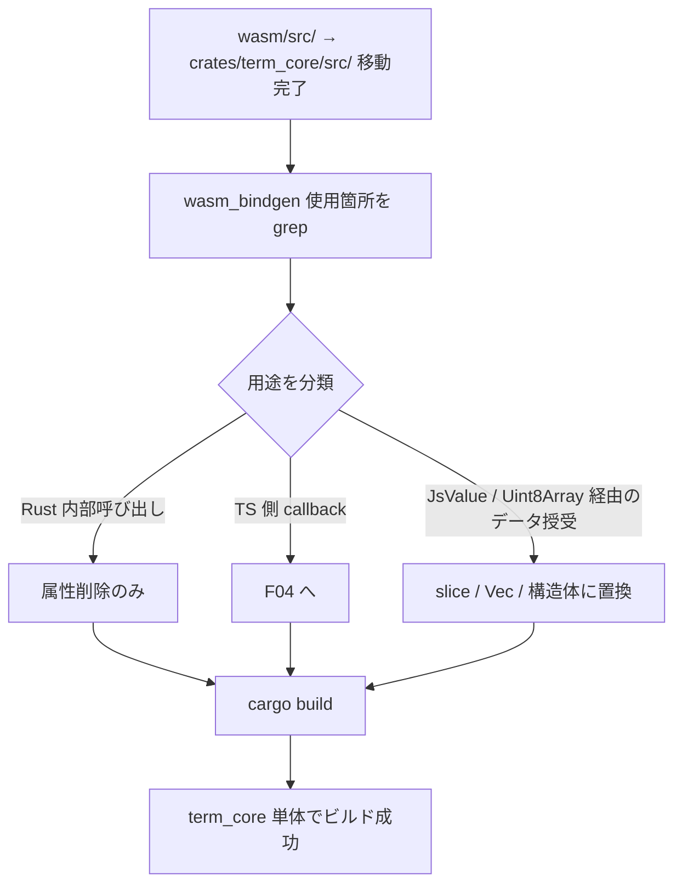

# ターミナルコア crate 化 - 要件定義書

## 1. 概要

### 1.1 背景
- `tmp/restruct.md` の Phase 2 に該当する作業
- 既存 `wasm/src/` (ANSI パーサ・グリッド・Unicode 処理、約 15,000 行・40+ ファイル) は WASM cdylib として TypeScript 側からのみ呼び出されている
- Phase 3 以降のネイティブターミナル本体は Rust 側から直接このロジックを呼び出す必要がある
- Phase 1 PoC で新規実装した最小 ANSI パーサは破棄し、本実体である `wasm/src/` を再利用する

### 1.2 目的
`wasm/src/` を Rust ネイティブとしても利用できる pure crate (`crates/term_core/`) に再編成し、WASM 公開部分は thin wrapper (`wasm/` ディレクトリの中身を再構成) として残す。これにより Phase 3 のネイティブ実装が `term_core` を path 依存で取り込めるようにする。

### 1.3 スコープ

**対象 (in scope)**:
- リポジトリルートに Cargo workspace (`Cargo.toml`) を新設
- `wasm/src/` を `crates/term_core/src/` に `git mv` で移動
- 移動先で `wasm-bindgen` 依存を全面的に剥がし、pure Rust crate にする
- 既存 `wasm/` ディレクトリを「`term_core` を import して wasm-bindgen で公開する thin wrapper」として再構成
- `wasm-pack build` が thin wrapper を介して既存の `wasm/pkg/` を従来と同じ形式で出力できることを確認
- 既存 `wasm/src/parser/tests.rs` 等の単体テストを `crates/term_core/` の cargo test として動作させる
- Cargo workspace の member に `src-tauri/`、`wasm/`、`native-poc/`、`crates/term_core/` を含める
- Phase 2 完了後のサブタスクとして `native-poc/src/{parser,grid}/` を削除し `term_core` への path 依存に置換

**対象外 (out of scope)**:
- 既存 emterm の機能変更
- ネイティブターミナル本体の機能拡張 (Phase 3 担当)
- `src-tauri/` のリファクタ
- TS 側 import パスの変更 (現状維持)
- inline 画像処理の改善
- macOS 対応

## 2. ビジネス要件

### 2.1 ビジネス目標
ネイティブターミナルが既存の高品質 ANSI パーサ・グリッド処理ロジックを直接利用できる状態を作り、Phase 3 以降の作業をブロック要因なく進められるようにする。

### 2.2 対象ユーザー
| ユーザータイプ | 説明 |
|----------------|------|
| eMterm 開発者 | Phase 2 を実装する本人。Phase 3 以降で term_core を Rust から呼ぶ |
| eMterm エンドユーザー | 直接の影響なし。既存 Tauri ビルドは引き続き動作 |

### 2.3 期待される効果
- ネイティブ実装が WASM ブリッジを経由せずに ANSI ロジックを呼べる
- WASM 用とネイティブ用で実装が二重化しない
- Phase 1 PoC の最小実装が捨てやすくなる
- 既存 Tauri ビルドは Phase 2 中も無影響

## 3. ユースケース

### 3.1 ユースケース一覧
| ID | ユースケース名 | アクター | 優先度 |
|----|----------------|----------|--------|
| UC01 | 既存 Tauri ビルドが従来通り動作する | 開発者 / エンドユーザー | 高 |
| UC02 | ネイティブから term_core を path 依存で呼び出す | 開発者 (Phase 3) | 高 |
| UC03 | 既存 WASM 単体テストを cargo test で全 pass する | 開発者 | 高 |
| UC04 | wasm-pack build が pkg/ を従来と同等形式で出力する | 開発者 / TS ビルド | 高 |
| UC05 | native-poc の暫定パーサ/グリッドを term_core に置換 | 開発者 | 中 |

### 3.2 ユースケース詳細

#### UC01: 既存 Tauri ビルドが従来通り動作する

**アクター**: 開発者 / エンドユーザー

**事前条件**: Phase 2 の作業中・完了後を問わず、`main` ブランチで `bun tauri build` が成功する状態

**基本フロー**:
1. `bun install` 後 `bun run wasm:build` (または同等) で wasm/pkg/ が生成される
2. TS 側コードが pkg/ から WASM を import する
3. `bun tauri dev` / `bun tauri build` が成功する

**事後条件**: 既存ユーザーから見て挙動変化なし

#### UC02: ネイティブから term_core を path 依存で呼び出す

**アクター**: 開発者 (Phase 3)

**事前条件**: Phase 2 完了

**基本フロー**:
1. native-poc/Cargo.toml の `[dependencies]` に `term_core = { path = "../crates/term_core" }` を追記
2. `use term_core::{Parser, Grid, ...}` で従来の WASM API と等価なロジックを呼び出す
3. `cargo build` が成功する

**事後条件**: Phase 3 で WASM ブリッジを使わずにロジックを実行できる

#### UC03: 既存 WASM 単体テストを cargo test で全 pass する

**アクター**: 開発者

**基本フロー**:
1. `cargo test -p term_core` を実行
2. wasm/src/ にあった parser/tests.rs などのテストが全て pass する
3. 失敗した場合は移植時の修正で対応

**事後条件**: cargo test で品質保証されている

#### UC04: wasm-pack build が pkg/ を従来と同等形式で出力する

**アクター**: 開発者 / TS ビルドスクリプト

**基本フロー**:
1. `wasm-pack build wasm/ --target web` (または既存の wasm:build スクリプト) を実行
2. thin wrapper crate が term_core を import して wasm-bindgen で再公開する
3. `wasm/pkg/` が生成され、既存 TS 側の import パスを変更せずに使える

**事後条件**: TS ビルド・既存 emterm の動作に影響しない

#### UC05: native-poc の暫定パーサ/グリッドを term_core に置換

**アクター**: 開発者

**基本フロー**:
1. Phase 2 の主要作業 (UC01〜UC04) 完了後
2. `native-poc/src/parser/` と `native-poc/src/grid/` を削除
3. `term_core` を path 依存で取り込み、native-poc 側の Tab/RenderHost が term_core API を使うように改修
4. `cargo build --manifest-path native-poc/Cargo.toml` 成功、既存テストが pass

## 4. 機能要件

### 4.1 機能一覧
| ID | 機能名 | 説明 | 優先度 |
|----|--------|------|--------|
| F01 | Cargo workspace 化 | ルートに Cargo.toml workspace を新設し、関連 crate を member に含める | 高 |
| F02 | コード移動 | `wasm/src/` を `crates/term_core/src/` に git mv | 高 |
| F03 | wasm-bindgen 剥がし | term_core から wasm_bindgen / js-sys / web-sys / serde-wasm-bindgen 依存を全面除去 | 高 |
| F04 | callbacks 抽象化 | 旧 WASM 側で TS callback を呼んでいた箇所を Rust trait に抽象化 | 高 |
| F05 | thin wrapper crate 再構成 | wasm/ ディレクトリを term_core を取り込んで wasm-bindgen で再公開する thin wrapper として再構成 | 高 |
| F06 | テスト移植 | wasm/src/ の単体テストを cargo test で動作させる | 高 |
| F07 | TS 互換出力 | wasm-pack build で pkg/ を従来と同形式 (or 互換) で出力 | 高 |
| F08 | native-poc 置換 | native-poc/src/{parser,grid}/ を削除し term_core に置換 | 中 |

### 4.2 機能詳細

#### F01: Cargo workspace 化

**説明**: リポジトリルートに `Cargo.toml` workspace を新設し、関連 Rust crate を member に登録する。

**ビジネスルール**:
- workspace.members: `src-tauri/`, `wasm/`, `native-poc/`, `crates/term_core/`
- workspace.resolver = "2" (edition 2021 以降の挙動)
- 各 crate の `edition` は維持
- 既存 Cargo.lock は workspace 用に再生成可

**バリデーション**:
| 項目 | ルール | 失敗時 |
|------|--------|--------|
| 全 crate ビルド | `cargo build --workspace` 成功 | 失敗 crate を特定し依存解決 |
| 全 crate テスト | `cargo test --workspace` 成功 | 失敗テストを修正 |

#### F02: コード移動

**説明**: `wasm/src/` 配下の全 Rust ファイルを `crates/term_core/src/` に `git mv` で移動する。

**ビジネスルール**:
- `git mv` を使い履歴を保つ
- `wasm/Cargo.toml` は thin wrapper 用に書き換え (F05)
- 移動対象: parser/, csi_*, terminal_*, sgr, slim_cell, ring_buffer, reflow, snapshot, callbacks, char_table, style_table, color_spec, esc_handler, osc_handler, apc_handler, c0_handler, print_handler, lib.rs

#### F03: wasm-bindgen 剥がし

**説明**: 移動した `crates/term_core/src/` 配下から WASM 専用依存を全て削除し、pure Rust の lib crate にする。

**ビジネスルール**:
- 削除する crate 依存: `wasm-bindgen`, `js-sys`, `web-sys`, `serde-wasm-bindgen`
- `#[wasm_bindgen]` 属性を削除
- `JsValue` / `js_sys::Function` / `Uint8Array` / その他 wasm-bindgen 由来の型を Rust ネイティブ等価物 (slice, Vec, &str, トレイト) に置換
- bincode はコア機能で必要なら保留、不要なら削除

**処理フロー**:

#### F04: callbacks 抽象化

**説明**: 旧 WASM 側で `callbacks.rs` 経由で TS 側関数を呼んでいた箇所を、Rust trait として抽象化する。

**ビジネスルール**:
- trait `TerminalCallbacks` (仮称) を `term_core` 内で定義
- メソッドは旧 WASM が公開していたコールバック (e.g., `on_bell`, `on_title`, `on_resize_request`, `on_visual_bell` など) に対応
- term_core 利用側 (thin wrapper / native-poc / Phase 3 のターミナル本体) がこの trait を実装する
- WASM thin wrapper では `TerminalCallbacks` の各メソッドが `js_sys::Function` を呼ぶよう実装する

#### F05: thin wrapper crate 再構成

**説明**: 既存 `wasm/` ディレクトリを「term_core を import して wasm-bindgen でブラウザ向けに再公開する thin wrapper」として再構成する。

**ビジネスルール**:
- `wasm/Cargo.toml` の `[lib].crate-type = ["cdylib"]` は維持
- `wasm/Cargo.toml` に依存追加: `term_core = { path = "../crates/term_core" }`、`wasm-bindgen`, `js-sys`, `web-sys`, `serde-wasm-bindgen`
- `wasm/src/lib.rs` のみが thin wrapper コード本体。実体は最小化し、ロジックは term_core に委譲
- TS 側から見える wasm-bindgen exports は、移行前と同じ関数名・引数・戻り値で動作すること
- crate name は既存 `emterm-wasm` を維持し、TS 側の生成パッケージ名互換を保つ

#### F06: テスト移植

**説明**: wasm/src/ にあった単体テスト (`mod tests` / `parser/tests.rs` 等) を term_core の cargo test として動作させる。

**ビジネスルール**:
- WASM ブラウザ実行前提のテストがあれば cargo test に書き換える
- バイト列・状態遷移を検証する純粋ロジックテストは無修正で移植可能なはず
- 移植時に新規テストは追加しない (YAGNI)

#### F07: TS 互換出力

**説明**: `wasm-pack build wasm/` (または既存の wasm:build スクリプト) が、従来と同じ場所・同じ形式で `wasm/pkg/` を生成すること。

**ビジネスルール**:
- pkg/ の TypeScript 型定義・JS バインディングが従来と機能等価
- TS 側 import パスを書き換えなくても既存 emterm が動作する
- 出力検証: `bun tauri build` が成功すること、`bun test` の WASM 関連テストが pass すること

#### F08: native-poc 置換

**説明**: Phase 1 PoC で新規実装した暫定パーサ/グリッドを term_core に置き換える。

**ビジネスルール**:
- 削除対象: `native-poc/src/parser/`, `native-poc/src/grid/`
- 追加: `native-poc/Cargo.toml` の `[dependencies]` に `term_core = { path = "../crates/term_core" }`
- native-poc/src/tabs.rs / render/mod.rs / window_host.rs が term_core API を呼ぶよう改修
- `cargo build --manifest-path native-poc/Cargo.toml` 成功、既存 selection / pty / window_host のテストが影響を受けず pass

## 5. 非機能要件

### 5.1 パフォーマンス要件
- term_core 単体でビルド時間が現 wasm crate ビルド (cargo build for wasm32-unknown-unknown) より長くならないこと
- cargo test 全体実行が現 wasm のテスト実行時間と同等以下

### 5.2 セキュリティ要件
- 該当なし (内部ライブラリ化作業)

### 5.3 可用性要件
- 既存 Tauri ビルド (`bun tauri build`) が Phase 2 完了後も従来通り成功すること

### 5.4 保守性要件
- term_core 配下のモジュール構成は wasm/src/ の構成を維持 (大規模リファクタは Phase 2 のスコープ外)
- wasm crate の thin wrapper はファイル数 1〜数個 (lib.rs 中心) に集約

### 5.5 互換性要件
- TS 側 import パス: 変更なし
- wasm/pkg/ の TypeScript 型定義: 機能等価
- WASM 関数シグネチャ: 機能等価

## 6. UI/UX要件

該当なし (内部実装変更)

## 7. データ要件

該当なし (永続データなし)

## 8. 外部連携

### 8.1 連携システム
| システム名 | 連携方法 | データ |
|------------|----------|--------|
| wasm-pack | thin wrapper crate の build | pkg/ 出力 |
| Cargo workspace | 全 Rust crate の依存解決 | path 依存 |

## 9. 制約条件

### 9.1 技術的制約
- Rust edition は移動先で既存と同等 (term_core は 2024 edition を維持、または 2021 へ揃える — 実装時に判定)
- wasm-bindgen のバージョンは既存と互換
- Phase 1 PoC の native-poc は別 SDD で完成させる方針なので、Phase 2 では native-poc の完成度には踏み込まない (UC05 の置換のみ)

### 9.2 ビジネス上の制約
- `main` ブランチへの影響は出さない (`refactor/native-terminal-hybrid` 上で完結)
- 既存 Tauri ビルドの動作を保証する

### 9.3 スケジュール制約
- restruct.md の目安は 1 週間。ただし wasm-bindgen 剥がしの工数次第で延びる可能性あり

## 10. 想定される課題とリスク

### 10.1 技術的課題
| 課題 | 影響度 | 対応策 |
|------|--------|--------|
| wasm-bindgen 剥がし対象が広範 (40+ ファイル) | 高 | grep で対象を列挙し、ファイル単位で機械的に置換 |
| `JsValue` / `Uint8Array` 経由のバイト授受 | 中 | `&[u8]` / `Vec<u8>` に置換、thin wrapper 側で TypedArray 変換 |
| 旧 WASM が依存する web-sys (console など) | 中 | term_core からは log crate に置換、thin wrapper で web-sys ログ実装 |
| 旧 WASM 内部の serde-wasm-bindgen 使用 | 中 | term_core から削除し、thin wrapper で TypedArray / 構造体変換に置換 |
| bincode 依存箇所 | 低 | 用途を確認、native でも有用なら残置、wasm 専用なら削除 |
| edition mismatch (term_core: 2024 vs native-poc: 2021) | 低 | workspace で edition を統一 or 個別 crate で許容 |

### 10.2 ビジネスリスク
| リスク | 発生確率 | 影響度 | 対応策 |
|--------|----------|--------|--------|
| TS ビルドが壊れる | 中 | 高 | thin wrapper 完成段階で `bun tauri build` 検証を必須に |
| 移植中の test 漏れで挙動退行 | 中 | 中 | wasm 既存テストを全 cargo test 化し、CI に組み込み |

## 11. 成功基準

### 11.1 受け入れ基準

- [ ] ルートに `Cargo.toml` workspace が存在し、member に src-tauri/wasm/native-poc/crates/term_core が含まれる
- [ ] `cargo build --workspace` がローカルで成功する
- [ ] `cargo test --workspace` が全 pass する (旧 wasm のテストを含む)
- [ ] `crates/term_core/Cargo.toml` に wasm-bindgen 系依存が**含まれない**
- [ ] `wasm/Cargo.toml` は wasm-bindgen 系依存を保持し、`term_core = { path = ".." }` で term_core を取り込む
- [ ] `wasm-pack build wasm/ --target web` 相当のコマンドが `wasm/pkg/` を生成する
- [ ] `bun tauri build` が成功する (既存 Tauri 動作維持)
- [ ] `bun test` (TS 側) が pass する
- [ ] native-poc/src/parser/ と native-poc/src/grid/ が削除され、term_core 参照に置換されている
- [ ] `cargo build --manifest-path native-poc/Cargo.toml` 成功、native-poc の既存テスト (selection, pty input 等) が pass

### 11.2 KPI
| 指標 | 目標値 | 測定方法 |
|------|--------|----------|
| 受け入れ基準充足 | 11.1 全項目 ok | チェックリスト |
| ビルド成功 | workspace 全 crate + tauri + bun | 手動実行 |

## 12. テストシナリオ

### 12.1 テスト観点
- [ ] term_core 単体ビルド成功
- [ ] term_core 単体テスト全 pass (旧 wasm parser/tests.rs 含む)
- [ ] wasm thin wrapper ビルド成功 (wasm-pack)
- [ ] workspace 全体 cargo build + cargo test 成功
- [ ] bun tauri build 成功 (既存 Tauri 動作維持)
- [ ] bun test (TS) 成功
- [ ] native-poc ビルド + テスト成功 (term_core 置換後)

## 13. 用語定義

| 用語 | 定義 |
|------|------|
| term_core | 既存 wasm/src/ から wasm-bindgen を剥がして再編した pure Rust crate (配置: crates/term_core/) |
| thin wrapper | term_core を import して wasm-bindgen 経由で TS から呼べるよう公開する crate (配置: wasm/、crate name: emterm-wasm) |
| Cargo workspace | ルートに置く Cargo.toml で複数 crate のビルド/依存解決を統合する仕組み |
| Phase 1 PoC 暫定実装 | native-poc/src/{parser,grid}/ にある最小 ANSI 処理。term_core 完成後に廃棄 |

## 14. 確認事項

### 14.1 確認済み事項

- [x] crate 配置場所: `crates/term_core/`
- [x] wasm-bindgen の扱い: 両立 (term_core pure Rust + wasm/ thin wrapper)
- [x] Phase 1 PoC コード: term_core デビュー完了後に置換 (Phase 2 内サブタスク)
- [x] Cargo workspace 化: ルートに新設、全関連 crate を member に
- [x] 既存 wasm/src/ 移動方法: `git mv wasm/src/ → crates/term_core/src/`、wasm-bindgen 剥がし、wasm/ は thin wrapper として再作
- [x] TS ビルドパイプライン: 現状維持 (wasm-pack 出力先互換)
- [x] ブランチ: `refactor/native-terminal-hybrid` 継続

### 14.2 未確認・保留事項

- [ ] term_core の Rust edition: 2024 維持 or 2021 へ揃える (実装時に判定)
- [ ] callbacks trait の最終的なメソッド構成 (実装時に WASM exports を grep して確定)
- [ ] bincode 依存の要否 (実装時に用途分析)
- [ ] wasm-pack 出力先パス: `wasm/pkg/` 維持 or 移動 (現状維持を第一選択)

## 15. 参考資料

- `tmp/restruct.md` — 再構築方針書 (Phase 2 詳細)
- `wasm/Cargo.toml` — 既存 WASM crate 設定
- `wasm/src/` — Phase 2 で移動するソースの本体
- `doc/tasks/native-terminal-poc/` — Phase 1 SDD 成果物
