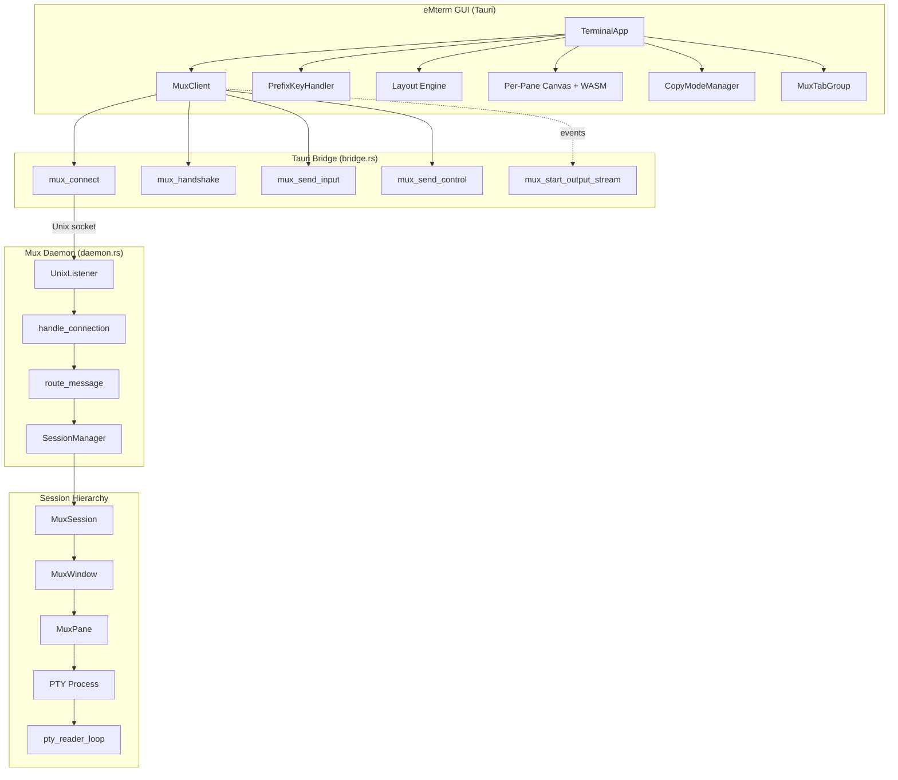
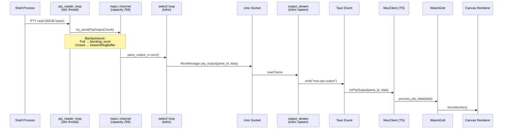
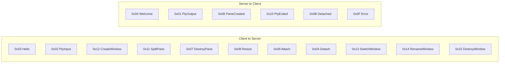
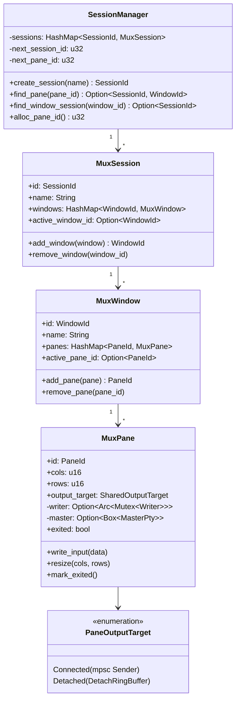
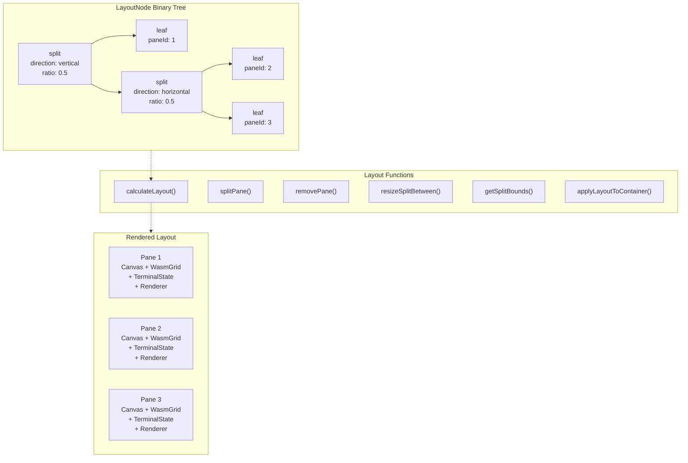
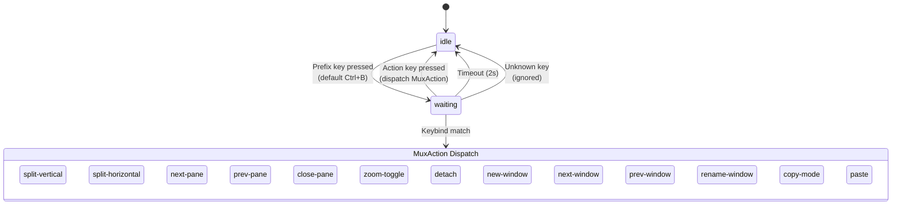
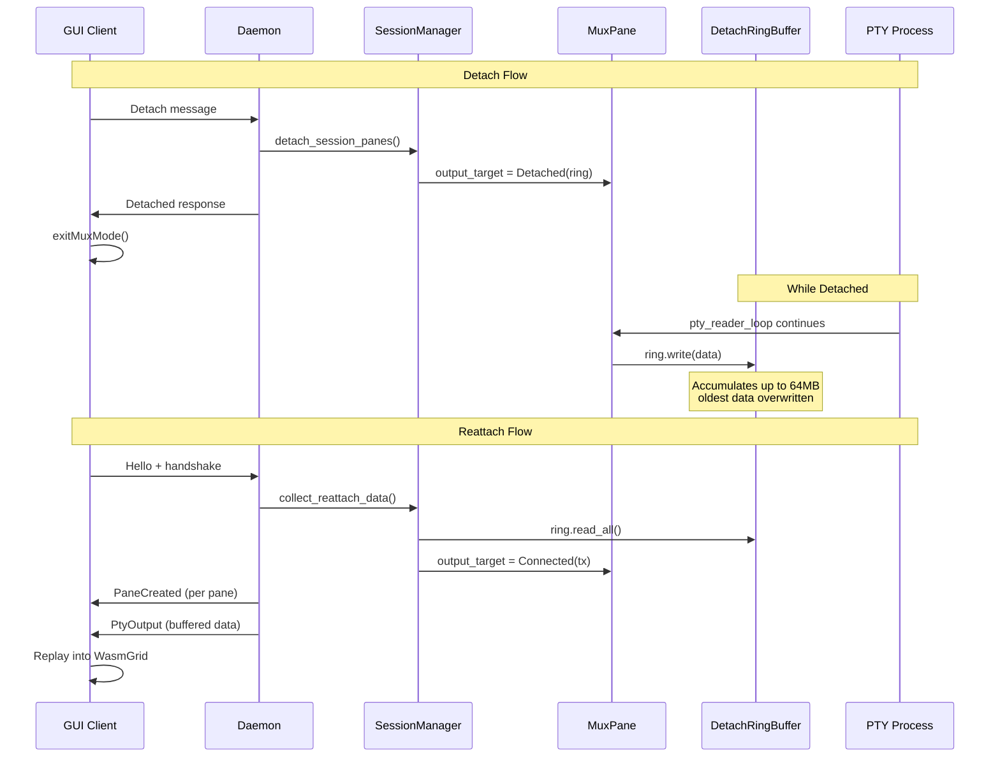
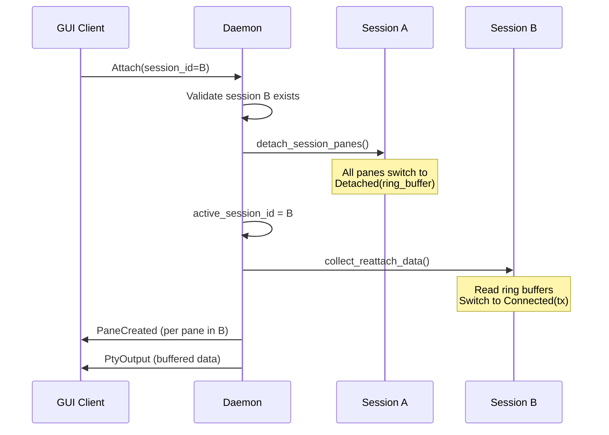
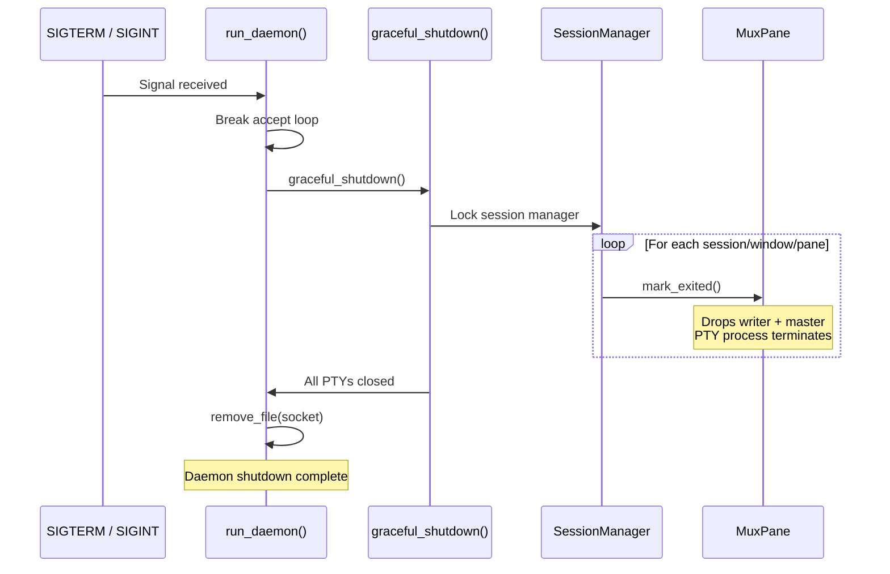

# Terminal Multiplexer Architecture Diagrams

## 1. Component Architecture

## 2. PTY Data Flow

## 3. IPC Protocol Messages

## 4. Session State Hierarchy

## 5. Frontend Pane Layout Tree

## 6. Prefix Key State Machine

## 7. Copy Mode State Machine

```mermaid
stateDiagram-v2
    state "inactive" as inactive
    state "navigating" as navigating
    state "selecting" as selecting

    [*] --> inactive

    inactive --> navigating: prefix + [

    navigating --> navigating: h/j/k/l (move cursor)
    navigating --> navigating: 0/$ (line start/end)
    navigating --> selecting: v (start selection)
    navigating --> inactive: q / Escape

    selecting --> selecting: h/j/k/l (extend selection)
    selecting --> inactive: y (yank to clipboard)
    selecting --> inactive: q / Escape
```

## 8. Detach/Reattach Flow

## 9. Multi-Session Attach Flow

## 10. Graceful Shutdown

