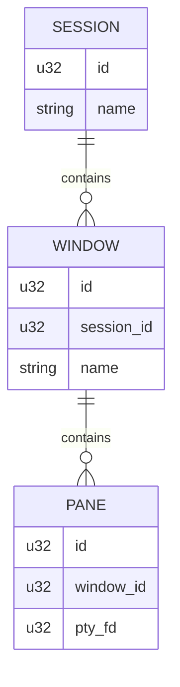

# ターミナルマルチプレクサ機能 - 要件定義書

## 1. 概要

### 1.1 背景
tmux環境下でClaude Codeのパフォーマンスが劣化する問題がある。tmuxサーバー内部でVT100エスケープシーケンスを二重解析・二重生成する構造的な問題により、Claude Codeが発生させる4,000-6,700スクロール/秒の持続的高負荷に対応できない。全ての既存マルチプレクサ（tmux, Zellij, GNU Screen）が同じ構造的問題を持つ。

### 1.2 目的
eMtermにネイティブマルチプレクサを統合し、マルチプレクサ利用時もeMterm単体に近いパフォーマンスを維持する。VT100の二重パースを完全排除し、PTYデータを直接WASMパーサーに渡すアーキテクチャを実現する。

### 1.3 スコープ
- daemonプロセスによるセッション管理（attach/detach）
- IPC通信基盤（Unix domain socket）
- ペイン分割・レイアウト管理
- ウィンドウ管理
- ステータスバー
- コピーモード
- tmux.conf変換（ベストエフォート）

## 2. ビジネス要件

### 2.1 ビジネス目標
AI時代のターミナルとして、Claude Code等の高スループットツールをマルチプレクサ環境下でも快適に使用可能にする。

### 2.2 対象ユーザー
| ユーザータイプ | 説明 |
|----------------|------|
| tmuxユーザー | tmuxをセッション管理・ペイン分割に使用しているユーザー |
| Claude Codeユーザー | Claude Codeを頻繁に使用し、tmuxのパフォーマンス劣化に悩んでいるユーザー |
| eMtermユーザー | 既存のeMtermユーザーがマルチプレクサ機能を求めるケース |

### 2.3 期待される効果
- tmux経由と比較してパフォーマンスが大幅に改善される
- OSC拡張（Markdown/画像表示）がマルチプレクサ経由でも劣化しない
- tmuxからの移行が容易（操作互換性、tmux.conf変換）

## 3. ユースケース

### 3.1 ユースケース一覧
| ID | ユースケース名 | アクター | 優先度 |
|----|----------------|----------|--------|
| UC01 | マルチプレクサモード起動 | eMtermユーザー | 高 |
| UC02 | セッションのデタッチ | eMtermユーザー | 高 |
| UC03 | セッションへのリアタッチ | eMtermユーザー | 高 |
| UC04 | ペイン分割と操作 | eMtermユーザー | 高 |
| UC05 | ウィンドウ管理 | eMtermユーザー | 中 |
| UC06 | コピーモードでのテキスト選択 | eMtermユーザー | 中 |
| UC07 | tmux.confからの設定移行 | tmuxユーザー | 低 |

### 3.2 ユースケース詳細

#### UC01: マルチプレクサモード起動

**アクター**: eMtermユーザー

**事前条件**:
- eMterm GUIが起動している
- シェル内でコマンドを実行可能

**基本フロー**:
1. ユーザーがシェルで `emterm mux` を実行
2. CLIが `TERM_PROGRAM=emterm` を確認
3. CLIがdaemonの生存を確認（socket接続試行）
4. daemonが未起動なら `emterm mux --daemon` をスポーン
5. CLIがOSCシーケンスをstdoutに出力
6. GUIがOSCを検知し、muxモードに切り替え
7. GUIがdaemonにIPC接続
8. マルチプレクサモードが有効になる

**代替フロー**:
- `TERM_PROGRAM` が `emterm` でない場合: エラーメッセージ表示、終了
- `EMTERM_MUX=1` が設定済み（ネスト検出）: エラーメッセージ表示、終了
- daemon起動失敗: エラーメッセージ表示、終了

**事後条件**:
- GUIがmuxモードで動作中
- daemonがPTYセッションを管理中

#### UC02: セッションのデタッチ

**アクター**: eMtermユーザー

**事前条件**:
- muxモードが有効

**基本フロー**:
1. ユーザーが `prefix + d` を押下
2. GUIがdaemonにDetachコマンドを送信
3. GUIがWASMグリッド状態をシリアライズしてdaemonに送信（Snapshot）
4. daemonがスナップショットを保存、リングバッファでPTY出力の蓄積を開始
5. GUIがmux Canvas群を破棄し、元タブの表示を復元
6. CLIにDetached通知が届き、CLIが終了
7. ユーザーがシェルに戻る

**事後条件**:
- daemonとPTYセッションは生存
- GUIは通常モードに復帰

#### UC03: セッションへのリアタッチ

**アクター**: eMtermユーザー

**事前条件**:
- デタッチ済みのセッションが存在する

**基本フロー**:
1. ユーザーが `emterm mux attach` を実行
2. CLIがdaemonに接続、セッション情報を取得
3. CLIがOSCシーケンス（attachモード）を出力
4. GUIがmuxモードに切り替え、daemonに接続
5. daemonからSnapshotデータとdelta bytes（リングバッファ）を受信
6. GUIがWASMグリッドをスナップショットから復元
7. delta bytesをWASMパーサーに再生
8. ストリーミングモードに切り替え

**事後条件**:
- 画面がデタッチ時点 + デタッチ中の変更で復元されている

#### UC04: ペイン分割と操作

**アクター**: eMtermユーザー

**事前条件**:
- muxモードが有効

**基本フロー**:
1. ユーザーが `prefix + %`（縦分割）または `prefix + "`（横分割）を押下
2. GUIがdaemonにCreatePaneリクエストを送信
3. daemonが新しいPTYを作成、PaneCreated通知を返す
4. GUIが新しいCanvas + WASMインスタンスを生成
5. レイアウトを再計算してペインを配置

**代替フロー**:
- 最小サイズ（2行x10列）を下回る場合: 分割を拒否

**事後条件**:
- 新しいペインが表示され、シェルが起動している

#### UC05: ウィンドウ管理

**アクター**: eMtermユーザー

**基本フロー**:
1. `prefix + c` で新規ウィンドウ作成
2. `prefix + n` / `prefix + p` でウィンドウ切替
3. `prefix + ,` でウィンドウリネーム

#### UC06: コピーモードでのテキスト選択

**アクター**: eMtermユーザー

**基本フロー**:
1. `prefix + [` でコピーモードに入る
2. vi/emacsキーバインドでカーソル移動・選択
3. 選択確定でシステムクリップボードにコピー
4. `prefix + ]` でクリップボードからペースト

#### UC07: tmux.confからの設定移行

**アクター**: tmuxユーザー

**基本フロー**:
1. 変換コマンド実行
2. tmux.confの対応可能な設定を `settings.json` の `mux` セクションに変換
3. 非対応項目は警告表示

## 4. 機能要件

### 4.1 機能一覧
| ID | 機能名 | 説明 | 優先度 |
|----|--------|------|--------|
| F01 | Daemon管理 | daemonプロセスの起動・終了・生存確認 | 高 |
| F02 | IPC通信 | Unix domain socketによるバイナリプロトコル通信 | 高 |
| F03 | セッション管理 | Session/Window/Pane階層の管理 | 高 |
| F04 | OSCシグナリング | CLI→GUIのモード切替通知 | 高 |
| F05 | モード切替 | 通常モードとmuxモードの相互切替 | 高 |
| F06 | デタッチ/リアタッチ | セッションの切断と復元 | 高 |
| F07 | ペイン分割 | 二分木モデルによるペインレイアウト | 高 |
| F08 | ウィンドウ管理 | 複数ウィンドウの作成・切替・削除 | 中 |
| F09 | ステータスバー | HTML描画によるリッチステータスバー | 中 |
| F10 | コピーモード | vi/emacsキーバインドによるテキスト選択 | 中 |
| F11 | tmux.conf変換 | tmux設定ファイルのベストエフォート変換 | 低 |
| F12 | プレフィックスキー | tmux互換のプレフィックスキー処理 | 高 |
| F13 | フロー制御 | bounded channel + adaptive batchingによるバックプレッシャー | 高 |
| F14 | 状態スナップショット | デタッチ時のグリッド状態保存と復元 | 高 |
| F15 | 環境変数設定 | TERM_PROGRAM, EMTERM_MUX, EMTERM_MUX_SOCKET | 高 |

### 4.2 機能詳細

#### F01: Daemon管理

**説明**: `emterm mux --daemon` でバックグラウンドdaemonを起動。socket listenerを作成し、stdin/stdoutをデタッチ。

**ライフサイクル**:
- PTY終了 → ペイン自動クローズ → 最後のペインならウィンドウクローズ → 最後のウィンドウならセッション終了 → 全セッション終了でdaemon自動終了
- Stale socket: connect試行で生存確認、失敗なら削除して新規作成
- SIGTERM: graceful shutdown（新規接続停止 → クライアント通知 → PTYにSIGHUP → socket削除 → 終了）

**Socketパス**:
- Linux: `$XDG_RUNTIME_DIR/emterm/mux-default.sock`（XDG未設定時は `~/.local/run/emterm/mux-default.sock`）
- Windows: `%LOCALAPPDATA%\emterm\mux-default.sock`

#### F02: IPC通信

**説明**: length-prefixed binary frameによるIPC通信。

**フレーム形式**: `[length: u32][type: u8][pane_id: u32][payload: variable]`
- length: フィールド自体を除いた残りバイト数（= 5 + payload_len）
- PTYデータはraw bytes転送（シリアライズ/圧縮なし）
- 制御メッセージはbincodeシリアライズ
- `max_frame_length(16MB)` でOOM防止

**ハンドシェイク**:
1. Client → Daemon: `Hello { client_type: GUI | CLI, protocol_version: u32 }`
2. Daemon → Client: `Welcome { sessions: [...], server_version: u32 }` or `Rejected { reason }`

**メッセージ型**: PtyOutput, PtyInput, Hello, Welcome, CreatePane, PaneCreated, DestroyPane, Resize, Attach, Detach, Detached, Snapshot, SnapshotRestore, SessionList, Error, PtyExited（全16種）

#### F07: ペイン分割

**説明**: 二分木モデルによるレイアウト管理。

- 各ノードは「リーフ（ペイン）」または「分割（方向 + サイズ比）」
- tmux互換レイアウト: even-horizontal, even-vertical, main-horizontal, main-vertical, tiled
- ピクセルベースの計算
- ペイン境界: CSS border or gap（1px、テーマカラー）
- ドラッグリサイズ対応
- 最小ペインサイズ: 2行 x 10列

#### F14: 状態スナップショット

**説明**: デタッチ時にGUI側WASMグリッド状態をシリアライズしてdaemonに保存。

**スナップショット内容**:
- 可視画面（rows x cols のセルデータ）
- スクロールバック（設定上限まで）
- カーソル位置・属性（形状含む）
- 端末モード状態（DEC modes、alternate buffer等）
- 現在の文字属性（SGR state）
- タブタイトル（OSC 0/2）
- カレントディレクトリ（OSC 7）

**リングバッファ**: ペインごと64MB上限。デタッチ中のPTY出力を蓄積。

## 5. 非機能要件

### 5.1 パフォーマンス要件
- IPC追加による体感劣化なし（通常モードと同等のレスポンス）
- bounded channel + adaptive batchingによるバックプレッシャー
- 高スループットペイン（Claude Code等）が他ペインをスターブさせない

### 5.2 セキュリティ要件
- ローカルsocket、ファイルパーミッションで保護（認証不要）
- GUI側でsocket_pathを検証: 許可ディレクトリ配下のみ受け入れ
- パストラバーサル（`../`）を含むパスは拒否

### 5.3 可用性要件
- daemonクラッシュ時: GUIが自動的に通常モードに復帰
- IPC接続断: リトライ数回 → 失敗なら通常モード復帰 + トースト通知
- スナップショットのデシリアライズ失敗: 空画面でリアタッチ

### 5.4 保守性要件
- 既存のログ形式（`[LEVEL][ORIGIN]`）に準拠
- daemon側は `[BACKEND]` ラベル

### 5.5 互換性要件
- 対象OS: Linux / Windows
- WindowsのAF_UNIX: Windows 10 1803+
- tmux互換: ユーザー操作レベル（実装レベルではない）

## 6. UI/UX要件

### 6.1 タブ統合方式
- muxを起動したタブがタブグループに変化
- muxウィンドウがグループ内タブとして展開
- 通常タブとmuxタブグループが同じタブバーに共存

### 6.2 ナビゲーション（2層）
- eMtermタブ層: Ctrl+数字, Ctrl+PageUp/Down
- muxウィンドウ層: prefix+n/p + マウス直接クリック

### 6.3 展開/コンパクト
- アクティブなmuxタブ: 自動展開（ウィンドウタブが並ぶ）
- 非アクティブなmuxタブ: 自動コンパクト（`mux (N)` 表示）
- 0.3秒のアニメーション付き
- 設定: `mux_tab_always_expand`（デフォルト: off）

### 6.4 ペイン境界
- 1px線、テーマカラー
- アクティブペイン: アクセントカラー
- ドラッグリサイズ対応

## 7. データ要件

### 7.1 セッション階層

### 7.2 データ項目
| エンティティ | 項目名 | 型 | 必須 | 説明 |
|--------------|--------|-----|------|------|
| Session | id | u32 | ○ | セッション識別子 |
| Session | name | String | ○ | セッション名 |
| Window | id | u32 | ○ | ウィンドウ識別子 |
| Window | name | String | ○ | ウィンドウ名 |
| Pane | id | u32 | ○ | ペイン識別子 |
| Pane | cols | u16 | ○ | 列数 |
| Pane | rows | u16 | ○ | 行数 |
| Snapshot | grid_state | bytes | ○ | シリアライズされたグリッド状態 |
| RingBuffer | data | bytes | ○ | デタッチ中のPTY出力（最大64MB/ペイン） |

## 8. 外部連携

### 8.1 連携システム
| システム名 | 連携方法 | データ |
|------------|----------|--------|
| PTY (OS) | portable-pty | シェルプロセスのI/O |
| システムクリップボード | Clipboard API | コピーモードのテキスト |

## 9. 制約条件

### 9.1 技術的制約
- WindowsのAF_UNIXサポートはWindows 10 1803+
- interprocess v2はAPI大幅変更あり（tokio直接使用にフォールバック可能）
- WASMインスタンスはペインごとに約2-4MB消費

### 9.2 ビジネス上の制約
- GUI単体モード（通常のターミナル）は残す
- tmux.conf変換はベストエフォート（プラグイン・外部コマンド連携は非対応）

## 10. 想定される課題とリスク

### 10.1 技術的課題
| 課題 | 影響度 | 対策 |
|------|--------|------|
| IPC通信のレイテンシ | 中 | raw bytes転送、シリアライズなし、adaptive batching |
| リアタッチ時のリングバッファ溢れ | 低 | 64MB上限、古い部分上書き。VT100パーサが数バイトで同期回復 |
| WASMインスタンスのメモリ消費 | 低 | ペインあたり2-4MB、通常の使用範囲では問題なし |
| モード切替時のレースコンディション | 中 | OSC受信→PTY reader一時停止→IPC接続→UI切替の順序保証 |
| 複数GUIクライアントの競合 | 低 | 排他・後着優先（新しい接続が既存を切断） |

## 11. 成功基準

### 11.1 受け入れ基準
- [ ] daemon起動・接続・デタッチ・リアタッチが正常動作
- [ ] ペイン分割・リサイズが正常動作
- [ ] ウィンドウの作成・切替・削除が正常動作
- [ ] Claude Code等の高スループット出力でも体感劣化なし
- [ ] OSC拡張（Markdown/画像）がmuxモードでも正常動作
- [ ] daemonクラッシュ時に通常モードに自動復帰
- [ ] Linux / Windows両対応

## 12. テストシナリオ

### 12.1 テスト観点
- [ ] 正常系: daemon起動 → attach → ペイン操作 → detach → reattach
- [ ] 正常系: ペイン分割・リサイズ・クローズ
- [ ] 正常系: ウィンドウ作成・切替・リネーム・削除
- [ ] 正常系: コピーモードでのテキスト選択とペースト
- [ ] 異常系: daemon未起動時のattach試行
- [ ] 異常系: daemonクラッシュからの自動復帰
- [ ] 異常系: IPC接続断からのリカバリ
- [ ] 異常系: ネスト防止（EMTERM_MUX=1）
- [ ] 異常系: 非eMterm環境での実行防止
- [ ] 境界値: 最小ペインサイズ（2行x10列）
- [ ] パフォーマンス: 高スループット出力でのバックプレッシャー動作

## 13. 用語定義

| 用語 | 定義 |
|------|------|
| daemon | バックグラウンドで動作するPTYセッション管理プロセス |
| muxモード | eMterm GUIがdaemonに接続してマルチプレクサとして動作するモード |
| OSCシグナリング | CLI→GUI間のモード切替通知に使用するOSCエスケープシーケンス |
| スナップショット | デタッチ時に保存されるWASMグリッドのシリアライズ状態 |
| リングバッファ | デタッチ中のPTY出力を蓄積する循環バッファ（ペインごと64MB上限） |
| プレフィックスキー | mux操作を開始するキー（デフォルト Ctrl+b） |
| 二分木モデル | ペインレイアウトを管理するデータ構造 |

## 14. 確認事項

### 14.1 確認済み事項

- [x] コマンド: `emterm mux`
- [x] 対象OS: Linux / Windows
- [x] 互換性レベル: ユーザー操作レベルでのtmux互換
- [x] GUI単体モードは残す
- [x] 運用モデル: eMterm起動 → シェル内で `emterm mux` → モード切替
- [x] IPC: Unix domain socket（Linux/Windows両方）
- [x] フレーム形式: length-prefixed binary frame
- [x] フロー制御: bounded channel + adaptive batching
- [x] リアタッチ: スナップショット + リングバッファ方式
- [x] ペインレイアウト: 二分木モデル
- [x] 複数GUIクライアント: 排他・後着優先
- [x] 設定: settings.json の `mux` セクションに統合
- [x] クリップボード: システムクリップボード直接使用
- [x] パフォーマンス目標: 通常モードと同等（体感劣化なし）
- [x] 仕様スコープ: 全7フェーズを一括でカバー

### 14.2 未確認・保留事項
- なし

## 15. 参考資料

- 設計レポート: `tmp/emterm-tmux-report.md`
