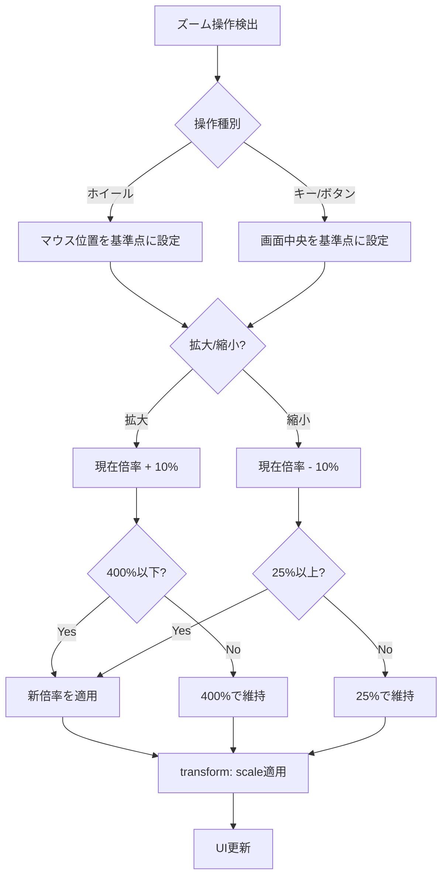

# ビューアーユーザビリティ改善 - 要件定義書

## 1. 概要

### 1.1 背景
eMtermの画像ビューアーとMarkdownビューアーは、フルスクリーンオーバーレイでコンテンツを表示する機能を持つ。しかし、現状では以下の課題がある:
- ズーム機能がなく、大きな画像や細かい詳細を確認しづらい
- 閉じる方法がキーボード(Escape)のみで、マウス操作派のユーザーにとって直感的でない

### 1.2 目的
- 拡大縮小機能を追加し、コンテンツの詳細確認を容易にする
- 視覚的な閉じるボタンを追加し、操作の直感性を向上させる
- 両ビューアーで統一されたUI/UX体験を提供する

### 1.3 スコープ
- 対象: 画像ビューアー (`src/image-viewer/index.ts`)、Markdownビューアー (`src/markdown/fullscreen.ts`)
- 範囲内: ズーム機能、閉じるボタン、ズームコントロールUI
- 範囲外: 画像編集機能、Markdownの編集機能、新しいビューアー種別の追加

## 2. ビジネス要件

### 2.1 ビジネス目標
- ユーザーがコンテンツを効率的に確認できるようにする
- 操作の直感性を向上させ、学習コストを下げる

### 2.2 対象ユーザー
| ユーザータイプ | 説明 |
|----------------|------|
| ターミナルユーザー | eMtermを日常的に使用する開発者・システム管理者 |
| マウス操作ユーザー | キーボードよりマウスを好むユーザー |

### 2.3 期待される効果
- コンテンツ詳細確認時間の短縮
- 操作方法の迷いの軽減
- ユーザー満足度の向上

## 3. ユースケース

### 3.1 ユースケース一覧
| ID | ユースケース名 | アクター | 優先度 |
|----|----------------|----------|--------|
| UC01 | コンテンツを拡大表示 | ユーザー | 高 |
| UC02 | コンテンツを縮小表示 | ユーザー | 高 |
| UC03 | マウスでビューアーを閉じる | ユーザー | 高 |
| UC04 | ズーム倍率をリセット | ユーザー | 中 |

### 3.2 ユースケース詳細

#### UC01: コンテンツを拡大表示

**アクター**: ユーザー

**事前条件**:
- ビューアー（画像またはMarkdown）が開いている状態

**基本フロー**:
1. ユーザーがズーム操作を行う（以下のいずれか）:
   - Ctrl + マウスホイール上回転
   - 「+」ボタンをクリック
   - 「+」キーまたは「=」キーを押下
2. コンテンツが10%刻みで拡大される
3. ズーム倍率表示が更新される

**代替フロー**:
- 400%に達している場合、それ以上拡大されない

**事後条件**:
- コンテンツが拡大表示されている
- ズーム倍率が表示に反映されている

#### UC02: コンテンツを縮小表示

**アクター**: ユーザー

**事前条件**:
- ビューアー（画像またはMarkdown）が開いている状態

**基本フロー**:
1. ユーザーがズーム操作を行う（以下のいずれか）:
   - Ctrl + マウスホイール下回転
   - 「-」ボタンをクリック
   - 「-」キーを押下
2. コンテンツが10%刻みで縮小される
3. ズーム倍率表示が更新される

**代替フロー**:
- 25%に達している場合、それ以上縮小されない

**事後条件**:
- コンテンツが縮小表示されている
- ズーム倍率が表示に反映されている

#### UC03: マウスでビューアーを閉じる

**アクター**: ユーザー

**事前条件**:
- ビューアー（画像またはMarkdown）が開いている状態

**基本フロー**:
1. ユーザーが画面右上の閉じるボタン(x)をクリック
2. ビューアーが閉じる
3. 元の画面（ターミナル）に戻る

**事後条件**:
- ビューアーが閉じている
- ターミナルにフォーカスが戻っている

#### UC04: ズーム倍率をリセット

**アクター**: ユーザー

**事前条件**:
- ビューアーが開いており、ズーム倍率が100%以外

**基本フロー**:
1. ユーザーがズームコントロールバーの倍率表示（例: "150%"）をクリック
2. ズーム倍率が100%にリセットされる
3. 表示が更新される

**事後条件**:
- ズーム倍率が100%になっている

## 4. 機能要件

### 4.1 機能一覧
| ID | 機能名 | 説明 | 優先度 |
|----|--------|------|--------|
| F01 | ズーム機能 | コンテンツの拡大縮小 | 高 |
| F02 | 閉じるボタン | 画面右上の閉じるボタン | 高 |
| F03 | ズームコントロールUI | 画面右下のズーム操作バー | 高 |

### 4.2 機能詳細

#### F01: ズーム機能

**説明**: 両ビューアーでコンテンツを拡大縮小する機能

**入力**:
- ズーム操作: マウスホイール（Ctrl併用）、キーボード（+/-）、ボタンクリック

**出力**:
- スケール変換されたコンテンツ表示

**処理フロー**:

**ビジネスルール**:
- ズーム範囲: 25% - 400%
- ズームステップ: 10%刻み
- 初期倍率: 100%
- ホイール操作時はマウスカーソル位置を基準にズーム
- キー/ボタン操作時は画面中央を基準にズーム

**バリデーション**:
| 項目 | ルール | エラーメッセージ |
|------|--------|------------------|
| ズーム倍率 | 25 <= value <= 400 | N/A（境界で停止） |

**エラーケース**:
| エラー | 条件 | 対応 |
|--------|------|------|
| 上限到達 | 400%でさらに拡大操作 | 操作を無視 |
| 下限到達 | 25%でさらに縮小操作 | 操作を無視 |

#### F02: 閉じるボタン

**説明**: 画面右上に固定表示される閉じるボタン

**入力**:
- クリックイベント

**出力**:
- ビューアーの終了

**ビジネスルール**:
- 角丸四角形の半透明背景に「x」アイコン
- スクロールやズームに関わらず画面右上に固定
- ホバー時に視覚的フィードバック

#### F03: ズームコントロールUI

**説明**: 画面右下に固定表示されるズーム操作バー

**入力**:
- 「-」ボタンクリック: 縮小
- 倍率表示クリック: 100%にリセット
- 「+」ボタンクリック: 拡大

**出力**:
- ズーム倍率の変更
- 倍率表示の更新

**ビジネスルール**:
- レイアウト: `[-] [100%] [+]` のコンパクトなバー
- スクロールやズームに関わらず画面右下に固定
- 倍率表示は現在のズーム倍率を常に反映

## 5. 非機能要件

### 5.1 パフォーマンス要件
- ズーム操作のレスポンス: 16ms以内（60fps維持）
- スケール変換: GPUアクセラレーション活用（transform: scale使用）

### 5.2 セキュリティ要件
- 該当なし（既存のセキュリティモデルを継続）

### 5.3 可用性要件
- 該当なし

### 5.4 保守性要件
- 両ビューアーで共通のズームロジックを使用（コード重複の最小化）
- UIコンポーネントの分離

### 5.5 互換性要件
- 既存のキーボードショートカット（Escape、矢印キー等）との共存
- 既存のスタイルとの整合性

## 6. UI/UX要件

### 6.1 画面設計要件

**閉じるボタン**:
- 位置: 画面右上、固定
- デザイン: 角丸四角形の半透明背景（rgba(0,0,0,0.5)程度）
- アイコン: 「x」（白色）
- サイズ: 32x32px程度
- マージン: 右16px、上16px

**ズームコントロールバー**:
- 位置: 画面右下、固定
- デザイン: 角丸四角形の半透明背景
- レイアウト: `[-] [100%] [+]` 横並び
- サイズ: コンパクト（高さ32px程度）
- マージン: 右16px、下16px

### 6.2 操作マッピング

| 操作 | アクション |
|------|------------|
| Ctrl + ホイール上 | 拡大（マウス位置基準） |
| Ctrl + ホイール下 | 縮小（マウス位置基準） |
| `+` キー または `=` キー | 拡大（中央基準） |
| `-` キー | 縮小（中央基準） |
| `0` キー | 100%にリセット |
| 「+」ボタンクリック | 拡大（中央基準） |
| 「-」ボタンクリック | 縮小（中央基準） |
| 倍率表示クリック | 100%にリセット |
| 閉じるボタンクリック | ビューアーを閉じる |
| Escape キー | ビューアーを閉じる（既存） |

### 6.3 レスポンシブ対応
- UIは固定位置のため、画面サイズに依存しない

## 7. データ要件

### 7.1 状態管理

| 状態項目 | 型 | 初期値 | 説明 |
|----------|-----|--------|------|
| zoomLevel | number | 100 | 現在のズーム倍率（%） |
| zoomOrigin | {x, y} | center | 最後のズーム基準点 |

### 7.2 データ保持期間
- ビューアーが閉じられると状態はリセット

## 8. 外部連携

### 8.1 連携システム
該当なし（フロントエンドのみの機能）

## 9. 制約条件

### 9.1 技術的制約
- transform: scaleベースの実装（ブラウザ標準のズーム挙動との一貫性）
- 既存のイベントハンドリング（keydown capture）との整合性が必要

### 9.2 ビジネス上の制約
- 既存の操作（Escape、矢印キー等）を壊してはならない

## 10. 想定される課題とリスク

### 10.1 技術的課題
| 課題 | 影響度 | 対応策 |
|------|--------|--------|
| ホイールイベントの競合 | 中 | Ctrlキー併用で明示的にズーム操作を区別 |
| スクロールとズームの干渉 | 中 | Ctrlなしホイールはスクロール、ありはズーム |
| 基準点ズームの実装複雑性 | 中 | transform-originの動的設定 |

### 10.2 ビジネスリスク
| リスク | 発生確率 | 影響度 | 対応策 |
|--------|----------|--------|--------|
| 操作方法の混乱 | 低 | 低 | 情報表示に操作ヒントを追加 |

## 11. 成功基準

### 11.1 受け入れ基準
- [ ] マウスホイール（Ctrl併用）でズームできる
- [ ] +/-キーでズームできる
- [ ] +/-ボタンでズームできる
- [ ] ズーム範囲が25%-400%に制限されている
- [ ] ホイール操作時はマウス位置を基準にズームする
- [ ] キー/ボタン操作時は中央を基準にズームする
- [ ] 閉じるボタンが右上に表示され、クリックで閉じられる
- [ ] ズームコントロールバーが右下に表示される
- [ ] 倍率表示クリックで100%にリセットできる
- [ ] 既存のキーボードショートカットが正常に動作する
- [ ] 画像ビューアーとMarkdownビューアーで同じ操作性

### 11.2 KPI
| 指標 | 目標値 | 測定方法 |
|------|--------|----------|
| ズーム操作レスポンス | 16ms以内 | 開発者ツールでのパフォーマンス計測 |

## 12. テストシナリオ

### 12.1 テスト観点
- [ ] 正常系: 各ズーム操作（ホイール、キー、ボタン）で拡大縮小できる
- [ ] 正常系: 閉じるボタンでビューアーが閉じる
- [ ] 正常系: 倍率表示クリックで100%にリセットされる
- [ ] 境界値: 25%でさらに縮小しても25%のまま
- [ ] 境界値: 400%でさらに拡大しても400%のまま
- [ ] 異常系: ビューアーが閉じた状態でズーム操作しても何も起きない
- [ ] 回帰: Escapeキーでビューアーが閉じる（既存機能）
- [ ] 回帰: 矢印キーでスクロールできる（Markdownビューアー既存機能）

## 13. 用語定義

| 用語 | 定義 |
|------|------|
| ズーム倍率 | コンテンツの表示倍率（100%が元のサイズ） |
| 基準点 | ズーム時にその位置を中心として拡大縮小する点 |
| ズームコントロールバー | 画面右下に表示される [-] [100%] [+] のUI |

## 14. 確認事項

### 14.1 確認済み事項

- [x] ズーム操作方法: マウスホイール（Ctrl併用）、ボタンUI、キーボード（+/-）の全てに対応
- [x] ズーム範囲: 25% - 400%、10%刻み、初期値100%
- [x] 閉じるボタンデザイン: 角丸四角形の半透明背景に x アイコン
- [x] ズーム方式: 両ビューアー共通でtransform: scaleベース
- [x] ズーム基準点: ホイール操作時はマウスカーソル位置、キー/ボタン操作時は中央
- [x] 閉じるボタン配置: 画面右上に固定
- [x] ズームUI配置: 画面右下に [-] [100%] [+] のコンパクトなバーを固定表示

### 14.2 未確認・保留事項
なし

## 15. 参考資料

- 既存実装: `src/image-viewer/index.ts`
- 既存実装: `src/markdown/fullscreen.ts`
