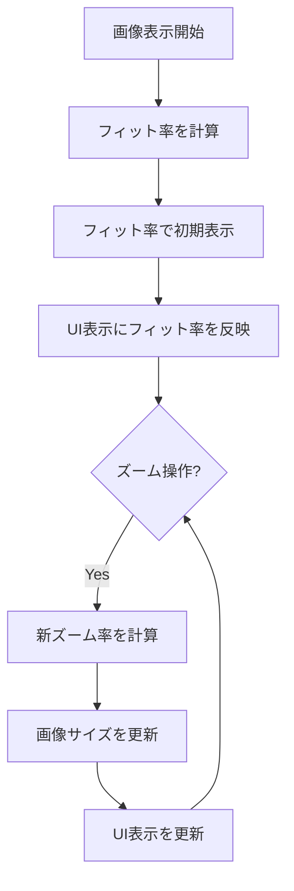
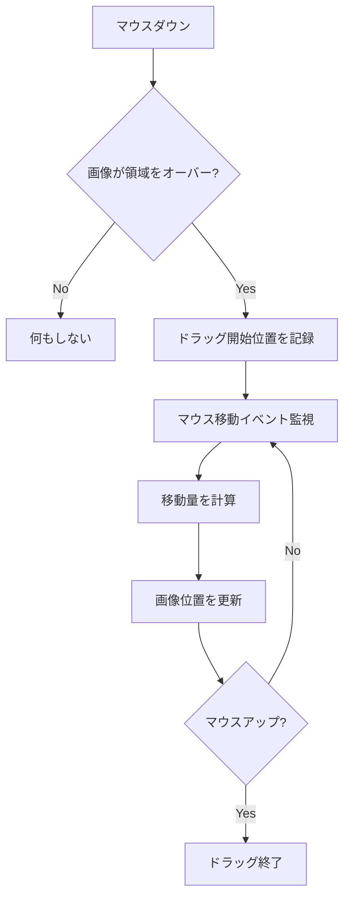
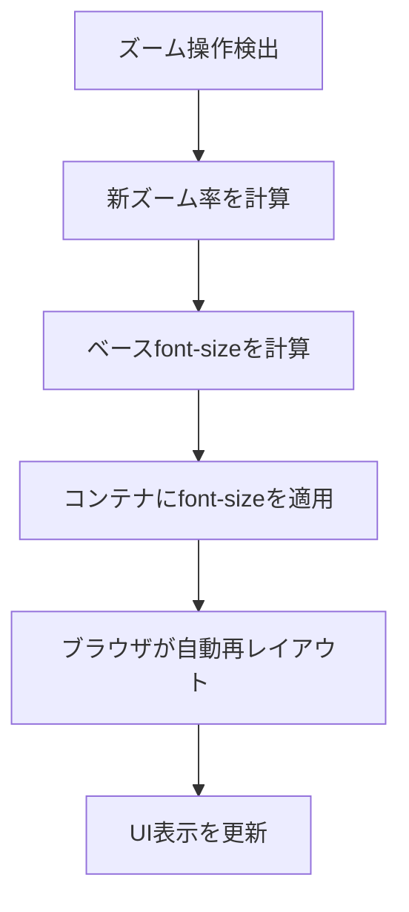

# ビューアーズーム機能修正 - 要件定義書

## 1. 概要

### 1.1 背景
既存のズーム機能（viewer-usability）が実装済みだが、以下の仕様に問題があることが判明した:

**画像ビューアーの問題:**
- 現在のズーム率100%が「フィット状態」を基準としているため、元画像のサイズとの対応が不明瞭
- 画像が拡大された状態で表示領域をオーバーした場合、見たい部分に移動する手段がない

**マークダウンビューアーの問題:**
- `transform: scale()` によるズームはラスター的な拡大であり、テキストがぼやける
- ブラウザのCtrl+ホイールズームのようにシャープなまま拡大されることが期待される

### 1.2 目的
- 画像ビューアーのズーム率を元画像基準に変更し、より直感的な操作を実現
- 画像のパン（ドラッグ移動）機能を追加し、拡大時のナビゲーションを可能にする
- マークダウンビューアーのズームをfont-sizeベースに変更し、常にシャープな表示を維持

### 1.3 スコープ
- 対象: 画像ビューアー (`src/image-viewer/index.ts`)、マークダウンビューアー (`src/markdown/fullscreen.ts`)、共通ズームコントローラー (`src/shared/zoom-controller.ts`)
- 範囲内: ズーム基準の変更、パン機能の追加、マークダウンのfont-sizeベースズーム
- 範囲外: 新機能の追加、UI配置の変更、ズーム範囲の変更

## 2. ビジネス要件

### 2.1 ビジネス目標
- 画像ビューアーで元画像のサイズを直感的に把握可能にする
- 拡大した画像を自由に移動して詳細を確認可能にする
- マークダウンを拡大してもテキストがシャープなまま読めるようにする

### 2.2 対象ユーザー
| ユーザータイプ | 説明 |
|----------------|------|
| 画像確認ユーザー | 画像の詳細（ピクセル単位の確認など）を行うユーザー |
| 文書閲覧ユーザー | マークダウン文書を快適に読みたいユーザー |

### 2.3 期待される効果
- 画像の等倍表示により、実際のサイズ感の把握が容易になる
- パン機能により、拡大した画像の任意の部分を確認可能になる
- シャープなテキスト表示により、長時間の文書閲覧でも目が疲れにくくなる

## 3. ユースケース

### 3.1 ユースケース一覧
| ID | ユースケース名 | アクター | 優先度 |
|----|----------------|----------|--------|
| UC01 | 画像を等倍表示 | ユーザー | 高 |
| UC02 | 拡大した画像をドラッグ移動 | ユーザー | 高 |
| UC03 | マークダウンをシャープに拡大 | ユーザー | 高 |

### 3.2 ユースケース詳細

#### UC01: 画像を等倍表示

**アクター**: ユーザー

**事前条件**:
- 画像ビューアーが開いている状態
- 初期表示はフィット状態（例: 50%と表示）

**基本フロー**:
1. ユーザーがズームコントロールの倍率表示をクリック
2. 画像が100%（元画像の等倍）で表示される
3. 画像が表示領域より大きい場合、はみ出した部分が見えなくなる

**代替フロー**:
- 元画像が表示領域より小さい場合、100%で表示されるが余白ができる

**事後条件**:
- 画像が元サイズで表示されている
- ズーム率表示が「100%」になっている

#### UC02: 拡大した画像をドラッグ移動

**アクター**: ユーザー

**事前条件**:
- 画像ビューアーが開いている状態
- 画像が表示領域をオーバーしている（拡大またはフィット時に大きい画像）

**基本フロー**:
1. ユーザーが画像上でマウスボタンを押下
2. マウスをドラッグして画像を移動
3. マウスボタンを離して移動完了

**代替フロー**:
- 画像が表示領域内に収まっている場合、ドラッグしても移動しない（または無効）

**事後条件**:
- 画像の表示位置がドラッグ量に応じて移動している

#### UC03: マークダウンをシャープに拡大

**アクター**: ユーザー

**事前条件**:
- マークダウンビューアーが開いている状態

**基本フロー**:
1. ユーザーがCtrl+ホイールでズーム操作
2. テキストのfont-sizeが変更される
3. テキストが再レイアウトされる（行の折り返し位置が変わる）
4. テキストはシャープなまま拡大される

**代替フロー**:
- なし

**事後条件**:
- テキストがシャープな状態で拡大表示されている
- 行の折り返し位置が新しいサイズに応じて調整されている

## 4. 機能要件

### 4.1 機能一覧
| ID | 機能名 | 説明 | 優先度 |
|----|--------|------|--------|
| F01 | 画像ズーム基準変更 | 100% = 元画像の等倍に変更 | 高 |
| F02 | 画像パン機能 | ドラッグによる画像移動 | 高 |
| F03 | マークダウンfont-sizeズーム | transform: scaleからfont-sizeベースに変更 | 高 |

### 4.2 機能詳細

#### F01: 画像ズーム基準変更

**説明**: 画像ビューアーのズーム率の基準を変更する

**現在の仕様**:
- 100% = フィット状態（画像が表示領域に収まるサイズ）
- 200% = フィット状態の2倍

**修正後の仕様**:
- 100% = 元画像の等倍（1ピクセル = 1CSSピクセル）
- 200% = 元画像の2倍
- 初期表示 = フィット状態（UI表示はフィット率、例: 50%）

**処理フロー**:

**計算式**:
- フィット率 = min(viewportWidth / imageWidth, viewportHeight / imageHeight) * 100
- 表示サイズ = 元画像サイズ * (zoomLevel / 100)

**ビジネスルール**:
- 初期表示はフィット状態（画像全体が見える）
- ズームリセット（0キーまたは倍率クリック）はフィット状態に戻す
- ズーム範囲は引き続き25%-400%（元画像基準）

**エラーケース**:
| エラー | 条件 | 対応 |
|--------|------|------|
| 非常に大きな画像 | フィット率が25%未満 | 25%を下限として表示 |
| 非常に小さな画像 | フィット率が400%超 | 400%を上限として表示 |

#### F02: 画像パン機能

**説明**: 画像が表示領域をオーバーした場合にドラッグで移動可能にする

**入力**:
- マウスダウン + ドラッグ: 画像移動開始
- マウスアップ: 画像移動終了

**出力**:
- 画像の表示位置が移動

**処理フロー**:

**ビジネスルール**:
- 画像が表示領域に収まっている場合はパン無効
- 画像端が表示領域内に入り込まないよう制限（端で止まる）
- カーソルを `grab` / `grabbing` に変更してパン可能を示す

**状態管理**:
| 状態項目 | 型 | 説明 |
|----------|-----|------|
| isDragging | boolean | ドラッグ中かどうか |
| dragStartX | number | ドラッグ開始時のマウスX座標 |
| dragStartY | number | ドラッグ開始時のマウスY座標 |
| offsetX | number | 画像のX方向オフセット |
| offsetY | number | 画像のY方向オフセット |

**エラーケース**:
| エラー | 条件 | 対応 |
|--------|------|------|
| 領域外ドラッグ | マウスが表示領域外に出た | ドラッグ継続（マウスアップで終了） |

#### F03: マークダウンfont-sizeズーム

**説明**: マークダウンビューアーのズーム方式を変更する

**現在の仕様**:
- `transform: scale()` によるラスター的拡大
- 拡大するとテキストがぼやける
- レイアウトは変わらない（拡大した分だけはみ出す）

**修正後の仕様**:
- `font-size` ベースによるベクター的拡大
- 常にシャープなテキスト表示
- ブラウザのCtrl+ホイールズームと同様の挙動
- テキストが再レイアウトされる（行折り返し位置が変わる）

**処理フロー**:

**計算式**:
- baseFontSize = 16px（デフォルト）
- newFontSize = baseFontSize * (zoomLevel / 100)
- 例: 150%ズーム → font-size: 24px

**ビジネスルール**:
- コンテナ全体のfont-sizeを変更（内部要素は相対サイズで追従）
- コードブロックなどの固定幅要素も適切にスケール
- スクロール位置は可能な限り維持

**互換性考慮**:
- em/remで指定されている要素は自動的にスケール
- px固定の要素は別途対応が必要か確認

## 5. 非機能要件

### 5.1 パフォーマンス要件
- ズーム操作のレスポンス: 16ms以内（60fps維持）
- パン操作のレスポンス: 16ms以内（60fps維持）
- font-size変更後の再レイアウト: ブラウザ依存（許容）

### 5.2 セキュリティ要件
- 該当なし（既存のセキュリティモデルを継続）

### 5.3 可用性要件
- 該当なし

### 5.4 保守性要件
- 画像ビューアー用とマークダウンビューアー用のズームロジックを適切に分離
- 共通部分（UIコンポーネント）は引き続き共有

### 5.5 互換性要件
- 既存のキーボードショートカット（Escape、矢印キー等）との共存
- 既存のズームUI（閉じるボタン、ズームバー）はそのまま使用

## 6. UI/UX要件

### 6.1 画面設計要件

**画像ビューアーの変更点**:
- 初期表示: フィット状態（倍率表示は実際のフィット率）
- カーソル: パン可能時は `grab`、パン中は `grabbing`
- ズームリセット: フィット状態に戻る（100%ではない）

**マークダウンビューアーの変更点**:
- ズーム時のテキスト: 常にシャープ
- レイアウト: ズームに応じて再レイアウト

### 6.2 操作マッピング（変更なし）

| 操作 | アクション |
|------|------------|
| Ctrl + ホイール上 | 拡大 |
| Ctrl + ホイール下 | 縮小 |
| `+` キー または `=` キー | 拡大 |
| `-` キー | 縮小 |
| `0` キー | リセット（画像: フィット、マークダウン: 100%） |
| ドラッグ（画像のみ） | パン移動 |

### 6.3 レスポンシブ対応
- 画像のフィット率はウィンドウサイズ変更時に再計算
- マークダウンは再レイアウトにより自動対応

## 7. データ要件

### 7.1 状態管理（画像ビューアー追加分）

| 状態項目 | 型 | 初期値 | 説明 |
|----------|-----|--------|------|
| fitLevel | number | 計算値 | フィット時のズーム率 |
| panOffset | {x, y} | {0, 0} | パンによる画像オフセット |
| isDragging | boolean | false | ドラッグ中フラグ |

### 7.2 状態管理（マークダウンビューアー変更）

| 状態項目 | 型 | 初期値 | 説明 |
|----------|-----|--------|------|
| zoomLevel | number | 100 | ズーム率（font-size係数） |
| baseFontSize | number | 16 | 基本font-size（px） |

## 8. 外部連携

該当なし（フロントエンドのみの機能）

## 9. 制約条件

### 9.1 技術的制約
- 画像ビューアー: Canvasベースのため、位置制御はCanvasのスタイルで行う
- マークダウンビューアー: font-size変更による再レイアウトのコストは許容

### 9.2 ビジネス上の制約
- 既存の操作（Escape、矢印キー等）を壊してはならない
- ズームUIの見た目・配置は変更しない

## 10. 想定される課題とリスク

### 10.1 技術的課題
| 課題 | 影響度 | 対応策 |
|------|--------|--------|
| パン境界の計算 | 中 | 画像サイズと表示領域から計算、端で制限 |
| font-sizeと固定px要素 | 低 | 主要要素を確認し、必要に応じて修正 |
| スクロール位置維持 | 低 | font-size変更後に可能な範囲で位置調整 |

### 10.2 ビジネスリスク
| リスク | 発生確率 | 影響度 | 対応策 |
|--------|----------|--------|--------|
| ズーム基準変更の混乱 | 低 | 低 | 初期表示がフィットなので体感は変わらない |

## 11. 成功基準

### 11.1 受け入れ基準

**画像ビューアー:**
- [ ] 初期表示がフィット状態で、正しいフィット率が表示される
- [ ] 100%ズームで元画像の等倍表示になる
- [ ] 200%ズームで元画像の2倍表示になる
- [ ] ズームリセットでフィット状態に戻る
- [ ] 画像が表示領域をオーバーしている時、ドラッグで移動できる
- [ ] 画像が表示領域内に収まっている時、ドラッグしても動かない
- [ ] パン中のカーソルが `grabbing` になる
- [ ] パン可能時のカーソルが `grab` になる
- [ ] 画像端が表示領域からはみ出さないよう制限される

**マークダウンビューアー:**
- [ ] ズーム時にテキストがシャープなまま表示される
- [ ] ズーム時にテキストが再レイアウトされる（行折り返しが変わる）
- [ ] 150%ズームでfont-sizeが24pxになる
- [ ] コードブロックも適切にスケールされる
- [ ] 既存のスクロール操作が正常に動作する

### 11.2 KPI
| 指標 | 目標値 | 測定方法 |
|------|--------|----------|
| ズーム操作レスポンス | 16ms以内 | 開発者ツールでのパフォーマンス計測 |
| パン操作レスポンス | 16ms以内 | 開発者ツールでのパフォーマンス計測 |

## 12. テストシナリオ

### 12.1 テスト観点

**画像ビューアー:**
- [ ] 正常系: 初期表示がフィット状態
- [ ] 正常系: 100%で等倍表示
- [ ] 正常系: ドラッグで画像移動
- [ ] 境界値: フィット率が25%未満の大きな画像
- [ ] 境界値: フィット率が400%超の小さな画像
- [ ] 境界値: パン時に端で停止
- [ ] 回帰: 既存のズーム操作が動作

**マークダウンビューアー:**
- [ ] 正常系: font-sizeベースでズーム
- [ ] 正常系: テキストが再レイアウト
- [ ] 正常系: シャープな表示を維持
- [ ] 境界値: 最小ズーム（25%）でfont-size: 4px
- [ ] 境界値: 最大ズーム（400%）でfont-size: 64px
- [ ] 回帰: 既存のスクロール操作が動作
- [ ] 回帰: 既存のリンク操作が動作

## 13. 用語定義

| 用語 | 定義 |
|------|------|
| フィット状態 | 画像全体が表示領域に収まる最大サイズ |
| フィット率 | フィット状態でのズーム率（元画像基準） |
| パン | 画像をドラッグして表示位置を移動する操作 |
| ラスター的拡大 | ピクセルを引き伸ばす拡大（ぼやける） |
| ベクター的拡大 | フォントサイズ変更による拡大（シャープ） |

## 14. 確認事項

### 14.1 確認済み事項

- [x] 画像ビューアーのズーム基準: 100% = 元画像の等倍
- [x] 画像ビューアーの初期表示: フィット状態（UI表示はフィット率）
- [x] パン機能: 画像が表示領域をオーバーした場合のみ有効
- [x] マークダウンビューアー: font-sizeベースのズーム
- [x] マークダウンビューアー: 再レイアウトが発生する

### 14.2 未確認・保留事項
なし

## 15. 参考資料

- 既存ズーム実装: `src/shared/zoom-controller.ts`
- 画像ビューアー実装: `src/image-viewer/index.ts`
- マークダウンビューアー実装: `src/markdown/fullscreen.ts`
- 既存仕様書: `doc/tasks/viewer-usability/`
