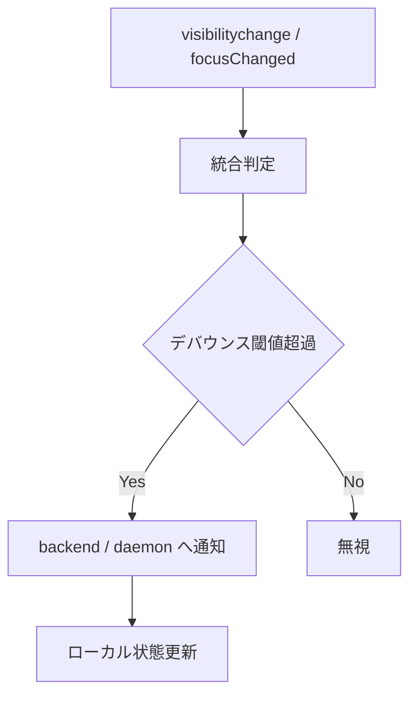
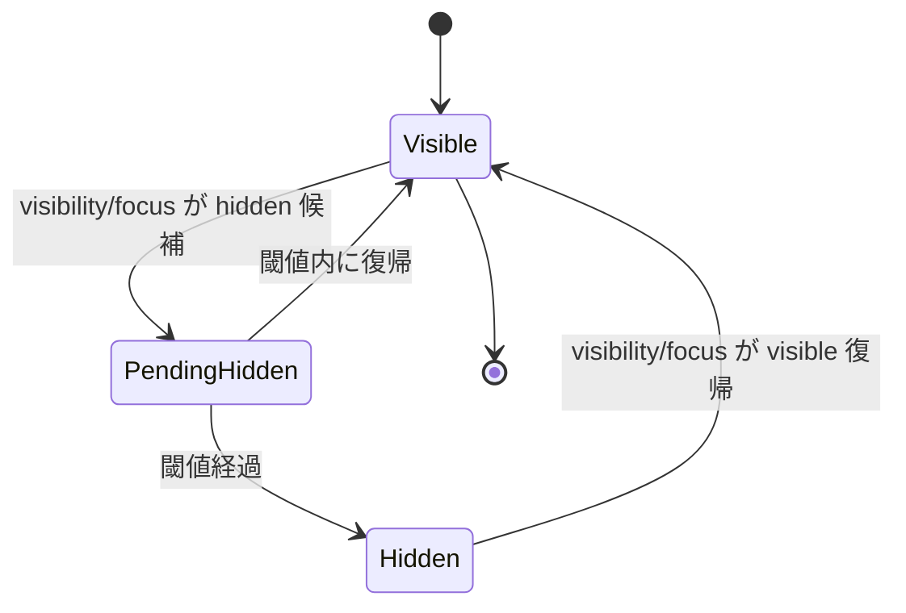

# visibility-aware-pty-streaming - 要件定義書

## 1. 概要

### 1.1 背景

eMterm のウィンドウが focus を失って長時間放置されると、WebKitGTK のバックグラウンド throttling により frontend の `requestAnimationFrame` と `setTimeout` が大幅に間引かれる。その結果、`processPendingData` が呼ばれず `pty_ack` が backend に届かない状態が継続する。

backend reader thread は `wait_for_drain` を 60 秒待った後 forward anyway モードで送信を続けるため、`in_flight` が無制限に蓄積する (実測: 10 時間 hidden 状態で 81MB)。frontend が visible に戻った瞬間、蓄積分の処理で main thread がブロックし「フリーズ」と体感される。

現状の対症療法 (rAF setTimeout fallback、`pty_heartbeat`、forward anyway、health-check による early reinit) はいずれも症状を緩和するが、構造的に蓄積を発散させない手段にはなっていない。

### 1.2 目的

frontend が hidden の間は backend 側で PTY 出力をスナップショット化して保持し、frontend へ実際にデータを流すのは visible な期間に限定する。これにより以下を達成する。

- hidden 期間中の Tauri Channel 上の流量をゼロにする
- backend `in_flight` を構造的に発散させない
- visible 復帰時の表示更新を「最終画面 1 回分」に圧縮し、復帰時のフリーズを排除する

### 1.3 スコープ

#### 対象

- Tauri ローカル PTY セッション (`src-tauri/src/reader.rs` で読む経路)
- Mux daemon が管理するペイン (mux daemon プロセス側の挙動)
- frontend → backend / frontend → daemon への visibility 状態通知
- backend / daemon 側のスクリーン状態保持と復帰時のスナップショット転送
- 既存の対症療法 (rAF fallback、heartbeat、forward anyway、early reinit) の整理

#### 対象外

- WebKitGTK 自体への upstream 修正
- Tauri `backgroundThrottling` 設定変更
- silent audio / Screen Wake Lock 等の throttle 回避ハック
- Web Worker による timer 駆動
- スクロールバック (画面外履歴) を hidden 中も保持する仕組み

## 2. ビジネス要件

### 2.1 ビジネス目標

mux モードで複数の Claude Code セッションを並列実行するユースケースで、ウィンドウを長時間バックグラウンドに置いた後の復帰時にフリーズせず、即座に最新画面で操作再開できる状態にする。

### 2.2 対象ユーザー

| ユーザータイプ | 説明 |
|----------------|------|
| ターミナル常用ユーザー | mux/非 mux 問わず、eMterm を長時間起動し他作業中はバックグラウンドに置く使い方をする |
| AI ツール並列利用者 | 複数の Claude Code セッションを mux で並列起動し、別ウィンドウで作業する |

### 2.3 期待される効果

- 復帰時の体感フリーズを解消する
- backend メモリ使用量を hidden 期間に比例しない上限に抑える
- 既存の症状緩和コードを撤去し、コードベースを単純化する

## 3. ユースケース

### 3.1 ユースケース一覧

| ID | ユースケース名 | アクター | 優先度 |
|----|----------------|----------|--------|
| UC01 | 別ウィンドウで作業し eMterm に戻る | ユーザー | 高 |
| UC02 | デスクトップロック後にロック解除する | ユーザー | 高 |
| UC03 | mux モードで複数ペイン稼働中にウィンドウを最小化して放置する | ユーザー | 高 |
| UC04 | 短時間 (数秒) のウィンドウクリック離脱と復帰を繰り返す | ユーザー | 中 |

### 3.2 ユースケース詳細

#### UC01: 別ウィンドウで作業し eMterm に戻る

**アクター**: ユーザー

**事前条件**:
- eMterm のいずれかのタブで継続的に出力するプロセスが動いている (例: ログ tail、ビルド出力)

**基本フロー**:
1. ユーザーが eMterm から別アプリへ focus を切り替える
2. eMterm が hidden 状態を検知し、backend / daemon に通知する
3. backend / daemon は PTY 出力を内部スナップショットへ流し、frontend への送信を停止する
4. ユーザーが eMterm に focus を戻す
5. eMterm が visible 状態を検知し、backend / daemon に通知する
6. backend / daemon は最新スナップショットを 1 回送信し、以降は通常 streaming に戻る
7. ユーザーは即座に最新画面を見て操作を再開する

**事後条件**:
- 復帰直後の数秒間、UI 操作 (キー入力、リサイズ、タブ切替) が遅延なく応答する
- backend `in_flight` は復帰直後の 1 スナップショット転送分のみ

#### UC02: デスクトップロック後にロック解除する

**アクター**: ユーザー

**事前条件**:
- eMterm が起動している
- いずれかのタブでプロセスが出力を生成している

**基本フロー**:
1. ユーザーがデスクトップをロックする
2. WebView が hidden になる、もしくは focus を失う
3. backend / daemon は出力をスナップショットに流す
4. ユーザーがロック解除する
5. eMterm が visible / focused に復帰する
6. backend / daemon が最新スナップショットを送信する

**事後条件**:
- ロック時間が数時間に及んでも復帰時にフリーズしない
- backend / daemon のメモリ使用量が hidden 期間に比例しない

#### UC03: mux モードで複数ペイン稼働中にウィンドウを最小化して放置する

**アクター**: ユーザー

**事前条件**:
- mux daemon がペインを複数管理している
- いずれかのペインで継続出力がある

**基本フロー**:
1. ユーザーが eMterm ウィンドウを最小化する
2. frontend が hidden を検知し daemon に通知する
3. daemon はペインごとの shadow parser とリングバッファに出力を蓄積する
4. ユーザーがウィンドウを復元する
5. frontend が visible を検知し daemon に通知する
6. daemon は各ペインのスナップショットを順次送信する
7. ユーザーは全ペインの最新状態を確認する

**代替フロー**:
- daemon は frontend 切断時に従来から detach 扱いをしている。hidden は detach の延長として扱う

**事後条件**:
- 全ペインが最新状態を表示する
- ペイン間の表示更新順序は問わないが、各ペインで欠損や中間状態の混入が起きない

#### UC04: 短時間のウィンドウクリック離脱と復帰を繰り返す

**アクター**: ユーザー

**事前条件**:
- eMterm が visible 状態で稼働している

**基本フロー**:
1. ユーザーが別ウィンドウを短時間クリックして戻る (数百 ms 程度)
2. visibility / focus イベントが連続的に発火する
3. backend / daemon は短時間の hidden には反応せず、通常 streaming を維持する

**事後条件**:
- 短時間切替で pause/resume を繰り返さない
- 通常 streaming 中の追加 IPC オーバーヘッドが既存比で有意に増加しない

## 4. 機能要件

### 4.1 機能一覧

| ID | 機能名 | 説明 | 優先度 |
|----|--------|------|--------|
| F01 | Visibility 状態の検知と通知 | frontend が visibility / focus を検知し backend と daemon に通知する | 高 |
| F02 | backend スナップショット保持 (非 mux) | Tauri ローカル PTY セッションの shadow parser と buffer を hidden 中に駆動する | 高 |
| F03 | daemon スナップショット保持 (mux) | mux daemon の既存 detach 機構を visibility 駆動に拡張する | 高 |
| F04 | 復帰時スナップショット送信 | visible 復帰時に最新スナップショットを 1 回送信する | 高 |
| F05 | デバウンス制御 | 短時間の hidden/visible 切替を無視する | 中 |
| F06 | 既存対症療法の整理 | rAF fallback / heartbeat / forward anyway / early reinit を撤去または役割変更する | 中 |
| F07 | スナップショット上限管理 | 保持データ量に上限を設け、超過時は古いデータを破棄する | 中 |

### 4.2 機能詳細

#### F01: Visibility 状態の検知と通知

**説明**: frontend は `document.visibilityState` と Tauri `onFocusChanged` を併用してウィンドウ表示状態を判定し、状態変化を backend (Tauri セッション) と mux daemon に通知する。

**入力**:
- `visibilitychange` イベント
- Tauri `onFocusChanged` イベント

**出力**:
- backend 向け Tauri invoke `pty_set_visibility(session_id, visible: bool)`
- mux daemon 向け APC メッセージ `SetVisibility(visible: bool)`

**処理フロー**:


**ビジネスルール**:
- `visibilityState === "visible"` かつウィンドウ focused のときのみ visible 扱い
- いずれかが満たされない場合は hidden 扱い
- 状態変化はデバウンスを通してから通知する (詳細は F05)

#### F02: backend スナップショット保持 (非 mux)

**説明**: Tauri ローカル PTY セッションごとに `vt100::Parser` shadow と raw byte リングバッファを backend で保持する。hidden 中は reader thread が PTY から読んだバイト列を frontend へ送らず、shadow parser へ供給する。

**入力**:
- PTY からの raw バイト列
- F01 からの visibility 状態

**出力**:
- visible 中: 従来通り `Channel<InvokeResponseBody::Raw>` で frontend へ送信
- hidden 中: shadow parser とリングバッファにのみ書き込み、frontend へは送信しない

**ビジネスルール**:
- hidden 状態で reader は PTY からの read を停止しない (PTY パイプ詰まりを起こさない)
- hidden 状態で `in_flight` カウンタは増加しない
- shadow parser のスクリーンサイズは visible 中と同じく `pty_resize` で同期する
- リングバッファ容量は固定上限 (詳細は F07)

#### F03: daemon スナップショット保持 (mux)

**説明**: mux daemon は既に各ペインに `vt100::Parser` shadow と `DetachRingBuffer` (detach 時のみ駆動) を持つ。本機能では「クライアント切断」と「クライアントは接続中だが hidden」を区別し、hidden 状態でも `Detached` と同様に出力先を内部バッファへ切り替える。

**入力**:
- F01 からの `SetVisibility` メッセージ
- PTY からの raw バイト列

**出力**:
- visible 中: 従来通り接続中チャネルへ `PtyOutputChunk` を送る
- hidden 中: ペインの `output_target` を `Detached` 相当に切り替え、shadow parser とリングバッファへのみ書く

**ビジネスルール**:
- daemon の PTY reader thread 側は visible/hidden いずれでも PTY からの read を継続する
- 接続自体は維持する (再接続コストを避ける)
- ペインごとに状態を持つのではなく、クライアント (GUI) 単位で hidden を扱う

#### F04: 復帰時スナップショット送信

**説明**: visible 復帰時、backend / daemon は保持中の shadow parser から `vt100::Screen::contents_formatted()` 相当のバイト列を構築し、frontend へ 1 回送信する。送信後は通常の streaming に戻る。

**入力**:
- F01 からの「visible に復帰」通知
- shadow parser の現在状態

**出力**:
- 非 mux: `Channel<InvokeResponseBody::Raw>` で `ESC[H ESC[2J` + `contents_formatted()` を送信
- mux: 既存 `RequestPaneSnapshot` 応答と同じ payload を全ペイン分送信

**ビジネスルール**:
- スナップショットは 1 ペイン 1 メッセージとして送る (frontend 側の WASM パーサが 1 回で消費可能なサイズに収まる)
- スナップショット送信後、リングバッファ内の差分データは破棄する (shadow parser の最終状態が真実とする)
- frontend 側の WASM grid は復帰時にスナップショットを処理することで最新状態に同期する

#### F05: デバウンス制御

**説明**: visibility / focus の短時間トグルで pause/resume が連発するのを防ぐため、状態変化通知をデバウンスする。

**入力**:
- F01 からの状態変化候補

**出力**:
- 確定後の状態変化通知

**ビジネスルール**:
- hidden → visible への遷移は即座に通知する (ユーザー復帰時の応答性優先)
- visible → hidden への遷移は閾値時間 (確定値は SPEC で決定) 経過後に通知する
- 閾値内に visible へ戻った場合は通知をキャンセルする

#### F06: 既存対症療法の整理

**説明**: 本機能で構造的に解決される項目から、既存の対症療法コードを撤去または役割変更する。

**対象一覧**:
| 項目 | 場所 | 撤去方針 |
|------|------|----------|
| rAF setTimeout fallback (`RAF_FALLBACK_MS`) | `src/terminal-app/pty-handler.ts` | 撤去する |
| `pty_heartbeat` event listener | `src/terminal-app/pty-handler.ts` | 撤去する |
| backend `pty_heartbeat` emit | `src-tauri/src/reader.rs` | 撤去する |
| `wait_for_drain` の 60s timeout 後 forward anyway | `src-tauri/src/pty/backpressure.rs` | 撤去する |
| `health-check` による early WASM reinit | `src/terminal-app/pty-handler.ts` | 撤去する |
| visibilitychange による drain trigger | `src/terminal-app/pty-handler.ts` | 撤去する (本機能と統合) |
| focus 健康診断 (`onFocusChanged` の cols() 呼び出し) | `src/terminal-app/pty-handler.ts` | 維持する (WASM 健全性チェックは別目的) |
| 診断ログ群 (`DIAG-MUX-*`, `backendSent`, `inflight=` 等) | 各所 | 撤去する |

**ビジネスルール**:
- 本機能の動作確認後、対症療法群は順次撤去する
- focus 時の WASM 健全性チェックはサスペンド復帰後の memory corruption 検知用途で残す

#### F07: スナップショット上限管理

**説明**: hidden 状態の継続中、リングバッファと shadow parser のメモリ使用量に上限を設ける。

**ビジネスルール**:
- shadow parser はスクリーン 1 画面分の状態のみ保持する (構造的に上限あり)
- リングバッファは固定容量 (確定値は SPEC で決定) を超えた場合に古いデータを破棄する
- 復帰時のスナップショット送信では shadow parser 状態のみ使用するため、リングバッファ破棄はユーザー体験に影響しない

## 5. 非機能要件

### 5.1 パフォーマンス要件

- visible 中の通常 streaming スループットを既存比で低下させない
- visibility 通知の追加 invoke 頻度を 1 秒あたり 1 回未満に抑える
- 復帰時のスナップショット送信処理 (frontend WASM 処理含む) を 200ms 以内に完了する

### 5.2 メモリ要件

- hidden 期間が無限に延びても backend / daemon のメモリ使用量が線形増加しない
- 1 セッションあたりの追加メモリは shadow parser サイズ + リングバッファ上限以内

### 5.3 互換性要件

- Linux (WebKitGTK) と Windows (WebView2) の両方で動作する
- 既存のローカル PTY セッションと mux モードの両方で動作する
- CLI コマンド (`emterm markdown`, `emterm image`) の OSC 拡張で送られる画像 / Markdown 表示が visible 復帰後にも正しく表示される

### 5.4 信頼性要件

- visibility 通知の取りこぼしや順序入れ替わりが発生しても、最終的に visible 状態で frontend と backend が一致する
- backend / daemon がスナップショット送信に失敗した場合でも、PTY セッションは継続稼働する

### 5.5 保守性要件

- 既存対症療法の撤去後、関連する診断ログを整理する
- visibility 状態遷移は logger に warn レベルで記録する

## 6. UI/UX要件

### 6.1 画面設計要件

- visibility 状態を UI に表示しない (内部メカニズム)
- 復帰時、スナップショット適用は 1 フレームで完了し、ちらつかない

### 6.2 復帰時の挙動

- ユーザーから見て、復帰前と復帰後で表示が「最新画面に飛ぶ」遷移となる
- 中間状態 (hidden 中の途中経過) は表示しない

## 7. データ要件

### 7.1 状態モデル



### 7.2 セッション/ペインごとの保持データ

| データ種別 | 保持場所 | 上限 |
|------------|----------|------|
| shadow parser 状態 | 非 mux: backend / mux: daemon | スクリーン 1 画面分 |
| リングバッファ | 非 mux: backend / mux: daemon | 固定容量 (SPEC で決定) |
| visibility state | 非 mux: backend / mux: daemon | 1 boolean / クライアント |

## 8. 外部連携

該当なし。

## 9. 制約条件

### 9.1 技術的制約

- frontend → backend / daemon の通知経路は既存 IPC (Tauri invoke / mux APC) を流用する
- 非 mux と mux で 2 系統の実装が必要 (プロセス境界が異なる)
- `vt100::Parser` (Cargo crate `vt100 = "0.15"`) の挙動範囲内で snapshot 構築する

### 9.2 ビジネス上の制約

なし。

### 9.3 スケジュール制約

なし。

## 10. 想定される課題とリスク

### 10.1 技術的課題

| 課題 | 影響度 | 対応策 |
|------|--------|--------|
| `vt100::Parser` が画像 (Kitty/SIXEL) や Markdown OSC を保持しない | 中 | リングバッファに raw バイト列も併用し、復帰時に画像/Markdown OSC は raw で再送する案を SPEC で検討する |
| デバウンス閾値が短すぎると pause/resume 連発、長すぎると蓄積開始が遅延 | 中 | 閾値を実機で計測し SPEC で確定する |
| visibility イベントが Linux compositor / Windows で挙動差異がある | 中 | 既存 `visibility-render-recovery` の知見を流用し、focus と visibility を OR 条件で扱う |
| 復帰時スナップショットが大きすぎて main thread をブロック | 低 | 1 ペイン 1 メッセージのサイズ上限はスクリーン分なので構造的に小さい |

### 10.2 ビジネスリスク

なし。

## 11. 成功基準

### 11.1 受け入れ基準

- [ ] hidden 状態を 1 時間継続しても backend / daemon の RSS 増加が 10MB 未満に収まる
- [ ] hidden → visible 復帰時の UI 操作応答が 200ms 以内
- [ ] 復帰直後の表示が最新の PTY 出力状態と一致する
- [ ] 既存の rAF fallback / heartbeat / forward anyway 関連ログが本機能下では出力されない (撤去確認)
- [ ] CLI コマンドで表示した画像 / Markdown が hidden → visible 復帰後にも表示される
- [ ] mux モードと非 mux モードの両方で上記が成立する

### 11.2 KPI

| 指標 | 目標値 | 測定方法 |
|------|--------|----------|
| 復帰時 main thread block 時間 | < 200ms | `performance.now()` 計測 |
| hidden 中の `in_flight` 増加 | 0 byte | `pty_get_send_stats` 相当 |
| hidden 1 時間後の backend RSS 増加 | < 10MB | `/proc/$pid/status` |

## 12. テストシナリオ

### 12.1 テスト観点

- [ ] 正常系: visible → hidden → visible のサイクルで shadow parser 経由の最新画面が復帰時に表示される
- [ ] 正常系: 非 mux と mux の両方で動作する
- [ ] 異常系: hidden 中に PTY が exit した場合、visible 復帰時に exit 状態が反映される
- [ ] 異常系: backend / daemon が visibility 通知を取りこぼした場合の最終整合性
- [ ] 境界値: 短時間の visible/hidden 連続切替でデバウンスが正しく機能する
- [ ] 境界値: hidden 状態を数時間継続した場合のメモリ上限維持
- [ ] パフォーマンス: visible 中の通常 streaming スループットの回帰がない
- [ ] パフォーマンス: 復帰時 1 セッション/全ペインのスナップショット適用時間
- [ ] 互換性: CLI 画像 / Markdown 表示の hidden 跨ぎ復帰

## 13. 用語定義

| 用語 | 定義 |
|------|------|
| visible | frontend ウィンドウが表示中かつ focused の状態 |
| hidden | frontend ウィンドウが非表示、最小化、focus 喪失のいずれかの状態 |
| shadow parser | backend / daemon が PTY 出力を内部で解釈してスクリーン状態を保持する `vt100::Parser` インスタンス |
| スナップショット | shadow parser から `contents_formatted()` で生成した、現在画面を再現する ANSI バイト列 |
| デバウンス | 短時間の状態変動を無視して安定後の状態のみを通知する処理 |
| 対症療法 | 本機能で構造的に解決される問題に対する既存の暫定回避策 |

## 14. 確認事項

### 14.1 確認済み事項

- [x] 採用方針: hidden 中は backend / daemon が PTY 出力を保持し、visible 復帰時に最新スナップショットを 1 回送る
- [x] mux daemon の既存 `vt100::Parser` shadow と `DetachRingBuffer` を流用する
- [x] 非 mux PTY セッションには新規に shadow parser とリングバッファを backend に追加する
- [x] mux daemon の PTY reader は visibility 状態に関わらず PTY からの read を継続する (パイプ詰まり回避)
- [x] 復帰時転送は 1 回のフルスナップショット (1 ペインあたり)
- [x] 既存対症療法は本機能の動作確認後に撤去する。focus 時の WASM 健全性チェックのみ役割が独立しており残す
- [x] CLI コマンドで送られる画像 / Markdown も hidden 跨ぎで正しく表示される必要がある

### 14.2 未確認・保留事項

- [ ] デバウンス閾値の確定値 (SPEC で決定)
- [ ] 非 mux backend のリングバッファ容量上限 (SPEC で決定)
- [ ] mux daemon の hidden ↔ detach 状態管理の細部 (両者共存時の優先関係)
- [ ] 画像 (Kitty/SIXEL) / Markdown OSC を shadow parser が保持できない場合の代替経路の確定

## 15. 参考資料

- `tmp/freeze-resolution-direction.md`: 本機能の方針メモ
- `doc/tasks/visibility-render-recovery/SPEC.md`: 既存の visibility/focus 検知実装
- `doc/tasks/mux-output-throughput/SPEC.md`: mux daemon 出力経路の既存仕様
```
