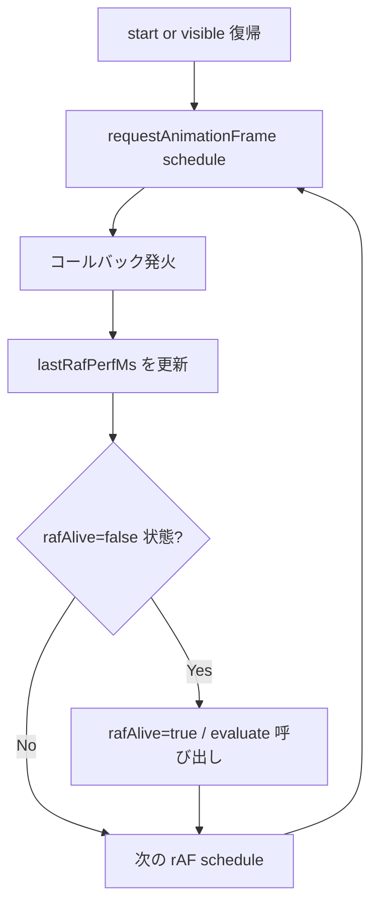

# visibility-raf-heartbeat - 要件定義書

## 1. 概要

### 1.1 背景

`visibility-aware-pty-streaming` feature により、`document.visibilitychange` イベントと Tauri webview focus 変化に基づいて backend PTY ストリームを開閉する仕組みを導入した。しかし 2026-05-05 22:42 〜 2026-05-06 05:02 (約 6.3 時間) の発生事例で、再び freeze が観測された。

emterm.log から読み取れる挙動:
- `setInterval` による DIAG-PTY-HEALTH heartbeat は動き続ける (`loopLag=0ms`)
- `chunkRecv` カウンターは 22:42 で停止し 6 時間進まない
- `[DIAG-IDLE]` ログは 6 時間出現しない (`document.visibilitychange` 未発火)
- backend は visible 判定のまま `wait_for_drain` で 6 時間ブロック (`backpressure stalled 22831092ms` / in_flight 8MB)

WebKitGTK は workspace 移動 / window occluded / スクリーンロック等の状況下で、**rAF を throttle するが `visibilitychange` を発火しない**ことがある。`document.visibilityState` のみを監視する現行設計では、このパターンを検知できない。

### 1.2 目的

`VisibilityController` に **rAF heartbeat 監視** を追加し、rAF が一定時間走行していない状態を effective hidden として扱うことで、上記 freeze パターンを未然に防止する。

### 1.3 スコープ

#### 対象
- `src/pty/visibility-controller.ts` の rAF heartbeat 監視機構追加
- 既存 `currentEffective()` 判定への第 3 シグナル統合
- `[DIAG-IDLE]` ログへの reason 情報追加
- ユニットテストの追加 (`src/pty/visibility-controller.test.ts`)
- E2E テストの新設 (`e2e-tests/specs/visibility-raf-heartbeat.e2e.js`)
- 手動検証手順書の新設 (`doc/tasks/visibility-raf-heartbeat/freeze-repro-rafstall.md`)

#### 対象外
- backend (Rust) 側のコード変更
- mux daemon プロトコル変更
- `visibility-aware-pty-streaming` feature の既存 SPEC FR1〜FR16 の挙動変更
- WebKit 自体への workaround pull request

## 2. ビジネス要件

### 2.1 ビジネス目標

- 長時間バックグラウンドや workspace 切り替え後の操作再開時に freeze を起こさない端末体験を保証する
- AI コーディングツール (Claude Code 等) を長時間動作させるユースケースで、ユーザーが安心して別作業に切り替えられる

### 2.2 対象ユーザー

| ユーザータイプ | 説明 |
|----------------|------|
| Linux (WebKitGTK) ユーザー | workspace 切替やスクリーンロックを多用するデスクトップユーザー |
| 長時間 AI セッションを動かすユーザー | Claude Code 等を非アクティブ画面で動かしっぱなしにするユーザー |

### 2.3 期待される効果

- workspace 移動/window occluded/スクリーンロック中の freeze 完全解消
- backend `wait_for_drain` で 6 時間級の blocking が発生しないことの保証
- visibility 復帰時に snapshot 1 回送信で UI が即時整合する既存パスを継続利用

## 3. ユースケース

### 3.1 ユースケース一覧

| ID | ユースケース名 | アクター | 優先度 |
|----|----------------|----------|--------|
| UC01 | workspace 切替で freeze を起こさない | デスクトップユーザー | 高 |
| UC02 | スクリーンロック中も backend を停止できる | デスクトップユーザー | 高 |
| UC03 | 復帰時に snapshot で表示が即整合する | デスクトップユーザー | 高 |
| UC04 | システムスリープ復帰で false positive を起こさない | ノート PC ユーザー | 中 |

### 3.2 ユースケース詳細

#### UC01: workspace 切替で freeze を起こさない

**アクター**: デスクトップユーザー

**事前条件**:
- emterm が visible で稼働中、PTY が高頻度出力中

**基本フロー**:
1. ユーザーが別 workspace に切り替え (emterm window が非表示)
2. WebKit が rAF を throttle するが `visibilitychange` は発火しない
3. 5 秒以内に rAF heartbeat が dead と判定される
4. controller が `setVisibility(false)` を backend に送信
5. backend が detached 状態に遷移し、PTY 出力をリングバッファに退避

**事後条件**:
- backend `in_flight` が増えない
- frontend は ack を送らない (rAF 停止中)
- `[DIAG-IDLE] visibility→hidden | reason=raf-stall` が記録される

#### UC02: スクリーンロック中も backend を停止できる

**アクター**: デスクトップユーザー

**事前条件**: emterm visible 中

**基本フロー**:
1. ユーザーがスクリーンロック (compositor によっては `visibilitychange` 不発火)
2. rAF が WebKit によって throttle
3. 5 秒以内に rAF dead 判定 → backend hidden 通知
4. ロック解除で rAF 再開
5. controller が rAF alive を検知し `setVisibility(true)` を backend に送信
6. backend は snapshot を 1 回送信、frontend は WASM grid に流して再描画

**事後条件**:
- ロック中の経過時間にかかわらず backend で stall が発生していない
- 復帰直後に画面が最新の PTY 出力に整合している

#### UC03: 復帰時に snapshot で表示が即整合する

既存 `visibility-aware-pty-streaming` feature の FR8/FR9 を流用する。本 feature では rAF 復帰経路から既存の `setVisibility(true)` 経路を呼び出すだけで、snapshot ロジック自体は変更しない。

#### UC04: システムスリープ復帰で false positive を起こさない

**アクター**: ノート PC ユーザー

**事前条件**: emterm 起動中、visible

**基本フロー**:
1. ノート PC を suspend (lid close 等) → 全 process が休眠
2. しばらくして resume → setInterval が再開
3. controller の health-check tick で連続 tick 間隔が 30 秒を超過していたことを検知
4. その tick だけ rAF dead 判定をスキップ、`lastRafPerfMs` を `performance.now()` で再初期化
5. 次の tick で通常判定を再開

**事後条件**:
- スリープ復帰直後に false-positive な hidden 通知が発生しない
- 30 秒待った後に状態が正しく整合する

## 4. 機能要件

### 4.1 機能一覧

| ID | 機能名 | 説明 | 優先度 |
|----|--------|------|--------|
| F01 | rAF heartbeat self-loop | visible 中に `lastRafPerfMs` を継続更新 | 高 |
| F02 | rAF dead 判定 | 10 秒 health-check tick 内で 5 秒以上経過 = dead | 高 |
| F03 | currentEffective 統合 | `document.hidden && focused && rafAlive` の三重判定 | 高 |
| F04 | 復帰判定 | rAF alive 復帰で即時 visible 通知 | 高 |
| F05 | suspend gap 検出 | 30 秒以上の tick gap でその回の判定スキップ | 中 |
| F06 | DIAG-IDLE reason 拡張 | hidden 通知時に reason を出力 | 中 |
| F07 | hidden 中の rAF loop 停止 | `effective_visible=false` 中は rAF self-loop を停止 | 高 |
| F08 | テスト用 deps 注入 | rAF 関数を deps から差し替え可能にする | 中 |

### 4.2 機能詳細

#### F01: rAF heartbeat self-loop

**説明**: VisibilityController が visible 中だけ rAF self-loop を回し、各コールバックで `lastRafPerfMs = performance.now()` を更新する。

**処理フロー**:


**ビジネスルール**:
- self-loop は controller の effective_visible 中だけ動作
- `effective_visible=false` 遷移で次の rAF コールバックは scheduling せず終了
- `effective_visible=true` 遷移で再度開始

#### F02: rAF dead 判定

**説明**: 10 秒間隔の既存 `health-check` setInterval 内で `now - lastRafPerfMs > RAF_DEAD_THRESHOLD_MS (5000)` を判定。

**判定タイミング**:
- 既存 `HEALTH_CHECK_MS` (10 秒) 内で同時に評価
- `lastRafPerfMs` が `null` の場合は判定スキップ (起動直後の grace period)
- `effective_visible=false` の間は判定スキップ

**閾値**: `RAF_DEAD_THRESHOLD_MS = 5000`

#### F03: currentEffective 統合

**説明**: `currentEffective()` の判定式を以下に変更:

```typescript
private currentEffective(): boolean {
  return this.deps.getDocumentVisible() && this.focused && this.rafAlive;
}
```

`rafAlive` は内部 boolean。初期値 `true`、F02 で `false` 化、F04 で `true` 化。

#### F04: 復帰判定

**説明**: rAF コールバック内で `rafAlive=false` から `true` に変化した瞬間、`evaluate()` を呼び出して `setVisibility(true)` をディスパッチする。

**ビジネスルール**:
- 復帰判定に debounce は適用しない (visible 復帰即時)
- 既存の visible 復帰経路に乗せ、snapshot 送信は backend 側で実行

#### F05: suspend gap 検出

**説明**: health-check tick の連続呼び出し間隔が `HEALTH_CHECK_MS × 3 = 30 秒` を超えた場合、その tick での dead 判定をスキップし `lastRafPerfMs = performance.now()` で再初期化する。

**判定式**:
```typescript
const sinceLastTick = now - lastHealthTickPerfMs;
if (sinceLastTick > HEALTH_CHECK_MS * 3) {
  this.lastRafPerfMs = now;
  this.lastHealthTickPerfMs = now;
  return; // この tick では dead 判定しない
}
```

#### F06: DIAG-IDLE reason 拡張

**説明**: hidden 通知時、既存ログの末尾に `| reason={document|focus|raf-stall}` を追記する。複数要因が同時の場合は `+` で連結 (例: `reason=document+focus`)。

**互換性**: 既存ログの先頭部分 `[WARN][FRONTEND] [DIAG-IDLE] visibility→hidden at <ISO>` は維持。

**例**:
```
[WARN][FRONTEND] [DIAG-IDLE] visibility→hidden at 2026-05-06T03:22:16.712Z | reason=raf-stall
[WARN][FRONTEND] [DIAG-IDLE] visibility→visible at 2026-05-06T03:22:25.701Z | hiddenForMs=8989
```

#### F07: hidden 中の rAF loop 停止

**説明**: `effective_visible=false` を notify した時点で次の rAF scheduling を停止し、フレームコールバック内 (実行中の場合) も最後に scheduling せずに終了する。

**目的**: バッテリー / CPU 負荷を最小化。hidden 中は backend が detach されているため rAF 監視は不要。

#### F08: テスト用 deps 注入

**説明**: `VisibilityControllerDeps` に rAF/cancelAF と `performance.now()` を inject 可能なフィールドを追加する。

**追加フィールド**:
```typescript
requestAnimationFrameFn?: typeof requestAnimationFrame;
cancelAnimationFrameFn?: typeof cancelAnimationFrame;
nowFn?: () => number; // performance.now() fallback to Date.now()
```

## 5. 非機能要件

### 5.1 パフォーマンス要件 (NFR1)

- rAF コールバック内では `performance.now()` 1 回読み出しと boolean 比較以外の処理を加えない
- hidden 中は rAF self-loop を停止する (定性記述、数値目標なし)
- health-check の追加処理は数行の判定のみ

### 5.2 リソース要件 (NFR2)

- rAF heartbeat 用の追加状態は controller 内のフィールド数個 (number/boolean)
- 永続的なメモリ確保なし

### 5.3 可用性要件 (NFR3)

- rAF が無効な環境 (Node.js テストランナー等) でも初期化が失敗しない
- DI で全関数を差し替え可能

### 5.4 保守性要件 (NFR4)

- `[DIAG-IDLE] visibility→hidden ... | reason=raf-stall` が記録されることで、運用ログから rAF 起因の hidden を即座に判別可能
- `[DIAG-PTY-HEALTH]` 既存ログの `rafMaxGap` フィールドと並んで debug が容易

### 5.5 互換性要件 (NFR5)

- `visibility-aware-pty-streaming` SPEC の FR1〜FR16 の挙動を破壊しない
- 既存テスト (`visibility-controller.test.ts`、`visibility-aware-streaming.e2e.js` 等) を全てそのまま通す
- `[DIAG-IDLE]` ログを参照する既存スクリプト/spec が `reason` フィールド未対応でも崩れないこと (末尾 append 形式を維持)

## 6. UI/UX要件

該当なし。本 feature はバックグラウンド処理の改善であり、UI は変更しない。

## 7. データ要件

該当なし。永続化データは追加しない。

## 8. 外部連携

該当なし。

## 9. 制約条件

### 9.1 技術的制約

- WebKitGTK の rAF throttle 仕様には介入できない
- `performance.now()` は monotonic だが suspend 中の挙動はプラットフォーム依存
- E2E テストでは tauri-driver 経由で rAF を monkey-patch する必要がある

### 9.2 ビジネス上の制約

なし。

### 9.3 スケジュール制約

freeze 再発防止のため、優先度高で実装する。

## 10. 想定される課題とリスク

### 10.1 技術的課題

| 課題 | 影響度 | 対応策 |
|------|--------|--------|
| rAF dead 閾値が短すぎて false-positive 発生 | 中 | 5000ms から開始、運用ログで観測し必要なら調整 |
| WebKit 固有の rAF throttle タイミング不明 | 中 | E2E で monkey-patch + 実機 freeze-repro 手順で検証 |
| suspend 復帰で false-positive | 中 | F05 (30 秒 gap 検出) で対処 |
| hidden 中に rAF loop 残留 | 低 | F07 で明示的に停止、テストで確認 |

### 10.2 ビジネスリスク

| リスク | 発生確率 | 影響度 | 対応策 |
|--------|----------|--------|--------|
| 既存 visibility-aware-streaming 挙動の退行 | 低 | 高 | NFR5 で互換性保証、既存テスト全通過を必須化 |

## 11. 成功基準

### 11.1 受け入れ基準

- [ ] rAF stall 発生時に 5 秒以内に backend へ hidden 通知が飛ぶ (E2E)
- [ ] hidden 中は rAF self-loop が停止している (Unit)
- [ ] rAF 復帰即時に visible 通知が飛ぶ (Unit / E2E)
- [ ] suspend 復帰時に false-positive を起こさない (Unit)
- [ ] 既存 visibility-aware-streaming.e2e.js が引き続き全通過
- [ ] `[DIAG-IDLE] reason=raf-stall` ログが記録される
- [ ] freeze-repro-rafstall.md 手順で実機で freeze が再現しないことを確認 (手動)

### 11.2 KPI

| 指標 | 目標値 | 測定方法 |
|------|--------|----------|
| backpressure stall 観測数 | 0 件/週 | emterm.log から `backpressure stalled` を grep |
| rAF dead 検知回数 | 0 件超/週 | emterm.log から `reason=raf-stall` を grep |

## 12. テストシナリオ

### 12.1 テスト観点

- [x] 正常系: visible 中に rAF が走り続ける
- [x] 異常系: rAF が 5 秒以上止まる → hidden 通知発火
- [x] 復帰: rAF 再開 → 即時 visible 通知発火
- [x] 境界値: 4999ms と 5001ms での dead 判定
- [x] suspend: 30 秒以上の tick gap で判定スキップ
- [x] 互換性: 既存 visibility-aware-streaming が破綻しない
- [x] hidden 中: rAF self-loop が停止している (cancelAnimationFrame 呼ばれる)

## 13. 用語定義

| 用語 | 定義 |
|------|------|
| rAF | `window.requestAnimationFrame`。WebKit が背景タブ等で throttle する API |
| rAF dead | 5 秒以上 rAF コールバックが発火していない状態 |
| effective_visible | document.hidden, window focus, rAF alive の AND 判定結果 |
| rAF heartbeat | rAF コールバックが定期的に発火していることを `lastRafPerfMs` で確認する仕組み |
| suspend gap | システムスリープ等で setInterval tick が長期間止まったあとの間隔 |

## 14. 確認事項

### 14.1 確認済み事項

- [x] feature scope: 新 feature (`doc/tasks/visibility-raf-heartbeat/`) として独立で作成
- [x] rAF self-loop の動作期間: visible 中だけ
- [x] テスト配置: 既存 `src/pty/visibility-controller.test.ts` に TS-29〜TS-33 を追加
- [x] DIAG-IDLE log format: 既存形式末尾に `| reason=...` を append
- [x] rAF dead 閾値: 5000ms
- [x] rAF tracker は controller 独立 (pty-handler の rafMaxGap とは無関係)
- [x] suspend gap 検出: HEALTH_CHECK_MS × 3 = 30 秒で判定スキップ
- [x] E2E spec: `visibility-raf-heartbeat.e2e.js` を新規作成、rAF monkey-patch 方式
- [x] NFR: 定性記述のみ、数値目標なし
- [x] 互換性: `visibility-aware-pty-streaming` SPEC の FR1〜FR16 を保証
- [x] 手動検証: `freeze-repro-rafstall.md` を新設

### 14.2 未確認・保留事項

なし。

## 15. 参考資料

- 方針メモ: `tmp/freeze-rafheartbeat-direction.md`
- 既存 feature: `doc/tasks/visibility-aware-pty-streaming/SPEC.md`
- freeze 事例ログ: `~/.local/share/net.laser5.app.emterm/logs/emterm.log` (2026-05-05 22:42 〜 2026-05-06 12:17)
