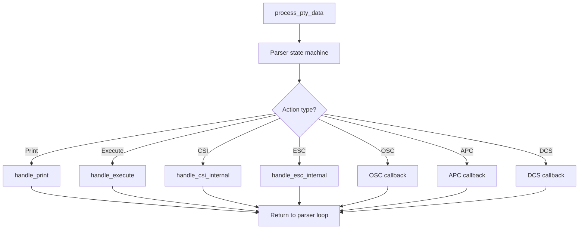
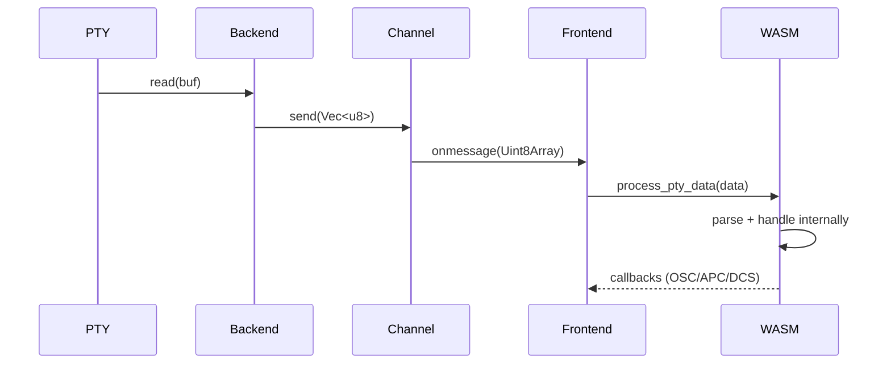

# WASM ANSI Parser + Binary IPC (Sprint 6) - 要件定義書

## 1. 概要

### 1.1 背景

Sprint 0〜5で、ターミナルの全ハンドラ（Print, C0, CSI, ESC）とRing BufferをWASM化し、スクロール操作の完全内部化を達成した。しかし、PTYデータの処理パイプラインには依然として二重処理構造が残っている：

```
PTY → Rust Backend Parser → JSON serialize → Tauri IPC → JSON.parse → TS dispatch → WASM handlers
```

このパイプラインでは：
- Rust BackendでANSIパースを行い、構造化データ（`TerminalAction`）に変換
- `serde_json::to_string()`でJSON文字列にシリアライズ
- Tauri `app.emit()`でフロントエンドに送信
- フロントエンドで`JSON.parse()`によるデシリアライズ
- TSディスパッチャーがアクションタイプに応じてWASMハンドラを呼び出し

という冗長なフローになっている。Sprint 5完了時点で全ハンドラがWASM化済みであるため、パーサー自体をWASMに移植すれば、PTY生バイトから直接WASM内部で処理が完結する。

### 1.2 目的

- ANSIパーサーをRust BackendからWASMクレートに移動
- Tauri Channel APIによるBinary IPC（JSON廃止）
- `process_pty_data(&[u8])`による端末処理のエンドツーエンドWASM化
- OSC/APC/DCSのクロージャコールバック（マルチタブ安全）
- 画像処理パイプラインの再構築（WASM→JS→Backend）
- `TerminalState.dispose()`メソッドの追加

### 1.3 スコープ

**対象:**
- ANSIパーサーのWASM移植
- Binary IPC（Tauri Channel API）
- クロージャコールバック機構
- 画像処理パイプライン変更
- Backend簡素化（パーサー削除、Channel化）
- PtyClient/TerminalAppリファクタリング
- `TerminalState.dispose()`追加
- `terminal_actions`/`pty_output`イベント廃止

**対象外:**
- Renderer Zero-Copy（Sprint 7）
- 新規ANSIシーケンスの追加
- マルチタブアーキテクチャの変更

## 2. ビジネス要件

### 2.1 ビジネス目標

- ターミナルの入出力レイテンシを大幅に削減
- 大量出力時のスループットを改善（`cat large_file`等）
- IPC通信量を5-10倍削減

### 2.2 対象ユーザー

| ユーザータイプ | 説明 |
|----------------|------|
| ターミナルユーザー | 日常的にCLIツール・AI Codingツールを使用する開発者 |
| 大量出力ユーザー | ログ監視、ビルド出力など大量テキストを扱うユーザー |

### 2.3 期待される効果

- JSON serialize/deserialize完全廃止による処理時間短縮
- 二重パース解消（Rust Parser + TS dispatch → WASM Parser のみ）
- IPC通信量5-10倍削減（JSON構造体 → 生バイト）

## 3. ユースケース

### 3.1 ユースケース一覧

| ID | ユースケース名 | アクター | 優先度 |
|----|----------------|----------|--------|
| UC01 | 通常のターミナル操作 | ユーザー | 高 |
| UC02 | 大量出力の処理 | ユーザー | 高 |
| UC03 | 画像の表示 | ユーザー | 中 |
| UC04 | タブの作成と破棄 | ユーザー | 中 |

### 3.2 ユースケース詳細

#### UC01: 通常のターミナル操作

**アクター**: ターミナルユーザー

**事前条件**:
- ターミナルが起動済み
- PTYセッションがアクティブ

**基本フロー**:
1. PTYがバイトデータを出力
2. BackendがChannel経由で生バイトをフロントエンドに転送
3. フロントエンドがWASM `process_pty_data()`にバイトを渡す
4. WASMが内部でパース→ハンドラ実行→状態更新を完結
5. OSC等のDOMアクションはクロージャコールバック経由でJSに通知
6. レンダラーがdirty cellsを検出して描画

#### UC03: 画像の表示

**アクター**: ユーザー

**基本フロー**:
1. PTYがKitty Graphics/SIXELデータを出力
2. BackendがChannel経由で生バイトをフロントエンドに転送
3. WASMパーサーがAPC/DCSシーケンスを検出
4. WASMがクロージャコールバックで画像データをJSに通知
5. JSが`invoke()`でbackendの画像処理APIを呼び出し
6. Backendが画像をデコードし、`image_event`として結果を返す
7. フロントエンドが画像を表示

## 4. 機能要件

### 4.1 機能一覧

| ID | 機能名 | 説明 | 優先度 |
|----|--------|------|--------|
| F01 | WASM ANSI Parser | パーサーのWASM移植 | 高 |
| F02 | process_pty_data API | エンドツーエンド処理API | 高 |
| F03 | Binary IPC | Tauri Channel APIによるバイナリ転送 | 高 |
| F04 | クロージャコールバック | OSC/APC/DCS通知機構 | 高 |
| F05 | 画像パイプライン | WASM→JS→Backend画像処理 | 中 |
| F06 | Backend簡素化 | パーサー削除・Channel化 | 高 |
| F07 | dispose() | WASMリソース解放 | 中 |

### 4.2 機能詳細

#### F01: WASM ANSI Parser

**説明**: `src-tauri/src/ansi/`のANSIパーサーを`wasm/src/`に移動。ストリーミング入力対応のステートマシン。

**処理フロー**:


#### F03: Binary IPC

**説明**: Tauri `Channel` APIで生バイト転送。JSON serialize/deserialize完全廃止。



#### F04: クロージャコールバック

**説明**: JSからクロージャをWASMインスタンスに登録。`globalThis`を使わないため、マルチタブ環境で安全。

**コールバック種類**:
- `on_osc`: OSCシーケンス（title, working directory, hyperlink, markdown, semantic prompt等）
- `on_apc`: APCシーケンス（Kitty Graphics Protocol）
- `on_dcs`: DCSシーケンス（SIXEL）
- `on_bell`: BEL文字（C0制御文字）
- `on_device_response`: デバイスレスポンス（DSR/DA応答）

## 5. 非機能要件

### 5.1 パフォーマンス要件

- JSON serialize/deserialize完全廃止
- PTYチャンクあたりのWASM-TS境界越え: `process_pty_data()` 1回 + コールバック N回（OSC/APC/DCSの数だけ）
- 大量出力時のスループット: Sprint 5比で3-5倍改善

### 5.2 互換性要件

- 全既存TypeScriptテスト通過
- vttest基本テスト変化なし
- WASMバイナリサイズ < 80KB（Sprint 5: 58.9KB + パーサーコード見積もり〜15KB）

### 5.3 保守性要件

- マルチタブ安全（クロージャコールバック、globalThis汚染なし）
- WASM初期化失敗時はエラー表示（フォールバック不要の決定に基づく）

## 6. 制約条件

### 6.1 技術的制約

- Tauri Channel APIのバイナリ転送サポートが必要
- wasm_bindgenのクロージャサポート（`Closure<dyn FnMut(...)>`）

### 6.2 ビジネス上の制約

- 既存の画像処理（Kitty/SIXEL）の機能を維持
- 既存のOSC拡張（Markdown, SemanticPrompt等）の機能を維持

## 7. 想定される課題とリスク

### 7.1 技術的課題

| 課題 | 影響度 | 対応策 |
|------|--------|--------|
| Tauri Channel APIの制約 | 中 | 事前検証。問題あればbase64エンコードで回避 |
| パーサー移植の互換性 | 高 | 既存パーサーテストをWASM側でも実行 |
| クロージャコールバックの性能 | 中 | バッチ化。頻度の低いOSC/APC/DCSのみ使用 |
| 画像ラウンドトリップのレイテンシ | 低 | 画像は非同期処理のため影響小 |

## 8. 成功基準

### 8.1 受け入れ基準

- [ ] `process_pty_data()`で全ANSIシーケンスが正しく処理される
- [ ] OSC/APC/DCSコールバックが正しく発火する
- [ ] Binary IPCでJSON完全廃止
- [ ] 画像表示（Kitty/SIXEL）が正常動作
- [ ] `TerminalState.dispose()`が実装されている
- [ ] `terminal_actions`/`pty_output`イベントが廃止されている
- [ ] 全既存テスト通過
- [ ] WASMバイナリサイズ < 80KB

## 9. 確認事項

### 9.1 確認済み事項

- [x] パーサー移植方式: `src-tauri/src/ansi/` → `wasm/src/` に移動（コピーでも共有crateでもなく移動）
- [x] Binary IPC: Tauri Channel APIで生バイト転送、JSON IPC完全廃止
- [x] フォールバック: 不要。Binary IPC一本化
- [x] 画像処理: WASM → JSコールバック → `invoke()`でbackend送信 → 画像デコード
- [x] カーソル追跡: 画像イベント時にWASM `get_cursor_row/col()`で取得
- [x] コールバック方式: クロージャコールバック（マルチタブ安全）
- [x] dispose(): Sprint 6スコープに含める
- [x] `pty_output`イベント: 廃止
- [x] `terminal_actions`イベント: 廃止

### 9.2 未確認・保留事項

- [ ] なし
