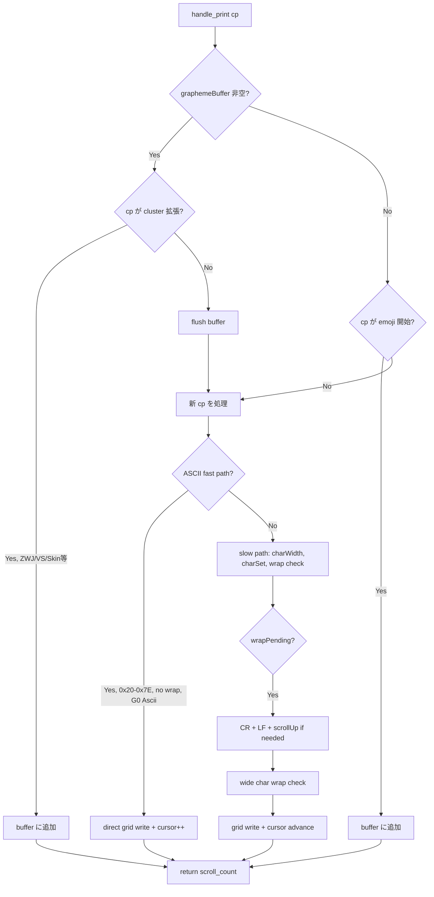

# WASM Print Handler (Sprint 2) - 要件定義書

## 1. 概要

### 1.1 背景

Sprint 1 で TerminalCore（Grid + Cursor + Modes）を WASM に移行し、データレイヤーが WASM linear memory 上に存在する。しかし、TS ハンドラが毎文字 JS-WASM 境界を跨いで set_cell / cursor 操作を行うため、文字印字パス全体の境界コストが依然として高い。

print_handler はターミナル全アクションの 80% 以上を占める最もホットなコードパスである。

### 1.2 目的

- `handle_print` および `flush_grapheme_buffer` を WASM（Rust）で実装し、文字印字パスを WASM 内で完結させる
- grapheme バッファリング、wrapPending、charSet（DEC Line Drawing 翻訳）を WASM 側に移動する
- Sprint 1 の申し送り事項（`dispose()` メソッド追加、`wasmRowToLine` 最適化）を併せて対応する

### 1.3 スコープ

**対象**:
- `print_handler.ts` の WASM 移植（ASCII fast path + slow path + grapheme buffering）
- graphemeBuffer / wrapPending / charSet 状態の WASM 移動
- DEC Line Drawing 文字翻訳テーブルの Rust 実装
- `WasmGrid.dispose()` メソッド追加
- `wasmRowToLine()` の `get_row_packed` ベース最適化

**対象外**:
- C0/CSI/ESC ハンドラ（Sprint 3 以降）
- スクロールバックの WASM 化（Sprint 5）
- ANSI パーサーの WASM 化（Sprint 6）

## 2. ビジネス要件

### 2.1 ビジネス目標

文字印字の処理パフォーマンスを向上させ、大量テキスト出力時の体感速度を改善する。

### 2.2 対象ユーザー

| ユーザータイプ | 説明 |
|----------------|------|
| ターミナルユーザー | 大量テキスト出力（cat, find, build ログ）を日常的に使うユーザー |
| 開発者 | AI コーディングツール（Claude Code 等）で大量出力を扱うユーザー |

### 2.3 期待される効果

- 文字スループット 2-3 倍改善
- JS-WASM 境界コスト削減（charWidth / classifyCodepoint の内部呼び出し化）
- JS GC 圧力軽減（Cell オブジェクト生成の排除）

## 3. ユースケース

### 3.1 ユースケース一覧

| ID | ユースケース名 | アクター | 優先度 |
|----|----------------|----------|--------|
| UC01 | ASCII文字印字 | ターミナル | 高 |
| UC02 | CJK/全角文字印字 | ターミナル | 高 |
| UC03 | 絵文字シーケンス印字 | ターミナル | 高 |
| UC04 | DEC Line Drawing文字 | ターミナル | 中 |
| UC05 | 行末自動折り返し | ターミナル | 高 |
| UC06 | WASM初期化失敗時のフォールバック | ターミナル | 中 |

### 3.2 ユースケース詳細

#### UC01: ASCII文字印字

**アクター**: ANSI パーサー（Rust Backend）→ IPC → TS dispatch → WASM

**事前条件**:
- TerminalCore が初期化済み
- graphemeBuffer が空

**基本フロー**:
1. Print アクション受信（codepoint 0x20-0x7E）
2. `core.handle_print(cp)` を呼び出す
3. WASM 内で ASCII fast path: grid 直接書き込み + カーソル前進
4. 戻り値 0（スクロール不要）

**代替フロー**:
- 行末でカーソルが cols に到達: autoWrap モードなら wrapPending をセット
- wrapPending 中に次の文字: CR + LF 実行、スクロールが必要なら戻り値 1

#### UC03: 絵文字シーケンス印字

**アクター**: ANSI パーサー → IPC → TS dispatch → WASM

**基本フロー**:
1. Extended_Pictographic codepoint 受信 → WASM grapheme buffer にバッファリング
2. ZWJ (0x200D) 受信 → バッファに追加
3. 次の Extended_Pictographic 受信 → バッファに追加
4. 非拡張 codepoint 受信 → `handle_print` 内で自動 flush
5. バッファされた codepoints から cluster 文字列生成 → 幅判定 → grid 書き込み

**代替フロー**:
- Regional Indicator ペア: 2つ目の RI で即座に flush
- Variation Selector FE0E: テキスト表示（幅1）
- Variation Selector FE0F: 絵文字表示（幅2）
- 非 Print アクション到着前: TS 側が `flush_grapheme_buffer()` を呼ぶ

#### UC05: 行末自動折り返し

**基本フロー**:
1. カーソルが行末にある状態で文字印字
2. autoWrap モード ON: wrapPending フラグをセット
3. 次の文字印字時: CR + LF を実行
4. LF がスクロール領域の bottom を超える場合: 戻り値でスクロール回数を返す
5. TS 側が scrollUp() を呼ぶ

#### UC06: WASM初期化失敗時のフォールバック

**基本フロー**:
1. WASM が初期化に失敗
2. state.wasmGrid が null
3. 既存の TS handlePrintDispatch にフォールバック

## 4. 機能要件

### 4.1 機能一覧

| ID | 機能名 | 説明 | 優先度 |
|----|--------|------|--------|
| F01 | handle_print | 単一 codepoint の印字処理を WASM で実行 | 高 |
| F02 | flush_grapheme_buffer | grapheme バッファの flush を WASM で実行 | 高 |
| F03 | grapheme buffering | 絵文字シーケンスのバッファリングを WASM で管理 | 高 |
| F04 | charSet translation | DEC Line Drawing 文字セット翻訳を WASM で実行 | 中 |
| F05 | wrapPending 管理 | 行末折り返し待ち状態を WASM で管理 | 高 |
| F06 | TS dispatcher | TS 側の print_handler.ts を WASM 委譲に書き換え | 高 |
| F07 | dispose() | WasmGrid リソース解放メソッド | 中 |
| F08 | wasmRowToLine 最適化 | get_row_packed ベースに変更し N*5 回の WASM 呼び出しを 1 回に | 中 |

### 4.2 機能詳細

#### F01: handle_print

**説明**: 単一 codepoint を受け取り、WASM 内で Grid 書き込み + カーソル前進 + 自動折り返しを処理する

**入力**:
- cp: u32 - Unicode codepoint

**出力**:
- u8 - スクロール回数（0 = スクロールなし、1-N = scrollUp を N 回実行すべき）

**処理フロー**:

#### F02: flush_grapheme_buffer

**説明**: バッファされた codepoints を 1 つの grapheme cluster として grid に書き込む

**入力**: なし（内部バッファを使用）

**出力**:
- u8 - スクロール回数

**処理フロー**:
1. バッファが空なら即座に 0 を返す
2. codepoints から UTF-8 cluster 文字列を生成
3. 幅を判定（FE0E → 1, FE0F → 2, 単一 cp → EmojiPresentation 判定, 複合 → 2）
4. wrapPending 処理
5. wide char の場合の行末ラップ処理
6. grid に書き込み + placeholder（width=0）セット
7. カーソル前進 + wrapPending 更新
8. バッファクリア
9. scroll_count を返す

#### F04: charSet translation

**説明**: DEC Line Drawing 文字セット（G0/G1）の翻訳テーブルを Rust で実装

**DEC Line Drawing マッピング**: 0x5F-0x7E の範囲（32 エントリ）をボックス描画文字に変換

#### F08: wasmRowToLine 最適化

**説明**: 現在の `wasmRowToLine()` は 1 行あたり cols × 5 回の個別 WASM 呼び出し（get_cell_char, get_cell_width, get_cell_fg, get_cell_bg, get_cell_flags）を行う。`get_row_packed()` を使い 1 回の WASM 呼び出しで完了させる。

## 5. 非機能要件

### 5.1 パフォーマンス要件

- ASCII 文字印字: < 200ns/char（WASM 内完結）
- 文字スループット: 既存比 2 倍以上
- grapheme flush: < 1μs/cluster

### 5.2 互換性要件

- 全既存 TS テストがパスすること
- WASM 非対応環境で JS フォールバックが動作すること
- vttest 基本テスト結果に変化がないこと

### 5.3 バイナリサイズ要件

- WASM バイナリ増分: < 10KB（DEC Line Drawing テーブル + handle_print ロジック）

## 6. データ要件

### 6.1 WASM に追加される状態

| 項目 | 型 | 説明 |
|------|-----|------|
| grapheme_buffer | Vec<u32> | 絵文字シーケンスのバッファ（codepoints） |
| wrap_pending | bool | 行末折り返し待ちフラグ |
| g0_charset | u8 | G0 文字セット（0=Ascii, 1=DecLineDrawing） |
| g1_charset | u8 | G1 文字セット |
| active_charset | u8 | アクティブ文字セット（0=G0, 1=G1） |
| scroll_region_top | u16 | スクロール領域上端行 |
| scroll_region_bottom | u16 | スクロール領域下端行 |

## 7. 制約条件

### 7.1 技術的制約

- スクロールバックは JS 側に残る（Sprint 5 まで）。handle_print がスクロールを引き起こす場合、戻り値フラグで TS 側に通知する
- Rust Backend の ANSI パーサーは変更しない（Sprint 6 まで）。IPC は JSON のまま
- grapheme バッファの安全制限: 64 codepoints（悪意入力防止）

### 7.2 ビジネス上の制約

- TS フォールバックを維持し、WASM 初期化失敗時でも動作すること

## 8. 想定される課題とリスク

### 8.1 技術的課題

| 課題 | 影響度 | 対応策 |
|------|--------|--------|
| スクロール時の JS-WASM 往復 | 中 | 戻り値フラグ方式で最小化。スクロールは低頻度 |
| grapheme 互換性 | 中 | Sprint 0 のクロスバリデーション手法を再利用 |
| charSet 状態の TS-WASM 同期 | 低 | ESC ハンドラ（Sprint 5）からの charSet 変更時に sync 関数経由 |
| wrapPending の TS-WASM 同期 | 低 | handle_print 内で完結。CSI/ESC がリセットする場合は sync |

## 9. 成功基準

### 9.1 受け入れ基準

- [ ] handle_print 全テストが WASM パスで通過
- [ ] 絵文字シーケンス（ZWJ、フラグ、スキントーン）が正しく処理
- [ ] DEC Line Drawing 文字が正しく表示
- [ ] 文字スループットベンチマーク 2 倍以上改善
- [ ] vttest 基本テスト変化なし
- [ ] WASM バイナリサイズ増分 < 10KB
- [ ] dispose() メソッドが正常に動作
- [ ] wasmRowToLine が get_row_packed ベースに最適化

## 10. テストシナリオ

### 10.1 テスト観点

- [ ] 正常系: ASCII 文字の印字（fast path）
- [ ] 正常系: CJK/全角文字の印字（slow path、width=2）
- [ ] 正常系: 絵文字シーケンス（ZWJ family、国旗、スキントーン）
- [ ] 正常系: DEC Line Drawing 文字の翻訳
- [ ] 正常系: 行末 autoWrap（wrapPending → 次文字で折り返し）
- [ ] 正常系: wide char の行末ラップ（cols-1 で width=2 → 次行へ）
- [ ] 異常系: バッファオーバーフロー（64 codepoints 超過）
- [ ] 異常系: autoWrap OFF 時の行末動作
- [ ] 境界値: 1 列端末、1 行端末
- [ ] 境界値: スクロール領域内のスクロール
- [ ] 回帰: 既存全テストのパス

## 11. 確認事項

### 11.1 確認済み事項

- [x] スクロール通知: 戻り値フラグ方式（u8 スクロール回数）
- [x] 状態移動: graphemeBuffer, wrapPending, charSet 全て WASM に移動
- [x] Sprint 1 申し送り: dispose() と wasmRowToLine 最適化の両方を含める
- [x] 戻り値エンコーディング: u8 スクロール回数（0=なし, 1-N=scrollUp N 回）
- [x] API 粒度: 単一 codepoint（handle_print(cp: u32) → u8）

### 11.2 未確認・保留事項

- [ ] scroll_region の top/bottom を WASM に持つか、handle_print 呼び出し時に引数で渡すか（本仕様では WASM 内に持つ方式を採用）
