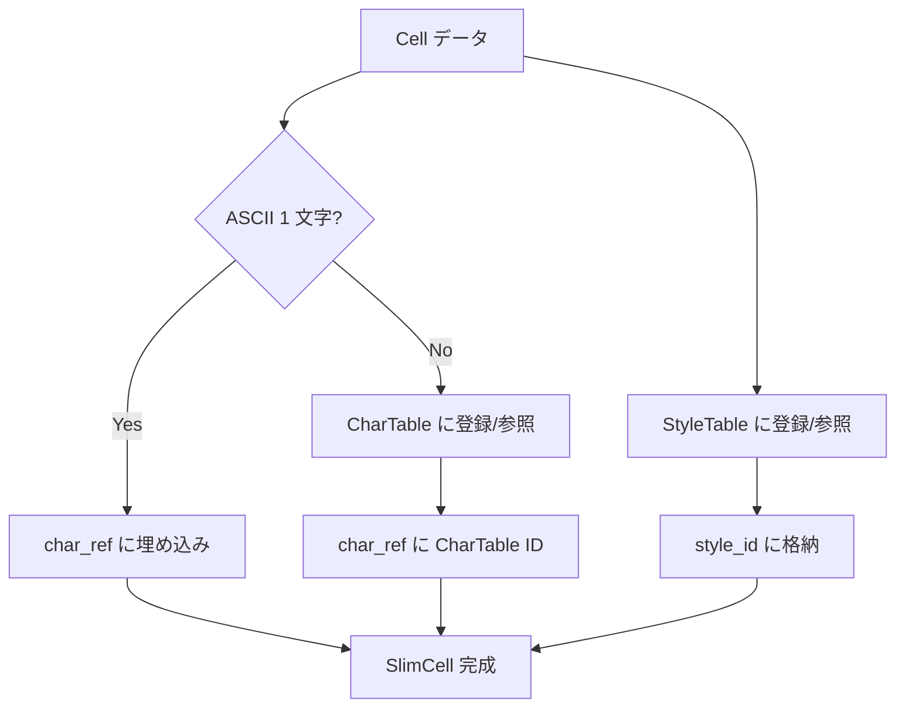
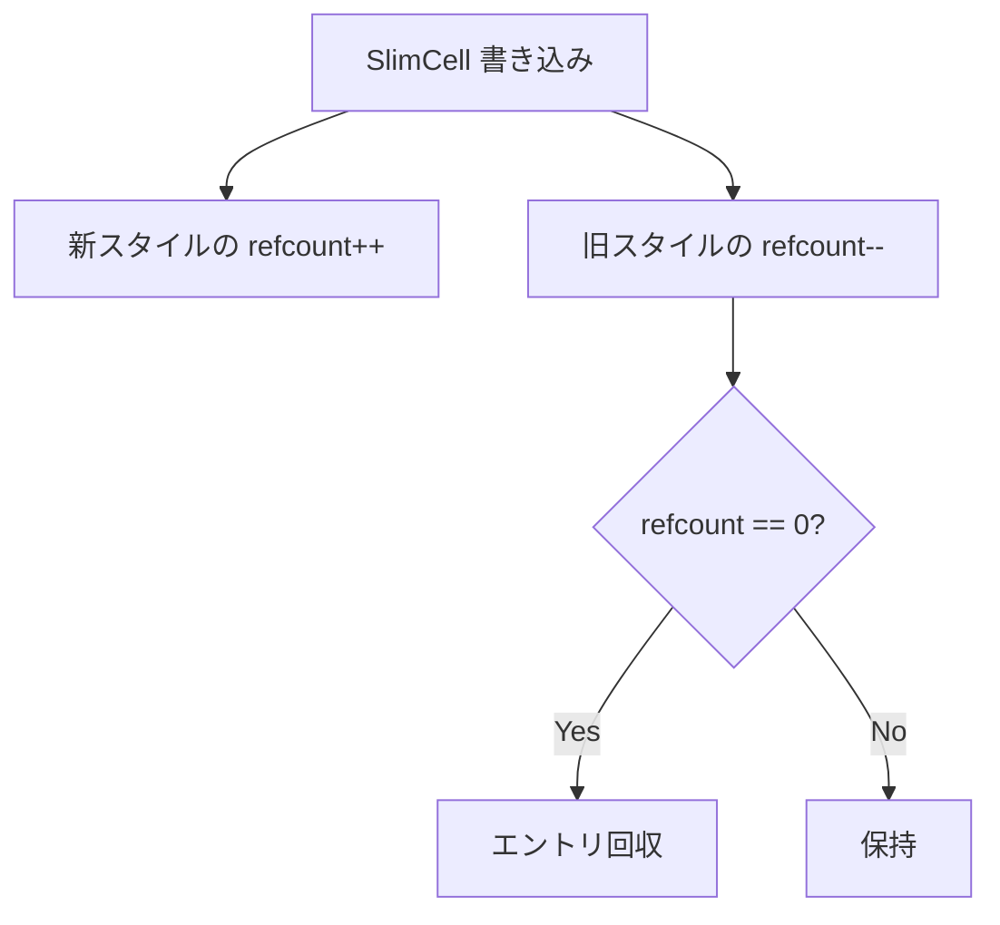
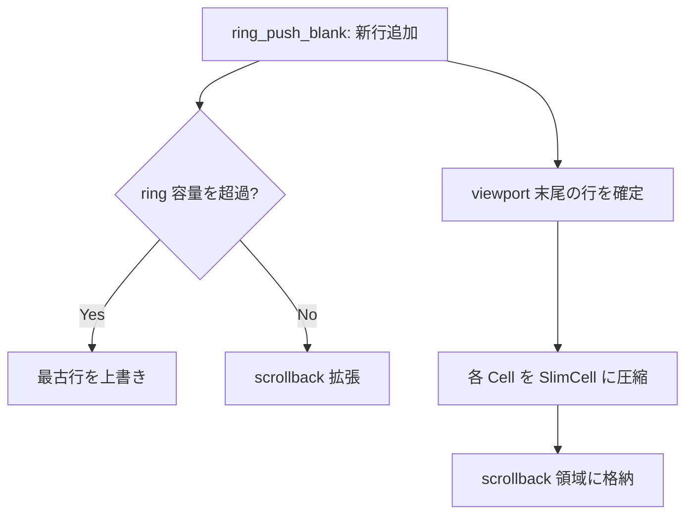
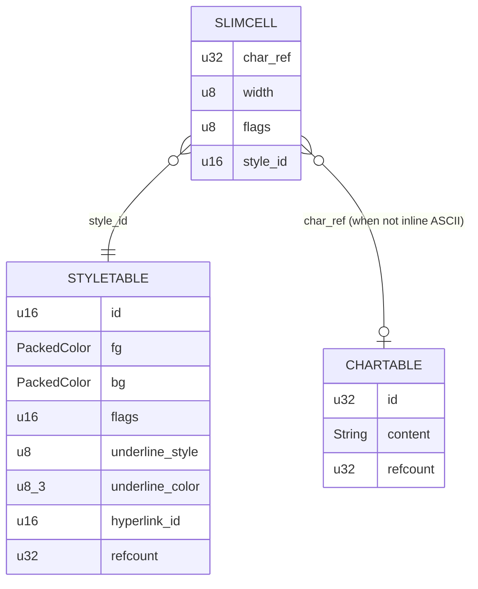

# WASM Slim Cell - 要件定義書

## 1. 概要

### 1.1 背景
長時間稼働中の eMterm プロセスで WebKitWebProcess のメモリ消費が膨張する事象が観測されている (12時間稼働で 7.2GB に到達した事例あり)。調査の結果、放置時は安定しているが、Claude Code 等の入出力ボリュームが多い対話セッションで蓄積が進むことが判明している。

蓄積要因の 1 つとしてスクロールバック領域 (10,000 行) の WASM グリッド メモリが挙げられており、mux で複数窓を開いた場合は「窓数 × セル単価」が効いてくる。現状の `Cell` 構造は実測 34 bytes であり、削減余地が大きい。

既存タスク `wasm-optimization` で Cell の 32 bytes 化と padding 領域の活用 (underline_style/underline_color) は完了しているが、`hyperlink_id: u16` の追加により実測 34 bytes となっており、構造を再設計する必要がある。

### 1.2 目的
スクロールバック領域のセル単価を大幅に削減し、長時間稼働 / 多窓 mux 環境下での WASM グリッド メモリ消費を低減する。具体的には、繰り返しの多いスタイル情報を ID 参照化することで、セル本体を 34 bytes から 8 bytes 程度まで圧縮する (約 76% 削減)。

### 1.3 スコープ

**対象 (In Scope)**:
- WASM のスクロールバック領域 (ring buffer の viewport を除く部分) の Slim Cell 化
- StyleTable (スタイル ID → 詳細スタイル のマッピング) の新規導入
- CharTable (16 byte 超 grapheme の格納) の既存 OverflowTable との統合
- StyleTable の参照カウント管理 / GC 戦略
- 既存の WASM 公開 API (set_cell, get_cell_char, packed binary format) の互換性維持
- スクロールバック読み出し経路 (描画、コピー、検索) の Slim → 表示用 Cell への展開ロジック

**対象外 (Out of Scope)**:
- アクティブ viewport (画面表示中の `rows` 行) の Slim 化 — Phase 2 以降で別途検討
- ASCII 専用 Tiny Cell (4 bytes) — Phase 3 以降で別途検討
- 画像キャッシュ (LRU 320MB) の最適化 — 別タスク
- WebKit 自体のメモリ最適化
- OSC Markdown overlay の DOM 解放

## 2. ビジネス要件

### 2.1 ビジネス目標
AI 時代のターミナルとして長時間稼働 / 多窓 mux 利用に耐える低メモリ消費を実現し、Claude Code との親和性 (長時間セッション、長文出力ストリーミング) を支える基盤を強化する。

### 2.2 対象ユーザー
| ユーザータイプ | 説明 |
|----------------|------|
| Claude Code ヘビーユーザー | 1 セッションで数万行のコード・ログを出力する開発者 |
| mux 多窓利用者 | 5 窓以上を同時に開き、各窓で長時間作業する利用者 |
| 長時間稼働 SSH ユーザー | 開発機を起動しっぱなしで複数日にわたり利用する開発者 |

### 2.3 期待される効果
- 1 ウィンドウあたりのスクロールバック保持メモリが約 1/4 に削減 (34B → 8B 目標)
- mux 10 窓構成で約 240MB 程度のメモリ削減 (粗試算: 10,000 行 × 200 列 × 26 バイト削減 × 10 窓)
- 長時間 Claude Code セッションでも RSS 増加速度が低減
- 将来的なスクロールバック行数増加 (10,000 → 100,000 等) の余地を生む

## 3. ユースケース

### 3.1 ユースケース一覧
| ID | ユースケース名 | アクター | 優先度 |
|----|----------------|----------|--------|
| UC01 | 長時間 Claude Code セッションでの低メモリ稼働 | エンドユーザー | 高 |
| UC02 | mux 多窓利用での総メモリ抑制 | エンドユーザー | 高 |
| UC03 | スクロールバック検索 / コピーの正常動作 | エンドユーザー | 高 |
| UC04 | スクロールバック領域での再 reflow 後の正常表示 | エンドユーザー | 中 |

### 3.2 ユースケース詳細

#### UC01: 長時間 Claude Code セッションでの低メモリ稼働

**アクター**: エンドユーザー

**事前条件**:
- eMterm を起動済み
- スクロールバック行数は既定 (10,000 行)

**基本フロー**:
1. ユーザーが Claude Code を起動し、長時間 (8 時間以上) のセッションで作業する
2. Claude Code が長文出力 (コード、ログ、Markdown) を継続的に PTY に書き込む
3. eMterm が PTY 出力をパースし、ring buffer に書き込み続ける
4. ring buffer がスクロールバック上限に達すると、古い行から順に Slim Cell として圧縮済みの状態で循環する
5. 8 時間後の RSS 増加が、最適化前と比較して有意に小さい

**事後条件**:
- スクロールバック領域の表示・検索が従来通り動作する
- WebKitWebProcess の RSS 増加が緩やかである

#### UC02: mux 多窓利用での総メモリ抑制

**アクター**: エンドユーザー

**事前条件**:
- mux で 5 窓以上を開いている

**基本フロー**:
1. 各窓で異なる作業を並行実施 (Claude Code、ログ tail、ビルド出力等)
2. 各窓のスクロールバックが上限近くまで使用される
3. 全窓のスクロールバック領域は Slim Cell として保持される
4. 総メモリ消費が、最適化前と比較して有意に小さい

**事後条件**:
- 全窓の表示・操作が従来通り動作する

#### UC03: スクロールバック検索 / コピーの正常動作

**アクター**: エンドユーザー

**事前条件**:
- スクロールバック領域に過去の出力が存在

**基本フロー**:
1. ユーザーがスクロールバック範囲をマウスドラッグで選択
2. eMterm は Slim Cell から表示用情報 (char, fg, bg, flags, underline_*, hyperlink_id) を展開
3. 選択範囲の文字列とスタイル情報が正しく取得される
4. クリップボードへのコピーが正しく動作する

**事後条件**:
- 選択範囲の文字列がスタイル情報と共に正しく取得される

#### UC04: スクロールバック領域での再 reflow 後の正常表示

**アクター**: エンドユーザー

**事前条件**:
- スクロールバック領域に多数のリッチセル (色付き、絵文字、ハイパーリンク) が存在

**基本フロー**:
1. ユーザーがウィンドウ幅を変更
2. eMterm は ring buffer 全体に対して reflow を実施
3. Slim Cell の StyleTable / CharTable 参照は reflow 中も整合性を保つ
4. reflow 後、スクロール表示で過去の行が正しく描画される

**事後条件**:
- 全行の文字 / 色 / フラグ / 下線 / ハイパーリンクが reflow 前と同じ見た目で表示される

## 4. 機能要件

### 4.1 機能一覧
| ID | 機能名 | 説明 | 優先度 |
|----|--------|------|--------|
| F01 | SlimCell 構造定義 | スクロールバック向けの 8 bytes 程度のセル構造を定義 | 高 |
| F02 | StyleTable | (fg, bg, flags, underline_style, underline_color, hyperlink_id) → style_id のテーブル | 高 |
| F03 | CharTable 統合 | 既存 OverflowTable と SlimCell の char 参照を統合 | 高 |
| F04 | スタイル参照カウント | StyleTable エントリの参照カウントによる GC | 高 |
| F05 | スクロールバック書き込み経路 | viewport から押し出される行を SlimCell に圧縮 | 高 |
| F06 | スクロールバック読み出し経路 | SlimCell を表示用 Cell に展開 (描画、コピー、検索) | 高 |
| F07 | reflow 対応 | reflow 時の StyleTable / CharTable 整合性維持 | 高 |
| F08 | ベンチマーク / 計測 | セルサイズ、メモリ使用量、描画 latency の計測ハーネス | 中 |
| F09 | デバッグコマンド | StyleTable エントリ数 / CharTable エントリ数 / セル分布のスナップショット出力 | 低 |

### 4.2 機能詳細

#### F01: SlimCell 構造定義

**説明**: スクロールバック領域に格納するセルの構造。固定 8 bytes を目標とする。

**フィールド**:
- `char_ref: u32` - 4 bytes - char 参照 (ASCII の場合は char_data 直接埋め込み、それ以外は CharTable ID)
- `width: u8` - 1 bytes - 表示幅 (1 or 2)
- `flags: u8` - 1 bytes - SlimCell 内部フラグ (例: ASCII inline / CharTable ref / overflow)
- `style_id: u16` - 2 bytes - StyleTable への ID

**処理フロー**:


**ビジネスルール**:
- `flags` の最下位ビットでインライン ASCII か CharTable 参照かを判別
- インライン ASCII 時、`char_ref` は UTF-8 直接表現 (1〜4 bytes)
- 全角文字や絵文字は CharTable 参照

#### F02: StyleTable

**説明**: スタイル情報 (fg, bg, flags, underline_*, hyperlink_id) を ID で参照可能にするテーブル。

**入力**:
- `StyleEntry { fg: PackedColor, bg: PackedColor, flags: u16, underline_style: u8, underline_color: [u8; 3], hyperlink_id: u16 }` - 計 14 bytes

**出力**:
- `style_id: u16` - 2 bytes (最大 65,535 種類)

**ビジネスルール**:
- 完全一致するスタイルが既存ならば既存の ID を返す (de-duplication)
- 既定スタイル (Cell::EMPTY 相当) は必ず `style_id = 0` を割り当てる
- ID 枯渇時 (65,535 を超過) は新規スタイルでも既定 ID にフォールバック (見た目が崩れるリスクは許容、警告ログ)

**バリデーション**:
| 項目 | ルール | エラーメッセージ |
|------|--------|------------------|
| style_id 枯渇 | 65,535 を超えたら新規追加不可 | warn ログ "StyleTable saturated, falling back to default style" |

#### F03: CharTable 統合

**説明**: 16 bytes 超の grapheme cluster や、SlimCell の char_ref が指す char を統合管理。既存の `OverflowTable: HashMap<(u32, u32), String>` を拡張。

**入力**:
- `s: &str` - 任意の grapheme cluster

**出力**:
- `char_id: u32` - CharTable 内 ID

**ビジネスルール**:
- 完全一致するエントリが既存ならば既存 ID を返す (de-duplication)
- 参照カウントを保持
- 既存 OverflowTable のキー `(col, row)` ベースのインタフェースは内部的に維持しつつ、SlimCell 経由のアクセスは ID ベースとする

#### F04: スタイル参照カウント

**説明**: StyleTable / CharTable のエントリには参照カウントを持たせ、参照ゼロになったエントリは回収する。

**処理フロー**:


**ビジネスルール**:
- 参照カウントは u32 (4 bytes) で管理
- ring buffer 全体のクリア時はテーブル全体をリセット
- reflow 時は ring 走査で再集計、または rebuild

**エラーケース**:
| エラー | 条件 | 対応 |
|--------|------|------|
| refcount underflow | バグで refcount が 0 から -- された | debug_assert で検知、release ではサチュレート |
| refcount overflow | 同一スタイルが u32::MAX 超セルから参照 (現実的にあり得ない) | サチュレート |

#### F05: スクロールバック書き込み経路

**説明**: viewport から押し出される行 (= 新たにスクロールバックに入る行) を Cell から SlimCell に圧縮する。

**処理フロー**:


**ビジネスルール**:
- viewport 内のセルは現状の Cell 構造をそのまま使用
- viewport から scrollback への遷移時のみ圧縮処理が走る (1 行単位)
- 既存の循環時は古い SlimCell の StyleTable / CharTable refcount を減算

#### F06: スクロールバック読み出し経路

**説明**: SlimCell を表示用 Cell に展開する経路。描画、コピー、検索で使用。

**入力**:
- `SlimCell` + `StyleTable` + `CharTable`

**出力**:
- `Cell` (現状構造) または描画に必要な情報セット

**ビジネスルール**:
- 展開は読み出し時のみ (スクロール時、検索時、コピー時)
- packed binary format (JS への送信形式) は変更しない (展開後の情報を従来通り送信)

#### F07: reflow 対応

**説明**: ウィンドウサイズ変更時の reflow で、scrollback 領域の SlimCell も含めて整合性を維持する。

**ビジネスルール**:
- reflow 中は SlimCell → Cell に一時展開して既存 reflow ロジックを再利用
- reflow 完了後、再度 SlimCell に圧縮し、StyleTable / CharTable を rebuild
- reflow 中の一時的なメモリ膨張は許容 (一時 Vec<Cell>、reflow 完了で解放)

#### F08: ベンチマーク / 計測

**説明**: 効果計測用のハーネス。

**計測項目**:
- `size_of::<SlimCell>()` (= 8 bytes 目標)
- StyleTable / CharTable のエントリ数とメモリ消費
- スクロールバック 10,000 行を埋めた状態の総メモリ
- スクロール描画 latency (p50, p95, p99)
- reflow 所要時間

#### F09: デバッグコマンド

**説明**: 内部状態のスナップショットを emterm.log に出力する debug 用 wasm-bindgen 関数。

**出力例**:
```
[DEBUG][BACKEND] SlimCell stats: scrollback_lines=10000, slim_cells=2000000
[DEBUG][BACKEND] StyleTable: entries=1234, bytes_used=17276
[DEBUG][BACKEND] CharTable: entries=567, bytes_used=12345
```

## 5. 非機能要件

### 5.1 パフォーマンス要件
- スクロール描画 latency (p99): 既存比 5% 以内の悪化に抑える
- スクロールバック書き込み時の Cell → SlimCell 圧縮: 1 行 (200 セル想定) あたり 50µs 以内
- スクロールバック読み出し時の SlimCell → Cell 展開: 1 セルあたり 200ns 以内
- StyleTable / CharTable のルックアップ: 平均 O(1) (HashMap)

### 5.2 セキュリティ要件
- 入力検証: SlimCell の char_ref / style_id がテーブル外を指す場合は debug_assert で検知し、release では既定 Cell にフォールバック
- メモリ安全性: 全て safe Rust。既存方針通り unsafe ブロックは追加しない
- DoS 防止: StyleTable サチュレート時は警告ログ + 既定スタイルフォールバック

### 5.3 可用性要件
- 既存テストが全て通過する
- 既存の WASM 公開 API は変更しない (set_cell, get_cell_char, get_packed_row 等)

### 5.4 保守性要件
- ログ出力: warn 以上 (release ビルドで保持される) で StyleTable サチュレート等を出力
- ドキュメント: SPEC.md と本書を Single Source of Truth として参照

### 5.5 互換性要件
- WASM packed binary format: 変更なし (FR/NFR で明記)
- TypeScript 側の WasmCore 呼び出し: 変更なし
- snapshot.rs (セッション復元) の serde 互換性: 既存の Cell ベースの snapshot を読めること (新形式でセーブする場合は format version を bump)

## 6. UI/UX要件

### 6.1 画面設計要件
ユーザーが直接認知できる UI 変更はない。内部実装の最適化のみ。

### 6.2 画面遷移
N/A

### 6.3 レスポンシブ対応
N/A

## 7. データ要件

### 7.1 データモデル概要


### 7.2 データ項目
| エンティティ | 項目名 | 型 | 必須 | 説明 |
|--------------|--------|-----|------|------|
| SlimCell | char_ref | u32 | ○ | ASCII inline or CharTable ID |
| SlimCell | width | u8 | ○ | 表示幅 (1 or 2) |
| SlimCell | flags | u8 | ○ | inline ASCII / CharTable ref などの内部フラグ |
| SlimCell | style_id | u16 | ○ | StyleTable への ID |
| StyleTable | id | u16 | ○ | 0..=65535 |
| StyleTable | (各スタイル) | - | ○ | fg/bg/flags/underline_*/hyperlink_id |
| StyleTable | refcount | u32 | ○ | 参照カウント |
| CharTable | id | u32 | ○ | エントリ ID |
| CharTable | content | String | ○ | grapheme 文字列 |
| CharTable | refcount | u32 | ○ | 参照カウント |

### 7.3 データ保持期間
| データ種別 | 保持期間 |
|------------|----------|
| SlimCell | スクロールバック上限 (10,000 行) を超えるまで |
| StyleTable エントリ | 参照カウントが 0 になるまで |
| CharTable エントリ | 参照カウントが 0 になるまで |

## 8. 外部連携

### 8.1 連携システム
変更なし (TypeScript 側との連携は既存 packed binary format を維持)。

### 8.2 API仕様要件
N/A

## 9. 制約条件

### 9.1 技術的制約
- WASM 環境のため OOM はアボート扱い (panic ハンドリング不可)
- HashMap 等の標準ライブラリ依存は変更しない
- 既存の `#[repr(C)]` Cell は viewport 用途で残す

### 9.2 ビジネス上の制約
- 既存ユーザーのセッション復元 (snapshot) を壊さない

### 9.3 スケジュール制約
特になし。Phase 分けで段階リリース可能。

## 10. 想定される課題とリスク

### 10.1 技術的課題
| 課題 | 影響度 | 対応策 |
|------|--------|--------|
| 参照カウント実装のバグでメモリリーク | 高 | debug_assert の充実、reflow 時の rebuild、ring 全体クリア時のリセット |
| StyleTable サチュレート (>65,535) | 中 | 既定スタイルへのフォールバック + warn ログ。実用上発生し得ない想定 |
| reflow パフォーマンス悪化 | 中 | 一時 Cell 展開 → reflow → 再圧縮、bench で計測し閾値を超えたら最適化 |
| viewport / scrollback 境界の動作不整合 | 高 | 専用統合テストを整備 |
| snapshot 形式互換性 | 中 | format version を bump、旧形式は読み込み専用で受け付ける |

### 10.2 ビジネスリスク
| リスク | 発生確率 | 影響度 | 対応策 |
|--------|----------|--------|--------|
| 描画性能悪化でユーザー体感が損なわれる | 低 | 高 | bench を sdd.5-check / sdd.6-verify で必須化 |
| 段階リリース中の中間状態でバグ顕在化 | 中 | 中 | Phase ごとに明確な完了基準を定義 |

## 11. 成功基準

### 11.1 受け入れ基準
- [ ] `size_of::<SlimCell>() == 8`
- [ ] スクロールバック 10,000 行を埋めた状態でのメモリ消費が最適化前比 50% 以下
- [ ] 既存の wasm テストが全て通過
- [ ] 既存の TypeScript テストが全て通過
- [ ] 既存の E2E テストが全て通過
- [ ] スクロール描画 latency (p99) が既存比 5% 以内の悪化に収まる
- [ ] reflow が既存比 2 倍以内の所要時間に収まる
- [ ] ZWJ family emoji がスクロールバック領域で正しく表示される

### 11.2 KPI
| 指標 | 目標値 | 測定方法 |
|------|--------|----------|
| SlimCell サイズ | 8 bytes | `size_of::<SlimCell>()` |
| スクロールバック総メモリ削減率 | 50% 以上 | bench (10,000 行 × 200 列を埋めた状態) |
| スクロール描画 latency 悪化 | 5% 以内 | bench (p50/p95/p99) |
| 長時間セッション (8h, Claude Code) RSS 増加抑制 | 30% 以上削減 | 手動計測 (ps -p PID -o rss) |

## 12. テストシナリオ

### 12.1 テスト観点
- [ ] 正常系: ASCII / CJK / 絵文字 / ZWJ family の SlimCell 圧縮 → 展開 round-trip
- [ ] 正常系: スタイル豊富な行のスクロールバック → スクロール表示で正しい色
- [ ] 異常系: StyleTable サチュレート時のフォールバック動作
- [ ] 異常系: refcount underflow 検知 (debug_assert)
- [ ] 境界値: スクロールバック行数 = 0 (Slim 領域なし)
- [ ] 境界値: スクロールバック上限到達直前の循環
- [ ] パフォーマンス: 1MB の連続出力で SlimCell 圧縮の処理時間
- [ ] パフォーマンス: スクロールバック範囲 10,000 行スクロールの latency
- [ ] reflow: 多色 / 絵文字 / ハイパーリンク混在の scrollback で reflow 後表示
- [ ] reflow: reflow 後の StyleTable / CharTable 整合性 (refcount 一致)

## 13. 用語定義

| 用語 | 定義 |
|------|------|
| Cell | 現状の WASM セル構造 (実測 34 bytes、`#[repr(C)]`) |
| SlimCell | 本タスクで導入するスクロールバック向けの圧縮セル (目標 8 bytes) |
| StyleTable | スタイル情報を ID で参照可能にするテーブル |
| CharTable | grapheme cluster 文字列を ID で参照可能にするテーブル |
| viewport | ring buffer のうち画面表示中の `rows` 行分 |
| scrollback | ring buffer のうち viewport 以外の領域 |
| reflow | ウィンドウサイズ変更時にセルを新サイズに合わせて再配置する処理 |
| refcount | 参照カウント (StyleTable / CharTable の GC に使用) |
| packed binary format | WASM から JS への行送信に使われるバイナリ形式 |

## 14. 確認事項

### 14.1 確認済み事項

Auto モード下で Phase 0 の参考資料 (`tmp/memory-alloc.md`、`doc/tasks/wasm-optimization/SPEC.md`、`wasm/src/cell.rs`) と CLAUDE.md / MEMORY を根拠に下記を確定:

- [x] スコープ: スクロールバック領域のみを Phase 1 対象とする (アクティブ viewport は Phase 2)
- [x] 削減目標: スクロールバック保持メモリを 50% 以下 (セル単価 34B → 8B 目標、約 76% 削減)
- [x] 採用案: 案A (Slim Cell + StyleTable + CharTable) を基本方針
- [x] 互換性: 既存 WASM 公開 API および packed binary format を維持。内部 API は変更可
- [x] パフォーマンス制約: 描画 latency p99 で 5% 以内の悪化に抑える
- [x] 段階実装: Phase 1 (scrollback + StyleTable) → Phase 2 (viewport) → Phase 3 (Tiny Cell)
- [x] 計測方法: `size_of` 比較、bench、debug 用 snapshot 関数 (F09)
- [x] 対象外: 画像キャッシュ、WebKit 自体、Markdown overlay
- [x] Scale: Standard (4-10 ファイル変更見込み、cross-cutting なし)

### 14.2 未確認・保留事項
- [ ] StyleTable のサチュレート閾値 (u16 = 65,535) が実用上問題ないか — 実装後 bench で要検証
- [ ] snapshot 形式の bump が既存ユーザーのセッション復元にどの程度影響するか — Phase 1 実装中に詳細設計

## 15. 参考資料

- メモリ消費調査レポート: `tmp/memory-alloc.md`
- 既存最適化タスク: `doc/tasks/wasm-optimization/SPEC.md`
- 現状の Cell 構造: `wasm/src/cell.rs`
- ring buffer / reflow: `wasm/src/ring_buffer.rs`, `wasm/src/reflow.rs`
- TerminalCore: `wasm/src/terminal_core.rs`
- プロジェクト方針: `CLAUDE.md`
