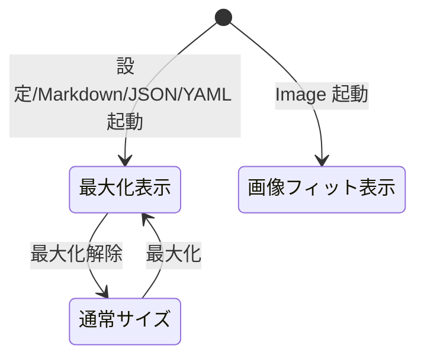

# ウィンドウの最大化起動とドックグルーピング統一 - 要件定義書

## 1. 概要

### 1.1 背景
eMterm は本体（ターミナル）に加えて、設定・Markdown ビューア・JSON/YAML データビューア・Image ビューアを子ウィンドウとして開く。現状は以下の課題がある。

- 本体ターミナルのみ最大化起動（`with_maximized(true)`）で、設定・各ビューアは固定の中サイズで起動する。
- 設定ウィンドウと Markdown ビューアは本体と同じ Ubuntu ドックグループにまとまるが、Image ビューアなどネイティブ(winit)ウィンドウのビューアが別アプリケーションとして認識され、ドック上で別アイコンに分かれてしまう。

### 1.2 目的
- 設定・Markdown・JSON/YAML データビューアを、本体と同様に最大化状態で起動する。
- 全ウィンドウ（本体・設定・Markdown・JSON/YAML・Image）を Ubuntu(GNOME) ドック上で単一のアプリケーションアイコンにグルーピングする。

### 1.3 スコープ

**対象**:
- 設定ウィンドウの最大化起動
- Markdown ビューアウィンドウの最大化起動
- JSON/YAML データビューアウィンドウの最大化起動
- 全子ウィンドウ + 本体のドックグルーピング統一（Linux）

**対象外**:
- Image ビューアの最大化（画像フィット自動サイズを維持する）
- 最大化の ON/OFF を切り替える設定項目（固定挙動とする）
- Windows タスクバーのグルーピング統一（ドックグルーピングは Linux 固有の要件）

## 2. ビジネス要件

### 2.1 ビジネス目標
複数ウィンドウを開いても 1 つのアプリケーションとして自然に扱え、起動直後から広い作業領域が得られる UX を提供する。

### 2.2 対象ユーザー
| ユーザータイプ | 説明 |
|----------------|------|
| eMterm 利用者（Linux/Ubuntu） | ターミナルと各ビューア・設定を日常的に開くデスクトップユーザー |

### 2.3 期待される効果
- 設定・ビューアが起動直後から最大化され、リサイズ操作が不要になる。
- ドック上でアイコンが 1 つにまとまり、ウィンドウ切り替え・アプリ認識が一貫する。

## 3. ユースケース

### 3.1 ユースケース一覧
| ID | ユースケース名 | アクター | 優先度 |
|----|----------------|----------|--------|
| UC01 | 設定ウィンドウを最大化で開く | 利用者 | 高 |
| UC02 | Markdown / JSON / YAML ビューアを最大化で開く | 利用者 | 高 |
| UC03 | 全ウィンドウをドック上の単一アイコンとして扱う | 利用者 | 高 |
| UC04 | Image ビューアを画像フィットサイズで開く | 利用者 | 中 |

### 3.2 ユースケース詳細

#### UC01: 設定ウィンドウを最大化で開く
**アクター**: 利用者
**事前条件**: eMterm 本体が起動している
**基本フロー**:
1. 利用者が設定を開く操作をする
2. 設定ウィンドウが最大化状態で表示される
**事後条件**: 設定ウィンドウが画面いっぱいに表示される。最大化解除時は従来の初期サイズに戻る

#### UC02: Markdown / JSON / YAML ビューアを最大化で開く
**アクター**: 利用者
**事前条件**: eMterm 本体が起動している
**基本フロー**:
1. 利用者が `emterm markdown/json/yaml` 等でビューアを開く
2. 該当ビューアウィンドウが最大化状態で表示される
**事後条件**: ビューアが画面いっぱいに表示される

#### UC03: 全ウィンドウをドック上の単一アイコンとして扱う
**アクター**: 利用者
**事前条件**: 本体・設定・各ビューアのいずれかが開いている
**基本フロー**:
1. 利用者が本体・設定・Markdown・JSON/YAML・Image を任意に開く
2. Ubuntu(GNOME) ドック上で全ウィンドウが 1 つの eMterm アイコンにグルーピングされる
**事後条件**: ドックアイコンは 1 つ。アイコン経由で全ウィンドウにアクセスできる

#### UC04: Image ビューアを画像フィットサイズで開く
**アクター**: 利用者
**事前条件**: eMterm 本体が起動している
**基本フロー**:
1. 利用者が `emterm image` で画像ビューアを開く
2. Image ビューアは画像サイズに基づく現行の自動サイズで表示される（最大化しない）
**事後条件**: 小さい画像が巨大な空白に浮かぶ事態を避ける

## 4. 機能要件

### 4.1 機能一覧
| ID | 機能名 | 説明 | 優先度 |
|----|--------|------|--------|
| F01 | 設定ウィンドウ最大化起動 | 設定ウィンドウを最大化状態で生成する | 高 |
| F02 | Markdown ビューア最大化起動 | Markdown ビューアを最大化状態で生成する | 高 |
| F03 | データビューア最大化起動 | JSON/YAML データビューアを最大化状態で生成する | 高 |
| F04 | Image ビューア最大化除外 | Image ビューアは画像フィット自動サイズを維持する | 中 |
| F05 | ドックグルーピング統一 | 全ウィンドウの WM_CLASS / app_id を統一し単一アイコン化する | 高 |

### 4.2 機能詳細

#### F01: 設定ウィンドウ最大化起動
**説明**: 設定ウィンドウを最大化状態で起動する。
**処理**: `WebViewHost` 生成時に最大化を指示する。最大化解除時のサイズは現行の初期サイズ（1080×760）を維持する。

#### F02: Markdown ビューア最大化起動
**説明**: Markdown ビューア（`WebViewHost`）を最大化状態で起動する。
**処理**: 最大化解除時のサイズは現行の初期サイズ（960×720）を維持する。

#### F03: データビューア最大化起動
**説明**: JSON/YAML データビューア（winit ネイティブ）を最大化状態で起動する。
**処理**: ウィンドウ属性に最大化指定を追加する。最大化解除時のサイズは現行の初期サイズ（960×640）を維持する。

#### F04: Image ビューア最大化除外
**説明**: Image ビューアは最大化起動の対象外とする。
**処理**: 現行の「画像サイズに基づきモニタの 90% でキャップする自動サイズ計算」をそのまま維持する。ドックグルーピング（F05）の対象には含める。

#### F05: ドックグルーピング統一
**説明**: 本体・設定・Markdown・JSON/YAML・Image の全ウィンドウを Ubuntu(GNOME) ドック上で単一アイコンにまとめる。
**処理**: 全ウィンドウのアプリケーション識別子（X11: WM_CLASS、Wayland: app_id）を、既存の `emterm.desktop` の `StartupWMClass=emterm` と一致する `emterm` に統一する。

**ビジネスルール**:
- 識別子は `.desktop` の `StartupWMClass` および `.desktop` ファイル名（`emterm`）と一致させる。
- winit 系（本体・Image・JSON/YAML）と GTK 系（設定・Markdown）の双方で同じ識別子を明示設定する。

## 5. 非機能要件

### 5.1 一貫性要件
- 最大化は固定挙動とし、設定項目を追加しない（本体ターミナルの `with_maximized(true)` と一貫）。

### 5.2 プラットフォーム要件
- 最大化起動: Linux / Windows の双方で動作する（設定・Markdown・データビューアは両 OS に存在）。
- ドックグルーピング統一: Linux(X11/Wayland) を対象とする。Windows タスクバーのグルーピングは対象外。

### 5.3 互換性要件
- 最大化解除時のサイズは各ウィンドウの現行初期サイズを維持する。
- Image ビューアの現行サイズ挙動を変更しない。

### 5.4 保守性要件
- アプリケーション識別子は単一の定数として定義し、全ウィンドウ生成箇所から参照する。

## 6. UI/UX要件

### 6.1 画面設計要件
- 設定・Markdown・JSON/YAML ビューアは起動直後に最大化表示される。
- Image ビューアは従来どおり画像にフィットしたサイズで表示される。

### 6.2 画面状態

## 7. 制約条件

### 7.1 技術的制約
- winit 0.30 の `WindowAttributes` には WM_CLASS/app_id 設定が直接無いため、X11/Wayland のプラットフォーム拡張トレイト経由で設定する。
- GTK 系ウィンドウ（`WebViewHost` Linux 実装）は GtkApplication を用いない素の `gtk::Window` 生成のため、WM_CLASS/app_id は別途明示設定が必要。
- ドックアイコンのグルーピングは GNOME/Ubuntu の WM 挙動に依存する（X11=WM_CLASS、Wayland=app_id と `.desktop` 名の一致）。

## 8. 制約・前提

- DevTools は使用不可。動作確認はログ確認と手動目視（ドックアイコン・最大化状態）で行う。

## 14. 確認事項

### 14.1 確認済み事項
- Image ビューアは最大化対象に含めない（画像フィット自動サイズを維持する）。
- 最大化は固定挙動とし、ON/OFF 設定項目は追加しない。
- ドックグルーピングの対象は本体 + 全子ウィンドウ（Image を含む）。
- アプリケーション識別子は既存の `emterm.desktop` / `StartupWMClass=emterm` に合わせて `emterm` に統一する。

### 14.2 未解決事項
- なし
