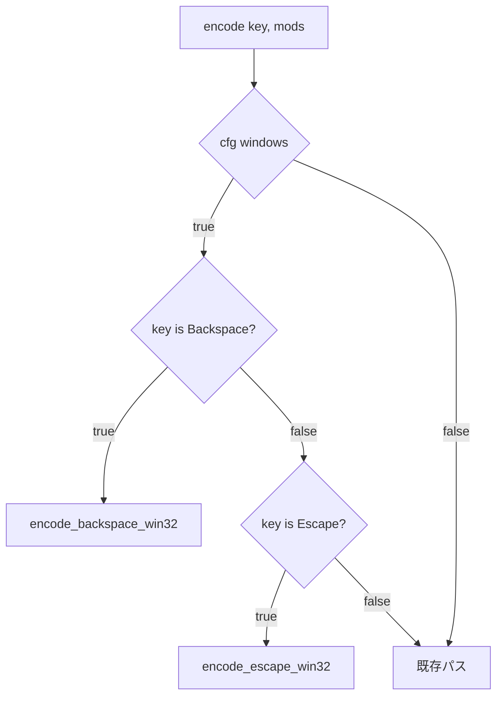

# Windows Esc キー Win32 Input Mode 対応 - 要件定義書

## 1. 概要

### 1.1 背景

eMterm は portable-pty 0.8 経由で Windows の ConPTY を扱う。portable-pty 0.8 は ConPTY を必ず `PSEUDOCONSOLE_WIN32_INPUT_MODE` フラグ付きで開くため、PTY 入力ストリームは **Win32 Input Mode VT key sequence** として解釈される。

過去に Backspace（裸 `0x08`）が PSReadLine 上で `Ctrl+Backspace`（単語削除）と誤解釈される問題があり、`encode_backspace_win32()` で Win32 Input Mode VT key event sequence を生成する対処を行った（`src-tauri/src/pty/input.rs:159-173`）。

同様の問題が Escape キーで発生していると報告された: Windows 上の vim で insert モードに入った後、Esc キーを押しても normal モードに戻れない（command モードに切り替えられない）。

### 1.2 目的

Windows の WIN32_INPUT_MODE 有効な ConPTY 上で、Esc キーが vim 等のターミナルアプリで正しく Escape として認識されるようにする。あわせて WIN32_INPUT_MODE 下で同様の問題を起こす可能性がある他のキーを洗い出し、必要に応じて同様の対処を行う。

### 1.3 スコープ

**対象:**
- `src-tauri/src/pty/input.rs` の `encode()` における Windows 向け Esc 送信処理
- Esc + modifier（Ctrl / Alt / Shift）の組み合わせ
- 他のキー（特に Alt+letter chord のような `\x1b` を先頭に含むシーケンス）の WIN32_INPUT_MODE 下での挙動調査
- Rust ユニットテストの追加

**対象外:**
- Linux / macOS 向け Esc 送信処理（現状の `out.push(0x1b)` を維持）
- ConPTY 自身の挙動変更
- IME 経由の Esc（IME 確定/取消は IME 層で吸収されるため）
- 他の Windows 関連バグ（アイコン、シェル終了時タブ非クローズ、fnm INFO 漏れ、CLI ビルド mux 不可）は別 feature

## 2. ビジネス要件

### 2.1 ビジネス目標

Windows ユーザが eMterm 上で vim / nvim / less / 他の TUI アプリを通常通り操作できるようにする。Esc キーが効かないと TUI アプリ全般が実質的に使えないため致命的。

### 2.2 対象ユーザー

| ユーザータイプ | 説明 |
|----------------|------|
| Windows でのターミナルユーザ | vim / nvim 等の TUI エディタや、Esc を normal mode 復帰に使うアプリを利用する |
| Claude Code ユーザ | Claude Code が動く ConPTY 上で TUI 操作する場面 |

### 2.3 期待される効果

- vim insert モードから Esc で normal モードに復帰可能になる
- 他の TUI アプリで Esc が機能する
- Backspace と同等の堅牢性を Esc にも与える

## 3. ユースケース

### 3.1 ユースケース一覧

| ID | ユースケース名 | アクター | 優先度 |
|----|----------------|----------|--------|
| UC01 | vim insert mode から Esc で normal mode 復帰 | Windows ターミナルユーザ | 高 |
| UC02 | Ctrl+Esc / Alt+Esc / Shift+Esc が変換器を通る | Windows ターミナルユーザ | 中 |
| UC03 | Linux / macOS では従来通り 0x1b が送られる | Linux/macOS ユーザ | 高（リグレッション防止） |

### 3.2 ユースケース詳細

#### UC01: vim insert mode から Esc で normal mode 復帰

**アクター**: Windows ターミナルユーザ

**事前条件**:
- Windows 版 eMterm が起動している
- pwsh / cmd / WSL 等のシェルが PTY 上で動作している
- vim を起動し `i` で insert モードに入っている

**基本フロー**:
1. ユーザが Esc キーを押下
2. eMterm の winit がキーイベントを受信
3. `encode(Key::Escape, Modifiers::NONE)` が Win32 Input Mode VT key event sequence を返す
4. 当該バイト列が ConPTY 経由で vim に届く
5. vim が VK_ESCAPE の key event として認識し normal モードに戻る

**事後条件**:
- vim のステータスラインから `-- INSERT --` が消える
- 以降の `:` 入力が ex コマンドモードに入る

#### UC02: modifier 付き Esc

**アクター**: Windows ターミナルユーザ

**事前条件**:
- 同上

**基本フロー**:
1. ユーザが Ctrl+Esc / Alt+Esc / Shift+Esc を押下
2. `encode(Key::Escape, mods)` が modifier bit を `Cs` フィールドに乗せた VT key event sequence を返す
3. PSReadLine / アプリ層が ControlKeyState を正しく解釈する

**事後条件**:
- アプリ側で modifier 付き Esc として処理される（具体的な挙動はアプリ依存）

#### UC03: Linux / macOS のリグレッション防止

**アクター**: Linux / macOS ユーザ

**事前条件**:
- Linux または macOS 版 eMterm が起動している

**基本フロー**:
1. ユーザが Esc キーを押下
2. `encode(Key::Escape, Modifiers::NONE)` が単一バイト `0x1b` を返す
3. xterm convention 通りアプリに届く

**事後条件**:
- 既存の Esc 動作と完全に同一

## 4. 機能要件

### 4.1 機能一覧

| ID | 機能名 | 説明 | 優先度 |
|----|--------|------|--------|
| F01 | Windows で Esc を Win32 Input Mode VT key event sequence で送信 | `encode_escape_win32(mods)` の追加と `encode()` の Windows 早期 return | 高 |
| F02 | Esc + modifier の対応 | `Cs` ビットへの ControlKeyState 反映 | 中 |
| F03 | 他キーの WIN32_INPUT_MODE 下での挙動調査 | Alt+letter / 他の VT シーケンス先頭 `\x1b` が誤動作するか確認し、必要に応じ修正 | 中 |
| F04 | Linux/macOS の挙動維持 | `#[cfg(windows)]` で Windows 経路のみ変更 | 高 |
| F05 | Rust ユニットテスト | Win32 Input Mode シーケンスのバイト列を検証 | 高 |

### 4.2 機能詳細

#### F01: Windows で Esc を Win32 Input Mode VT key event sequence で送信

**説明**: `encode_backspace_win32()` と同じ形式で `encode_escape_win32(mods: Modifiers) -> Vec<u8>` を新設し、`encode()` の冒頭で Windows ビルド時のみ Escape を早期 return する。

**シーケンス仕様**:

```
ESC [ Vk;Sc;Uc;Kd;Cs;Rc _ ESC [ Vk;Sc;Uc;Kd;Cs;Rc _
```

- Vk = `27` (VK_ESCAPE = 0x1B)
- Sc = `1` (Esc のスキャンコード 0x01)
- Uc = `27` (Unicode 値: ASCII ESC = 0x1B = 27)
- Kd = `1` で key down、続けて `0` で key up
- Cs = ControlKeyState ビットマスク（後述）
- Rc = `1` (repeat count)

key down と key up の 2 つのレコードを連続で 1 回の書き込みとして送る（Backspace と同じ）。

**入力**:
- `mods: Modifiers` - Ctrl / Shift / Alt の状態

**出力**:
- `Vec<u8>` - 上記フォーマットの ASCII 文字列をバイト列化したもの

**処理フロー**:



**バリデーション**: 該当なし（ローカル変換）

**エラーケース**: 該当なし

#### F02: Esc + modifier の対応

**説明**: `Cs` フィールドに ControlKeyState ビットを反映する。Backspace と同じビットアサインを使用:

| modifier | Cs ビット | 値 |
|----------|----------|----|
| Shift    | SHIFT_PRESSED        | 0x10 |
| Ctrl     | LEFT_CTRL_PRESSED    | 0x08 |
| Alt      | LEFT_ALT_PRESSED     | 0x02 |

複数同時押下時はビット OR で合成。

#### F03: 他キーの WIN32_INPUT_MODE 下での挙動調査

**説明**: input.rs の `encode()` が出力するシーケンスを総覧し、WIN32_INPUT_MODE 上で誤動作の懸念があるものを洗い出す。具体的に検討対象は:

- **Alt+letter chord**: `\x1b` + letter として送られる。WIN32_INPUT_MODE 下では `\x1b` を Escape key として認識し、後続の letter が別キーとして来る可能性がある。
- **arrow / nav / function keys**: 完全な CSI / SS3 シーケンス（`\x1b[A` 等）なので、一気に書き込めば WIN32_INPUT_MODE 側で「VT escape sequence」として正しく処理される想定。

調査手順は実装フェーズで決める。明らかな不具合が発見されたものに対して、Backspace / Escape と同じ流儀で Win32 Input Mode VT key event を生成する関数を追加する。

**スコープ**: 不具合が再現したキーのみを対応する。**「念のため全部直す」はしない**。

#### F04: Linux/macOS の挙動維持

**説明**: 全ての追加コードは `#[cfg(windows)]` でガードし、Linux / macOS 向けの `encode()` パスは現状維持。既存のユニットテスト（`enter_tab_backspace_escape` 等）は変更しない。

#### F05: Rust ユニットテスト

**説明**: `src-tauri/src/pty/input.rs` の既存 `#[cfg(test)] mod tests` に追加。

最低限のテストケース:

1. `escape_emits_win32_input_mode_pair`: 素の Esc が `\x1b[27;1;27;1;0;1_\x1b[27;1;27;0;0;1_` を返す
2. `escape_win32_includes_modifier_bits`: Ctrl+Esc が Cs=8 のバイト列を返す
3. Linux 側のテスト（`enter_tab_backspace_escape` の Escape 部）は `#[cfg(not(windows))]` 補強して引き続き `b"\x1b"` を確認する

## 5. 非機能要件

### 5.1 パフォーマンス要件

- Esc 送信時の遅延: 既存 Backspace と同等（μs 単位のバイト生成と 1 回の `write_input`）
- 連打耐性: vim での通常使用に問題ない速度

### 5.2 セキュリティ要件

該当なし（ローカルでのバイト列生成のみ、外部入力検証なし）。

### 5.3 可用性要件

該当なし。

### 5.4 保守性要件

- `encode_backspace_win32` と同形式のドキュメンテーションコメントを `encode_escape_win32` にも付与する
- Microsoft Terminal spec #4999 (Improved keyboard handling in conpty) への参照を残す

### 5.5 互換性要件

| 環境 | 想定挙動 |
|------|----------|
| Windows + portable-pty 0.8 (WIN32_INPUT_MODE on) | Win32 Input Mode VT key event sequence で Esc 送信 |
| Linux / macOS | 従来通り `0x1b` 単独送信 |
| Windows + 将来 portable-pty が WIN32_INPUT_MODE を切れるバージョンに更新 | `#[cfg(windows)]` のままで動作（Win32 Input Mode VT key event は ConPTY が legacy mode でも基本的にスルーする想定だが、リグレッションが出たら設計見直し） |

## 6. UI/UX要件

該当なし（バックエンドのキー送信ロジックのみ）。

## 7. データ要件

該当なし（永続化データなし）。

## 8. 外部連携

該当なし（依存は portable-pty 経由の ConPTY のみ）。

## 9. 制約条件

### 9.1 技術的制約

- portable-pty 0.8.1 系を継続使用する前提（WIN32_INPUT_MODE 強制 on のまま）
- `encode()` の API シグネチャは変更しない
- 既存呼び出し側（callbacks.rs / window_host.rs）の変更は不要

### 9.2 ビジネス上の制約

- 特になし

### 9.3 スケジュール制約

- 特になし

## 10. 想定される課題とリスク

### 10.1 技術的課題

| 課題 | 影響度 | 対応策 |
|------|--------|--------|
| WIN32_INPUT_MODE 下での実際のシーケンス受信仕様が完全には公開されていない | 中 | Backspace の実装と Microsoft Terminal spec #4999 を参照し、同じパターンで実装。実機検証で確認 |
| Alt+letter / Alt+Esc などのチョードが ConPTY 側で分解される可能性 | 中 | F03 の調査で明らかになったものだけ対応 |
| Esc 連打時に key down/up が複数連続で送られた際の挙動 | 低 | Backspace と同様に処理しているため問題は再現していない想定 |

### 10.2 ビジネスリスク

なし（バグ修正タスク）。

## 11. 成功基準

### 11.1 受け入れ基準

- [ ] Windows 実機上で vim 起動 → `i` で insert モード → Esc で normal モードに戻れる
- [ ] Ctrl+Esc / Alt+Esc / Shift+Esc が `Cs` フィールド込みで送られる（ユニットテストで検証）
- [ ] Linux / macOS では従来通りの `0x1b` 単一バイト送信を維持
- [ ] `cargo test --manifest-path src-tauri/Cargo.toml --lib` が全てパスする
- [ ] F03 の調査結果が `IMPLEMENTATION.md` に記録される

### 11.2 KPI

該当なし（バグ修正タスク）。

## 12. テストシナリオ

### 12.1 テスト観点

- [x] 正常系: Windows ビルドで `encode(Escape, NONE)` が Win32 Input Mode シーケンスを返す
- [x] 正常系: modifier 付き Esc が正しい Cs ビットを含む
- [x] 正常系: Linux / macOS ビルドで `encode(Escape, NONE)` が `b"\x1b"` を返す
- [ ] 正常系（実機）: Windows で vim の Esc 動作が復旧
- [ ] 正常系（実機）: Windows で他の TUI アプリ（less, nano）でも Esc が効く
- [ ] 異常系: 該当なし（純粋なバイト変換）
- [ ] 境界値: 該当なし

## 13. 用語定義

| 用語 | 定義 |
|------|------|
| ConPTY | Windows 10 1809+ で提供される擬似端末 API（Pseudo Console） |
| WIN32_INPUT_MODE | `CreatePseudoConsole` のフラグ `PSEUDOCONSOLE_WIN32_INPUT_MODE` （portable-pty 0.8 が常時有効化） |
| Win32 Input Mode VT key event sequence | WIN32_INPUT_MODE 下で ConPTY が解釈する `ESC[Vk;Sc;Uc;Kd;Cs;Rc_` 形式のシーケンス。INPUT_RECORD の KEY_EVENT_RECORD を VT 化したもの |
| VK_ESCAPE | Windows の Virtual Key Code 定数 0x1B（10 進 27） |
| ControlKeyState (Cs) | KEY_EVENT_RECORD の修飾キー状態ビットマスク |
| PSReadLine | PowerShell のラインエディタモジュール |

## 14. 確認事項

### 14.1 確認済み事項

- [x] レポート tmp/issues-windows-mux-2026-06-22.md の問題 1 を対象とする
- [x] 5 件の問題は feature ごとに分割する（本 feature はその 1 件目）
- [x] スコープ: Esc + 明らかに不具合のあるキーを調査してまとめて修正
- [x] modifier 付き Esc も Win32 Input Mode で送る
- [x] 検証は Rust ユニットテスト + ユーザ手動検証

### 14.2 未確認・保留事項

- [ ] F03 の調査で「明らかに不具合のあるキー」が他に発見された場合、どこまで本 feature 内で対応するか（実装フェーズで再判断）

## 15. 参考資料

- `tmp/issues-windows-mux-2026-06-22.md` - 元レポート
- `src-tauri/src/pty/input.rs:141-173` - 既存 `encode_backspace_win32` 実装
- Microsoft Terminal spec #4999 - Improved keyboard handling in conpty
- `MEMORY: project_native_poc_win32_input_mode` - 過去の Win32 Input Mode 対応経緯
- `MEMORY: project_native_poc_backspace_conpty` - Backspace 対応経緯
