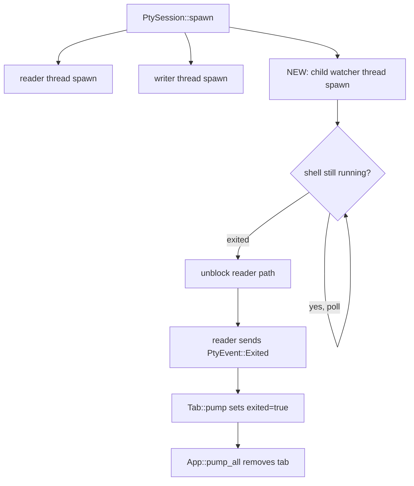

# Windows アイコン設定とシェル終了時のタブ自動クローズ - 要件定義書

## 1. 概要

### 1.1 背景

Windows 版 eMterm に二つの未対応問題が `tmp/issues-windows-mux-2026-06-22.md` で報告された。

1. アプリケーション・ウィンドウのアイコンが未設定で、タスクバー・Alt+Tab・タイトルバー左上・エクスプローラ上のファイル表示の全てで既定アイコンに見える。
2. PowerShell などシェル上で `exit` を入力してもタブが自動的に閉じない。ユーザがタブの ✕ ボタンで明示的に閉じるしかない。

`src-tauri/icons/icon.ico` (26959 byte) や `32x32.png` / `128x128.png` などのアセットは既に揃っているが、winit メインウィンドウ・wry 子 WebView ウィンドウ・`.exe` の Windows リソースのいずれにも反映されていない。

### 1.2 目的

- Windows 上でアプリと全ウィンドウに eMterm のアイコンを反映させる
- Windows 上でシェル終了時にタブが自動的に閉じるようにする
- Linux 側の挙動には影響を与えない

### 1.3 スコープ

**対象**:
- `.exe` への Windows リソースアイコン埋め込み（タスクバー・Alt+Tab・エクスプローラ）
- winit メインウィンドウへのアイコン設定（タイトルバー左上）
- wry 子 WebView ウィンドウへのアイコン設定（Markdown ビューア・設定パネル・データビューア）
- Windows での PtySession による子プロセス終了監視と自動 EOF 経路

**対象外**:
- Linux でのアイコン表示問題（既に `make dpkg` で `.desktop` ファイル経由でインストールされている経路があり、本タスクの起因報告には含まれていない）
- 既に修正済みの Issue 1 (Esc Win32 Input Mode) / Issue 4 (RUST_LOG 漏洩)
- CLI ビルドで `emterm mux` を起動できない問題（Issue 5）は別タスク

## 2. ビジネス要件

### 2.1 ビジネス目標

- Windows ユーザの起動時体験の改善（アイコンによる識別性、UX）
- Windows 上の操作流暢性向上（シェルを `exit` で抜けたら自然にタブが消える）

### 2.2 対象ユーザー

| ユーザータイプ | 説明 |
|----------------|------|
| Windows でターミナルを利用する開発者 | 主たる対象。PowerShell / cmd / WSL シェルでの作業中にタブ操作の自然さを期待する |

### 2.3 期待される効果

- タスクバーから eMterm を一目で識別できる
- 複数アプリ起動時に Alt+Tab で eMterm を確実に区別できる
- シェル終了操作が tmux / Linux ターミナルと同等のフィードバックになる

## 3. ユースケース

### 3.1 ユースケース一覧

| ID | ユースケース名 | アクター | 優先度 |
|----|----------------|----------|--------|
| UC01 | アプリ起動時にタスクバーに eMterm アイコンが表示される | Windows ユーザ | 高 |
| UC02 | 子 WebView ウィンドウのタイトルバーに eMterm アイコンが表示される | Windows ユーザ | 中 |
| UC03 | シェル上で `exit` を入力するとタブが自動的に閉じる | Windows ユーザ | 高 |

### 3.2 ユースケース詳細

#### UC01: アプリ起動時にタスクバーに eMterm アイコンが表示される

**アクター**: Windows ユーザ

**事前条件**:
- Windows 環境で eMterm をビルドしてインストール済み

**基本フロー**:
1. ユーザが `emterm.exe` を起動する
2. タスクバーに eMterm のアイコンが表示される
3. Alt+Tab でアプリ切り替え時にも同アイコンが表示される
4. エクスプローラ上の `emterm.exe` ファイルにも同アイコンが表示される

**事後条件**:
- タスクバー / Alt+Tab / エクスプローラのいずれでも eMterm の識別性が確保される

#### UC02: 子 WebView ウィンドウのタイトルバーに eMterm アイコンが表示される

**アクター**: Windows ユーザ

**事前条件**:
- Windows 環境で eMterm が起動済み

**基本フロー**:
1. ユーザが `emterm markdown <file>` を実行して Markdown ビューア（子 WebView）を開く
2. ビューアウィンドウのタイトルバー左上に eMterm のアイコンが表示される
3. 設定パネル・データビューアでも同様に表示される

**事後条件**:
- 子 WebView ウィンドウもタスクバー上で eMterm アプリと識別できる

#### UC03: シェル上で `exit` を入力するとタブが自動的に閉じる

**アクター**: Windows ユーザ

**事前条件**:
- Windows 環境で eMterm が起動しタブが少なくとも 1 つ開いている

**基本フロー**:
1. ユーザがタブのシェル上で `exit` を入力する（または Ctrl+D 等で同等のシェル終了を行う）
2. シェルプロセスが終了する
3. eMterm が子プロセス終了を検出し、タブを自動的にクローズする
4. 最後のタブが閉じられた場合のアプリ終了挙動は既存の動作に従う

**代替フロー**:
- シェルがクラッシュした場合: 同じくタブが自動的にクローズされる

**事後条件**:
- ユーザは手動でタブの ✕ ボタンを押さずに作業を完結できる

## 4. 機能要件

### 4.1 機能一覧

| ID | 機能名 | 説明 | 優先度 |
|----|--------|------|--------|
| F01 | .exe へのアイコン埋め込み | Windows ターゲット向けビルド時に `icon.ico` を `.exe` のリソースに埋め込む | 高 |
| F02 | winit メインウィンドウへのアイコン設定 | winit `WindowAttributes::with_window_icon()` でメインウィンドウにアイコンを設定する | 高 |
| F03 | wry 子 WebView ウィンドウへのアイコン設定 | `webview_host` 経由で生成される全子ウィンドウにアイコンを設定する | 中 |
| F04 | Windows シェル終了時のタブ自動クローズ | PtySession に子プロセス終了監視スレッドを追加し、シェル終了で reader を unblock してタブを閉じる | 高 |

### 4.2 機能詳細

#### F01: .exe へのアイコン埋め込み

**説明**: `cargo xwin build --release --target x86_64-pc-windows-msvc` 等の Windows 向けビルドで生成される `emterm.exe` に Windows リソースとして `icon.ico` を埋め込む。Linux / macOS 向けビルドには影響を与えない。

**入力**: `src-tauri/icons/icon.ico` (26959 byte の既存アセット)

**出力**: `emterm.exe` の PE リソースセクションに ICON エントリが含まれる

**ビジネスルール**:
- Linux / WSL / macOS 向けビルドではこの処理をスキップする（target 判定）
- Windows 向けビルドが他の build script 副作用に干渉しないこと

#### F02: winit メインウィンドウへのアイコン設定

**説明**: `src-tauri/src/window_host.rs:323-329` の `WindowAttributes::default()` チェーンに `with_window_icon(Some(icon))` を追加する。アイコンデータは PNG (`32x32.png` 等) を `image` クレートで RGBA 化してから `winit::window::Icon::from_rgba()` に渡す。

**入力**: ビルド時に `include_bytes!` で埋め込んだ PNG バイト列

**出力**: タイトルバー左上に eMterm アイコンが表示される

**ビジネスルール**:
- アイコン読み込みに失敗してもアプリ起動は継続する（`log::warn!` でログ出力）
- Linux でも同じコードパスで動作する（PNG 読み込み + RGBA 変換は OS 非依存）

#### F03: wry 子 WebView ウィンドウへのアイコン設定

**説明**: `src-tauri/src/webview_host/windows.rs:70-78` の `WindowAttributes::default()` チェーンに同じ `with_window_icon()` を追加する。F02 と共通の Icon 取得経路を使う。

**入力**: F02 と同じ PNG バイト列

**出力**: Markdown ビューア・設定パネル・データビューアの各タイトルバー左上にアイコンが表示される

**ビジネスルール**:
- F02 と同じアイコン読み込みロジックを共有する。`crate::icons` のような軽量モジュールに切り出して両方から呼ぶ

#### F04: Windows シェル終了時のタブ自動クローズ

**説明**: `src-tauri/src/pty/mod.rs` の `PtySession` に子プロセス終了監視スレッドを追加する。シェルが `exit` 等で自然終了したときに `PtyEvent::Exited` が発火し、`Tab::pump` が `self.exited = true` を立てて App の `pump_all` が tab を retain から除外する既存経路に乗せる。

**入力**: PtySession 起動時の子プロセスハンドル

**出力**: シェル終了後一定時間以内に `PtyEvent::Exited` が event_tx に送信される

**処理フロー**:

**ビジネスルール**:
- Windows でのみ新たな監視スレッドを起動する。Linux ではカーネルが PTY slave を閉じるため reader が EOF を観測する既存経路で十分
- 既存の `Drop for PtySession` の 4 ステップ shutdown は破壊しない。X ボタン経由のクローズも引き続き正常に動作する
- 監視スレッドの ResourceLeak を避けるため、PtySession::drop で適切に終了する

**エラーケース**:
| エラー | 条件 | 対応 |
|--------|------|------|
| child.try_wait/wait が Err を返す | OS リソース取得失敗等 | `log::warn!` でログ出力し、監視スレッドを終了する。タブはユーザ操作で閉じる必要あり |

## 5. 非機能要件

### 5.1 パフォーマンス要件

- アイコン読み込み: アプリ起動時の追加コスト 10ms 未満（PNG decode 1 回）
- 子プロセス終了監視: 監視スレッド 1 本追加。CPU 使用率増加は無視できるレベル（idle 時はブロッキング wait）
- シェル終了検知遅延: 500ms 以内（理想的には即時）

### 5.2 セキュリティ要件

特に追加なし。アイコンデータはビルド時に静的に埋め込むため、外部入力なし。子プロセス監視はローカルプロセスハンドルに対する OS API 呼び出しのみ。

### 5.3 可用性要件

- アイコン未表示でもアプリは起動継続できること（fail-safe）
- 子プロセス監視スレッドが終了してもアプリ全体はクラッシュしないこと

### 5.4 保守性要件

- F02 / F03 で利用する Icon 読み込みコードは共通モジュール（例: `crate::icons` または `crate::window_icon`）に集約する
- 子プロセス監視スレッドの寿命と通信経路はコメントで明示する

### 5.5 互換性要件

- Linux / macOS 向けビルドの挙動は変更しないこと（既存テストが全てパスすること）
- Windows のサポートは Windows 10 以降（既存サポート範囲と同じ）

## 6. UI/UX要件

### 6.1 画面設計要件

- アイコンはタスクバー / Alt+Tab / タイトルバー / エクスプローラの各箇所で適切なサイズで表示される（OS が ICO / PNG から適切なサイズを選択する）
- タブ自動クローズ時の追加 UI は無し（既存の tab close 経路と同じ視覚的フィードバック）

### 6.2 画面遷移

特になし。

## 7. データ要件

特になし。永続化データは扱わない。

## 8. 外部連携

特になし。

## 9. 制約条件

### 9.1 技術的制約

- portable-pty 0.8.x の `Child` トレイト API に依存
- winit / wry のウィンドウアイコン API に依存
- Windows リソース埋め込みは `winresource` / `embed-resource` 等のクレートが必要

### 9.2 ビジネス上の制約

- 既存の `Drop for PtySession` の 4 ステップ shutdown シーケンス（コメントで明文化された設計意図）は維持する

## 10. 想定される課題とリスク

### 10.1 技術的課題

| 課題 | 影響度 | 対応策 |
|------|--------|--------|
| Windows ConPTY が child 終了から output pipe を閉じるタイミングが不安定 | 高 | reader_loop の EOF 経路に依存せず、子プロセス終了監視スレッドを正準経路にする |
| portable-pty の `Child::wait` が `&mut self` を要求するため `Arc<Mutex<Child>>` 上で監視スレッドが mutex を長期保持してしまう | 中 | `Child::clone_killer()` で得られる `ChildKiller` を struct 側に保持し、Child 本体は監視スレッドに move する設計を採る（詳細は IMPLEMENTATION.md で確定） |
| アイコン PNG 読み込み失敗時の挙動 | 低 | warn ログを出して続行（アイコン無しでも起動する） |

## 11. 成功基準

### 11.1 受け入れ基準

- [ ] Windows でビルドした `emterm.exe` をタスクバーに表示すると eMterm のアイコンが見える
- [ ] Alt+Tab 切り替え時に eMterm のアイコンが見える
- [ ] エクスプローラ上で `emterm.exe` を見るとアイコンが見える
- [ ] メインウィンドウのタイトルバー左上に eMterm のアイコンが見える
- [ ] Markdown ビューア・設定パネル・データビューアのタイトルバー左上に eMterm のアイコンが見える
- [ ] Windows の PowerShell タブで `exit` を入力するとタブが自動的に閉じる
- [ ] Windows でシェルがクラッシュ的に終了した場合もタブが自動的に閉じる
- [ ] Linux でのアイコン表示は変更前と同じ挙動
- [ ] Linux でのシェル終了時のタブ自動クローズは変更前と同じ挙動

## 12. テストシナリオ

### 12.1 テスト観点

- [ ] 正常系: Windows でアプリ起動時に全 4 箇所のアイコンが表示される
- [ ] 正常系: Windows で PowerShell タブで `exit` 入力 → タブが消える
- [ ] 正常系: Linux でアプリ起動時のメインウィンドウタイトルバーにアイコンが表示される
- [ ] 異常系: シェルが SIGKILL 相当で終了 → タブが消える
- [ ] 異常系: アイコンファイルが破損 → warn ログを出してアイコン無しで起動継続
- [ ] 境界値: PtySession::drop が監視スレッド起動中に呼ばれても deadlock しない
- [ ] パフォーマンス: アプリ起動時のアイコン読み込みオーバーヘッドが目立つほど増えない

## 13. 用語定義

| 用語 | 定義 |
|------|------|
| ConPTY | Windows 10 以降の Pseudo Console。`PSEUDOCONSOLE_WIN32_INPUT_MODE` などのモードを持つ |
| portable-pty | クロスプラットフォーム PTY 抽象クレート。`Child` トレイトを公開する |
| winit / wry | それぞれ winit はクロスプラットフォームウィンドウクレート、wry は WebView 抽象クレート |
| Win32 Input Mode | ConPTY が入力ストリームを VT key sequence として解釈するモード（Issue 1 のスコープ。本タスクの対象外） |

## 14. 確認事項

### 14.1 確認済み事項

- [x] スコープを「Windows 系 2 件をまとめ + mux 別タスク」と分けることに合意（CLI mux feature 分割は別タスク）
- [x] 既に修正済みの Issue 1 (Esc) / Issue 4 (RUST_LOG) は本タスクの対象に含めない
- [x] Issue 2 (アイコン) の対応経路は「3 経路全て (winres + winit + wry)」を採用
- [x] Issue 3 (シェル終了でタブが閉じない) の修正アプローチは「案 B: child 監視スレッド」を採用
- [x] Linux 側のアイコン経路は本タスクの対象外（Windows 限定）

### 14.2 未確認・保留事項

特になし。

## 15. 参考資料

- `tmp/issues-windows-mux-2026-06-22.md` — 原調査レポート
- `src-tauri/src/pty/mod.rs:107-238` — 現在の `PtySession::spawn` 実装
- `src-tauri/src/pty/mod.rs:294-344` — 現在の `Drop for PtySession` 実装（4 ステップ shutdown）
- `src-tauri/src/pty/mod.rs:347-398` — 現在の `reader_loop` 実装
- `src-tauri/src/window_host.rs:323-329` — winit メインウィンドウ生成箇所
- `src-tauri/src/webview_host/windows.rs:70-78` — wry 子 WebView ウィンドウ生成箇所
- `src-tauri/icons/` — アイコンアセット (`icon.ico`, `32x32.png`, `128x128.png`, `128x128@2x.png`)
- portable-pty 0.8.1 `Child` trait — `kill()` / `wait()` / `try_wait()` / `clone_killer()`
- winit `WindowAttributes::with_window_icon()` API
