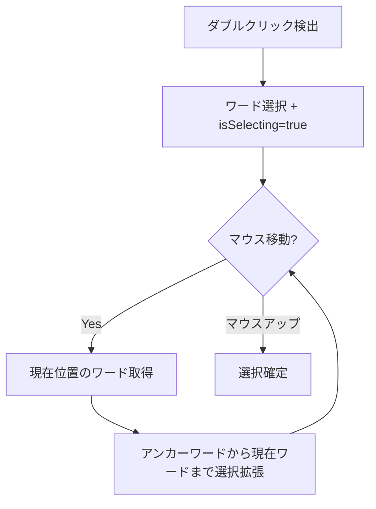

# ダブルクリック+ドラッグでワード単位選択 - 要件定義書

## 1. 概要

### 1.1 背景
現在のeMtermの実装では、ダブルクリックでワードを選択した後にドラッグしても選択範囲が変化しない。一般的なターミナルエミュレータ（iTerm2、GNOME Terminal、Windows Terminal等）では、ダブルクリック後のドラッグでワード単位の選択拡張が可能である。

### 1.2 目的
ダブルクリック後のドラッグでワード単位の選択拡張を可能にし、一般的なターミナルの挙動と一致させる。

### 1.3 スコープ
- ダブルクリック+ドラッグによるワード単位選択の実装
- 既存の選択機能（シングルクリックドラッグ、トリプルクリック行選択）への影響なし

## 2. ビジネス要件

### 2.1 ビジネス目標
ユーザー体験の向上。他のターミナルエミュレータと同様の操作感を提供する。

### 2.2 対象ユーザー
| ユーザータイプ | 説明 |
|----------------|------|
| 一般ユーザー | ターミナルでテキスト選択を行うすべてのユーザー |

### 2.3 期待される効果
- 他のターミナルからの移行ユーザーの操作性向上
- テキスト選択操作の効率化

## 3. ユースケース

### 3.1 ユースケース一覧
| ID | ユースケース名 | アクター | 優先度 |
|----|----------------|----------|--------|
| UC01 | ダブルクリック+ドラッグでワード選択拡張 | ユーザー | 高 |

### 3.2 ユースケース詳細

#### UC01: ダブルクリック+ドラッグでワード選択拡張

**アクター**: ユーザー

**事前条件**:
- ターミナル画面にテキストが表示されている

**基本フロー**:
1. ユーザーがワード上でダブルクリックする
2. クリック位置のワードが選択される
3. マウスボタンを押したままドラッグする
4. ドラッグ先のワードまで選択範囲がワード単位で拡張される
5. マウスボタンを離すと選択が確定する

**代替フロー**:
- ダブルクリック後にドラッグせずにマウスボタンを離した場合：ワード選択のみで終了（現行動作）

**事後条件**:
- ドラッグした範囲のワードがすべて選択されている

## 4. 機能要件

### 4.1 機能一覧
| ID | 機能名 | 説明 | 優先度 |
|----|--------|------|--------|
| F01 | ダブルクリック+ドラッグでワード選択拡張 | ダブルクリック後のドラッグでワード単位選択を拡張 | 高 |

### 4.2 機能詳細

#### F01: ダブルクリック+ドラッグでワード選択拡張

**説明**: ダブルクリックでワードを選択した状態からドラッグを開始した場合、カーソル位置のワードまで選択範囲をワード単位で拡張する。

**処理フロー**:

**ビジネスルール**:
- ダブルクリック後もドラッグ可能な状態（isSelecting=true）を維持する
- 選択拡張はワード境界に沿って行う
- アンカーワード（最初にダブルクリックしたワード）は常に選択範囲に含まれる

**エラーケース**:
| エラー | 条件 | 対応 |
|--------|------|------|
| なし | - | - |

## 5. 非機能要件

### 5.1 パフォーマンス要件
- マウス移動イベントに対する応答: 16ms以下（60fps維持）

### 5.2 互換性要件
- 既存の選択機能（シングルクリックドラッグ、トリプルクリック）に影響を与えない

## 6. 技術的制約

### 6.1 実装箇所
- `src/selection-v2/SelectionController.ts`
- `src/selection-v2/SelectionModel.ts`

### 6.2 現状の問題点
`setSelection()` メソッドが `isSelecting: false` を設定するため、ダブルクリック後に `isActivelySelecting()` が `false` を返し、ドラッグ操作が無視される。

## 7. 成功基準

### 7.1 受け入れ基準
- [ ] ダブルクリック後にドラッグするとワード単位で選択が拡張される
- [ ] シングルクリック+ドラッグの文字単位選択が正常に動作する
- [ ] トリプルクリック+ドラッグの行単位選択が正常に動作する
- [ ] 既存のテストがすべてパスする

## 8. テストシナリオ

### 8.1 テスト観点
- [ ] 正常系: ダブルクリック+右方向ドラッグでワード選択拡張
- [ ] 正常系: ダブルクリック+左方向ドラッグでワード選択拡張
- [ ] 正常系: ダブルクリック+複数行にまたがるドラッグ
- [ ] 正常系: ダブルクリックのみ（ドラッグなし）でワード選択
- [ ] 回帰: シングルクリック+ドラッグで文字単位選択
- [ ] 回帰: トリプルクリック+ドラッグで行単位選択

## 9. 確認事項

### 9.1 確認済み事項
- [x] 現状の挙動: ダブルクリック後にドラッグしても選択が変わらない
- [x] 期待する挙動: ダブルクリック後のドラッグでワード単位選択拡張
- [x] 一般的なターミナルの挙動と一致させる

### 9.2 未確認・保留事項
- なし
