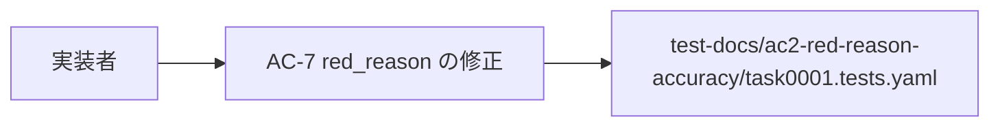
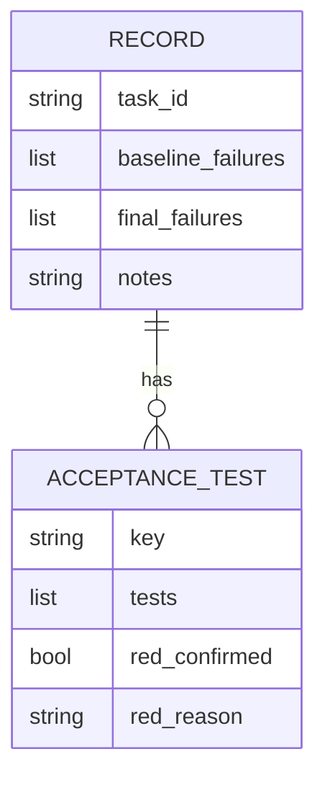

# ac7-red-reason-scope - 要件定義書

## 1. 概要

### 1.1 背景

`test-docs/ac2-red-reason-accuracy/task0001.tests.yaml` の AC-7 エントリの
`red_reason` は、編集後の再検証として「`git status --porcelain` for the whole
change set lists only test-docs/ac7-red-confirmed-unobserved/task0001.tests.yaml」
と記述している。実際にその task の変更集合に含まれていたのは 2 パスであり、
編集対象の記録 `test-docs/ac7-red-confirmed-unobserved/task0001.tests.yaml` と、
その task 自身の workflow 生成 per-task テスト記録
`test-docs/ac2-red-reason-accuracy/task0001.tests.yaml` の両方が含まれていた。
記録と実態の食い違いが、後続タスクが機械可読な証跡として読む文字列に残っている。

### 1.2 目的

- BO-1: `taskNNNN.tests.yaml` の記録を後続タスクの機械可読な証跡として使える状態に
  保つため、`test-docs/ac2-red-reason-accuracy/task0001.tests.yaml` の AC-7 エントリが、
  実際に行われた検査と実際にカバーした範囲を記述するようにする。
- BO-2: 記録された検査内容を弱めずに、そのエントリの記録と実態の食い違いを取り除く。
  変更集合には Rust ファイルも TypeScript ファイルも含まれていなかったという結論は
  記述として残す。
- BO-3: red の判定（`red_confirmed: false`、invariant guard としての分類）と記録の
  その他の部分には一切手を触れず、この修正が再判定ではなくテキスト修正として読める
  ようにする。

### 1.3 スコープ

- 対象: `test-docs/ac2-red-reason-accuracy/task0001.tests.yaml` の
  `acceptance_tests['AC-7']['red_reason']` の折り畳みスカラー 1 つ。
- 対象外: 同フィーチャー `ac2-red-reason-accuracy` の既にマージ済みの計画文書
  （`feature-docs/ac2-red-reason-accuracy/SPEC.md` の Success Criteria と
  `feature-docs/ac2-red-reason-accuracy/tasks/task0001.md` の AC-7）。詳細は
  9.2 および 14.1 を参照。

## 2. ビジネス要件

### 2.1 ビジネス目標

| ID | 目標 |
|----|------|
| BO-1 | AC-7 エントリが、実際に行われた検査と実際にカバーした範囲を記述する |
| BO-2 | 検査内容を弱めずに記録と実態の食い違いを取り除く（Rust なし・TypeScript なしの結論は残す） |
| BO-3 | red の判定と記録のその他の部分は変更せず、テキスト修正として読めるようにする |

### 2.2 対象ユーザー

| ユーザータイプ | 説明 |
|----------------|------|
| 後続タスク（自動処理を含む） | `taskNNNN.tests.yaml` を失敗の帰属判断のための機械可読な証跡として読む |
| 記録の読み手 | AC-7 の red 判定の根拠を、記録されたテキストから確認する |

### 2.3 期待される効果

- 後続タスクが読む証跡から、誰も検査していない状態についての主張が取り除かれる
- Rust ファイルも TypeScript ファイルも含まれないという検査結果は保持される
- red の判定は再判定されず、修正がテキスト修正の範囲に収まる

## 3. ユースケース

### 3.1 ユースケース一覧

| ID | ユースケース名 | アクター | 優先度 |
|----|----------------|----------|--------|
| UC01 | AC-7 の `red_reason` を実際の変更集合の記述に修正する | 実装者 | 高 |

### 3.2 ユースケース詳細

#### UC01: AC-7 の `red_reason` を実際の変更集合の記述に修正する

**アクター**: 実装者

**事前条件**:
- `test-docs/ac2-red-reason-accuracy/task0001.tests.yaml` が integration worktree の
  HEAD に存在する
- 対象エントリは行番号ではなく `acceptance_tests` マッピングの `AC-7` キーで特定する（A-4）

**基本フロー**:
1. 記述対象の task のコミットに含まれるパス一覧を確認する（A-3）
2. AC-7 エントリの `red_reason` 折り畳みスカラーを書き換える
   - 変更集合を 2 パスとして記述する（FR1）
   - 2 つ目のパスを workflow 生成の per-task テスト記録と位置づけ、SPEC の
     宣言された変更集合の `test-docs/{feature}/**` に属することを述べる（FR2）
   - Rust ファイルなし・TypeScript ファイルなしの所見を残す（FR3）
   - 変更集合全体についての単一ファイル主張を削除する（FR4）
   - invariant guard としての分類、空の事前状態、固定文字列検索の 0 件という
     結果を保持する（FR5）
3. 変更が当該スカラーだけに収まっていることを確認する（FR6）
4. PyYAML でロードし直し、キー集合・キー順・折り畳み指定子・英語であることを確認する
   （NFR1, NFR2, NFR3）

**代替フロー**:
- 手順 1 で確認したパス一覧が FR1 の 2 パスと一致しない場合、観測していない状態を
  主張することになるため、記述を観測に合わせる（NFR4）
- `notes` ブロックが同じ範囲指定の欠陥の 2 例目だと実装者が判断した場合は、黙って
  修正せず計画からの逸脱として表面化させる（A-5、FR6 により `notes` はバイト同一）

**事後条件**:
- AC-1 から AC-8 が満たされている

**ユースケース図**:

## 4. 機能要件

### 4.1 機能一覧

| ID | 機能名 | 説明 | 優先度 |
|----|--------|------|--------|
| FR1 | 実際の変更集合を記述する | 変更集合を実際に含まれていた 2 パスとして記述する | 高 |
| FR2 | 2 つ目のパスを宣言された変更集合に帰属させる | workflow 生成の per-task テスト記録であり `test-docs/{feature}/**` に属すると述べる | 高 |
| FR3 | 検査の意図を保持する | Rust ファイルなし・TypeScript ファイルなしという所見を残す | 高 |
| FR4 | 変更集合全体の「1 ファイルのみ」の記述を削除する | 変更集合全体についての単一ファイル主張を残さない | 高 |
| FR5 | AC-7 の根拠の残りを保持する | invariant guard 分類・空の事前状態・固定文字列検索 0 件を残す | 高 |
| FR6 | 編集を 1 つの折り畳みスカラーに限定する | 他のキー・エントリ・`notes` はバイト同一 | 高 |

### 4.2 機能詳細

#### FR1: 実際の変更集合を記述する

**説明**: `test-docs/ac2-red-reason-accuracy/task0001.tests.yaml` の AC-7 エントリの
`red_reason` は、その task の変更集合を、実際に含まれていた 2 パス —
`test-docs/ac7-red-confirmed-unobserved/task0001.tests.yaml`（その task が編集した
対象記録）と `test-docs/ac2-red-reason-accuracy/task0001.tests.yaml`（その task 自身の
workflow 生成 per-task テスト記録）— として記述する。現在の単一パス主張は置き換える。

**入力**:
- 記述対象の task のコミットに含まれるパス一覧: 文字列の集合

**出力**:
- `acceptance_tests['AC-7']['red_reason']`: 文字列 - 2 パスを名指しする本文

**ビジネスルール**:
- 記述は観測された内容に限る（NFR4）

#### FR2: 2 つ目のパスを宣言された変更集合に帰属させる

**説明**: 書き換えたスカラーは、2 つ目のパスが implement フェーズが常に生成する
workflow 生成の per-task テスト記録であり、SPEC の宣言された変更集合の
`test-docs/{feature}/**` エントリに含まれることを述べる。したがってその存在は
封じ込め違反ではなく想定内である。

#### FR3: 検査の意図を保持する

**説明**: 書き換えたスカラーは、元の所見 — 列挙した変更集合には Rust ファイルも
TypeScript ファイルも含まれない — を引き続き記録する。

#### FR4: 変更集合全体の「1 ファイルのみ」の記述を削除する

**説明**: 書き換えたスカラーは、変更集合全体について `git status --porcelain` が
`test-docs/ac7-red-confirmed-unobserved/task0001.tests.yaml` のみを列挙するとは
主張しない。変更集合について述べる内容は、実際に観測されたものに範囲を限定する。

#### FR5: AC-7 の根拠の残りを保持する

**説明**: AC-7 の `red_reason` の残りの内容を保持する。invariant guard としての分類、
編集前の変更集合が空であったため失敗しうる観測可能な事前状態が存在しなかったという
記述、および記述対象の記録自身のヘッダーコメント断片から組み立てた固定文字列による
識別子検索が編集前後とも連続した出現を 0 件で返したという結果。

#### FR6: 編集を 1 つの折り畳みスカラーに限定する

**説明**: 変更するのは AC-7 エントリの `red_reason` 折り畳みスカラーのみ。
`task_id`、`baseline_failures`、`final_failures`、AC-7 エントリの `tests` と
`red_confirmed` の値、AC-1 から AC-6 のエントリ、末尾の `notes` ブロックは、
変更後もバイト同一である。

**エラーケース**:

| エラー | 条件 | 対応 |
|--------|------|------|
| 対象外のキーが変更されている | AC-6 / TS-4 の差分検査 | 対象外の変更を戻す |
| 書き換えた本文が観測を超える主張を含む | NFR4 / TS-1 | 観測された内容に記述を合わせる |

## 5. 非機能要件

### 5.0 非機能要件一覧

| ID | 名称 | 内容 |
|----|------|------|
| NFR1 | Parseability | PyYAML で既存のキー集合（`task_id`、`baseline_failures`、`final_failures`、AC-1..AC-7 のちょうど 7 エントリを持つ `acceptance_tests` マッピング、`notes`）としてロードでき、生ファイルのトップレベルキー順が変わらない |
| NFR2 | Formatting fidelity | 編集したスカラーは既存のインデント位置の `>-` 折り畳みブロックスカラー指定子と、ファイル内の他の折り畳みスカラーと同じ行折り返しスタイルを保つ |
| NFR3 | Language | 書き換えたスカラーは英語のままとし、ファイル内の他のエントリと揃える |
| NFR4 | No unobserved assertion | 記録された観測が支持する内容のみを主張する。task のコミットに含まれていた 2 パスと、その中に Rust ファイルと TypeScript ファイルが無いこと。誰も検査していない状態についての新たな主張は導入しない |
| NFR5 | No build impact | Rust および TypeScript のソース変更なし、リビルドなし。YAML 記録 1 件の文書テキスト修正である |
| NFR6 | Self-consistent scoping | このフィーチャーが生成する受け入れ基準・テストシナリオ・記録テキストのいずれも、自身の変更集合を単一ファイルとして表現しない。このフィーチャー自身の task コミットにも、編集した記録と workflow 生成の `test-docs/ac7-red-reason-scope/task0001.tests.yaml` の両方が含まれる |

### 5.1 パフォーマンス要件

該当なし（NFR5: Rust / TypeScript のソース変更もリビルドも無い）

### 5.2 セキュリティ要件

該当なし（コードパス・入力処理・データ面に触れない）

### 5.3 可用性要件

該当なし

### 5.4 保守性要件

- ログ出力: 該当なし
- 監視: 該当なし
- ドキュメント: NFR4（観測していない主張を置かない）、NFR6（自身の変更集合を単一
  ファイルとして表現しない）

### 5.5 互換性要件

- NFR1: PyYAML で既存の形のままロードできる
- NFR2: `>-` 折り畳みスカラーの様式を保つ
- NFR3: 英語で記述する

## 6. UI/UX要件

### 6.1 画面設計要件

該当なし（UI 面を持たない）

### 6.2 画面遷移

該当なし

### 6.3 レスポンシブ対応

該当なし

## 7. データ要件

### 7.1 データモデル概要

### 7.2 データ項目

| エンティティ | 項目名 | 型 | 必須 | 説明 |
|--------------|--------|-----|------|------|
| record | `task_id` | スカラー | ○ | 変更しない（FR6） |
| record | `baseline_failures` | リスト | ○ | 変更しない（FR6） |
| record | `final_failures` | リスト | ○ | 変更しない（FR6） |
| record | `acceptance_tests` | マッピング（7 エントリ） | ○ | AC-7 の `red_reason` のみ変更（NFR1） |
| AC-7 | `red_reason` | 文字列（`>-` 折り畳み） | ○ | このフィーチャーが書き換える唯一のスカラー（FR1〜FR5） |
| AC-7 | `red_confirmed` | 真偽値 | ○ | `false` のまま（FR5、BO-3） |
| AC-7 | `tests` | リスト | ○ | 変更しない（FR5、FR6） |
| record | `notes` | 文字列ブロック | ○ | 変更しない（FR6、A-5） |

### 7.3 データ保持期間

| データ種別 | 保持期間 |
|------------|----------|
| `taskNNNN.tests.yaml` の記録 | リポジトリに残り続ける（後続タスクが読む機械可読な証跡） |

## 8. 外部連携

### 8.1 連携システム

該当なし

### 8.2 API仕様要件

該当なし

## 9. 制約条件

### 9.1 技術的制約

- 編集は AC-7 エントリの `red_reason` 折り畳みスカラー 1 つに限る（FR6）
- Rust / TypeScript のソース変更もリビルドも行わない（NFR5）
- 記録は英語のままとする（NFR3、A-7）
- 対象エントリは `acceptance_tests` マッピングの `AC-7` キーで特定し、タスク説明が
  引用する行番号 96 では特定しない（A-4）
- プロジェクトのライセンスは MIT

### 9.2 ビジネス上の制約

- 修正対象は live な機械可読記録 `test-docs/ac2-red-reason-accuracy/task0001.tests.yaml`
  に限る。マージ済みフィーチャー `ac2-red-reason-accuracy` の計画文書は書き換えない
  （A-1）。`test-docs/` は将来の自動処理が失敗の帰属判断のために読む live な入力である
  のに対し、完了済みフィーチャーの feature-docs は後から正しく見えるように改変しては
  ならない履歴上の監査記録である。

### 9.3 スケジュール制約

該当なし

### 9.4 宣言された変更集合

このフィーチャー固有のパスは手動で列挙せず、create-plan で `workflow.yaml` の各タスクの
`files` から導出する（`references/phases/create-plan-phase.md`）。

**デフォルトメンバー**（SPEC作成者が明示的に除外しない限り、常に宣言に含まれる）:
- `feature-docs/ac7-red-reason-scope/**`
- `test-docs/ac7-red-reason-scope/**`

これに加えてこのフィーチャーが編集するパス:
- `test-docs/ac2-red-reason-accuracy/task0001.tests.yaml`

`feature-docs/{feature}/**` に含まれるもの: `REQUIREMENTS.md`、`SPEC.md`、
`IMPLEMENTATION.md`、`workflow.yaml`、`phase-state/`、`tasks/`、`reviews/roundN.yaml`、
`VERIFICATION.md`、`retrospect.yaml`、およびデザインステップが生成するデザイン成果物。
生成主体は各フェーズドキュメントおよび `references/phase-state.md` を参照。

`test-docs/{feature}/**` に含まれるもの: `{T}.tests.yaml`（パス形式:
`test-docs/{feature}/{T}.tests.yaml`）。生成主体は `implement-phase.md` を参照。

**意味論**:
- デフォルトのメンバーは、SPEC作成者が明示的に除外しない限り宣言に含まれる。
- この宣言はスーパーセットの主張であり、実際の変更集合は宣言に含まれる（CONTAINED IN）
  必要がある。このフィーチャー自身の task コミットに含まれる 2 パス — 編集した
  `test-docs/ac2-red-reason-accuracy/task0001.tests.yaml` と workflow 生成の
  `test-docs/ac7-red-reason-scope/task0001.tests.yaml` — は、いずれもこの宣言の内側に
  ある（A-2）。

## 10. 想定される課題とリスク

### 10.1 技術的課題

| 課題 | 影響度 | 対応策 |
|------|--------|--------|
| 折り畳みスカラーは書き換えで行折り返しが変わるため、生の行内容に対する検証は不安定 | 中 | PyYAML でロードした値に対して検証する（TS-1） |
| 記述対象の task のコミットのパス一覧が FR1 の 2 パスと一致しない可能性 | 中 | 実装者がテキストを書く前にコミットに対してパス一覧を確認する（A-3、NFR4） |
| `notes` ブロックが同じ範囲指定の欠陥の 2 例目である可能性 | 低 | 黙って修正せず計画からの逸脱として表面化させる（A-5、FR6 により `notes` はバイト同一） |

### 10.2 ビジネスリスク

| リスク | 発生確率 | 影響度 | 対応策 |
|--------|----------|--------|--------|
| このフィーチャー自身の記録が再び「1 ファイルのみ」と表現され、修正対象と同じ欠陥を 3 つ目の記録に再生産する | 中 | 高 | NFR6 と AC-8 で、自身の変更集合を 2 パスとして表現することを受け入れ基準にする（A-2） |

## 11. 成功基準

### 11.1 受け入れ基準

- [ ] AC-1: `test-docs/ac2-red-reason-accuracy/task0001.tests.yaml` をロードして
      `acceptance_tests['AC-7']['red_reason']` を読むと、その task の変更集合の
      メンバーとして `test-docs/ac7-red-confirmed-unobserved/task0001.tests.yaml` と
      `test-docs/ac2-red-reason-accuracy/task0001.tests.yaml` の両方を名指しする
      テキストが得られる。（FR1）
- [ ] AC-2: 同じパース済みスカラーが、2 つ目のパスを その task 自身の workflow 生成
      per-task テスト記録として位置づけ、SPEC の宣言された変更集合のエントリ
      `test-docs/{feature}/**` に結びつけている。（FR2）
- [ ] AC-3: 同じパース済みスカラーが、列挙した変更集合に Rust ファイルも TypeScript
      ファイルも含まれないことを引き続き述べている。（FR3）
- [ ] AC-4: 同じパース済みスカラーが、変更集合全体についての `git status --porcelain`
      が `test-docs/ac7-red-confirmed-unobserved/task0001.tests.yaml` のみを列挙すると
      いう主張を含まず、変更集合全体についての同等の単一ファイル主張も行っていない。
      （FR4）
- [ ] AC-5: 同じパース済みスカラーが、invariant guard としての分類、空の事前状態の
      記述、固定文字列による識別子検索の連続出現 0 件という結果を引き続き保持しており、
      `acceptance_tests['AC-7']['red_confirmed']` は依然として真偽値 `false`、当該
      エントリの `tests` の値は変更されていない。（FR5）
- [ ] AC-6: ベースリビジョンに対するファイルの差分が、すべてのハンクを AC-7 エントリの
      `red_reason` スカラー内に収めている。`task_id`、`baseline_failures`、
      `final_failures`、AC-1 から AC-6 のエントリ、末尾の `notes` ブロックは
      ベースリビジョンとバイト同一である。（FR6）
- [ ] AC-7: ファイルは PyYAML で `task_id`、`baseline_failures`、`final_failures`、
      ちょうど 7 エントリ（AC-1..AC-7）の `acceptance_tests` マッピング、`notes` を
      持つ形でロードでき、生のトップレベルキー順は変わらず、書き換えたスカラーは
      ファイル内の他の折り畳みスカラーと同じインデントの `red_reason: >-` で始まり、
      英語である。（NFR1, NFR2, NFR3）
- [ ] AC-8: このフィーチャー自身の task の変更集合には Rust ファイルも TypeScript
      ファイルも含まれない。変更集合には 2 パス — 編集した記録
      `test-docs/ac2-red-reason-accuracy/task0001.tests.yaml` と、このフィーチャー自身の
      生成記録 `test-docs/ac7-red-reason-scope/task0001.tests.yaml` — が含まれることが
      想定されており、この基準はその表現で述べられ、「1 ファイルのみ」とは決して
      表現されない。（NFR5, NFR6）

### 11.2 KPI

該当なし

## 12. テストシナリオ

### 12.1 テスト観点

- [ ] 正常系（TS-1, unit）: 変更前後で PyYAML により記録をロードし、パース済みの
      `acceptance_tests['AC-7']['red_reason']` 文字列に対して検証する（折り畳みスカラーは
      再折り返しされるため、生の行内容に対しては検証しない）。変更前は
      「lists only test-docs/ac7-red-confirmed-unobserved/task0001.tests.yaml」という
      単一パス主張を含み、変更後は両方のパスを名指しし、その主張を持たない。
      （FR1, FR2, FR4）
- [ ] 正常系（TS-2, unit）: パース済みスカラーが Rust なし / TypeScript なしの所見、
      invariant guard としての分類、空の事前状態の記述、識別子検索 0 件の結果を
      引き続き含み、AC-7 の `red_confirmed` が変更前後とも `False` であることを検証する
      — 観測可能な事前状態を持たない invariant guard である。（FR3, FR5）
- [ ] 正常系（TS-3, unit）: 生ファイルで AC-7 の `red_reason` が元のインデント位置の
      `>-` を使い続けていること、トップレベルキー順が変わっていないこと、ロードした
      `acceptance_tests` マッピングがちょうど 7 エントリであること、書き換えたスカラーが
      全体として ASCII / 英語であることを確認する。（NFR1, NFR2, NFR3）
- [ ] 境界値（TS-4, integration）: ベースリビジョンに対してファイルを差分し、すべての
      ハンクが AC-7 の `red_reason` スカラー内にあることを検証する。AC-1..AC-6 の
      エントリ、トップレベルのスカラー、`notes` ブロックがバイト同一であることを検証する。
      （FR6）
- [ ] 境界値（TS-5, integration）: この task 自身の変更集合を列挙し、Rust パスも
      TypeScript パスも含まれないことを検証する。想定されるメンバーは、編集した記録と
      このフィーチャー自身の `test-docs/ac7-red-reason-scope/task0001.tests.yaml` の
      2 パスであると述べる — 修正後のテキストが記述するのと同じ 2 パスの形であり、
      このフィーチャー自身の記録が用いるべき表現である。（NFR5, NFR6）
- [ ] セキュリティ: 該当なし
- [ ] パフォーマンス: 該当なし

## 13. 用語定義

| 用語 | 定義 |
|------|------|
| per-task テスト記録 | implement フェーズが各タスクに対して生成する `test-docs/{feature}/{T}.tests.yaml` |
| 折り畳みスカラー | YAML の `>-` ブロックスカラー。書き換えると行折り返しが変わる |
| invariant guard | red → green の遷移を持たず、観測可能な事前状態が存在しない受け入れ基準の分類 |
| 宣言された変更集合 | SPEC が宣言するパスのスーパーセット。実際の変更集合はこれに含まれる必要がある |

## 14. 確認事項

### 14.1 確認済み事項

- [x] マージ済み計画文書の取り扱い（create-spec-q0001 /
      requirement.scope.planning-doc-reconciliation、batch policy
      `record_as_assumption`）: 修正は live な機械可読記録
      `test-docs/ac2-red-reason-accuracy/task0001.tests.yaml`（その AC-7 折り畳みスカラー）
      に限る。フィーチャー `ac2-red-reason-accuracy` の既にマージ済みの計画文書 —
      `feature-docs/ac2-red-reason-accuracy/SPEC.md` の Success Criteria
      （「`git status --porcelain` lists only
      `test-docs/ac7-red-confirmed-unobserved/task0001.tests.yaml`」）と
      `feature-docs/ac2-red-reason-accuracy/tasks/task0001.md` の AC-7
      （「The task's whole change set lists only this one YAML file」）— は書き換えない。
      両者はその SPEC 自身の宣言された変更集合（`feature-docs/{feature}/**` と
      `test-docs/{feature}/**` を宣言している）と矛盾しているが、その矛盾は修正されず、
      事実としてこのフィーチャーの SPEC に記録される。（A-1）
- [x] デザインステップ: skipped。ゲート `create-spec.design-step` が batch モードで
      オプション `decide_autonomously` により解決され、スキップという推奨が受け入れられた。
      YAML 記録 1 件の折り畳みブロックスカラーのテキスト修正であり、UI も視覚面も
      新しいモジュール境界も API 変更も無く、検出された 3 つのデザインシステム候補
      （doc/UI-DESIGN-GUIDELINES.yaml、src-tauri/src/ui/md3.rs、
      src-tauri/web-shared/styles.css）はこの変更に触れられない。

### 14.2 未確認・保留事項

- [ ] 記述対象の task のコミットの stat が FR1 で名指しする 2 つの `test-docs/` パスを
      ちょうど含むこと。これはタスク説明と、同様の状況について既に正しい 2 パスの表現を
      用いている姉妹記録 `test-docs/ac7-red-confirmed-unobserved/task0001.tests.yaml` の
      AC-6 に由来し、この dispatch では git から独立に再導出していない。NFR4 が観測して
      いない状態の主張を禁じているため、実装者がテキストを書く前にコミットに対して
      正確なパス一覧を確認する。（A-3）
- [ ] `notes` ブロックの扱い。`notes` は AC-6/AC-7 の検証方法を「git diff/status
      inspection of the single changed file」と既に記述している。この語句はその task が
      編集したファイルを指しており変更集合全体を指していないため変更不要と判断している
      が、実装者が同じ範囲指定の欠陥の 2 例目だと判断した場合は、黙って修正せず計画からの
      逸脱として表面化させる。（A-5）
- [ ] プロジェクトコマンドの実行。この変更集合は Rust にも TypeScript にも触れないため
      実行は必須ではない（記録自身の `notes` が documented している論拠と同じ）。
      前のフィーチャーと同様に `bun test` / `bun run typecheck` を無回帰確認として
      実行してもよい。（A-6）

## 15. 参考資料

- 仕様書: `feature-docs/ac7-red-reason-scope/SPEC.md`
- 修正対象の記録: `test-docs/ac2-red-reason-accuracy/task0001.tests.yaml`
- 2 パス表現の先例: `test-docs/ac7-red-confirmed-unobserved/task0001.tests.yaml` の AC-6
- 修正しない計画文書: `feature-docs/ac2-red-reason-accuracy/SPEC.md`、
  `feature-docs/ac2-red-reason-accuracy/tasks/task0001.md`
