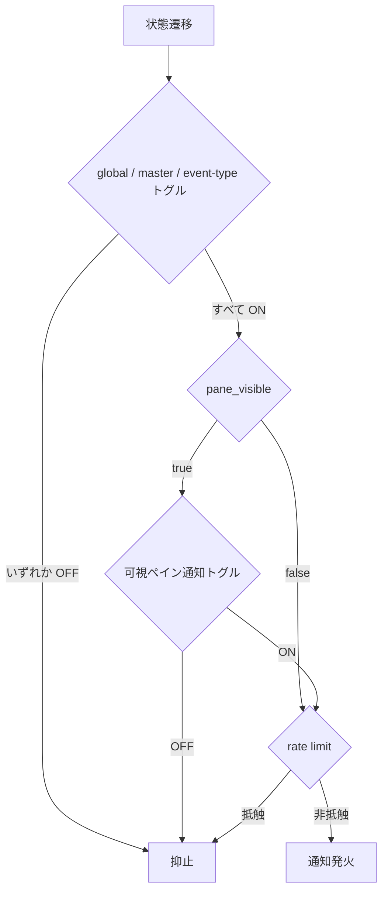

# active-window-agent-notification - 要件定義書

## 1. 概要

### 1.1 背景

現在の `should_fire_agent_notification`（`src-tauri/src/notifications.rs:263-278`）は
`!pane_visible` ゲートを持ち、ウィンドウフォーカス中かつアクティブタブに表示中のペイン
（`agent_status_pane_visible`, `src-tauri/src/app/agent_status.rs:35-47` が true を返すペイン）
での blocked/done 遷移についてデスクトップ通知を抑止する。

### 1.2 目的

複数タブでエージェントを並行運用しているとき、フォーカス中のウィンドウ（アクティブタブの
可視ペイン）で発生した blocked/done 遷移にもデスクトップ通知で気付けるようにする。
また、可視ペインでの通知挙動を設定画面から制御でき、`settings.json` に永続化されるようにする。

### 1.3 スコープ

- 対象: エージェント状態通知（blocked / done）の可視ペインゲートと、その設定項目
- 対象外: タブアクティビティ通知（output / bell / process-exit）のフォーカス・可視性ゲート

## 2. ビジネス要件

### 2.1 ビジネス目標

- 複数タブでエージェントを並行運用しているとき、フォーカス中のウィンドウ（アクティブタブの
  可視ペイン）で発生した blocked/done 遷移にもデスクトップ通知で気付ける
- 可視ペインでの通知挙動を設定画面から制御でき、`settings.json` に永続化される

### 2.2 対象ユーザー

| ユーザータイプ | 説明 |
|----------------|------|
| 複数タブでエージェントを並行運用するユーザー | 複数ペインでエージェントを走らせ、blocked/done への遷移を通知で把握する |

### 2.3 期待される効果

- フォーカス中のウィンドウ・アクティブタブの可視ペインでの blocked/done 遷移に気付ける
- 可視ペインでの通知挙動をユーザー自身が設定画面から切り替えられる

## 3. ユースケース

### 3.1 ユースケース一覧

| ID | ユースケース名 | アクター | 優先度 |
|----|----------------|----------|--------|
| UC01 | 可視ペインのエージェント状態通知を受け取る | 複数タブでエージェントを並行運用するユーザー | 高 |
| UC02 | 可視ペイン通知トグルを設定画面から切り替える | 複数タブでエージェントを並行運用するユーザー | 高 |

### 3.2 ユースケース詳細

#### UC01: 可視ペインのエージェント状態通知を受け取る

**アクター**: 複数タブでエージェントを並行運用するユーザー

**事前条件**:
- 可視ペイン通知トグルが ON（デフォルト）
- master (`agent_status_notifications`)・global (`notification_enabled`)・event-type
  (`agent_notify_on_done` / `agent_notify_on_blocked`) の各トグルが通知を許可している
- 対象ペインが per-pane 30 秒 rate limit (`AGENT_NOTIFICATION_RATE_LIMIT`) に抵触していない

**基本フロー**:
1. ウィンドウがフォーカスされ、対象ペインがアクティブタブに表示されている
2. 当該ペインのエージェント状態が blocked または done へ遷移する
3. デスクトップ通知が発火する

**代替フロー**:
- 可視ペイン通知トグルが OFF の場合、可視ペインの通知は従来どおり抑止される
- master / global / event-type のいずれかが OFF の場合、通知は抑止される
- 同一ペインが 30 秒 rate limit 内の場合、通知は抑止される
- 遷移が Clear（`new_state: None`）の場合、通知対象外

**事後条件**:
- 可視ペインの blocked/done 遷移がデスクトップ通知として提示されている

#### UC02: 可視ペイン通知トグルを設定画面から切り替える

**アクター**: 複数タブでエージェントを並行運用するユーザー

**事前条件**:
- 設定画面を開ける状態にある

**基本フロー**:
1. 設定画面の Agent セクションを開く
2. 「表示中のペインでも通知する」トグルを切り替える
3. 変更が `settings.json` に永続化される

**代替フロー**:
- 既存ユーザーの `settings.json` に当該キーが無い、または null の場合、デフォルト（ON）に解決される

**事後条件**:
- 可視ペインでの通知挙動が、切り替えた値に従う

## 4. 機能要件

### 4.1 機能一覧

| ID | 機能名 | 説明 | 優先度 |
|----|--------|------|--------|
| FR1 | 可視ペイン通知ゲートの設定化 | `!pane_visible` ゲートを削除せず設定入力で切り替える | 高 |
| FR2 | 設定フィールドの追加（デフォルト ON） | `AppSettings` に可視ペイン通知トグル用フィールドを追加 | 高 |
| FR3 | TypeScript スキーマミラー | `AppSettings` interface へのミラー | 高 |
| FR4 | 設定画面のトグル追加 | Agent セクションにトグルを 1 つ追加（en/ja） | 高 |
| FR5 | 既存ゲートの維持 | master / global / event-type / rate limit の維持 | 高 |
| FR6 | 変更対象はエージェント状態通知のみ | タブアクティビティ通知は対象外 | 高 |

### 4.2 機能詳細

#### FR1: 可視ペイン通知ゲートの設定化

**説明**: `should_fire_agent_notification`（`src-tauri/src/notifications.rs:263-278`）の
`!pane_visible` ゲートを削除せず、設定入力で切り替える形に変更する。新設定が ON のとき、
ウィンドウフォーカス中・アクティブタブ表示中のペイン（`agent_status_pane_visible`,
`src-tauri/src/app/agent_status.rs:35-47` が true を返すペイン）の blocked/done 遷移でも
デスクトップ通知を発火する。OFF のときは従来どおり可視ペインの通知を抑止する。

**入力**:
- `pane_visible`: bool - 対象ペインが可視（フォーカス中ウィンドウのアクティブタブ表示中）か
- 可視ペイン通知トグル: bool - 新設定の値
- 遷移後の状態: blocked / done / Clear（`new_state: None`）

**出力**:
- 通知発火可否: bool - デスクトップ通知を発火するか

**処理フロー**:

**ビジネスルール**:
- Clear 遷移（`new_state: None`）は新設定 ON でも通知対象外
- 新設定は可視ペインの扱いのみを変え、非可視ペインの通知には影響しない

**バリデーション**:
| 項目 | ルール | エラーメッセージ |
|------|--------|------------------|
| 可視ペイン通知トグル | bool（キー欠落・null はデフォルト true に解決） | 該当なし |

**エラーケース**:
| エラー | 条件 | 対応 |
|--------|------|------|
| 該当なし | - | - |

#### FR2: 設定フィールドの追加（デフォルト ON）

**説明**: 可視ペイン通知トグル用のフィールドを `crates/app_settings/src/settings.rs` の
`AppSettings` に追加する。既存の agent 通知トグル群（同 434-460 の `default_true` +
`deserialize_null_*` 形）と同一パターンで、デフォルトは `true`。`settings.json` にキーが
無い場合・null の場合はデフォルト（`true`）に解決される。

**入力**:
- `settings.json` の当該キー: bool | null | 欠落

**出力**:
- `AppSettings` の当該フィールド: bool（欠落・null のとき `true`）

**ビジネスルール**:
- 既存の agent 通知トグル群と同一の serde パターンを用いる

#### FR3: TypeScript スキーマミラー

**説明**: 新フィールドを `src-tauri/web-shared/settings/types.ts` の `AppSettings` interface
（既存 agent 通知フィールドは 73-75 行）にミラーする。

**入力**:
- Rust 側 `AppSettings` のフィールド定義

**出力**:
- TypeScript `AppSettings` interface の対応フィールド

#### FR4: 設定画面のトグル追加

**説明**: 設定画面の Agent セクション（`src-tauri/web-shared/settings/sections/agent-section.ts`、
master → done → blocked の既存並び）に「表示中のペインでも通知する」トグルを 1 つ、既存の
`renderToggle` コンポーネントと i18n（en/ja、`src-tauri/web-shared/i18n/locales/{en,ja}.json`）で
追加する。変更は `settings.json` に永続化される。

**入力**:
- ユーザーのトグル操作

**出力**:
- `settings.json` への永続化された値

**ビジネスルール**:
- 既存 `renderToggle` コンポーネントを再利用する
- ラベルは en / ja の双方を用意する

#### FR5: 既存ゲートの維持

**説明**: master (`agent_status_notifications`)・global (`notification_enabled`)・event-type
(`agent_notify_on_done` / `agent_notify_on_blocked`) の各トグルと per-pane 30 秒 rate limit
(`AGENT_NOTIFICATION_RATE_LIMIT`) は従来どおり適用され、新設定より優先して通知を抑止できる。

**ビジネスルール**:
- 新設定は既存ゲートを迂回しない

#### FR6: 変更対象はエージェント状態通知のみ

**説明**: 変更対象はエージェント状態通知（blocked / done）のみとする。タブアクティビティ通知
（output / bell / process-exit）のフォーカス・可視性ゲートは変更しない。

## 5. 非機能要件

### 5.1 パフォーマンス要件

- NFR4: 通知設定 OFF 中も遷移キューが無限成長しない既存挙動を維持する

### 5.2 セキュリティ要件

該当なし

### 5.3 可用性要件

該当なし

### 5.4 保守性要件

- NFR1: 既存 Settings パターンに従う（serde default fn + `deserialize_null` ラッパ、
  Rust / TypeScript 両スキーマのミラー、agent-section の `renderToggle` 再利用）
- NFR2: `should_fire_agent_notification` の pure-function 性（GUI なしで単体テスト可能）を維持する

### 5.5 互換性要件

- NFR3: CLI ビルド（`--no-default-features`）を壊さない（`app_settings` は常時ビルド対象クレート）
- 既存ユーザーの `settings.json` に新キーが無い・null の場合、デフォルト（ON）に解決される

## 6. UI/UX要件

### 6.1 画面設計要件

設定画面の Agent セクション（master → done → blocked の既存並び）に、
「表示中のペインでも通知する」トグルを 1 つ追加する。既存の `renderToggle` コンポーネントを
用い、ラベルは en / ja の双方を用意する。

### 6.2 画面遷移

該当なし（既存セクション内へのトグル追加のみ）

### 6.3 レスポンシブ対応

該当なし

## 7. データ要件

### 7.1 データモデル概要

`settings.json`（`AppSettings`）に、可視ペイン通知トグルを表す boolean フィールドを 1 つ追加する。

### 7.2 データ項目

| エンティティ | 項目名 | 型 | 必須 | 説明 |
|--------------|--------|-----|------|------|
| AppSettings | 可視ペイン通知トグル（フィールド名は本要件では規定しない） | bool | × | デフォルト `true`。キー欠落・null はデフォルトに解決 |

### 7.3 データ保持期間

| データ種別 | 保持期間 |
|------------|----------|
| `settings.json` の設定値 | 永続（ユーザーが変更するまで） |

## 8. 外部連携

### 8.1 連携システム

| システム名 | 連携方法 | データ |
|------------|----------|--------|
| デスクトップ通知 | 既存のエージェント状態通知経路 | blocked / done 遷移 |

### 8.2 API仕様要件

該当なし

## 9. 制約条件

### 9.1 技術的制約

- `app_settings` は常時ビルド対象クレートであり、CLI ビルド（`--no-default-features`）を壊さないこと
- `should_fire_agent_notification` は GUI なしで単体テスト可能な pure function であること
- 既存 Settings パターン（serde default fn + `deserialize_null` ラッパ、Rust / TypeScript 両
  スキーマのミラー）に従うこと

### 9.2 ビジネス上の制約

- タブアクティビティ通知（output / bell / process-exit）は変更対象外

### 9.3 スケジュール制約

該当なし

## 10. 想定される課題とリスク

### 10.1 技術的課題

| 課題 | 影響度 | 対応策 |
|------|--------|--------|
| Rust / TypeScript のスキーマ乖離 | 中 | `types.ts` へのミラーと `bun run typecheck` で整合を確認 |
| CLI ビルドの破壊 | 中 | `cargo check --no-default-features` で回帰確認 |

### 10.2 ビジネスリスク

| リスク | 発生確率 | 影響度 | 対応策 |
|--------|----------|--------|--------|
| 可視ペイン通知がデフォルト ON のため通知が増える | 中 | 低 | 設定画面のトグルで OFF に切り替え可能 |

## 11. 成功基準

### 11.1 受け入れ基準

- [ ] 新設定 ON（デフォルト）のとき、ウィンドウフォーカス中のアクティブタブのペインで
      blocked/done 遷移が起きるとデスクトップ通知が出る
- [ ] 新設定 OFF のとき、可視ペインの通知は従来どおり抑止され、非可視ペインの通知は影響を受けない
- [ ] 設定画面の Agent セクションのトグルで挙動を変更でき、`settings.json` に永続化される（en/ja 両表示）
- [ ] 既存の master / global / event-type トグルと per-pane 30 秒 rate limit は引き続き通知を抑止できる
- [ ] 既存ユーザーの `settings.json` に新キーが無い・null の場合、デフォルト（ON）に解決される
- [ ] タブアクティビティ通知（output / bell / process-exit）の挙動は変化しない

### 11.2 KPI

該当なし

## 12. テストシナリオ

### 12.1 テスト観点

- [ ] 正常系: `should_fire_agent_notification` の単体テスト —
      (pane_visible × 新設定 ON/OFF) × (blocked/done) × master/global/event-type トグルの
      組み合わせで発火/抑止を検証（TS-1）
- [ ] 異常系: Clear 遷移（`new_state: None`）は新設定 ON でも通知対象外であることを検証（TS-2）
- [ ] 境界値: rate limit 共有の検証 — 可視ペインで発火した通知が同一ペインの 30 秒 rate limit を
      消費することを検証（TS-3）
- [ ] 境界値: `app_settings` の serde テスト — 新キー欠落/null → `true` 解決、明示的 `false` の
      ラウンドトリップ（TS-4）
- [ ] 正常系: `agent-section.test.ts` — 新トグルの描画・保存・既存 3 トグルとの並び
      （既存テストパターンに追従）（TS-5）
- [ ] 正常系: `bun run typecheck` — `types.ts` ミラーの整合（TS-6）
- [ ] 正常系: CLI ビルド非破壊の回帰確認（`cargo check --no-default-features`）（TS-7）
- [ ] セキュリティ: 該当なし
- [ ] パフォーマンス: 該当なし

## 13. 用語定義

| 用語 | 定義 |
|------|------|
| 可視ペイン | `agent_status_pane_visible`（`src-tauri/src/app/agent_status.rs:35-47`）が true を返すペイン。ウィンドウフォーカス中かつアクティブタブに表示中 |
| master トグル | `agent_status_notifications` |
| global トグル | `notification_enabled` |
| event-type トグル | `agent_notify_on_done` / `agent_notify_on_blocked` |
| per-pane rate limit | `AGENT_NOTIFICATION_RATE_LIMIT`（30 秒） |
| Clear 遷移 | `new_state: None` への遷移 |

## 14. 確認事項

### 14.1 確認済み事項

- [x] 制御形状: Agent セクションに単一トグルを追加し、ゲートは削除せず設定で切り替える
      （batch-codex-consultation 由来の決定、question_id: `requirement.visible-pane-control-shape`）
- [x] 新設定のデフォルト: ON
      （batch-codex-consultation 由来の決定、question_id: `requirement.visible-pane-default`）
- [x] 対象範囲: エージェント状態通知のみ。タブアクティビティ通知は対象外
      （batch-codex-consultation 由来の決定、question_id: `requirement.notification-scope`）
- [x] per-pane 30 秒 rate limit は変更せず、rate limit キーは可視/非可視で共有のまま
      （同一ペインは 30 秒に 1 回）
- [x] 可視ペインで通知が発火しても `mark_seen` / バッジ挙動（task0005 AC-5）は変更しない

### 14.2 未確認・保留事項

なし

## 15. 参考資料

- `src-tauri/src/notifications.rs:263-278`: `should_fire_agent_notification`
- `src-tauri/src/app/agent_status.rs:35-47`: `agent_status_pane_visible`
- `crates/app_settings/src/settings.rs:434-460`: 既存 agent 通知トグル群
- `src-tauri/web-shared/settings/types.ts:73-75`: 既存 agent 通知フィールド
- `src-tauri/web-shared/settings/sections/agent-section.ts`: 設定画面 Agent セクション
- `src-tauri/web-shared/i18n/locales/{en,ja}.json`: 子 WebView 用 i18n locales
