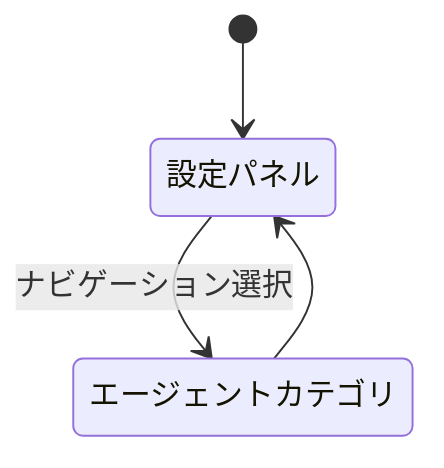

# agent-desktop-notification - 要件定義書

## 1. 概要

### 1.1 背景

エージェント状態変化のデスクトップ通知は、既存の `agent_status_notifications` トグル（通知カテゴリに表示）による一括 ON/OFF のみで、イベント種別ごとの制御ができない。

### 1.2 目的

- エージェントの状態変化（ターン終了・質問待ち）をイベント種別ごとに個別設定可能なデスクトップ通知として受け取れるようにする
- 設定画面に「エージェント」メニューを新設し、エージェント関連の通知設定を一箇所に集約する

### 1.3 スコープ

**対象**

- 設定画面への「エージェント」カテゴリ新設（FR1）
- ターン終了（done 遷移）・質問待ち（blocked 遷移）通知の個別 ON/OFF（FR2 / FR3）
- 全体通知設定を頂点とする階層ゲート（FR4）
- 既存エージェント通知マスターの「エージェント」カテゴリへの移設（FR5）
- 設定スキーマ追加と i18n（FR6 / NFR3）
- plain タブ・mux ペイン双方への適用（FR7）

**対象外**

- OSC 777 agent-status プロトコルの拡張（新状態の追加）

## 2. ビジネス要件

### 2.1 ビジネス目標

- エージェントの状態変化（ターン終了・質問待ち）をイベント種別ごとに個別設定可能なデスクトップ通知として受け取れるようにする
- 設定画面に「エージェント」メニューを新設し、エージェント関連の通知設定を一箇所に集約する

### 2.2 対象ユーザー

| ユーザータイプ | 説明 |
|----------------|------|
| エージェント利用者 | hook から `emterm agent-status` CLI でエージェント状態を報告し、その通知を受け取る eMterm ユーザー |

### 2.3 期待される効果

- 通知したいイベント種別だけを受け取れる
- エージェント関連の通知設定が「エージェント」カテゴリに集約される

## 3. ユースケース

### 3.1 ユースケース一覧

| ID | ユースケース名 | アクター |
|----|----------------|----------|
| UC01 | エージェント通知をイベント種別ごとに設定する | エージェント利用者 |
| UC02 | エージェント状態変化の通知を受け取る | エージェント利用者 |

### 3.2 ユースケース詳細

#### UC01: エージェント通知をイベント種別ごとに設定する

**アクター**: エージェント利用者

**事前条件**:
- 設定パネルを開ける状態にある

**基本フロー**:
1. 設定パネルのナビゲーションから「エージェント」カテゴリを開く（FR1 / AC-1）
2. エージェント通知マスター（`agent_status_notifications`）の ON/OFF を確認する（FR5）
3. その配下のターン終了通知トグルを ON/OFF する（FR2）
4. 質問待ち通知トグルを ON/OFF する（FR3）

**代替フロー**:
- 新設キーを持たない既存 `settings.json` を読み込んだ場合、各イベント種別トグルはデフォルト値（ON）に解決される（FR6 / AC-6）

**事後条件**:
- OFF にしたイベント種別の通知のみ発火しなくなる（AC-2）

#### UC02: エージェント状態変化の通知を受け取る

**アクター**: エージェント利用者

**事前条件**:
- hook が `emterm agent-status` CLI（OSC 777 agent-status プロトコル）で状態を報告している

**基本フロー**:
1. エージェント状態が done または blocked へ遷移する
2. 「全体の通知設定（`notification_enabled`）→ エージェント通知マスター（`agent_status_notifications`）→ イベント種別ごとの個別トグル」の階層ゲートを評価する（FR4）
3. 既存ゲート（pane 非可視条件・30 秒/ペインのレート制限）を評価する（FR4 / NFR1）
4. 全段 ON かつ既存ゲートを通過した場合にデスクトップ通知を発火する

**代替フロー**:
- いずれかの段が OFF の場合は発火しない（AC-3 / AC-4）
- pane 可視時・レート制限時は抑止し、抑止された通知はキューせず破棄する（NFR1）

**事後条件**:
- plain タブ（`PaneKey::Tab`）・mux ペイン（`PaneKey::MuxPane`）のどちらの遷移でも同一のイベント種別設定が適用される（FR7 / AC-7）

## 4. 機能要件

### 4.1 機能一覧

| ID | 機能名 | 説明 |
|----|--------|------|
| FR1 | 設定画面に「エージェント」カテゴリを新設する | 設定パネルへの新カテゴリ追加（アイコン・i18n ラベル・セクションレンダラー） |
| FR2 | ターン終了通知の個別 ON/OFF | done 遷移の通知をトグルで個別制御 |
| FR3 | 質問待ち通知の個別 ON/OFF | blocked 遷移の通知をトグルで個別制御 |
| FR4 | 全体通知設定を頂点とする階層ゲート | 全体 → マスター → イベント種別の 3 段ゲート |
| FR5 | エージェント通知マスターの「エージェント」カテゴリへの移設 | 既存 `agent_status_notifications` トグルの移設 |
| FR6 | 設定スキーマの追加（Settings Pattern 準拠） | Rust / TS / i18n の同期追加 |
| FR7 | plain タブ・mux ペイン両対応 | 双方に同一のイベント種別設定を適用 |

### 4.2 機能詳細

#### FR1: 設定画面に「エージェント」カテゴリを新設する

**説明**: 設定パネル（`src-tauri/web-shared/settings/settings-panel.ts` の categories ゲッター）に新カテゴリ「エージェント」を追加する。既存カテゴリと同様に `CATEGORY_ICONS` への 24px SVG アイコン追加、i18n ラベル（`web-shared/i18n/locales/{en,ja}.json` の `settings.categories.*`）、セクションレンダラー（`settings/sections/` 配下）を備える。

**関連受け入れ基準**: AC-1

#### FR2: ターン終了通知の個別ON/OFF

**説明**: エージェント状態が done へ遷移したとき（既存 OSC 777 agent-status プロトコルの done 状態＝ターン終了に対応する hook）のデスクトップ通知を、「エージェント」カテゴリ内のトグルで個別に ON/OFF できる。

**関連受け入れ基準**: AC-2

#### FR3: 質問待ち通知の個別ON/OFF

**説明**: エージェント状態が blocked へ遷移したとき（質問待ち・許可待ちに対応する hook）のデスクトップ通知を、「エージェント」カテゴリ内のトグルで個別に ON/OFF できる。

**関連受け入れ基準**: AC-2

#### FR4: 全体通知設定を頂点とする階層ゲート

**説明**: 通知発火は「全体の通知設定（`notification_enabled`）→ エージェント通知マスター（既存 `agent_status_notifications`）→ イベント種別ごとの個別トグル」の階層で全段 ON のときのみ行う。既存 `notifications.rs::should_fire_agent_notification` のゲート（pane 非可視条件・30 秒/ペインのレート制限）は維持し、イベント種別ゲートを追加する。

**ビジネスルール**:
- 全体の通知設定が OFF のとき、イベント種別設定に関わらず発火しない
- エージェント通知マスターが OFF のとき、イベント種別設定に関わらず発火しない

**関連受け入れ基準**: AC-3 / AC-4

#### FR5: エージェント通知マスターの「エージェント」カテゴリへの移設

**説明**: 既存の `agent_status_notifications` トグル（現在 `notification-section.ts` 87-98 行目で通知カテゴリに表示）を「エージェント」カテゴリへ移設し、その配下にイベント種別ごとの個別トグルを配置する。通知カテゴリ側の重複表示は行わない。

**関連受け入れ基準**: AC-1

#### FR6: 設定スキーマの追加（Settings Pattern 準拠）

**説明**: イベント種別ごとの新設定キーを `crates/app_settings/src/settings.rs` に `serde(default)` 付きで追加し、`src-tauri/web-shared/settings/types.ts` の `AppSettings` ミラー・セクションレンダラー・i18n キー（en/ja）を揃える。既存 `settings.json`（新キー欠落・null）はデフォルト値に解決される。

**エラーケース**:

| エラー | 条件 | 対応 |
|--------|------|------|
| デシリアライズ失敗 | 既存 `settings.json` に新キーが存在しない／null | `serde(default)` によりデフォルト値（ON）へ解決し、失敗させない |

**関連受け入れ基準**: AC-6

#### FR7: plain タブ・mux ペイン両対応

**説明**: hook ベース（OSC 777 / `emterm agent-status` CLI）の既存機構をそのまま通知源とするため、plain タブ（`PaneKey::Tab`）と mux ペイン（`PaneKey::MuxPane`）の双方で同一のイベント種別設定が適用される。既存 `AgentStatusModel` の遷移キューを流用し、並行機構は新設しない。

**関連受け入れ基準**: AC-7

## 5. 非機能要件

### 5.1 NFR1: 既存通知ゲートの互換維持

pane 可視時の抑止、30 秒/ペインのレート制限（`AGENT_NOTIFICATION_RATE_LIMIT`）、抑止された通知はキューせず破棄する既存挙動を変更しない。

### 5.2 NFR2: 後方互換

既存ユーザーの `settings.json` は無変更で従来と同等の通知挙動を得る（新イベント種別トグルのデフォルトは ON、既存 `agent_status_notifications` の値は保持）。

### 5.3 NFR3: i18n

新設 UI ラベル・説明文は en/ja 両ロケールを持つ（子 WebView は `web-shared/i18n/locales/{en,ja}.json`、通知本文は `notifications.rs` の `Locale` 分岐）。

## 6. UI/UX要件

### 6.1 画面設計要件

- 設定パネルのナビゲーションに「エージェント」カテゴリを追加する（FR1）
- カテゴリアイコンは `CATEGORY_ICONS` に 24px SVG として追加する（FR1）
- 「エージェント」カテゴリ内は、エージェント通知マスターの配下にイベント種別ごとの個別トグル（ターン終了・質問待ち）を配置する（FR5）
- 通知カテゴリ側にエージェント通知マスターを重複表示しない（FR5）

### 6.2 画面遷移



## 7. データ要件

### 7.1 データモデル概要

設定スキーマ（`settings.json`）に、エージェント通知のイベント種別トグルを追加する。

### 7.2 データ項目

| エンティティ | 項目 | 既定値 | 説明 |
|--------------|------|--------|------|
| AppSettings | 全体の通知設定（`notification_enabled`、既存） | 既存値を保持 | 階層ゲートの最上段 |
| AppSettings | エージェント通知マスター（`agent_status_notifications`、既存） | 既存値を保持 | 階層ゲートの中段。キー名は互換のため維持 |
| AppSettings | ターン終了（done 遷移）通知トグル（新設） | ON | 階層ゲートの最下段（FR2） |
| AppSettings | 質問待ち（blocked 遷移）通知トグル（新設） | ON | 階層ゲートの最下段（FR3） |

新設キーは `serde(default)` 付きで追加し、`src-tauri/web-shared/settings/types.ts` の `AppSettings` がミラーする（FR6）。

## 8. 外部連携

### 8.1 連携システム

| システム名 | 連携方法 | データ |
|------------|----------|--------|
| エージェントの hook | `emterm agent-status` CLI / OSC 777 agent-status プロトコル | エージェント状態（idle / working / blocked / done） |

## 9. 制約条件

### 9.1 技術的制約

- 既存 `notifications.rs::should_fire_agent_notification` のゲート（pane 非可視条件・30 秒/ペインのレート制限）を維持する
- 既存 `AgentStatusModel` の遷移キューを流用し、並行機構は新設しない
- 設定追加は Settings Pattern（Rust `serde(default)` ↔ TS `AppSettings` ミラー ↔ i18n キー）に準拠する
- 既存 `agent_status_notifications` の設定キー名は互換のため維持する

### 9.2 ビジネス上の制約

- プロトコル拡張（新状態の追加）は本機能のスコープ外

## 10. 想定される課題とリスク

投入資料に記載なし。

## 11. 成功基準

### 11.1 受け入れ基準

- [ ] AC-1: 設定画面に「エージェント」メニュー（カテゴリ）が存在し、ナビゲーションから開ける
- [ ] AC-2: ターン終了（done 遷移）通知と質問待ち（blocked 遷移）通知をそれぞれ設定画面から個別に ON/OFF でき、OFF にした種別のみ発火しなくなる
- [ ] AC-3: 全体の通知設定（`notification_enabled`）が OFF のとき、イベント種別設定に関わらずエージェント通知は発火しない（階層ゲート）
- [ ] AC-4: エージェント通知マスターが OFF のとき、イベント種別設定に関わらずエージェント通知は発火しない
- [ ] AC-5: 現行プロトコル（idle/working/blocked/done）の範囲で通知対象となる hook は done・blocked の 2 種で全てであることを確認済み（working/idle は既存設計で通知対象外）。よって追加項目なし
- [ ] AC-6: 新キーが存在しない既存 `settings.json` を読み込んでもデフォルト値（ON）に解決され、デシリアライズが失敗しない
- [ ] AC-7: plain タブと mux ペインのどちらの遷移でも同一のイベント種別設定が適用される

## 12. テストシナリオ

### 12.1 テスト観点

- [ ] Rust unit: `should_fire_agent_notification` 相当のゲート関数がイベント種別トグル（done/blocked 個別）を尊重する（既存 AC-1..AC-4 テスト群のパターンを踏襲、`src-tauri/src/notifications.rs` の `#[cfg(test)]`）
- [ ] Rust unit: `app_settings` の新キーについて missing/null/明示 false の serde 解決テスト（`agent_status_notifications` の既存テスト 1042-1067 行のパターンを踏襲）
- [ ] Rust unit: 可視ペイン抑止・レート制限が種別ゲート追加後も既存どおり機能する回帰テスト
- [ ] TS: エージェントセクションのレンダラーテスト（`settings/sections/*.test.ts` のパターン、`bun test`）と `bun run typecheck`

### 12.2 実行コマンド

```
CARGO_TARGET_DIR=src-tauri/target cargo test --manifest-path src-tauri/Cargo.toml --lib
bun test
bun run typecheck
```

## 13. 用語定義

| 用語 | 定義 |
|------|------|
| ターン終了 | エージェント状態の done 状態への遷移 |
| 質問待ち | エージェント状態の blocked 状態への遷移（質問待ち・許可待ち） |
| エージェント通知マスター | 既存の `agent_status_notifications` 設定トグル |
| 階層ゲート | 全体の通知設定 → エージェント通知マスター → イベント種別ごとの個別トグル、の 3 段の発火条件 |

## 14. 確認事項

### 14.1 確認済み事項

- [x] 通知対象となる hook の網羅性: 現行プロトコル（idle/working/blocked/done）の範囲では done・blocked の 2 種で全て（working/idle は `is_qualifying_agent_state` で通知対象外とする既存設計判断があり、頻度的にもノイズになる）。プロトコル拡張（新状態の追加）は本機能のスコープ外
- [x] 「ターン終了」= done 状態への遷移、「質問待ち」= blocked 状態への遷移（既存 OSC 777 agent-status プロトコルの 4 状態 idle/working/blocked/done に対する対応付け。ユーザーの hook が `emterm agent-status` CLI でこれらを報告する前提）
- [x] 既存 `agent_status_notifications` トグルは通知カテゴリから「エージェント」カテゴリへ移設する（重複表示しない）。設定キー名は互換のため維持
- [x] 新設イベント種別トグルのデフォルトは ON（既存 `agent_status_notifications` のデフォルト true と整合し、既存ユーザーの通知挙動を変えない）

### 14.2 未確認・保留事項

- [ ] batch モードのため、14.1 の各項目はユーザー確認なしに投入資料からの推定で確定した

## 15. 参考資料

- `src-tauri/src/notifications.rs`: `should_fire_agent_notification` のゲート、`AGENT_NOTIFICATION_RATE_LIMIT`、`is_qualifying_agent_state`、通知本文の `Locale` 分岐
- `src-tauri/web-shared/settings/settings-panel.ts`: categories ゲッター、`CATEGORY_ICONS`
- `src-tauri/web-shared/settings/sections/notification-section.ts`: 既存 `agent_status_notifications` トグル（87-98 行目）
- `src-tauri/web-shared/settings/types.ts`: `AppSettings` の TS ミラー
- `crates/app_settings/src/settings.rs`: 設定スキーマ（`serde(default)`）
- `src-tauri/web-shared/i18n/locales/{en,ja}.json`: 子 WebView の i18n ラベル
