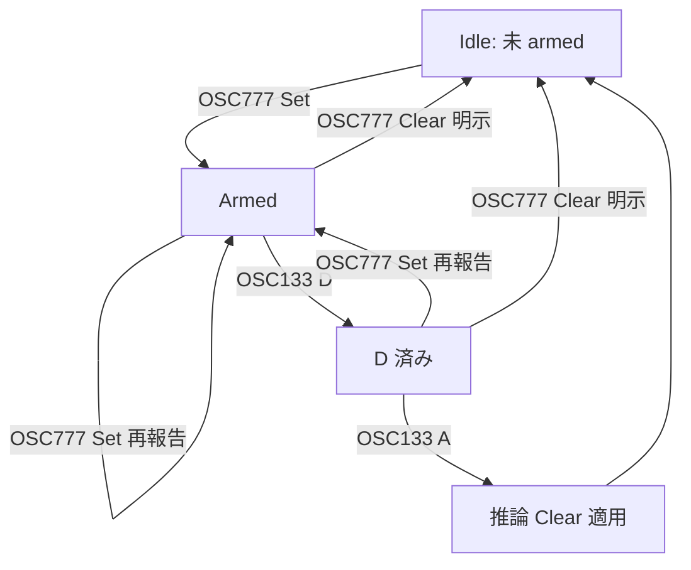

# agent-exit-after-icon - 要件定義書

## 1. 概要

### 1.1 背景

eMterm はタブバー / ステータスバーにエージェント状態アイコン（idle /
working / blocked / done）を表示する。この状態は OSC 777
（`emterm;agent-status;...`）による能動報告のみで更新され、Claude Code
などのエージェント CLI 自身が `state=` を送って設定し、`clear` を送って
消す前提になっている。

ところが Claude Code を Ctrl+C・クラッシュ・`exit` 入力などで終了して
同じペイン内でシェルに戻った場合、シェル自体は生き続けるため、ペイン破棄
（PTY EOF）は発生しない。Claude Code 側が `clear` を送らずに終了すると、
eMterm 側にはそれを検知する手段が一切なく、最後に報告された状態アイコンが
表示されたまま残り続ける。

起票時の指示メモには「OSC による能動報告だけでなく、テキスト解析による
状態検出も入れたほうが良さそう」という提案が付いていた。

### 1.2 目的

Claude Code がシェルに戻った後もエージェント状態アイコンが残り続ける
問題を解消する。

### 1.3 スコープ

対象:
- OSC 133（セマンティックプロンプトマーカー、既存実装 `prompts.rs`）を
  用いた、ライブ PTY イベントベースの推論クリア機構の追加
- GUI ローカルの通常タブ（`AgentStatusModel`）と mux デーモン管理のペイン
  （`MuxPane.agent_status`）の両方への対称的な適用

対象外（「確認した重要事項」参照）:
- テキストパターン（プロンプト文字列の内容解析）による状態検出
- 無操作タイムアウトによる自動クリア

## 2. ビジネス要件

### 2.1 ビジネス目標

エージェント状態表示の信頼性を上げ、「アイコンが残っているが実際は
何も動いていない」という誤情報を無くす。

### 2.2 対象ユーザー

| ユーザータイプ | 説明 |
|----------------|------|
| eMterm 利用者 | mux / 通常タブで Claude Code 等のエージェント CLI を使う開発者 |

### 2.3 期待される効果

- タブ/ステータスバーのエージェント状態アイコンが実態と一致する
- OSC 133 に対応したシェル設定（starship, powerlevel10k, 手動 PS1 組み込み
  等）を使っているユーザーは、エージェント終了後に手動で `clear` を送らず
  ともアイコンが消える

## 3. ユースケース

### 3.1 ユースケース一覧

| ID | ユースケース名 | アクター | 優先度 |
|----|----------------|----------|--------|
| UC01 | Ctrl+C で Claude Code を中断してシェルに戻る | 利用者 | 高 |
| UC02 | Claude Code がクラッシュしてシェルに戻る | 利用者 | 高 |
| UC03 | Claude Code 内で `exit` して通常シェルに戻る | 利用者 | 中 |

### 3.2 ユースケース詳細

#### UC01: Ctrl+C で Claude Code を中断してシェルに戻る

**アクター**: eMterm 利用者

**事前条件**:
- ペイン内で Claude Code が起動しており、`working` などの状態が報告済み
- 使用中のシェルが OSC 133（`A`/`B`/`C`/`D`）を出力する設定になっている

**基本フロー**:
1. Claude Code がエージェント状態 `working` を OSC 777 で報告する
2. 利用者が Ctrl+C で Claude Code を中断する
3. シェルが OSC 133 `D`（コマンド終了）→ `A`（プロンプト開始）を出力する
4. eMterm がこの `D → A` を検知し、エージェント状態を推論的にクリアする

**代替フロー**:
- シェルが OSC 133 を出力しない設定の場合、本機能の対象外（現状維持、
  アイコンは残り続ける）

**事後条件**:
- タブ/ステータスバーのエージェント状態アイコンが消える

## 4. 機能要件

### 4.1 機能一覧

| ID | 機能名 | 説明 | 優先度 |
|----|--------|------|--------|
| F01 | OSC 133 D→A ラッチによる推論クリア | Set 後に D→A が観測されたら agent_status を推論的にクリアする状態機械 | 高 |
| F02 | 通常タブ・mux ペイン双方への対称適用 | GUI ローカル状態と daemon 管理状態の両方で同じ挙動にする | 高 |
| F03 | ライブイベント限定 | スナップショット/リプレイ由来・alt スクリーン抑制対象の OSC 133 マークは対象外にする | 高 |
| F04 | mux hot-upgrade 越しのラッチ保持 | daemon の hot-upgrade（バイナリ差し替え）を跨いでもラッチ状態を失わない | 中 |

### 4.2 機能詳細

#### F01: OSC 133 D→A ラッチによる推論クリア

**説明**: ペインごとに次の状態機械を持つ。

1. 明示的な `Set`（OSC 777 の state 報告）でラッチを「armed」にする
2. armed 状態で OSC 133 `D`（コマンド終了）を観測したら「D 済み」にする
3. 「D 済み」の状態で次の OSC 133 `A`（プロンプト開始）を観測したら、
   推論的な `Clear` を 1 回だけ適用し、ラッチを解除する
4. 明示的な `Clear`（OSC 777 の `clear`）が来たら、推論クリアを発生させず
   ラッチを解除する
5. ラッチ解除後に新しい `Set` が来たら、そこから新しい世代として
   1 に戻る。古い `D`/`A` は新しい世代に影響しない

**入力**:
- OSC 777 self-report イベント（`Set` / `Clear`）: 既存の
  `src-tauri/src/agent_status.rs` の解析結果
- OSC 133 マーク（`A`/`B`/`C`/`D`）: 既存の `prompts.rs` /
  `term_core` のライブ PTY イベント

**出力**:
- ペインの `agent_status` が `None` になる（推論クリア）
- 通常タブ: 既存の `AgentStatusModel` の遷移イベントと同じ形（UI 再描画・
  通知抑制ロジック等は既存の Clear パスをそのまま通る）
- mux ペイン: daemon 側リビジョンの増分、`WaitAgentState` waiter の再評価、
  GUI への `AgentStatusUpdate(state: None)` の配信

**処理フロー**:

**ビジネスルール**:
- 推論クリアは 1 回の D→A につき最大 1 回だけ発生する（多重クリア禁止）
- 推論クリアは既存の明示的 Clear と同じ下流処理（通知抑制・UI 反映）を
  経由する。新しい特別扱いの Clear 経路を作らない

**バリデーション**:
| 項目 | ルール | エラーメッセージ |
|------|--------|------------------|
| OSC133 マークの由来 | ライブ PTY イベントのみ対象。スナップショット/リプレイ/alt スクリーン抑制対象は無視 | (該当なし・単純に無視) |

**エラーケース**:
| エラー | 条件 | 対応 |
|--------|------|------|
| シェルが OSC 133 非対応 | `D`/`A` が一切来ない | 何も起きない（現状維持、アイコンは残る） |

## 5. 非機能要件

### 5.1 パフォーマンス要件

- ペインごとの状態機械は定数個のフィールド（armed か否か、D 済みか否か、
  世代カウンタ）のみで、OSC イベント 1 件あたり O(1) で処理する

### 5.2 セキュリティ要件

- 該当なし（表示用状態のクリアのみで、権限・認証・データ保護に影響しない）

### 5.3 可用性要件

- 該当なし

### 5.4 保守性要件

- ログ出力: 推論クリアが発生したことを既存のログ方針（`log::warn!` 以上）
  に沿って必要に応じて記録する
- ドキュメント: OSC 133 依存であること（シェル側の対応が必要なこと）を
  ユーザー向けドキュメントに明記する

### 5.5 互換性要件

- 該当なし（HTTP API 等の外部インターフェースなし）

## 6. UI/UX要件

### 6.1 画面設計要件

新規 UI 要素は追加しない。既存のタブバー/ステータスバーのエージェント
状態アイコン表示ロジックをそのまま使う（`None` になれば既存のとおり
非表示になる）。

### 6.3 レスポンシブ対応

該当なし

## 7. データ要件

新規の永続データモデルはない。ペインごとの一時的なラッチ状態（メモリ内、
プロセス再起動で消える）のみを追加する。

### 7.2 データ項目

| エンティティ | 項目名 | 型 | 必須 | 説明 |
|--------------|--------|-----|------|------|
| ペイン状態機械 | armed | bool | ○ | 明示 Set 後、クリアされるまで true |
| ペイン状態機械 | command_ended | bool | ○ | armed 中に OSC133 D を観測したら true |
| ペイン状態機械 | generation | u64 | ○ | Set のたびに増分。古い D/A の無効化に使う |

### 7.3 データ保持期間

| データ種別 | 保持期間 |
|------------|----------|
| ラッチ状態 | ペインが存在する間のみ（メモリ内） |

## 8. 外部連携

該当なし。

## 9. 制約条件

### 9.1 技術的制約

- CLAUDE.md の設計方針「Explicit display commands only (no
  auto-detection)」との整合: 本機能は既存の明示的シグナル（OSC 133 の
  セマンティックプロンプトマーク）のみを根拠とし、内容の推測（テキスト
  パターンマッチ）は行わない。これにより「状態を捏造しない、ステールな
  UI 状態を消すだけ」という限定的な例外として扱う
- OSC 133 非対応のシェル設定では本機能の恩恵を受けられない（現状維持）
- 外部 tmux 経由の場合、`allow-passthrough` が設定されていないと OSC 133
  自体が届かない可能性がある（既存の制約、本機能固有ではない）

### 9.2 ビジネス上の制約

- 該当なし

## 10. 想定される課題とリスク

### 10.1 技術的課題

| 課題 | 影響度 | 対応策 |
|------|--------|--------|
| OSC133 と OSC777 のイベント順序保証 | 高 | 同一ペインについて 1 本の順序付きライブイベントストリームで処理し、別々の非同期キューで競合させない |
| ネストしたシェル（Claude Code 内のサブシェル等）が D→A を出してしまう誤クリア | 中 | D→A ラッチ方式で単純な A 単独より偽陽性を抑える。完全な防止はできないため既知の限界としてドキュメント化する |
| mux hot-upgrade 中にラッチ状態を喪失し、クリア機会を逃す | 中 | hot-upgrade のペイン状態移行処理にラッチ状態も含める |

### 10.2 ビジネスリスク

該当なし（限定的な内部修正のため）

## 11. 成功基準

### 11.1 受け入れ基準

- [ ] OSC 133 に対応したシェルで、Claude Code を Ctrl+C 中断した後、
      エージェント状態アイコンが自動的に消える
- [ ] 通常タブ・mux ペインの両方で同じ挙動になる
- [ ] エージェントがまだ動作中（Set のみで D→A が来ていない）状態では
      アイコンは消えない
- [ ] 明示的な Clear が既に来ている場合、後から来る D→A で二重にクリア
      処理が走らない

## 12. テストシナリオ

### 12.1 テスト観点

- [ ] 正常系: Set → D → A の順で観測 → 推論クリアされる
- [ ] 正常系: 通常タブ・mux ペインの双方で同じ結果になる
- [ ] 異常系: Set → 明示 Clear → D → A の順 → 二重クリアが起きない
- [ ] 異常系: D を経ずに A のみ観測 → クリアされない（安全側）
- [ ] 境界値: Set → D → Set（再報告）→ A → 新しい世代の A では古い世代の
      D は無効
- [ ] 境界値: スナップショット/リプレイ由来の OSC133 マークではクリアが
      発生しない

## 13. 用語定義

| 用語 | 定義 |
|------|------|
| OSC 777 | eMterm 独自の agent-status 自己申告シーケンス（`state=`/`clear`） |
| OSC 133 | FinalTerm 由来のセマンティックプロンプトマーカー（`A`=プロンプト開始, `B`=コマンド入力開始, `C`=コマンド実行開始, `D`=コマンド終了） |
| 推論クリア | 明示的な `clear` 報告なしに、OSC 133 のシグナルから eMterm 側が agent_status を `None` にする処理 |
| ラッチ | armed / D 済み / generation を持つペインごとの一時状態機械 |

## 14. 確認事項

### 14.1 確認済み事項

バッチモード実行（`/em-workflow:develop --batch`）のため、ユーザー対話の
代わりに Codex CLI との相談ループで下記を決定した。

- [x] 修正方式: OSC 133 の `D`（コマンド終了）→ `A`（プロンプト開始）の
      ライブ検出による推論クリアを唯一の修正手段とする
- [x] クリアのトリガーは単独の `A` ではなく `D → A` の順序を要求する
      （ネストしたシェルの起動時に出る単独 `A` による誤クリアを抑えるため）
- [x] テキストパターンによる状態検出は採用しない（安全な汎用パターンが
      存在しないと判断: Claude Code 自身の出力がコードブロック等で
      `$`/`>`/`%` 等の行末を含みうるため）
- [x] 無操作タイムアウトによる自動クリアは採用しない（`blocked`/`idle`/
      `working` はいずれも長時間無出力が正当なケースがあるため）
- [x] 通常タブ（GUI ローカル）・mux ペイン（daemon 管理）の両方に対称的に
      適用する。mux 側は daemon 権威の状態を変更し、GUI 側だけを書き換え
      ない
- [x] OSC 133 マークは PromptTracker のバックフィル/スナップショット
      リプレイ経由ではなく、ライブ PTY イベント経由のものだけを対象に
      する

### 14.2 未確認・保留事項

- [ ] 主要な OSC 133 対応シェル統合（starship, powerlevel10k 等）が
      実際に `D` マーカーを送出するかどうかは未検証（Codex 相談時点の
      前提情報からは確認できなかった）。挙動として `D` を送らない
      構成では推論クリアが発生しない（安全側に倒れる）

## 15. 参考資料

- OSC 133 仕様: FinalTerm Semantic Prompts proposal
  (`https://gitlab.freedesktop.org/Per_Bothner/specifications/-/blob/master/proposals/semantic-prompts.md`、
  `src-tauri/src/prompts.rs` のコメントに既存参照あり)
