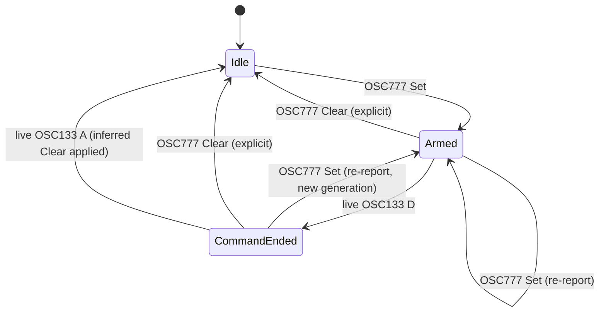

# Feature: agent-exit-after-icon

## Overview

The agent-status icon (idle/working/blocked/done) shown in the tab bar and
status bar only clears via an explicit OSC 777 `clear` self-report or when
the whole pane is destroyed. When Claude Code exits inside a still-alive
shell (Ctrl+C, crash, `exit`) without emitting `clear`, the icon is stuck
forever. This feature adds a live, OSC-133-based inferred-clear fallback so
the icon stops lying about agent activity, without inventing any new agent
state.

## Objectives

- Clear a stale agent-status icon when the underlying shell demonstrably
  returns to an interactive prompt after the agent was last `Set`.
- Apply the same behavior symmetrically to GUI-local plain tabs and
  daemon-owned mux panes.
- Stay within the project's "explicit display commands only (no
  auto-detection)" philosophy by relying only on an existing explicit
  semantic signal (OSC 133), never on content/text inference.

## User Stories

### US1: Ctrl+C out of Claude Code
As an eMterm user, I want the agent-status icon to clear automatically when
I interrupt Claude Code and return to my shell prompt, so that the tab bar
reflects reality without me having to manually clear it.

**Acceptance Criteria:**
- [ ] Given a pane whose shell emits OSC 133, when agent-status was `Set`
  and the shell subsequently emits `D` (command end) followed by `A`
  (prompt start), the pane's agent-status becomes `None`.
- [ ] Given agent-status is `Set` and no `D`/`A` pair has been observed
  since, the icon remains unchanged (no premature clearing).

### US2: Symmetric behavior across plain tabs and mux panes
As an eMterm user working inside the mux, I want the same auto-clear
behavior whether I'm in a plain tab or a mux pane, so behavior is
predictable.

**Acceptance Criteria:**
- [ ] The GUI-local `AgentStatusModel` (plain tabs) and the daemon-owned
  `MuxPane.agent_status` (mux panes) apply equivalent D→A inferred-clear
  semantics.
- [ ] For mux panes, the daemon (not just the GUI) is the source of truth:
  the daemon's revision counter increments, `WaitAgentState` waiters are
  re-evaluated, and the GUI is updated via the existing
  `AgentStatusUpdate` push path.

## Technical Requirements

### Functional Requirements

- **FR1:** Implement a per-pane inferred-clear latch state machine:
  1. An explicit `Set` (OSC 777) arms the latch and starts a new
     generation.
  2. While armed, observing a live OSC 133 `D` (command end) mark for that
     generation transitions the latch to "command ended."
  3. While "command ended," observing the next live OSC 133 `A` (prompt
     start) mark applies exactly one inferred `Clear` and disarms the
     latch.
  4. An explicit `Clear` (OSC 777) disarms the latch without producing an
     inferred clear.
  5. Any new `Set` starts a new generation; marks observed before that
     `Set` (belonging to an earlier generation) must not affect it.
- **FR2:** The inferred `Clear` produced by FR1 goes through the exact
  same downstream path as an explicit `Clear` — no new/parallel clear
  code path (this preserves existing notification-suppression and UI
  update behavior for `new_state: None`).
- **FR3:** FR1 applies identically to:
  - GUI-local plain tabs (`AgentStatusModel` in
    `src-tauri/src/agent_status_model.rs`), driven by the same-process
    OSC 133 marks captured by `term_core`.
  - Daemon-owned mux panes (`MuxPane.agent_status` in
    `src-tauri/src/mux/session/pane.rs`), driven by the daemon's own live
    OSC 133 observation of that pane's PTY stream. The daemon is
    authoritative for mux panes: applying the inferred clear only in the
    GUI is not acceptable (it would desync daemon queries, waiters,
    detached-pane state, and reattachment replay from the visible badge).
- **FR4:** OSC 133 marks and OSC 777 agent-status reports for the same
  pane are processed through one ordered, live per-pane event stream —
  not two independently-scheduled queues that could reorder a `Set`
  relative to a `D`/`A` pair from the same PTY batch.
- **FR5:** Only *live* PTY-observed OSC 133 marks participate in FR1.
  Marks reconstructed for snapshot/replay purposes, or historical marks
  retained by `PromptTracker` for prompt-jump navigation, must never
  trigger an inferred clear. Marks suppressed on the alternate screen (per
  existing `term_core` OSC 133 capture suppression) must not participate
  either.
- **FR6:** The latch state (armed / command-ended / generation) survives a
  mux daemon hot-upgrade (in-place binary replacement) for panes that
  carry it, so an upgrade occurring between a live `D` and its matching
  `A` does not silently drop the pending inferred clear.

### Explicitly excluded (decided during batch create-spec via Codex
consultation; see REQUIREMENTS.md §14.1)

- **Text-pattern-based prompt detection.** No generically safe pattern
  exists to recognize "a bare interactive shell prompt" from PTY content
  alone — Claude Code's own output (code blocks, diffs, suggested
  commands) can end in the same characters (`$`, `%`, `#`, `>`, `❯`) a
  shell prompt would. Out of scope for this feature.
- **Inactivity-timeout-based clearing.** `blocked` (waiting on the user)
  and `idle` can legitimately persist with no PTY output for long
  periods, and `working` can be silent during long operations; a timeout
  would hide exactly the statuses users most need to see. Out of scope
  for this feature.

### Non-Functional Requirements

- **NFR1 - Correctness:** The inferred-clear mechanism must never alter
  the semantics of an explicit `Set`/`Clear` OSC 777 report — it only adds
  an additional, narrowly-gated path to reach `state: None`.
- **NFR2 - Performance:** Per-pane latch state is O(1) in size (armed
  flag, command-ended flag, generation counter) and each OSC 133/OSC 777
  event is processed in O(1); no new hot-loop scanning of scrollback or
  PTY content is introduced.
- **NFR3 - Compatibility:** Panes whose shell never emits OSC 133 retain
  today's behavior exactly (the icon stays until an explicit `Clear` or
  pane destruction) — this feature must not regress or interfere with
  that existing behavior.

## Implementation Approach

### Architecture

No new architectural layer. This extends two existing state owners in
place:

```
GUI process (plain tabs)                 mux daemon (mux panes)
┌───────────────────────────┐           ┌───────────────────────────┐
│ term_core OSC133 capture   │           │ term_core OSC133 capture   │
│ (live PTY stream)          │           │ (live PTY stream, daemon-  │
│           │                │           │  side pane reader)         │
│           ▼                │           │           ▼                │
│ per-pane inferred-clear    │           │ per-pane inferred-clear    │
│ latch (FR1)                │           │ latch (FR1)                │
│           │                │           │           │                │
│           ▼                │           │           ▼                │
│ AgentStatusModel::apply_*  │           │ MuxPane::apply_agent_       │
│ (existing Clear path)      │           │ status_event (existing     │
│                             │           │ Clear path) + revision +   │
│                             │           │ waiter reevaluation +      │
│                             │           │ AgentStatusUpdate push     │
└───────────────────────────┘           └───────────────────────────┘
```

### Data Flow

```
PTY bytes → term_core (OSC 133 + OSC 777 capture, live, main-screen only)
         → per-pane ordered event stream (OSC133 marks + OSC777 reports,
           original relative order preserved)
         → inferred-clear latch (FR1 state machine)
         → [if latch fires] synthesized AgentStatusEvent::Clear
         → existing Clear application path (AgentStatusModel /
           MuxPane::apply_agent_status_event)
         → UI (tab bar / status bar) renders state: None
```

### State Machine (FR1)



### Dependencies

**Internal Dependencies:**
- `src-tauri/src/agent_status.rs`: OSC 777 wire parsing —
  unchanged, reused as-is.
- `src-tauri/src/prompts.rs` (`PromptTracker`, `PromptMarkKind`): existing
  OSC 133 mark types. The live D/A observation for FR1 is a NEW, separate
  live-only observation path — it must not read from `PromptTracker`'s
  retained/pruned marks (FR5), since those exist for prompt-jump
  navigation and can include replay/snapshot-derived or pruned entries.
- `src-tauri/src/agent_status_model.rs` (`AgentStatusModel`): plain-tab
  state owner; extended to host the FR1 latch per `PaneKey`.
- `src-tauri/src/mux/session/pane.rs` (`MuxPane`): mux-pane state owner;
  extended to host the FR1 latch per pane, alongside existing
  `agent_waiters` / revision bookkeeping.
- `src-tauri/src/mux/daemon.rs`: daemon-side live PTY reader / OSC
  dispatch — needs to feed live OSC 133 marks into the FR1 latch for mux
  panes, ordered with OSC 777 reports (FR4).
- `src-tauri/src/mux/upgrade.rs`: hot-upgrade pane-state transfer — needs
  to carry the FR1 latch state across the upgrade boundary (FR6).
- `src-tauri/src/callbacks.rs`: GUI-side OSC dispatch — needs to feed live
  OSC 133 marks into the FR1 latch for plain tabs, ordered with OSC 777
  reports (FR4).

**External Dependencies:** None (no new crates).

### File Structure

No new files are anticipated; this is a targeted extension of the
existing modules listed under Dependencies above. (Exact file boundaries
are decided by the create-plan / implementation-planner step.)

## Test Scenarios

### Unit Tests
- [ ] Latch: `Set` → live `D` → live `A` → latch fires exactly one
  inferred `Clear`.
- [ ] Latch: `Set` → live `A` only (no `D`) → no clear (safe default).
- [ ] Latch: `Set` → explicit `Clear` → live `D` → live `A` → no second
  clear (disarmed).
- [ ] Latch: `Set` → live `D` → `Set` (re-report, new generation) → live
  `A` → no clear (old `D` invalidated by new generation).
- [ ] Latch: never `Set` → live `D` → live `A` → no-op (nothing armed).

### Integration Tests
- [ ] Plain tab: full flow from `term_core` OSC capture through
  `AgentStatusModel` produces `state: None` after `Set`→`D`→`A`.
- [ ] Mux pane: full flow through the daemon produces `state: None`,
  increments the pane revision, resolves any pending `WaitAgentState`
  waiters, and pushes an `AgentStatusUpdate(state: None)` to the GUI.
- [ ] Snapshot/replay-sourced OSC 133 marks do not drive the latch (no
  clear fires purely from replay).
- [ ] Alt-screen-suppressed OSC 133 marks do not drive the latch.
- [ ] Mux hot-upgrade occurring between a live `D` and its matching `A`
  still results in the inferred clear firing after the upgrade (latch
  state survives the upgrade).

### E2E Tests
**Existing E2E tests**: None (no `e2e-tests/`, `tests/e2e/`,
`docker-compose.e2e.yml`, or similar infrastructure detected in this
repository).
**Run command**: Not detected — this feature does not introduce E2E
infrastructure.
- [ ] Manual verification: start a real shell with OSC 133 enabled (e.g.
  starship), report `working` via the CLI, Ctrl+C, observe the icon
  clear.

### Edge Cases
- [ ] A nested interactive shell inside the same pane emits its own
  `A` without a preceding post-`Set` `D` — must NOT clear (the D→A
  ordering guard specifically defends this case, though it is not a
  complete guarantee — see Known Limitations).
- [ ] Rapid repeated `Set` reports (same or different state) while the
  latch is armed must not desynchronize the generation counter.
- [ ] Pane destroyed while the latch is armed: existing pane-discard
  behavior applies; no special handling needed since the whole
  agent-status entry is discarded anyway.

### Performance Tests
Not applicable — no throughput/latency-sensitive path is introduced (O(1)
per-event state machine, no new hot loops).

## Security Considerations

Not applicable — this feature only affects transient, in-memory display
state; no authentication, authorization, or persisted/sensitive data is
involved.

## Error Handling

Not applicable in the traditional sense (no user-facing error codes). The
only "failure mode" is the latch not firing (safe default: icon stays,
matching today's behavior) when OSC 133 is absent or the D→A sequence is
incomplete.

## Performance Optimization

Not applicable — see NFR2.

## Success Criteria

- [ ] All functional requirements (FR1-FR6) are implemented and tested
- [ ] All test scenarios pass
- [ ] Behavior is symmetric between plain tabs and mux panes
- [ ] Panes without OSC 133 support show unchanged (pre-existing)
  behavior
- [ ] Code review is completed

## Open Questions

> **Note**: 未解決の要件は workflow.yaml で `status: tbd` として管理されています。
> plan フェーズの実行前に解決してください。

None — all requirements resolved during the batch create-spec Codex
consultation (see REQUIREMENTS.md §14.1). One residual uncertainty is
recorded as a non-blocking assumption below, not a `tbd` requirement.

## Known Limitations / Assumptions

- **Assumption:** It is unverified whether common OSC-133-emitting shell
  integrations (starship, powerlevel10k, manual `PS1`/`precmd` hooks)
  reliably emit the `D` (command end) mark, as opposed to only `A`
  (prompt start). If an integration only emits `A`, the D→A-gated latch
  in this feature will not fire for that shell (safe default: behaves
  like an unsupported shell, no worse than today). Confirming broader
  `D` coverage, or reconsidering the gating condition, is left to a
  follow-up if this turns out to under-deliver in practice.
- **Known limitation:** OSC 133 is not proof that the marks originated
  from the outer, Claude-Code-hosting shell specifically — any program on
  the PTY (including a nested interactive shell started from within
  Claude Code) can emit OSC 133. The D→A ordering requirement reduces,
  but does not eliminate, false-positive inferred clears. This is an
  accepted, documented trade-off (see REQUIREMENTS.md §9.1).
- **Known limitation:** eMterm accessed through external tmux only sees
  OSC 133 if `allow-passthrough` is configured in tmux — a pre-existing
  constraint, not specific to this feature.

## References

- REQUIREMENTS.md (this feature) — 要件定義書, especially §14.1 for the
  Codex-consultation design decisions and their rationale.
- OSC 133 semantic prompts proposal:
  `https://gitlab.freedesktop.org/Per_Bothner/specifications/-/blob/master/proposals/semantic-prompts.md`
- `src-tauri/src/prompts.rs` — existing `SemanticZoneTracker` /
  `PromptTracker` implementation notes.
- `src-tauri/src/agent_status.rs` — OSC 777 wire grammar (unchanged by
  this feature).
