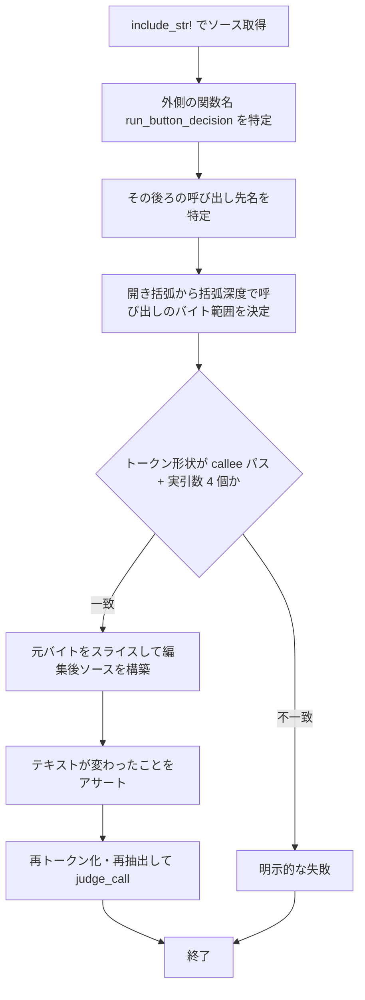

# benign-edit-test-token-rewrite - 要件定義書

## 1. 概要

### 1.1 背景

良性編集の受け入れテスト `button_path_benign_edits_to_the_real_source_are_still_accepted`
（`src-tauri/src/window_host/tests.rs:6825-6888`）は、プロダクションのソーステキストを
そのまま書き写したリテラルを 3 箇所に持っている（`tests.rs:6832`、`:6859`、`:6860`）。
それらのリテラルに現れる識別子 — `outcome`、`records`、`dest`、`hovered_link`、
`host.hover.link_cells`、`middle_click_paste_enabled`、`app.settings.middle_click_paste` — は、
前 feature の NFR8 が宣言した閉じた集合（`tests.rs:5992-5999`）の外側にある。
そのため `run_button_decision` に無関係なリファクタを行うと、このテストが守っている
held の受け渡しとは関係のない理由で赤になる。

### 1.2 目的

- 良性編集テストから、閉じた集合の外側の名前への結合を取り除く。
- 良性編集のカバレッジ自体は保つ。4 種の良性編集（実引数リストの再折り返し、コメント挿入、
  末尾カンマ、独立した 2 文の並べ替え）は、手書きの代用物ではなく実際に埋め込んだ
  プロダクション本体に対して引き続き行使する。
- 2 つのサイレント失敗モード — 編集が何も変えない（vacuity）、編集が意図した呼び出し箇所以外に
  当たる（mislocation）— に対してテストを強化する。

### 1.3 スコープ

変更は `src-tauri/src/window_host/tests.rs` 内の良性編集テストと、それが必要とする
プライベートなテストヘルパーに閉じる。プロダクションコード
（`pointer_routing.rs` / `mouse_report.rs` / `event_loop.rs`）はベースリビジョンのまま据え置く。

## 2. ビジネス要件

### 2.1 ビジネス目標

- 良性編集の受け入れテスト `button_path_benign_edits_to_the_real_source_are_still_accepted`
  （`src-tauri/src/window_host/tests.rs:6825-6888`）から、閉じた集合の外側の名前への結合を
  取り除く。現在このテストはプロダクションのソーステキストをそのまま書き写したコピーを
  3 つハードコードしており、その識別子（`outcome`、`records`、`dest`、`hovered_link`、
  `host.hover.link_cells`、`middle_click_paste_enabled`、`app.settings.middle_click_paste`）は
  前 feature の NFR8 が宣言した閉じた集合（`tests.rs:5992-5999`）の外側にあるため、
  `run_button_decision` に無関係なリファクタが、このテストが守っている held の
  受け渡しとは無関係な理由でテストを赤にする。
- 良性編集のカバレッジ自体は保つ。4 種の良性編集（実引数リストの再折り返し、コメント挿入、
  末尾カンマ、独立した 2 文の並べ替え）は、手書きの代用物ではなく実際に埋め込んだ
  プロダクション本体に対して引き続き行使する。
- 2 つのサイレント失敗モード — 編集が何も変えない（vacuity）、編集が意図した呼び出し箇所以外に
  当たる（mislocation）— に対してテストを強化する。

### 2.2 対象ユーザー

| ユーザータイプ | 説明 |
|----------------|------|
| eMterm の開発者 | `run_button_decision` をリファクタしたときに、held の受け渡しに無関係な理由で良性編集テストが赤にならない |

### 2.3 期待される効果

- 開発者向けの効果のみ。書き換え後は、`outcome` / `records` / `dest` / `hovered_link` /
  `middle_click_paste_enabled` のリネームや、`run_button_decision` 内の無関係な文の作り替えでは
  良性編集テストが赤にならなくなる。赤になるのは閉じた集合の 6 名のいずれかを変更したときだけ。

## 3. ユースケース

### 3.1 ユースケース一覧

| ID | ユースケース名 | アクター | 優先度 |
|----|----------------|----------|--------|
| UC01 | 無関係なリファクタで良性編集テストが赤にならない | eMterm の開発者 | 高 |

### 3.2 ユースケース詳細

#### UC01: 無関係なリファクタで良性編集テストが赤にならない

**アクター**: eMterm の開発者

**事前条件**:
- プロダクションの呼び出し箇所がベースリビジョンで正しく、据え置かれている（A5）。
  `pointer_routing.rs:850` が `mouse_report::apply_outcome_with_held` の第 4 実引数として
  `host.mouse_report_held` を渡し、`pointer_routing.rs:1129-1135` が
  `mouse_report::apply_wheel_report_step` の第 5 実引数として同じ値を渡す。

**基本フロー**:
1. 開発者が `run_button_decision` の内部識別子をリネームする、または無関係な文を作り替える。
2. `CARGO_TARGET_DIR=src-tauri/target cargo test --manifest-path src-tauri/Cargo.toml --lib` を実行する。
3. 閉じた集合の 6 名（`run_button_decision`、`handle_mouse_wheel`、
   `mouse_report::apply_outcome_with_held`、`mouse_report::apply_wheel_report_step`、
   `mouse_report::apply_outcome`、`mouse_report_held`）が保たれていればテストは緑のままになる。

**代替フロー**:
- 閉じた集合の 6 名のいずれかが変わった場合は、テストが赤になる。
- 良性編集が何も変えなかった場合（vacuity）、または意図した呼び出し箇所以外に当たった場合
  （mislocation）も、テストが赤になる。

**事後条件**:
- 良性編集のカバレッジが、実際に埋め込んだプロダクション本体に対して維持される。

## 4. 機能要件

### 4.1 機能一覧

| ID | 機能名 | 説明 | 優先度 |
|----|--------|------|--------|
| FR1 | 良性編集テストの結合を閉じた集合のみに限定する | 閉じた集合の外側の名前とソースリテラルを取り除く | 高 |
| FR2 | Class B の良性編集をトークンレベルで再現する | 末尾カンマと文の並べ替えを既存のトークンヘルパーで行う | 高 |
| FR3 | 全良性編集に vacuity 防止ガードを置く | 編集が実際に入力を変えたことをアサートする | 高 |
| FR4 | Class A の良性編集をアンカー＋バイトスライスで行う | 再折り返しとコメント挿入の位置決定と構築方式を定める | 高 |
| FR5 | 全良性編集後も判定結果が変わらない | 4 種の編集いずれの後も `judge_call` が `Ok` を返す | 高 |

### 4.2 機能詳細

#### FR1: 良性編集テストの結合を閉じた集合のみに限定する

**説明**: 書き換え後の良性編集テストは、既存の閉じた集合 —
`run_button_decision`、`handle_mouse_wheel`、`mouse_report::apply_outcome_with_held`、
`mouse_report::apply_wheel_report_step`、`mouse_report::apply_outcome`、`mouse_report_held` —
の外側にあるプロダクション識別子を一切名指さない。この集合は `tests.rs:5992-5999` の
定数群が既に宣言している。`tests.rs:6832`、`:6859`、`:6860` の 3 つのソースリテラルは、
それらのリテラルを守るためだけに存在する `src.contains(...)` の sanity アサーションとともに
取り除く。レシーバの識別子（`host`）は引き続き、抽出した関数自身の引数集合
（`FunctionBody.params`）から取得し、ハードコードした名前からは取得しない。

**入力**:
- `include_str!("pointer_routing.rs")`: `&'static str` - コンパイル時に埋め込んだソーステキスト

**出力**:
- テスト結果: 緑 / 赤 - 閉じた集合の 6 名が保たれているかどうか

**ビジネスルール**:
- レシーバ識別子はハードコードせず、抽出した関数の実際の引数名から取得する。

**エラーケース**:
| エラー | 条件 | 対応 |
|--------|------|------|
| 閉じた集合外の結合 | 閉じた集合の外側の識別子を名指すリテラルが残る | AC-2 の検証で不合格となる |

#### FR2: Class B の良性編集をトークンレベルで再現する

**説明**: 字句走査器から見える 2 つの良性編集 — held 対応呼び出しの実引数リストへの
末尾カンマ追加と、同じ本体内の前方にある独立した 2 文の並べ替え — は、実際に抽出した本体から
トークンレベルで生成する。生成には既存のヘルパー `call_site_scan::find_calls` /
`split_arg_spans` / `splice_tokens`（`tests.rs:5676`、`:5740`、`:5978`）を用いる。
並べ替えは、対象 2 文をソーステキストの照合ではなく構造的に選ぶ（たとえば抽出した本体内で
トークン走査により見つけた、隣接するトップレベルの `let` 文 2 つ）。編集後のトークン列は
そのまま `judge_call` に渡し、ソースへ戻して描画することはしない。

**入力**:
- 抽出した `run_button_decision` の本体のトークン列

**出力**:
- 編集後のトークン列: `judge_call` への入力

**ビジネスルール**:
- 並べ替え対象の 2 文はソーステキスト照合ではなく構造的に選ぶ。
- 編集後のトークン列をソースへ戻して描画しない。

#### FR3: 全良性編集に vacuity 防止ガードを置く

**説明**: すべての良性編集は、受け入れアサーションを実行する前に、自分の入力を実際に
変更したことをアサートする。Class B ではスプライス後のトークン列が未編集のものと異なること、
Class A では編集後のソースバイトが元のバイトと異なることをアサートする。編集が静かに
適用されなかった場合は必ずテストが赤になり、空虚にパスさせない。これは既存の
`assert_ne!(edited_src, src, "sanity: the edit must actually apply")` ガード
（`tests.rs:6841`、`:6870`）の意図を、それらを現在支えているリテラル結合なしに保つものである。

**バリデーション**:
| 項目 | ルール | エラーメッセージ |
|------|--------|------------------|
| Class B の適用 | スプライス後のトークン列が未編集のものと異なる | テストのアサーション失敗として報告される |
| Class A の適用 | 編集後のソースバイトが元のバイトと異なる | テストのアサーション失敗として報告される |

**エラーケース**:
| エラー | 条件 | 対応 |
|--------|------|------|
| 空虚なパス | 編集が何も変えなかった | テストが赤になる |

#### FR4: Class A の良性編集をアンカー＋バイトスライスで行う

**説明**: 字句走査器から見えない 2 つの編集 — 実引数リストの再折り返しとコメント挿入 — は
引き続きソーステキストに対する編集とし、次のとおり実装する。

- **(a) 位置決定は構造的に、二段アンカーで行う**: まず外側の関数名（`run_button_decision`）を
  見つけ、次にその後ろにある呼び出し先の名前を見つけ、開き括弧から括弧深度で走査して
  呼び出しのバイト範囲を決める。行番号にも、呼び出し自身のテキストの部分文字列照合にも
  依存しない。
- **(b) 構築は元のソースバイトのスライスで行う**: 編集後のソースは
  `original[..span_start] + prefix_edit + original[arg_span] + suffix_edit + original[span_end..]`
  という形にし、実引数のテキストはそのまま持ち回して、テスト側で書き直さない。
  これがルーチンを閉じた集合外の結合から解放する仕組みであり、実引数の個数も、既存の
  インデント幅も、レシーバの識別子も必要としない。
- **(c) mislocation 防止ガード**: 特定したバイト範囲について、期待するトークン形状 —
  呼び出し先パスに続くちょうど N 個のトップレベル実引数（ボタン経路では N = 4）— を
  併せてアサートする。既存の 3 つのアサーション（テキストが変わった／トークン列が変わらない／
  判定が依然 `Ok`）だけでは、編集が意図した呼び出し箇所に当たったことを証明できない。
  それを証明するのはこの形状アサーションであり、FR3 の vacuity 防止ガードとは別物である。
- **(d) アンカーの精緻化**: 実務上可能な範囲で、完全修飾パスではなく呼び出し先関数名の
  素のセグメント（`apply_outcome_with_held`）にアンカーし、モジュールセグメントへの追加結合を
  避ける。既存の閉じた集合の定数（`HELD_AWARE_BUTTON_CALLEE`、`tests.rs:5996`）が既に
  `mouse_report` プレフィックスを持つため、これは選好であって必須要件ではなく、
  それらの定数を上書きすることはない。

**処理フロー**:

**バリデーション**:
| 項目 | ルール | エラーメッセージ |
|------|--------|------------------|
| トークン形状 | 呼び出し先パス + トップレベル実引数ちょうど N 個（ボタン経路は N = 4） | テストのアサーション失敗として報告される |
| 実引数テキスト | 編集後ソースの実引数バイトが元の実引数バイトと同一 | テストのアサーション失敗として報告される |

**エラーケース**:
| エラー | 条件 | 対応 |
|--------|------|------|
| 誤った箇所への着地 | アンカーが別の呼び出し箇所に一致した | 形状アサーションによりテストが赤になる |
| 関数名アンカーの破れ | `fn` キーワードと関数名の間にブロックコメントがある | 明示的な失敗を返す（EC-1） |
| 括弧深度走査の破れ | 実引数リスト内のコメントに閉じ括弧の不均衡がある | 明示的な失敗を返す、またはコメント対応の走査とする（EC-2） |

#### FR5: 全良性編集後も判定結果が変わらない

**説明**: 4 種の良性編集のいずれの後も、ボタン経路の判定は依然 `Ok` である。編集後の成果物は
引き続き `run_button_decision` の本体を特定でき、`call_site_scan::judge_call` が、未編集の
本体を判定するときと同じ閉じた集合の定数と同じアリティ引数
（`&HELD_AWARE_BUTTON_CALLEE, 4, 4, HELD_FIELD, &HELD_UNAWARE_CALLEE`、`tests.rs:6028-6036`）で
それを受理する。トークンレベルのクラスについては、編集が主張するとおりに意味的に等価である
ことも併せてアサートする（たとえば末尾カンマが実引数の個数を変えないこと）。

**バリデーション**:
| 項目 | ルール | エラーメッセージ |
|------|--------|------------------|
| 判定結果 | `judge_call` が `Ok` を返す | テストのアサーション失敗として報告される |
| 意味的等価性 | 末尾カンマが実引数の個数を変えない | テストのアサーション失敗として報告される |

## 5. 非機能要件

### 5.1 パフォーマンス要件

- **NFR4 - フィーチャーゲートおよび実行コストへの影響なし**: テストは GUI 専用の
  `window_host` モジュール配下にあるため、
  `CARGO_TARGET_DIR=src-tauri/target cargo check --manifest-path src-tauri/Cargo.toml --no-default-features`
  は影響を受けない。実行コストは引き続き無視できる程度であり、`#[ignore]` ゲートは不要。
- レスポンスタイム / スループット / 同時接続数: 該当なし（ランタイムのサービス要件を持たない
  テスト専用の変更のため）。

### 5.2 セキュリティ要件

該当なし。本変更はテスト専用であり、認証・認可・入力検証・XSS・インジェクション・
データ保護のいずれの表面も持たず、ランタイムのコード経路を追加しない。

### 5.3 可用性要件

該当なし（稼働するサービスを含まないテスト専用の変更のため）。

### 5.4 保守性要件

- **NFR1 - 走査モジュールの新機能なし、新規依存なし**: `call_site_scan` モジュールに
  範囲情報を持つ字句走査器を追加しない。Class A の編集は独立したアンカールーチンで
  ソースバイトに対して行い、Class B の編集は既存のトークンヘルパーを無改変で再利用する。
  新しいテストフレームワーク依存（proptest / criterion）を導入しない。変更は既存のインライン
  `#[cfg(test)]` モジュールファイル `src-tauri/src/window_host/tests.rs` の内側に留める。
- **NFR2 - テスト専用の変更集合**: プロダクションコードは無改変。`pointer_routing.rs`、
  `mouse_report.rs`、`event_loop.rs` はベースリビジョンのまま据え置く。変更集合は
  `src-tauri/src/window_host/tests.rs` に閉じ、さらにそのファイル内では良性編集テストと
  それが必要とするプライベートなテストヘルパーに閉じる。前 feature のその他のテスト
  （TS-1/2/3/4/5/6 および `pointer_routing_handlers_hold_no_decision_only_delegate_to_the_seam`
  を含む既存の構造テスト）は緑かつ無改変のまま維持する。
- **NFR3 - リポジトリのテスト規約**: テスト名は `<subject>_<scenario>_<expected>` に従う。
  テストは決定的かつ並列安全とし、共有のグローバルフィクスチャを持たず、`include_str!` に
  よるコンパイル時埋め込みとローカルな走査器状態のみを使い、`-- --test-threads=1` を
  必要としない。

### 5.5 互換性要件

- **NFR4** のとおり、`--no-default-features` のコンパイルに影響しない。
- ブラウザサポート / API バージョン: 該当なし（ブラウザ表面も公開 API も持たないため）。

## 6. UI/UX要件

該当なし。本変更は開発者向けのみであり、UI 表面を持たない。書き換え後は、`outcome` /
`records` / `dest` / `hovered_link` / `middle_click_paste_enabled` のリネームや、
`run_button_decision` 内の無関係な文の作り替えでは良性編集テストが赤にならなくなり、
赤になるのは閉じた集合の 6 名のいずれかを変更したときだけになる。

## 7. データ要件

該当なし（永続化するデータも新しいデータモデルも導入しないため）。

## 8. 外部連携

該当なし（外部システム連携も API 仕様も持たないため）。

## 9. 制約条件

### 9.1 技術的制約

- `call_site_scan` モジュールに範囲情報を持つ字句走査器を追加しない（NFR1）。
- 新しいテストフレームワーク依存（proptest / criterion）を追加しない（NFR1）。
- 変更は `src-tauri/src/window_host/tests.rs` の内側に留める（NFR1 / NFR2）。
- Class A の編集で実引数テキストをテスト側が書き直さず、元のバイトをスライスして持ち回す（FR4b）。
- Class B の編集後トークン列をソースへ戻して描画しない（FR2）。

### 9.2 ビジネス上の制約

- プロダクションコードを無改変で据え置く（NFR2）。
- 前 feature の既存テストを改変しない（NFR2）。
- 良性編集は手書きの代用物ではなく実際に埋め込んだプロダクション本体に対して行使する。

### 9.3 スケジュール制約

該当なし（期日の制約は与えられていない）。

### 9.4 宣言された変更集合

このフィーチャー固有のパスは手動で列挙せず、create-plan で `workflow.yaml` の各タスクの
`files` から導出する（`references/phases/create-plan-phase.md`）。

**デフォルトメンバー**（SPEC作成者が明示的に除外しない限り、常に宣言に含まれる）:
- `feature-docs/benign-edit-test-token-rewrite/**`
- `test-docs/benign-edit-test-token-rewrite/**`

`feature-docs/{feature}/**` に含まれるもの: `REQUIREMENTS.md`、`SPEC.md`、`IMPLEMENTATION.md`、
`workflow.yaml`、`phase-state/`、`tasks/`、`reviews/roundN.yaml`、`VERIFICATION.md`、
`retrospect.yaml`、およびデザインステップが生成するデザイン成果物。生成主体は各フェーズ
ドキュメントおよび `references/phase-state.md` を参照（引用のみ、ルールは再掲しない）。

`test-docs/{feature}/**` に含まれるもの: `{T}.tests.yaml`（パス形式:
`test-docs/{feature}/{T}.tests.yaml`）。生成主体は `implement-phase.md` を参照（引用のみ、
ルールは再掲しない）。

**意味論**:
- デフォルトのメンバーは、SPEC作成者が明示的に除外しない限り宣言に含まれる。除外は意図的な
  絞り込みであり、記載漏れによる省略ではない。
- この宣言はスーパーセット（superset）の主張であり、実際の変更集合は宣言に含まれる
  （CONTAINED IN）必要がある。実際には生成されないパスが宣言されていても違反にはならない。
  implementタスクを1つも生成しないフィーチャーは `test-docs/{feature}/` ディレクトリを
  生成しないが、宣言された `test-docs/{feature}/**` は依然として正しい。

## 10. 想定される課題とリスク

### 10.1 技術的課題

| 課題 | 影響度 | 対応策 |
|------|--------|--------|
| EC-1: `fn` キーワードと関数名の間に挿入されたブロックコメントが関数名アンカーを破る | 中 | 受容したリスク（Codex 相談）。ルーチンは誤った関数にアンカーせず、明示的な失敗を返す。静かに誤った範囲を返すことはしない。TS-6 で固定する |
| EC-2: 実引数リスト内のブロックコメントに含まれる不均衡な閉じ括弧が、素朴な括弧深度走査を破る | 中 | 受容したリスク（Codex 相談）。明示的な失敗、またはコメント対応の走査とする。静かに誤った範囲を返すことはしない。TS-7 で固定する |
| EC-3: 「テキストが変わった／トークン列が変わらない／判定が依然 Ok」の 3 アサーションは、編集が意図した呼び出し箇所に当たったことを証明しない | 高 | 受容したリスク（Codex 相談）。FR4(c) の、特定した範囲に対するトークン形状アサーションで閉じる。AC-6 / TS-5 で固定する |
| EC-4: 末尾カンマが `split_arg_spans` の見る実引数の個数を変えてはならない | 中 | 当該ヘルパー（`tests.rs:5740-5761`）が既に保証しており、TS-1 で再アサートする |
| EC-5: `apply_outcome_with_held` が禁止対象の `apply_outcome` と取り違えられてはならない | 中 | トークン単位の全一致照合（`contains_token_sequence`、`tests.rs:5725`）が両者を区別する。本 feature では無変更だが、書き換え後も成り立ち続ける必要がある |
| EC-6: ホイール経路の良性編集カバレッジ — 現状は良性編集テストがボタン経路にのみ存在する（`tests.rs:6830`） | 低 | 本 feature ではホイール経路版を追加しない。後日追加する場合は N = 4 ではなく N = 5 として FR2 / FR4 に従う |

### 10.2 ビジネスリスク

| リスク | 発生確率 | 影響度 | 対応策 |
|--------|----------|--------|--------|
| 無関係なリファクタで良性編集テストが赤になり続ける | 高 | 中 | FR1 で閉じた集合外の結合を取り除き、AC-2 で検証する |
| 良性編集が空虚にパスし、カバレッジが失われる | 中 | 高 | FR3 の vacuity 防止ガードを全編集に置き、AC-5 で検証する |

## 11. 成功基準

### 11.1 受け入れ基準

- [ ] AC-1: `CARGO_TARGET_DIR=src-tauri/target cargo test --manifest-path src-tauri/Cargo.toml --lib`
      が、書き換え後の良性編集テストを含めてパスする。
- [ ] AC-2: `src-tauri/src/window_host/tests.rs` に `pointer_routing.rs` のプロダクション
      ソーステキストを再現する文字列リテラルが存在しない。とくに現在の `tests.rs:6832`、
      `:6859`、`:6860` の 3 リテラルが消えており、置き換えのリテラルも FR1 の閉じた集合の
      外側の識別子を名指さない。（FR1）
- [ ] AC-3: 末尾カンマ編集と文の並べ替え編集が、`include_str!("pointer_routing.rs")` から
      抽出した本体に対して `find_calls` / `split_arg_spans` / `splice_tokens` で構築されており、
      スプライス後のトークン列に対する判定が `Ok` である。（FR2、FR5）
- [ ] AC-4: 再折り返し編集とコメント挿入編集が、FR4(a) の二段アンカーで箇所を特定し、
      FR4(b) に従って元のバイトをスライスして編集後ソースを構築している。編集後ソース中の
      実引数テキストは元の実引数テキストとバイト単位で同一である。（FR4）
- [ ] AC-5: 各良性編集が、受け入れをアサートする前に自身の適用（編集後の成果物 != 元の成果物）を
      アサートしており、何も変えない編集はテストを赤にする。（FR3）
- [ ] AC-6: Class A のルーチンが、特定した範囲のトークン形状 — ボタン経路では呼び出し先パスに
      続くトップレベル実引数ちょうど 4 個 — をアサートしており、誤った呼び出し箇所に一致した
      アンカーは、テキストが変わりトークン列が変わらず判定が依然 `Ok` であってもテストを
      赤にする。（FR4c）
- [ ] AC-7: 4 種すべての良性編集の後も、`judge_call` が無変更の閉じた集合定数とアリティ引数で
      `Ok` を返し続ける。（FR5）
- [ ] AC-8: 本 feature の `git diff --name-only` が、`src-tauri/` 配下では
      `src-tauri/src/window_host/tests.rs` のみを示し、プロダクションファイルに一切触れていない。（NFR2）
- [ ] AC-9: `CARGO_TARGET_DIR=src-tauri/target cargo check --manifest-path src-tauri/Cargo.toml --no-default-features`
      が引き続きコンパイルできる。（NFR4）

### 11.2 KPI

該当なし（数値目標を伴う指標は定義されていない）。

## 12. テストシナリオ

### 12.1 テスト観点

- [ ] 正常系: 4 種の良性編集のいずれの後も判定が `Ok` のまま（TS-1 / TS-2 / TS-3 / TS-4）。
- [ ] 異常系: 期待するトークン形状に一致しない範囲、コメントで壊れた関数名アンカー、
      コメント内の不均衡な閉じ括弧のいずれでも、明示的な失敗を返す（TS-5 / TS-6 / TS-7）。
- [ ] 境界値: 末尾カンマが実引数の個数を変えないこと（TS-1、EC-4）。
- [ ] セキュリティ: 該当なし（セキュリティ表面を持たないため）。
- [ ] パフォーマンス: 該当なし（実行コストが無視できる、NFR4）。

### 12.2 テストシナリオ一覧とトレーサビリティ

| TS ID | テスト名 | 対応要件 |
|-------|----------|----------|
| TS-1 | `button_path_token_level_trailing_comma_edit_is_still_accepted` | FR2, FR3, FR5 |
| TS-2 | `button_path_token_level_statement_reorder_is_still_accepted` | FR2, FR3, FR5 |
| TS-3 | `button_path_anchored_rewrap_edit_is_still_accepted` | FR4, FR3, FR5 |
| TS-4 | `button_path_anchored_comment_insertion_edit_is_still_accepted` | FR4, FR3, FR5 |
| TS-5 | `anchor_rejects_a_span_whose_token_shape_does_not_match_the_expected_call` | FR4 |
| TS-6 | `anchor_reports_an_explicit_failure_on_a_comment_broken_function_name_anchor` | FR4 |
| TS-7 | `anchor_reports_an_explicit_failure_on_an_unbalanced_paren_inside_a_comment` | FR4 |
| TS-M1 | `manual: none required` | NFR2 |

各シナリオの補足:

- **TS-1**: 実際の `run_button_decision` の本体を抽出し、held 対応呼び出しを特定して、
  `splice_tokens` でその実引数リストに末尾カンマトークンを追加する。トークン列が変わったこと、
  実引数の個数が依然 4 個であること、`judge_call` が `Ok` を返すことをアサートする。
- **TS-2**: 抽出した本体の内側で、隣接する独立したトップレベル文 2 つを（ソーステキスト照合
  ではなく）構造的に特定し、`splice_tokens` で入れ替える。トークン列が変わったことと、
  `judge_call` が `Ok` を返すことをアサートする。
- **TS-3**: 二段アンカーで呼び出しのバイト範囲を求め、その範囲のトークン形状が
  「呼び出し先パス + 実引数 4 個」であることをアサートし、スライスによってソースを再構築して
  実引数バイトをそのまま持ち回しつつ周囲の空白を再折り返しする。ソーステキストが変わった
  ことをアサートし、再トークン化・再抽出したうえで `judge_call` が `Ok` を返すことをアサートする。
- **TS-4**: TS-3 と同じアンカーおよびスライス経路を用い、呼び出し先と開き括弧の間に
  ブロックコメントを挿入する。
- **TS-5**: メモリ内の否定テスト。実引数の個数が異なる／呼び出し先が異なる、呼び出し形状の
  箇所に対してアンカールーチンを動かし、静かに範囲を生成せず明示的な失敗を報告することを
  アサートする。AC-6 のガードが空虚でないことを示す。
- **TS-6**: `fn` キーワードと関数名の間にブロックコメントが挟まるメモリ内入力に対し、
  ルーチンが誤った関数にアンカーせず、パニックもせず、明示的な `Err` を返すことをアサートする。
  EC-1 を固定する。
- **TS-7**: 実引数リスト内のブロックコメントに不均衡な閉じ括弧を含むメモリ内入力に対し、
  括弧深度走査の結果が明示的な失敗である（あるいは走査がコメント対応である）ことをアサートし、
  静かに誤った範囲を返さないことを示す。EC-2 を固定する。
- **TS-M1**: プロダクション挙動は無変更であり、E2E ハーネスも存在しないため手動確認は不要。
  AC-8 は `git diff --name-only` / `git diff --stat` で満たす。

## 13. 用語定義

| 用語 | 定義 |
|------|------|
| 良性編集（benign edit） | 実引数リストの再折り返し、コメント挿入、末尾カンマ、独立した 2 文の並べ替えなど、判定結果を変えない編集 |
| Class A | 字句走査器から見えない良性編集（実引数リストの再折り返し、コメント挿入）。ソーステキストに対する編集として実装する |
| Class B | 字句走査器から見える良性編集（末尾カンマ、文の並べ替え）。トークンレベルで実装する |
| 閉じた集合（closed set） | `run_button_decision`、`handle_mouse_wheel`、`mouse_report::apply_outcome_with_held`、`mouse_report::apply_wheel_report_step`、`mouse_report::apply_outcome`、`mouse_report_held` の 6 名（`tests.rs:5992-5999`） |
| 二段アンカー | 外側の関数名 → その後ろの呼び出し先名 → 開き括弧からの括弧深度走査、の順で呼び出しのバイト範囲を決める位置決定方式（FR4a） |
| vacuity 防止ガード | 編集が実際に入力を変えたことをアサートするガード（FR3） |
| mislocation 防止ガード | 特定した範囲のトークン形状をアサートし、編集が意図した呼び出し箇所に当たったことを示すガード（FR4c） |

## 14. 確認事項

### 14.1 確認済み事項

- [x] A1: 良性編集テストの Class A 編集（実引数リストの再折り返し、コメント挿入）は
      ソーステキストに対する編集のままとし、二段アンカー（外側の関数名、その後ろの呼び出し先名、
      続いて呼び出しのバイト範囲を求める括弧深度走査）で箇所を特定する。編集後ソースは元の
      バイトをスライスして構築し、実引数テキストはそのまま持ち回してテスト側で書き直さない。
      Class B 編集（末尾カンマ、文の並べ替え）は `find_calls` / `split_arg_spans` /
      `splice_tokens` によりトークンレベルで再現する。走査モジュールに範囲情報を持つ字句走査器は
      追加しない。（create-spec の Codex 相談で決定。answer `requirement.class-n-benign-edit-coverage`、
      option `closed_set_text_anchor`、packet `benign-edit-test-token-rewrite-q0001`。
      batch ポリシーの `record_as_assumption` により assumption として記録。可逆）
- [x] A2: 完全修飾パスではなく呼び出し先関数名の素のセグメント（`apply_outcome_with_held`）に
      アンカーすることで、`mouse_report` モジュールセグメントへの追加結合を避けられるため、
      実務上可能な範囲でそちらを選好する。ただし必須要件ではない。既存の閉じた集合の定数
      `HELD_AWARE_BUTTON_CALLEE` は既にモジュールプレフィックスを持っており、この精緻化が
      それらの定数と矛盾することはない。（同じ Codex 相談による精緻化。
      batch ポリシーの `record_as_assumption` により assumption として記録。可逆）
- [x] A3: 3 つの残存リスクは除去せず受容し、EC-1 / EC-2 / EC-3 として要件に取り込む。対応は
      FR4 が示すとおり — コメントで壊れた関数名アンカーには明示的な失敗、実引数リスト内の
      コメントに含まれる不均衡な閉じ括弧には明示的な失敗（またはコメント対応の走査）、
      そして FR3 の vacuity 防止ガードとは別物の mislocation 防止ガードとして、特定した範囲に
      対するトークン形状アサーション。（同じ Codex 相談で明示的に受容。
      batch ポリシーの `record_as_assumption` により、黙って落とさず assumption として記録。可逆）
- [x] A4: 本 feature では design ステップを省略する。（gate `create-spec.design-step` にて
      batch ポリシーで解決。option `skip_design`、source `batch-policy`。既存のインライン
      テストモジュール 1 つに閉じたテスト専用の変更であり、UI 表面も視覚的出力も新しい
      モジュール境界も持たないため。可逆）
- [x] A5: プロダクションの呼び出し箇所はベースリビジョンで正しく、無改変で据え置かれるため、
      書き換え後のテストは緑から始まる。`pointer_routing.rs:850` が
      `mouse_report::apply_outcome_with_held` の第 4 実引数として `host.mouse_report_held` を渡し、
      `pointer_routing.rs:1129-1135` が `mouse_report::apply_wheel_report_step` の第 5 実引数として
      同じ値を渡す。（既存のプロダクションソースおよび前 feature のテストで固定された事実。可逆）
- [x] A6: `include_str!("pointer_routing.rs")` は `tests.rs` から解決できる。両ファイルが
      `src-tauri/src/window_host/` に置かれているため。これは同ファイル内の複数テストで既に
      使われている確立した手法である。（既存テストで固定された事実。可逆）
- [x] A7: 前 feature の NFR5 の例外 — ソーステキストに対する構造アサーションは許可するが、
      ボタン経路とホイール経路の held 実引数の受け渡し検査に限る — は引き続き有効であり、
      本 feature はその例外の内側に留まる。本 feature が変えるのは良性編集を「どう構築するか」
      であって「何をアサートするか」ではなく、source-scan の対象接続を 1 つも広げない。
      （前 feature の SPEC から引き継いだ制約。可逆）

### 14.2 未確認・保留事項

なし（すべての要件が resolved であり、`status: tbd` の要件は存在しない）。

## 15. 参考資料

- SPEC: `feature-docs/benign-edit-test-token-rewrite/SPEC.md`
- 前 feature の要件定義書: `feature-docs/mouse-report-held-callsite-test/REQUIREMENTS.md`
- 前 feature の SPEC: `feature-docs/mouse-report-held-callsite-test/SPEC.md`
- 書き換え対象のテスト: `src-tauri/src/window_host/tests.rs:6825-6888`
- 取り除くソースリテラル: `src-tauri/src/window_host/tests.rs:6832, 6859, 6860`
- 既存の sanity ガード: `src-tauri/src/window_host/tests.rs:6841, 6870`
- 閉じた集合の定数: `src-tauri/src/window_host/tests.rs:5992-5999`
- 既存のトークンヘルパー: `src-tauri/src/window_host/tests.rs:5676`（`find_calls`）、
  `:5725`（`contains_token_sequence`）、`:5740-5761`（`split_arg_spans`）、`:5978`（`splice_tokens`）
- 未編集本体の判定呼び出し: `src-tauri/src/window_host/tests.rs:6028-6036`
- 対象プロダクションコード: `src-tauri/src/window_host/pointer_routing.rs:850, 1129-1135`
