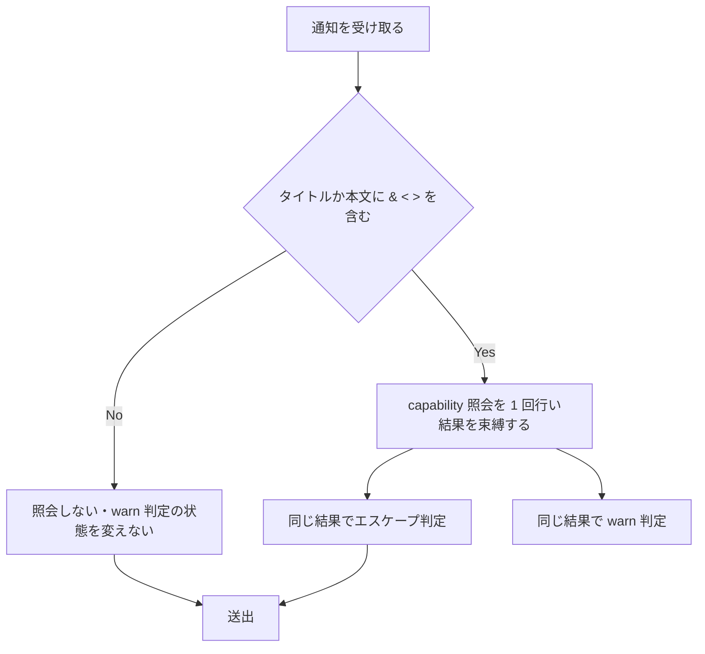
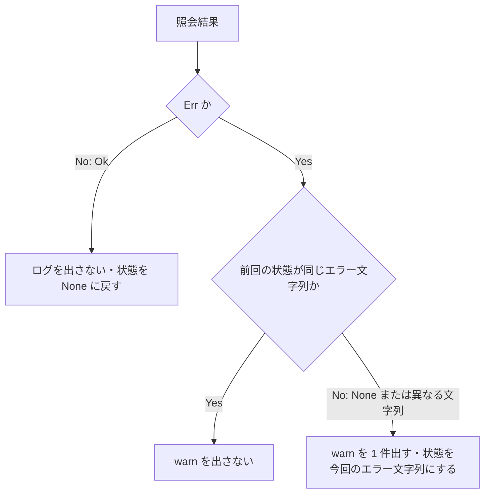

# capability-query-failure-warn - 要件定義書

## 1. 概要

### 1.1 背景
Unix の通知ワーカー（`src-tauri/src/callbacks.rs` の `notify_worker`）は、タイトルか本文に `&`、`<`、`>` を含む通知で capability 照会（`notify_rust::get_capabilities()`）を行う。照会が失敗したときは fail-closed の方針でタイトルと本文の両方をエスケープする（`callbacks.rs:603` `body_markup_absence_confirmed`）。現状は、照会失敗によってエスケープされ続けていることの痕跡がログに残らない。

### 1.2 目的
- capability 照会が失敗したとき、`log::warn!` で emterm.log に記録を残す。
- 「通知に HTML やエンティティがそのまま出る」「通知が常にエスケープされる」という報告を、capability 照会の失敗、サーバーが body-markup に対応していない場合、エスケープ側の不具合のどれに当たるか、ログから切り分けられるようにする。
- 同じ失敗が続くときにログを冗長にしない。warn は状態遷移時だけ出す。

### 1.3 スコープ
- 対象: Unix の `notify_worker`（既存の `#[cfg(unix)]` の範囲）における、照会結果の束縛、照会失敗時の warn、warn 判定ヘルパー、関連する doc コメント。
- 対象外: エスケープの判定と出力の変更（fail-closed 方針は維持する）。Windows の `notify_worker` と `spawn_notify_worker`。UI の追加・変更。

## 2. ビジネス要件

### 2.1 ビジネス目標
- capability 照会の失敗を emterm.log に記録する。
- 通知表示に関する報告の原因を、ログから切り分けられるようにする。
- 同じ失敗の連続でログを冗長にしない。

### 2.2 対象ユーザー
| ユーザータイプ | 説明 |
|----------------|------|
| 通知の不具合を調べる人 | emterm.log を読み、通知表示に関する報告の原因を切り分ける |

### 2.3 期待される効果
- 照会失敗によるエスケープが emterm.log から確認できる。
- 同じエラー文字列の失敗が続いても、warn は状態遷移時の 1 件だけになる。

## 3. ユースケース

### 3.1 ユースケース一覧
| ID | ユースケース名 | アクター | 優先度 |
|----|----------------|----------|--------|
| UC01 | 通知表示の報告をログから切り分ける | 通知の不具合を調べる人 | 高 |

### 3.2 ユースケース詳細

#### UC01: 通知表示の報告をログから切り分ける

**アクター**: 通知の不具合を調べる人

**事前条件**:
- Unix 環境で eMterm が通知を送出している。
- 「通知に HTML やエンティティがそのまま出る」または「通知が常にエスケープされる」という報告がある。

**基本フロー**:
1. emterm.log を開く。
2. capability 照会の失敗を示す warn 行の有無を確認する。
3. warn 行があれば、照会の失敗によってタイトルと本文がエスケープされたと判断する。

**代替フロー**:
- warn 行がない場合、原因はサーバーが body-markup に対応していない場合か、エスケープ側の不具合のいずれかとして切り分ける。

**事後条件**:
- 報告の原因が、照会失敗、body-markup 非対応、エスケープ側の不具合のどれに当たるか切り分けられている。

## 4. 機能要件

### 4.1 機能一覧
| ID | 機能名 | 説明 | 優先度 |
|----|--------|------|--------|
| FR1 | 照会結果を一度だけ束縛する | 1 通知あたり照会結果を 1 回だけ束縛し、エスケープ判定と warn 判定で共有する | 高 |
| FR2 | 照会失敗時の warn（状態遷移時のみ） | 照会が Err を返したとき、状態遷移に当たる場合だけ warn を 1 件出す | 高 |
| FR3 | warn 判定を純粋なヘルパーに分ける | warn 判定を I/O を行わないヘルパー 1 つに置く | 高 |
| FR4 | warn の内容 | 固定の文言とエラー値の Display 文字列だけを入れる | 高 |
| FR5 | doc コメントの更新 | `notify_worker` の doc コメントと照会ゲート付近のコメントに warn の規則を書き足す | 中 |

### 4.2 機能詳細

#### FR1: 照会結果を一度だけ束縛する

**説明**: Unix の `notify_worker` では、1 通知あたり capability 照会の結果を 1 回だけ束縛する。エスケープ判定と warn 判定は、その同じ 1 つの結果を使う。照会は現行どおりオンデマンドとする。タイトルと本文のどちらにも `&`、`<`、`>` が含まれない通知では照会しない。含まれる通知では、1 通知につき高々 1 回照会する。

**入力**:
- タイトル: 文字列 - キューから受け取った通知のタイトル
- 本文: 文字列 - キューから受け取った通知の本文

**出力**:
- 照会結果: `Result` - 1 通知につき高々 1 回得る capability 照会の結果（照会しない通知では無し）

**処理フロー**:

**ビジネスルール**:
- 照会結果は 1 通知につき 1 回だけ束縛する。
- エスケープ判定と warn 判定は同じ 1 つの結果を使う。

#### FR2: 照会失敗時の warn（状態遷移時のみ）

**説明**: 照会が Err を返したとき、次のいずれかに当たる場合だけ `log::warn!` を 1 件出す。(a) ワーカーが始まってから最初の失敗、(b) 直前の失敗とエラー文字列が異なる、(c) 直前の照会が成功していた。直前の失敗と同じエラー文字列の失敗が続く間は warn を出さない。照会が成功したときはログを出さず、状態を「直前は成功」に戻す。照会を行わなかった通知（メタ文字なし）では状態を変えない。

**処理フロー**:

**ビジネスルール**:
- warn を出すのは、最初の失敗、エラー文字列の変化、成功後の失敗のときだけとする。
- 失敗からの回復（Err の後の Ok）はログに出さない。

**エラーケース**:
| エラー | 条件 | 対応 |
|--------|------|------|
| capability 照会の失敗 | 照会が Err を返す | 状態遷移に当たれば warn を 1 件出す。エスケープは現行どおりタイトルと本文の両方に行う |

#### FR3: warn 判定を純粋なヘルパーに分ける

**説明**: warn を出すかどうかは、直前の状態（前回の失敗のエラー文字列。成功後と初期状態は None）と今回の照会結果だけから決める。この判定は I/O を行わないヘルパー 1 つに置き、D-Bus 接続もログの取り込みも使わずに単体テストできるようにする。前回のエラー文字列は、ワーカーローカルの `Option<String>` で持つ。static やグローバル状態、別の `NotifyRustSink` インスタンスとの共有は使わない。

**入力**:
- 前回の状態: `Option<String>` - 前回の失敗のエラー文字列（成功後と初期状態は None）
- 今回の照会結果: `Result` - 今回の capability 照会の結果

**出力**:
- warn を出すかどうか
- 次の状態: `Option<String>`

#### FR4: warn の内容

**説明**: warn 1 行には、capability 照会の失敗であることが分かる固定の文言（既存の `LOG_*` マーカー定数と同じ形式）と、エラー値の Display 文字列を入れる。通知のタイトルと本文から得た文字列は、生の値も、エスケープ後の値も、秘匿化した表示も入れない。

#### FR5: doc コメントの更新

**説明**: `callbacks.rs` の `notify_worker` の doc コメントと、照会ゲート付近のコメントに、照会失敗時の warn と、状態遷移時だけ出す規則を書き足す。

## 5. 非機能要件

### 5.1 パフォーマンス要件
- NFR3: capability の照会結果はキャッシュしない。保持してよいのは、warn 判定用の前回のエラー文字列だけとする。この値をエスケープ判定に使ってはならない。

### 5.2 セキュリティ要件
- NFR1: エスケープの判定と出力は変えない。照会が失敗したときは、現行どおりタイトルと本文の両方をエスケープする。`escape_for_send`、`escape_body_markup`、`body_markup_absence_confirmed`、`escape_for_send_on_demand` の出力と意味は変えない。
- NFR7: dispatch 成功ログの秘匿化表示は、引き続きエスケープ前の、キューから受け取った値から作る。

### 5.3 可用性要件
- 該当なし

### 5.4 保守性要件
- NFR2: リリースビルドの emterm.log に残るよう、`log::warn!` を使う。この機能のために `log::debug!` や `log::info!` は使わない。
- NFR6: `callbacks/tests.rs` の既存テストは、アサーションの期待値を変えない。`notify_worker` の型制約が変わってテストの fake が差し替えを要する場合も、変えてよいのは fake のエラー型など呼び出し側の書き方だけとする。

### 5.5 互換性要件
- NFR4: 変更は既存の `#[cfg(unix)]` の範囲に収める。Windows の `notify_worker` と `spawn_notify_worker` は変えない。`--no-default-features`（CLI のみ）のビルドが引き続きコンパイルできる。
- NFR5: 新しい crate 依存（ログ取り込み用の crate を含む）は追加しない。

### 5.6 非機能要件一覧
| ID | 要件名 |
|----|--------|
| NFR1 | fail-closed 方針の維持 |
| NFR2 | ログレベル |
| NFR3 | キャッシュ禁止 |
| NFR4 | プラットフォームとビルドへの影響 |
| NFR5 | 依存の追加なし |
| NFR6 | 既存テストの期待値の不変 |
| NFR7 | 秘匿化の順序の不変 |

## 6. UI/UX要件

### 6.1 画面設計要件
UI の追加・変更はない。通知ワーカー内のログ出力だけで完結する、バックエンドの Rust 変更である。

### 6.2 画面遷移
該当なし

### 6.3 レスポンシブ対応
該当なし

## 7. データ要件

### 7.1 データモデル概要
永続データの追加はない。

### 7.2 データ項目
| エンティティ | 項目名 | 型 | 必須 | 説明 |
|--------------|--------|-----|------|------|
| 通知ワーカー（ワーカーローカル） | 前回のエラー文字列 | `Option<String>` | ○ | warn 判定用の直前の状態。成功後と初期状態は None |

### 7.3 データ保持期間
| データ種別 | 保持期間 |
|------------|----------|
| 前回のエラー文字列 | ワーカースレッドの存続期間 |

## 8. 外部連携

### 8.1 連携システム
| システム名 | 連携方法 | データ |
|------------|----------|--------|
| 通知サーバー | `notify_rust::get_capabilities()`（D-Bus の GetCapabilities） | capability の一覧 |

### 8.2 API仕様要件
- 照会は現行どおりオンデマンドとし、1 通知につき高々 1 回とする（FR1）。

## 9. 制約条件

### 9.1 技術的制約
- 変更は既存の `#[cfg(unix)]` の範囲に収める（NFR4）。
- 新しい crate 依存を追加しない（NFR5）。
- capability の照会結果をキャッシュしない（NFR3）。
- warn 判定の状態に static やグローバル状態を使わない（FR3）。

### 9.2 ビジネス上の制約
- fail-closed 方針を変えない（NFR1）。

### 9.3 スケジュール制約
- なし

### 9.4 宣言された変更集合

このフィーチャー固有のパスは手動で列挙せず、create-plan で `workflow.yaml` の各タスクの `files` から導出する（`references/phases/create-plan-phase.md`）。

**デフォルトメンバー**（SPEC作成者が明示的に除外しない限り、常に宣言に含まれる）:
- `feature-docs/capability-query-failure-warn/**`
- `test-docs/capability-query-failure-warn/**`

`feature-docs/capability-query-failure-warn/**` に含まれるもの: `REQUIREMENTS.md`、`SPEC.md`、`IMPLEMENTATION.md`、`workflow.yaml`、`phase-state/`、`tasks/`、`reviews/roundN.yaml`、`VERIFICATION.md`、`retrospect.yaml`、およびデザインステップが生成するデザイン成果物。生成主体は各フェーズドキュメントおよび `references/phase-state.md` を参照（引用のみ、ルールは再掲しない）。

`test-docs/capability-query-failure-warn/**` に含まれるもの: `{T}.tests.yaml`（パス形式: `test-docs/capability-query-failure-warn/{T}.tests.yaml`）。生成主体は `implement-phase.md` を参照（引用のみ、ルールは再掲しない）。

**意味論**:
- デフォルトのメンバーは、SPEC作成者が明示的に除外しない限り宣言に含まれる。除外は意図的な絞り込みであり、記載漏れによる省略ではない。
- この宣言はスーパーセット（superset）の主張であり、実際の変更集合は宣言に含まれる（CONTAINED IN）必要がある。実際には生成されないパスが宣言されていても違反にはならない。implementタスクを1つも生成しないフィーチャーは `test-docs/capability-query-failure-warn/` ディレクトリを生成しないが、宣言された `test-docs/capability-query-failure-warn/**` は依然として正しい。

## 10. 想定される課題とリスク

### 10.1 技術的課題
| 課題 | 影響度 | 対応策 |
|------|--------|--------|
| `notify_worker` の `FetchErr` に Display 制約を足すと、既存の `worker_injection_points` テストの fake（`Err(())`）がコンパイルできなくなる | 低 | fake のエラー型を String などに替える。アサーションは変えない（A4、NFR6） |

### 10.2 ビジネスリスク
| リスク | 発生確率 | 影響度 | 対応策 |
|--------|----------|--------|--------|
| なし | - | - | - |

## 11. 成功基準

### 11.1 受け入れ基準
- [ ] AC1: 初期状態で照会が Err を返すと、warn 判定ヘルパーは warn する。(FR2, FR3)
- [ ] AC2: 直前の失敗と同じエラー文字列で再び Err になると、warn しない。(FR2)
- [ ] AC3: 直前の失敗と異なるエラー文字列で Err になると、warn する。(FR2)
- [ ] AC4: Ok の後に Err になると warn する。Ok 自体では warn しない。(FR2)
- [ ] AC5: メタ文字を含まない通知は照会せず、warn 判定の状態を変えない。前後の失敗が同じエラー文字列なら、間にこの通知が挟まっても 2 回目は warn しない。(FR1, FR2)
- [ ] AC6: warn の文面は FR4 の内容だけから作られ、通知のタイトルと本文から得た文字列を含まない。(FR4)
- [ ] AC7: 照会が失敗したときは、現行どおりタイトルと本文の両方がエスケープされて送出される。既存のエスケープ関連テストは、期待値を変えずにすべて通る。(NFR1, NFR6)
- [ ] AC8: `CARGO_TARGET_DIR=src-tauri/target cargo test --manifest-path src-tauri/Cargo.toml --lib` が通る。
- [ ] AC9: `CARGO_TARGET_DIR=src-tauri/target cargo check --manifest-path src-tauri/Cargo.toml --no-default-features` が通る。(NFR4)

### 11.2 KPI
| 指標 | 目標値 | 測定方法 |
|------|--------|----------|
| 受け入れ基準の達成 | AC1〜AC9 をすべて満たす | 12 章のテストシナリオ |

## 12. テストシナリオ

### 12.1 テスト観点
- [ ] 正常系: TS1 (unit): warn 判定ヘルパーで、前回の状態が None のとき Err("e1") → warn する (AC1)
- [ ] 正常系: TS2 (unit): 前回の状態が Some("e1") のとき Err("e1") → warn しない (AC2)
- [ ] 正常系: TS3 (unit): 前回の状態が Some("e1") のとき Err("e2") → warn し、次の状態は Some("e2") (AC3)
- [ ] 正常系: TS4 (unit): 前回の状態が Some("e1") のとき Ok → warn せず次の状態は None。続けて Err("e1") → warn する (AC4)
- [ ] 異常系: TS5 (unit, worker): 注入した fake で `notify_worker` に、Err(e1) の照会を伴う通知、メタ文字を含まない通知、Err(e1) の照会を伴う通知をこの順に流す。照会は 2 回、送出は 3 回で、エスケープ結果は現行と同じ (AC5, AC7)。warn の回数は判定ヘルパーのテストで担保する（ログの取り込みは使わない、NFR5）
- [ ] 回帰: TS6 (unit): 既存の `worker_injection_points`、`capability_query_skip_gate`、`body_markup_escape` の各テストが、期待値を変えずに通る (AC7)
- [ ] セキュリティ: TS7 (review): warn の文面を作る箇所がエラー値だけを受け取り、title、body、redacted を参照しないことを確認する (AC6)
- [ ] ビルド: TS8 (integration): `cargo test --lib` と `cargo check --no-default-features` が成功する (AC8, AC9)

## 13. 用語定義

| 用語 | 定義 |
|------|------|
| capability 照会 | `notify_rust::get_capabilities()` による通知サーバーの capability 一覧の取得 |
| body-markup | 通知サーバーが本文のマークアップ解釈に対応していることを示す capability |
| メタ文字 | `&`、`<`、`>` |
| fail-closed | 照会が失敗したときにタイトルと本文の両方をエスケープする方針 |
| 状態遷移 | 最初の失敗、直前の失敗とのエラー文字列の変化、成功後の失敗のいずれか |
| warn 判定ヘルパー | 前回の状態と今回の照会結果だけから warn の要否と次の状態を決める、I/O を行わない関数 |

## 14. 確認事項

### 14.1 確認済み事項
- [x] 設計ステップ: UI の追加・変更がないため省略する。

### 14.2 未確認・保留事項
- なし

### 14.3 前提事項
requirements-analyst が採用した前提を記録する。

- A1: fail-closed の方針は変えない。タスク記述の「fail-safe 側（エスケープしない）」と `body_markup_confirmed` は、notification-markup-fail-closed より前の状態を指しており、古い。現在のコードでは照会失敗時に両フィールドをエスケープし（`callbacks.rs:603` `body_markup_absence_confirmed`）、`body_markup_confirmed` というシンボルは存在しない。警告が必要な理由は「失敗時にエスケープされ続けていることの痕跡が残らない」に読み替える。
- A2: 「状態遷移時のみ」は、最初の失敗・エラー文字列の変化・成功後の失敗で warn する形と解釈する。失敗からの回復（Err の後の Ok）はログに出さない。
- A3: warn 判定の状態は、ワーカースレッドのローカル変数として 1 つだけ持つ。App は `NotifyRustSink` を 1 つだけ作るので、実質プロセスごとに 1 つになる。
- A4: エラー文字列の比較と warn への埋め込みには、エラー値の Display 表現を使う。`notify_worker` の `FetchErr` に Display 制約を足す。既存の `worker_injection_points` テストの fake は `Err(())` を使っており、`()` は Display を実装しないため、fake のエラー型を String などに替える。アサーションは変えない。
- A5: Windows の経路は変えない。Windows の notify-rust には `get_capabilities()` がなく、照会もエスケープも行わないため。
- A6: warn が実際に出たかどうかは、ログの取り込みではなく、判定ヘルパーの戻り値で検証する。
- A7: タスク記述の行番号（`callbacks.rs:157`, `:171`）は現在のツリーでは古い。現在の照会ゲートは `callbacks.rs:346`、送出エラーの warn は `callbacks.rs:356` にある。

## 15. 参考資料

- `src-tauri/src/callbacks.rs`: Unix / Windows の `notify_worker`、照会ゲート、エスケープ関数
- `src-tauri/src/callbacks/tests.rs`: 既存の通知ワーカーのテスト
