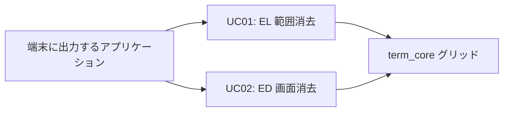
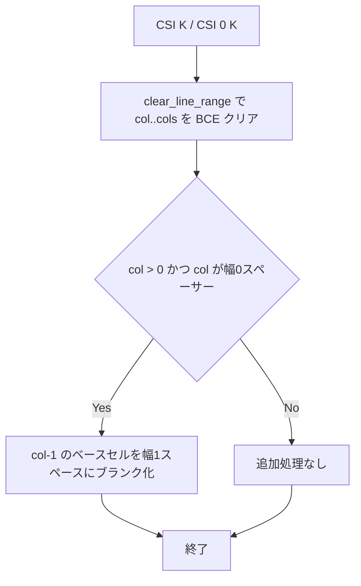

# el-ed-wide-pair-cleanup - 要件定義書

## 1. 概要

### 1.1 背景

term_core の消去パスのうち EL (CSI K) と ED (CSI J) は、`clear_line_range` による範囲消去の端に、幅2のベースセルまたは幅0のスペーサーセルを孤立させたまま残す。ECH/DCH/ICH および print パスは PR #30 (feature wide-pair-overwrite-cleanup) 以降グリッドの幅不変条件を保っているが、EL/ED だけがこの不変条件を破っている。この事象はレビュー round1 の指摘 221c2569b17a55f9 (severity: medium) として記録されている。

### 1.2 目的

term_core の消去パスに残る wide-pair 孤立セルのバグクラスを解消し、参照実装 (xterm / Alacritty / WezTerm はいずれも消去時に生き残った相方をブランクにする) の挙動に一致させる。あわせてレビュー指摘 221c2569b17a55f9 をクローズする。

### 1.3 スコープ

**対象**

- `crates/term_core/src/csi_screen.rs` の EL/ED カーソル行 `clear_line_range` 呼び出し (csi_screen.rs:14 / :25 / :49 / :53) における相方セルのブランク化
- 上記挙動に対する term_core のインライン回帰ユニットテスト

**対象外**

- partner-cleanup プリミティブの共通化 / chokepoint リファクタ
- overflow パスのテスト
- ECH/DCH/ICH/print パス (PR #30 で対応済み)

## 2. ビジネス要件

### 2.1 ビジネス目標

- term_core の消去パスに残る wide-pair 孤立セルのバグクラスを解消する。EL (CSI K) / ED (CSI J) は現在、`clear_line_range` による消去の端に幅2ベースセルまたは幅0スペーサーセルを孤立させ、PR #30 以降 ECH/DCH/ICH と print パスが保っているグリッドの幅不変条件を破っている。
- 参照実装の挙動 (xterm / Alacritty / WezTerm はいずれも消去時に生き残った相方をブランクにする) に一致させ、レビュー round1 の指摘 221c2569b17a55f9 (severity: medium) をクローズする。

### 2.2 対象ユーザー

| ユーザータイプ | 説明 |
|----------------|------|
| 該当なし | 本件はグリッドセル状態の修正であり、修正結果はセル状態の正常化としてのみ現れる。ユーザー種別による差異はない。 |

### 2.3 期待される効果

- EL/ED 消去後もグリッドの幅不変条件が保たれる
- 参照実装 (xterm / Alacritty / WezTerm) と同じ消去時挙動になる
- レビュー round1 の指摘 221c2569b17a55f9 (severity: medium) が解消される

## 3. ユースケース

### 3.1 ユースケース一覧

| ID | ユースケース名 | アクター | 優先度 |
|----|----------------|----------|--------|
| UC01 | EL によるカーソル行の範囲消去 | 端末に出力するアプリケーション | 高 |
| UC02 | ED によるカーソル行を含む画面消去 | 端末に出力するアプリケーション | 高 |

### 3.2 ユースケース詳細

#### UC01: EL によるカーソル行の範囲消去

**アクター**: 端末に EL (CSI K / CSI 0 K / CSI 1 K / CSI 2 K) を出力するアプリケーション

**事前条件**:

- カーソル行に幅2文字が描画されており、ベースセルとスペーサーセルの組が存在する

**基本フロー**:

1. アプリケーションが EL を出力する
2. term_core が対象範囲を `clear_line_range` で BCE クリアする
3. 消去範囲の端で相方が範囲外に取り残される場合、その相方セルを幅1のスペースにブランク化する (FR1 / FR2)

**代替フロー**:

- EL 2 (行全体消去) の場合、幅ペアが消去境界にまたがることはないため相方ブランク化は行わない (FR4)
- 幅ペアの両半分が消去範囲に含まれる場合、孤立セルは生じないため追加のブランク化は行わない

**事後条件**:

- 消去範囲内は従来どおり BCE セルで埋められている
- 消去範囲外に幅2ベースセル / 幅0スペーサーセルの孤立が残らない

#### UC02: ED によるカーソル行を含む画面消去

**アクター**: 端末に ED (CSI J / CSI 1 J / CSI 2 J) を出力するアプリケーション

**事前条件**:

- カーソル行に幅2文字が描画されており、ベースセルとスペーサーセルの組が存在する

**基本フロー**:

1. アプリケーションが ED 0 または ED 1 を出力する
2. term_core がカーソル行について EL 0 / EL 1 と同じ `clear_line_range` を発行する
3. カーソル行に対して FR1 / FR2 と同じ相方ブランク化が適用される
4. カーソル行以外の行は `clear_line` で行全体が消去される

**代替フロー**:

- ED 2 (画面全体消去) の場合、相方ブランク化は行わない (FR4)

**事後条件**:

- カーソル行の結果は EL 0 / EL 1 と同一
- カーソル行以外の行は全体消去され、端の追加処理は不要

**ユースケース図**:

## 4. 機能要件

### 4.1 機能一覧

| ID | 機能名 | 説明 | 優先度 |
|----|--------|------|--------|
| FR1 | EL 0 は消去範囲の左側に取り残されたベースセルをブランク化する | カーソルが幅0スペーサー (col > 0) のときに col-1 のベースセルをブランク化 | 高 |
| FR2 | EL 1 は消去範囲の右側に取り残されたスペーサーセルをブランク化する | カーソルが幅2ベースセルのときに col+1 のスペーサーセルをブランク化 | 高 |
| FR3 | ED 0 / ED 1 はカーソル行に同じ処理を適用する | ED 0/1 のカーソル行は EL 0/1 と同一の相方処理を受ける | 高 |
| FR4 | 行全体消去は相方処理の対象外のままとする | EL 2 / ED 2 および行全体 `clear_line` は挙動変更なし | 高 |
| FR5 | 相方ブランク化はセル属性を保持する | 文字内容と幅のみ変更し fg/bg/flags/hyperlink は保持 | 高 |
| FR6 | term_core に回帰ユニットテストを追加する | 実証済み3経路 + EL 2 / ED 2 no-op をインラインテスト化 | 高 |
| FR7 | 残存する対象外項目を記録する | SPEC / IMPLEMENTATION に known remaining work として記録 | 中 |

### 4.2 機能詳細

#### FR1: EL 0 は消去範囲の左側に取り残されたベースセルをブランク化する

**説明**: CSI K / CSI 0 K の実行時にカーソルが col > 0 の幅0スペーサーセル上にある場合、`[col, cols)` の範囲を BCE クリアした後、col-1 の幅2ベースセルを wide-pair 相方処理 (`blank_wide_pair_split` のセマンティクス: 文字内容と幅のみ変更し、fg/bg/flags/hyperlink は保持) により幅1のスペースへブランク化する。

**根拠**: `crates/term_core/src/csi_screen.rs:49` は現在 `clear_line_range` を相方処理なしで呼び出している。必要な判定条件は ECH の `start_is_spacer` (csi_screen.rs:79, 84-88) と同一。

**処理フロー**:

**ビジネスルール**:

- 消去範囲内のセルは従来どおり BCE セルを受け取る
- 相方セルは文字内容と幅のみ変更する

#### FR2: EL 1 は消去範囲の右側に取り残されたスペーサーセルをブランク化する

**説明**: CSI 1 K の実行時にカーソルが幅2ベースセル上にある場合、`[0, col+1)` の範囲を BCE クリアした後、col+1 の幅0スペーサーセルを属性保持のまま幅1のスペースへブランク化する。

**根拠**: `crates/term_core/src/csi_screen.rs:53`。必要な判定条件は ECH の `last_is_base` (csi_screen.rs:80, 89-93、end = col+1) と同一。

#### FR3: ED 0 / ED 1 はカーソル行に同じ処理を適用する

**説明**: CSI J (ED 0) と CSI 1 J (ED 1) は、それぞれ EL 0 / EL 1 と同じカーソル行 `clear_line_range` 呼び出しを行い (`crates/term_core/src/csi_screen.rs:14` および `:25`)、FR1 / FR2 と同じ相方処理を受ける。カーソル行以外の行は `clear_line` により行全体が消去されるため、端の処理は不要である。

#### FR4: 行全体消去は相方処理の対象外のままとする

**説明**: EL 2 (csi_screen.rs:57) と ED 2 (csi_screen.rs:30-32)、および ED 0/1 内部の行全体 `clear_line` 呼び出しは行全体を消去するため、相方処理を行わない。幅ペアが行全体消去の境界にまたがることはない。これらの経路に挙動変更はない。

#### FR5: 相方ブランク化はセル属性を保持する

**説明**: 消去範囲外でブランク化される相方セルは自身の fg/bg/flags/hyperlink を保持し、変更されるのは文字内容と幅のみである (`blank_wide_pair_split` の文書化された契約: `crates/term_core/src/csi_edit.rs:155-179`)。消去範囲内のセルは従来どおり BCE セルを受け取る。

#### FR6: term_core に回帰ユニットテストを追加する

**説明**: 実証済みの3つの失敗経路 (スペーサー上カーソルの EL 0、ベース上カーソルの EL 1、ED 0/1 のカーソル行相当) に加え、EL 2 / ED 2 の no-op を `crates/term_core` のインライン `#[cfg(test)]` ユニットテストとして追加し、回帰を防ぐ。テスト名はクレートの命名規約 `<subject>_<scenario>_<expected>` に従う。

#### FR7: 残存する対象外項目を記録する

**説明**: 意図的に対象外とした項目 (partner-cleanup プリミティブの共通化 / chokepoint リファクタ、overflow パスのテスト、PR #30 で対応済みの ECH/DCH/ICH/print) を、該当が残る範囲で SPEC / IMPLEMENTATION に known remaining work として記録する。

## 5. 非機能要件

| ID | 内容 |
|----|------|
| NFR1 | `crates/term_core` に新規依存を追加しない (現在の依存は serde / bincode / log / unicode-width のみ)。 |
| NFR2 | 消去範囲内の消去セマンティクスを変更しない。BCE 埋め、overflow クリア、dirty 行マークは従来どおりで、境界の相方セルにのみブランク化処理が加わる。 |
| NFR3 | 消去ホットパスへの性能影響は無視できる範囲とする。EL/ED のカーソル行呼び出しごとに最大で幅参照2回と条件付き単一セル書き込み2回 (ECH が既に払っているコストと同一プロファイル)。 |
| NFR4 | 範囲外の境界カラム (左端の col 0、右端の cols) が安全であること。`blank_wide_pair_split` は範囲外カラムおよびスペーサー/ベースのいずれでもないセルに対して no-op である。 |

### 5.1 パフォーマンス要件

- NFR3 のとおり、EL/ED カーソル行呼び出しあたり最大で幅参照2回・条件付き単一セル書き込み2回

### 5.2 セキュリティ要件

- 該当なし (グリッドセル状態のみを扱う term_core 内部の挙動修正)

### 5.3 可用性要件

- 該当なし

### 5.4 保守性要件

- NFR1 のとおり `crates/term_core` に新規依存を追加しない
- FR6 のとおり回帰ユニットテストをインラインで追加する

### 5.5 互換性要件

- NFR2 のとおり消去範囲内のセマンティクスは不変
- NFR4 のとおり範囲外の境界カラムでも安全

## 6. UI/UX要件

### 6.1 画面設計要件

該当なし。本件は term_core のエスケープシーケンス消去パス内部の挙動修正であり、UI 面・視覚出力・新規コンポーネント / テーマの作業は伴わない。変更はグリッドセル状態の正常化としてのみ現れる (design step は skipped)。

### 6.2 画面遷移

該当なし。

### 6.3 レスポンシブ対応

該当なし。

## 7. データ要件

### 7.1 データモデル概要

対象はグリッドのセル状態 (文字内容・幅・fg/bg/flags/hyperlink) のみ。永続データの追加・変更はない。

### 7.2 データ項目

| エンティティ | 項目名 | 型 | 必須 | 説明 |
|--------------|--------|-----|------|------|
| グリッドセル | 文字内容 | - | ○ | 相方ブランク化で幅1のスペースに変更される |
| グリッドセル | 幅 | - | ○ | 相方ブランク化で幅1に変更される |
| グリッドセル | fg / bg / flags / hyperlink | - | ○ | 相方ブランク化では保持される (FR5) |

### 7.3 データ保持期間

該当なし。

## 8. 外部連携

### 8.1 連携システム

該当なし (NFR1: 新規依存の追加なし)。

### 8.2 API仕様要件

該当なし。

## 9. 制約条件

### 9.1 技術的制約

- `crates/term_core` に新規依存を追加しない (NFR1)
- 消去範囲内の消去セマンティクス (BCE 埋め、overflow クリア、dirty 行マーク) を変更しない (NFR2)
- 範囲外の境界カラムで安全に動作すること (NFR4)

### 9.2 ビジネス上の制約

- 対象外項目 (partner-cleanup プリミティブの共通化 / chokepoint リファクタ、overflow パスのテスト、ECH/DCH/ICH/print) はスコープ外として維持する (FR7)

### 9.3 スケジュール制約

- 該当なし

## 10. 想定される課題とリスク

### 10.1 技術的課題

| 課題 | 影響度 | 対応策 |
|------|--------|--------|
| 実装方式が2案ある: (a) ECH のローカル事前キャプチャ方式を EL/ED の4つのカーソル行呼び出し箇所に複製する / (b) 相方処理を `clear_line_range` に取り込み行全体消去を例外扱いする | 中 | 方式選択は plan ステップに委ねる。いずれも受け入れ基準を満たす。(b) を選ぶ場合は「相方処理は ED/EL と共有されるため `clear_line_range` 自体には決して取り込まない」と明示している既存コメント (`crates/term_core/src/csi_screen.rs:74-78`) の更新が必要。(a) を選ぶ場合は同コメントの "out of scope" 節の更新のみでよい |

### 10.2 ビジネスリスク

| リスク | 発生確率 | 影響度 | 対応策 |
|--------|----------|--------|--------|
| 該当なし | - | - | - |

## 11. 成功基準

### 11.1 受け入れ基準

- [ ] AC1: カーソルが幅0スペーサー上にあるとき、ESC[K (EL 0) が col-1 の幅2ベースセルを幅1のスペースにブランク化する (FR1)
- [ ] AC2: カーソルが幅2ベースセル上にあるとき、ESC[1K (EL 1) が col+1 の幅0スペーサーセルを幅1のスペースにブランク化する (FR2)
- [ ] AC3: ESC[J と ESC[1J (ED 0/1) がカーソル行に同じルールを適用する (FR3)
- [ ] AC4: 行全体消去 (EL 2 / ED 2) は端の相方処理について no-op であり、挙動変更がない (FR4)
- [ ] AC5: 上記の再現経路が term_core のユニットテストとして存在しパスする (FR6)。term_core の `--lib` スイート全体がパスする
- [ ] AC6: 残存する対象外項目が SPEC / IMPLEMENTATION に known remaining work として記録されている (FR7)

### 11.2 KPI

| 指標 | 目標値 | 測定方法 |
|------|--------|----------|
| 該当なし | - | - |

## 12. テストシナリオ

### 12.1 テスト観点

- [ ] 正常系 (TS-1): 幅2文字をベースが col-1、スペーサーが col になるよう描画し、カーソルをスペーサーへ移動して ESC[K を送る。col-1 のベースセルが元の属性を保った幅1のスペースになり、`[col, cols)` が BCE であることを確認する
- [ ] 正常系 (TS-2): カーソルを幅2文字のベース (col、スペーサーは col+1) へ移動して ESC[1K を送る。col+1 のスペーサーが幅1のスペースになり、`[0, col+1)` が BCE であることを確認する
- [ ] 正常系 (TS-3): TS-1 / TS-2 を ESC[J (ED 0) と ESC[1J (ED 1) で繰り返し、カーソル行の結果が同一であること、および下方/上方の行が正しく全体消去されることを確認する
- [ ] 異常系 (TS-4): カーソルがベース上で ESC[K (両半分が消去範囲内) の場合に孤立が生じず追加ブランク化も発生しないこと、カーソルがスペーサー上で ESC[1K (ベースも消去範囲内) の場合も同様であることを確認する
- [ ] 境界値 (TS-5): カーソルが col 0 で ESC[K (行全体が範囲・左相方なし)、および col+1 == cols となる位置で ESC[1K (右相方の判定が範囲外) の場合、相方処理ステップが安全な no-op であることを確認する
- [ ] no-op (TS-6): 幅ペアを含む行に対する EL 2 / ED 2 が、相方処理由来の追加書き込みなしに完全に BCE クリアされた行を生成することを確認する

## 13. 用語定義

| 用語 | 定義 |
|------|------|
| EL | Erase in Line (CSI K)。csi_screen.rs の `handle_erase_in_line` (csi_screen.rs:45) が処理する |
| ED | Erase in Display (CSI J)。csi_screen.rs の `handle_erase_in_display` (csi_screen.rs:10) が処理する |
| ベースセル | 幅2文字の左半分にあたる幅2のセル |
| スペーサーセル | 幅2文字の右半分にあたる幅0のセル |
| wide pair | ベースセルとスペーサーセルの組 |
| BCE | 消去時に現在の背景色でセルを埋める挙動 (Background Color Erase) |
| `blank_wide_pair_split` | 幅ペアの片割れを幅1のスペースにブランク化するプリミティブ (`crates/term_core/src/csi_edit.rs:161`、pub(crate)) |

## 14. 確認事項

### 14.1 確認済み事項

- [x] タスク記述の行番号参照 (PR #30 head 0d3a4ff) を integration worktree の base_revision 91f3280b に対して再検証し、一致を確認した: `handle_erase_in_display` csi_screen.rs:10、`handle_erase_in_line` csi_screen.rs:45、`clear_line_range` 呼び出し箇所 csi_screen.rs:14/25/49/53、`blank_wide_pair_split` csi_edit.rs:161 (pub(crate)、同一クレートのため csi_screen.rs から直接呼び出し可能で、既に呼び出している)
- [x] PR #30 (wide-pair-overwrite-cleanup) は既に integration base にマージ済みであり、ECH/DCH/ICH と print パスに変更は不要
- [x] 既存の EL/ED テスト (csi_screen.rs の tests モジュール、例: `test_handle_erase_in_line_to_end`) は幅1コンテンツに対する BCE 埋め挙動のみを検証しており、変更なしでパスし続ける想定である
- [x] design ステップは skipped: term_core Rust クレートのエスケープシーケンス消去パス内部における純粋な挙動バグ修正であり、UI 面・視覚出力・新規コンポーネント / テーマ作業がないため、design ステップが規定すべき対象がない

### 14.2 未確認・保留事項

- [ ] 実装方式 — (a) ECH のローカル事前キャプチャ方式を EL/ED の4つのカーソル行呼び出し箇所に複製する / (b) 相方処理を `clear_line_range` に取り込み行全体消去を例外扱いする — は plan ステップに委ねる。いずれも受け入れ基準を満たす。(b) を選ぶ場合は csi_screen.rs:74-78 の既存コメント (相方処理は ED/EL と共有されるため `clear_line_range` 自体には決して取り込まない、と明記) の更新が必要。(a) を選ぶ場合は同コメントの "out of scope" 節の更新のみでよい

## 15. 参考資料

- `crates/term_core/src/csi_screen.rs`: `handle_erase_in_display` (:10)、`handle_erase_in_line` (:45)、`clear_line_range` 呼び出し (:14 / :25 / :49 / :53)、ECH の相方判定 (:79-93)、対象範囲に関するコメント (:74-78)
- `crates/term_core/src/csi_edit.rs`: `blank_wide_pair_split` (:155-179、定義 :161)
- PR #30 (feature wide-pair-overwrite-cleanup): ECH/DCH/ICH および print パスの wide-pair 相方処理
- レビュー round1 指摘 221c2569b17a55f9 (severity: medium)
- 参照実装の挙動: xterm / Alacritty / WezTerm
