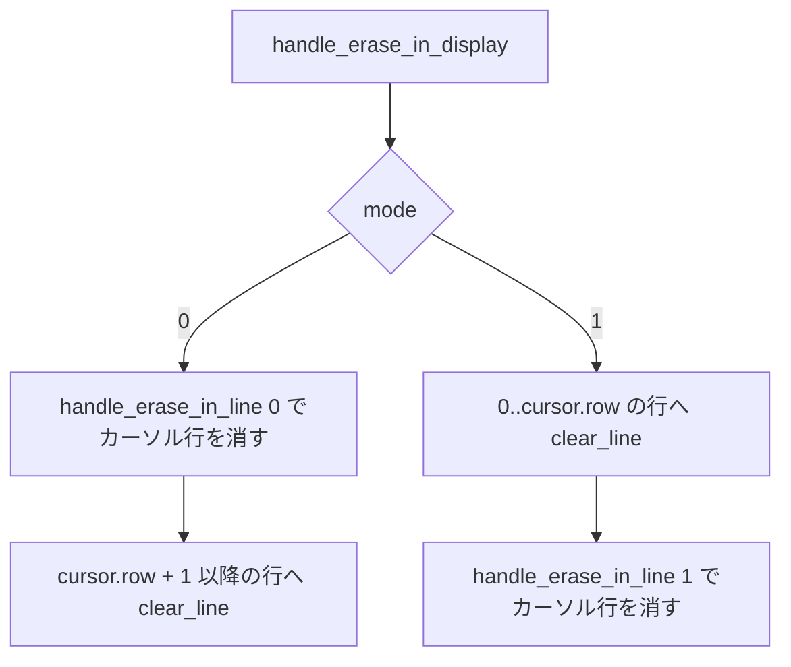

# erase-edge-repair-dead-sides - 要件定義書

## 1. 概要

### 1.1 背景
term_core の範囲消去（ECH / EL 0 / EL 1 / ED 0 / ED 1）の 5 つのサイトは、private なチョークポイント `erase_range_with_edge_repair` にまとめられていて、端の修復には `terminal_cells.rs` の `blank_wide_pair_half` を使っている。このコードには、次の 2 つの課題が残っている。

- 構造的に発火しない側の捕捉と修復
- ED 0 / ED 1 のカーソル行処理の重複

### 1.2 目的
- 相方掃除で、構造的に発火しない側の捕捉と修復を取り除く
- ED 0 / ED 1 のカーソル行処理を EL 0 / EL 1 へ委譲し、相方掃除の重複を減らす
- EL / ED / ECH の外から見える振る舞いは変えない

### 1.3 スコープ

**対象**:
- `crates/term_core/src/csi_screen.rs` の本体（テスト以外）
- `crates/term_core/src/terminal_cells.rs` の `blank_wide_pair_half` のドキュメントコメント

**対象外**:
- `clear_line_range` 自体へ相方掃除を畳み込むこと（別名のラッパーを作るのは可）
- overflow 経路のテスト追加
- ICH / DCH（`csi_edit.rs`）の相方掃除
- テストのコメントに残る古い名前 `blank_wide_pair_split` の修正

## 2. ビジネス要件

### 2.1 ビジネス目標
- term_core の範囲消去（ECH / EL 0 / EL 1 / ED 0 / ED 1）の相方掃除で、構造的に発火しない側の捕捉と修復を取り除く
- ED 0 / ED 1 のカーソル行処理を EL 0 / EL 1 へ委譲し、相方掃除の重複を減らす
- EL / ED / ECH の外から見える振る舞いは変えない

### 2.2 対象ユーザー
該当なし（term_core 内部の消去処理の整理で、外から見える振る舞いは変えない）。

### 2.3 期待される効果
- 範囲消去の各経路が、実際に発火しうる側だけを捕捉・修復する
- 捕捉 → `clear_line_range` → 修復の流れが `csi_screen.rs` に 1 回だけ書かれる

## 3. ユースケース

該当なし（UI・画面・見た目の変更がない）。

## 4. 機能要件

### 4.1 機能一覧
| ID | 機能名 | 説明 |
|----|--------|------|
| FR1 | EL 0 / ED 0 は左端だけを修復する | 消去範囲 [cursor.col, cols) の左端だけを捕捉・修復する |
| FR2 | EL 1 / ED 1 は右端だけを修復する | 消去範囲 [0, cursor.col + 1) の右端だけを捕捉・修復する |
| FR3 | ECH は両端の修復を保つ | ECH の両端の捕捉と修復を今のまま保つ |
| FR4 | ED 0 / ED 1 のカーソル行処理を EL 0 / EL 1 へ委譲する | カーソル行を `handle_erase_in_line(0)` / `handle_erase_in_line(1)` で消す |
| FR5 | 相方掃除のロジックは csi_screen.rs の private な1か所に置く | 捕捉 → `clear_line_range` → 修復の流れを 1 回だけ書く |
| FR6 | 行全体を消す処理には相方掃除を持ち込まない | `clear_line`、EL 2、ED 2 は `clear_line` を直接使う |
| FR7 | ドキュメントコメントを実装に合わせる | チョークポイントと `blank_wide_pair_half` のドキュメントコメントを実装と一致させる |

### 4.2 機能詳細

#### FR1: EL 0 / ED 0 は左端だけを修復する

**説明**: EL 0（および委譲後の ED 0 のカーソル行）の消去範囲は [cursor.col, cols) とする。

**ビジネスルール**:
- 消去前の捕捉は左端（start のセルが幅 0 の spacer か）だけにする。
- 修復は `blank_wide_pair_half(start - 1, row)` だけとし、`start > 0` のガードを残す。
- 右端の捕捉（`get_cell_width(end - 1, row)`）と `blank_wide_pair_half(end, row)` の呼び出しは、この経路から取り除く。

#### FR2: EL 1 / ED 1 は右端だけを修復する

**説明**: EL 1（および委譲後の ED 1 のカーソル行）の消去範囲は [0, cursor.col + 1) とする。

**ビジネスルール**:
- 消去前の捕捉は右端（end - 1 のセルが幅 2 の base か）だけにする。
- 修復は `blank_wide_pair_half(end, row)` だけとする。
- 左端の捕捉（`get_cell_width(0, row)`）と左側の修復分岐は、この経路から取り除く。
- end == cols のときは、`blank_wide_pair_half` の範囲外ガードで何もしない動作をそのまま使う。

#### FR3: ECH は両端の修復を保つ

**説明**: ECH は両端の捕捉と修復を今のまま保つ。

**ビジネスルール**:
- 左端の `start > 0` ガードを保つ。
- 右端 end == cols を範囲外ガードで吸収する動作を保つ。
- 空範囲（end <= start）で `clear_line_range` だけを呼んで捕捉と修復をしない動作を保つ。

#### FR4: ED 0 / ED 1 のカーソル行処理を EL 0 / EL 1 へ委譲する

**説明**: `handle_erase_in_display` のカーソル行処理を `handle_erase_in_line` に任せる。今の処理順を保つ。

**処理フロー**:

#### FR5: 相方掃除のロジックは csi_screen.rs の private な1か所に置く

**説明**: 消去前の捕捉 → `clear_line_range` → 端の修復という流れは、`csi_screen.rs` の private な箇所に 1 回だけ書き、ECH と EL 0 / EL 1 がそこを使う。

**ビジネスルール**:
- 修復する側の選び方（引数で指定する、片側ずつヘルパーに分ける、など）は、FR1〜FR3 を満たせばどれでもよい。
- `clear_line_range` 自体は変えない。

#### FR6: 行全体を消す処理には相方掃除を持ち込まない

**説明**: `clear_line`、EL 2、ED 2 は今のまま `clear_line` を直接使い、相方掃除の経路を通らない。

#### FR7: ドキュメントコメントを実装に合わせる

**説明**:
- `csi_screen.rs` のチョークポイントのドキュメントコメントを、サイトごとに修復する側の説明に合わせて更新する。
- `terminal_cells.rs` の `blank_wide_pair_half` のドキュメントコメントにある呼び出し元の一覧（the range-erase edge-repair chokepoint）が、変更後も正しいことを保つ。

## 5. 非機能要件

### 5.1 パフォーマンス要件
該当なし。

### 5.2 セキュリティ要件
該当なし。

### 5.3 可用性要件
該当なし。

### 5.4 保守性要件
- **NFR1 振る舞いを保つ**: ECH / EL 0 / EL 1 / EL 2 / ED 0 / ED 1 / ED 2 / ED 3 のグリッド内容、セル幅、属性、dirty フラグ、戻り値は変更前と同じにする。
- **NFR2 変更範囲**: コードの変更は `crates/term_core/src/csi_screen.rs` の本体（テスト以外）に限る。ドキュメントコメントだけは `crates/term_core/src/terminal_cells.rs` も対象にする。pub API、`clear_line_range`、`blank_wide_pair_half` のシグネチャと振る舞いは変えない。
- **NFR3 既存テストは変えない**: term_core の既存ユニットテスト（`#[cfg(test)]` モジュール内のコードとコメント）は変更しない。

### 5.5 互換性要件
NFR1 のとおり、EL / ED / ECH の振る舞いを変更前と同じにする。

## 6. UI/UX要件

該当なし（UI・画面・見た目の変更がない）。

## 7. データ要件

該当なし。

## 8. 外部連携

該当なし。

## 9. 制約条件

### 9.1 技術的制約
- コードの変更は `crates/term_core/src/csi_screen.rs` の本体（テスト以外）に限る。ドキュメントコメントだけは `crates/term_core/src/terminal_cells.rs` も対象にする（NFR2）。
- pub API、`clear_line_range`、`blank_wide_pair_half` のシグネチャと振る舞いは変えない（NFR2）。
- `get_cell_width` は範囲外で 1 を返し、`blank_wide_pair_half` は範囲外で何もしない。この 2 つの性質はそのまま前提にして、変えない（A-4）。
- term_core の `#[cfg(test)]` モジュール内のコードとコメントは変更しない（NFR3）。

### 9.2 ビジネス上の制約
該当なし。

### 9.3 スケジュール制約
該当なし。

### 9.4 宣言された変更集合

このフィーチャー固有のパスは手動で列挙せず、create-plan で `workflow.yaml` の各タスクの `files` から導出する（`references/phases/create-plan-phase.md`）。

**デフォルトメンバー**（SPEC作成者が明示的に除外しない限り、常に宣言に含まれる）:
- `feature-docs/erase-edge-repair-dead-sides/**`
- `test-docs/erase-edge-repair-dead-sides/**`

`feature-docs/erase-edge-repair-dead-sides/**` に含まれるもの: `REQUIREMENTS.md`、`SPEC.md`、`IMPLEMENTATION.md`、`workflow.yaml`、`phase-state/`、`tasks/`、`reviews/roundN.yaml`、`VERIFICATION.md`、`retrospect.yaml`、およびデザインステップが生成するデザイン成果物。生成主体は各フェーズドキュメントおよび `references/phase-state.md` を参照（引用のみ、ルールは再掲しない）。

`test-docs/erase-edge-repair-dead-sides/**` に含まれるもの: `{T}.tests.yaml`（パス形式: `test-docs/erase-edge-repair-dead-sides/{T}.tests.yaml`）。生成主体は `implement-phase.md` を参照（引用のみ、ルールは再掲しない）。

**意味論**:
- デフォルトのメンバーは、SPEC作成者が明示的に除外しない限り宣言に含まれる。除外は意図的な絞り込みであり、記載漏れによる省略ではない。
- この宣言はスーパーセット（superset）の主張であり、実際の変更集合は宣言に含まれる（CONTAINED IN）必要がある。実際には生成されないパスが宣言されていても違反にはならない。implementタスクを1つも生成しないフィーチャーは `test-docs/erase-edge-repair-dead-sides/` ディレクトリを生成しないが、宣言された `test-docs/erase-edge-repair-dead-sides/**` は依然として正しい。

## 10. 想定される課題とリスク

### 10.1 技術的課題
該当なし。

### 10.2 ビジネスリスク
該当なし。

## 11. 成功基準

### 11.1 受け入れ基準
- [ ] AC-1: EL 0（および ED 0 のカーソル行）の経路で、右端の捕捉 `get_cell_width(end - 1, row)` と `blank_wide_pair_half(end, row)` が実行されない。コードを読んで確認する。（FR1）
- [ ] AC-2: EL 1（および ED 1 のカーソル行）の経路で、左端の捕捉 `get_cell_width(0, row)` と左側の修復分岐が実行されない。コードを読んで確認する。（FR2）
- [ ] AC-3: `handle_erase_in_display` の mode 0 / 1 がカーソル行を `handle_erase_in_line(0)` / `handle_erase_in_line(1)` に任せていて、捕捉 → `clear_line_range` → 修復の流れが `csi_screen.rs` に 1 回だけ書かれている。（FR4、FR5、FR3）
- [ ] AC-4: `clear_line_range`、`clear_line`、EL 2、ED 2 のコードが変わっていない。`test_erase_in_line_all_wide_pair_no_partner_cleanup` と `test_erase_in_display_all_wide_pair_no_partner_cleanup` が通る。（FR6）
- [ ] AC-5: `CARGO_TARGET_DIR=src-tauri/target cargo test --manifest-path crates/term_core/Cargo.toml --lib` が全件通る。git diff で、term_core の `#[cfg(test)]` モジュールに差分がない。（NFR1、NFR3）
- [ ] AC-6: `CARGO_TARGET_DIR=src-tauri/target cargo check --manifest-path src-tauri/Cargo.toml` と、同じコマンドに `--no-default-features` を付けたものが両方通る。（NFR2）
- [ ] AC-7: `csi_screen.rs` のチョークポイントのドキュメントコメントと、`terminal_cells.rs` の `blank_wide_pair_half` の呼び出し元一覧が、変更後の実装と一致している。（FR7）

### 11.2 KPI
該当なし。

## 12. テストシナリオ

### 12.1 テスト観点
テストは追加しない（A-3）。既存テストを変更なしで通す。

- [ ] TS-1 正常系（ECH の両端修復）: `test_erase_characters_spacer_start_blanks_left_base`、`test_erase_characters_base_at_range_end_blanks_right_spacer`、`test_erase_characters_cursor_on_spacer_of_overflow_base_blanks_left_base`、`test_handle_erase_characters_normal`、`test_handle_erase_characters_overflow_clamped`、`test_handle_erase_characters_dirty`。すべて変更なしで通る。
- [ ] TS-2 正常系・境界値（EL 0 / ED 0 の左端修復）: `test_erase_in_line_to_end_spacer_at_cursor_blanks_left_base`、`test_erase_in_display_below_spacer_at_cursor_blanks_left_base`、`test_erase_in_line_to_end_base_at_cursor_no_extra_blank`、`test_erase_in_line_to_end_cursor_at_col_zero_no_left_partner`（`start > 0` ガード）、`test_handle_erase_in_display_below`、`test_handle_erase_in_line_to_end`。すべて変更なしで通る。
- [ ] TS-3 正常系・境界値（EL 1 / ED 1 の右端修復）: `test_erase_in_line_to_start_base_at_cursor_blanks_right_spacer`、`test_erase_in_display_above_base_at_cursor_blanks_right_spacer`、`test_erase_in_line_to_start_spacer_at_cursor_no_extra_blank`、`test_erase_in_line_to_start_cursor_at_last_col_no_right_partner`（範囲外ガード）、`test_handle_erase_in_display_above`、`test_handle_erase_in_line_to_start`。すべて変更なしで通る。
- [ ] TS-4 正常系・異常系（行全体を消す処理）: `test_handle_erase_in_display_all`、`test_handle_erase_in_line_all`、`test_erase_in_line_all_wide_pair_no_partner_cleanup`、`test_erase_in_display_all_wide_pair_no_partner_cleanup`、`test_handle_erase_in_display_scrollback_returns_sentinel`、`test_handle_erase_in_display_invalid_mode`。すべて変更なしで通る。
- [ ] TS-5 全体: term_core の `--lib` テスト全件と、src-tauri の check（既定の features と `--no-default-features`）を実行する。

## 13. 用語定義

| 用語 | 定義 |
|------|------|
| 相方掃除 | 範囲消去の端で全角文字の組（幅 2 の base と幅 0 の spacer）が片側だけ残るとき、残った側を消す処理 |
| チョークポイント | 範囲消去の相方掃除をまとめた `csi_screen.rs` の private な箇所（現在は `erase_range_with_edge_repair`） |
| base | 全角文字の組のうち、幅 2 のセル |
| spacer | 全角文字の組のうち、幅 0 のセル |

## 14. 確認事項

### 14.1 確認済み事項
- [x] デザインステップ: 実施しない（term_core 内部の消去処理を整理するだけで、UI・画面・見た目の変更がない）

### 14.2 未確認・保留事項
なし（`status: tbd` の要件はない）。

### 14.3 前提
- A-1: タスク説明の「5 箇所コピペされたブロック」と `blank_wide_pair_split` は以前の状態を指している。今のコードでは、5 つのサイトが private なチョークポイント `erase_range_with_edge_repair` にまとめられていて、部品は `terminal_cells.rs` の `blank_wide_pair_half` になっている。今回の作業は今のコードを対象にする。残っている課題は、構造的に発火しない側の捕捉と修復、および ED 0 / ED 1 のカーソル行処理の重複の 2 つ。
- A-2: 受け入れ条件の「既存テストが無変更で通る」は、`#[cfg(test)]` モジュール内のコードとコメントを編集しないという意味に取る。テストのコメントに残っている古い名前 `blank_wide_pair_split`（`csi_screen.rs` 812 行目、`csi_edit.rs` 594 行目）も直さない。
- A-3: テストは追加しない。EL / ED / ECH の相方掃除の振る舞いは既存テスト（TS-1〜TS-4）で固定されている。overflow 経路のテスト追加はスコープ外。
- A-4: `get_cell_width` は範囲外で 1 を返し、`blank_wide_pair_half` は範囲外で何もしない（`terminal_cells.rs`）。この 2 つの性質はそのまま前提にして、変えない。
- A-5: 修復する側の選び方（引数で側を指定するヘルパー 1 本か、片側ずつのヘルパー 2 本か）は計画フェーズで決める。FR1〜FR5 と NFR2 を満たせばどれでもよい。

## 15. 参考資料

- `crates/term_core/src/csi_screen.rs`
- `crates/term_core/src/terminal_cells.rs`
