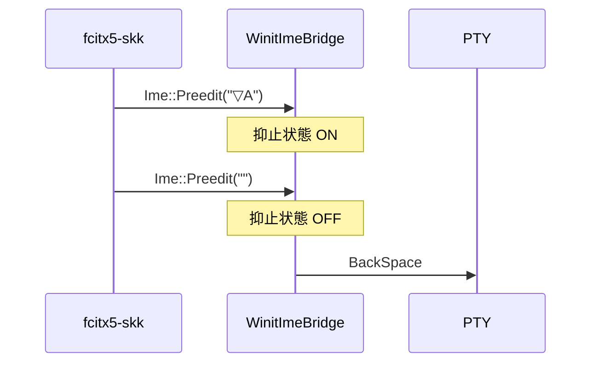
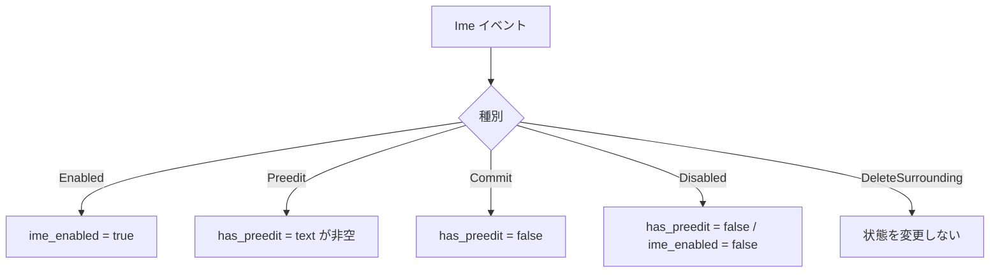

# 空プリエディット後のキー入力素通し - 要件定義書

## 1. 概要

### 1.1 背景

Wayland native 化以降、SKK（fcitx5-skk）の変換モード（▽）で入力した文字を
BackSpace で全消しすると、以降のキー入力が eMterm に握り潰されて PTY に届かなく
なる。`WinitImeBridge` が空プリエディットを受け取っても `im_composing` を true の
まま保持し、`dispatch_key_event` が無条件に `KeyDispatchResult::Consumed` を返す
ため。

XWayland（X11 バックエンド）で動作していた頃は fcitx5 がプリエディットを自前の
ポップアップに描画しており、`Ime::Preedit` が eMterm に届いていなかったため本症状は
発生しなかった。

### 1.2 目的

IME のプリエディットが空になった時点でキー入力が PTY に到達するようにし、かつ
Windows IMM32 の「コンポジション中でプリエディットが空」という正当な状態では
従来どおりキーを抑止する。

### 1.3 スコープ

- 対象: `src-tauri/src/ime/winit_bridge.rs` の `WinitImeBridge` 状態機械と
  `dispatch_key_event` のゲート条件、および同ファイルの回帰テスト
- 対象外: `Ime::DeleteSurrounding` の実装（現状の no-op を維持）、
  `src-tauri/src/ime/` 配下の他モジュール、`window_host.rs` の呼び出し側

## 2. ビジネス要件

### 2.1 ビジネス目標

日本語入力を常用するユーザーが eMterm でキー入力不能状態に陥らないこと。

### 2.2 対象ユーザー

| ユーザータイプ | 説明 |
|----------------|------|
| Linux / Wayland で IME を使うユーザー | fcitx5-skk などのインライン プリエディット表示 IM 利用者 |
| Windows で IMM32 系 IME を使うユーザー | 候補ウィンドウ主体でプリエディットが空になり得る IM 利用者 |

### 2.3 期待される効果

- 変換バッファを空にした後もキー入力が PTY に届く
- Windows のコンポジション中のキー抑止が維持される

## 3. ユースケース

### 3.1 ユースケース一覧

| ID | ユースケース名 | アクター | 優先度 |
|----|----------------|----------|--------|
| UC01 | SKK 変換モードを全消しした後にキー入力する | Wayland ユーザー | 高 |
| UC02 | 通常のかな漢字変換を全消しした後にキー入力する | Wayland ユーザー | 高 |
| UC03 | Windows IME のコンポジション中に方向キーを押す | Windows ユーザー | 中 |

### 3.2 ユースケース詳細

#### UC01: SKK 変換モードを全消しした後にキー入力する

**アクター**: Wayland native 環境で fcitx5-skk を使うユーザー

**事前条件**:
- eMterm が Wayland native で起動している
- SKK が有効

**基本フロー**:
1. 直接入力モードで `ABC` と入力する
2. Shift+文字 で SKK の変換モード（▽）に入る
3. BackSpace で変換モードの文字を全て消す（プリエディットが空になる）
4. BackSpace を押す
5. `C` が削除される

**代替フロー**:
- 手順 3 の後に文字キーを押した場合も、その文字が PTY に届く

**事後条件**:
- `im_composing` に相当する状態が false になっている

**イベント列**:

#### UC03: Windows IME のコンポジション中に方向キーを押す

**アクター**: Windows で IMM32 系 IME を使うユーザー

**事前条件**:
- `WM_IME_STARTCOMPOSITION` 相当の `Ime::Enabled` を受信済み
- プリエディットが空（候補ウィンドウのみ表示）

**基本フロー**:
1. コンポジションを開始する
2. プリエディットが空のまま候補ウィンドウが表示される
3. 方向キーを押す
4. eMterm はキーを PTY に送らない（IM が処理する）

**事後条件**:
- `Ime::Disabled`（`WM_IME_ENDCOMPOSITION`）受信後はキーが PTY に届く

## 4. 機能要件

### 4.1 機能一覧

| ID | 機能名 | 説明 | 優先度 |
|----|--------|------|--------|
| F01 | 二層状態モデル | プリエディット非空フラグと IME ライフサイクルフラグを分離して保持する | 高 |
| F02 | プラットフォーム別ゲート | Unix はプリエディット非空、Windows はライフサイクルでキー抑止を判定する | 高 |
| F03 | 回帰テスト | 空プリエディット遷移を含むイベント列のテストを追加する | 高 |

### 4.2 機能詳細

#### F01: 二層状態モデル

**説明**: `WinitImeBridge` の単一 `im_composing` フラグを 2 つの状態に分割する。

- `has_preedit`: 直近に観測したプリエディットが非空か
- `ime_enabled`: IME ライフサイクルが開始済みか

**入力**:
- `Ime::Enabled` / `Ime::Preedit(text, _)` / `Ime::Commit(text)` /
  `Ime::Disabled` / `Ime::DeleteSurrounding`

**出力**:
- 内部状態 `has_preedit: bool`、`ime_enabled: bool`

**処理フロー**:

**ビジネスルール**:
- `Ime::Commit` は `ime_enabled` を変更しない
- `Ime::Enabled` は `has_preedit` を変更しない
- `ImeEvent` キューへの積み方は現行のまま変更しない

#### F02: プラットフォーム別ゲート

**説明**: `dispatch_key_event` の `Consumed` 判定に使う状態をプラットフォームで
切り替える。

| プラットフォーム | ゲート条件 | 根拠 |
|------------------|------------|------|
| Windows | `ime_enabled` | winit-win32 は `Ime::Enabled` を `WM_IME_STARTCOMPOSITION`、`Ime::Disabled` を `WM_IME_ENDCOMPOSITION` に対応させており、コンポジションの生存期間そのもの |
| Windows 以外 | `has_preedit` | winit-wayland は `Ime::Enabled` を `zwp_text_input_v3` の Enter（フォーカス期間全体）で送るためゲートに使えない。winit-x11 は XIC 生成時に送る |

**エラーケース**:
| エラー | 条件 | 対応 |
|--------|------|------|
| キー握り潰し継続 | プリエディットが空になっても抑止が解けない | F01 の `has_preedit` 更新で解消 |

## 5. 非機能要件

### 5.1 パフォーマンス要件

- 追加する状態は bool 2 つ。キー入力パスの計算量は現行と同じ

### 5.2 セキュリティ要件

- 対象外（外部入力の解釈範囲を広げない）

### 5.4 保守性要件

- 現行の誤った前提を述べたコメント（「Wayland zwp_text_input_v3 はカーソルのみの
  更新でも空 preedit を送る」）を、確認済みの事実に基づく記述へ置き換える
- プラットフォーム別ゲートの根拠をコード上のコメントに残す

### 5.5 互換性要件

- Linux（Wayland / X11）と Windows の両方でビルドが通ること
- `--no-default-features`（CLI ビルド）に影響しないこと

## 6. UI/UX要件

プリエディットのオーバーレイ表示の挙動は変更しない。空プリエディットを
`ImeEvent::Preedit(String::new())` としてキューに積む現行動作を維持する。

## 9. 制約条件

### 9.1 技術的制約

- winit は `=0.31.0-beta.2` に固定されている
- Windows 実機での動作確認はこのワークフローでは実施できない
- `RawKeyEvent` は物理キーコードと修飾キーのみを持ち、論理キー種別
  （BackSpace / Enter / 矢印）を判別できない

## 10. 想定される課題とリスク

### 10.1 技術的課題

| 課題 | 影響度 | 対応策 |
|------|--------|--------|
| Windows のゲート変更を実機検証できない | 中 | winit-win32 のソース上のマッピングを根拠として記録し、手動検証項目として VERIFICATION.md に残す |
| X11 で `ImeEvent::Start` の空プリエディットが抑止を一瞬解除する | 低 | winit-x11 はコンポジション中に `WindowEvent::KeyboardInput` を発行しないため、アプリから見えるキーイベントの隙間は存在しない |

## 11. 成功基準

### 11.1 受け入れ基準

- [ ] 非空プリエディットの後に空プリエディットを受けると、次のキーが Passthrough になる
- [ ] Windows では `Ime::Enabled` から `Ime::Disabled` までの間、プリエディットが
      空でもキーが Consumed になる
- [ ] Windows 以外では `Ime::Enabled` 単独でキーが Consumed にならない
- [ ] 既存の TS-winit-1〜7 が全て通る
- [ ] `cargo test` と `cargo check --no-default-features` が通る

## 12. テストシナリオ

### 12.1 テスト観点

- [ ] 正常系: `Preedit(非空)` → `Preedit("")` → Passthrough
- [ ] 正常系: `Preedit(非空)` → `Preedit("")` → `Preedit(非空)` → Consumed
- [ ] 正常系: `Preedit(非空)` → `Preedit("")` → `Commit` → Passthrough
- [ ] 境界値: `Enabled` 単独（Windows 以外）→ Passthrough
- [ ] 境界値: `Enabled` → `Preedit("")`（Windows）→ Consumed
- [ ] 境界値: `Enabled` → `Preedit("")` → `Disabled`（Windows）→ Passthrough
- [ ] 異常系: `DeleteSurrounding` が状態を変えない

## 13. 用語定義

| 用語 | 定義 |
|------|------|
| プリエディット | 変換確定前の未確定文字列 |
| コンポジション | IM が未確定文字列を編集している状態 |
| ▽モード | SKK の変換対象文字列を入力している状態 |
| 抑止 | `dispatch_key_event` が `Consumed` を返し、キーを PTY に送らないこと |

## 14. 確認事項

### 14.1 確認済み事項

- [x] 真因: `WinitImeBridge` が空プリエディットで `im_composing` を落とさない
- [x] XWayland で発生しなかった理由: X11 では `Ime::Preedit` が eMterm に届いて
      いなかった
- [x] winit-wayland の空プリエディットはクリア意図のみ（カーソルのみの更新では
      非空のまま送られる）
- [x] winit-win32 の `Ime::Enabled` / `Ime::Disabled` は
      `WM_IME_STARTCOMPOSITION` / `WM_IME_ENDCOMPOSITION` に対応する
- [x] winit-wayland の `Ime::Enabled` は `TextInputEvent::Enter`（フォーカス
      期間全体）で送られるため、キー抑止のゲートに使えない
- [x] winit-x11 はコンポジション中に `WindowEvent::KeyboardInput` を発行しない
- [x] 修正方針: 二層状態モデル + プラットフォーム別ゲート
- [x] `Ime::DeleteSurrounding` は本件と無関係（winit の定義上プリエディットに
      影響しない）ため no-op のまま

### 14.2 未確認・保留事項

- [ ] Windows 実機での UC03 の動作確認（手動検証項目として残す）

## 15. 参考資料

- 議論レポート: `tmp/discussion-skk-empty-preedit-key-swallow.md`
- winit-wayland 0.31.0-beta.2: `src/seat/text_input/mod.rs`
- winit-x11 0.31.0-beta.2: `src/event_processor.rs`, `src/ime/mod.rs`
- winit-win32 0.31.0-beta.2: `src/event_loop.rs`, `src/ime.rs`
