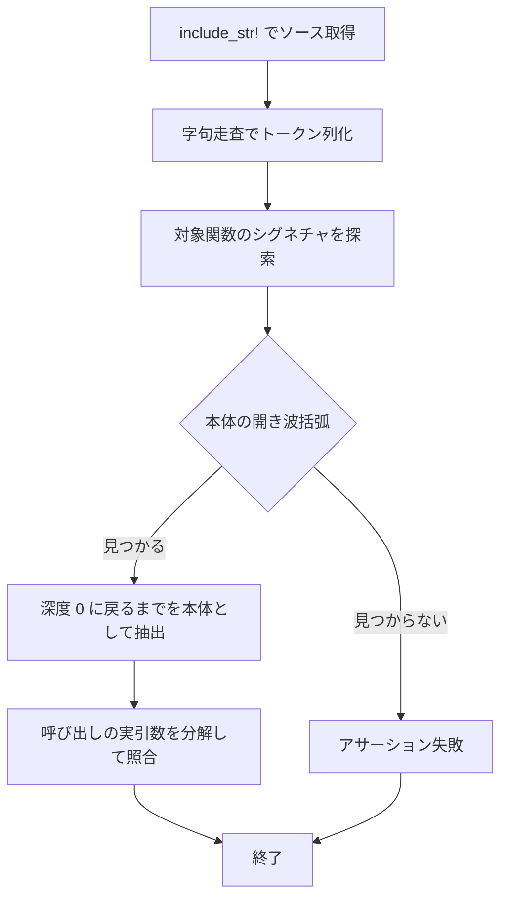

# mouse-report-held-callsite-test - 要件定義書

## 1. 概要

### 1.1 背景

前 feature `mouse-drag-latch-regression` の AC-3 は、ボタン経路とホイール経路の呼び出し側が
ライブな held ボタン値を held 対応の apply エントリポイントに渡すことを固定する意図だったが、
その半分が未達のまま残った。原因は既存の構造テストのニードルにある。
`tests.rs:1806-1822` の `delegate` ループは全ファイルに対する
`src.contains("mouse_report::apply_outcome_with_held(")` であり、
モーション経路（`handle_pointer_moved`、`pointer_routing.rs:293-298`）の呼び出し 1 箇所だけで
充足されてしまう（A2）。そのためボタン経路・ホイール経路の呼び出し側が既定値化されても赤にならない。

記録済みの変異プローブ W / B はいずれも呼び出し先（callee）を変異させたものであり、
呼び出し側は一度も変異させていない（A3）。
また前 feature の AC-3 はホイール経路を `mouse_report.rs:1235` と名指しており、
これは呼び出し先を指す表現になっていた（A4）。

前 feature の修正試行 964be64d は自身の NFR5 とタスクスコープに違反したため 8ddefa0c で revert
された（A7）。本 feature はその衝突を、NFR5 に範囲限定の明示的例外を置くことで解消する。

### 1.2 目的

- ボタン経路（`run_button_decision`）とホイール経路（`handle_mouse_wheel`）の呼び出し側が、
  ライブな held ボタン値を held 対応の apply エントリポイントに渡さなくなったときに、
  必ず赤になるテストを置く。
- 既存の構造テストの全ファイル走査ニードルによる検出漏れを解消する。
- プロダクションのマウスレポート挙動を一切変更せずに達成する（前 feature の FR4 を継承）。

### 1.3 スコープ

対象は `src-tauri/src/window_host/tests.rs` へのテスト追加のみ。
`pointer_routing.rs` / `mouse_report.rs` / `event_loop.rs` のプロダクションコードは
ベースリビジョンのまま据え置き、既存テストの改変も行わない（FR4 / FR8）。

## 2. ビジネス要件

### 2.1 ビジネス目標

- mouse-drag-latch-regression の AC-3 のうち未達だった半分を閉じる: ボタン経路
  (`run_button_decision`) とホイール経路 (`handle_mouse_wheel`) の呼び出し側が、ライブな held
  ボタン値を held 対応の apply エントリポイントに渡さなくなったときに、必ず赤になるテストを置く。
- 既存の構造テストの全ファイル走査ニードル `src.contains("mouse_report::apply_outcome_with_held(")`
  が、モーション経路の呼び出し側 1 箇所だけで充足されてしまう検出漏れを解消する。
- プロダクションのマウスレポート挙動を一切変更せずに達成する（前 feature の FR4 を継承）。

### 2.2 対象ユーザー

| ユーザータイプ | 説明 |
|----------------|------|
| eMterm の開発者 | `window_host` のポインタ経路を変更する際に、held 値の受け渡しが壊れたことを CI で検出できる |

### 2.3 期待される効果

- ボタン経路・ホイール経路の held 引数の受け渡しが既定値化・削除・旧ラッパへの差し戻しで
  壊れたとき、テストが赤になる。
- 検出範囲がモーション経路 1 箇所に偏っていた既存ニードルの盲点が閉じる。

## 3. ユースケース

### 3.1 ユースケース一覧

| ID | ユースケース名 | アクター | 優先度 |
|----|----------------|----------|--------|
| UC01 | 呼び出し側の held 受け渡し破壊を検出する | eMterm の開発者 | 高 |

### 3.2 ユースケース詳細

#### UC01: 呼び出し側の held 受け渡し破壊を検出する

**アクター**: eMterm の開発者

**事前条件**:
- 両プロダクション呼び出し側が現時点で正しい（A1）。`pointer_routing.rs:850` が
  `mouse_report::apply_outcome_with_held(outcome, &mut records, &mut dest, host.mouse_report_held);`、
  `pointer_routing.rs:1129-1135` が
  `mouse_report::apply_wheel_report_step(outcome, &mut records, &mut dest, lines, host.mouse_report_held)`。

**基本フロー**:
1. 開発者が `pointer_routing.rs` のポインタ経路を変更する。
2. `CARGO_TARGET_DIR=src-tauri/target cargo test --manifest-path src-tauri/Cargo.toml --lib` を実行する。
3. 呼び出し側の held 受け渡しが保たれていればテストは緑のままになる。

**代替フロー**:
- 第 4 / 第 5 実引数が `HeldButtons::default()` に置き換わる、削除される、または呼び出しが
  `mouse_report::apply_outcome(` に差し戻ると、テストが赤になる。

**事後条件**:
- 呼び出し側の held 受け渡しが固定された状態が維持される。

## 4. 機能要件

### 4.1 機能一覧

| ID | 機能名 | 説明 | 優先度 |
|----|--------|------|--------|
| FR1 | ボタン経路の呼び出し側固定 | `run_button_decision` の held 実引数を固定する | 高 |
| FR2 | ホイール経路の呼び出し側固定 | `handle_mouse_wheel` の held 実引数を固定する | 高 |
| FR3 | held 非対応エントリポイントへの差し戻し禁止 | 対象 2 本体からの `apply_outcome(` 呼び出しを禁止する | 高 |
| FR4 | プロダクション挙動を変更しない | 変更集合を `tests.rs` の追加のみに閉じる | 高 |
| FR5 | 固定メカニズム = トークン単位の source-scan と波括弧深度による本体抽出 | 対象本体の抽出方式を定める | 高 |
| FR6 | 字句走査器の要件と自己検証 | コメント・文字列リテラルの扱いと走査器自身の検証 | 高 |
| FR7 | 良性編集への耐性と変異感度 | 良性編集で緑、変異で赤 | 高 |
| FR8 | 既存テストの無改変維持 | 既存の構造テスト・シームレベルテストを無改変で維持する | 高 |

### 4.2 機能詳細

#### FR1: ボタン経路の呼び出し側固定

**説明**: `src-tauri/src/window_host/pointer_routing.rs` のトップレベル関数
`run_button_decision` の本体が `mouse_report::apply_outcome_with_held(` を実引数 4 個で呼び、
その第 4 実引数が `[<host 引数の識別子>, `.`, `mouse_report_held`]` の 3 トークンと完全一致する
ことを固定するテストが存在する。この受け渡しが `HeldButtons::default()` などの既定値に
置き換わる、または削除されて実引数が 3 個になった場合に赤になる。

**入力**:
- `include_str!("pointer_routing.rs")`: `&'static str` - コンパイル時に埋め込んだソーステキスト

**出力**:
- テスト結果: 緑 / 赤 - 第 4 実引数が 3 トークン列と一致するかどうか

**ビジネスルール**:
- `host` 相当の識別子はハードコードせず、抽出した関数の実際の引数名から取得する（NFR8）。

**バリデーション**:
| 項目 | ルール | エラーメッセージ |
|------|--------|------------------|
| 実引数の個数 | `mouse_report::apply_outcome_with_held(` の実引数が 4 個 | テストのアサーション失敗として報告される |
| 第 4 実引数 | `[host 引数名, `.`, `mouse_report_held`]` の 3 トークンと完全一致 | テストのアサーション失敗として報告される |

**エラーケース**:
| エラー | 条件 | 対応 |
|--------|------|------|
| 既定値化 | 第 4 実引数が `HeldButtons::default()` | テストが赤になる |
| 引数削除 | 実引数が 3 個 | テストが赤になる |

#### FR2: ホイール経路の呼び出し側固定

**説明**: 同ファイルのトップレベル関数 `handle_mouse_wheel` の本体が
`mouse_report::apply_wheel_report_step(` を実引数 5 個で呼び、その第 5 実引数が FR1 と同じ
3 トークン列と完全一致することを固定するテストが存在する。既定値化・引数削除のいずれでも赤になる。

**入力**:
- `include_str!("pointer_routing.rs")`: `&'static str` - コンパイル時に埋め込んだソーステキスト

**出力**:
- テスト結果: 緑 / 赤 - 第 5 実引数が 3 トークン列と一致するかどうか

**ビジネスルール**:
- FR1 と同一の 3 トークン列を用いる。

**バリデーション**:
| 項目 | ルール | エラーメッセージ |
|------|--------|------------------|
| 実引数の個数 | `mouse_report::apply_wheel_report_step(` の実引数が 5 個 | テストのアサーション失敗として報告される |
| 第 5 実引数 | FR1 と同じ 3 トークン列と完全一致 | テストのアサーション失敗として報告される |

**エラーケース**:
| エラー | 条件 | 対応 |
|--------|------|------|
| 既定値化 | 第 5 実引数が `HeldButtons::default()` | テストが赤になる |
| 引数削除 | 実引数が 4 個 | テストが赤になる |

#### FR3: held 非対応エントリポイントへの差し戻し禁止

**説明**: `run_button_decision` と `handle_mouse_wheel` の両本体において、トークン単位で
識別された呼び出し `mouse_report::apply_outcome(` の出現を禁止する。トークン単位判定のため
`apply_outcome_with_held` は別識別子として扱われ、この禁止に該当しない。

**ビジネスルール**:
- `mouse_report::apply_outcome`（held 非対応ラッパ）は削除されず `mouse_report.rs:1138` に
  残り続ける（A6）。FR3 はこのラッパの存在自体ではなく、対象 2 本体からの呼び出しを禁止する。

**エラーケース**:
| エラー | 条件 | 対応 |
|--------|------|------|
| 旧ラッパへの差し戻し | 対象本体に `mouse_report::apply_outcome(` が出現 | テストが赤になる |

#### FR4: プロダクション挙動を変更しない

**説明**: `pointer_routing.rs` / `mouse_report.rs` / `event_loop.rs` のプロダクションコードは
ベースリビジョンのまま据え置く。本 feature の変更集合は
`src-tauri/src/window_host/tests.rs` への追加のみに閉じる（既存テストの改変も行わない）。

**ビジネスルール**:
- プロダクションコードを観測可能化のために改変することは行わない（NFR5 の例外範囲外、A7）。

#### FR5: 固定メカニズム = トークン単位の source-scan と波括弧深度による本体抽出

**説明**: 呼び出し側の固定は source-scan 方式で行う。`include_str!("pointer_routing.rs")` で
自ファイルと同ディレクトリのソースを読み、トップレベルの `run_button_decision` と
`handle_mouse_wheel` の本体を、引数括弧の後の `{` から対応する `}` まで波括弧深度で抽出する。
行番号・コメント内容・次関数の位置に依存しない。生の substring 照合は用いない。

**処理フロー**:

**ビジネスルール**:
- `include_str!("pointer_routing.rs")` は既に同ファイル内の複数テストで使われている確立した
  手法であり、`tests.rs` と `pointer_routing.rs` が同ディレクトリにあるため相対パスで解決できる（A5）。

#### FR6: 字句走査器の要件と自己検証

**説明**: 新規依存を追加せず、テストモジュール内に状態付きの字句走査器を置く。行コメント
および入れ子ブロックコメントは空白相当として扱い、文字列・文字リテラル（エスケープ、raw
文字列の `#` 個数、byte/C 文字列、ライフタイムとの区別を含む）は中身を検索しない単一トークン
として扱う。走査器はメモリ内入力に対しても検証し、コメントや文字列リテラルの中に正しい
呼び出しを書いても赤を隠せないことを確認する。

**バリデーション**:
| 項目 | ルール | エラーメッセージ |
|------|--------|------------------|
| 行コメント | 空白相当として扱う | 走査器テストのアサーション失敗として報告される |
| 入れ子ブロックコメント | 空白相当として扱う | 走査器テストのアサーション失敗として報告される |
| 文字列・文字リテラル | 中身を検索しない単一トークン | 走査器テストのアサーション失敗として報告される |

**エラーケース**:
| エラー | 条件 | 対応 |
|--------|------|------|
| 赤の隠蔽 | コメント／文字列リテラル内に正しい呼び出しを書いた入力 | 検出が成立しないことをアサートする |

#### FR7: 良性編集への耐性と変異感度

**説明**: 空白・改行・コメント・末尾カンマ・無関係コードの並べ替えといった良性編集では
緑のまま保たれ、第 4/第 5 実引数の既定値化、旧ラッパ (`apply_outcome`) への差し戻し、
当該引数の削除のいずれでも赤になる。

#### FR8: 既存テストの無改変維持

**説明**: `pointer_routing_handlers_hold_no_decision_only_delegate_to_the_seam`
（`tests.rs:1780`）をはじめとする既存の構造テスト・シームレベルテストは無改変のまま緑を保つ。
新規テストはそれらを置換せず並置する。

## 5. 非機能要件

### 5.1 パフォーマンス要件

- **NFR6 - 実行コストが無視できる**: 走査対象はコンパイル時に埋め込まれた 1 ファイルの
  2 関数本体のみ。`#[ignore]` ゲートは不要。
- レスポンスタイム / スループット / 同時接続数: 該当なし（ランタイムのサービス要件を持たない
  テスト専用の変更のため）。

### 5.2 セキュリティ要件

該当なし（認証・認可・データ保護・入力検証のいずれの表面も持たないテスト専用の変更のため）。

### 5.3 可用性要件

該当なし（稼働するサービスを含まないテスト専用の変更のため）。

### 5.4 保守性要件

- **NFR2 - インラインテストモジュール、新規依存なし**: テストは既存の `#[cfg(test)]` モジュール
  ファイル `src-tauri/src/window_host/tests.rs` に置く（`test/README.md` の Test File
  Organization）。新しい結合テストのコンパイル単位も、新しいテストフレームワーク依存
  （proptest / criterion）も追加しない。
- **NFR3 - リポジトリのテスト命名規約**: テスト名は `<subject>_<scenario>_<expected>` パターンに
  従う（`test/README.md` の Test Naming Conventions）。
- **NFR4 - 決定的かつ並列安全**: 各テストは共有のグローバルフィクスチャを持たず、
  `include_str!` によるコンパイル時埋め込みとローカルな走査器状態のみを使う。
  `--test-threads=1` を必要としない。
- **NFR8 - false red の抑制**: 固定する名前は対象関数名（`run_button_decision` /
  `handle_mouse_wheel`）、呼び出し先名（`apply_outcome_with_held` / `apply_wheel_report_step` /
  `apply_outcome`）、フィールド名（`mouse_report_held`）に限る。`host` 相当の識別子は本体を
  ハードコードせず、抽出した関数の実際の引数名から取得する。正当なリネームを行う場合は
  同じ変更でテスト側の検索名も更新する旨を SPEC に明記する。

### 5.5 互換性要件

- **NFR7 - フィーチャーゲートに影響しない**: 新規テストは GUI 専用の `window_host` モジュール
  配下に置かれるため、
  `CARGO_TARGET_DIR=src-tauri/target cargo check --manifest-path src-tauri/Cargo.toml --no-default-features`
  のコンパイルに影響しない。
- ブラウザサポート / API バージョン: 該当なし（ブラウザ表面も公開 API も持たないため）。

### 5.6 テスト方針要件

- **NFR1 - 素のユニットテストシームのみ**: テストは `WindowHost`・winit ウィンドウ・wgpu
  サーフェス・PTY・`term_core` のモード型のいずれの型も構築せず、名指さない。ソース文字列と
  字句走査器だけで完結する。
- **NFR5 - 観測可能な契約をアサートする（明示的な例外つき）**: アサーションは原則として
  観測可能な契約（disposition の値、gesture slot の `peek`、`dragging`、publish 先 / sink の
  呼び出し）に対して行い、内部専用の状態には行わない。**例外**: 本 feature に限り、
  ソーステキストに対する構造アサーションを許可する。適用範囲は「ボタン経路とホイール経路の
  held 実引数の受け渡し検査」— すなわち FR1 / FR2 / FR3 が名指す 2 つの呼び出し接続のみに限る。
  この 2 接続以外へ source-scan を広げること、およびプロダクションコードを観測可能化のために
  改変することは、本例外の範囲外とする。

## 6. UI/UX要件

該当なし（UI 表面を一切持たないテスト専用の変更であり、画面・画面遷移・レスポンシブ対応の
いずれも生じないため）。

## 7. データ要件

該当なし（永続化するデータも新しいデータモデルも導入しないため）。

## 8. 外部連携

該当なし（外部システム連携も API 仕様も持たないため）。

## 9. 制約条件

### 9.1 技術的制約

- 新規依存（proptest / criterion 等）を追加しない（NFR2）。
- 新しい結合テストのコンパイル単位を追加しない（NFR2）。
- 生の substring 照合を用いず、トークン単位の走査で判定する（FR5）。
- source-scan は名前に結合するため、`run_button_decision` / `handle_mouse_wheel` /
  `apply_outcome_with_held` / `apply_wheel_report_step` / `mouse_report_held` の正当なリネームは
  テスト側の検索名の同時更新を要する（A8 / NFR8）。

### 9.2 ビジネス上の制約

- プロダクションのマウスレポート挙動を一切変更しない（FR4）。
- 既存テストを改変しない（FR8）。

### 9.3 スケジュール制約

該当なし（期日の制約は与えられていない）。

### 9.4 宣言された変更集合

このフィーチャー固有のパスは手動で列挙せず、create-plan で `workflow.yaml` の各タスクの
`files` から導出する（`references/phases/create-plan-phase.md`）。

**デフォルトメンバー**（SPEC作成者が明示的に除外しない限り、常に宣言に含まれる）:
- `feature-docs/mouse-report-held-callsite-test/**`
- `test-docs/mouse-report-held-callsite-test/**`

`feature-docs/{feature}/**` に含まれるもの: `REQUIREMENTS.md`、`SPEC.md`、`IMPLEMENTATION.md`、
`workflow.yaml`、`phase-state/`、`tasks/`、`reviews/roundN.yaml`、`VERIFICATION.md`、
`retrospect.yaml`、およびデザインステップが生成するデザイン成果物。生成主体は各フェーズ
ドキュメントおよび `references/phase-state.md` を参照（引用のみ、ルールは再掲しない）。

`test-docs/{feature}/**` に含まれるもの: `{T}.tests.yaml`（パス形式:
`test-docs/{feature}/{T}.tests.yaml`）。生成主体は `implement-phase.md` を参照（引用のみ、
ルールは再掲しない）。

**意味論**:
- デフォルトのメンバーは、SPEC作成者が明示的に除外しない限り宣言に含まれる。除外は意図的な
  絞り込みであり、記載漏れによる省略ではない。
- この宣言はスーパーセット（superset）の主張であり、実際の変更集合は宣言に含まれる
  （CONTAINED IN）必要がある。実際には生成されないパスが宣言されていても違反にはならない。
  implementタスクを1つも生成しないフィーチャーは `test-docs/{feature}/` ディレクトリを
  生成しないが、宣言された `test-docs/{feature}/**` は依然として正しい。

## 10. 想定される課題とリスク

### 10.1 技術的課題

| 課題 | 影響度 | 対応策 |
|------|--------|--------|
| source-scan が名前に結合し、正当なリネームで赤になる | 中 | NFR8 として SPEC に明記し、同じ変更でテスト側の検索名も更新する（A8） |
| コメント／文字列リテラル内の記述で赤を隠せてしまう | 高 | 字句走査器がそれらを空白相当／単一トークンとして扱い、専用テストで検証する（FR6） |
| モーション経路の呼び出しが抽出結果に混入する | 高 | 抽出を対象 2 本体に限定し、混入しないことをアサートする（TS-6） |

### 10.2 ビジネスリスク

| リスク | 発生確率 | 影響度 | 対応策 |
|--------|----------|--------|--------|
| 前 feature と同様に NFR5 とタスクスコープの衝突で revert される | 中 | 高 | NFR5 に範囲限定の明示的例外を置き、プロダクションコードの観測可能化リファクタを行わない（A7） |

## 11. 成功基準

### 11.1 受け入れ基準

- [ ] AC-1: `CARGO_TARGET_DIR=src-tauri/target cargo test --manifest-path src-tauri/Cargo.toml --lib`
      が新規テストを含めてパスする。
- [ ] AC-2: `run_button_decision` 本体の `mouse_report::apply_outcome_with_held(` 第 4 実引数が
      `HeldButtons::default()` に置き換わったら失敗するテストが存在する（FR1）。
- [ ] AC-3: 同第 4 実引数が削除されて実引数が 3 個になったとき、または呼び出しが
      `mouse_report::apply_outcome(` に差し戻ったときに失敗するテストが存在する（FR1 / FR3）。
- [ ] AC-4: `handle_mouse_wheel` 本体の `mouse_report::apply_wheel_report_step(` 第 5 実引数が
      `HeldButtons::default()` に置き換わる／削除される／呼び出しが held 非対応エントリポイントに
      差し戻るいずれでも失敗するテストが存在する（FR2 / FR3）。
- [ ] AC-5: 対象 2 本体に対する良性編集（空白・改行・コメント追加・末尾カンマ・無関係コードの
      並べ替え）ではテストが緑のまま保たれる（FR7）。
- [ ] AC-6: 字句走査器が、コメント内および文字列リテラル内に書かれた「正しい呼び出し」を
      検出対象から除外することを、メモリ内入力に対する専用テストで示す（FR6）。
- [ ] AC-7: 本 feature の `git diff` が `src-tauri/src/window_host/tests.rs` の追加のみであり、
      `src-tauri/src/` 配下のプロダクション挙動に一切触れていない（FR4）。
- [ ] AC-8: `pointer_routing_handlers_hold_no_decision_only_delegate_to_the_seam` を含む
      既存テストが無改変のままパスする（FR8）。

### 11.2 KPI

該当なし（数値目標を伴う指標は定義されていない）。

## 12. テストシナリオ

### 12.1 テスト観点

- [ ] 正常系: 対象 2 本体の held 実引数が正しい受け渡しのままなら緑（TS-1 / TS-2）。
- [ ] 異常系: 既定値化・引数削除・旧ラッパへの差し戻しで赤（TS-3 / TS-5）。
- [ ] 境界値: raw 文字列の `#` 個数違い、ライフタイム `'a` と文字リテラル `'a'` の区別、
      入れ子ブロックコメント、末尾カンマ（TS-4）。
- [ ] スコープ: モーション経路の 3 番目の `apply_outcome_with_held` 呼び出しが抽出結果に
      混入しない（TS-6）。
- [ ] セキュリティ: 該当なし（セキュリティ表面を持たないため）。
- [ ] パフォーマンス: 該当なし（走査対象が 1 ファイルの 2 関数本体のみで実行コストが無視できる、NFR6）。

### 12.2 テストシナリオ一覧とトレーサビリティ

| TS ID | テスト名 | 対応要件 | 対応AC |
|-------|----------|----------|--------|
| TS-1 | `run_button_decision_passes_live_held_value_to_the_held_aware_apply_entry_point` | FR1, FR5 | AC-2, AC-3 |
| TS-2 | `handle_mouse_wheel_passes_live_held_value_to_the_wheel_report_step` | FR2, FR5 | AC-4 |
| TS-3 | `button_and_wheel_bodies_never_call_the_held_unaware_apply_entry_point` | FR3 | AC-3, AC-4 |
| TS-4 | `body_extractor_tolerates_benign_edits_and_ignores_comments_and_string_literals` | FR6, FR7 | AC-5, AC-6 |
| TS-5 | `argument_scanner_rejects_defaulted_and_deleted_held_arguments` | FR7 | AC-2, AC-3, AC-4 |
| TS-6 | `held_argument_scan_is_scoped_to_the_two_named_bodies_only` | FR5, NFR8 | AC-5 |
| TS-M1 | `manual: none required` | FR4 | AC-7 |

各シナリオの補足:

- **TS-1**: `include_str!("pointer_routing.rs")` を波括弧深度で走査して `run_button_decision` の
  本体を抽出し、トークン列から `mouse_report::apply_outcome_with_held(` の実引数を分解する。
  実引数 4 個、第 4 実引数が `[host 引数名, `.`, `mouse_report_held`]` の 3 トークンと完全一致する
  ことをアサートする。host 引数名は同関数のシグネチャから取得する。
- **TS-2**: 同様に `handle_mouse_wheel` の本体を抽出し、
  `mouse_report::apply_wheel_report_step(` の実引数が 5 個で第 5 実引数が同じ 3 トークン列で
  あることをアサートする。
- **TS-3**: 抽出した 2 本体のトークン列に `mouse_report :: apply_outcome (` 相当の並びが
  現れないことをアサートする。`apply_outcome_with_held` は別識別子なので誤検出しないことを
  同テスト内で確認する。
- **TS-4**: メモリ内のソース断片に対する走査器テスト。行コメント／入れ子ブロックコメント、
  エスケープ入り文字列、raw 文字列（`#` 個数違い）、byte/C 文字列、ライフタイム `'a` と
  文字リテラル `'a'` の区別、末尾カンマ、改行位置の違いをカバーする。コメント／文字列の中に
  正しい呼び出しを書いた入力では検出が成立しない（赤を隠せない）ことをアサートする。
- **TS-5**: メモリ内の変異済みソース断片（第 4/第 5 実引数を `HeldButtons::default()` に
  置換したもの、当該引数を削除したもの、旧ラッパへ差し戻したもの）に対し、走査器の判定関数が
  不合格を返すことをアサートする。実ファイルに変異を加えずに TS-1〜TS-3 の赤条件を証明する。
- **TS-6**: モーション経路（`handle_pointer_moved` 内の 3 番目の `apply_outcome_with_held`
  呼び出し）が抽出結果に混入しないことをアサートする。これが既存の全ファイル走査ニードルとの
  差分であり、本 feature の検出漏れ解消の本体。
- **TS-M1**: プロダクション挙動を変更しないため手動確認は不要。E2E ハーネスも存在しない。
  AC-7 は `git diff --name-only` / `git diff --stat` による変更集合検証で満たす。

## 13. 用語定義

| 用語 | 定義 |
|------|------|
| 呼び出し側（callsite） | `pointer_routing.rs` 内で `mouse_report` の apply 関数を呼び出す側のコード |
| 呼び出し先（callee） | `mouse_report.rs` 内の apply 関数そのもの |
| held 対応エントリポイント | held ボタン値を実引数として受け取る `apply_outcome_with_held` / `apply_wheel_report_step` |
| held 非対応ラッパ | held を受け取らない `mouse_report::apply_outcome`（`mouse_report.rs:1138`） |
| source-scan | ソーステキストをトークン単位で走査して構造を検査する固定方式（FR5） |
| 良性編集 | 空白・改行・コメント・末尾カンマ・無関係コードの並べ替えなど、意味を変えない編集 |

## 14. 確認事項

### 14.1 確認済み事項

- [x] 呼び出し側の固定メカニズム: source-scan 方式を採用し、NFR5 に範囲限定の明示的例外を置く
      （`answers[requirement.callsite-fixation-mechanism]` = `source_scan_with_nfr_exception`）。
- [x] A1: 両プロダクション呼び出し側は現時点で正しい。`pointer_routing.rs:850` が
      `mouse_report::apply_outcome_with_held(outcome, &mut records, &mut dest, host.mouse_report_held);`、
      `pointer_routing.rs:1129-1135` が
      `mouse_report::apply_wheel_report_step(outcome, &mut records, &mut dest, lines, host.mouse_report_held)`
      であることを実地確認した。したがって新規テストはベースリビジョンで緑から始まる。
- [x] A2: 既存の構造テストのニードルはモーション経路だけで充足される。`tests.rs:1806-1822` の
      `delegate` ループは全ファイルに対する `src.contains("mouse_report::apply_outcome_with_held(")`
      であり、`handle_pointer_moved`（`pointer_routing.rs:293-298`）の呼び出し 1 箇所で満たされる。
      これが AC-3 の検出漏れの直接の原因。
- [x] A3: 記録済みの変異プローブ W と B はいずれも呼び出し先（callee）を変異させており、
      呼び出し側は一度も変異させていない。
- [x] A4: 前 feature の AC-3 がホイール経路を `mouse_report.rs:1235` と名指していたことが、
      呼び出し先を指す表現になっていた。本 feature はホイール経路の固定対象を
      `pointer_routing.rs` 内の `handle_mouse_wheel` 本体の呼び出し側として再定義する。
- [x] A5: `include_str!("pointer_routing.rs")` は既に同ファイル内の複数テストで使われている
      確立した手法であり、`tests.rs` と `pointer_routing.rs` が同ディレクトリにあるため
      相対パスで解決できる。
- [x] A6: `mouse_report::apply_outcome`（held 非対応ラッパ）は削除されず、`mouse_report.rs:1138`
      に残り続ける。FR3 はこのラッパの存在自体ではなく、対象 2 本体からの呼び出しを禁止する。
- [x] A7: 前 feature の修正試行 964be64d は自身の NFR5 とタスクスコープに違反したため 8ddefa0c で
      revert された。本 feature はその衝突を、NFR5 に範囲限定の明示的例外を置くことで解消する
      （プロダクションコードの観測可能化リファクタは行わない）。
- [x] A8: source-scan は名前に結合するため、`run_button_decision` / `handle_mouse_wheel` /
      `apply_outcome_with_held` / `apply_wheel_report_step` / `mouse_report_held` の正当な
      リネームはテスト側の検索名の同時更新を要する。これは NFR8 として SPEC に明記する既知の
      トレードオフであり、欠陥ではない。
- [x] design ステップ: skipped。UI 表面・デザイントークンに一切触れないテスト専用の変更であり、
      変更集合は `src-tauri/src/window_host/tests.rs` への追加のみに閉じる（FR4）。描画・レイアウト・
      MD3 トークンのいずれにも影響しないため、design ステップで決めるべき視覚的判断が存在しない。

### 14.2 未確認・保留事項

なし（すべての要件が resolved であり、`status: tbd` の要件は存在しない）。

## 15. 参考資料

- SPEC: `feature-docs/mouse-report-held-callsite-test/SPEC.md`
- 前 feature の SPEC: `feature-docs/mouse-drag-latch-regression/SPEC.md:295-297`
- 前 feature の REQUIREMENTS: `feature-docs/mouse-drag-latch-regression/REQUIREMENTS.md:256-258`
- 変異プローブ記録: `test-docs/mouse-drag-latch-regression/task0001.tests.yaml`（mutation_probes W, B）
- 対象プロダクションコード: `src-tauri/src/window_host/pointer_routing.rs:293-298, 850, 1129-1135`
- held 非対応ラッパ: `src-tauri/src/window_host/mouse_report.rs:1138-1144`
- 既存テスト: `src-tauri/src/window_host/tests.rs:1780-1823, 2033, 2081, 2133, 2181`
- テスト規約: `test/README.md`（Test File Organization / Test Naming Conventions）
