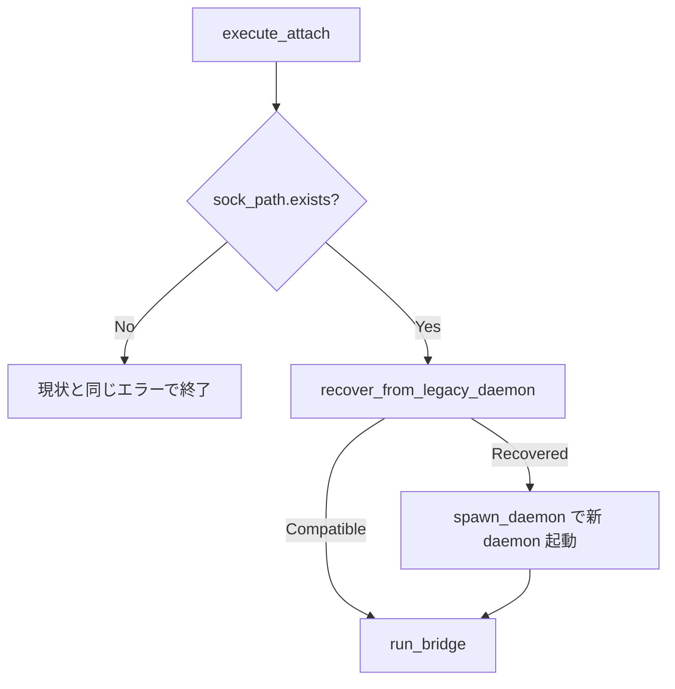

# mux attach legacy daemon recovery - 要件定義書

## 1. 概要

### 1.1 背景
`emterm mux attach` を実行しても既存セッションが復元されず、無反応で終了する
バグが報告された。ログには
`mux apc: handshake rejected: Protocol version mismatch: client=2, server=1`
が記録される。

eMterm バイナリが PROTOCOL_VERSION=2 へ更新された後も、更新前に起動した
mux daemon (v1) が常駐し続けるため、attach client (v2) とのハンドシェイクが
拒否される。`ensure_daemon_running()` には legacy daemon を検出して
version-tolerant な Shutdown を送り新バイナリで再起動する
`recover_from_legacy_daemon()`（Strategy B）が実装済みだが、
`execute_attach` はこの recovery を一切通らない（`sock_path.exists()`
チェックのみで `run_bridge()` に直行する）。

### 1.2 目的
`emterm mux attach` の経路にも legacy daemon recovery を通し、eMterm 更新直後の
attach が沈黙して終了する問題を解消する。

### 1.3 スコープ
- `src-tauri/src/mux/cli.rs` の `execute_attach`
- `src-tauri/src/mux/daemon.rs` の `ensure_daemon_running` の daemon spawn
  部分の関数切り出し（リファクタリング）
- 上記に対するテスト追加

スコープ外: attach の既存意味論の変更（daemon 不在時はエラーのまま）、
プロトコルバージョン管理自体の変更。

## 2. ビジネス要件

### 2.1 対象ユーザー
| ユーザータイプ | 説明 |
|----------------|------|
| mux 利用者 | eMterm を apt/deb 更新した直後に `emterm mux attach` で既存セッションへ再接続するユーザー |

### 2.2 期待される効果
- eMterm 更新後の attach が手動の daemon kill（`pkill`）なしで成功する

## 3. ユースケース

### UC01: 更新直後の attach

**アクター**: mux 利用者

**事前条件**:
- 旧バイナリ (v1) で起動された mux daemon が常駐している
- eMterm バイナリは v2 に更新済み

**基本フロー**:
1. ユーザーが `emterm mux attach` を実行する
2. attach 経路が legacy daemon (v1) を検出する
3. legacy daemon に version-tolerant な Shutdown を送る
4. 新バイナリで daemon を再起動する
5. `run_bridge()` に進み、attach が成立する

**代替フロー**:
- daemon が既に互換 (v2) → recovery は no-op でそのまま attach（現状どおり）
- daemon 完全不在（socket 無し）→ 現状と同じエラーメッセージで失敗

**事後条件**:
- v2 daemon が常駐し、attach が成立している

## 4. 機能要件

### 4.1 機能一覧
| ID | 機能名 | 説明 | 優先度 |
|----|--------|------|--------|
| F01 | daemon spawn の関数切り出し | `ensure_daemon_running` の spawn 部分を独立関数に切り出す | 高 |
| F02 | attach 経路への recovery 差し込み | `execute_attach` に `recover_from_legacy_daemon` を差し込む | 高 |
| F03 | attach 経路のテスト | fake legacy daemon 基盤を使った attach 経路のテスト | 高 |

### 4.2 機能詳細

#### F01: daemon spawn の関数切り出し

**説明**: `src-tauri/src/mux/daemon.rs` の `ensure_daemon_running`
（`daemon.rs:167-` の `!daemon_running` ブランチ）にある daemon スポーン
ロジック（socket 親ディレクトリ作成・spawn・readiness 待ち）を
`spawn_daemon(sock_path: &Path) -> Result<(), String>` 相当の関数に切り出す。
`ensure_daemon_running` 自体は `recover_from_legacy_daemon` → 必要に応じて
`spawn_daemon` を呼ぶ形にリファクタし、外部から見た挙動は変えない。

**エラーケース**:
| エラー | 条件 | 対応 |
|--------|------|------|
| spawn 失敗 | 実行パス取得失敗・spawn 失敗・readiness タイムアウト | 現行 `ensure_daemon_running` と同じエラー文字列を返す |

#### F02: attach 経路への recovery 差し込み

**説明**: `execute_attach`（`src-tauri/src/mux/cli.rs:355-375`）の
`sock_path.exists()` チェック直後・`run_bridge()` 呼び出し前に
`recover_from_legacy_daemon(&sock_path)` を差し込む。

**処理フロー**:

**ビジネスルール**:
- attach の既存意味論を維持する: daemon 不在（socket 無し）はエラー。
  `ensure_daemon_running()` の丸ごと採用はしない（daemon 不在時に新規
  daemon を勝手に立ち上げないため）
- `LegacyRecovery::Recovered` の時のみ新 daemon を spawn する（recovery で
  shutdown した daemon の代替であり、無からの新規起動ではない）

#### F03: attach 経路のテスト

**説明**: `src-tauri/src/mux/daemon.rs` の `FAKE_LEGACY_VERSION` テスト基盤
（`daemon.rs:1182-` の fake legacy daemon）を使い、attach 経路のテストで
以下を確認する:
- v1 daemon が居る状態: recovery が走り新 daemon が立ち上がり handshake が成立
- v2 daemon が居る状態: 現状と同じくそのまま attach できる
- daemon 完全不在: 現状と同じエラーメッセージで失敗

## 5. 非機能要件

### 5.1 互換性要件
- Linux / Windows 両対応（`ensure_daemon_running` と同じ cfg 分岐を維持）
- `emterm mux` / `emterm mux script` の既存経路の挙動を変えない

### 5.2 保守性要件
- ログ出力: recovery 発動時の既存ログ（`recover_from_legacy_daemon` 内）を
  そのまま活かす

## 9. 制約条件

### 9.1 技術的制約
- `run_bridge()` は長時間実行のブリッジプロセスであり、テストから
  `execute_attach` を丸ごと駆動するのは困難。テスト可能性のため、
  recovery + spawn の pre-bridge ロジックをテスト可能な単位に分離してよい
- `recover_from_legacy_daemon` は現在 private（`fn`）。attach 経路（cli.rs）
  から使える可視性への変更が必要

## 11. 成功基準

### 11.1 受け入れ基準
- [ ] v1 daemon 常駐時の `emterm mux attach` が recovery を経て成功する
- [ ] v2 daemon 常駐時の attach 挙動が現状と同一
- [ ] daemon 不在時の attach エラーメッセージが現状と同一
- [ ] `emterm mux` / `emterm mux script` の挙動が変わらない（既存テストが通る）

## 12. テストシナリオ

### 12.1 テスト観点
- [ ] 正常系: v2 daemon への attach（recovery no-op）
- [ ] 異常系: daemon 不在時のエラー
- [ ] 回復系: v1 daemon 検出 → shutdown → 新 daemon spawn → handshake 成立

## 14. 確認事項

### 14.1 確認済み事項（タスク記述より）

- [x] 修正方針: `execute_attach` に recovery step だけを差し込む
  （`ensure_daemon_running()` の丸ごと採用はしない）
- [x] `Recovered` 時は新 daemon を spawn してから `run_bridge` へ進む
- [x] daemon 不在時のエラー意味論は維持する
- [x] テストは `FAKE_LEGACY_VERSION` の fake legacy daemon 基盤を使う

### 14.2 未確認・保留事項（batch モードでの仮定 — SPEC.md Assumptions 参照）

- [ ] `spawn_daemon` の正確なシグネチャ（戻り値型）は planner の裁量
- [ ] attach 経路テストの実装形態（`execute_attach` を直接駆動せず
  pre-bridge ロジックの分離関数をテストする形を許容）

## 15. 参考資料

- Notion タスク: https://www.notion.so/3a73509ec8ee819b9a8cd346a7360a51
- 関連コード: `src-tauri/src/mux/cli.rs:355-375`（execute_attach）、
  `src-tauri/src/mux/cli.rs:329-350`（execute_mux）、
  `src-tauri/src/mux/daemon.rs:141-`（ensure_daemon_running）、
  `src-tauri/src/mux/daemon.rs:391-`（recover_from_legacy_daemon）、
  `src-tauri/src/mux/ipc/connection.rs:80-90`（server 側 reject）、
  `crates/mux_ipc/src/protocol.rs:32,44`（PROTOCOL_VERSION）
