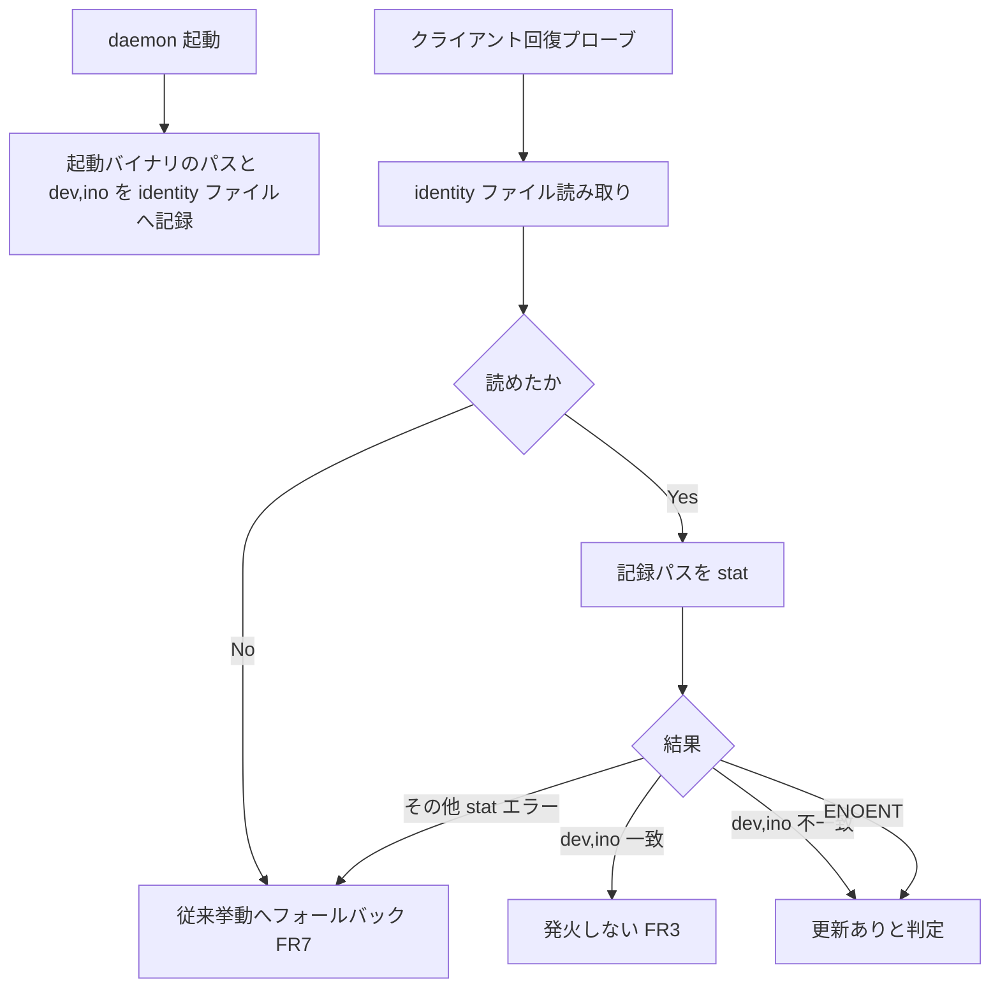

# mux-daemon-binary-update-detect - 要件定義書

## 1. 概要

### 1.1 背景

eMterm のバイナリを更新しても mux daemon が旧バイナリのまま稼働し続け、「ビルドして入れ直したのに直っていない」状態になる。2026-08-02 に実例を確認している。プロトコルが互換な場合は既存の回復プローブが `Compatible` を返すため、daemon の差し替えが発火しない。

### 1.2 目的

- eMterm のバイナリが更新されたら、mux daemon も新しいバイナリへ差し替わるようにする（プロトコル互換でも発火する検出条件を追加する）。
- 差し替えは既存の hot-upgrade（execve による in-place 置換、PTY master FD 引き継ぎ）を用い、pane のシェル PID を保つ。
- 上記の「旧バイナリのまま稼働し続ける」状態を解消する。

### 1.3 スコープ

**対象**

- daemon 起動バイナリの identity 記録と、クライアント回復プローブでの更新検出（FR1）。
- 検出時の hot-upgrade 自動発火と、クライアントへの通知（FR2）。
- hot-upgrade の exec 対象パス解決の修正（FR4）。
- hot-upgrade 非対応 daemon に対する警告表示（FR5）。
- 発火箇所は `emterm mux attach`（cli.rs:494 の `resolve_attach_socket_with`）と `emterm mux` 起動（daemon.rs:219 の `ensure_daemon_running`）の両回復プローブ。

**対象外**

- hot-upgrade 機構そのもの（snapshot / handoff / execve / restore）の変更。既存機構を再利用する。
- GUI クライアント側のバイナリ更新検出。
- Windows の挙動（本機能は Unix/Linux のみ）。

## 2. ビジネス要件

### 2.1 ビジネス目標

- eMterm のバイナリが更新されたら、mux daemon も新しいバイナリへ差し替わるようにする（プロトコル互換でも発火する検出条件を追加する）。
- 差し替えは既存の hot-upgrade（execve による in-place 置換、PTY master FD 引き継ぎ）を用い、pane のシェル PID を保つ。
- 「ビルドして入れ直したのに直っていない」状態（daemon が旧バイナリのまま稼働し続ける、2026-08-02 に実例確認）を解消する。

### 2.2 対象ユーザー

| ユーザータイプ | 説明 |
|----------------|------|
| mux 利用者 | `emterm mux` で mux を起動する、または `emterm mux attach` で既存 daemon に attach するユーザー |
| hot-upgrade 非対応 daemon の利用者 | Upgrade フレームを黙って破棄する旧世代 daemon が稼働している環境の利用者（FR5 の警告対象） |

### 2.3 期待される効果

- バイナリ更新後の attach / mux 起動で daemon が新しいバイナリのイメージへ差し替わる。
- 差し替え時も pane のシェルが PID を保ったまま生き残る。
- 旧バイナリのまま稼働し続ける状態が解消される。

## 3. ユースケース

### 3.1 ユースケース一覧

| ID | ユースケース名 | アクター | 優先度 |
|----|----------------|----------|--------|
| UC01 | バイナリ更新後に `emterm mux attach` する | mux 利用者 | 高 |
| UC02 | バイナリ更新後に `emterm mux` を起動する | mux 利用者 | 高 |
| UC03 | hot-upgrade 非対応 daemon に接続する | hot-upgrade 非対応 daemon の利用者 | 中 |

### 3.2 ユースケース詳細

#### UC01: バイナリ更新後に `emterm mux attach` する

**アクター**: mux 利用者

**事前条件**:
- mux daemon が稼働している。
- daemon の起動バイナリが、daemon 起動後に新しいバイナリへ置換されている。

**基本フロー**:
1. 利用者が `emterm mux attach` を実行する。
2. 回復プローブ（cli.rs:494 の `resolve_attach_socket_with`）が identity ファイルを読み、記録されたパスの現物を stat する。
3. 記録された (device, inode) と現在値が不一致であることを検出する。
4. 既存の Upgrade 経路（`send_upgrade` → `prepare_upgrade` → execve）で in-place 置換を発火する。
5. クライアントに「daemon を新しいバイナリへ差し替えた」旨を 1 行表示し、ログにも記録する。

**代替フロー**:
- identity 比較が一致（バイナリ同一）: 何もしない（FR3）。
- identity ファイルが存在しない・読めない・壊れている: 誤発火せず従来挙動（プロトコル判定のみ）へフォールバックする（FR7）。
- 候補バイナリが handoff スキーマ範囲プローブで非互換と判定された: upgrade が拒否され、元の daemon が pane を保ったまま生き続ける（FR6）。
- execve が失敗した: `run_daemon_in_handoff_mode` 再入（cli.rs:332-362）が既存どおり機能する（FR6）。

**事後条件**:
- daemon は新しくインストールされたバイナリのイメージで動作している。
- pane のシェルは PID を保ったまま生き残っている。

#### UC02: バイナリ更新後に `emterm mux` を起動する

**アクター**: mux 利用者

**事前条件**:
- mux daemon が稼働している。
- daemon の起動バイナリが置換されている。

**基本フロー**:
1. 利用者が `emterm mux` を実行する。
2. `ensure_daemon_running`（daemon.rs:219）の回復プローブが UC01 と同一の検出を行う。
3. 更新を検出したら hot-upgrade を発火し、クライアントに 1 行通知する。

**代替フロー**:
- UC01 と同一（一致時は無発火、identity 欠落時はフォールバック）。

**事後条件**:
- UC01 と同一。

#### UC03: hot-upgrade 非対応 daemon に接続する

**アクター**: hot-upgrade 非対応 daemon の利用者

**事前条件**:
- Upgrade フレームを黙って破棄する世代の daemon が稼働している。

**基本フロー**:
1. 利用者が attach する。
2. クライアントの標準エラーに「旧世代の daemon のため pane を維持できず再作成する」旨を明示的に表示する。
3. 従来どおり shutdown→respawn へフォールバックする（daemon.rs:647-679 のフォールバックと同一挙動）。

**事後条件**:
- pane は再作成される。挙動自体は現状と同一で、利用者への可視性のみが追加されている。

**ユースケース図**:

## 4. 機能要件

### 4.1 機能一覧

| ID | 機能名 | 説明 | 優先度 |
|----|--------|------|--------|
| FR1 | identity ファイルによるバイナリ更新の検出 | daemon 起動バイナリのパスと (device, inode) を記録し、回復プローブで比較する | 高 |
| FR2 | 検出時の hot-upgrade 自動発火（通知付き） | 無条件に既存 Upgrade 経路で in-place 置換し、1 行通知を出す | 高 |
| FR3 | 同一バイナリでは差し替えない | identity 一致時は従来どおり何もしない | 高 |
| FR4 | upgrade 対象パスの正しい解決 | exec 対象を identity ファイル記録のクリーンなパスから導出する | 高 |
| FR5 | hot-upgrade 非対応 daemon の扱い（警告して続行） | pane 再作成の警告を表示してから従来のフォールバックを行う | 中 |
| FR6 | 既存の安全ゲートの維持 | handoff スキーマ範囲プローブと execve 失敗時の再入を維持する | 高 |
| FR7 | identity 情報欠落時のフォールバック | 判定不能を「更新あり」と解釈せず従来挙動へ戻す | 高 |

### 4.2 機能詳細

#### FR1: identity ファイルによるバイナリ更新の検出

**説明**: daemon は起動直後に、自分の起動バイナリの identity — 起動時の実行ファイルパスとその (device, inode) — を、listen ソケットと同じ owner-only（0o700）ディレクトリ内の identity ファイルへ記録する。クライアント側の回復プローブは、この identity ファイルを読み、記録されたパスの現物を stat して現在の (device, inode) と比較する。不一致（または記録パスが ENOENT）を「バイナリが別物になった」と判定する。判定基準は daemon 自身の起動パスのファイル変化のみ（daemon-own-path）であり、attach してきたクライアント自身のバイナリとの異同は判定材料にしない — 開発ビルドから /usr/bin 起動 daemon への attach では発火せず、異種ビルドのクライアント混在による upgrade の往復は起きない。この方式は daemon の `/proc/self/exe` が `(deleted)` を指すケース（起動後の rename(2) 置換）でも判定でき、attach ごとのコストは小ファイル読み 1 回 + stat 1 回程度で軽量。

**入力**:
- identity ファイル: ファイル - daemon 起動時に記録した実行ファイルパスと (device, inode)
- 記録パスの stat 結果: (device, inode) - 現在の実体

**出力**:
- 更新判定: 真偽 - 「バイナリが別物になった」か否か

**処理フロー**:

**ビジネスルール**:
- 判定基準は daemon 自身の起動パスのファイル変化のみ（daemon-own-path）。
- attach クライアント自身のバイナリとの異同は判定材料にしない。
- identity ファイルは listen ソケットと同じ owner-only（0o700）ディレクトリ内に置く。

**エラーケース**:
| エラー | 条件 | 対応 |
|--------|------|------|
| 記録パスが ENOENT | 記録された実行ファイルが存在しない | 「バイナリが別物になった」と判定する |
| その他の stat エラー | stat が ENOENT 以外で失敗 | 発火しない |
| identity ファイルが読めない | 欠落・破損 | FR7 のフォールバック |

#### FR2: 検出時の hot-upgrade 自動発火（通知付き）

**説明**: 更新を検出したら、確認プロンプトや opt-out 設定なしで無条件に、既存の Upgrade 経路（`send_upgrade` → `prepare_upgrade` → execve、daemon.rs:961-1087 / cli.rs:332-362）で in-place 置換を発火する。発火時は attach（または mux 起動）したクライアントに「daemon を新しいバイナリへ差し替えた」旨を 1 行表示し、ログにも記録する（auto-with-notice）。プロトコルが互換で `recover_from_legacy_daemon` が `Compatible` を返すケースでも、バイナリ更新が検出されれば発火する。pane のシェルは PID を保ったまま生き残る。発火箇所は同一の回復プローブを共有する両経路 — `emterm mux attach`（cli.rs:494 の `resolve_attach_socket_with`）と `emterm mux` 起動（daemon.rs:219 の `ensure_daemon_running`）— の両方（attach-and-mux-start）。GUI クライアント側のバイナリ更新検出はスコープ外。

**入力**:
- 更新判定: 真偽 - FR1 の判定結果

**出力**:
- in-place 置換の実行: プロセス状態 - execve による daemon 差し替え
- クライアント通知: 文字列 - 差し替えた旨の 1 行表示
- ログ記録: ログ行 - 同内容の記録

**ビジネスルール**:
- 確認プロンプト・opt-out 設定は設けない（auto-with-notice）。
- プロトコル互換（`Compatible`）でもバイナリ更新が検出されれば発火する。
- pane のシェルは PID を保ったまま生き残る。
- 発火箇所は attach と mux 起動の両回復プローブ。

#### FR3: 同一バイナリでは差し替えない

**説明**: identity 比較が一致（バイナリ同一）なら従来どおり何もしない。不要な再起動・プロセス置換・Upgrading ブロードキャストを一切誘発しない。

**ビジネスルール**:
- 一致時は Upgrading ブロードキャストを出さない。

#### FR4: upgrade 対象パスの正しい解決

**説明**: hot-upgrade の exec 対象は、daemon が identity ファイルに記録した起動時のクリーンな実行ファイルパス（= 新しいバイナリが同じ場所へインストールされた実パス）へ解決される。現行実装の `current_exe()` ベースの候補解決（daemon.rs:1355 の `self_exec::self_exe_path`）は置換後 `…/emterm (deleted)` を返して exec が ENOENT で失敗し旧イメージで再入するため、この経路では使用しない。FR1 の identity 機構が記録するパスを対象解決の単一の情報源とする。

**エラーケース**:
| エラー | 条件 | 対応 |
|--------|------|------|
| exec 対象が `(deleted)` パスへ解決される | `current_exe()` ベースの候補解決を使った場合 | この経路を使わず identity ファイル記録のパスを単一の情報源とする |

#### FR5: hot-upgrade 非対応 daemon の扱い（警告して続行）

**説明**: hot-upgrade 非対応の古い daemon（Upgrade フレームを黙って破棄する世代）が動いている場合、attach クライアントの標準エラーに「旧世代の daemon のため pane を維持できず再作成する」旨を明示的に表示してから、従来どおり shutdown→respawn へフォールバックする（warn-and-proceed）。挙動自体は現状の daemon.rs:647-679 のフォールバックと同一で、利用者への可視性のみを追加する。

**出力**:
- 警告メッセージ: 標準エラー出力 - pane を維持できず再作成する旨

#### FR6: 既存の安全ゲートの維持

**説明**: 既存の handoff スキーマ範囲プローブ（`prepare_upgrade` の `probe_candidate_handoff_range`、daemon.rs:976-984）による候補バイナリの互換性ゲートは新しい発火条件でも維持され、非互換候補では upgrade が拒否されて元の daemon が pane を保ったまま生き続ける。execve 失敗時の `run_daemon_in_handoff_mode` 再入（cli.rs:332-362）も既存どおり機能する。

**エラーケース**:
| エラー | 条件 | 対応 |
|--------|------|------|
| 候補バイナリが非互換 | handoff スキーマ範囲プローブが不適合と判定 | upgrade を拒否し、元の daemon が pane を保ったまま生き続ける |
| execve 失敗 | exec が失敗する | `run_daemon_in_handoff_mode` 再入（既存どおり） |

#### FR7: identity 情報欠落時のフォールバック

**説明**: identity ファイルが存在しない・読めない・壊れている場合（本機能導入前に起動した daemon が動き続けている移行期を含む）は、誤発火せず従来挙動（プロトコル判定のみ）へフォールバックする。判定不能を「更新あり」と解釈しない。

**ビジネスルール**:
- 判定不能を「更新あり」と解釈しない。

## 5. 非機能要件

### 5.1 パフォーマンス要件

- NFR1: 検出コストは attach ごとに掛かるため軽量であること。identity ファイルの読み取り + 記録パスの stat 程度に収め、バイナリ全体の読み込みやハッシュ計算を毎回行わない。

### 5.2 セキュリティ要件

- NFR3: identity ファイルは既存の handoff ファイルと同じハードニング規約（owner-only 0o600、O_NOFOLLOW、0o700 ディレクトリ、upgrade.rs の `create_handoff_file` 前例）に従う。
- NFR3: exec 対象パスは daemon 自身が記録した値のみから導出し、他者が書き込めるパスや接続クライアントの申告値を無検証で exec しない。

### 5.3 可用性要件

- FR6: 非互換候補では upgrade が拒否され、元の daemon が pane を保ったまま生き続ける。
- FR6: execve 失敗時は `run_daemon_in_handoff_mode` 再入が既存どおり機能する。
- FR2: 差し替え時も pane のシェルは PID を保ったまま生き残る。

### 5.4 保守性要件

- FR2: 発火時はクライアントへの 1 行通知に加えてログにも記録する。

### 5.5 互換性要件

- NFR2: 本機能は Unix/Linux のみ（execve ベースの hot-upgrade が Unix-only のため）。Windows の挙動は変更しない。
- FR2: プロトコル互換（`recover_from_legacy_daemon` が `Compatible` を返す）ケースでもバイナリ更新が検出されれば発火する。
- FR7: 本機能導入前に起動した daemon が動き続けている移行期は従来挙動へフォールバックする。

## 6. UI/UX要件

### 6.1 画面設計要件

視覚デザイン対象の UI は存在しない。UI 面は CLI への 1 行通知（FR2）と警告メッセージ（FR5）に留まり、settings パネルへの追加も発生しない（trigger.policy = auto-with-notice で opt-out 設定なしが確定）。

### 6.2 画面遷移

該当なし（CLI 出力のみ）。

### 6.3 レスポンシブ対応

該当なし。

## 7. データ要件

### 7.1 データモデル概要

identity ファイル 1 種のみ。listen ソケットと同じ owner-only（0o700）ディレクトリ内に置く。

### 7.2 データ項目

| エンティティ | 項目名 | 型 | 必須 | 説明 |
|--------------|--------|-----|------|------|
| identity ファイル | 実行ファイルパス | パス | ○ | daemon 起動時の実行ファイルパス。upgrade の exec 対象解決の単一の情報源（FR4） |
| identity ファイル | device | 識別子 | ○ | 起動バイナリの device |
| identity ファイル | inode | 識別子 | ○ | 起動バイナリの inode |

### 7.3 データ保持期間

| データ種別 | 保持期間 |
|------------|----------|
| identity ファイル | daemon が起動直後に記録し、回復プローブが参照する |

## 8. 外部連携

### 8.1 連携システム

該当なし。

### 8.2 API仕様要件

既存の mux プロトコルの Upgrade 経路（`send_upgrade` → `prepare_upgrade` → execve）を再利用する。プロトコル自体の変更は本機能のスコープ外。

## 9. 制約条件

### 9.1 技術的制約

- 本機能は Unix/Linux のみ。Windows の挙動は変更しない（NFR2 / 前提 a1）。
- hot-upgrade 機構そのもの（snapshot / handoff / execve / restore）は変更せず再利用する。本機能は発火条件の追加と exec 対象パス解決の修正のみ（前提 a2）。
- identity ファイルは既存の handoff ファイルと同じハードニング規約に従う（NFR3）。
- `current_exe()` ベースの候補解決は置換後 `(deleted)` パスを返すため、この経路では使用しない（FR4）。

### 9.2 ビジネス上の制約

- 確認プロンプト・opt-out 設定を設けない（auto-with-notice、前提 a4）。
- GUI クライアント側のバイナリ更新検出はスコープ外（FR2）。

### 9.3 スケジュール制約

該当なし。

## 10. 想定される課題とリスク

### 10.1 技術的課題

| 課題 | 影響度 | 対応策 |
|------|--------|--------|
| daemon の `/proc/self/exe` が `(deleted)` を指す（起動後の rename(2) 置換） | 高 | identity ファイル方式で判定する（FR1）、exec 対象は identity 記録パスから導出する（FR4） |
| 異種ビルドのクライアント混在による upgrade の往復 | 中 | 判定基準を daemon-own-path に限定する（FR1 / 前提 a7） |
| 本機能導入前に起動した daemon が動き続ける移行期 | 中 | identity 情報欠落時は従来挙動へフォールバックする（FR7） |
| 非互換な候補バイナリへの upgrade | 高 | 既存の handoff スキーマ範囲プローブによる互換性ゲートを維持する（FR6） |
| attach ごとの検出コスト | 低 | 小ファイル読み 1 回 + stat 1 回程度に収める（NFR1） |

### 10.2 ビジネスリスク

| リスク | 発生確率 | 影響度 | 対応策 |
|--------|----------|--------|--------|
| hot-upgrade 非対応 daemon で pane が破棄される | 中 | 中 | 破棄しうる旨の警告を表示したうえで従来のフォールバックを続行する（FR5） |

## 11. 成功基準

### 11.1 受け入れ基準

- [ ] AC-1: daemon 起動時に使ったバイナリと、現在インストールされているバイナリが別物になったことを検出できる（daemon の `/proc/<pid>/exe` が `(deleted)` のケースを含む）
- [ ] AC-2: 検出したら hot-upgrade（execve による in-place 置換）が走り、pane のシェルが PID を保ったまま生き残る
- [ ] AC-3: プロトコルが互換でもバイナリが更新されていれば差し替わる
- [ ] AC-4: バイナリが同一なら従来どおり差し替えは起きない（不要な再起動を誘発しない）
- [ ] AC-5: hot-upgrade 非対応の古い daemon が動いている場合、pane を破棄しうることが利用者に分かる警告が表示されたうえで従来のフォールバックが実行される
- [ ] AC-6: 置換後の daemon は新しくインストールされたバイナリのイメージで動作している（exec 対象が `(deleted)` パスに解決されない）
- [ ] AC-7: identity 情報が欠落・不正な場合は誤発火せず従来挙動にフォールバックする
- [ ] AC-8: 発火時、attach / mux 起動したクライアントに差し替えた旨の通知が 1 行表示される

### 11.2 KPI

該当なし（受け入れ基準で判定する）。

## 12. テストシナリオ

### 12.1 テスト観点

- [ ] 正常系（TS-3）: 隔離 XDG_RUNTIME_DIR で実 daemon を起動し実シェルの PID を記録 → daemon の起動バイナリを rename(2) で新しいコピーに置換（`/proc/<pid>/exe` が `(deleted)` になる状態を再現）→ attach → hot-upgrade が発火し、シェル PID が不変のまま生き残り、daemon が新バイナリのイメージで動作していること（handoff ログ/識別マーカーで確認）を検証（AC-1/2/3/6 主線）
- [ ] 正常系（TS-4）: バイナリを置換せず attach → upgrade が発火しない（Upgrading ブロードキャスト・handoff 開始ログが出ない）ことを検証（AC-4）
- [ ] 正常系（TS-5）: `emterm mux` 新規起動側の回復プローブ（`ensure_daemon_running` 経路）でも、バイナリ置換後に同様に発火することを検証
- [ ] 正常系（TS-8）: 発火時に attach クライアントへ差し替え通知が 1 行出力されることを検証（AC-8）
- [ ] 異常系（TS-6）: Upgrade フレームを黙って破棄する stand-in daemon（`spawn_fake_legacy_daemon` 系フィクスチャの流儀）に対し、pane 破棄の警告が利用者向けに出力されたうえで shutdown→respawn フォールバックが走ることを検証（AC-5）
- [ ] 異常系（TS-7）: identity ファイルが存在しない daemon（本機能導入前世代を模擬）へ attach → 誤発火せずプロトコル判定のみの従来挙動になることを検証（AC-7）
- [ ] 境界値（TS-1）: identity 比較述語 — 記録 (dev, ino) と現在値の一致 → 発火しない、不一致 → 発火、記録パス ENOENT → 発火、その他 stat エラー → 発火しない（self_exec.rs の `is_missing` テスト群と同型のテーブル）
- [ ] 境界値（TS-2）: identity ファイルの書き込み/読み取りラウンドトリップと、欠落・切り詰め・不正内容の各ケースでのフォールバック（AC-7）
- [ ] セキュリティ（TS-2）: identity ファイルの権限（0o600）とシンボリックリンク拒否の検証
- [ ] パフォーマンス（NFR1）: 検出は identity ファイルの読み取り + 記録パスの stat 程度に収まり、バイナリ全体の読み込みやハッシュ計算を毎回行わない

## 13. 用語定義

| 用語 | 定義 |
|------|------|
| hot-upgrade | execve による daemon の in-place 置換。PTY master FD を引き継ぎ、pane のシェル PID を保つ |
| identity ファイル | daemon が起動直後に、自分の起動バイナリの実行ファイルパスとその (device, inode) を記録するファイル。listen ソケットと同じ owner-only（0o700）ディレクトリ内に置く |
| 回復プローブ | `emterm mux attach`（cli.rs:494 の `resolve_attach_socket_with`）と `emterm mux` 起動（daemon.rs:219 の `ensure_daemon_running`）が共有する、既存 daemon への接続時の判定処理 |
| daemon-own-path | 判定基準を daemon 自身の起動パスのファイル変化のみに限定する方針。attach クライアント自身のバイナリとの異同は判定材料にしない |
| auto-with-notice | 確認プロンプト・opt-out 設定なしで自動発火し、クライアントに 1 行通知を表示する発火ポリシー |
| warn-and-proceed | hot-upgrade 非対応の旧 daemon に対し、pane を維持できない旨の警告を表示したうえで従来の shutdown→respawn フォールバックを続行する方針 |
| handoff | hot-upgrade 時に新旧 daemon 間で状態を受け渡す機構。スキーマ範囲プローブによる互換性ゲートを持つ |

## 14. 確認事項

### 14.1 確認済み事項

- [x] 検出方式（detection.method）: identity-file 方式 — daemon が起動時に自バイナリのパス + (device, inode) をソケット隣の owner-only ディレクトリに記録し、クライアントの回復プローブが記録パスの現物を stat して比較する
- [x] 発火ポリシー（trigger.policy）: auto-with-notice — 確認プロンプト・opt-out 設定なしで自動発火し、クライアントに 1 行通知を表示する
- [x] 旧 daemon の扱い（legacy-daemon.ux）: warn-and-proceed — pane を維持できない旨の警告を表示したうえで従来の shutdown→respawn フォールバックを続行する
- [x] 発火箇所（trigger.scope）: attach-and-mux-start — `emterm mux attach` と `emterm mux` 起動の両回復プローブに検出を組み込む
- [x] 同一性の基準（identity.reference）: daemon-own-path — daemon 自身の起動パスのファイルが変化したときのみ発火し、attach クライアント自身のバイナリとの異同は判定材料にしない（異種ビルド混在時の upgrade 往復を構造的に排除）
- [x] プラットフォーム: Unix/Linux のみ。Windows の挙動は変更しない（execve ベース hot-upgrade の既存プラットフォームゲートに整合）
- [x] 既存機構の扱い: hot-upgrade 機構そのもの（snapshot/handoff/execve/restore）は変更せず再利用する。本機能は発火条件の追加と exec 対象パス解決の修正のみ
- [x] デザイン工程: skip — Rust の daemon/CLI 内部変更のみで視覚デザイン対象の UI が存在しない

### 14.2 未確認・保留事項

なし（全要件が resolved）。

## 15. 参考資料

- Upgrade 経路: daemon.rs:961-1087（`send_upgrade` → `prepare_upgrade` → execve）/ cli.rs:332-362（`run_daemon_in_handoff_mode` 再入）
- handoff スキーマ範囲プローブ: daemon.rs:976-984（`probe_candidate_handoff_range`）
- attach 側回復プローブ: cli.rs:494（`resolve_attach_socket_with`）
- mux 起動側回復プローブ: daemon.rs:219（`ensure_daemon_running`）
- 現行の候補解決（本機能では使用しない）: daemon.rs:1355（`self_exec::self_exe_path`）
- 旧世代 daemon フォールバック: daemon.rs:647-679
- ファイルハードニング前例: upgrade.rs の `create_handoff_file`
- 既存テスト資産: self_exec.rs の `is_missing` テスト群、mux_hot_upgrade.rs、cli.rs の `spawn_fake_legacy_daemon` 系フィクスチャ
