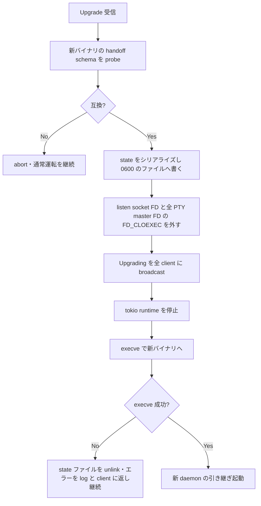

# mux daemon の execve による hot-upgrade - 要件定義書

## 1. 概要

### 1.1 背景

- apt/deb で eMterm を更新すると、古い mux daemon が前のバージョンのまま常駐する。新 client が attach しようとすると protocol mismatch で拒否される。
- 先行タスク「mux attach で legacy daemon recovery が走らず handshake rejected のまま終了する」により attach 経路に `recover_from_legacy_daemon` が配線された（`src-tauri/src/mux/cli.rs:388`）。この recovery は内部で `graceful_shutdown()`（`src-tauri/src/mux/daemon.rs:1134`）を呼び、全 pane の PTY master を drop する。kernel が slave に SIGHUP を配るため、pane 内の shell がすべて死ぬ。
- 結果として「eMterm を更新した瞬間に、開いていた作業（ssh セッション、実行中の Claude Code、nethogs、glances など）がすべて飛ぶ」挙動になる。
- daemon が PTY master を保持する eMterm の構造では、`execve()` による hot-upgrade で解ける。PTY master FD は `execve` をまたいで維持されるため、shell 側は切断を知らずに動き続ける。

### 1.2 目的

mux daemon にインプレース版更新（`execve` による hot-upgrade）を実装し、eMterm バイナリを更新しても、開いていた pane とその中の実行中シェルを壊さずに新バイナリへ引き継げるようにする。

### 1.3 スコープ

**対象**:

- `crates/mux_ipc` への Upgrade 系 control message の追加
- daemon 側の交換プロトコル（state シリアライズ → FD 継承 → `execve`）
- 新 daemon 側の引き継ぎ起動ロジック（state 復元 → 継承 FD の再登録）
- client（GUI・CLI）の自動再接続
- `execve` 失敗時・schema 不整合時のフォールバック
- state schema の version 管理
- `emterm mux upgrade` CLI と `recover_from_legacy_daemon` からの自動トリガー
- integration test（同一 shell プロセスの生存確認）

**対象外**:

- Windows 版の hot-upgrade（Named Pipe + Job Object の制約が別問題になるため、shutdown-then-restart のまま）
- eMterm バイナリ自体の自動アップデート機能との連携（トリガーは既存の apt/deb/GitHub release フローに任せる）
- pane 内の VT parser state の完全なバイト単位復元（scrollback と主要属性の復元まで）
- upgrade トリガーの GUI ボタン

## 2. ビジネス要件

### 2.1 ビジネス目標

eMterm の更新が、進行中の作業を破壊しない操作になること。

### 2.2 対象ユーザー

| ユーザータイプ | 説明 |
|----------------|------|
| mux 利用者 | eMterm の mux で複数 pane を開いて長時間作業するユーザー |
| パッケージ更新者 | apt/deb で eMterm を更新するユーザー |

### 2.3 期待される効果

- バイナリ更新時に pane 内の ssh セッション・実行中プロセスが失われない
- protocol mismatch による attach 拒否が、作業破壊を伴わずに解消される

## 3. ユースケース

### 3.1 ユースケース一覧

| ID | ユースケース名 | アクター | 優先度 |
|----|----------------|----------|--------|
| UC01 | 明示的な hot-upgrade | mux 利用者 | 高 |
| UC02 | attach 時の自動 hot-upgrade | mux 利用者 | 高 |
| UC03 | upgrade 失敗時のフォールバック | mux 利用者 | 高 |

### 3.2 ユースケース詳細

#### UC01: 明示的な hot-upgrade

**アクター**: mux 利用者

**事前条件**:

- mux daemon が起動しており、1 つ以上の pane が存在する
- 新しい eMterm バイナリがインストール済み

**基本フロー**:

1. 利用者が `emterm mux upgrade` を実行する
2. CLI が daemon に接続し、`Upgrade` message を送る
3. daemon が新バイナリの handoff schema 互換性を確認する
4. daemon が全 pane の state をシリアライズし、listen socket FD と全 PTY master FD の `FD_CLOEXEC` を外す
5. daemon が接続中の client に `Upgrading` を broadcast する
6. daemon が tokio runtime を停止し、`execve()` で新バイナリへ切り替える
7. 新 daemon が引き継ぎ起動を検知し、state を復元して継承 FD を再登録する
8. client が再接続して pane が復元される
9. pane 内の shell は切断を知らずに動作を続けている

**代替フロー**:

- 新バイナリの handoff schema が非互換 → upgrade を abort し、旧 daemon がそのまま動作を続ける（UC03）
- `execve()` が失敗 → 旧 daemon が exit せずに継続動作し、エラーを log と client に返す（UC03）

**事後条件**:

- pane 内の shell の PID が upgrade 前後で変わっていない
- daemon プロセスの PID は変わらない（`execve` はプロセスを置き換えるため）

#### UC02: attach 時の自動 hot-upgrade

**アクター**: mux 利用者

**事前条件**:

- 旧バージョンの daemon が常駐している
- 新バージョンの client が `emterm mux attach` を実行する

**基本フロー**:

1. client が handshake し、protocol mismatch を検出する
2. `recover_from_legacy_daemon` がまず `Upgrade` を試みる
3. daemon が hot-upgrade を実行する
4. client が新 daemon に attach する

**代替フロー**:

- daemon が `Upgrade` を理解しない（この機能より前のバージョン） → タイムアウト後、従来の shutdown → respawn にフォールバックする

**事後条件**:

- upgrade が成功した場合、pane が保持されたまま attach できる

#### UC03: upgrade 失敗時のフォールバック

**アクター**: mux 利用者

**事前条件**:

- upgrade が要求されている

**基本フロー**:

1. daemon が upgrade の準備段階（schema 互換性確認、state 書き出し、FD 準備）で失敗を検出する
2. daemon は `execve` を実行せず、準備で確保した資源を解放する
3. daemon がエラーを log に残し、要求元 client にエラーを返す
4. daemon は通常運転を継続する

**事後条件**:

- pane と shell は影響を受けない

## 4. 機能要件

### 4.1 機能一覧

| ID | 機能名 | 説明 | 優先度 |
|----|--------|------|--------|
| F01 | Upgrade 系 control message | `Upgrade` / `Upgrading` の wire format 追加 | 高 |
| F02 | daemon 側の交換プロトコル | state シリアライズ・FD 継承・`execve` | 高 |
| F03 | 新 daemon の引き継ぎ起動 | state 復元・継承 FD 再登録 | 高 |
| F04 | client の自動再接続 | `Upgrading` 受信後の再接続と再 attach | 高 |
| F05 | フォールバック | schema 不整合・`execve` 失敗時の安全な継続 | 高 |
| F06 | state schema の version 管理 | `PROTOCOL_VERSION` とは別軸の version | 高 |
| F07 | `emterm mux upgrade` CLI | upgrade の明示トリガー | 高 |
| F08 | recovery 経路からの自動トリガー | Upgrade 優先・失敗時に従来経路 | 高 |

### 4.2 機能詳細

#### F01: Upgrade 系 control message

**説明**: `crates/mux_ipc/src/protocol.rs` に `MessageType::Upgrade` と `MessageType::Upgrading` を追加する。どちらも payload 空で、`MuxCodec` が未知の frame type を discard する既存挙動（`src-tauri/src/mux/ipc/codec.rs:37-54`）により、旧版の peer でも安全に無視される。

**入力**:

- `Upgrade`: client → daemon。upgrade 要求
- `Upgrading`: daemon → client。`execve` 直前の broadcast

**ビジネスルール**:

- 既存の bincode struct を変更しないため `PROTOCOL_VERSION` は据え置く
- `Shutdown`（`MessageType = 0x18`、payload 空）と同じ wire 形状を踏襲する

#### F02: daemon 側の交換プロトコル

**説明**: `Upgrade` を受け取った daemon が次を順に行う。

**処理フロー**:

**ビジネスルール**:

- `graceful_shutdown()` は呼ばない（pane が全滅するため）
- socket ファイルの unlink はしない（client が再接続できなくなるため）
- `execve` は tokio runtime の完全停止後、main thread から実行する

#### F03: 新 daemon の引き継ぎ起動

**説明**: 引き継ぎ情報を受け取って起動した daemon は、通常の初期化（socket bind）をスキップし、state を復元する。

**処理フロー**:

1. 引き継ぎ起動であることを検知する
2. state ファイルを読み、handoff schema version を検証する
3. SessionManager を復元する（windows/tabs/panes 木、タイトル、cwd、scrollback、agent status、ID 割当シーケンス、incarnation token）
4. 継承した listen socket FD を listener として登録する
5. 継承した各 PTY master FD を pane の master として再登録し、reader thread と writer を張り直す
6. state ファイルを unlink する
7. 引き継ぎ起動である旨を log に残す（通常起動と区別できる形式）

#### F04: client の自動再接続

**説明**: `Upgrading` を受け取った client は、socket が切れたあと再接続ループに入り、再 attach する。`Upgrading` を受け取っていない切断（`mux kill` など）は従来どおり終了する。

#### F05: フォールバック

**説明**: `execve` 実行前に検出した失敗はすべて upgrade の abort として扱い、旧 daemon が通常運転を継続する。`execve` が失敗した場合も同様に継続する。

**エラーケース**:

| エラー | 条件 | 対応 |
|--------|------|------|
| schema 非互換 | 新バイナリの handoff schema version が旧 daemon の書式と両立しない | abort。通常運転を継続し、client にエラーを返す |
| state 書き出し失敗 | ディスク不足・permission | abort。同上 |
| FD 準備失敗 | `fcntl` 失敗 | abort。同上 |
| `execve` 失敗 | 新バイナリが存在しない・実行不可 | state ファイルを unlink し、通常運転を継続。client にエラーを返す |
| 復元失敗（新 daemon 側） | state 破損 | 復元できた範囲を log に残し、復元できない pane は exited として扱う |

#### F06: state schema の version 管理

**説明**: handoff state の schema version は `crates/mux_ipc` に定義し、`PROTOCOL_VERSION` とは別軸で管理する。旧 daemon は `execve` 前に新バイナリへ schema 互換性を問い合わせ、非互換なら upgrade を abort する。

#### F07: `emterm mux upgrade` CLI

**説明**: `emterm mux upgrade` サブコマンドを追加する。daemon に接続して `Upgrade` を送り、新 daemon が応答可能になるまで待って結果を報告する。Windows では未対応である旨を報告して終了する。

#### F08: recovery 経路からの自動トリガー

**説明**: `recover_from_legacy_daemon` を修正し、まず `Upgrade` を試みる。所定時間内に upgrade 後の daemon と handshake できなければ、従来の shutdown → respawn にフォールバックする。

## 5. 非機能要件

### 5.1 パフォーマンス要件

- 引き継ぎ（`Upgrade` 受信から新 daemon が accept 可能になるまで）: 通常のセッション規模で数秒以内
- client の再接続: 再接続ループの試行窓内に復帰

### 5.2 セキュリティ要件

- state ファイルは permission 0600 で作成し、socket と同じ 0700 のディレクトリ配下に置く
- 復元後（および abort 時）に速やかに unlink する
- 引き継ぎ情報として渡すのは state ファイルパスと FD 番号のみ

### 5.3 可用性要件

- upgrade の成功・失敗いずれの経路でも、pane 内の shell プロセスを kill しない
- 引き継ぎ中に到着した新規接続は、listen socket を閉じないことで kernel の backlog に滞留させ、`execve` 後に処理する

### 5.4 保守性要件

- 引き継ぎ起動と通常起動を log で区別できる
- 引き継いだ pane 数・FD 数を log に残す

### 5.5 互換性要件

- Linux（Unix）のみ対応。Windows はビルドが通り、既存の shutdown-then-restart 挙動を維持する
- `--no-default-features`（CLI ビルド）に影響を与えない
- 新 message type の追加が旧版 peer を壊さない

## 6. UI/UX要件

GUI の変更はない。`emterm mux upgrade` の標準出力・log のみ。

## 7. データ要件

### 7.1 引き継ぎ state の項目

| エンティティ | 項目名 | 説明 |
|--------------|--------|------|
| handoff | schema_version | handoff schema の version |
| handoff | incarnation | `SessionManager` の incarnation token |
| handoff | listen_fd | 継承する listen socket の FD 番号 |
| handoff | next_session_id / next_pane_id | `SessionManager` の ID 割当シーケンス |
| session | id / name / window_order / active_window_id / next_window_id | セッション木 |
| window | id / name / active_pane_id / next_pane_id | ウィンドウ |
| pane | id / cols / rows / cwd / title / agent_status / exited | pane の主要属性 |
| pane | master_fd | 継承する PTY master の FD 番号 |
| pane | child_pid | pane の子プロセス PID |
| pane | scrollback | scrollback のバイト列 |

### 7.2 データ保持期間

| データ種別 | 保持期間 |
|------------|----------|
| handoff state ファイル | 新 daemon の復元完了まで（または abort 時まで） |

## 8. 外部連携

なし。

## 9. 制約条件

### 9.1 技術的制約

- Linux only（Windows はスコープ外）
- 先行タスクの実装が完了していること（確認済み: `src-tauri/src/mux/cli.rs:388` に配線済み）
- Rust 側で `execve` を呼ぶ前に tokio runtime を安全に停める（worker thread が残ったまま `execve` すると UB）
- portable-pty の `Box<dyn Child>` は `execve` をまたげない。子プロセスの PID を引き継いで reaping し直す必要がある
- portable-pty には raw fd から `MasterPty` を構成する公開 API がない。継承 FD 用の実装を自前で用意する必要がある
- `EMTERM_PANE_ID` は pane spawn 時に shell の環境変数として焼き込まれるため、incarnation token を引き継がないと既存 shell の値が無効になる

### 9.2 参考実装

- nginx `-s reload`
- HAProxy `-sf` seamless reload

## 10. 想定される課題とリスク

### 10.1 技術的課題

| 課題 | 影響度 | 対応策 |
|------|--------|--------|
| tokio worker thread が残ったままの `execve` は UB | 高 | `run_daemon` が upgrade 要求を戻り値で返し、runtime を drop した後に main thread で `execve` する |
| `Box<dyn Child>` が引き継げない | 中 | child PID をシリアライズし、upgrade 後は PID ベースの reaping 経路を使う |
| reader thread が snapshot 後 `execve` 前に読んだ出力が失われる | 低 | scrollback の lock を保持したまま snapshot を取り、失われる窓を最小化する。shell 自体は影響を受けない |
| 旧版 daemon は `Upgrade` を理解しない | 中 | タイムアウト後に従来の shutdown → respawn へフォールバックする。この機能の恩恵は次リリース以降から得られる |

## 11. 成功基準

### 11.1 受け入れ基準

- [ ] `Upgrade` 系 control message が `crates/mux_ipc` に追加され、旧版でも安全に無視される
- [ ] daemon が state をシリアライズし、listen socket FD と全 PTY master FD を `execve` をまたがせる
- [ ] 新 daemon が引き継ぎ起動を検知し、state を復元して継承 FD を再登録する
- [ ] 引き継ぎ起動が通常起動と区別できる形式で log に残る
- [ ] client が自動再接続して pane が復元される
- [ ] `execve` 失敗時に旧 daemon が exit せず継続動作し、エラーを log と client に返す
- [ ] handoff schema の version ミスマッチ時に upgrade を abort して安全にフォールバックする
- [ ] `recover_from_legacy_daemon` がまず Upgrade を試み、失敗時のみ従来経路にフォールバックする
- [ ] integration test で、upgrade 後に同じ shell プロセスの PID が変わっておらず、upgrade 前に作った marker file を shell 内から確認できる

## 12. テストシナリオ

### 12.1 テスト観点

- [ ] 正常系: pane を持つ daemon を upgrade し、shell の PID と marker file が保持される
- [ ] 正常系: 引き継ぎ起動が通常起動と区別できる形式で log に出る
- [ ] 異常系: schema 非互換で upgrade が abort され、daemon が通常運転を継続する
- [ ] 異常系: `execve` 失敗で daemon が継続動作し、client にエラーが返る
- [ ] 異常系: 旧版 daemon への Upgrade がタイムアウトし、shutdown → respawn にフォールバックする
- [ ] 境界値: pane が 0 個の daemon の upgrade
- [ ] セキュリティ: state ファイルの permission が 0600 で、復元後に unlink される
- [ ] 互換性: 新 message type の frame が旧 codec で discard される

## 13. 用語定義

| 用語 | 定義 |
|------|------|
| hot-upgrade | daemon を止めずに `execve` で新バイナリへ入れ替えること |
| handoff | upgrade 時の state・FD の引き継ぎ |
| handoff schema version | 引き継ぎ state の書式 version。`PROTOCOL_VERSION` とは別軸 |
| incarnation token | `SessionManager` が起動ごとに生成し、`EMTERM_PANE_ID` に埋め込むトークン |

## 14. 確認事項

### 14.1 確認済み事項

batch 実行のため、ユーザー対話は行っていない。Codex CLI も利用不可（`command -v codex` が失敗）だったため、以下はコードベース調査に基づく決定事項として記録する。

- [x] 先行タスクの完了状況: `recover_from_legacy_daemon` は `src-tauri/src/mux/cli.rs:388`（attach 経路）と `src-tauri/src/mux/daemon.rs:161` に配線済み
- [x] 引き継ぎ媒体: `memfd_create` ではなく 0600 の一時ファイル。socket と同じ 0700 のディレクトリ配下に置き、復元後に unlink する
- [x] client 接続の引き継ぎ: 行わない。`Upgrading` broadcast → client 側の再接続ループで復旧する（タスクの受け入れ条件どおり）
- [x] 引き継ぎ中の新規接続: listen socket を閉じないため kernel の backlog に滞留する。明示的な queue / EAGAIN 実装は行わない
- [x] schema 非互換の検出: `execve` 前に新バイナリへ probe サブコマンドで問い合わせる。`execve` 後に気付く設計にすると旧 daemon が既に消えており安全に戻れないため
- [x] `PROTOCOL_VERSION`: 既存 struct を変更しないため据え置く
- [x] design ステップ: UI 変更が無いためスキップ

### 14.2 未確認・保留事項

なし。

## 15. 参考資料

- Notion タスク: [https://www.notion.so/3a73509ec8ee81f2afecf815ededbe4c](https://www.notion.so/3a73509ec8ee81f2afecf815ededbe4c)
- `src-tauri/src/mux/daemon.rs:1134` — `graceful_shutdown`
- `src-tauri/src/mux/session/pane.rs:782-838` — PTY master 保持箇所
- `crates/mux_ipc/src/protocol.rs:47` — `PROTOCOL_VERSION`
