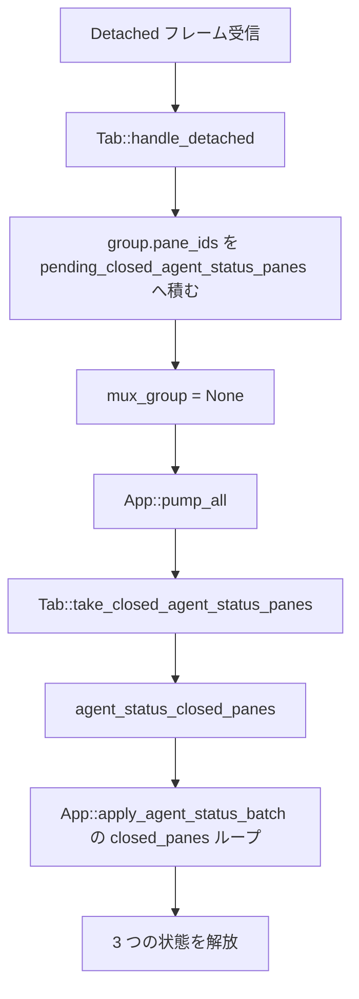

# mux-detach-agent-status-cleanup - 要件定義書

## 1. 概要

### 1.1 背景

mux 接続中のタブは、デーモンから届いた各ペインのエージェント状態を
`AgentStatusModel` に保持し、タブバッジと mux サイドバーに表示する。しかし
detach でタブが mux モードを抜けても、その接続が持っていたペインのエージェント
状態エントリが破棄されない。このため再 attach 直後（同じデーモンでも別のデーモン
でも）に、前の接続の状態がタブバッジおよび mux サイドバーに残って見える。

さらに、破棄されないのは `AgentStatusModel` のエントリだけでなく、
`(ConnectionScope, wire pane_id)` をキーとする公開ペイン ID の対応付け
（`App::mux_public_pane_ids`）と、通知のレート制限状態も同様であり、detach と
再 attach を繰り返すたびにこれらが単調増加する。

加えて `ConnectionScope` の doc コメント（`src-tauri/src/agent_status_model.rs:43-44`）
は「detach と再 attach をまたいでタブの生存期間中ずっと一定」と記述しており、
実装が提供していない寿命特性を主張している。

### 1.2 目的

- mux モードを抜けたタブが、直前の接続のエージェント状態を持ち越さないようにする。
- detach 時に、モデルエントリ・スコープ付き公開ペイン ID 対応・通知レート制限状態
  の 3 つを解放し、detach サイクルごとの単調増加を止める。
- `ConnectionScope` の doc コメントを実装された振る舞いに合わせて訂正する。

### 1.3 スコープ

**対象**:

- GUI 側の状態ライフサイクル（`src-tauri/src` 配下）。
- `Tab::handle_detached` における、グループの `pane_ids()` の
  `Tab::pending_closed_agent_status_panes` への積み込み。
- `src-tauri/src/agent_status_model.rs` の `ConnectionScope` doc コメント訂正。

**対象外**:

- mux ワイヤプロトコル（`crates/mux_ipc`）の変更。
- デーモン側の振る舞いの変更。
- ユーザーに見える設定の追加・変更。
- attach 世代カウンタの導入（`ConnectionScope` の導出は現状のまま維持する）。
- デザインステップ（後述 14.1 の通りスキップと決定済み）。

## 2. ビジネス要件

### 2.1 ビジネス目標

- mux モードを抜けたタブが直前の接続のエージェント状態を持ち越さず、再 attach
  （同一デーモン・別デーモンいずれも）ではその新しい接続のペインだけがタブバッジと
  mux サイドバーに現れる。
- エージェント状態の管理情報が detach サイクルをまたいで単調増加せず、モデル
  エントリ・スコープ付き公開ペイン ID 対応・通知レート制限状態がプロセス終了時では
  なく detach 時に解放される。
- `ConnectionScope` の doc コメントが、実装が提供していない寿命特性を主張しなく
  なり、後続の読み手が誤った不変条件の上に実装を積み上げない。

### 2.2 対象ユーザー

| ユーザータイプ | 説明 |
|----------------|------|
| eMterm の mux 利用者 | mux セッションへ attach / detach を繰り返し、タブバッジと mux サイドバーでエージェント状態を確認する利用者 |
| eMterm 開発者 | `ConnectionScope` の doc コメントを読んで、その寿命特性を前提に実装を行う開発者 |

### 2.3 期待される効果

- detach 後の再 attach で、前の接続に由来する状態表示が消える。
- detach / 再 attach を繰り返しても、状態管理のマップが現存ペイン分に収まる。
- `ConnectionScope` の doc コメントと実装の乖離が解消される。

## 3. ユースケース

### 3.1 ユースケース一覧

| ID | ユースケース名 | アクター | 優先度 |
|----|----------------|----------|--------|
| UC01 | mux セッションから detach する | mux 利用者 | 高 |
| UC02 | detach 後に同じタブで再 attach する | mux 利用者 | 高 |

### 3.2 ユースケース詳細

#### UC01: mux セッションから detach する

**アクター**: mux 利用者

**事前条件**:

- タブが mux セッションに attach しており、`Tab::mux_group` が `Some` である。
- グループ内のいずれかのペインが、報告済みのエージェント状態を持つ。

**基本フロー**:

1. 利用者が detach を行い、デーモンが `Detached` フレームを送る。
2. `Tab::handle_detached` が、`mux_group` をクリアする前にグループの `pane_ids()` を
   `Tab::pending_closed_agent_status_panes` に積む。
3. `App::pump_all` が `Tab::take_closed_agent_status_panes` でそれを取り出す。
4. `App::apply_agent_status_batch` の `closed_panes` ループが、各ペインについて
   モデルエントリ・スコープ付き公開ペイン ID 対応・通知レート制限状態を解放する。

**代替フロー**:

- ブリッジ死亡・接続喪失・PTY クローズによる mux モード離脱は、`App::pump_all` の
  reaped-tab ループまたは `App::close_tab` を経由して、既に同じ破棄義務を満たす。
- 同一 pump 内で同じペインに対して `PtyExited` と detach が重なった場合、同じペイン
  ID が 2 度現れうるが、2 度目の破棄は冪等な no-op となる。

**事後条件**:

- そのタブの集約バッジに、破棄したペイン由来の状態が現れない。
- 破棄したペインの `(ConnectionScope, wire pane_id)` に対する
  `App::mux_public_pane_id` が `None` を返す。
- タブ自身の `PaneKey::Tab(stable_id)` エントリと inferred-clear ラッチは残存する。

#### UC02: detach 後に同じタブで再 attach する

**アクター**: mux 利用者

**事前条件**:

- UC01 により detach 済みのタブがある。

**基本フロー**:

1. 利用者が同じタブで attach を行う。
2. 新しいデーモンとの接続が確立する。
3. 新しいデーモンから最初の `AgentStatusUpdate` が届くまでの間、タブバッジと
   mux サイドバーのペインバッジは空のままである。

**代替フロー**:

- 再 attach 先が別ホストのデーモンであっても、同一の根本原因・同一の修正で扱う。

**事後条件**:

- 前の接続の状態やエージェント名が表示されない。
- 新しいデーモンが供給するまで、新しい接続の wire ペイン ID に対する
  `App::mux_public_pane_id` は `None` を返す。

## 4. 機能要件

### 4.1 機能一覧

| ID | 機能名 | 説明 | 優先度 |
|----|--------|------|--------|
| FR1 | mux 離脱経路すべてでグループのペインエントリを破棄する | `mux_group` をクリアするすべての遷移が破棄義務を満たす | 高 |
| FR2 | detach は既存の closed_panes 破棄経路を再利用する | 並行する新しい破棄ルーチンを作らない | 高 |
| FR3 | ペインごとの 3 つの状態をすべて解放する | モデル・公開ペイン ID 対応・レート制限状態 | 高 |
| FR4 | ConnectionScope の導出は維持し doc を訂正する | 世代カウンタは導入しない | 中 |
| FR5 | detach で破棄するのは MuxPane エントリのみ | タブ自身のエントリは残す | 高 |
| FR6 | 再 attach 後のバッジは新しい接続のみを反映する | 前接続の持ち越しゼロ | 高 |

### 4.2 機能詳細

#### FR1: mux 離脱経路すべてでグループのペインエントリを破棄する

**説明**: `Tab::mux_group` のクリアによってタブを mux モードから外すすべての遷移が、
そのグループが保持していた wire ペイン ID のエージェント状態エントリを破棄する。
デーモン確認済みの `Detached` フレームだけが対象ではない。

調査により `mux_group = None` の代入は正確に 2 箇所（グループが空になったときの
`handle_pty_exited` = `src-tauri/src/tabs/mux_link.rs:823`、および `handle_detached`
= `src-tauri/src/tabs/mux_link.rs:878`）であり、加えて `mux_group` が `Some` のまま
`Tab::exited` が刈り取りを駆動するタブ死亡経路がある。このうち現状で何も破棄して
いないのは `handle_detached` のみで、`handle_pty_exited` は
`src-tauri/src/tabs/mux_link.rs:821` で削除済みペイン ID を既に積んでおり、ブリッジ
死亡・接続喪失・PTY クローズは `App::pump_all` の reaped-tab ループ
（`src-tauri/src/app/mod.rs:1473-1490`）または `App::close_tab`
（`src-tauri/src/app/tab_lifecycle.rs:147-154`）に到達し、どちらも
`agent_status_keys_for_tab` でグループを展開する。要件はこれらすべての経路が破棄
義務を満たすことであり、その状態に到達するために必要な変更は `handle_detached` に
限定される。

**ビジネスルール**:

- 破棄義務は経路ごとの個別実装ではなく、経路全体に対する不変条件として満たす。

#### FR2: detach は既存の closed_panes 破棄経路を再利用する

**説明**: `mux_group` をクリアする前に、`Tab::handle_detached`
（`src-tauri/src/tabs/mux_link.rs:872-912`）がグループの `pane_ids()` を
`Tab::pending_closed_agent_status_panes`（`src-tauri/src/tabs/mod.rs:421`）へ積む。
`App::pump_all` は既存の `Tab::take_closed_agent_status_panes`
（`src-tauri/src/tabs/mod.rs:858-860`）→ `agent_status_closed_panes`
（`src-tauri/src/app/mod.rs:1108-1112`）→ `App::apply_agent_status_batch` の
`closed_panes` ループ（`src-tauri/src/app/agent_status.rs:321-332`）という連鎖で
それを排出する。並行する破棄ルーチンは導入しない。

**処理フロー**:

**ビジネスルール**:

- `Tab::handle_detached` は `&mut App` を持たないため、既存のラッチ＆排出の間接構造を
  維持する。

#### FR3: ペインごとの 3 つの状態をすべて解放する

**説明**: 破棄する各ペインについて、既存の `closed_panes` ループが次を解放する。

**解放対象**:

- `AgentStatusModel` のエントリ: `AgentStatusModel::discard`
  （`src-tauri/src/agent_status_model.rs:264-269`）
- スコープ付き `mux_public_pane_ids` のエントリ: キーは
  `(ConnectionScope, wire pane_id)`（`src-tauri/src/app/mod.rs:228-229`）
- 通知のレート制限状態: キーは `agent_notification_rate_limit_key`
  （`src-tauri/src/app/agent_status.rs:98-113`）

**ビジネスルール**:

- 既存の順序制約を維持する。レート制限キーは、公開 ID 対応がまだ存在するうちに
  解決し、その後で対応エントリを削除する
  （`src-tauri/src/app/agent_status.rs:326-331`）。

**エラーケース**:

| ケース | 条件 | 対応 |
|--------|------|------|
| 同一ペインの二重破棄 | 同一 pump 内で `PtyExited` と detach が重なる | 2 度目の破棄は冪等な no-op |
| 公開 ID 対応が無い | そのペインが `AgentStatusUpdate` を一度も受けていない | レート制限キーは `mux:<scope>:<pane_id>` にフォールバックし、破棄は安全な no-op |

#### FR4: ConnectionScope の導出は維持し doc を訂正する

**説明**: `ConnectionScope` はすべての導出箇所（`src-tauri/src/app/agent_status.rs:25`,
`:306`, `:326`, `src-tauri/src/app/mux_ui.rs:499`, `src-tauri/src/render/mod.rs:317`）で
`ConnectionScope(tab.stable_id)` のままとする。attach 世代カウンタは追加しない。
`src-tauri/src/agent_status_model.rs:43-44` の doc コメントは、現在「detach と
再 attach をまたいでタブの生存期間中ずっと一定」と読めるところを、実装された振る舞い
（スコープ値は一定だが、それがキーとするエントリは detach で破棄され、再 attach で
作り直される）を記述するよう訂正する。

#### FR5: detach で破棄するのは MuxPane エントリのみ

**説明**: detach が破棄するのは `PaneKey::MuxPane(scope, pane_id)` のエントリのみ。
タブ自身の `PaneKey::Tab(tab.stable_id)` エントリと、`AgentStatusModel::discard` が
`PaneKey::Tab` キーとともに削除するタブ単位の inferred-clear ラッチ
（`src-tauri/src/agent_status_model.rs:264-269`）は、いずれも残存する。タブは自身の
キーで OSC 777 状態を報告し続ける通常タブに戻るためである。これは FR2 の
`closed_panes` ループ利用から導かれる（同ループは `PaneKey::MuxPane` しか構築しない
= `src-tauri/src/app/agent_status.rs:327`）。

#### FR6: 再 attach 後のバッジは新しい接続のみを反映する

**説明**: 同一タブで detach に続いて attach した後、新しいデーモンがまだ
`AgentStatusUpdate` を一度も送っていない時点で、そのタブに対する
`App::agent_status_badge_for`（`src-tauri/src/app/agent_status.rs:128-134`）と、
サイドバーの各エントリに対する `App::agent_status_pane_badge`
（`src-tauri/src/app/agent_status.rs:141-148`,
`src-tauri/src/render/mod.rs:314-322`）は、前の接続から持ち越した状態を報告しない。
また `App::mux_public_pane_id` は、新しいデーモンが供給するまで新しい接続の wire
ペイン ID に対して `None` を返す。

## 5. 非機能要件

### 5.1 パフォーマンス要件

- NFR1: 1 つのタブでの detach / 再 attach の反復により、
  `AgentStatusModel::entries`、`App::mux_public_pane_ids`、通知レート制限マップが
  サイクルごとに増加せず、現に生存しているペインの分に抑えられる。

### 5.2 セキュリティ要件

本フィーチャーに固有のセキュリティ要件は、requirements_analysis に含まれない。

### 5.3 可用性要件

本フィーチャーに固有の可用性要件は、requirements_analysis に含まれない。

### 5.4 保守性要件

- NFR4: `Tab::handle_detached` は `&mut App` にアクセスできない。修正は既存の
  ラッチ＆排出の間接構造を維持し、新たな借用経路やタブ層からモデルへの直接参照を
  導入しない。

### 5.5 互換性要件

- NFR2: mux ワイヤプロトコル（`crates/mux_ipc`）、デーモンの振る舞い、ユーザーに
  見える設定のいずれも変更しない。変更は `src-tauri/src` の GUI 側状態ライフ
  サイクルに限定する。
- NFR3: mux-agent-status-pane-key-collision の作業で得たスコープ分離の保証を
  すべて維持する。あるタブでの detach が別のタブの同番号 wire ペインに触れることは
  ない。すべてのキーが detach するタブ自身の `ConnectionScope(tab.stable_id)` から
  導出されるためである。
- NFR5: CLI 専用ビルド（`--no-default-features`）に影響しない。変更対象のモジュールは
  すべて GUI ゲート下にある。

## 6. UI/UX要件

### 6.1 画面設計要件

新規または変更されるユーザー向け表示面は無い。唯一の可視的効果は、既存のタブバッジと
mux サイドバーのエントリが古いデータを表示しなくなることであり、描画経路
（`render/mod.rs` / `ui::tab_bar` / `ui::mux_sidebar`）は変更しない。

### 6.2 画面遷移

画面遷移の変更は無い。

### 6.3 レスポンシブ対応

該当なし。

## 7. データ要件

### 7.1 データモデル概要

永続データのモデル変更は無い。detach 時に解放される実行時状態は次の 3 つ。

| 保持先 | キー | detach 時の扱い |
|--------|------|-----------------|
| `AgentStatusModel::entries` | `PaneKey::MuxPane(ConnectionScope, wire pane_id)` | 破棄する |
| `AgentStatusModel::entries` | `PaneKey::Tab(tab.stable_id)` | 残す |
| `App::mux_public_pane_ids` | `(ConnectionScope, wire pane_id)` | 破棄する |
| 通知レート制限マップ | `agent_notification_rate_limit_key` の結果 | 破棄する |

### 7.2 データ項目

上表のとおり。新規のデータ項目は追加しない。

### 7.3 データ保持期間

| データ種別 | 保持期間 |
|------------|----------|
| mux ペインのエージェント状態関連 3 状態 | 該当ペインが所属するグループが mux モードを離脱するまで（従来はプロセス終了まで） |

## 8. 外部連携

### 8.1 連携システム

| システム名 | 連携方法 | データ |
|------------|----------|--------|
| mux デーモン | 既存の mux ワイヤプロトコル（変更なし） | `Detached` / `Welcome` / `AgentStatusUpdate` フレーム |

### 8.2 API仕様要件

外部 API の追加・変更は無い。

## 9. 制約条件

### 9.1 技術的制約

- `Tab::handle_detached` は `&mut App` を持たない（NFR4）。
- `ConnectionScope` は `ConnectionScope(tab.stable_id)` のまま維持する（FR4）。
- 変更は GUI ゲート下のモジュールに限る（NFR5）。

### 9.2 ビジネス上の制約

- ユーザーに見える設定を追加・変更しない（NFR2）。

### 9.3 スケジュール制約

requirements_analysis にスケジュール制約の記載は無い。

### 9.4 宣言された変更集合

このフィーチャー固有のパスは手動で列挙せず、create-plan で `workflow.yaml` の各タスクの `files` から導出する（`references/phases/create-plan-phase.md`）。

**デフォルトメンバー**（SPEC作成者が明示的に除外しない限り、常に宣言に含まれる）:
- `feature-docs/mux-detach-agent-status-cleanup/**`
- `test-docs/mux-detach-agent-status-cleanup/**`

`feature-docs/{feature}/**` に含まれるもの: `REQUIREMENTS.md`、`SPEC.md`、`IMPLEMENTATION.md`、`workflow.yaml`、`phase-state/`、`tasks/`、`reviews/roundN.yaml`、`VERIFICATION.md`、`retrospect.yaml`、およびデザインステップが生成するデザイン成果物。生成主体は各フェーズドキュメントおよび `references/phase-state.md` を参照（引用のみ、ルールは再掲しない）。

`test-docs/{feature}/**` に含まれるもの: `{T}.tests.yaml`（パス形式: `test-docs/{feature}/{T}.tests.yaml`）。生成主体は `implement-phase.md` を参照（引用のみ、ルールは再掲しない）。

**意味論**:
- デフォルトのメンバーは、SPEC作成者が明示的に除外しない限り宣言に含まれる。除外は意図的な絞り込みであり、記載漏れによる省略ではない。
- この宣言はスーパーセット（superset）の主張であり、実際の変更集合は宣言に含まれる（CONTAINED IN）必要がある。実際には生成されないパスが宣言されていても違反にはならない。implementタスクを1つも生成しないフィーチャーは `test-docs/{feature}/` ディレクトリを生成しないが、宣言された `test-docs/{feature}/**` は依然として正しい。

## 10. 想定される課題とリスク

### 10.1 技術的課題

| 課題 | 影響度 | 対応策 |
|------|--------|--------|
| detach 側の積み込みが `PtyExited` 側と重複し、同じペイン ID を二重に積む | 中 | 二重破棄が冪等な no-op であることと、`PtyExited` 系列でペイン ID がちょうど 1 回だけ得られることをテストで担保する（TS-6） |
| 破棄がタブ自身の `PaneKey::Tab` エントリまで巻き込む | 中 | `closed_panes` ループが `PaneKey::MuxPane` しか構築しない性質に依拠し、テストで担保する（FR5 / TS-3） |
| レート制限キーの解決順序が崩れる | 中 | 公開 ID 対応の削除より前にキーを解決する既存順序を維持する（FR3） |

### 10.2 ビジネスリスク

requirements_analysis にビジネスリスクの記載は無い。

## 11. 成功基準

### 11.1 受け入れ基準

- [ ] AC-1: タブを mux セッションに attach し、あるペインを報告状態にし、`Detached`
      フレームを配送して pump したとき、タブの集約バッジがそのペイン由来の状態を
      報告せず、その `(scope, wire pane_id)` に対する `App::mux_public_pane_id` が
      `None` を返す。
- [ ] AC-2: detach 後、同一タブで新規 attach し、新しい `AgentStatusUpdate` が届く
      前の時点で、タブバッジと mux サイドバーのペインバッジが空である（前の接続の
      状態もエージェント名も表示されない）。
- [ ] AC-3: detach が、破棄した各ペインの通知レート制限アイデンティティを解放し、
      新しいデーモンが報告した同じ公開ペイン ID が前の接続のレート制限エントリで
      抑制されない。
- [ ] AC-4: 自身の通常タブ用エージェント状態が設定されているタブで detach しても、
      `PaneKey::Tab(stable_id)` エントリとその inferred-clear ラッチが無傷で残る。
- [ ] AC-5: 同じ wire ペイン ID を持つグループを抱えた 2 つのタブのうち一方で
      detach しても、他方のタブのエントリ・公開ペイン ID 対応・レート制限状態が
      変化しない。
- [ ] AC-6: `ConnectionScope` の doc コメントが、detach と再 attach をまたいで
      エントリが生存するという主張をしていない。
- [ ] AC-7: `--lib` スイート全体が通る。既存の
      mux-agent-status-pane-key-collision のスコープテスト（
      `src-tauri/src/app/tests/agent_status.rs` の TS-5, TS-6, TS-7）と、
      `src-tauri/src/app/tests/mux_ui.rs` の detach 駆動オーバーレイテストを含む。

### 11.2 KPI

requirements_analysis に KPI の記載は無い。

## 12. テストシナリオ

### 12.1 テスト観点

- [ ] 正常系 (TS-1 / AC-1, AC-3): mux グループを持つ app を構築し
      （`src-tauri/src/app/tests/mux_ui.rs:434` の `app_with_mux_windows` 相当の
      構築と、`src-tauri/src/app/tests/agent_status.rs:1044-1054` の直接的な
      `MuxWindowGroup::seed` 構築）、`App::on_mux_message` + `App::pump_all` で
      `AgentStatusUpdate` を配送し、バッジと `mux_public_pane_id` が埋まることを
      確認したうえで、`MuxMessage { msg_type: MessageType::Detached, pane_id: 0,
      payload: vec![] }` を配送して再度 pump し、バッジが `None`、
      `mux_public_pane_id` が `None` になることを検証する。
      （`src-tauri/src/app/tests/agent_status.rs`）
- [ ] 正常系 (TS-2 / AC-2, AC-6): TS-1 に、同じ wire ペイン ID を再利用した 2 度目の
      attach（`src-tauri/src/app/tests/mux_ui.rs:434-457` の `mux_welcome_message`
      に倣った `Welcome` メッセージ）を追加し、新しいデーモンの最初の
      `AgentStatusUpdate` が来るまでバッジが空のままであることを検証する。報告された
      再現手順に対する直接の回帰ガード。
      （`src-tauri/src/app/tests/agent_status.rs`）
- [ ] 境界値 (TS-3 / AC-4): mux に attach したタブ自身の `PaneKey::Tab(stable_id)`
      キーに通常タブ状態を設定し、detach 後の pump でもそのエントリが状態を報告し
      続けることを検証する。（`src-tauri/src/app/tests/agent_status.rs`）
- [ ] 境界値 (TS-4 / AC-5): wire ペイン ID 1 を両方のグループに種として持つ 2 つの
      タブを用意し（`src-tauri/src/app/tests/agent_status.rs:1043-1064` を踏襲）、
      タブ 0 を detach してタブ 1 のモデルエントリ・`mux_public_pane_id`・導出される
      レート制限キーが不変であることを検証する。
      （`src-tauri/src/app/tests/agent_status.rs`）
- [ ] 正常系 (TS-5 / AC-1): タブ層のテスト。種を入れたグループを持つタブに `Detached`
      フレームを適用すると `Tab::take_closed_agent_status_panes()` がグループの
      ペイン ID を返し（`src-tauri/src/tabs/tests/mux_link.rs:157` の既存 `PtyExited`
      アサーションに倣う）、2 度目の呼び出しでは空になることを検証する。
      （`src-tauri/src/tabs/tests/mux_link.rs`）
- [ ] 異常系 (TS-6 / AC-1): グループを空にする `PtyExited` 系列でも、各ペイン ID が
      ちょうど 1 回だけ得られることを検証する。detach 側の積み込みが、`PtyExited`
      アームが既に積んだ ID を二重に積んではならない。
      （`src-tauri/src/tabs/tests/mux_link.rs`）

### 12.2 特記すべきエッジケース

- 同一 pump 内で同じペインに対する detach と `PtyExited` が重なる場合、ペイン ID が
  排出リストに 2 度現れうる。2 度目の破棄は冪等な no-op でなければならない。
- 一度も `AgentStatusUpdate` を受けていないペインの detach では
  `mux_public_pane_ids` エントリが存在しないため、レート制限キーは
  `mux:<scope>:<pane_id>` にフォールバックする。破棄は安全な no-op でなければ
  ならない。
- 背景（非アクティブ）タブでの detach でも破棄は実行される。`pump_all` はすべての
  タブのラッチを排出するため。
- グループが複数ウィンドウを保持したままの detach では、アクティブなものだけでなく
  グループ内の全ペインが破棄される。

## 13. 用語定義

| 用語 | 定義 |
|------|------|
| detach | タブが mux セッションとの接続を離れ、`Tab::mux_group` がクリアされる遷移 |
| wire pane id | mux デーモンとの通信上で用いるペイン識別子 |
| 公開ペイン ID | `App::mux_public_pane_ids` が `(ConnectionScope, wire pane_id)` に対して保持する、表示用のペイン識別子 |
| `ConnectionScope` | `ConnectionScope(tab.stable_id)` として導出される、エージェント状態キーのスコープ |
| inferred-clear ラッチ | `AgentStatusModel::discard` が `PaneKey::Tab` キーとともに削除する、タブ単位の状態 |

## 14. 確認事項

### 14.1 確認済み事項

- [x] 対象とする mux 離脱経路の範囲 (`fr.detach-paths`): `mux_group` をクリアする
      すべての遷移（確認済み detach、ブリッジ死亡、接続喪失、PTY クローズ）を対象と
      する。デーモン確認済みの `Detached` フレームだけではない。
- [x] `ConnectionScope` の扱い (`fr.scope-generation`): 選択肢 (a) のみ。detach 時に
      グループのペイン ID を積んで既存の `closed_panes` 破棄経路を再利用する。
      `ConnectionScope` は `ConnectionScope(tab.stable_id)` のままとし、attach 世代
      カウンタは導入せず、doc コメントを実装された振る舞いに合わせて訂正する。
- [x] 通常タブエントリの扱い (`ec.plain-tab-entry`): detach は `PaneKey::MuxPane`
      エントリのみを破棄し、タブ自身の `PaneKey::Tab(stable_id)` エントリと
      inferred-clear ラッチは残す。
- [x] デザインステップ (`design.step`): スキップ。内部の状態ライフサイクル不具合修正
      であり、新規・変更されるユーザー向け表示面が無い（新規ウィジェット無し、
      レイアウト変更無し、新たな色・タイポグラフィ・スペーシングの決定無し、
      デザイントークンの消費無し）。

上記 4 件は、ユーザーではなくバッチポリシー（`fr.detach-paths` /
`fr.scope-generation` / `ec.plain-tab-entry` は codex 相談、`design.step` は
バッチ決定表）によって解決されたため、次節に前提として記録する。

### 14.2 前提（Assumptions）

- A-1 (`answers[fr.detach-paths]`, batch-codex-consultation): 要件は `mux_group` を
  クリアするすべての mux モード離脱遷移（確認済み detach、ブリッジ死亡、接続喪失、
  PTY クローズ）を対象とし、デーモン確認済みの `Detached` フレームだけではない。
  ユーザーではなくバッチポリシーで解決されたため前提として記録する。調査により、
  `handle_detached` 以外の経路はすべて既にこれを満たすことを確認済み。
- A-2 (`answers[fr.scope-generation]`, batch-codex-consultation): 修正は選択肢 (a)
  のみ。detach 時にグループのペイン ID を積み、既存の `closed_panes` 破棄経路を
  再利用する。`ConnectionScope` は `ConnectionScope(tab.stable_id)` のままとし、
  attach 世代カウンタは導入せず、その doc コメントを実装された振る舞いに合わせて
  訂正する。バッチポリシーにより前提として記録する。
- A-3 (`answers[ec.plain-tab-entry]`, batch-codex-consultation): detach は
  `PaneKey::MuxPane` エントリのみを破棄し、タブ自身の `PaneKey::Tab(stable_id)`
  エントリと inferred-clear ラッチは残る。バッチポリシーにより前提として記録する。
- A-4 (調査): 再現手順のクロスホスト症状（「別ホストへ再 attach すると旧ホストの
  状態が見える」）と、単一タブでの detach → 再 attach 症状は、同一の根本原因と
  同一の修正を共有する。クロスホスト固有の対応は不要。
- A-5 (調査): `MuxWindowGroup::pane_ids()` は `handle_detached` が動作する時点で
  グループ上から利用可能である（`src-tauri/src/app/agent_status.rs:28` の
  `agent_status_keys_for_tab` と `src-tauri/src/app/mux_ui.rs:503` で既に使われて
  いる）。新たなアクセサは不要。

### 14.3 未確認・保留事項

未解決の要件（`status: tbd`）は無い。

## 15. 参考資料

- SPEC: `feature-docs/mux-detach-agent-status-cleanup/SPEC.md`
- 既存のスコープ分離作業: mux-agent-status-pane-key-collision（スコープテストは
  `src-tauri/src/app/tests/agent_status.rs` の TS-5, TS-6, TS-7）
