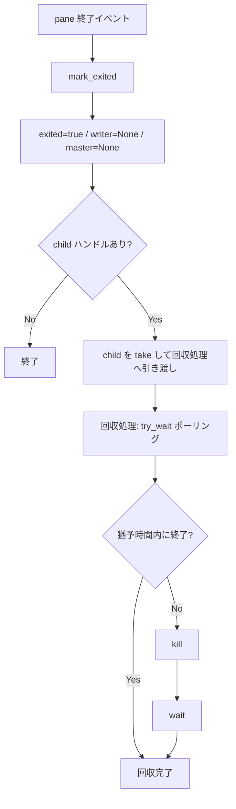

# mux pane の shell 子プロセス回収 (child reap) - 要件定義書

## 1. 概要

### 1.1 背景

mux daemon は pane ごとに PTY を開き、その slave 側で shell (`$SHELL`) を
spawn する。現在の実装 (`src-tauri/src/mux/ipc/pty_spawn.rs:109-111`) は
`portable_pty::SlavePty::spawn_command` の戻り値
`Box<dyn Child + Send + Sync>` を受け取らずに即座に drop している。

`std::process::Child` は Drop 時に `wait()` を呼ばない仕様のため
(portable_pty の Unix 実装も同じ)、shell が exit しても誰も
`waitpid()` を呼ばない。結果として PCB (process control block) が
ゾンビ (`<defunct>`) としてカーネルに残り続ける。

`MuxPane::mark_exited()` (`src-tauri/src/mux/session/pane.rs:1241`) も同様で、
`writer` と `master` を `None` にするだけで子プロセスの回収を行わない。

### 1.2 目的

mux daemon が長期常駐してもゾンビ shell プロセスが蓄積しない状態にする。
pane が終了したとき、対応する shell プロセスに対して確実に `waitpid()` 相当
(`portable_pty::Child::wait` / `try_wait`) が呼ばれるようにする。

### 1.3 スコープ

**対象**:

- `SpawnedPty` への child ハンドル保持
- `MuxPane` への child ハンドル保持と `mark_exited()` での回収
- pane 終了の全経路 (PTY EOF 経由の reap task、`DestroyPane`、
  `DestroyWindow`、daemon の `graceful_shutdown`) での回収保証
- 回収が daemon の非同期ランタイムをブロックしないこと
- 回収の回帰テスト

**対象外**:

- 既に蓄積したゾンビの事後回収コマンド (daemon 再起動で消えるため不要)
- Windows 固有のゾンビ問題への対処 (Windows は Job Object により自動回収
  されるため同じ現象は起きない。ただし child ハンドルの保持と回収呼び出し
  自体はプラットフォーム共通で入る)

## 2. ビジネス要件

### 2.1 ビジネス目標

長期常駐する mux daemon の健全性を保ち、障害調査時のプロセス可視性を確保する。

### 2.2 対象ユーザー

| ユーザータイプ | 説明 |
|----------------|------|
| eMterm mux 利用者 | mux daemon を数日〜数週間常駐させて使う利用者 |
| 開発者 / 調査者 | `ps` / `pgrep` / `pstree` で daemon の状態を調べる人 |

### 2.3 期待される効果

- ゾンビプロセスの蓄積が 0 になる
- PID 空間の圧迫リスクが解消される
- `ps` / `pgrep` / `pstree` の出力から「実際に生きている pane」が判別できる

## 3. ユースケース

### 3.1 ユースケース一覧

| ID | ユースケース名 | アクター | 優先度 |
|----|----------------|----------|--------|
| UC01 | shell が自然終了した pane の回収 | mux daemon | 高 |
| UC02 | pane / window の明示的な破棄 | 利用者 | 高 |
| UC03 | daemon のシャットダウン | 利用者 / OS | 高 |
| UC04 | shell が終了しない pane の強制クローズ | 利用者 | 中 |

### 3.2 ユースケース詳細

#### UC01: shell が自然終了した pane の回収

**アクター**: mux daemon

**事前条件**:

- pane が生成済みで shell プロセスが動いている

**基本フロー**:

1. 利用者が pane 内で `exit` するなどして shell が終了する
2. PTY reader スレッドが `read()` で EOF (`Ok(0)`) を受け取る
3. reader が `pane_exit_sender` 経由で daemon の reap task に pane_id を通知する
4. reap task が `handle_destroy_pane` を呼ぶ
5. `handle_destroy_pane` が pane を window から取り出し `mark_exited()` を呼ぶ
6. `mark_exited()` が child ハンドルを取り出して回収処理に引き渡す
7. 回収処理が `wait()` を完了し、カーネルから PCB が消える

**代替フロー**:

- 3 で通知チャネルが閉じている (daemon シャットダウン中) 場合、
  UC03 の経路で回収される

**事後条件**:

- 当該 shell プロセスがゾンビとして残っていない

#### UC02: pane / window の明示的な破棄

**アクター**: 利用者

**事前条件**:

- pane が生成済みで shell プロセスが動いている

**基本フロー**:

1. 利用者が pane / window を閉じる
2. `handle_destroy_pane` / `handle_destroy_window` が対象 pane の
   `mark_exited()` を呼ぶ
3. UC01 の 6-7 と同じ

**事後条件**:

- 当該 shell プロセスがゾンビとして残っていない

#### UC03: daemon のシャットダウン

**アクター**: 利用者 / OS

**基本フロー**:

1. daemon がシャットダウンシグナルを受け取る
2. `graceful_shutdown` が全 session / window / pane を走査し、
   未 exit の pane に `mark_exited()` を呼ぶ
3. UC01 の 6-7 と同じ

**事後条件**:

- daemon プロセス終了前に全 shell が回収されている、または回収処理が
  daemon 終了までに完了する

#### UC04: shell が終了しない pane の強制クローズ

**アクター**: 利用者

**事前条件**:

- shell (またはその前面ジョブ) が SIGHUP を無視するなどして生き残っている

**基本フロー**:

1. UC02 と同様に pane が破棄され、PTY master が drop される
2. 回収処理が `try_wait()` で終了を待つが、猶予時間内に終了しない
3. 回収処理が `kill()` を送る
4. `wait()` で回収する

**事後条件**:

- 回収処理が無期限にブロックしない
- 当該 shell プロセスがゾンビとして残っていない

## 4. 機能要件

### 4.1 機能一覧

| ID | 機能名 | 説明 | 優先度 |
|----|--------|------|--------|
| F01 | child ハンドルの保持 | `spawn_command` の戻り値を `SpawnedPty` → `MuxPane` へ持ち回る | 高 |
| F02 | pane 終了時の回収 | `mark_exited()` で child を取り出し回収処理へ渡す | 高 |
| F03 | ノンブロッキング回収 | 回収が daemon の async ランタイム / ロック保持者をブロックしない | 高 |
| F04 | タイムアウトと強制終了 | 猶予時間内に終了しない子には `kill()` してから `wait()` | 高 |
| F05 | 多重回収の安全性 | `mark_exited()` が複数回呼ばれても二重 wait しない | 高 |
| F06 | 回帰テスト | ゾンビが残らないことを検証するテスト | 高 |

### 4.2 機能詳細

#### F01: child ハンドルの保持

**説明**: `spawn_pty` が `spawn_command` の戻り値を破棄せず保持し、
`register_pane_and_start_reader` を経由して `MuxPane` に渡す。

**入力**: なし (`spawn_pty` 内部の変更)

**出力**: `SpawnedPty.child: Box<dyn portable_pty::Child + Send + Sync>`

**ビジネスルール**:

- テスト用コンストラクタ (`MuxPane::new_test` 系) は child を持たない
  (`None`) 状態で生成でき、回収処理は no-op になる

#### F02: pane 終了時の回収

**説明**: `MuxPane::mark_exited()` が保持している child ハンドルを取り出し、
回収処理に引き渡す。

**処理フロー**:

**エラーケース**:

| エラー | 条件 | 対応 |
|--------|------|------|
| `wait()` が Err | 既に他所で回収済み等 (ECHILD) | warn ログを出して処理を終える |
| `kill()` が Err | 既に終了済み | 無視して `wait()` へ進む |

#### F03: ノンブロッキング回収

**説明**: `mark_exited()` は `SessionManager` の tokio Mutex を保持した状態で
呼ばれる経路がある (`handle_destroy_pane` / `handle_destroy_window` /
`graceful_shutdown`)。そこで `wait()` をブロッキング実行すると daemon 全体が
止まるため、回収は呼び出しスレッドの外で行う。

**ビジネスルール**:

- `mark_exited()` 自体は即座に返る (ハンドルを引き渡すだけ)

#### F04: タイムアウトと強制終了

**説明**: `try_wait()` を一定間隔でポーリングし、猶予時間を超えたら
`kill()` を送ってから `wait()` する。

**バリデーション**:

| 項目 | ルール |
|------|--------|
| 猶予時間 | 有限であること (無期限待機をしない) |
| ポーリング間隔 | 猶予時間より十分短いこと |

#### F05: 多重回収の安全性

**説明**: `mark_exited()` は `handle_destroy_pane` と `graceful_shutdown` の
両方から同一 pane に対して呼ばれうる。`Option::take` により 2 回目以降は
child が `None` になり、回収処理は起動しない。

#### F06: 回帰テスト

**説明**: pane の生成と破棄を繰り返した後、子プロセスがゾンビとして
残っていないことを検証する。

## 5. 非機能要件

### 5.1 パフォーマンス要件

- `mark_exited()` の実行時間: 子プロセスの終了状態に依存しない (即座に返る)
- 回収処理が daemon の他の pane の入出力レイテンシに影響しない

### 5.2 セキュリティ要件

- 回収対象は daemon 自身が spawn した子プロセスのハンドルのみ。
  PID を外部から受け取って `kill` する経路は作らない

### 5.3 可用性要件

- 回収処理の失敗 (`wait()` の Err など) が daemon のクラッシュや
  pane 破棄処理の失敗につながらない

### 5.4 保守性要件

- 回収の失敗は `log::warn!` 以上で記録する (リリースビルドで残る水準)
- 回収ロジックは PTY を伴わずに単体テストできる形で切り出す

### 5.5 互換性要件

- Linux / Windows の両方でビルドが通る
- `--no-default-features` (CLI-only) ビルドに影響しない
  (mux は `gui` feature 配下)

## 6. UI/UX要件

該当なし。利用者から見える UI 変更はない。

## 7. データ要件

該当なし。永続データの追加・変更はない。

## 8. 外部連携

### 8.1 連携システム

| システム名 | 連携方法 | データ |
|------------|----------|--------|
| OS プロセステーブル | `waitpid` / `kill` (portable_pty 経由) | 子プロセスの終了ステータス |

## 9. 制約条件

### 9.1 技術的制約

- `portable_pty::Child` は `std::process::Child` と同様に Drop 時に
  `wait()` を呼ばない。明示的に呼ぶ必要がある
- `portable_pty 0.8.1` の `Child` トレイトは `try_wait()` / `wait()` /
  `process_id()` を、スーパートレイト `ChildKiller` は `kill()` /
  `clone_killer()` を提供する
- `spawn_command` の戻り値は `Box<dyn Child + Send + Sync>` なので
  スレッド間の受け渡しが可能
- `mark_exited()` は `SessionManager` の tokio Mutex 保持下で呼ばれる
  経路があるため、そこで blocking wait はできない

### 9.2 ビジネス上の制約

なし。

## 10. 想定される課題とリスク

### 10.1 技術的課題

| 課題 | 影響度 | 対応策 |
|------|--------|--------|
| shell が SIGHUP を無視して残り続ける | 中 | 猶予時間後に `kill()` してから `wait()` |
| daemon 終了時に回収スレッドが完了しない | 低 | daemon 終了で子は init に引き取られ init が reap する |
| 回帰テストが CI 環境で PTY を開けない | 中 | Unix 限定 + PTY 生成失敗時はテストをスキップ |

### 10.2 ビジネスリスク

なし。

## 11. 成功基準

### 11.1 受け入れ基準

- [ ] `SpawnedPty` が `spawn_command` の戻り値を保持する
- [ ] `MuxPane` が child ハンドルを保持し、`mark_exited()` で回収へ引き渡す
- [ ] PTY EOF 経由の reap task 経路で回収が実行される
- [ ] `DestroyPane` / `DestroyWindow` / `graceful_shutdown` の各経路で
      回収が実行される
- [ ] 回収が無期限にブロックしない (猶予時間 + `kill` + `wait`)
- [ ] pane を N 回開閉した後にゾンビが 0 であることを検証するテストが通る

### 11.2 KPI

| 指標 | 目標値 | 測定方法 |
|------|--------|----------|
| daemon 常駐 1 週間後のゾンビ数 | 0 | `ps --ppid <daemon_pid> -o stat` に `Z` が無いこと |

## 12. テストシナリオ

### 12.1 テスト観点

- [ ] 正常系: shell が自然終了 → `mark_exited` → ゾンビが残らない
- [ ] 正常系: `DestroyPane` / `DestroyWindow` / `graceful_shutdown` の各経路
- [ ] 異常系: `mark_exited()` を 2 回呼んでも問題が起きない
- [ ] 異常系: 既に回収済みの子に対する `wait()` の Err がクラッシュしない
- [ ] 境界値: 終了しない子プロセスに対する猶予時間超過 → `kill` → 回収
- [ ] パフォーマンス: `mark_exited()` が子の終了を待たずに即座に返る

## 13. 用語定義

| 用語 | 定義 |
|------|------|
| ゾンビ (`<defunct>`) | 終了したが親が `waitpid()` していないため PCB がカーネルに残っている状態のプロセス |
| PCB | Process Control Block。カーネル内のプロセス管理構造体 |
| reap | 親プロセスが `waitpid()` を呼んで子の終了ステータスを回収し、PCB を解放すること |
| pane | mux におけるひとつの PTY + shell プロセスの単位 |

## 14. 確認事項

### 14.1 確認済み事項

Notion タスクページ本文で明示的に指定された事項:

- [x] `SpawnedPty` に `child` フィールドを追加して `spawn_command` の戻り値を保持する
- [x] `MuxPane` に child ハンドルを保持させ、`mark_exited()` で `wait()` / `try_wait()` を呼ぶ
- [x] reap task / 強制 kill パス / daemon shutdown の各経路で回収が抜けないこと
- [x] 回収は blocking にせず別スレッドまたは `try_wait()` で non-blocking にする
- [x] force close 時は timeout 付き、必要なら SIGKILL してから wait
- [x] 回帰テストで `<defunct>` が 0 であることを確認する
- [x] Windows でも child ハンドルの保持自体は入れる (ゾンビ現象自体は起きない)
- [x] 既存ゾンビの事後回収コマンドは作らない

### 14.2 未確認・保留事項

batch モードのため利用者への確認は行っていない。以下は本エージェントが
決定した事項で、SPEC.md の Assumptions に記録している。

- [ ] 回収実行の具体的な機構 (専用スレッド / spawn_blocking / 都度スレッド)
- [ ] 猶予時間とポーリング間隔の具体値
- [ ] 回帰テストの実装形態 (in-process 単体テスト / 外部 integration test)

## 15. 参考資料

- Notion タスク: [https://www.notion.so/3a73509ec8ee8164a65de98cb7b217df](https://www.notion.so/3a73509ec8ee8164a65de98cb7b217df)
- `src-tauri/src/mux/ipc/pty_spawn.rs:79-127` — `spawn_pty` (child が drop されている箇所)
- `src-tauri/src/mux/session/pane.rs:939-1241` — `MuxPane` 定義と `mark_exited`
- `src-tauri/src/mux/daemon.rs:1120-1151` — reap task と `graceful_shutdown`
- `src-tauri/src/mux/ipc/handlers.rs:169-375` — `handle_destroy_pane` / `handle_destroy_window`
- portable-pty 0.8.1 `src/lib.rs:126-159` — `Child` / `ChildKiller` トレイト定義
