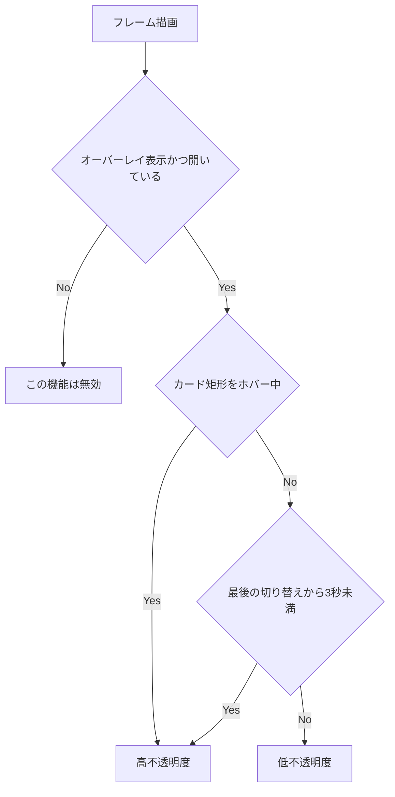
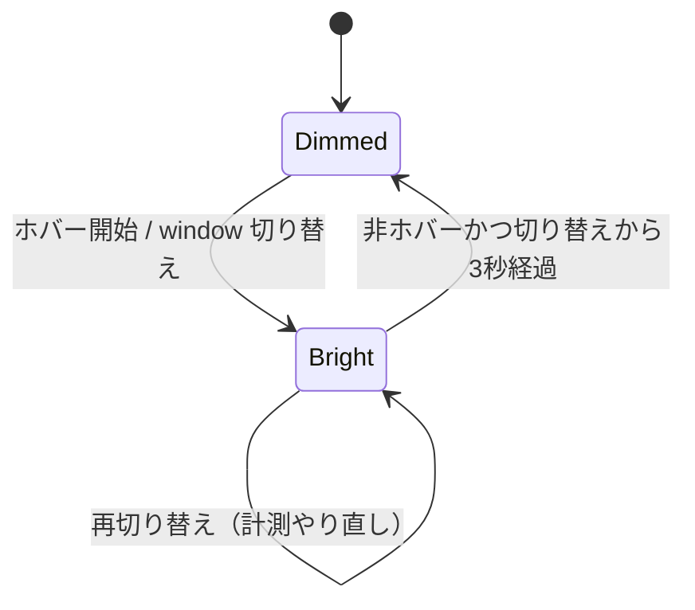

# mux window リストのオーバーレイ透過制御 - 要件定義書

## 1. 概要

### 1.1 背景

mux window リスト（サイドバー）をオーバーレイ表示にすると、ターミナル領域を狭めずにフルサイズで
一覧できる。一方でオーバーレイはターミナルの右側に重なるため、ターミナル出力の右端に文字列が
あると読みづらい。キーバインド（prefix + `Ctrl+W`）でトグルして消すことはできるが、必要なたびに
操作するのは手間になる。

### 1.2 目的

- オーバーレイ表示をデフォルトの表示方式にする
- オーバーレイを「操作している間ははっきり見える」「操作していない間は背後のターミナル文字が
  読める」状態に自動で切り替える

### 1.3 スコープ

**対象**

- `mux.window_sidebar_overlay` のデフォルト値
- オーバーレイ表示時のサイドバーカードの不透明度（カード全体：背景・文字・バッジ・影）
- 不透明度を切り替えるトリガ（マウスホバー / キー操作による mux window 切り替え / 3 秒経過）
- 上記を成立させるための再描画スケジューリング（フレームスキップゲートと `ControlFlow::WaitUntil`）

**対象外**

- 常時表示（persistent）モードの見た目
- トグル機能の廃止・変更（現状のトグルは残す）
- 不透明度をユーザー設定として公開すること
- サイドバーのレイアウト・幅・配置・行の描画内容

## 2. ビジネス要件

### 2.1 ビジネス目標

AI コーディングツール（Claude Code 等）を mux で複数 window に並べて使う際、window 一覧の
視認性とターミナル出力の可読性を、ユーザー操作なしで両立させる。

### 2.2 対象ユーザー

| ユーザータイプ | 説明 |
|----------------|------|
| mux 利用者 | eMterm の mux で複数 window を並行運用するユーザー |

### 2.3 期待される効果

- オーバーレイをトグルで消す操作が不要になる
- ターミナル右端の出力がオーバーレイに隠されて読めない状況が解消される
- オーバーレイの利点（ターミナル領域を狭めずフルサイズ表示）を常時享受できる

## 3. ユースケース

### 3.1 ユースケース一覧

| ID | ユースケース名 | アクター | 優先度 |
|----|----------------|----------|--------|
| UC01 | キー操作で mux window を切り替えて一覧を確認する | mux 利用者 | 高 |
| UC02 | マウスでサイドバーを見る / クリックして切り替える | mux 利用者 | 高 |
| UC03 | 操作せずターミナル出力を読む | mux 利用者 | 高 |

### 3.2 ユースケース詳細

#### UC01: キー操作で mux window を切り替えて一覧を確認する

**アクター**: mux 利用者

**事前条件**:

- mux にアタッチしたタブが表示されている
- サイドバーがオーバーレイ表示で開いている

**基本フロー**:

1. ユーザーが prefix + next/prev/数字で mux window を切り替える
2. サイドバーが即座に高不透明度（現状の見た目）になり、切り替え後のアクティブ行が判別できる
3. 3 秒間追加操作が無ければ、サイドバーが低不透明度に下がり背後のターミナル文字が読める

**代替フロー**:

- 3 秒経過前にもう一度切り替えると、3 秒の計測がやり直される
- 3 秒経過前にマウスがサイドバー上に乗ると、ホバーしている間は高不透明度が維持される

**事後条件**:

- サイドバーは低不透明度（アイドル状態）に戻っている

#### UC02: マウスでサイドバーを見る / クリックして切り替える

**アクター**: mux 利用者

**事前条件**: UC01 と同じ

**基本フロー**:

1. ユーザーがマウスカーソルをオーバーレイカードの上に移動する
2. サイドバーが高不透明度になる
3. ユーザーが行をクリックして window を切り替える（任意）
4. カーソルをカードの外に出す
5. サイドバーが低不透明度に下がる

**代替フロー**:

- 直前にキー操作で切り替えており 3 秒が経過していない場合、カーソルを外しても残り時間は
  高不透明度を維持する

**事後条件**: サイドバーは低不透明度に戻っている

#### UC03: 操作せずターミナル出力を読む

**アクター**: mux 利用者

**事前条件**: サイドバーがオーバーレイ表示で開いており、直近 3 秒に切り替え操作もホバーも無い

**基本フロー**:

1. サイドバーは低不透明度で表示されている
2. ユーザーはサイドバーに重なった位置のターミナル文字を読める

**事後条件**: 状態は変化しない

## 4. 機能要件

### 4.1 機能一覧

| ID | 機能名 | 説明 | 優先度 |
|----|--------|------|--------|
| F01 | オーバーレイをデフォルト表示方式にする | 設定未保存時の表示方式をオーバーレイにし、初期状態で開いた状態にする | 高 |
| F02 | ホバー時の高不透明度 | カード矩形上にポインタがある間は高不透明度にする | 高 |
| F03 | window 切り替え時の高不透明度 | mux window 切り替え直後に高不透明度にする | 高 |
| F04 | アイドル時の低不透明度 | 非ホバーかつ切り替えから 3 秒経過で低不透明度にする | 高 |
| F05 | 状態遷移の再描画保証 | 不透明度が変わるフレームが描画されるようスケジューリングする | 高 |

### 4.2 機能詳細

#### F01: オーバーレイをデフォルト表示方式にする

**説明**: `mux.window_sidebar_overlay` のデフォルト値を `true` に変更する。あわせて、オーバーレイの
開閉ランタイムフラグの初期値を「開いている」にする。これが無いと、デフォルトがオーバーレイに
なった時点でサイドバーが初期状態で見えなくなり、従来（常時表示）より情報が減る。

**入力**: `settings.json` の `mux.window_sidebar_overlay`（省略可）

**出力**: 表示方式（オーバーレイ / 常時表示）と初期開閉状態

**ビジネスルール**:

- 設定ファイルにキーが無い場合はオーバーレイ表示
- 設定ファイルに明示的に `false` が保存されている場合は常時表示（既存ユーザーの設定を尊重する）
- トグル操作（prefix + `Ctrl+W`）は従来どおり開閉を切り替える

#### F02: ホバー時の高不透明度

**説明**: オーバーレイカードの矩形内にマウスポインタがある間、カードを高不透明度で描画する。

**ビジネスルール**:

- 判定対象はオーバーレイカードの矩形のみ（常時表示モードでは判定しない）
- ホバー判定はカード外周のクリック判定と同じ矩形を用いる

#### F03: window 切り替え時の高不透明度

**説明**: mux window が切り替わった時点で高不透明度にし、3 秒の計測を開始（再開始）する。

**ビジネスルール**:

- キー操作（next / prev / 数字選択）での切り替えを契機とする
- サイドバー行のクリックによる切り替えも同じ契機として扱う
- 切り替えが連続した場合は最後の切り替えを起点に計測し直す

#### F04: アイドル時の低不透明度

**説明**: 「ホバーしていない」かつ「最後の window 切り替えから 3 秒以上経過している」とき、
カードを低不透明度で描画する。背後のターミナル文字が読める水準まで透過させる。

**処理フロー**:

**ビジネスルール**:

- 起動直後（切り替え履歴が無い状態）は低不透明度
- 低不透明度への遷移は短いフェードで行い、高不透明度への復帰は即座に行う
- 不透明度はカード全体（背景・文字・バッジ・影）に効かせる。背景だけ透過させても文字が
  残ると背後のターミナル文字が読めないため

#### F05: 状態遷移の再描画保証

**説明**: フレームスキップゲートと待機スケジューリングに、この機能の遷移条件を組み込む。

**ビジネスルール**:

- グリッドに変化が無いフレームをスキップするゲートに、不透明度アニメーション中および
  3 秒しきい値の到来を「描画すべき仕事あり」として加える
- 3 秒しきい値とフェード中のフレームは待機デッドラインとして登録する
- ポインタ移動のみでは再描画されない現状の入力ゲートに対し、カード矩形の内外をまたぐ
  ホバー状態変化で再描画を起こす

**エラーケース**:

| エラー | 条件 | 対応 |
|--------|------|------|
| 不透明度が中間値で止まる | フェード中のフレームがスキップされる | スキップゲートにフェード中フラグを加える |
| ホバーしても明るくならない | ポインタ移動が再描画契機に含まれない | ホバー状態変化を再描画契機に加える |

## 5. 非機能要件

### 5.1 パフォーマンス要件

- アイドル時（フェード完了後・非ホバー・3 秒経過後）に継続的な再描画を発生させない
- ホバー追従とフェードによる CPU 使用の増加は、既存の visual bell フェードと同等の範囲に収める

### 5.2 セキュリティ要件

該当なし（ローカル UI の描画のみ。入力の外部送出・永続化の追加は無い）

### 5.3 可用性要件

該当なし

### 5.4 保守性要件

- 不透明度の値とフェード時間・待機時間は名前付き定数として 1 箇所に定義する
- 色は既存の MD3 ヘルパ経由で生成し、生の色コンストラクタを増やさない（既存テストの制約）

### 5.5 互換性要件

- 既存の `settings.json` に `mux.window_sidebar_overlay: false` が保存されている環境では
  従来の常時表示が維持される
- Linux / Windows いずれのビルドでも同じ挙動になる

## 6. UI/UX要件

### 6.1 画面設計要件

- 対象はオーバーレイ表示時の mux window リストのカードのみ
- 角丸・影・配置・幅・行レイアウトは現状を変えない
- 高不透明度は現状の見た目を維持する
- 低不透明度は背後のターミナル文字が判読できる水準にする

### 6.2 画面遷移

### 6.3 レスポンシブ対応

ウィンドウサイズに応じたカード矩形の算出は現状の仕組みを流用する

## 7. データ要件

永続データの追加は無い。追加されるのはランタイム状態（最後の切り替え時刻、ホバー状態、
フェード進行）のみ。

## 8. 外部連携

該当なし

## 9. 制約条件

### 9.1 技術的制約

- `ctx.request_repaint_after` はリリースビルドで winit 側に伝播しないため、待機は
  `ControlFlow::WaitUntil` 経路で行う
- グリッドが clean なフレームをスキップするゲートを通過させないと中間フレームが落ちる
- ポインタ移動は現状「意味のある入力」として扱われておらず、ホバーだけではフレームが進まない
- オーバーレイの角丸 12px と現状の不透明度 0.92 は既存テストで固定されている
- サイドバーのモジュール内で生の色コンストラクタを使うことは既存テストで禁止されている

### 9.2 ビジネス上の制約

- 既存のトグル機能を廃止しない

### 9.3 スケジュール制約

該当なし

## 10. 想定される課題とリスク

### 10.1 技術的課題

| 課題 | 影響度 | 対応策 |
|------|--------|--------|
| フレームスキップゲートで中間フェードが落ちる | 高 | ゲートの判定式にフェード中・しきい値到来を加える |
| ホバー変化で再描画が起きない | 高 | カード矩形の内外判定の変化を再描画契機にする |
| アイドル時に常時再描画してしまい CPU が上がる | 中 | 待機デッドラインはフェード中としきい値到来時のみ登録する |
| 既存テストが固定している 0.92 と衝突する | 中 | 高不透明度側の値は 0.92 を維持し、テストの意図を保つ |
| デフォルト変更で既存ユーザーの見た目が変わる | 中 | 明示保存された `false` は尊重し、未保存時のみ変更する |

### 10.2 ビジネスリスク

| リスク | 発生確率 | 影響度 | 対応策 |
|--------|----------|--------|--------|
| 低不透明度が薄すぎて一覧が読めない | 中 | 中 | 実機確認の上で定数を調整できるよう 1 箇所に定義する |

## 11. 成功基準

### 11.1 受け入れ基準

- [ ] デフォルト（設定未保存）でオーバーレイ表示になり、初期状態で開いている
- [ ] マウスをカード上に乗せると高不透明度（現状の見た目）になる
- [ ] キー操作で mux window を切り替えた直後に高不透明度になる
- [ ] 非ホバー状態では低不透明度になり、背後のターミナル文字が読める
- [ ] キー操作で切り替えてから 3 秒後に低不透明度になる
- [ ] トグル（prefix + `Ctrl+W`）で従来どおり開閉できる
- [ ] 常時表示モード（`false` を明示保存）の見た目が変わらない
- [ ] アイドル時に継続的な再描画が発生しない

### 11.2 KPI

該当なし

## 12. テストシナリオ

### 12.1 テスト観点

- [ ] 正常系: 非ホバー・切り替え無しで低不透明度になる
- [ ] 正常系: ホバー中は高不透明度になる
- [ ] 正常系: 切り替え直後は高不透明度、3 秒後に低不透明度になる
- [ ] 境界値: 3 秒ちょうど / 直前 / 直後の判定
- [ ] 境界値: カード矩形の境界上のポインタ位置
- [ ] 異常系: 切り替えを連続した場合に計測が最後の切り替え起点になる
- [ ] 異常系: 3 秒経過前にホバーして外した場合、残り時間は高不透明度が続く
- [ ] 互換性: `window_sidebar_overlay: false` 明示保存時に常時表示が維持される
- [ ] パフォーマンス: アイドル時に待機デッドラインが登録されない

## 13. 用語定義

| 用語 | 定義 |
|------|------|
| オーバーレイ表示 | mux window リストをターミナル領域の上に重ねて浮かせる表示方式 |
| 常時表示 | mux window リストを右側パネルとして常に確保する表示方式 |
| 高不透明度 | 現状のオーバーレイと同じ、はっきり見える不透明度 |
| 低不透明度 | 背後のターミナル文字が読める、薄い不透明度 |
| 切り替え | mux window の next / prev / 数字選択、およびサイドバー行クリックによる遷移 |

## 14. 確認事項

### 14.1 確認済み事項

Notion タスク本文で明示されている内容を決定事項として扱う。

- [x] デフォルトをオーバーレイ表示にする: 実施する
- [x] ホバー中の不透明度: 現状の不透明度を使う
- [x] キー操作の切り替え直後の不透明度: 現状の不透明度を使う
- [x] ホバーを外した時: 不透明度を上げる（透過を強める）
- [x] キー操作の切り替えから 3 秒後: 不透明度を上げる（透過を強める）
- [x] トグル機能: 残す

### 14.2 未確認・保留事項

以下は無人実行のため本エージェントが決定した（SPEC.md の Assumptions に記載）。

- [ ] 低不透明度の具体値（実機確認で調整の余地あり）
- [ ] 低不透明度へのフェード時間
- [ ] オーバーレイの初期開閉状態を「開いている」にする判断
- [ ] サイドバー行クリックによる切り替えも 3 秒計測の契機に含める判断

## 15. 参考資料

- Notion タスク: [https://www.notion.so/3ab3509ec8ee808fbf9bedd14ee73eba](https://www.notion.so/3ab3509ec8ee808fbf9bedd14ee73eba)
- 既存実装: `src-tauri/src/ui/mux_sidebar.rs`, `src-tauri/src/app.rs`, `src-tauri/src/window_host.rs`
- 設定スキーマ: `crates/app_settings/src/settings.rs`, `src-tauri/web-shared/settings/types.ts`
