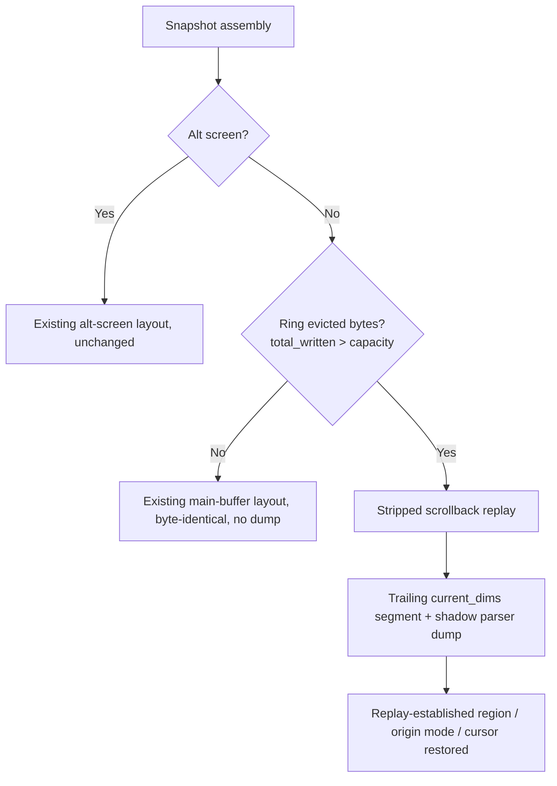

# mux-snapshot-ring-wrap-restore - Requirements

## 1. Overview

### 1.1 Background

A mux main-buffer pane can lose lines that an application wrote only once and never redraws, such as top's column header, after a tab switch, reattach or visibility resume. This happens once the per-pane scrollback ring has wrapped (total_written > capacity) and has evicted the bytes that drew those lines.

### 1.2 Purpose

- After a tab switch, reattach or visibility resume, a mux main-buffer pane shows the same visible content it had before, including lines written only once.
- A regression test catches the loss of a once-written line after the per-pane scrollback ring wraps.

### 1.3 Scope

- In scope: daemon-side snapshot byte assembly for main-buffer panes whose scrollback ring has evicted bytes, at every snapshot assembly site (visible reattach, on-demand RequestPaneSnapshot, resume_pane_with_permit, the resume branch of evaluate_output_target), plus the ScrollbackRingBuffer wrap state.
- Unchanged: non-wrapped main-buffer snapshots, alt-screen snapshots, DEFAULT_SCROLLBACK_CAPACITY.
- Out of scope: the hot-upgrade handoff (capture / load_snapshot) (NFR7).

## 2. Business Requirements

### 2.1 Business Objectives

- After a tab switch, reattach or visibility resume, a mux main-buffer pane shows the same visible content it had before. This includes lines an application wrote only once and never redraws, such as top's column header.
- A regression test catches the loss of a once-written line after the per-pane scrollback ring wraps.

### 2.2 Target Users

| User type | Description |
|-----------|-------------|
| mux user | A user running an application (for example top or apt) in a mux main-buffer pane and switching tabs, reattaching or resuming visibility |

### 2.3 Expected Effects

- The visible region of a main-buffer pane whose ring has wrapped matches the daemon shadow parser's current screen after a snapshot.
- Loss of a once-written line after ring wrap is detected by a regression test.

## 3. Use Cases

### 3.1 Use Case List

| ID | Use case | Actor | Priority |
|----|----------|-------|----------|
| UC01 | Return to a mux main-buffer pane whose ring has wrapped | mux user | High |

### 3.2 Use Case Details

#### UC01: Return to a mux main-buffer pane whose ring has wrapped

**Actor**: mux user

**Preconditions**:
- An application writes a line once and never redraws it (for example top's column header).
- The pane's scrollback ring has evicted bytes (total_written > capacity).

**Basic flow**:
1. The user switches tabs away and back, reattaches, or the pane resumes visibility.
2. The daemon assembles a snapshot for the pane.
3. The client replays the snapshot.

**Alternative flows**:
- The ring has not evicted bytes (total_written <= capacity): the snapshot is byte-identical to the current layout, with no daemon vt100 dump (FR3).
- The pane is on the alt screen: the alt-screen snapshot layout is unchanged (FR4).

**Postconditions**:
- The visible region matches the shadow parser's current screen, including the once-written line (FR2).
- PTY output that continues after the snapshot lands where it would on a terminal that received the whole stream (FR9).

## 4. Functional Requirements

### 4.1 Function List

| ID | Function | Description | Priority |
|----|----------|-------------|----------|
| FR1 | Reproduction test first | Add a unit test that shows the header row missing after ring wrap on pre-fix code | High |
| FR2 | Post-wrap main-buffer restore (plan A) | Append the shadow parser's visible-screen dump after the stripped scrollback replay when the ring has evicted bytes | High |
| FR3 | Non-wrapped main-buffer unchanged | Non-wrapped main-buffer snapshots stay byte-identical, with no dump | High |
| FR4 | Alt-screen unchanged | Alt-screen snapshot layouts are unchanged | High |
| FR5 | All assembly sites covered | The post-wrap behaviour applies at every snapshot assembly site | High |
| FR6 | Consistent wrap-state read | The ring exposes its wrap state, read in the same lock acquisition as read_segments | High |
| FR7 | Dump dimension segment | The trailing (screen_pos, current_dims) segment rule applies to the dump | High |
| FR8 | Dump is not distorted by replay-left terminal state | The dump lands at the shadow parser's row indices under a replay-left DECSTBM or DECOM | High |
| FR9 | Replay-established state restored after the dump | Scroll region, origin mode and cursor state established by the replay are in effect again after the dump | High |
| FR10 | Regression tests | Screen-comparison tests cover the fix | High |

### 4.2 Function Details

#### FR1: Reproduction test first

**Description**: Before the fix, add a Rust unit test (inline or sibling tests module) that drives a small-capacity ScrollbackRingBuffer together with a daemon shadow parser (new_shadow_parser), using a top-like stream. The stream writes the header row once by absolute cursor positioning, then repeats frames that update only the process rows until total_written > capacity. The test assembles the snapshot through the production path (read_segments -> build_shadow_parser_snapshot / build_snapshot_bytes). It then replays the result into TerminalCore::reset_and_replay_segments at the pane dims and shows that the header row is missing from the replayed visible region on pre-fix code.

#### FR2: Post-wrap main-buffer restore (plan A)

**Description**: When a main-buffer pane's ring has evicted bytes (total_written > capacity), the snapshot appends the daemon shadow parser's visible-screen dump (contents_formatted()) after the stripped scrollback replay. As a result, the client's visible region matches the shadow parser's current screen, including rows written only before the eviction point. The scrollback replay still comes first, so client history is rebuilt from the retained ring bytes as today.

**Processing flow**:

#### FR3: Non-wrapped main-buffer unchanged

**Description**: For main-buffer panes whose ring has not evicted bytes (total_written <= capacity, including exactly == capacity), snapshot bytes and segments stay byte-identical to the current layout, with no daemon vt100 dump.

#### FR4: Alt-screen unchanged

**Description**: Alt-screen pane snapshots (dump + ESC[?1049h on the reattach/on-demand layout, dump without toggle on the resume layout, trailing current_dims segment) are unchanged.

#### FR5: All assembly sites covered

**Description**: The post-wrap behaviour applies at every snapshot assembly site: collect_reattach_data (visible reattach), handle_request_pane_snapshot via build_shadow_parser_snapshot (on-demand), resume_pane_with_permit (visibility resume), and the resume branch of evaluate_output_target. Today the two visibility-resume sites skip contents_formatted() for main-buffer panes. They compute it when the ring has wrapped.

#### FR6: Consistent wrap-state read

**Description**: ScrollbackRingBuffer exposes whether it has evicted bytes (total_written > capacity). Each assembly site reads that state in the same scrollback lock acquisition as read_segments, so the flag and the bytes describe the same ring state.

#### FR7: Dump dimension segment

**Description**: When a main-buffer snapshot includes the dump, the existing trailing (screen_pos, current_dims) segment rule applies, so the dump replays at the pane's current dims. This holds even when the last scrollback segment carries different dims.

#### FR8: Dump is not distorted by replay-left terminal state

**Description**: The appended dump draws the shadow parser's screen at the correct rows even when the scrollback replay leaves a scroll region (DECSTBM narrower than the full screen) or origin mode (DECOM) in effect. Each dumped row lands on the same row index as in the shadow parser's screen, and no row is scrolled out or shifted by the dump itself.

#### FR9: Replay-established state restored after the dump

**Description**: After the dump is drawn, the scroll region, origin mode and cursor state that the scrollback replay established are in effect again. Cursor state here means position, SGR attributes and the saved-cursor slot. PTY output that continues after the snapshot therefore lands where it would on a terminal that received the whole stream: an apt progress bar pinned below a region, or a top frame updating process rows. The saved-cursor slot left by the replay is neither consumed nor replaced by the snapshot's own additions.

#### FR10: Regression tests

**Description**: After the fix, the FR1 test asserts that the header row is present. Screen-comparison tests cover every assembly path, the apt + resize + wrap stream, continued PTY output after a post-wrap snapshot, and non-wrapped byte identity (see section 12).

## 5. Non-Functional Requirements

### 5.1 Performance Requirements

- NFR3 (Lock hold): The visibility-resume sites call contents_formatted() only when the dump is included (alt screen, or a wrapped main buffer), so non-wrapped main-buffer panes do not pay for it. handle_request_pane_snapshot keeps its copy-only scrollback critical section.
- NFR4 (Capacity unchanged): DEFAULT_SCROLLBACK_CAPACITY stays 2 MiB.

### 5.2 Security Requirements

Not applicable.

### 5.3 Availability Requirements

- NFR2 (Wire limits): Snapshots that carry a dump stay within MAX_SNAPSHOT_FRAME_PAYLOAD, and the existing oversize refusal / stay-detached paths remain intact. They also stay within mux_ipc MAX_SEGMENTS (64): the trailing dump segment uses the slot MAX_DAEMON_SNAPSHOT_SEGMENTS (MAX_DIM_MARKERS + 2) already reserves.

### 5.4 Maintainability Requirements

- NFR1 (apt progress-bar debris constraint): The 22cea6f protection (no daemon vt100 dump in main-buffer snapshots) stays in force for every non-wrapped main-buffer pane. Existing tests that pin the omission for non-wrapped input keep passing unchanged.

### 5.5 Compatibility Requirements

- NFR5 (Platforms): Linux and Windows. No platform-specific code is introduced. The --no-default-features (CLI-only) build keeps compiling.

### 5.6 Known Limits

- NFR6 (Known limit: residual daemon vt100 debris for wrapped panes): Under plan A, cells already trashed inside the daemon vt100 shadow parser are not repaired. For a pane whose ring has wrapped, the 22cea6f leak path therefore reopens until the ring is cleared (clear()): apt progress-bar fragments on log rows can appear in the restored visible region. This is a known limit, not solved.
- NFR7 (Known limit: hot-upgrade handoff out of scope): A hot-upgrade handoff (capture / load_snapshot) keeps only the ring bytes. It loses both the fact that the ring had wrapped and the main-buffer shadow-parser screen. A pane restored from a handoff therefore does not get the post-wrap restore. This is out of scope and a known limit.

## 6. UI/UX Requirements

Not applicable. There is no UI, design-token or visual change; the design step is skipped.

## 7. Data Requirements

Not applicable.

## 8. External Integration

Not applicable.

## 9. Constraints

### 9.1 Technical Constraints

- vt100 0.16.2 contents_formatted() emits cursor visibility, SGR reset, ESC[H ESC[J, then rows joined by CRLF / CUP / cursor-forward, then a final cursor position and SGR. It emits no DECSTBM, DECOM or autowrap state. In some end-of-row cursor cases it also emits ESC 7 / ESC 8 (A3).
- In term_core, a line feed at scroll_region_bottom scrolls the region instead of moving down, and CUP / ESC[H are region-relative under DECOM (A4).
- term_core DECSTBM homes the cursor, and restore_cursor consumes the single saved-cursor slot (A5).
- vt100 0.16.2 Screen has no public accessor for the scroll region or origin mode (A6).

### 9.2 Business Constraints

None.

### 9.3 Schedule Constraints

None.

### 9.4 Declared Change Set

The feature-specific paths are not enumerated by hand; they are derived at create-plan from every task's `files` entries in `workflow.yaml` (`references/phases/create-plan-phase.md`).

**Default members** (always part of the declaration unless the SPEC author explicitly removes them):
- `feature-docs/mux-snapshot-ring-wrap-restore/**`
- `test-docs/mux-snapshot-ring-wrap-restore/**`

`feature-docs/mux-snapshot-ring-wrap-restore/**` covers `REQUIREMENTS.md`, `SPEC.md`, `IMPLEMENTATION.md`, `workflow.yaml`, `phase-state/`, `tasks/`, `reviews/roundN.yaml`, `VERIFICATION.md`, `retrospect.yaml`, and the design artifacts the design step produces. Their generators are the phase documents and `references/phase-state.md` (cited only; their rules are not restated).

`test-docs/mux-snapshot-ring-wrap-restore/**` covers `{T}.tests.yaml` (path form: `test-docs/mux-snapshot-ring-wrap-restore/{T}.tests.yaml`). Its generator is `implement-phase.md` (cited only; its rules are not restated).

**Semantics**:
- The default members are part of the declaration unless the SPEC author explicitly removes them. Removal is a deliberate narrowing, not an omission by silence.
- The declaration is a SUPERSET assertion: the actual change set must be CONTAINED IN the declared set. A declared path that is never generated is not a violation. A feature that generates no implement tasks generates no `test-docs/mux-snapshot-ring-wrap-restore/` directory, and the declared `test-docs/mux-snapshot-ring-wrap-restore/**` is still correct.

## 10. Anticipated Issues and Risks

### 10.1 Technical Issues

| Issue | Impact | Handling |
|-------|--------|----------|
| Residual daemon vt100 debris for wrapped panes (NFR6): apt progress-bar fragments on log rows can appear in the restored visible region until clear() | Medium | Recorded as a known limit |
| Hot-upgrade handoff loses the wrap fact and the main-buffer screen (NFR7) | Medium | Out of scope; recorded as a known limit |
| A scroll region / origin mode left by the replay distorts the dump (A4) | High | FR8 / FR9 |
| Existing apt / wrap tests pass an empty screen slice to build_snapshot_bytes and do not by themselves demonstrate safety of the dump (A9) | Medium | TS3 / TS4 |

### 10.2 Business Risks

None.

## 11. Success Criteria

### 11.1 Acceptance Criteria

- [ ] AC1: The FR1 reproduction test exists. On pre-fix code it shows the header row missing from the replayed visible region after the ring wraps.
- [ ] AC2: After the fix, the same scenario replays with the visible region equal to the shadow parser's screen, header row included. This holds on each assembly path: visible reattach, on-demand RequestPaneSnapshot, resume_pane_with_permit, and the evaluate_output_target resume branch.
- [ ] AC3: For a non-wrapped main-buffer ring (total_written <= capacity), snapshot bytes and segments are byte-identical to the pre-fix output, and existing layout/omission tests pass unchanged.
- [ ] AC4: Alt-screen snapshots are byte-identical to the pre-fix output.
- [ ] AC5: An apt-style stream with a mid-run resize, forced past ring capacity and snapshotted while the scroll region is active, replays with the visible region equal to the shadow parser's screen. The replay has zero rows mixing a bar fragment with a log line when the shadow parser's own screen has none.
- [ ] AC6: After a post-wrap snapshot, further PTY output (top frames; apt log lines plus bar redraws under the active region) yields the same visible region as a reference terminal that received the whole stream.
- [ ] AC7: The client's scrollback history after a post-wrap snapshot gains no duplicated copies of the visible rows because of the dump.
- [ ] AC8: `CARGO_TARGET_DIR=src-tauri/target cargo test --manifest-path src-tauri/Cargo.toml --lib -- --test-threads=1` passes, and `CARGO_TARGET_DIR=src-tauri/target cargo check --manifest-path src-tauri/Cargo.toml --no-default-features` compiles.
- [ ] AC9 (manual, user-run on a release build): with top running in a mux tab for 13+ minutes (or a wide window), switching tabs away and back keeps the column header.

### 11.2 KPI

Not applicable.

## 12. Test Scenarios

### 12.1 Test Viewpoints

- [ ] TS1 Reproduction: header lost after wrap (pre-fix) (FR1, AC1): Small-capacity ring + shadow parser fed a top-like stream (header once, then repeated process-row frames) until total_written > capacity. Assemble a snapshot via the production path and replay it into TerminalCore at the pane dims. Expected: pre-fix, the header row text is absent from the visible region; post-fix, the same test asserts it is present.
- [ ] TS2 Screen comparison: header restore after wrap on each assembly path (FR2, FR5, FR6, FR7, AC2): Same stream as TS1 on a MuxPane test fixture. Build the snapshot through (a) collect_reattach_data (visible), (b) handle_request_pane_snapshot / build_shadow_parser_snapshot, (c) resume_pane_with_permit, (d) evaluate_output_target's resume branch. Decode the segments and replay each with reset_and_replay_segments. Expected: for every path, each visible row's text equals the shadow parser's screen row, header included, and the trailing segment carries current_dims.
- [ ] TS3 Screen comparison: apt-style stream + resize + wrap, snapshot mid-run (FR2, FR7, FR8, AC5): Filler bytes past ring capacity, then synth_apt_bytes_with_midrun_resize-style bytes (pty_spawn/tests.rs), with the shadow parser and ring resized at the resize point. Snapshot while apt's DECSTBM region is still active, replay, and count mixed rows with count_mixed_rows. Repeat with the snapshot taken after apt's stop sequence. Expected: visible region equals the shadow parser's screen, with zero mixed rows when the shadow parser has none; no dump row is shifted or scrolled out by the active region.
- [ ] TS4 Screen comparison: continued PTY output after a post-wrap snapshot (FR9, AC6): After TS2/TS3 replay, feed the next chunk of the same stream (more top frames; more apt log lines + bar redraws under the region) into the replayed client. Feed the entire stream into a fresh reference TerminalCore at the same dims. Expected: the client's visible region equals the reference's; the scroll region, origin mode and cursor position in effect after the snapshot match the reference state.
- [ ] TS5 Replay-left origin mode / saved cursor (FR8, FR9): Wrapped-ring stream that ends with DECOM on and a narrowed region, plus a variant that ends with a pending DECSC (saved cursor not yet restored). Snapshot, replay, then feed a DECRC and further output. Expected: the dump lands at absolute rows; DECOM and the region are back in effect afterwards, and the subsequent DECRC restores the application's saved position, matching the reference terminal.
- [ ] TS6 Non-wrapped byte identity (FR3, NFR1, AC3): Ring with total_written < capacity and with total_written == capacity. Build snapshots through build_snapshot_bytes / build_resume_snapshot_bytes and all four sites. Expected: bytes and segments are identical to the pre-fix layout (clear prefix + stripped scrollback [+ ESC[?1049l]), with no dump; existing omission tests still pass.
- [ ] TS7 Wrap-state edges (FR6): (a) Single write >= capacity (keep-tail branch). (b) clear() after a wrap. (c) Wrap state read together with read_segments. Expected: (a) counts as wrapped; (b) counts as not wrapped; (c) the flag and bytes describe the same ring state.
- [ ] TS8 No duplicated history (AC7): After a post-wrap snapshot replay, compare the client's scrollback length and content with a replay of the same snapshot without the dump. Expected: the dump adds no rows to the client's scrollback history.
- [ ] TS9 Alt-screen unchanged (FR4, AC4): Alt-screen pane with a wrapped and a non-wrapped ring. Expected: output bytes and segments are identical to the pre-fix alt layout.
- [ ] TS10 Wire budget (NFR2): Wrapped main-buffer ring with MAX_DIM_MARKERS markers (plus a single cap eviction). Encode and decode the snapshot payload. Expected: segment count <= MAX_SEGMENTS and the payload decodes as Structured; the oversize refusal path still applies to an oversized payload.
- [ ] TS11 Manual top check (user-run) (AC9): Release build; run top in a mux tab for 13+ minutes (or a wide window), switch tabs away and back. Expected: the column header remains.

## 13. Glossary

| Term | Definition |
|------|------------|
| Ring wrap / evicted bytes | The per-pane ScrollbackRingBuffer state where total_written > capacity |
| Dump | The daemon shadow parser's visible-screen output from contents_formatted() |
| Assembly site | A code path that builds a pane snapshot: collect_reattach_data, handle_request_pane_snapshot via build_shadow_parser_snapshot, resume_pane_with_permit, the resume branch of evaluate_output_target |
| 22cea6f protection | Omission of the daemon vt100 dump from main-buffer snapshots |

## 14. Confirmed Items

### 14.1 Confirmed

- [x] Fix approach (requirement.fix-approach): Plan A is adopted. The dump is added only for main-buffer panes whose ring has evicted bytes; plan B (always dump) and plan C (larger ring) are rejected (A1).
- [x] Dump drawing (requirement.fix-approach refinement): The dump is drawn so that a scroll region / origin mode left by the scrollback replay does not distort it, and the replay-established region, origin mode and cursor state are restored afterwards (A2).
- [x] Design step (design-step.decision): Skipped. There is no UI, design-token or visual change; the fix is confined to daemon-side snapshot byte assembly and scrollback ring state.
- [x] vt100 0.16.2 contents_formatted() emits cursor visibility, SGR reset, ESC[H ESC[J, then rows joined by CRLF / CUP / cursor-forward, then a final cursor position and SGR. It emits no DECSTBM, DECOM or autowrap state (vt100 grid.rs:217-252, term.rs:9-13, 372-383). In some end-of-row cursor cases it also emits ESC 7 / ESC 8 (grid.rs:439-442) (A3).
- [x] In term_core, a line feed at scroll_region_bottom scrolls the region instead of moving down (terminal_core.rs:922-935), and CUP / ESC[H are region-relative under DECOM (csi_cursor.rs:16-30). The FR8 distortion is therefore real whenever the replay ends with a narrowed region or DECOM on. For top (no DECSTBM) it does not trigger (A4).
- [x] term_core DECSTBM homes the cursor (csi_scroll.rs:20-39), and restore_cursor consumes the single saved-cursor slot (terminal_cursor.rs:108-127, take()). Restoring the region therefore has to be followed by re-establishing the cursor, and ESC 7 / ESC 8 used by the snapshot itself would clobber the application's saved slot (A5).
- [x] vt100 0.16.2 Screen has no public accessor for the scroll region or origin mode (public API: size, cursor_position, alternate_screen, hide_cursor, input modes, attrs). How the replay-established region / origin mode is known when restoring it is a planning decision (A6).
- [x] Known limit (NFR6): cells already trashed inside the daemon vt100 are not repaired, so apt debris can reappear for wrapped panes until clear() (A7).
- [x] Known limit (NFR7): the hot-upgrade handoff loses the wrap fact and the main-buffer screen; that path is out of scope (A8).
- [x] Existing apt / wrap tests pass an empty screen slice to build_snapshot_bytes, so they do not by themselves demonstrate safety of the dump; TS3/TS4 supply that evidence (A9).

### 14.2 Unconfirmed / Pending

- None.

## 15. References

- SPEC.md: `feature-docs/mux-snapshot-ring-wrap-restore/SPEC.md`
