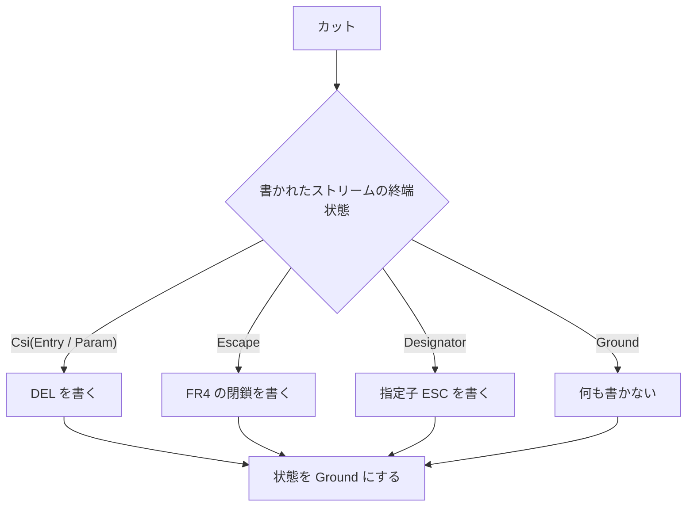

# mux-strip-escape-state-carry - 要件定義書

## 1. 概要

### 1.1 背景

mux-cut-csi-post-strip-closure の review round 1 で、medium 指摘 `a879a02de382209f` が `unresolved` のまま残った。

`strip_pty_output_for_scrollback_write_with_csi_state`（`src-tauri/src/mux/scrollback_filter.rs`）は、strip の終端状態を `Option<CsiPhase>` に縮めて返す。strip が ESC を書いた直後の構文を除去したときの終端状態 Escape は `None` になり、書き込みフィルタの `self.csi` に入る（`src-tauri/src/mux/ipc/pty_spawn/write_filter.rs`）。次の呼び出しの strip は Ground から始まる。

このため、同じバイト列でも読み取りの分割位置によってカット時の閉鎖（DEL）の有無が変わる。1 回で渡すと `Some(Param)` になり DEL が書かれる。分割して渡すと DEL が書かれず、リングとスナップショットが `ESC[6` で終わる。後続の `n` で `ESC[6n` が成立し、生ストリームには無い CPR 応答をクライアントが返す。そのような呼び出しの直後がカットの場合は、リングが書かれた単独の ESC で終わり、閉じられない。リプレイではカット後の最初のバイトがエスケープを作る（例: `[6n` は照会、`c` は RIS）。

再現手順:

1. 書き込みフィルタの呼び出し 1 に `ESC ESC]777;emterm;markdown;begin;id=x BEL` をカット無しで渡す（`ESC` が書かれ、引き継ぐ状態は `None` になる）。
2. 呼び出し 2 に `[6` を末尾カット付きで渡す（`[6` が書かれ、DEL は書かれない）。
3. 後続の出力で `n` が届くと、クライアントが開始していない CPR 応答（`ESC[row;colR`）を返す。

`ESC` + `ESC[6n`、`ESC` + Kitty APC、`ESC` + SIXEL DCS でも同じ。

発生条件: ESC の直後に strip 対象の完全な構文が続き、その直後で PTY 読み取りの分割が起き、さらに snapshot 取得のカットが重なったときにだけ起きる。

### 1.2 目的

- mux デーモンの書き込みフィルタで、strip 適用後に書いたバイト列の終端状態を Ground / Escape / 指定子待ち / Csi(phase) を区別して引き継ぎ、読み取りの分割位置によらず出力と状態を 1 回で渡した結果と等しくする。
- 書かれたストリームが Escape（および指定子待ち）で終わる位置のカットでも、リングのリプレイでクライアントが開始していない照会（CPR など）やリセット（RIS）が成立しないようにする。
- review round 1 の medium 指摘 `a879a02de382209f` について、対応済みか対応不要かを判断し、理由と回帰テストを記録する。

### 1.3 スコープ

対象:

- 書かれたストリームの終端状態の引き継ぎ（Ground / Escape / Designator / Csi）（FR1、FR2）
- カット時の閉鎖（FR3、FR4）
- 回帰テストの追加（FR5）
- 判断の記録（FR6）

対象外（決定記録に残件として書く、as-04）:

- 文字列導入子の splice（EC-6）
- 前身 FR6 の 3 件の残件（カット無しの連結）

UI には触れない。変更は mux デーモンの書き込みフィルタと共有 strip の状態報告に限られる。

## 2. ビジネス要件

### 2.1 ビジネス目標

- 読み取りの分割位置によらず、書き込みフィルタの出力と状態を 1 回で渡した結果と等しくする。
- カットとその状態引き継ぎの経路で、クライアントが開始していない照会やリセットを、リングのリプレイで成立させない。
- 指摘 `a879a02de382209f` の判断・理由・回帰テストを記録する。

### 2.2 対象ユーザー

該当なし（mux デーモン内部の書き込みフィルタの修正）。

### 2.3 期待される効果

- 再現手順で、クライアントが開始していない CPR 応答が出ない。
- 書かれたストリームが Escape で終わる位置のカットの後、リプレイでカット後の最初のバイトがエスケープを作らない。

## 3. ユースケース

該当なし。

## 4. 機能要件

### 4.1 機能一覧

| ID | 機能名 | 説明 |
|----|--------|------|
| FR1 | 書かれたストリームの終端状態の引き継ぎ | strip 適用後に書いたバイト列の終端状態を Ground / Escape / Designator / Csi(Entry) / Csi(Param) を区別して引き継ぐ |
| FR2 | 引き継いだ指定子待ちは strip の除去判定を変えない | 引き継いだ Designator は状態遷移にだけ使い、verbatim コピーの判定は境界スキャンの awaiting_designator だけで決める |
| FR3 | カット時の閉鎖を書かれたストリームの終端状態で決める | カットでは終端状態に応じて閉鎖を高々 1 回書く |
| FR4 | Escape で終わる位置の閉鎖 | Escape で終わる位置のカットで書く閉鎖が満たす性質 |
| FR5 | 回帰テストの追加 | 分割不変性コーパスとカット・生ストリーム比較・再現手順のテストを加える |
| FR6 | 判断の記録 | `a879a02de382209f` の判断・理由・回帰テストと残件を決定記録に書く |

### 4.2 機能詳細

#### FR1: 書かれたストリームの終端状態の引き継ぎ

**説明**: 書き込みフィルタは、strip 適用後に書いたバイト列の終端状態を Ground / Escape / Designator（指定子待ち）/ Csi(Entry) / Csi(Param) を区別して保持し、次の呼び出しの strip をその状態から始める。state 付き strip（`strip_pty_output_for_scrollback_write_with_csi_state`、またはその後継）はこの状態を受け取って返す。strip が ESC を書いた直後の構文を除去したときの終端状態 Escape は、None（Ground）に縮めずに引き継ぐ。通常経路、カットの無い呼び出しの後、オーバーフローフラッシュの最後のセグメント、のいずれでも同じ。

**引き継ぐ状態**:

| 状態 | 意味 |
|------|------|
| Ground | 書かれたストリームがエスケープの途中でない |
| Escape | 書かれたストリームが ESC で終わっている |
| Designator | 書かれたストリームが指定子待ちで終わっている |
| Csi(Entry) / Csi(Param) | 書かれたストリームが未完の CSI で終わっている |

#### FR2: 引き継いだ指定子待ちは strip の除去判定を変えない

**説明**: strip が除去した構文の直後の `(` / `)` によって、書かれたストリームが指定子待ち（Designator）で終わった場合も、その状態を引き継ぐ。次の呼び出しで先頭バイトを verbatim にコピーする（strip 対象の開始として読まない）かどうかは、従来どおり境界スキャンの awaiting_designator だけで決める。引き継いだ Designator は状態遷移にだけ使い、除去判定は変えない。その結果、同じバイト列に対する strip の出力は、1 回で渡しても分割しても同じになる。

#### FR3: カット時の閉鎖を書かれたストリームの終端状態で決める

**説明**: カット（同一呼び出し内のカット、空セグメントのカット、リーダーのフォールバック閉鎖（空範囲 + fed 0 のカット）、オーバーフローフラッシュに続くカット）では、strip 適用後に書いたバイト列の終端状態に応じて、閉鎖を高々 1 回書く。カットの後の状態は Ground とする。

| 終端状態 | カットで書く閉鎖 |
|----------|------------------|
| Csi(Entry) / Csi(Param) | CSI_CLOSING（DEL） |
| Escape | FR4 の閉鎖 |
| Designator | 指定子 ESC（前身 round4 FR3 と同じ 1 バイト） |
| Ground | 何も書かない |

**処理フロー**:

**ビジネスルール**:
- 再現手順の入力（呼び出し 1 `ESC ESC]777;emterm;markdown;begin;id=x BEL`、呼び出し 2 `[6` + 末尾カット）では、出力は `ESC` + `[6` + DEL になる。
- `ESC` + `ESC[6n`、`ESC` + Kitty APC、`ESC` + SIXEL DCS、`ESC` + OSC 9999 emterm-md、`ESC` + agent-status でも同じ。

#### FR4: Escape で終わる位置の閉鎖

**説明**: 書かれたストリームが Escape で終わる位置でカットするときに書く閉鎖は、次をすべて満たす。

- (a) term_core が直前の書かれた ESC に続けて読むと、エスケープを完了して ground に戻る。
- (b) 文字の表示、カーソル移動、応答、モードや文字集合の変化を起こさない。
- (c) ESC (0x1B) ではない。
- (d) 直前の ESC と組んで ST（`ESC \`）にならない。
- (e) DEL や指定子 ESC と同じカットで重ねて書かない。

閉鎖は strip の後に書くので、strip 対象の開始として読まれない。具体的なバイトは create-plan で term_core のエスケープ状態の遷移から選び、term_core の生ストリーム比較で確かめる（as-03）。

#### FR5: 回帰テストの追加

**説明**: `src-tauri/src/mux/ipc/pty_spawn/tests/post_strip_cut_csi.rs` の分割不変性コーパス（`post_strip_the_carried_csi_state_follows_the_stripped_output` の (c)）に、`ESC ESC` + 各保持対象（HELD_TARGETS: OSC 777 launch、OSC 9999 emterm-md、agent-status、Kitty APC、SIXEL DCS）の入力と、その後に `[6` を続けた入力を加える。全分割位置と 1 バイトずつの供給で、カット無しと末尾カットの両方を検証する。あわせて次も加える。

1. 同一呼び出しのカットとフォールバック閉鎖で、出力が FR3 / FR4 の閉鎖になること。
2. term_core の生ストリーム比較で、カット後の `[6n`、`n`、`c` が基準と同じ解釈と応答になること（CPR も RIS も出ない）。
3. 再現手順そのもの（呼び出し 1 → 呼び出し 2 `[6` + カット → 後続 `n`）。

CSI 照会（`ESC ESC[6n`）は、1 回の呼び出しで渡すケースとカットのケースに入れる。分割と 1 バイトずつの比較からは、前身 D2 に従って外す。

#### FR6: 判断の記録

**説明**: stable_id `a879a02de382209f` について、判断（対応済み / 対応不要）、理由、回帰テストを `feature-docs/mux-strip-escape-state-carry/` 配下の決定記録に書く。前身の `feature-docs/mux-cut-csi-post-strip-closure/DECISIONS.md` と `reviews/round1.yaml` は変更しない。この修正の範囲外として残る splice（書かれた ESC の後に strip が構文を除去し、続く `]` / `P` / `_` で文字列が開いたまま、あるいはカット無しの連結で照会が成立する場合）は、発生条件と範囲外の理由を決定記録に残件として書く。

## 5. 非機能要件

### 5.1 パフォーマンス要件

- NFR2（リーダー通常経路の負荷）: リーダーの通常経路にバイト走査のパスを追加しない。終端状態は既存の strip のパスの中で O(1) の状態として求める。
- NFR4（TM-2）: 走査と strip は有界で、panic しない。512 KiB の pending 上限と、strip を通すオーバーフローフラッシュは維持する。
- レスポンスタイム・スループット・同時接続数: 該当なし。

### 5.2 セキュリティ要件

- 認証: 該当なし。
- 認可: 該当なし。
- データ保護（NFR3、TM-1）: カットとその状態引き継ぎの経路で、クライアントが開始していない照会（CPR、DA など）やリセット（RIS）を、リングのリプレイで成立させない。
- 入力検証（NFR4、TM-2）: 有界で panic しない。512 KiB の上限と、strip を通すオーバーフローフラッシュを維持する。
- FR4 (d): 閉鎖は `ESC \` を作らない。スナップショット時の strip（`find_st_terminator`）は、未終端の Kitty APC / SIXEL DCS の導入子から `ESC \` を探すので、新たな `ESC \` を加えるとスナップショットの除去範囲が変わりうる。

### 5.3 可用性要件

該当なし。

### 5.4 保守性要件

- ログ出力: 該当なし。
- 監視: 該当なし。
- ドキュメント: `a879a02de382209f` の判断・理由・回帰テストと残件を、`feature-docs/mux-strip-escape-state-carry/` 配下の決定記録に書く（FR6）。

### 5.5 互換性要件

- NFR1（互換性）: mux_ipc のワイヤ形式、Snapshot / SnapshotRestore のフレーム形状、スナップショットのバイト配置、共有 strip（`strip_rich_content_and_remap_with_designator` / `strip_replayable_rich_content` / `strip_pty_output_for_scrollback_write(_with_designator)`）の出力は変えない。リングの内容が変わるのは、次の場合だけとする。
    - FR3 / FR4 のカットで閉鎖が 1 バイト加わる場合（引き継いだ Escape の後に開いた CSI への DEL、Escape の閉鎖、splice による指定子待ちへの指定子 ESC）
    - 境界スキャンでは指定子待ちでも、書かれたストリームが Ground で終わるために指定子 ESC を書かなくなる場合
- NFR5（ビルドとプラットフォーム）: `CARGO_TARGET_DIR=src-tauri/target cargo test --manifest-path src-tauri/Cargo.toml --lib` と、`CARGO_TARGET_DIR=src-tauri/target cargo check --manifest-path src-tauri/Cargo.toml --no-default-features` が通る。Linux と Windows で挙動は同じ。
- ブラウザサポート: 該当なし。

## 6. UI/UX要件

該当なし（UI に触れない）。

## 7. データ要件

該当なし。

## 8. 外部連携

### 8.1 連携システム

該当なし。

### 8.2 API仕様要件

該当なし。mux_ipc のワイヤ形式、Snapshot / SnapshotRestore のフレーム形状は変えない（NFR1）。

## 9. 制約条件

### 9.1 技術的制約

- 前身フィーチャー（mux-cut-csi-post-strip-closure、mux-suppressed-output-round4-fixes）の不変条件を引き継ぐ（as-01）。
    - ロック順
    - mux_ipc のワイヤ形式
    - 512 KiB の pending 上限
    - 閉鎖バイトとしての DEL（CSI_CLOSING）
    - 指定子 ESC と DEL を同時に書かないこと
    - リーダーの通常経路にバイト走査のパスを追加しないこと
    - 共有 strip の出力を変えないこと
    - CSI バイトを保持しないこと（D2）
- テスト用アクセサ `ScrollbackWriteFilter::csi_phase()` は、CSI のサブ状態（Csi 以外は None）を返す意味を保つ。完全な終端状態は別のアクセサで読む（as-05）。

### 9.2 ビジネス上の制約

- 前身の `feature-docs/mux-cut-csi-post-strip-closure/DECISIONS.md` と `reviews/round1.yaml` は変更しない（FR6、as-02）。

### 9.3 スケジュール制約

該当なし。

### 9.4 宣言された変更集合

このフィーチャー固有のパスは手動で列挙せず、create-plan で `workflow.yaml` の各タスクの `files` から導出する（`references/phases/create-plan-phase.md`）。

**デフォルトメンバー**（SPEC作成者が明示的に除外しない限り、常に宣言に含まれる）:
- `feature-docs/mux-strip-escape-state-carry/**`
- `test-docs/mux-strip-escape-state-carry/**`

`feature-docs/mux-strip-escape-state-carry/**` に含まれるもの: `REQUIREMENTS.md`、`SPEC.md`、`IMPLEMENTATION.md`、`workflow.yaml`、`phase-state/`、`tasks/`、`reviews/roundN.yaml`、`VERIFICATION.md`、`retrospect.yaml`、およびデザインステップが生成するデザイン成果物。生成主体は各フェーズドキュメントおよび `references/phase-state.md` を参照（引用のみ、ルールは再掲しない）。

`test-docs/mux-strip-escape-state-carry/**` に含まれるもの: `{T}.tests.yaml`（パス形式: `test-docs/mux-strip-escape-state-carry/{T}.tests.yaml`）。生成主体は `implement-phase.md` を参照（引用のみ、ルールは再掲しない）。

**意味論**:
- デフォルトのメンバーは、SPEC作成者が明示的に除外しない限り宣言に含まれる。除外は意図的な絞り込みであり、記載漏れによる省略ではない。
- この宣言はスーパーセット（superset）の主張であり、実際の変更集合は宣言に含まれる（CONTAINED IN）必要がある。実際には生成されないパスが宣言されていても違反にはならない。implementタスクを1つも生成しないフィーチャーは `test-docs/mux-strip-escape-state-carry/` ディレクトリを生成しないが、宣言された `test-docs/mux-strip-escape-state-carry/**` は依然として正しい。

### 9.5 参照側への影響

| シンボル | 変更 | 影響を受けるパス |
|----------|------|------------------|
| `strip_pty_output_for_scrollback_write_with_csi_state`（引数 `csi_in: Option<CsiPhase>` と戻り値 `Option<CsiPhase>` を完全な書かれた状態にする） | シグネチャの変更、または後継の形 | `src-tauri/src/mux/scrollback_filter.rs`、`src-tauri/src/mux/ipc/pty_spawn/write_filter.rs`、`src-tauri/src/mux/scrollback_filter/tests.rs` |
| `WrittenState`（private enum）、`WrittenState::start`、`WrittenState::csi` | 可視性・コンストラクタの変更。`start` は引き継いだ状態を `pending_designator` フラグとは別に受け取る（FR2）。`csi()` は引き継ぐ値ではなくなる | `src-tauri/src/mux/scrollback_filter.rs` |
| `ScrollbackWriteFilter.csi` フィールド（`Option<CsiPhase>`）とテスト用アクセサ `csi_phase()` | フィールドの型を完全な書かれた状態にする。`csi_phase()` は意味を保ち（as-05）、完全な状態を返すアクセサを加える | `src-tauri/src/mux/ipc/pty_spawn/write_filter.rs`、`src-tauri/src/mux/ipc/pty_spawn/tests/post_strip_cut_csi.rs`、`src-tauri/src/mux/ipc/pty_spawn/tests/round4_chain.rs`、`src-tauri/src/mux/ipc/pty_spawn/tests/round4_cut_csi.rs` |
| `CSI_CLOSING`（と Escape 用の閉鎖定数） | 閉鎖定数を隣に加えうる。`CSI_CLOSING` 自体は変えない | `src-tauri/src/mux/ipc/pty_spawn/write_filter.rs`、`src-tauri/src/mux/ipc/pty_spawn/tests/post_strip_cut_csi.rs`、`src-tauri/src/mux/ipc/pty_spawn/tests/round4_cut_csi.rs`、`src-tauri/src/mux/ipc/pty_spawn/tests/round4_chain.rs` |
| `feature-docs/mux-cut-csi-post-strip-closure/DECISIONS.md`（テストが読む） | 変更しない | `src-tauri/src/mux/ipc/pty_spawn/tests/post_strip_cut_csi_record.rs`、`feature-docs/mux-cut-csi-post-strip-closure/DECISIONS.md` |
| `test-docs/mux-cut-csi-post-strip-closure/task0001.tests.yaml` に列挙されたテスト名 | 列挙されたテストを改名した場合だけ更新する（`.claude/rules/test-docs-records.md`） | `test-docs/mux-cut-csi-post-strip-closure/task0001.tests.yaml`、`test-docs/mux-cut-csi-post-strip-closure/task0002.tests.yaml` |
| テストモジュールの登録 | 新しいテストモジュールを加える場合は既存の登録の隣に宣言する | `src-tauri/src/mux/ipc/pty_spawn/tests.rs` |

補足:

- `ScrollbackWriteFilter.csi` のフィールド doc にある「awaiting_designator と同時には設定されない」は変わる。
- 末尾の CSI_CLOSING を取り除くテスト（例: `post_strip_cut_csi.rs` の `strip_closing`）は、入力が書かれた ESC で終わる場合に Escape の閉鎖も扱う必要がありうる。
- `post_strip_the_decision_record_states_the_verdict_and_the_residuals` は、前身の DECISIONS.md の見出し、`4c0ad9058a983648` の 1 行、3 つの残件の小節、behavior-changing の「None.」を固定している。
- テストをその場で拡張するだけなら、前身の test-docs の更新は要らない。

## 10. 想定される課題とリスク

### 10.1 技術的課題

| 課題 | 影響度 | 対応策 |
|------|--------|--------|
| FR4 の閉鎖バイトが未確定 | 中 | create-plan で term_core のエスケープ状態の遷移（`crates/term_core/src/parser/escape.rs`）から FR4 の性質を満たすものを選び、term_core の生ストリーム比較で確かめる（as-03） |
| 新たな `ESC \` によるスナップショット時 strip の除去範囲の変化 | — | 閉鎖は `ESC \` を作らない（FR4 (d)） |

### 10.2 ビジネスリスク

該当なし。

## 11. 成功基準

### 11.1 受け入れ基準

- [ ] AC-1（FR1, FR3, NFR3）: 再現手順（呼び出し 1 `ESC ESC]777;emterm;markdown;begin;id=x BEL`、カット無し → 呼び出し 2 `[6` + 末尾カット → 後続 `n`）で、リングは `ESC[6` + DEL になる。term_core でリプレイしても CPR 応答は出ず、`n` は文字として表示される。各保持対象と CSI 照会でも同じになる。
- [ ] AC-2（FR1, FR2, FR5）: `ESC ESC` + 各保持対象（+ `[6`）を加えた分割不変性コーパスで、全分割位置と 1 バイトずつの供給の出力バイト、pending、指定子待ち、引き継ぎ状態が、1 回で渡した結果と等しい。カット無しと末尾カットの両方で成り立つ。カット無しの各呼び出しの後の引き継ぎ状態は、書かれたバイト列に対する term_core の状態と等しい。
- [ ] AC-3（FR3, FR4, NFR3）: `ESC` + 各除去対象の直後のカット（同一呼び出しのカットとフォールバック閉鎖の両方）で、リングは `ESC` + FR4 の閉鎖で終わる。2 回目のフォールバック閉鎖は何も書かない。そのリングにカット後の `[6n`、`n`、`c` を続けて term_core でリプレイすると、後続の解釈・応答・画面・カーソルが、画面切り替えを挟んだ生ストリームの基準と等しい（除去された構文自身の効果は比較から外す）。
- [ ] AC-4（FR2, FR3）: strip が除去した構文の直後の `(` / `)` で書かれたストリームが指定子待ちで終わる場合、カットでは指定子 ESC を 1 回だけ書く。DEL や Escape の閉鎖と重ならない。引き継いだ指定子待ちで、次の呼び出しの strip の出力は変わらない。
- [ ] AC-5（FR1, FR3）: オーバーフローフラッシュの run が `ESC` + 完全な除去対象で終わり、カットが続くとき、Escape の閉鎖を 1 回書く。カットが無いときは、最後のセグメントの終端状態（Escape）を引き継ぐ。
- [ ] AC-6（FR5）: 追加した回帰テストは修正前のコードで失敗し、修正後に通る。
- [ ] AC-7（FR6）: `feature-docs/mux-strip-escape-state-carry/` 配下の決定記録に、`a879a02de382209f` の判断・理由・回帰テストと、範囲外の残件（発生条件と範囲外の理由）がある。前身の DECISIONS.md と reviews/round1.yaml は変更されていない。
- [ ] AC-8（NFR1）: 既存テストは変更なしで通る。意図して期待値を変えたテストは決定記録に列挙する。テストの改名があれば、`.claude/rules/test-docs-records.md` に従って前身の test-docs を更新する。
- [ ] AC-9（NFR5, NFR2, NFR4）: `--lib` の cargo test と `--no-default-features` の cargo check が通る。除去対象と書かれた ESC を交互に並べた長い入力でも、予算内に終わり panic しない。

### 11.2 KPI

該当なし。

## 12. テストシナリオ

### 12.1 テスト観点

- [ ] 正常系: 再現手順で、出力が `ESC` + `[6` + DEL になり、後続の `n` のリプレイで CPR が出ない（TS-1）。
- [ ] 異常系: `ESC` + 各除去対象の直後のカットで、リングが `ESC` + FR4 の閉鎖で終わり、カット後の `[6n`、`n`、`c` が基準と等しい（TS-3、TS-7）。
- [ ] 境界値: 全分割位置と 1 バイトずつの供給で、出力と状態が 1 回で渡した結果と等しい（TS-2）。上限付近まで保持した OSC のフラッシュ（TS-5）。
- [ ] セキュリティ: カットとその状態引き継ぎの経路で、クライアントが開始していない照会やリセットがリプレイで成立しない（TS-1、TS-3、TS-7）。
- [ ] パフォーマンス: `ESC` + 除去対象を交互に並べた長い入力が予算内に終わり panic しない（TS-8）。

### 12.2 テストシナリオ一覧

| ID | 種別 | 対象 | 内容 |
|----|------|------|------|
| TS-1 | unit | FR1, FR3, AC-1 | 再現手順を、各保持対象と CSI 照会について書き込みフィルタで実行し、出力が `ESC` + `[6` + DEL になり、後続の `n` のリプレイで CPR が出ないことを確認する。 |
| TS-2 | unit | FR1, FR2, FR5, AC-2 | `post_strip_cut_csi.rs` の分割不変性コーパスに `ESC ESC` + 各保持対象、`ESC ESC` + 各保持対象 + `[6`、`ESC ESC` + 保持対象 + `(` を加え、全分割位置と 1 バイトずつの供給で、カット無しと末尾カットの両方の State（emitted / pending / awaiting / 引き継ぎ状態）が 1 回で渡した結果と等しいことを確認する。Escape と Designator も判定できる term_core オラクルで、各呼び出し後の状態を確かめる。 |
| TS-3 | unit | FR3, FR4, AC-3 | `ESC` + 各除去対象のカット（同一呼び出しのカット、同じ位置への 3 回のカット、フォールバック閉鎖、2 回目の閉鎖が何も書かないこと）で、出力が `ESC` + 閉鎖になることを確認する。term_core の生ストリーム比較で、カット後の `[6n`、`n`、`c` が基準と等しいことを確認する。 |
| TS-4 | unit | FR2, FR3, AC-4 | splice による指定子待ちのカットで指定子 ESC だけが書かれること、引き継いだ Designator で次の呼び出しの strip 出力が変わらないことを確認する。境界スキャンでは指定子待ちでも、書かれたストリームが Ground で終わる場合（`ESC ESC]777...BEL ( ESC (`）は、何も書かないことを確認する。 |
| TS-5 | unit | FR1, FR3, AC-5 | 上限付近まで保持した OSC がフラッシュされ、run が `ESC` + 完全な除去対象で終わる場合を検証する。カットが続くときは Escape の閉鎖が書かれ、カットが無いときは Escape が引き継がれることを確認する。 |
| TS-6 | unit | FR1 | `scrollback_filter/tests.rs` の state 付き strip の表で、終端状態 Escape / Designator を返す行（`ESC[6 ESC`、`ESC ESC` + 除去対象、`ESC[6 ESC(` など）を確認する。出力が既存の strip と同一であること（R9 の同一性検査）も確認する。 |
| TS-7 | integration | FR3, NFR3 | 本番のリーダーと可視性復元のハーネス（`run_visibility_restore_at`）で、`ESC` + 除去対象 + 画面切り替え、その後の読み取りで `[6n` / `c`、という順にデータを流す。クライアントの応答・画面・カーソルが生ストリームの基準と等しいことを確認する。 |
| TS-8 | performance | NFR2, NFR4, AC-9 | `ESC` + 除去対象を交互に並べた長い入力（上限以下と上限超え）を、1 回、2 回、1 バイトずつ、カット有無で流し、予算内に終わり panic せず、どの供給でも出力が等しいことを確認する。 |
| TS-9 | record | FR6, AC-7 | 決定記録に `a879a02de382209f` の行（判断・理由・回帰テスト）と残件の節があることを確認する。前身の決定記録は変更されていないことを確認する。 |
| TS-10 | build | NFR5 | `--no-default-features` の cargo check が通ることを確認する。 |

### 12.3 エッジケース

- EC-1: CSI を中断する splice。`ESC[6 ESC ESC]777...BEL` は `ESC[6 ESC` を書き、終端状態は Escape（Csi ではない）。カットでは DEL ではなく Escape の閉鎖を書く。
- EC-2: 書かれた Escape の後に未完の構文が保持され、カットで落とされる場合（`ESC ESC]777...BEL ESC]0;ti` + カット）。保持した chain は書かず、Escape の閉鎖を書く。
- EC-3: 引き継いだ Escape の次の呼び出しが ESC で始まる場合。書かれた ESC ESC は Escape のまま。続く除去対象は従来どおり除去する。
- EC-4: splice による指定子待ち（`ESC ESC]777...BEL (`）。次の呼び出しの先頭バイトは verbatim コピーしない（FR2）。カットでは指定子 ESC を書く。
- EC-5: 境界スキャンは指定子待ちでも、書かれたストリームが Ground で終わる場合（`ESC ESC]777...BEL ( ESC (`）。カットでは何も書かない（FR3）。
- EC-6: 書かれた Escape の後に `]` / `P` / `_` が続き、リング上で文字列が開いたままになる splice。WrittenState は Ground として扱う。この修正の範囲外で、残件として記録する（FR6）。
- EC-7: 呼び出しをまたぐ CSI 照会は到着どおり書かれるので（前身 D2）、分割と 1 バイトずつの比較から外す。
- EC-8: 1 回のカットで書く閉鎖は高々 1 回。DEL、Escape の閉鎖、指定子 ESC は重ならない。2 回目のフォールバック閉鎖は何も書かない。
- EC-9: 生ストリームの基準との比較では、除去された構文自身の効果（`ESC[6n` への正当な CPR、Kitty の応答や配置）を比較から外す（前身 EC-5 の方法）。

## 13. 用語定義

| 用語 | 定義 |
|------|------|
| 書かれたストリーム | 書き込みフィルタが strip 適用後に書いたバイト列 |
| 終端状態 | 書かれたストリームの末尾の状態。Ground / Escape / Designator / Csi(Entry) / Csi(Param) |
| Designator（指定子待ち） | `(` / `)` の後で指定子を待っている状態 |
| 保持対象（HELD_TARGETS） | OSC 777 launch、OSC 9999 emterm-md、agent-status、Kitty APC、SIXEL DCS |
| CSI_CLOSING | 開いた CSI へのカット時の閉鎖バイト（DEL） |
| 指定子 ESC | 指定子待ちへのカット時の閉鎖（前身 round4 FR3 と同じ 1 バイト） |
| フォールバック閉鎖 | リーダーの、空範囲 + fed 0 のカット |
| splice | 書かれた ESC の後に strip が構文を除去し、前後のバイトが書かれたストリーム上でつながること |
| TM-1 / TM-2 | NFR3 / NFR4 のセキュリティ要件 |

## 14. 確認事項

### 14.1 確認済み事項

バッチ実行のため、ユーザーとの対話による確認事項はない。

### 14.2 未確認・保留事項

- [ ] FR4 の閉鎖の具体的なバイトは create-plan で決める（as-03）。

### 14.3 前提

- as-01: 前身フィーチャー（mux-cut-csi-post-strip-closure、mux-suppressed-output-round4-fixes）の不変条件を引き継ぐ。ロック順、mux_ipc のワイヤ形式、512 KiB の pending 上限、閉鎖バイトとしての DEL（CSI_CLOSING）、指定子 ESC と DEL を同時に書かないこと、リーダーの通常経路にバイト走査のパスを追加しないこと、共有 strip の出力を変えないこと、CSI バイトを保持しないこと（D2）。
- as-02: 決定記録は `feature-docs/mux-strip-escape-state-carry/DECISIONS.md` に置き、前身の `feature-docs/mux-cut-csi-post-strip-closure/DECISIONS.md` と `reviews/round1.yaml` は変更しない。
- as-03: Escape で終わる位置の閉鎖バイトは、create-plan で term_core のエスケープ状態の遷移（`crates/term_core/src/parser/escape.rs`）から FR4 の性質を満たすものを選び、term_core の生ストリーム比較で確かめる。
- as-04: 修正範囲は、書かれたストリームの終端状態の引き継ぎ（Ground / Escape / Designator / Csi）と、カット時の閉鎖とする。文字列導入子の splice（EC-6）と、前身 FR6 の 3 件の残件（カット無しの連結）は扱わず、決定記録に残件として書く。
- as-05: テスト用アクセサ `ScrollbackWriteFilter::csi_phase()` は、CSI のサブ状態（Csi 以外は None）を返す意味を保つ。完全な終端状態は別のアクセサで読む。`round4_chain.rs` / `round4_cut_csi.rs` / `post_strip_cut_csi.rs` の既存の `csi_phase()` の期待値は変わらない。
- as-06: `scrollback_filter/tests.rs` の `post_strip_state_form_reports_the_csi_state_of_the_written_bytes` の表のうち、終端が書かれた ESC や `ESC (` で終わる行（`ESC[6 ESC`、`ESC[6 ESC(`、`ESC(ESC`）は、state 付き strip が完全な状態を返すようになると期待値が None から Escape / Designator に変わりうる。変わった場合は決定記録の behavior-changing tests に列挙する。

## 15. 参考資料

- 仕様書: `feature-docs/mux-strip-escape-state-carry/SPEC.md`
- 前身フィーチャーの仕様書: `feature-docs/mux-cut-csi-post-strip-closure/SPEC.md`
- 前身フィーチャーの決定記録: `feature-docs/mux-cut-csi-post-strip-closure/DECISIONS.md`
- 前身フィーチャーのレビュー記録: `feature-docs/mux-cut-csi-post-strip-closure/reviews/round1.yaml`
- test-docs 記録のルール: `.claude/rules/test-docs-records.md`
