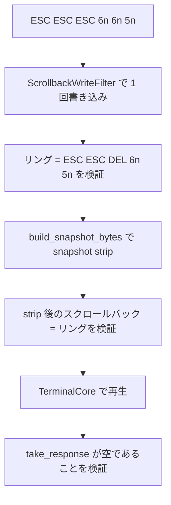
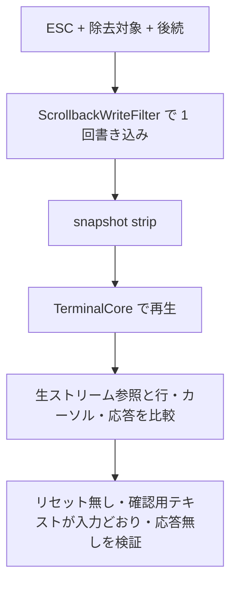

# mux-strip-join-escape-closure - 要件定義書

## 1. 概要

### 1.1 背景
タスクは次の 3 つの攻撃シナリオを挙げている。

1. 分割の無い 1 回の供給で `ESC[6` + 除去対象の OSC + `n` を流す。
2. `ESC ESC ESC[6n[6n[5n` を write strip、snapshot strip、term_core の順に通す。
3. `ESC` + 除去対象 + `c`（RIS）と、`ESC` + 除去対象 + `(0`（G0 指定）を流す。

現在の main では、mux-strip-concat-query-closure の D1 が 3 つとも防いでいる。D1 は `Written::close_before_removal` で、書き出し側のストリームが CSI の途中にあるとき、または書き出した単独の ESC の直後にあるときに、除去する構成要素の前に DEL を 1 つ書く。

### 1.2 目的
- 3 つのシナリオが現在の main で成立しないことを確認する。本番の挙動は変更しない。
- DoD が求める回帰テストを追加する。DoD 1 は既存の `strip_concat_one_call_closes_an_open_csi_at_every_removed_construct` が満たしている。本 feature では DoD 2 の二段 strip テストと、シナリオ 3 の再生テストを追加する。
- 各シナリオと D1 の対応、および保持した文字列本文の結合の残件を、本 feature の DECISIONS.md に記録する（DoD は修正後の版に従う）。

### 1.3 スコープ
- 対象: FR1 と FR2 のテスト追加、FR3 の既存テストの test-docs 記録への登録、FR4 と FR5 の DECISIONS.md への記録。
- 対象外: 本番コード（`src-tauri/src` の非テストコードと `crates/term_core`）の変更。
- 対象外: 保持した未終了の OSC/DCS/APC 本文の中で除去が起きたときの結合への対処。残件として記録のみ行う（FR5）。
- 対象外: 前任 feature の DECISIONS.md と test-docs 記録の編集。

## 2. ビジネス要件

### 2.1 ビジネス目標
- シナリオ 1〜3 が現在の main で成立しないことを、回帰テストで固定する。
- 各シナリオと D1 の対応と、残件を記録する。

### 2.2 対象ユーザー
| ユーザータイプ | 説明 |
|----------------|------|
| 該当なし | 本 feature はテストと決定記録の追加のみで、利用者向けの挙動変更は無い |

### 2.3 期待される効果
- DoD 1・DoD 2・シナリオ 3 が回帰テストで検証される。
- シナリオと D1 の対応、および保持した文字列本文の結合の残件が DECISIONS.md に残る。

## 3. ユースケース

### 3.1 ユースケース一覧
該当なし（本 feature はテストと決定記録の追加のみ）。

### 3.2 ユースケース詳細
該当なし。

## 4. 機能要件

### 4.1 機能一覧
| ID | 機能名 | 説明 | 優先度 |
|----|--------|------|--------|
| FR1 | DoD-2 テスト: write strip、snapshot strip、term_core で応答 0 件 | `ESC ESC ESC[6n[6n[5n` を二段 strip と term_core 再生に通し、応答が 0 件であることを検証する | 高 |
| FR2 | シナリオ 3 テスト: 除去をまたいで RIS も G0 指定も起きない | 除去対象の各種類について `ESC` + 除去対象 + `c` と `ESC` + 除去対象 + `(0` + 確認用テキストを検証する | 高 |
| FR3 | DoD-1 テストは既存テスト | DoD 1 を既存テストで検証し、test-docs 記録に登録する。重複テストは追加しない | 高 |
| FR4 | 決定記録: シナリオと D1 の対応 | DECISIONS.md にシナリオ 1〜3 と D1 の対応を記録する | 高 |
| FR5 | 決定記録: 保持した文字列本文の結合の残件 | DECISIONS.md に保持した未終了の OSC/DCS/APC 本文の結合を残件として記録する | 高 |

### 4.2 機能詳細

#### FR1: DoD-2 テスト: write strip、snapshot strip、term_core で応答 0 件

**説明**: バイト列 `ESC ESC ESC [ 6 n [ 6 n [ 5 n` を、分割の無い 1 回の呼び出しで `ScrollbackWriteFilter` に渡す（write strip）。書き出されたリングを snapshot strip（`build_snapshot_bytes`。内部で `strip_rich_content_and_remap` を呼ぶ）に通し、得られたペイロードを term_core の `TerminalCore` で再生して、応答バッファが空であることを検証する。あわせて、書き出されたリングが `ESC ESC DEL [6n[5n` であること、および snapshot strip がそのバイト列を変えないことを固定する。既存の再接続ヘルパー（`strip_concat_query.rs` の `assert_reattach_matches_reference`）は snapshot を通して再生するが、再生の応答が空であることを検証しないため、本要件を満たさない。

**入力**:
- 書き込みバイト列: バイト列 - `ESC ESC ESC[6n[6n[5n`（分割の無い 1 回の呼び出し）

**出力**:
- リングのバイト列: バイト列 - `ESC ESC DEL [6n[5n`
- snapshot strip 後のスクロールバック: バイト列 - リングと同一
- 再生時の応答: バイト列 - 空

**処理フロー**:

**ビジネスルール**:
- 入力は分割の無い 1 回の呼び出しで与える。

**バリデーション**:
該当なし。

**エラーケース**:
該当なし。

#### FR2: シナリオ 3 テスト: 除去をまたいで RIS も G0 指定も起きない

**説明**: 除去対象の構成要素の各種類について、分割の無い 1 回の `ScrollbackWriteFilter` 呼び出しで次の 2 つの入力を与える。

- `ESC` + 除去対象 + `c`
- `ESC` + 除去対象 + `(0` + DEC 罫線文字セットで表示が変わる確認用テキスト

各入力を書き込み、snapshot strip に通し、term_core で再生する。行・カーソル・応答が、生ストリームを参照としたもの（除去対象そのものの効果は除く）と一致すること。すなわち、リセットが起きない（それ以前の画面内容が残る）、確認用テキストが入力どおりに表示される（G0 が切り替わらない）、応答が無い。

**入力**:
- 除去対象の種類:
    - OSC 777 launch（BEL 終端・ST 終端）
    - OSC 9999 emterm-md
    - agent-status report
    - Kitty APC
    - SIXEL DCS
    - 応答対象の CSI 照会
    - C0 バイトを内部に含む CSI 照会
- 後続: `c`、または `(0` + 確認用テキスト

**出力**:
- 行・カーソル・応答: 生ストリーム参照（除去対象そのものの効果を除く）と一致

**処理フロー**:

**ビジネスルール**:
- 除去対象の全種類と、後続の 2 種類の全組み合わせを検証する。

**バリデーション**:
該当なし。

**エラーケース**:
該当なし。

#### FR3: DoD-1 テストは既存テスト

**説明**: DoD 1（`ESC[6` + 除去対象 + `n` を分割の無い 1 回の供給で与えたとき、リングに照会が残らない）は、既存の `mux::ipc::pty_spawn::tests::strip_concat_query::strip_concat_one_call_closes_an_open_csi_at_every_removed_construct` で検証する。本 feature の test-docs 記録は、対応する受け入れ基準の下にこのテストを登録する。重複テストは追加しない。

#### FR4: 決定記録: シナリオと D1 の対応

**説明**: 本 feature の DECISIONS.md に次を記録する。

- シナリオ 1〜3 と mux-strip-concat-query-closure D1（`Written::close_before_removal`）の対応。
- DEL を無害にする term_core の挙動: DEL は開いている CSI を取り消し、単独の ESC の直後では無視される未知のエスケープ終端になる。
- タスクが提案した緩和策（ESC の後に CAN を書く、`closure_for` を `scrollback_filter` に移す）は D1 に置き換えられたこと。
- `closure_for` は分割時専用の閉鎖として残ること。

前任 feature の DECISIONS.md と test-docs 記録は編集しない。

#### FR5: 決定記録: 保持した文字列本文の結合の残件

**説明**: 本 feature の DECISIONS.md に、保持した未終了の OSC/DCS/APC 本文の中で起きる結合を、本 feature の範囲外の残件として記録する。

- `WrittenState` は文字列本文を ground として扱う。そのため本文の中で除去された構成要素に閉鎖は書かれず、構成要素の後のバイトが本文に結合する。
- 再現手順: `ESC]11;` + 除去対象（例: `ESC]777;emterm;markdown;x BEL` または `ESC[6n`）+ `?BEL` を分割の無い 1 回の呼び出しで与えると、`ESC]11;?BEL` が書き出される。snapshot strip はこれを保持し、term_core は BEL 終端の OSC 11 `?` を処理し、色の応答器が応答する。生ストリームでは OSC 11 は除去対象の ESC で中断され（Unterminated、データ空）、応答は無い。
- 影響: OSC 11 の応答はまだ誘発できる。snapshot 再生中に生じた応答はクライアント（`tabs/replay.rs`）が破棄するため、PTY への応答経路は後続のライブ出力になる。リングが `ESC]11;` + 除去対象で終わると、再生後のパーサーは OSC 本文の中に残り、ライブの `?BEL` に応答する。
- この経路が成立するのは、主画面復帰の snapshot がスクロールバックの後に何も追加しない場合に限る。リングが折り返したときは、`append_wrapped_dump_block_if_applicable`（`snapshot_bytes.rs:490`）が画面復元のダンプブロックを追加する。
- 既存の固定済み期待値は変更しない:
    - `scrollback_filter::tests::strip_concat_a_construct_removed_in_ground_adds_no_closing` の `ESC]0;t` 行
    - `strip_concat_query::strip_concat_a_construct_removed_in_ground_or_a_kept_string_adds_no_closing` の `body_head` ループ

## 5. 非機能要件

### 5.1 パフォーマンス要件
- 実行時間: 新しいテストは既存の 10 秒のテスト予算内で終わる（NFR3）。
- スループット: 該当なし。
- 同時接続数: 該当なし。

### 5.2 セキュリティ要件
- 認証: 該当なし。
- 認可: 該当なし。
- データ保護: 該当なし。
- 入力検証: write strip と snapshot strip の挙動を FR1・FR2 のテストで固定する。保持した文字列本文の結合は残件として記録する（FR5）。

### 5.3 可用性要件
- 稼働率: 該当なし。
- 障害復旧時間: 該当なし。

### 5.4 保守性要件
- ログ出力: 該当なし。
- 監視: 該当なし。
- ドキュメント: 本 feature の DECISIONS.md に FR4・FR5 の内容を記録する。
- テスト: 新しいテストは既存のオラクルの規約に従う（NFR3）。参照は生ストリームを与えた term_core で、除去対象そのものの効果（例: 除去された `ESC[6n` への応答）は除き、行・カーソル・応答で比較する。`strip_concat_query` / `escape_state_carry` / `round4_cut_csi` テストモジュールの既存ヘルパーを、適合する範囲で再利用する。
- 変更範囲: 本番コード（`src-tauri/src` の非テストコードと `crates/term_core`）は変更しない。既存テストの期待値は変更せず、既存テストの名前も変えない。そのため前任 feature の test-docs 記録の更新は不要（NFR2）。

### 5.5 互換性要件
- ビルド: `CARGO_TARGET_DIR=src-tauri/target cargo test --manifest-path src-tauri/Cargo.toml --lib` が通り、`CARGO_TARGET_DIR=src-tauri/target cargo check --manifest-path src-tauri/Cargo.toml --no-default-features` が成功する（NFR1）。
- ブラウザサポート: 該当なし。
- APIバージョン: 該当なし。

## 6. UI/UX要件

### 6.1 画面設計要件
該当なし（UI や表示面に触れない。デザインステップはスキップ）。

### 6.2 画面遷移
該当なし。

### 6.3 レスポンシブ対応
該当なし。

## 7. データ要件

### 7.1 データモデル概要
該当なし。

### 7.2 データ項目
該当なし。

### 7.3 データ保持期間
該当なし。

## 8. 外部連携

### 8.1 連携システム
該当なし。

### 8.2 API仕様要件
該当なし。

## 9. 制約条件

### 9.1 技術的制約
- 本番コード（`src-tauri/src` の非テストコードと `crates/term_core`）は変更しない（NFR2）。
- 既存テストの期待値と名前は変更しない（NFR2、FR5）。
- 前任 feature の DECISIONS.md と test-docs 記録は編集しない（FR4）。

### 9.2 ビジネス上の制約
- 保持した未終了の OSC/DCS/APC 本文の結合は本 feature の範囲外とし、残件として記録する（FR5）。

### 9.3 スケジュール制約
- 該当なし。

### 9.4 宣言された変更集合

このフィーチャー固有のパスは手動で列挙せず、create-plan で `workflow.yaml` の各タスクの `files` から導出する（`references/phases/create-plan-phase.md`）。

**デフォルトメンバー**（SPEC作成者が明示的に除外しない限り、常に宣言に含まれる）:
- `feature-docs/mux-strip-join-escape-closure/**`
- `test-docs/mux-strip-join-escape-closure/**`

`feature-docs/mux-strip-join-escape-closure/**` に含まれるもの: `REQUIREMENTS.md`、`SPEC.md`、`IMPLEMENTATION.md`、`workflow.yaml`、`phase-state/`、`tasks/`、`reviews/roundN.yaml`、`VERIFICATION.md`、`retrospect.yaml`、およびデザインステップが生成するデザイン成果物。生成主体は各フェーズドキュメントおよび `references/phase-state.md` を参照（引用のみ、ルールは再掲しない）。

`test-docs/mux-strip-join-escape-closure/**` に含まれるもの: `{T}.tests.yaml`（パス形式: `test-docs/mux-strip-join-escape-closure/{T}.tests.yaml`）。生成主体は `implement-phase.md` を参照（引用のみ、ルールは再掲しない）。

**意味論**:
- デフォルトのメンバーは、SPEC作成者が明示的に除外しない限り宣言に含まれる。除外は意図的な絞り込みであり、記載漏れによる省略ではない。
- この宣言はスーパーセット（superset）の主張であり、実際の変更集合は宣言に含まれる（CONTAINED IN）必要がある。実際には生成されないパスが宣言されていても違反にはならない。implementタスクを1つも生成しないフィーチャーは `test-docs/{feature}/` ディレクトリを生成しないが、宣言された `test-docs/{feature}/**` は依然として正しい。

## 10. 想定される課題とリスク

### 10.1 技術的課題
| 課題 | 影響度 | 対応策 |
|------|--------|--------|
| 保持した未終了の OSC/DCS/APC 本文の中で除去が起きると、後続のバイトが本文に結合し、OSC 11 の応答を誘発できる | 中 | 本 feature の範囲外とし、再現手順と影響を DECISIONS.md に残件として記録する（FR5） |
| 新しいテストは既に修正済みの挙動を固定するため、初回実行から通り、失敗段階を観測できない | 低 | test-docs 記録の red の理由としてこれを記載する |

### 10.2 ビジネスリスク
該当なし。

## 11. 成功基準

### 11.1 受け入れ基準
- [ ] AC-1（FR1）: 分割の無い 1 回の `ScrollbackWriteFilter` 呼び出しで書き込んだ `ESC ESC ESC[6n[6n[5n` は `ESC ESC DEL [6n[5n` になる。snapshot strip はこれを変えず、snapshot ペイロードを term_core で再生した応答は 0 件である。
- [ ] AC-2（FR2）: 除去対象の全種類について、`ESC` + 除去対象 + `c` と `ESC` + 除去対象 + `(0` + 確認用テキストを分割の無い 1 回の呼び出しで書き込み、snapshot strip に通して再生すると、リセット無し・G0 切り替え無し・応答無しになる。行・カーソル・応答は、除去対象そのものの効果を除いた生ストリーム参照と一致する。
- [ ] AC-3（FR3）: `mux::ipc::pty_spawn::tests::strip_concat_query::strip_concat_one_call_closes_an_open_csi_at_every_removed_construct` が通り、本 feature の test-docs 記録に登録されている。
- [ ] AC-4（FR4、FR5）: 本 feature の DECISIONS.md に、シナリオと D1 の対応、置き換えられた緩和策の注記、保持した文字列本文の結合の残件（再現手順と影響、`snapshot_bytes.rs:490` の折り返し時ダンプブロックの条件を含む）が記載されている。
- [ ] AC-5（NFR1、NFR2、NFR3）: `--lib` のテストと `--no-default-features` のチェックが通る。git diff に本番コードの変更も、既存テストの期待値や名前の変更も無い。

### 11.2 KPI
該当なし。

## 12. テストシナリオ

### 12.1 テスト観点
- [ ] 正常系 TS-1（AC-1、単体）: write filter に `ESC ESC ESC[6n[6n[5n` を分割の無い 1 回で与える。リングのバイト列を検証し、`build_snapshot_bytes(ring, ...)` の strip 後のスクロールバックがリングと等しいことを検証する。ペイロードを `TerminalCore` で再生し、`take_response()` が空であることを検証する。
- [ ] 正常系 TS-2（AC-2、単体）: 除去対象の種類 × 後続 {`c`、`(0` + 確認用テキスト} の表で、分割の無い 1 回の write filter 書き込み、snapshot strip、term_core 再生を行う。view_after_a_cut 形式の参照（生の `ESC` + 除去対象、続いて後続）と行・カーソル・応答を比較する。リセットが無く、確認用テキストが変わらず表示されることを検証する。
- [ ] 正常系 TS-3（AC-3、単体）: 既存の `strip_concat_one_call_closes_an_open_csi_at_every_removed_construct` を再実行する（変更無し）。
- [ ] ビルド TS-4（AC-5）: `--lib` のテストコマンドと `--no-default-features` のチェックを実行する。
- [ ] E2E: 既存の E2E テストは検出されなかった。実行コマンドは未検出。
- [ ] 異常系: 該当なし。
- [ ] 境界値: 該当なし。
- [ ] セキュリティ: TS-1・TS-2 が write strip と snapshot strip の挙動を固定する。
- [ ] パフォーマンス: 新しいテストは既存の 10 秒のテスト予算内で終わる（NFR3）。

## 13. 用語定義

| 用語 | 定義 |
|------|------|
| write strip | `ScrollbackWriteFilter` による書き込み時の除去 |
| snapshot strip | `build_snapshot_bytes`（内部で `strip_rich_content_and_remap` を呼ぶ）による snapshot 組み立て時の除去 |
| 分割の無い 1 回の呼び出し（cut-free call） | 入力を分割せず、1 回の呼び出しで `ScrollbackWriteFilter` に渡すこと |
| 除去対象（removed construct） | write strip が除去する構成要素。OSC 777 launch（BEL 終端・ST 終端）、OSC 9999 emterm-md、agent-status report、Kitty APC、SIXEL DCS、応答対象の CSI 照会、C0 バイトを内部に含む CSI 照会 |
| D1 | mux-strip-concat-query-closure の決定。`Written::close_before_removal` が、書き出し側のストリームが CSI の途中にあるとき、または書き出した単独の ESC の直後にあるときに、除去する構成要素の前に DEL を 1 つ書く |
| オラクル | 生ストリームを与えた term_core。除去対象そのものの効果を除き、行・カーソル・応答で比較する |

## 14. 確認事項

### 14.1 確認済み事項

- [x] A1 シナリオ 1〜3 の現状: 現在の main では mux-strip-concat-query-closure D1 が 3 つとも防いでいる。シナリオ 1 は `ESC[6 DEL n` を書き出す。シナリオ 2 は `ESC ESC DEL [6n[5n` を書き出し、snapshot strip はこれを変えず、term_core は `[6n[5n` を表示する。シナリオ 3 は `ESC DEL c` / `ESC DEL (0` を書き出し、term_core は `ESC DEL` を無視される未知のエスケープ終端として扱う（`escape.rs` の unknown アーム、`esc_handler.rs` の `_ => {}`）ため、RIS も G0 指定も起きない。
- [x] A2 DoD 1 のテスト: 既存の `strip_concat_one_call_closes_an_open_csi_at_every_removed_construct` が満たす。重複テストは追加しない。
- [x] A3 入力の表記: タスクの表記 `ESC ESC ESC[6n [6n [5n` の空白は区切りであり、入力は空白を含まないバイト列とする。
- [x] A4 保持した文字列本文の結合の範囲（requirement.string-body-join-scope = record_residual）: 保持した未終了の OSC/DCS/APC 本文の結合は範囲外とし、残件として記録する（FR5）。既存の固定済み期待値は変更しない。
- [x] A5 デザインステップ（design-step = skip）: デザインステップはスキップする。
- [x] A6 失敗段階: 新しいテストは前任 feature で修正済みの挙動の回帰テストであり、初回実行から通るため失敗段階は観測できない。test-docs 記録はこれを red の理由として記載する。

### 14.2 未確認・保留事項
- なし。

## 15. 参考資料

- mux-strip-concat-query-closure の D1（`Written::close_before_removal`）
- `scrollback_filter.rs` の `strip_pass` / `close_before_removal`
- `crates/term_core/src/parser/escape.rs`、`esc_handler.rs`
- `strip_concat_query.rs` の `assert_reattach_matches_reference`
- `snapshot_bytes.rs:490` の `append_wrapped_dump_block_if_applicable`
- `tabs/replay.rs`
