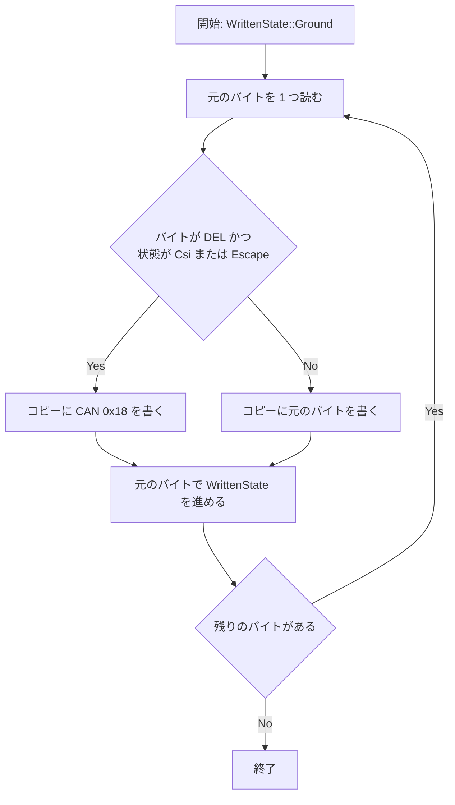

# mux-vt100-del-closing - 要件定義書

## 1. 概要

### 1.1 背景

scrollback リングには、strip / write-filter が書き込んだ CSI の閉じ（CSI_CLOSING = DEL `0x7F`）が含まれる。リングのバイトを vt100 に渡す 2 つの経路では、閉じた CSI の後ろの内容が正しく描画されない。

- 例: `ESC [ 6 DEL H e l l o CR LF` が、1 行の `"Hello"` ではなく 6 行目の `"ello"` として描画される。

### 1.2 目的

- 閉じた CSI の後ろの内容を、scrollback リングを読む 2 つの vt100 コンシューマで正しく描画する。
    - mux read（ReadPane）の描画: `agent_api.rs` の `render_scrollback_rows`
    - 復元時の shadow parser 再生: `MuxPane::from_restored`
- リングのバイトと term_core（クライアント）の再生経路は、変更前とバイト単位で同一に保つ。

### 1.3 スコープ

- 対象: vt100 に渡すコピーの DEL → CAN 変換（FR3）と、その 2 つの適用先（FR1 / FR2）、lone ESC の閉じ（D1）の扱い（FR4）、回帰テスト（FR5）。
- 対象外: scrollback リングの内容、strip / write-filter の出力（`CSI_CLOSING_BYTE = 0x7F`、D1 / D2 / D3 の挙動）、クライアントの term_core に届くバイト。
- 対象外: CSI 内の生の CAN に関する term_core と vt100 の既存の差異。

## 2. ビジネス要件

### 2.1 ビジネス目標

- 閉じた CSI の後ろの内容が、ReadPane の描画（`render_scrollback_rows`）と復元時の shadow parser 再生（`MuxPane::from_restored`）で正しく描画される。
- リングのバイトと term_core（クライアント）の再生経路はバイト単位で同一のまま。CSI_CLOSING は 1 バイトの DEL（`0x7F`）のままで、D2 の 1 対 1 置換も変更しない。

### 2.2 対象ユーザー

| ユーザータイプ | 説明 |
|----------------|------|
| ReadPane 呼び出し元 | mux read（ReadPane）でペインの scrollback 末尾を描画結果として受け取る |
| mux セッション復元 | 復元した scrollback を shadow parser に再生する `MuxPane::from_restored` |

### 2.3 期待される効果

- ReadPane の描画結果で、閉じた CSI の後ろの内容が正しい位置・内容で表示される。
- 復元後の shadow screen で、閉じた CSI の後ろの内容が正しい位置・内容で表示される。

## 3. ユースケース

### 3.1 ユースケース一覧

| ID | ユースケース名 | アクター | 優先度 |
|----|----------------|----------|--------|
| UC01 | ReadPane で scrollback 末尾を描画する | ReadPane 呼び出し元 | 高 |
| UC02 | 復元した scrollback を shadow parser に再生する | mux セッション復元 | 高 |

### 3.2 ユースケース詳細

#### UC01: ReadPane で scrollback 末尾を描画する

**アクター**: ReadPane 呼び出し元

**事前条件**:
- scrollback リングに、閉じた CSI（CSI 内の DEL）または lone ESC 直後の DEL を含むバイトがある。

**基本フロー**:
1. `render_scrollback_rows` が scrollback の末尾を取り出す。
2. 末尾のバイトから FR3 の vt100 再生用コピーを作る。
3. コピーを scratch vt100 parser に `scratch.process` で渡し、行を描画する。

**代替フロー**:
- 末尾の切り出し位置より前の状態は再構築しない。走査は ground から始める。

**事後条件**:
- 描画結果で、閉じた CSI の後ろの内容が正しく表示される（例: `ESC [ 6 DEL Hello CR LF` → `"Hello"`）。

#### UC02: 復元した scrollback を shadow parser に再生する

**アクター**: mux セッション復元

**事前条件**:
- 復元した scrollback バイトに、閉じた CSI を含むバイトがある。

**基本フロー**:
1. `MuxPane::from_restored` が復元した scrollback バイトを受け取る。
2. ペインの scrollback リングには、復元したバイトを DEL も含めてそのまま保持する。
3. 再生ステップで、FR3 の vt100 再生用コピーを shadow parser に `parser.process` で渡す。

**代替フロー**:
- alt-screen ダンプの再生は変更しない。alt-screen ダンプのバイトは変換しない。

**事後条件**:
- shadow screen で、閉じた CSI の後ろの内容が正しく表示される。
- scrollback リングの `read_all` は、復元したバイトと一致する。

## 4. 機能要件

### 4.1 機能一覧

| ID | 機能名 | 説明 | 優先度 |
|----|--------|------|--------|
| FR1 | ReadPane rendering cancels the closing for vt100 | `render_scrollback_rows` が scratch vt100 parser に FR3 の再生用コピーを渡す | 高 |
| FR2 | Restored shadow replay cancels the closing for vt100, and the ring is stored verbatim | `MuxPane::from_restored` が shadow parser に FR3 の再生用コピーを渡し、リングは復元バイトのまま保持する | 高 |
| FR3 | State-aware DEL-to-CAN conversion for the vt100 replay copy | CSI 内と lone ESC 直後の DEL を CAN に置き換えた同じ長さのコピーを返す共有関数 | 高 |
| FR4 | The lone-ESC closing (D1) is covered by the same conversion | lone ESC 直後に D1 が書いた DEL を FR3 で CAN にする | 高 |
| FR5 | Regression tests | 再発を検出するテスト | 高 |

### 4.2 機能詳細

#### FR1: ReadPane rendering cancels the closing for vt100

**説明**: `render_scrollback_rows`（`src-tauri/src/mux/ipc/handlers/agent_api.rs`）は、scratch vt100 parser に生の scrollback 末尾ではなく FR3 の vt100 再生用コピーを渡す。変換は `render_scrollback_rows` の中で `scratch.process` の前に行う。これにより `render_pane_tail` にも効果が現れる。

**入力**:
- scrollback 末尾: バイト列 - ReadPane が描画する scrollback の末尾

**出力**:
- 描画行: 文字列 - scratch vt100 parser で描画した行

**ビジネスルール**:
- 例: `ESC [ 6 DEL H e l l o CR LF` は 1 行の `"Hello"` として描画する（6 行目の `"ello"` ではない）。

#### FR2: Restored shadow replay cancels the closing for vt100, and the ring is stored verbatim

**説明**: `MuxPane::from_restored`（`src-tauri/src/mux/session/pane/mod.rs`）は、再生ステップ（再生バイトの `parser.process`）で、復元した scrollback バイトの FR3 vt100 再生用コピーを shadow parser に渡す。

**入力**:
- 復元した scrollback バイト: バイト列

**出力**:
- shadow parser の画面状態
- ペインの scrollback リング: 復元したバイトそのまま（DEL を含む）

**ビジネスルール**:
- scrollback リングは復元したバイトを変更せずに保持する。
- panic ガードと alt-screen ダンプの再生は変更しない。
- alt-screen ダンプのバイトは変換しない。

#### FR3: State-aware DEL-to-CAN conversion for the vt100 replay copy

**説明**: `src-tauri/src/mux/scrollback_filter.rs` の共有関数。バイト列を受け取り、同じ長さのコピーを返す。

**入力**:
- バイト列: 変換元

**出力**:
- コピー: 入力と同じ長さのバイト列

**処理フロー**:

**ビジネスルール**:
- 書き込まれたストリームが CSI 内（entry または parameter のサブ状態）にある位置、または lone ESC の直後（`WrittenState::Csi` または `WrittenState::Escape`）にある位置の DEL（`0x7F`）を CAN（`0x18`）に置き換える。
- それ以外はすべて入力と同じ。
- 走査は `WrittenState::Ground` から始める。
- 走査は置換前の元のバイトで、term_core の遷移に従って進める。既存の `WrittenState` の遷移（`WrittenState::advance` / `csi_step`）を使う。遷移表の 2 つ目のコピーは追加しない。
- 次の DEL は保持する。
    - ground の DEL
    - OSC / DCS / APC 本体内の DEL（`WrittenState` では Ground）
    - charset designator 待ち（`WrittenState::Designator`）の DEL
- それ以外のバイトは、すでに存在する CAN も含めて変更せずにコピーする。

#### FR4: The lone-ESC closing (D1) is covered by the same conversion

**説明**: 書き込まれた lone ESC の直後に D1 が書く DEL（Escape 状態での `Written::close_before_removal`）を FR3 で CAN にする。vt100 はそこでエスケープを終え、次のバイトをエスケープの final として扱わない。

**ビジネスルール**:
- 例: `ESC DEL H e l l o` は `"Hello"` として描画する。
- Escape 状態で書かれる D3 の切断時の閉じはすでに CAN（`write_filter.rs` の `ESCAPE_CLOSING`）で、変更しない。
- CSI 内で書かれる D3 の切断時の閉じは DEL で、FR3 の対象になる。

#### FR5: Regression tests

**説明**: 再発を検出するテスト。

**ビジネスルール**:
- (a) ReadPane の描画（`render_pane_tail`）で、`ESC [ 6 DEL Hello` が 1 行目に `"Hello"` を描画し、`ESC DEL Hello` が `"Hello"` を描画する。
- (b) `ESC [ 6 DEL Hello` を持つリングで `from_restored` を呼ぶと、shadow screen の 0 行目が `"Hello"` になり、リングの `read_all` には DEL バイトが残っている。
- (c) FR3 の関数の単体テストが、置換する位置と保持する位置を網羅する。
- (d) 再現経路: 状態を報告する strip に `ESC [ 6` と `n Hello` を 2 回の呼び出しで渡した D2 出力が、`render_pane_tail` で 1 行目に `"Hello"` を描画する。
- (a)、(b)、(d) は修正前に失敗する。

## 5. 非機能要件

### 5.1 パフォーマンス要件

- NFR2: 変換は O(n) の 1 パスで、出力コピー以外の追加状態は O(1)。ReadPane と復元の経路でのみ実行し、PTY reader / リング書き込みのホットパスでは実行しない。

### 5.2 セキュリティ要件

- 該当なし

### 5.3 可用性要件

- 該当なし

### 5.4 保守性要件

- NFR3: CLI-only ビルドがコンパイルできる: `CARGO_TARGET_DIR=src-tauri/target cargo check --manifest-path src-tauri/Cargo.toml --no-default-features`。vt100 と mux は常にビルドされるため、新しい関数は `gui` feature の後ろに置かない。
- NFR4: ライブラリのテストスイート全体が通る: `CARGO_TARGET_DIR=src-tauri/target cargo test --manifest-path src-tauri/Cargo.toml --lib`。

### 5.5 互換性要件

- NFR1: scrollback リングの内容、strip / write-filter の出力（`CSI_CLOSING_BYTE = 0x7F`、D1 / D2 / D3 の挙動）、クライアントの term_core に届くバイトは、変更前とバイト単位で同一。違うのは vt100 に渡すコピーだけ。

## 6. UI/UX要件

該当なし（mux daemon 内のバイトストリーム処理のみで、UI は変更しない）。

## 7. データ要件

該当なし

## 8. 外部連携

該当なし

## 9. 制約条件

### 9.1 技術的制約

- CSI_CLOSING は 1 バイトの DEL（`0x7F`）のまま。D2 の置換は 1 対 1 のまま。
- FR3 の走査は既存の `WrittenState` の遷移（`WrittenState::advance` / `csi_step`）を使い、遷移表のコピーを追加しない。
- FR3 の関数は `gui` feature の後ろに置かない。

### 9.2 ビジネス上の制約

- 該当なし

### 9.3 スケジュール制約

- 該当なし

### 9.4 宣言された変更集合

このフィーチャー固有のパスは手動で列挙せず、create-plan で `workflow.yaml` の各タスクの `files` から導出する（`references/phases/create-plan-phase.md`）。

**デフォルトメンバー**（SPEC作成者が明示的に除外しない限り、常に宣言に含まれる）:
- `feature-docs/mux-vt100-del-closing/**`
- `test-docs/mux-vt100-del-closing/**`

`feature-docs/mux-vt100-del-closing/**` に含まれるもの: `REQUIREMENTS.md`、`SPEC.md`、`IMPLEMENTATION.md`、`workflow.yaml`、`phase-state/`、`tasks/`、`reviews/roundN.yaml`、`VERIFICATION.md`、`retrospect.yaml`、およびデザインステップが生成するデザイン成果物。生成主体は各フェーズドキュメントおよび `references/phase-state.md` を参照（引用のみ、ルールは再掲しない）。

`test-docs/mux-vt100-del-closing/**` に含まれるもの: `{T}.tests.yaml`（パス形式: `test-docs/mux-vt100-del-closing/{T}.tests.yaml`）。生成主体は `implement-phase.md` を参照（引用のみ、ルールは再掲しない）。

**意味論**:
- デフォルトのメンバーは、SPEC作成者が明示的に除外しない限り宣言に含まれる。除外は意図的な絞り込みであり、記載漏れによる省略ではない。
- この宣言はスーパーセット（superset）の主張であり、実際の変更集合は宣言に含まれる（CONTAINED IN）必要がある。実際には生成されないパスが宣言されていても違反にはならない。implementタスクを1つも生成しないフィーチャーは `test-docs/{feature}/` ディレクトリを生成しないが、宣言された `test-docs/{feature}/**` は依然として正しい。

## 10. 想定される課題とリスク

### 10.1 技術的課題

| 課題 | 影響度 | 対応策 |
|------|--------|--------|
| ReadPane の末尾切り出し（`agent_api.rs` の `SCROLLBACK_READ_TAIL_BYTES`）やリング先頭の追い出しで、それより前の状態が失われる | 低 | 走査は ground から始め、切り出し範囲の最初の ESC より前の DEL は保持する。vt100 も ground から始まり、ground では DEL を無視する。既知の制約として記載する |
| CSI 内の生の CAN: 走査は CSI を開いたままにし（term_core は CSI 内で C0 を実行する）、CAN は変更せずにコピーする | 低 | term_core と vt100 の差異があるとしても既存のもので、対象外とする |

### 10.2 ビジネスリスク

該当なし

## 11. 成功基準

### 11.1 受け入れ基準

- [ ] AC-1（FR1, FR5）: `render_pane_tail(b"\x1b[6\x7fHello\r\n", "", 5, 80)` が `"Hello"` を返す。同じ入力は修正前に失敗する（Hello が 6 行目に `"ello"` として現れる）。
- [ ] AC-2（FR2, FR5, NFR1）: `b"\x1b[6\x7fHello"` を持つリングで `MuxPane::from_restored`（`alt_screen=false`）を呼ぶと、shadow screen の 0 行目が `"Hello"` になる。`pane.scrollback` の `read_all` は入力バイト（`0x7F` を含む）と一致する。テストは既存の `from_restored` テストと同じく unix 限定。
- [ ] AC-3（FR4, FR5）: `b"\x1b\x7fHello\r\n"` の `render_pane_tail` が `"Hello"` を返す。修正前に失敗する。
- [ ] AC-4（FR3）: FR3 の関数の出力長は入力長と等しい。DEL は、entry 状態の CSI 内（`ESC [ DEL`）、parameter 状態の CSI 内（`ESC [ 6 DEL`）、lone ESC の直後（`ESC DEL`）で CAN に置き換わる。DEL は、ground、OSC 本体内（`ESC ] 0 ; a DEL b BEL`）、DCS 本体内と APC 本体内、designator 待ち（`ESC ( DEL`）で保持される。CSI 内で DEL が 2 つ続くとき、置き換わるのは 1 つ目だけ（走査は元のバイトに従い、1 つ目の DEL で CSI が終わる）。DEL を含まない入力はそのまま返る。
- [ ] AC-5（FR5）: 再現経路: `strip_pty_output_for_scrollback_write_with_written_state` に `b"\x1b[6"`、続けて `b"nHello\r\n"`（状態を引き継ぐ）を渡した出力が D2 の DEL を含む。その出力の `render_pane_tail` が `"Hello"` を返す。
- [ ] AC-6（NFR1, NFR3, NFR4）: 既存の scrollback_filter / write_filter / pane / handlers のテストが変更なしで通る。`CSI_CLOSING_BYTE` は `0x7F` のまま。`--no-default-features` の check がコンパイルでき、`--lib` スイート全体が通る。

### 11.2 KPI

該当なし

## 12. テストシナリオ

### 12.1 テスト観点

- [ ] 正常系: TS-1（AC-1）`src-tauri/src/mux/ipc/handlers/tests.rs` の単体テスト。D2 形の末尾 `ESC [ 6 DEL Hello CR LF` で `render_pane_tail` を呼び、結果が `"Hello"` であることを確認する。
- [ ] 正常系: TS-2（AC-2）`src-tauri/src/mux/session/pane/tests.rs` の単体テスト（`cfg(unix)`）。`ESC [ 6 DEL Hello` を持つ `ScrollbackRingBuffer` を作り、`from_restored`（`alt_screen=false`）を呼ぶ。shadow screen の 0 行目が `"Hello"` で、scrollback の `read_all` が入力バイトと一致することを確認する。
- [ ] 正常系: TS-3（AC-3）`handlers/tests.rs` の単体テスト。`ESC DEL Hello CR LF` で `render_pane_tail` を呼び、`"Hello"` を確認する。
- [ ] 境界値: TS-4（AC-4）`src-tauri/src/mux/scrollback_filter/tests.rs` の単体テスト。入力と期待出力の表で、置換するケース（CSI entry、CSI param、lone ESC、開いた CSI の末尾にある D3 形の DEL）と保持するケース（ground、OSC / DCS / APC 本体、designator 待ち、取り消しの DEL に続く 2 つ目の DEL、DEL を含まない入力）を確認する。長さが保たれることを確認する。
- [ ] 正常系: TS-5（AC-5）`scrollback_filter/tests.rs` または `handlers/tests.rs` の単体テスト。状態を報告する strip を `ESC [ 6` に、続けて引き継いだ状態で `n Hello CR LF` に実行し、出力を連結する。`0x7F` を含むこと、`render_pane_tail` が `"Hello"` を返すことを確認する。
- [ ] 回帰: TS-6（AC-6）スイート。`CARGO_TARGET_DIR=src-tauri/target cargo test --manifest-path src-tauri/Cargo.toml --lib` と `CARGO_TARGET_DIR=src-tauri/target cargo check --manifest-path src-tauri/Cargo.toml --no-default-features` を実行する。
- [ ] 境界値（エッジケース）:
    - CSI 内の 2 つの DEL: 走査では 1 つ目で CSI が終わるため、2 つ目は ground にあり保持される。
    - プログラムが CSI 内に書いた DEL（閉じではない）も置き換わる。term_core もその DEL で CSI を取り消すため、vt100 が term_core と一致する。
    - CSI 内の生の CAN: 走査は CSI を開いたままにし（term_core は CSI 内で C0 を実行する）、CAN は変更せずにコピーする。term_core と vt100 の差異があるとしても既存のもので、対象外。
    - designator 待ちの DEL（`ESC ( DEL`）: 保持する。この状態では閉じは書かれない。
    - ReadPane の末尾切り出し（`agent_api.rs` の `SCROLLBACK_READ_TAIL_BYTES`）やリング先頭の追い出しで状態が失われる場合: 走査は ground から始まるため、切り出し範囲の最初の ESC より前の DEL は保持される。vt100 も ground から始まり、ground では DEL を無視する。既知の制約。
    - 空の入力は空の出力を返す。DEL を含まない入力はそのまま返る。
- [ ] セキュリティ: 該当なし
- [ ] パフォーマンス: NFR2 の条件（O(n) の 1 パス、ReadPane と復元の経路のみ）

## 13. 用語定義

| 用語 | 定義 |
|------|------|
| CSI_CLOSING | strip / write-filter が CSI を閉じるために書く 1 バイトの DEL（`0x7F`）。定数 `CSI_CLOSING_BYTE` |
| DEL | `0x7F` |
| CAN | `0x18` |
| D1 | 書き込まれた lone ESC の直後に書く閉じ（Escape 状態での `Written::close_before_removal`）。DEL を書く |
| D2 | strip の 1 対 1 置換。状態を報告する strip（`strip_pty_output_for_scrollback_write_with_written_state`）に `ESC [ 6` と `n Hello` を 2 回の呼び出しで渡すと、出力に D2 の DEL を含む |
| D3 | 切断時の閉じ。Escape 状態では CAN（`write_filter.rs` の `ESCAPE_CLOSING`）、CSI 内では DEL |
| WrittenState | 書き込まれたストリームの状態（Ground / Escape / Csi / Designator など）。`WrittenState::advance` / `csi_step` で遷移する |
| vt100 再生用コピー | FR3 の関数が返す、vt100 に渡すためのコピー |
| ReadPane | mux read。`render_scrollback_rows` / `render_pane_tail` で scrollback 末尾を描画する |

## 14. 確認事項

### 14.1 確認済み事項

- [x] 修正方針（requirement.fix-approach）: lone ESC 直後の DEL（D1）も対象に含め、同じ変換で扱う。
- [x] デザインステップ（design-step.recommendation）: スキップ。mux daemon 内のバイトストリーム処理のみで、UI は変更しない。

### 14.2 未確認・保留事項

- なし

### 14.3 前提

- a1: リングのバイト、strip / write-filter の出力、term_core の再生経路は変更しない。CSI_CLOSING は 1 バイトの DEL のままで、D2 の置換は 1 対 1 のまま。
- a2: 提供されたスキャン対象の範囲では、リングのバイトを受け取る vt100 コンシューマは `render_scrollback_rows` と `MuxPane::from_restored` だけ。ライブの PTY reader（`pty_spawn/mod.rs`）は、リングのバイトではなく生の読み取りデータを shadow parser に渡す。`build_shadow_parser_snapshot` はリングのバイトをクライアントの term_core に送り、vt100 には渡さない。`reference_scan_targets` 外のパスは調べていない。
- a3: lone ESC 直後の DEL（D1）は対象に含み、同じ変換で扱う（requirement.fix-approach の回答で確認済み）。
- a4: 変換するすべてのコピーで、走査は ground から始める。ReadPane の末尾切り出しより前やリングの追い出された先頭より前の状態は再構築しない。

## 15. 参考資料

- `src-tauri/src/mux/scrollback_filter.rs`: FR3 の関数の配置先、`WrittenState`
- `src-tauri/src/mux/ipc/handlers/agent_api.rs`: `render_scrollback_rows`、`SCROLLBACK_READ_TAIL_BYTES`
- `src-tauri/src/mux/session/pane/mod.rs`: `MuxPane::from_restored`
- `src-tauri/src/mux/ipc/pty_spawn/write_filter.rs`: `ESCAPE_CLOSING`
