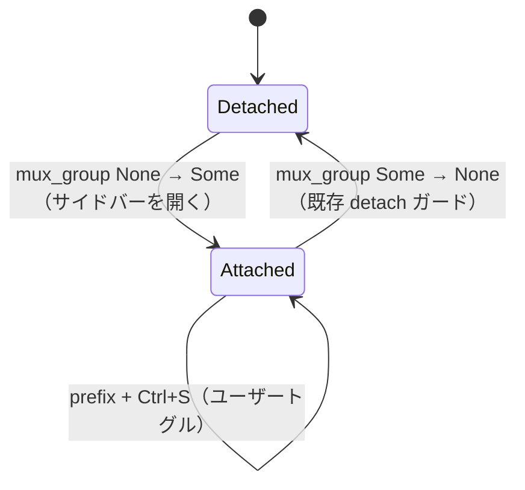

# mux-window-sidebar-overlay-hidden - 要件定義書

## 1. 概要

### 1.1 背景

オーバーレイモード (`settings.mux.window_sidebar_overlay: true`) の mux ウィンドウサイドバーが、emterm 起動直後に mux セッションへ attach した時点で表示されていない。表示するには起動のたびに prefix + Ctrl+S の手動トグルが必要になっている。

### 1.2 目的

AC-7 の「デフォルトで開いている」保証を復元し、起動直後の手動トグルを不要にする。

### 1.3 スコープ

**対象**: `src-tauri/src/app.rs` の pump ロジック（既存の detach ガード直後）への 1 箇所の状態代入とテスト追加。

**対象外**:

- `src-tauri/src/tabs.rs`（mux プロトコルハンドラ）および mux daemon / bridge の変更。
- 起動シーケンス中に 3927 行の detach ガードが発火する根本原因（spurious Detached 配信か初期化順序か）の究明。別タスクで追う。

## 2. ビジネス要件

### 2.1 ビジネス目標

- オーバーレイモードの mux ウィンドウサイドバーが、emterm 起動直後の mux セッション attach 完了時点で表示されている。起動のたびの prefix + Ctrl+S の手動トグルなしに AC-7 の「デフォルトで開いている」保証が復元される。

### 2.2 対象ユーザー

| ユーザータイプ | 説明 |
|----------------|------|
| `window_sidebar_overlay: true` 設定で mux を使う emterm ユーザー | `~/bin/init-mux` 等で emterm を起動して mux セッションへ attach する |

### 2.3 期待される効果

- 起動ごとの手動トグル操作が不要になる。

## 3. ユースケース

### 3.1 ユースケース一覧

| ID | ユースケース名 | アクター | 優先度 |
|----|----------------|----------|--------|
| UC01 | 起動直後からオーバーレイサイドバーが表示される | emterm ユーザー | 高 |
| UC02 | 再 attach でオーバーレイサイドバーが開き直る | emterm ユーザー | 中 |

### 3.2 ユースケース詳細

#### UC01: 起動直後からオーバーレイサイドバーが表示される

**アクター**: emterm ユーザー

**事前条件**:

- `settings.mux.window_sidebar_overlay: true`
- emterm を新規プロセスとして起動する（例: `~/bin/init-mux` 経由）

**基本フロー**:

1. ユーザーが emterm を新規プロセスとして起動する。
2. emterm が mux セッションへ attach する。
3. attach 完了の時点で、フローティングのオーバーレイサイドバーカードが表示されている。

**事後条件**:

- ユーザーによるトグル操作なしにサイドバーが開いている。

#### UC02: 再 attach でオーバーレイサイドバーが開き直る

**アクター**: emterm ユーザー

**事前条件**:

- ユーザーが prefix + Ctrl+S で明示的にオーバーレイサイドバーを閉じている。

**基本フロー**:

1. detach する。
2. 再度 attach する。
3. サイドバーが開いた状態に戻る。

**事後条件**:

- サイドバーが開いている。これは None→Some 遷移ルールの、受容済みかつ意図した副作用（タスクの「案2」）。

## 4. 機能要件

### 4.1 機能一覧

| ID | 機能名 | 説明 | 優先度 |
|----|--------|------|--------|
| FR1 | mux attach 遷移でオーバーレイサイドバーを開き直す | pump ロジックで `active_mux_attached_prev_pump` が None→Some に遷移したとき `mux_sidebar_overlay_open = true` を代入する | 高 |
| FR2 | init-mux 起動時に起動直後からサイドバーが表示される | 新規プロセス起動 → attach 完了時点でオーバーレイサイドバーカードが表示される | 高 |
| FR3 | 再 attach で開いた状態に戻る | 明示的に閉じた後の detach → 再 attach でサイドバーが開いた状態に戻る | 中 |

### 4.2 機能詳細

#### FR1: mux attach 遷移でオーバーレイサイドバーを開き直す

**説明**: `src-tauri/src/app.rs:3922-3929` の既存 detach ガードの直後の pump ロジックにおいて、`active_mux_attached_prev_pump` が None から Some へ遷移したとき（アクティブタブの `mux_group` が不在から存在へ変わったとき）、`self.mux_sidebar_overlay_open = true` を代入する。

**ステータス**: resolved

**ビジネスルール**:

- 代入位置は既存 detach ガードの直後とする。

#### FR2: init-mux 起動時に起動直後からサイドバーが表示される

**説明**: emterm を新規プロセスとして起動し（例: `~/bin/init-mux` 経由）、`window_sidebar_overlay: true` の状態で mux セッションへ attach した場合、attach 完了の瞬間からフローティングのオーバーレイサイドバーカードが表示される。ユーザーによるトグル操作は不要。

**ステータス**: resolved

#### FR3: 再 attach で開いた状態に戻る

**説明**: ユーザーが prefix + Ctrl+S で明示的にオーバーレイサイドバーを閉じた後、detach に続いて再 attach するとサイドバーは開いた状態に戻る。これは None→Some 遷移ルール（タスクの「案2」）の、受容済みかつ意図した副作用である。

**ステータス**: resolved

## 5. 非機能要件

### 5.1 パフォーマンス要件

該当なし。

### 5.2 セキュリティ要件

該当なし。

### 5.3 可用性要件

該当なし。

### 5.4 保守性要件

#### NFR1: 変更範囲の限定

修正は `src-tauri/src/app.rs` の pump ロジック内に閉じる。`src-tauri/src/tabs.rs`（mux プロトコルハンドラ）および mux daemon / bridge は変更しない。

**ステータス**: resolved

### 5.5 互換性要件

#### NFR2: 設定スキーマ非変更

`mux_sidebar_overlay_open` はランタイム専用フラグのままとする（`src-tauri/src/app.rs:921` で `true` に初期化）。設定へ永続化しない。`window_sidebar_overlay` 設定値および永続モードとの相互作用も変更しない。

**ステータス**: resolved

## 6. UI/UX要件

### 6.1 画面設計要件

オーバーレイサイドバーの外観・レイアウトは変更しない。表示のオン/オフ状態のみが対象。

### 6.2 画面遷移

### 6.3 レスポンシブ対応

該当なし。

## 7. データ要件

### 7.1 データモデル概要

該当なし（新規の永続データなし）。

### 7.2 データ項目

| エンティティ | 項目名 | 型 | 必須 | 説明 |
|--------------|--------|-----|------|------|
| ランタイム状態 | `mux_sidebar_overlay_open` | bool | ○ | ランタイム専用フラグ。永続化しない |

### 7.3 データ保持期間

該当なし（プロセスのランタイム内のみ）。

## 8. 外部連携

### 8.1 連携システム

該当なし。

### 8.2 API仕様要件

該当なし。

## 9. 制約条件

### 9.1 技術的制約

- 変更は `src-tauri/src/app.rs` の pump ロジックに閉じる（NFR1）。
- `mux_sidebar_overlay_open` はランタイム専用で永続化しない（NFR2）。

### 9.2 ビジネス上の制約

該当なし。

### 9.3 スケジュール制約

該当なし。

## 10. 想定される課題とリスク

### 10.1 技術的課題

| 課題 | 影響度 | 対応策 |
|------|--------|--------|
| タスク記述中のコード位置（app.rs:921 の初期化、app.rs:3100 のユーザートグル、app.rs:3927 の detach ガード、tabs.rs:2285 / tabs.rs:2233 の一時 None 発生源）が実際とずれている可能性 | 中 | 実装計画者が正確な行位置を確認する |
| 起動シーケンス中に 3927 のガードが発火する根本原因が未究明 | 中 | 本タスクではスコープ外。別タスクで追う |

### 10.2 ビジネスリスク

| リスク | 発生確率 | 影響度 | 対応策 |
|--------|----------|--------|--------|
| 明示的に閉じた後も再 attach でサイドバーが開く | 高 | 低 | 受容済み挙動としてタスクの受け入れ基準に明記されている（FR3） |

## 11. 成功基準

### 11.1 受け入れ基準

- [ ] `src-tauri/src/app.rs:3922-3929` の直後、`active_mux_attached_prev_pump` が None → Some に遷移した pump において `self.mux_sidebar_overlay_open = true` が代入される。
- [ ] `window_sidebar_overlay: true` の状態で init-mux 経由で emterm を起動し mux へ attach すると、起動直後からサイドバーが表示される。
- [ ] 明示的な Ctrl+S での close の後、detach → 再 attach でサイドバーが開いた状態に戻る。
- [ ] 起動 → mux attach 完了後に `mux_sidebar_overlay_open == true` であることを検証する新規テストが存在する。
- [ ] 3927 の detach ガードに対する既存テスト（`ac7_*` テスト群および関連テスト）がリグレッションなく通る。

### 11.2 KPI

該当なし。

## 12. テストシナリオ

### 12.1 テスト観点

- [ ] 正常系 (TS1): ユニットテスト（プロジェクト慣例に従い `src-tauri/src/app.rs` 内のインライン `#[cfg(test)]`）。アクティブタブの `mux_group` が None → Some となる pump シーケンスをシミュレートし、`mux_sidebar_overlay_open == true` を検証する。
- [ ] リグレッション (TS2): detach ガードを覆う既存の `ac7_*` テスト（Some → None で依然としてフラグが false になること）を実行する。
- [ ] リグレッション (TS3): ライブラリスイート全体 `CARGO_TARGET_DIR=src-tauri/target cargo test --manifest-path src-tauri/Cargo.toml --lib` を実行する（`tabs.rs` の replay テストが不安定な場合は `-- --test-threads=1` が必要になることがある）。
- [ ] 手動確認 (TS4): ユーザーによる手動検証。`window_sidebar_overlay: true` で `~/bin/init-mux` 経由で起動し、オーバーレイサイドバーが直ちに表示されることを確認する。続いて Ctrl+S で閉じ、detach、再 attach し、開き直ることを確認する。

## 13. 用語定義

| 用語 | 定義 |
|------|------|
| オーバーレイモード | `settings.mux.window_sidebar_overlay: true` のとき、mux ウィンドウサイドバーをフローティングカードとして重ねて表示するモード |
| detach ガード | `src-tauri/src/app.rs:3922-3929` にある、mux から detach したときにサイドバー状態を落とす既存処理 |
| AC-7 | オーバーレイサイドバーが「デフォルトで開いている」ことを定める既存の受け入れ基準 |

## 14. 確認事項

### 14.1 確認済み事項

- [x] 採用方針: None→Some 遷移で開き直す（タスクの「案2」）。
- [x] 明示的な close 後でも再 attach でサイドバーが開く点: 受容済み挙動。タスクの受け入れ基準に明記されている。
- [x] 常時オープンが UX 的に許容される理由: 非アクティブなオーバーレイは `OVERLAY_IDLE_OPACITY = 0.35`（`app.rs:76`）で描画されるため、既存の設計意図と整合する。
- [x] 3927 のガードが起動シーケンス中に発火する根本原因（spurious Detached 配信か初期化順序か）の究明は明示的にスコープ外。別タスクで追う。
- [x] デザインステップ: スキップ。既存 pump ロジックの内部状態機械のバグ修正（boolean 代入 1 つとテスト）であり、新規 UI サーフェスも視覚/レイアウト/トークンの変更もない。オーバーレイサイドバーの外観は変更しない。本プロジェクトの解決済み入力にデザインシステム候補は存在しない。

### 14.2 未確認・保留事項

- [ ] タスク記述由来のコード位置の主張（`app.rs:921` の初期化、`app.rs:3100` のユーザートグル、`app.rs:3927` の detach ガード、`tabs.rs:2285` / `tabs.rs:2233` の一時 None 発生源）は本ディスパッチでは独立検証しておらず、行位置がずれている可能性がある。実装計画者が正確な位置を確認する。

## 15. 参考資料

- SPEC.md: `feature-docs/mux-window-sidebar-overlay-hidden/SPEC.md`
