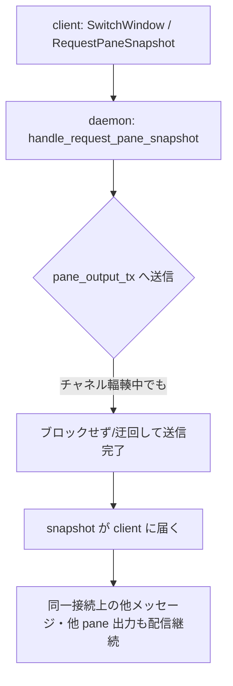

# mux window切替ハング修正（大量出力中） - 要件定義書

## 1. 概要

### 1.1 背景

`seq 1 10000000` のように大量の出力が発生し続けるコマンドを実行している最中に
mux window を切り替えると、ハングして操作を受け付けなくなる。一度クライアント
（eMterm）を落として再アタッチしても、該当タブが固まったままだったり、他の
タブも巻き添えで固まるケースがある。

### 1.2 目的

大量出力中の window 切替でハングしないようにする。

### 1.3 スコープ

mux daemon 側の接続処理（`src-tauri/src/mux/ipc/connection.rs` /
`handlers.rs`）における pane 出力チャネルまわりの修正。クライアント側の
off-thread snapshot reparse（`tabs.rs`）は対象外（既に別タスクで対応済み）。

## 2. ビジネス要件

### 2.1 ビジネス目標

AI エージェント（Claude Code 等）が大量出力を伴うコマンドを実行している間も、
ユーザーが他のタブ/ウィンドウを操作できる状態を維持する。

### 2.2 対象ユーザー
| ユーザータイプ | 説明 |
|----------------|------|
| eMterm mux 利用者 | 複数ウィンドウ/タブを切り替えながら作業する開発者 |

### 2.3 期待される効果
- 大量出力中でも window 切替・他タブへの入力が滞らない

## 3. ユースケース

### 3.1 ユースケース一覧
| ID | ユースケース名 | アクター | 優先度 |
|----|----------------|----------|--------|
| UC01 | 大量出力中に window を切り替える | mux 利用者 | 高 |

### 3.2 ユースケース詳細

#### UC01: 大量出力中に window を切り替える

**アクター**: mux 利用者

**事前条件**:
- あるペインで `seq 1 10000000` 等、大量出力を継続的に生成するコマンドが実行中

**基本フロー**:
1. 利用者が別の mux window/tab に切り替える
2. daemon がその pane のスナップショットを構築し client へ送る
3. client がスナップショットを受け取り表示を切り替える
4. 出力中のペインの出力も引き続き配信され続ける

**代替フロー**:
- 出力量が非常に多く、pane 出力チャネルが輻輳している状態で切替が発生しても、
  上記フローが完了する（ハングしない）

**事後条件**:
- window 切替が完了し、他ウィンドウ・他タブへの入力も引き続き受け付けられる

## 4. 機能要件

### 4.1 機能一覧
| ID | 機能名 | 説明 | 優先度 |
|----|--------|------|--------|
| F01 | pane snapshot 配信のデッドロック解消 | 大量出力による pane 出力チャネル輻輳時でも snapshot 配信がブロックし続けない | 高 |
| F02 | 接続処理の応答性維持 | snapshot 配信待ちの間も同一接続上の他メッセージ処理・出力配信を継続する | 高 |

### 4.2 機能詳細

#### F01: pane snapshot 配信のデッドロック解消

**説明**: `handle_request_pane_snapshot` が `pane_output_tx.send(...).await` で
スナップショットを同一 pane の PTY 出力チャネルへ送る際、チャネルが満杯だと
`await` で待機する。このチャネルを消費できるのは同じ接続タスクの
`pane_output_rx.recv()` アームのみだが、そのタスクは `send().await` の中で
停止しているため消費が進まず、接続タスク全体が自己デッドロックする
（`src-tauri/src/mux/ipc/connection.rs` の単一 `select!` ループ、
`handlers.rs` の `handle_request_pane_snapshot`）。この自己デッドロックが
発生しないようにする。

**処理フロー**:

**ビジネスルール**:
- snapshot chunk は同一 pane の既存 PTY 出力チャンクとの FIFO 順序を維持する
  （表示のちらつき・順序崩れを防ぐため、既存設計の意図を踏襲する）

#### F02: 接続処理の応答性維持

**説明**: F01 の修正後も、同一接続上の他のクライアントメッセージ処理
（他ペインへの入力など）や他 pane の PTY 出力配信が、特定 pane の
snapshot 配信待ちによって遅延・停止しないようにする。

## 5. 非機能要件

### 5.1 パフォーマンス要件
- 大量出力中の window 切替がハングしない（無限待機しない）
- 既存の FIFO 順序保証・バックプレッシャー特性（無制限メモリ増加をしない）
  を維持する

### 5.4 保守性要件
- ログ出力: 既存の backpressure ログ（"Pane {} backpressure: channel full,
  blocking" 等）の水準を踏襲する

## 9. 制約条件

### 9.1 技術的制約
- daemon 側の接続処理（`src-tauri/src/mux/ipc/connection.rs` /
  `pane.rs` / `handlers.rs` / `pty_spawn.rs`）が対象
- クライアント側 off-thread replay（`tabs.rs`）は既存実装のままでよい
  （このバグの原因ではないと調査で確認済み）

## 11. 成功基準

### 11.1 受け入れ基準
- [ ] 大量のデータを出力中に mux window を切り替えてもハングしない

## 12. テストシナリオ

### 12.1 テスト観点
- [ ] 正常系: 大量出力中に window/pane を切り替えても daemon 接続タスクが
      応答し続ける
- [ ] 境界値: pane 出力チャネルが満杯（バックプレッシャー発生中）の状態で
      snapshot 要求が来ても、接続タスクが他メッセージを処理し続ける

## 14. 確認事項

### 14.1 確認済み事項

- [x] 原因調査: `connection.rs` の単一 `select!` ループが
      `pane_output_tx`（daemon 接続ごとに1つ、容量256、全 pane 共有）を
      snapshot 配信と PTY 出力配信の両方で使っており、
      `handle_request_pane_snapshot` の `pane_output_tx.send(...).await` が
      チャネル満杯時にブロックすると、それを消費するはずの
      `pane_output_rx.recv()` アームも同じタスク上にあるため進行できず
      自己デッドロックする、という daemon 側の設計起因の不具合と判明（batch
      モードでの Explore 調査、Codex 相談不可のため自己判断で確認事項として
      記録）
- [x] クライアント側の off-thread snapshot reparse（`tabs.rs`）は
      別タスク（mux-offthread-replay 系）で既に対応済みであり、本件の
      原因ではないと確認

### 14.2 未確認・保留事項
- [ ] 具体的な解消方式（チャネル分離 / 非同期タスク化 / 容量拡張など）は
      SPEC.md の Implementation Approach に候補を記載するが、最終選定は
      create-plan フェーズに委ねる（アサンプション: FIFO 順序保証を壊さない
      方式を優先する）
