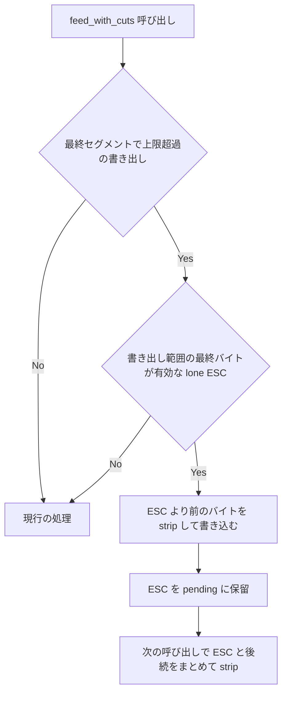

# mux-write-filter-overflow-lone-esc - 要件定義書

## 1. 概要

### 1.1 背景
scrollback 書き込みフィルタ（`ScrollbackWriteFilter`）は、保留が `SCROLLBACK_FILTER_PENDING_CAP`（512 KiB）を超えると保留中の列を一括で書き出す（上限超過の書き出し経路）。この書き出しの末尾が単独の ESC（lone ESC）で、strip 対象の残り（例: `[6n`）が次の PTY 読み取りで届くと、`ESC[6n` が実行可能なカーソル位置報告（CPR）照会として scrollback リングに残る。

タスク記述にある原因箇所（`scrollback_filter.rs:121`、「Escape が CSI 状態として報告されない」）は mux-strip-escape-state-carry より前の記述である。現行コードでは、このような書き出しの後、フィルタは `WrittenState::Escape` を引き継ぐ（R9 で固定済み）。現行コードで残っている原因は別にある。次の呼び出しの `strip_pass` は書き出し済みの ESC を含まない `[6n` だけを見るため `scan_csi_device_query` が走らず、そのバイト列がそのまま書き込まれてリング上で `ESC[6n` が成立する。これは `write_filter.rs` の `feed_with_cuts`（上限超過分岐、485-522 行）と `scrollback_filter.rs` の `strip_pass`（393-397 行、433-444 行）を読んで確認した。

上限超過を経由しない経路は、末尾の lone ESC を pending に保留する。このため次の読み取りの strip がシーケンス全体を見て除去できる。

### 1.2 目的
上限超過の書き出し経路でも、開始 ESC が書き出し範囲の最終バイトで、残りが後続の PTY 読み取りで届く strip 対象を、scrollback リングに実行可能な形（例: CPR 照会としての `ESC[6n`）で残さない。

### 1.3 スコープ
- 対象: 呼び出しの最終セグメント（その呼び出し内で後続のカットが無い）で上限超過の書き出しが起き、書き出し範囲の最終バイトが有効な lone ESC である場合
    - 有効な lone ESC: strip が書き出し、書き出し済みストリームを `WrittenState::Escape` にする ESC。`ESC (` / `ESC )` の後の文字集合指示バイトは含まない
- 対象外: 書き出し済みの ESC の後に strip が除去する構成要素が続くことで、書き出し済みストリームが Escape で終わる場合（R4 / R9 形式）
- 対象外: 呼び出しをまたいで分割された CSI 照会（mux-strip-escape-state-carry の EC-7）
- 対象外の 2 件は、既存テストが固定している挙動のまま残す

## 2. ビジネス要件

### 2.1 ビジネス目標
- 上限超過の書き出し経路で、開始 ESC が書き出し範囲の最終バイトで残りが後続の読み取りで届く strip 対象を、scrollback リングに実行可能な形で残さない
- 上限超過の書き出し経路で、このような分割された strip 対象を、上限超過を経由しない経路と同じに分類する

### 2.2 対象ユーザー
| ユーザータイプ | 説明 |
|----------------|------|
| mux 利用者 | mux の pane を使い、scrollback リングが再生される利用者 |

### 2.3 期待される効果
- クライアントが開始していない照会が、上限超過の書き出し経路でもリング上で成立しない
- 同じバイト列に対して、読み取りの分割位置によらず同じ出力になる

## 3. ユースケース

### 3.1 ユースケース一覧
| ID | ユースケース名 | アクター | 優先度 |
|----|----------------|----------|--------|
| UC01 | 上限超過の書き出しが lone ESC で終わり、次の読み取りで照会の残りが届く | mux の pane の PTY 出力 | 高 |

### 3.2 ユースケース詳細

#### UC01: 上限超過の書き出しが lone ESC で終わり、次の読み取りで照会の残りが届く

**アクター**: mux の pane の PTY 出力

**事前条件**:
- 書き込みフィルタが保留上限に達した列（例: OSC）を保留している

**基本フロー**:
1. 保留上限を超える続きが、末尾が lone ESC の形で届く（上限超過の書き出しが起きる）
2. 次の読み取りで `[6n` が届く
3. フィルタは保留した ESC と `[6n` をまとめて strip し、`ESC[6n` を除去する

**代替フロー**:
- 次の読み取りが strip 対象でない続き（例: `x`、`[H`）の場合、ESC と続きをそのまま書き込む
- 次の読み取りの前にカット、またはリーダーのフォールバック終端が来た場合、保留した ESC は書き込まずに破棄し、ESC の前の書き込み済み状態に応じた終端を 1 つ書き込む

**事後条件**:
- scrollback リングに実行可能な `ESC[6n` が無い

## 4. 機能要件

### 4.1 機能一覧
| ID | 機能名 | 説明 | 優先度 |
|----|--------|------|--------|
| FR1 | lone ESC で終わる上限超過の書き出し: ESC を次の読み取りとまとめて分類する | 最終バイトの lone ESC をその呼び出しでは書き込まず保留し、次の呼び出しで後続とまとめて strip する | 高 |
| FR2 | 上限超過の書き出し後のメモリ上限 | 上限超過の書き出し後、pending に残るのは保留した ESC 1 バイトまで | 高 |
| FR3 | 上限超過の書き出しのその他の部分は変えない | 保留した ESC より前のバイト、引き継ぐ状態、carried 報告は現行どおり | 高 |
| FR4 | 保留した ESC の後続呼び出しでの振る舞い | 上限超過を経由しない経路で保留した末尾の lone ESC と同じに振る舞う | 高 |
| FR5 | 保留した ESC の dims 帰属 | 保留した ESC は、それを生んだ読み取りの dims に帰属する | 高 |
| FR6 | 回帰テスト | 報告された現象を再現し、再発を検出するテスト | 高 |

### 4.2 機能詳細

#### FR1: lone ESC で終わる上限超過の書き出し: ESC を次の読み取りとまとめて分類する

**説明**: `ScrollbackWriteFilter::feed_with_cuts` が呼び出しの最終セグメント（その呼び出し内で後続のカットが無い）で上限超過の書き出しを行い、書き出し範囲の最終バイトが有効な lone ESC（strip が書き出し、書き出し済みストリームを `WrittenState::Escape` にする ESC。`ESC (` / `ESC )` の後の文字集合指示バイトではない）である場合、その ESC はその呼び出しでは書き込まない。ESC を保留し、次の呼び出しで後続のバイトとまとめて strip する。開始 ESC がそのバイトで、残りが後続の呼び出しで届く strip 対象は、上限超過を経由せずに同じバイトが届いた場合と同じくリングから除去する。

対象の strip 対象:
- CSI デバイス照会（`ESC[6n` / `ESC[5n` / `ESC[c` など）
- OSC 777 ビューア起動
- OSC 9999 emterm-md
- OSC 777 agent-status 報告
- Kitty APC
- SIXEL DCS

**処理フロー**:

**ビジネスルール**:
- 上限超過を経由しない経路と同じ分類結果にする

#### FR2: 上限超過の書き出し後のメモリ上限

**説明**: 上限超過の書き出し後、pending に残るのは FR1 の ESC 1 バイトまで。それ以外の場合は現行どおり空のまま。保留上限は引き続きメモリを制限する。

#### FR3: 上限超過の書き出しのその他の部分は変えない

**説明**:
- 書き出し範囲のうち保留した ESC より前のバイトは、すべて strip を通し、その呼び出しで書き込む
- 引き継ぐ書き込み済み状態は、書き込んだそれらのバイトの終了状態（引き継いだ状態から開始）
- awaiting-designator フラグは、書き出し範囲の終端でのクライアント同等の状態（lone ESC で終わる範囲では false）
- その呼び出しは、現行どおり carried completion を報告しない

#### FR4: 保留した ESC の後続呼び出しでの振る舞い

**説明**: 保留した ESC は、上限超過を経由しない経路で保留した末尾の lone ESC と同じに振る舞う。

**ビジネスルール**:
- strip 対象でない続き（例: プレーンテキスト、`ESC[H`）は、ESC と一緒に書き込み、何も落とさない
- カット、またはリーダーのフォールバック終端（空の fed 範囲で、カットが 0 の位置）では、保留した ESC を書き込まずに破棄し（round3 FR1）、ESC の前の書き込み済み状態が決める終端を 1 つ（`closure_for`）書き込む
- 保留した ESC の続きが OSC / DCS / APC 文字列を完結させる場合は、既存の規則に従い carried completion として報告する

#### FR5: 保留した ESC の dims 帰属

**説明**: 保留した ESC は、それを生んだ読み取りの dims に帰属する（バイトを書き出した呼び出しが残した末尾に関する既存の D7''' 規則に従い、`pending_started_dims` をその呼び出しの `current_dims` にする）。

#### FR6: 回帰テスト

**説明**: 報告された現象を再現するテストを置く。上限で保留した OSC を、lone ESC で終わる呼び出しで上限を超えて続け、後続の呼び出しで `[6n` を送る。次を確認する。
- リングに実行可能な `ESC[6n` が無い
- term_core でリングを再生してもカーソル位置報告が出ない

各 strip 対象の続きと、strip 対象でない続きを網羅し、本番のリーダー水準のケースを含める。

## 5. 非機能要件

### 5.1 パフォーマンス要件
- NFR1: fed バイトに対する追加の走査を行わない。上限超過経路での追加処理は O(1)（書き出し範囲の最終バイトと、strip が報告する終了状態の確認）。既存の時間予算テスト（BUDGET、10 秒）が引き続き通る

### 5.2 セキュリティ要件
- 入力検証: 上限超過の書き出し経路でも、クライアントが開始していない照会をリングで成立させない（FR1）

### 5.3 可用性要件
- 該当なし

### 5.4 保守性要件
- ドキュメント: NFR4: 上限超過の事後条件（「上限超過の書き出し直後、pending は常に空」）を述べる doc コメントを、新しい事後条件（空、または保留した lone ESC 1 バイトちょうど）に更新する

### 5.5 互換性要件
- NFR2: 読み取りの分割によらない出力。同じバイト列に対し、呼び出しをまたいで書き込まれるバイトは、最後の ESC とその続きが上限超過しない 1 回の呼び出しで届いた場合に書き込まれるバイトと等しい
- NFR3: その他の部分は変えない。接続中のクライアントへそのまま転送するバイト、snapshot 時の strip（`strip_replayable_rich_content`）、上限超過を経由しない経路、`scrollback_filter.rs` の strip 関数は現行の挙動を保つ。既存テストは期待値を変えずに通る。特に次のテスト
    - `escape_carry_an_overflow_flush_ending_in_a_written_escape_carries_or_closes_it`（R9）
    - `post_strip_an_overflow_flush_followed_by_a_cut_closes_an_open_csi`
    - round3 の上限超過 designator テスト
    - `an_osc_held_near_the_cap_is_dropped_at_a_cut_and_at_the_fallback`
    - `escape_carry_alternating_written_escapes_and_strip_targets_finish_within_the_budget`
- NFR5: Linux と Windows でビルドできる。mux のコードは CLI ビルドと共有しているため、`--no-default-features`（CLI のみ）のチェックも通る

## 6. UI/UX要件

該当なし（UI・表示・操作の変更を伴わない mux daemon 内部のバイト列フィルタの修正）。

## 7. データ要件

該当なし。

## 8. 外部連携

該当なし。

## 9. 制約条件

### 9.1 技術的制約
- fed バイトに対する追加の走査を行わない（NFR1）
- 保留上限によるメモリ制限を保つ（FR2）
- `--no-default-features`（CLI のみ）のビルドが通る（NFR5）

### 9.2 ビジネス上の制約
- 該当なし

### 9.3 スケジュール制約
- 該当なし

### 9.4 宣言された変更集合

このフィーチャー固有のパスは手動で列挙せず、create-plan で `workflow.yaml` の各タスクの `files` から導出する（`references/phases/create-plan-phase.md`）。

**デフォルトメンバー**（SPEC作成者が明示的に除外しない限り、常に宣言に含まれる）:
- `feature-docs/mux-write-filter-overflow-lone-esc/**`
- `test-docs/mux-write-filter-overflow-lone-esc/**`

`feature-docs/mux-write-filter-overflow-lone-esc/**` に含まれるもの: `REQUIREMENTS.md`、`SPEC.md`、`IMPLEMENTATION.md`、`workflow.yaml`、`phase-state/`、`tasks/`、`reviews/roundN.yaml`、`VERIFICATION.md`、`retrospect.yaml`、およびデザインステップが生成するデザイン成果物。生成主体は各フェーズドキュメントおよび `references/phase-state.md` を参照（引用のみ、ルールは再掲しない）。

`test-docs/mux-write-filter-overflow-lone-esc/**` に含まれるもの: `{T}.tests.yaml`（パス形式: `test-docs/mux-write-filter-overflow-lone-esc/{T}.tests.yaml`）。生成主体は `implement-phase.md` を参照（引用のみ、ルールは再掲しない）。

**意味論**:
- デフォルトのメンバーは、SPEC作成者が明示的に除外しない限り宣言に含まれる。除外は意図的な絞り込みであり、記載漏れによる省略ではない。
- この宣言はスーパーセット（superset）の主張であり、実際の変更集合は宣言に含まれる（CONTAINED IN）必要がある。実際には生成されないパスが宣言されていても違反にはならない。implementタスクを1つも生成しないフィーチャーは `test-docs/mux-write-filter-overflow-lone-esc/` ディレクトリを生成しないが、宣言された `test-docs/mux-write-filter-overflow-lone-esc/**` は依然として正しい。

## 10. 想定される課題とリスク

### 10.1 技術的課題
| 課題 | 影響度 | 対応策 |
|------|--------|--------|
| 上限超過経路の既存の挙動（R4 / R9 形式、文字集合指示 ESC、同じ呼び出し内のカット）を変えてしまう | 高 | AC-6 の回帰マトリクスと既存テスト（NFR3）で現行のバイトと状態を固定する |

### 10.2 ビジネスリスク
| リスク | 発生確率 | 影響度 | 対応策 |
|--------|----------|--------|--------|
| 該当なし | - | - | - |

## 11. 成功基準

### 11.1 受け入れ基準
- [ ] AC-1（FR1, FR6）: フィルタ水準の再現。OSC を上限で保留する（`osc_held_at_the_cap`）。呼び出し 1 はその続き（本文の続き、BEL、`abc`、ESC）で、上限超過する。呼び出し 2 は `[6n`。2 回の呼び出しは合わせて `ESC[6n` を書き込まず、書き込んだバイトを term_core に入れてもカーソル位置報告が出ない
- [ ] AC-2（FR1, NFR2）: 後続の呼び出しで lone ESC に続く各 strip 対象（`[6n`、`[5n`、`[c`、`]777;emterm;markdown;...BEL`、`]9999;emterm-md;...BEL`、`]777;emterm;agent-status;...BEL`、`_G...ESC\\`、`P...q...ESC\\`）について、その構成要素が書き込みバイトに無い。全体の出力は、最後の ESC とその続きが上限超過しない 1 回の呼び出しで届くように同じストリームを入れた場合の出力と等しい
- [ ] AC-3（FR2, FR3, FR5）: AC-1 の上限超過した呼び出しの直後、`pending()` は `[ESC]`（`pending_len() == 1`）。書き込みバイトは、最後の ESC を除いた範囲を strip したものと等しい。`written_state()` はそれらのバイトの終了状態（`abc` + ESC で終わる範囲では Ground）。`awaiting_designator()` は false。`outcome.carried` は None。保留した ESC を後で書き出すときの帰属 dims は、その呼び出しの `current_dims`
- [ ] AC-4（FR4）: 呼び出し 2 の strip 対象でない続き（`x`、`[H`）は、ESC に続けて書き込まれ、バイトを失わない
- [ ] AC-5（FR4）: AC-1 の上限超過した呼び出しの後、空の範囲で fed 0 の位置のカット（リーダーのフォールバック）、または呼び出し 2 の先頭のカットでは、保留した ESC について何も書き込まず、pending は空、状態は Ground になる。term_core でリングを再生した結果は、カットの位置に 47 / 1047 / 1049 の h / l の組を置いた生ストリームの参照と一致する
- [ ] AC-6（FR3, NFR3）: FR1 の対象外の上限超過ケースは現行のバイトと状態を保つ。ESC + 完全な除去対象の構成要素で終わる範囲（R9 形式）、文字集合指示 ESC で終わる範囲（`ESC ( ESC`）、`ESC[6` + 除去対象の構成要素で終わる範囲、同じ呼び出し内で上限超過の後にカットが続く場合（strip した範囲 + 終端 1 つ）、プレーンなバイトで終わる範囲
- [ ] AC-7（FR1, FR6）: 本番のリーダー。OSC を上限超過まで伸ばすチャンクが lone ESC で終わり、次のチャンクが `[6n`。pane の scrollback リングに実行可能な `ESC[6n` が無い
- [ ] AC-8（NFR1, NFR3, NFR5）: 既存の時間予算テストを含む `--lib` テスト全体が通る。`CARGO_TARGET_DIR=src-tauri/target cargo check --manifest-path src-tauri/Cargo.toml --no-default-features` が成功する

### 11.2 KPI
| 指標 | 目標値 | 測定方法 |
|------|--------|----------|
| 該当なし | - | - |

## 12. テストシナリオ

### 12.1 テスト観点
- [ ] 正常系: TS-1（AC-1）フィルタの単体テスト。OSC を上限で保留し、lone ESC で終わる続きで上限超過させ、`[6n` を入れる。連結した出力に `ESC[6n` が無く、再生時に term_core の応答が無い
- [ ] 正常系: TS-2（AC-2）すべての strip 対象（`post_strip_cut_csi::all_targets` と CSI 照会の形）を、上限超過の末尾 ESC の続きとして順に試す。除去されることと、上限超過しない入れ方との一致を確認する
- [ ] 正常系: TS-3（AC-3, AC-4）上限超過した呼び出しの後の pending / written_state / awaiting_designator / carried を確認する。strip 対象でない続きで ESC + バイトがそのまま残ることを確認する
- [ ] 異常系: TS-4（AC-5）上限超過で保留した ESC の後のフォールバック終端とカットを、カットの位置に画面切替の組を置いた生ストリームを term_core に入れた結果（`view_after_a_cut` オラクル）と比較する
- [ ] 境界値: TS-5（AC-6）有効な lone ESC で終わらない範囲についての上限超過経路の回帰マトリクス。バイトと状態は変わらない。既存の R9、post_strip R4、round3 上限超過テストを基準にする
- [ ] 正常系: TS-6（AC-7）本番のリーダーのテスト（`run_reader_without_owner`、または `round3_write_path` の visibility-restore ヘルパー）。リングの内容に `ESC[6n` が無い
- [ ] パフォーマンス: TS-7（AC-8）`--lib` テスト全体と CLI のみの cargo check を実行する

## 13. 用語定義

| 用語 | 定義 |
|------|------|
| 保留上限 | `SCROLLBACK_FILTER_PENDING_CAP`（512 KiB）。書き込みフィルタが pending に保留できる上限 |
| 上限超過の書き出し | 保留が上限を超えたときに、保留中の列を一括で書き出す `feed_with_cuts` の分岐 |
| 有効な lone ESC | strip が書き出し、書き出し済みストリームを `WrittenState::Escape` にする ESC。`ESC (` / `ESC )` の後の文字集合指示バイトは含まない |
| strip 対象 | リングに入れる前に strip が除去する構成要素（CSI デバイス照会、OSC 777 ビューア起動、OSC 9999 emterm-md、OSC 777 agent-status 報告、Kitty APC、SIXEL DCS） |
| リーダーのフォールバック終端 | 空の fed 範囲で、カットが 0 の位置にある呼び出し |
| carried completion | 呼び出しをまたいで完結した OSC / DCS / APC 文字列の報告 |

## 14. 確認事項

### 14.1 確認済み事項
- [x] 現行コードでの原因: 次の呼び出しの `strip_pass` は書き出し済みの ESC を含まない `[6n` だけを見るため `scan_csi_device_query` が走らず、バイト列がそのまま書き込まれてリング上で `ESC[6n` が成立する。`write_filter.rs` の `feed_with_cuts`（上限超過分岐、485-522 行）と `scrollback_filter.rs` の `strip_pass`（393-397 行、433-444 行）を読んで確認済み
- [x] 上限超過の書き出しの後、フィルタは `WrittenState::Escape` を引き継ぐ（R9 で固定済み）。タスク記述の `scrollback_filter.rs:121` の記述は mux-strip-escape-state-carry より前のもの

### 14.2 前提（変更可能な仮定）
- [ ] A1: 対象は、呼び出しの最終セグメントでの上限超過の書き出しのうち、書き出し範囲が有効な lone ESC（最終バイトで書き込み済み状態が Escape）で終わるもの。書き出し済みの ESC の後に strip が除去する構成要素が続くことで書き出し済みストリームが Escape で終わる範囲（R4 / R9 形式）は、この修正の対象外。呼び出しをまたいで分割された CSI 照会（mux-strip-escape-state-carry の EC-7）も同様。どちらも既存テストが固定している挙動のまま残す
- [ ] A2: 実装の方向: 最後の ESC を pending に保留する（1 バイト、`held_construct_start` は `Some(0)`）。上限超過を経由しない lone ESC の保留と同じ形にする。FR1-FR5 を満たすなら、plan で同等の仕組みを選んでもよい
- [ ] A3: タスク記述の原因行の参照（`scrollback_filter.rs:121`、「Escape が CSI 状態として報告されない」）は mux-strip-escape-state-carry より前のもの。現行の原因は 14.1 のとおり
- [ ] A4: 同じ呼び出し内で上限超過の後にカットが続く場合は、現行の出力を保つ。strip した範囲 + `closure_for` による終端 1 つ（書き込み済み ESC で終わる範囲では Escape の終端）
- [ ] A5: snapshot 時の strip は、reattach 時に連続した `ESC[6n` をリングから既に除去している。このフィーチャーは書き込み経路を修正し、snapshot の strip は多層防御として残す
- [ ] A6: `run_suppressed_pipeline` は `scrollback_filter.pending()` を `prepare_suppressed_replacement` に渡す。変更後、保留した ESC は、上限超過を経由しない経路で保留した lone ESC と同じにそこで見える。別の扱いは不要

### 14.3 未確認・保留事項
- なし

## 15. 参考資料

- `src-tauri/src/mux/ipc/pty_spawn/write_filter.rs`: `ScrollbackWriteFilter::feed_with_cuts`（上限超過分岐）、`SCROLLBACK_FILTER_PENDING_CAP`
- `src-tauri/src/mux/scrollback_filter.rs`: `strip_pass`、`scan_csi_device_query`
