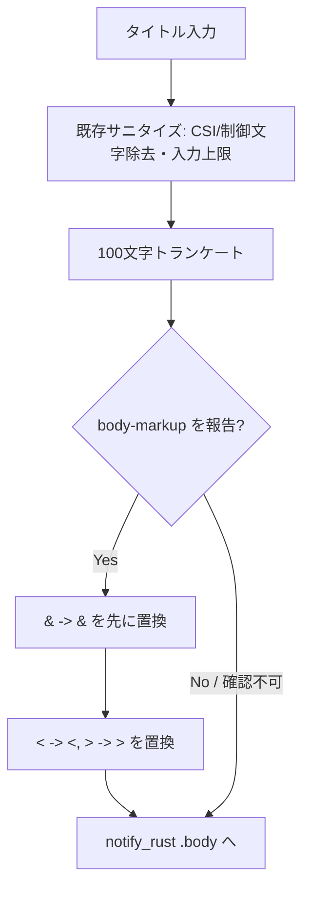

# notification-body-markup-escape - 要件定義書

## 1. 概要

### 1.1 背景

OS デスクトップ通知の本文に渡されるタブタイトルは、任意の子プロセスが OSC 0/2 で書き換えられるため、攻撃者の影響下にある。本文マークアップに対応した通知サーバー（GNOME Shell / Plasma / dunst の markup=full）では、このタイトルがマークアップとして解釈される。

本件はレビュー指摘 afa7e833c3f394a8（PR #31 round1、severity medium、category security、confidence 95、Claude と Codex のクロスモデル合意）に対応するものである。

### 1.2 目的

- 本文マークアップ対応の通知サーバーにおけるマークアップインジェクション（フィッシングリンク、偽装された書式）を防ぐ。
- 不正なマークアップに起因する通知の消失・パース失敗を防ぐ。
- レビュー指摘 afa7e833c3f394a8 をクローズする。

### 1.3 スコープ

**対象**:

- 通知本文へ渡されるタイトル文字列に対するマークアップメタ文字のエスケープ（`&` -> `&amp;`、`<` -> `&lt;`、`>` -> `&gt;`）。
- notify_rust の `get_capabilities()` による `"body-markup"` ケイパビリティ判定に基づくエスケープ適用の切り替え。
- `sanitize_title` を共有する 2 経路（エージェント通知経路、タブアクティビティ通知経路）。

**対象外**（タスクで明示された範囲外）:

- 通知経路の非同期化。
- `sanitize_title` の既存の CSI 除去 / 制御文字除去 / 入力上限 / 100 文字トランケート挙動の変更。
- Windows 通知経路（ケイパビリティ判定もエスケープも追加しない）。

## 2. ビジネス要件

### 2.1 ビジネス目標

- 本文マークアップ対応の通知サーバー上で、OSC 0/2 由来のタブタイトルによるマークアップインジェクション（フィッシングリンク、偽装された書式）を防ぐ。
- 通知本文中の不正マークアップによる通知消失・パース失敗を防ぐ。
- レビュー指摘 afa7e833c3f394a8（PR #31 round1、severity medium、category security、confidence 95、クロスモデル合意）をクローズする。

### 2.2 対象ユーザー

| ユーザータイプ | 説明 |
|----------------|------|
| Linux 上の eMterm 利用者（本文マークアップ対応の通知サーバー環境） | GNOME Shell / Plasma / dunst（markup=full）でデスクトップ通知を受け取る利用者。タイトルがマークアップとして解釈される影響を受ける |
| Linux 上の eMterm 利用者（本文マークアップ非対応の通知サーバー環境） | `"body-markup"` を報告しない通知サーバーの利用者。エスケープ実体参照が生テキストとして見えてはならない |
| Windows 上の eMterm 利用者 | 通知経路に変更が入らない利用者 |

### 2.3 期待される効果

- 攻撃者が制御可能なタイトルが通知本文でマークアップとして解釈されなくなる。
- 不正マークアップに起因する通知の消失・パース失敗が発生しなくなる。
- レビュー指摘 afa7e833c3f394a8 がクローズされる。

## 3. ユースケース

### 3.1 ユースケース一覧

| ID | ユースケース名 | アクター | 優先度 |
|----|----------------|----------|--------|
| UC01 | エージェント通知の送出 | eMterm（エージェント通知経路） | 高 |
| UC02 | タブアクティビティ通知の送出 | eMterm（タブアクティビティ通知経路） | 高 |

### 3.2 ユースケース詳細

#### UC01: エージェント通知の送出

**アクター**: eMterm のエージェント通知経路

**事前条件**:

- タブタイトルが OSC 0/2 により子プロセスから設定されている（内容は信頼できない）。

**基本フロー**:

1. タイトル文字列が `sanitize_title`（src-tauri/src/notifications.rs:145）に渡される。
2. 既存のサニタイズ（CSI 除去、C0/DEL/C1 制御文字除去、入力上限、100 文字トランケート）が適用される。
3. 通知サーバーが `"body-markup"` を報告している場合、マークアップメタ文字がエスケープされる。
4. 結果が `NotifyRustSink::send`（src-tauri/src/callbacks.rs:145）経由で notify_rust の `.body()` に渡される。

**代替フロー**:

- 通知サーバーが `"body-markup"` を報告しない、またはケイパビリティを確認できない場合、本文はエスケープせずに渡される。

**事後条件**:

- 本文マークアップ対応サーバーではタイトルがリテラルテキストとして描画される。
- 非対応サーバーでは `&amp;` などの実体参照が生テキストとして見えない。

#### UC02: タブアクティビティ通知の送出

**アクター**: eMterm のタブアクティビティ通知経路

**事前条件**:

- UC01 と同じ。

**基本フロー**:

- UC01 と同一。本経路は `sanitize_title` を UC01 と共有する。

**代替フロー**:

- UC01 と同一。

**事後条件**:

- UC01 と同一。

## 4. 機能要件

### 4.1 機能一覧

| ID | 機能名 | 説明 | 優先度 |
|----|--------|------|--------|
| FR1 | 通知本文タイトルのマークアップメタ文字エスケープ | `&` -> `&amp;`、`<` -> `&lt;`、`>` -> `&gt;` に置換する | 高 |
| FR2 | 100 文字トランケート後のエスケープ実行 | エスケープはトランケートの後に行う | 高 |
| FR3 | 本文マークアップケイパビリティによるゲート | `"body-markup"` 報告時のみエスケープする | 高 |
| FR4 | sanitize_title を共有する 2 経路の網羅 | エージェント通知経路とタブアクティビティ通知経路の双方を対象とする | 高 |
| FR5 | Windows 通知経路は無変更 | Windows 経路にケイパビリティ判定もエスケープも追加しない | 高 |

### 4.2 機能詳細

#### FR1: 通知本文タイトルのマークアップメタ文字エスケープ

**説明**: OS 通知の本文に渡されるタイトルテキストを、notify_rust の `.body()` に到達する前に `&` -> `&amp;`、`<` -> `&lt;`、`>` -> `&gt;` の順序規則でエスケープする。これにより、本文マークアップ対応サーバー（GNOME Shell / Plasma / dunst の markup=full）はリテラルテキストとして描画する。`&` を最初に置換することで、生成済みの実体参照が二重エスケープされない。

**入力**:

- title: 文字列 - サニタイズ済みのタブタイトル（OSC 0/2 由来、信頼できない）

**出力**:

- body: 文字列 - エスケープ済みのタイトル（notify_rust の `.body()` に渡る）

**処理フロー**:

**ビジネスルール**:

- `&` の置換を最初に行う（二重エスケープの曖昧さを避けるため）。
- エスケープ対象は `&` `<` `>` の 3 文字のみ。

**バリデーション**:

| 項目 | ルール | エラーメッセージ |
|------|--------|------------------|
| title | 既存の入力上限・100 文字トランケートに従う（NFR1 のとおり変更しない） | 該当なし（既存挙動を維持） |

**エラーケース**:

| エラー | 条件 | 対応 |
|--------|------|------|
| ケイパビリティ取得の失敗 | `get_capabilities()` が失敗する | 「ケイパビリティ未確認」として扱い、エスケープしない |

#### FR2: 100 文字トランケート後のエスケープ実行

**説明**: エスケープはサニタイズパイプラインの既存の 100 文字トランケートの後に実行する。これによりエスケープ実体参照がシーケンス途中で切断されることがない。

**ビジネスルール**:

- エスケープ後の文字列長は 100 文字を超えることがあり、それは正当な結果である。

#### FR3: 本文マークアップケイパビリティによるゲート

**説明**: エスケープは notify_rust の `get_capabilities()` が `"body-markup"` を報告した場合にのみ適用する。ケイパビリティが存在しない場合、または確認できない場合は、本文をエスケープせずに渡す。これによりプレーンテキストのサーバーで `&amp;` が生テキストとして見えることがない。

**エラーケース**:

| エラー | 条件 | 対応 |
|--------|------|------|
| ケイパビリティ未確認 | `"body-markup"` が報告されない / `get_capabilities()` が失敗する | エスケープを適用しない |

#### FR4: sanitize_title を共有する 2 経路の網羅

**説明**: 本修正はエージェント通知経路とタブアクティビティ通知経路の双方を対象とする。両経路は `sanitize_title`（src-tauri/src/notifications.rs:145）を共有し、`NotifyRustSink::send`（src-tauri/src/callbacks.rs:145）に接続している。

#### FR5: Windows 通知経路は無変更

**説明**: ケイパビリティ判定は Linux 固有（D-Bus 上の org.freedesktop.Notifications）である。Windows の通知経路にはケイパビリティ判定もエスケープ処理も追加しない。

## 5. 非機能要件

### 5.1 パフォーマンス要件

要件として提示されていない。

### 5.2 セキュリティ要件

- 入力検証（NFR2）: エスケープ処理は、OSC 0/2 由来のタイトルテキストが notify_rust の `.body()` に到達するすべての経路上に配置し、信頼できないタイトルが迂回できないようにする。
- 認証・認可・データ保護: 要件として提示されていない。

### 5.3 可用性要件

要件として提示されていない。

### 5.4 保守性要件

- NFR3（フィーチャーゲート / プラットフォームゲートの衛生）: notify-rust は `gui` フィーチャーのオプショナル依存であるため、新規コードは既存の `#[cfg(feature = "gui")]` / `#[cfg(unix)]` / `#[cfg(windows)]` のゲート規約に従い、`--no-default-features`（CLI のみ）ビルドと Windows ビルドがコンパイル可能な状態を維持する。

### 5.5 互換性要件

- NFR1（既存 `sanitize_title` 挙動の保持）: CSI シーケンス除去、C0/DEL/C1 制御文字除去、入力上限、100 文字トランケートは従来どおりに動作する。追加されるのは新しいエスケープ手順のみ。
- NFR3 のとおり、`--no-default-features`（CLI のみ）ビルドおよび Windows ビルドの互換性を維持する。

## 6. UI/UX要件

本機能は Rust 通知パイプライン内の非 UI のセキュリティバグ修正（文字列エスケープ + D-Bus ケイパビリティ判定）であり、視覚的な表面・新規 UI コンポーネント・デザイントークンの関与はない。designer フェーズはスキップされる。

## 7. データ要件

新規のデータモデル・データ項目・保持期間の要件はない。

## 8. 外部連携

### 8.1 連携システム

| システム名 | 連携方法 | データ |
|------------|----------|--------|
| org.freedesktop.Notifications（Linux の通知サーバー） | D-Bus（notify_rust 経由） | `get_capabilities()` の応答（`"body-markup"` の有無）、通知本文 |

### 8.2 API仕様要件

- notify_rust の `get_capabilities()` により `"body-markup"` の有無を判定する。
- 通知本文は notify_rust の `.body()` に渡す。

## 9. 制約条件

### 9.1 技術的制約

- notify-rust は `gui` フィーチャーのオプショナル依存であり、既存の `#[cfg(feature = "gui")]` / `#[cfg(unix)]` / `#[cfg(windows)]` ゲート規約に従う必要がある。
- ケイパビリティ判定は Linux 固有（D-Bus 上の org.freedesktop.Notifications）である。
- 作業は PR #31 を含む main から開始する（ベースコミット上で `sanitize_title` が notifications.rs:145 に存在することをオーケストレーターが確認済み）。

### 9.2 ビジネス上の制約

- タスクで指定された対象外事項: 通知経路の非同期化、および `sanitize_title` の既存 CSI / 制御文字 / 入力上限 / トランケート挙動の変更。

### 9.3 スケジュール制約

要件として提示されていない。

## 10. 想定される課題とリスク

### 10.1 技術的課題

| 課題 | 影響度 | 対応策 |
|------|--------|--------|
| 実装位置の選択（`sanitize_title` 末尾 か `NotifyRustSink::send` の `.body()` 直前か） | 中 | plan フェーズに委譲。両案とも全受け入れ基準を満たす（14.1 参照） |
| プレーンテキストサーバーで `&amp;` が生表示されること | 中 | FR3 のケイパビリティゲートで回避 |
| エスケープ実体参照のシーケンス途中切断 | 中 | FR2 によりトランケート後にエスケープする |

### 10.2 ビジネスリスク

| リスク | 発生確率 | 影響度 | 対応策 |
|--------|----------|--------|--------|
| 攻撃者が制御可能なタイトルによるマークアップインジェクション（フィッシングリンク・偽装書式） | - | - | FR1 / FR3 / NFR2 |
| 不正マークアップによる通知の消失・パース失敗 | - | - | FR1 |

## 11. 成功基準

### 11.1 受け入れ基準

- [ ] 通知本文タイトルのマークアップメタ文字（`&` -> `&amp;`、`<` -> `&lt;`、`>` -> `&gt;`）をエスケープするコード経路が存在する。
- [ ] エスケープは 100 文字トランケートの後に実行され、実体参照がシーケンス途中で分断されない。
- [ ] エスケープは notify_rust の `get_capabilities()` が `"body-markup"` を確認した場合にのみ適用され、body-markup を通知しないサーバーで `&amp;` が生表示されない。
- [ ] `<a href="https://attacker.invalid">Sign in</a>` のようなタイトル（タグ・実体参照を含む）が本文でリテラルテキストのみになることを固定するユニットテストが存在する。
- [ ] `CARGO_TARGET_DIR=src-tauri/target cargo test --manifest-path src-tauri/Cargo.toml --lib` が通る。

### 11.2 KPI

要件として提示されていない。

## 12. テストシナリオ

### 12.1 テスト観点

- [ ] セキュリティ（TS1）: タグインジェクションのタイトル `<a href="https://attacker.invalid">Sign in</a>` が、解釈可能なマークアップを含まないエスケープ済みリテラルテキストのみの本文を生成する。
- [ ] 正常系（TS2）: 既に `&amp;` を含む入力が `&amp;amp;` にエスケープされ、`&` 先行順序が二重エスケープの曖昧さを防いでいることを確認する。
- [ ] 境界値（TS3）: 100 文字を超え、境界付近にメタ文字を持つタイトルが、先にトランケートされてからエスケープされ、実体参照が分断されない（エスケープ結果が 100 文字を超えることは正当）。
- [ ] 異常系（TS4）: `"body-markup"` が報告されない場合、本文は未エスケープのタイトルを保持する（`&amp;` が可視化されない）。
- [ ] 正常系（TS5）: エージェント通知経路とタブアクティビティ通知経路が使用する共有パイプライン経由でエスケープが実行される。
- [ ] 回帰（TS6）: 既存の `sanitize_title` / `notification_body` のテスト期待値が NFR1 と整合したままである。
- [ ] 正常系（TS7）: `--lib` スイート全体が通る（テストは `--lib` にあり、`--bin emterm` では 0 件。`tabs.rs` の replay テストは不安定な場合 `-- --test-threads=1` が必要）。

## 13. 用語定義

| 用語 | 定義 |
|------|------|
| body-markup | notify_rust の `get_capabilities()` が報告するケイパビリティ。通知サーバーが本文中のマークアップを解釈することを示す |
| OSC 0/2 | 端末のタイトル設定に用いられる制御シーケンス。任意の子プロセスから発行できる |
| `sanitize_title` | src-tauri/src/notifications.rs:145 のタイトルサニタイズ関数。エージェント通知経路とタブアクティビティ通知経路が共有する |
| `NotifyRustSink::send` | src-tauri/src/callbacks.rs:145 の通知送出処理 |

## 14. 確認事項

### 14.1 確認済み事項

- [x] 実装位置: plan フェーズに委譲する。タスクは 2 案を提示している — (a) `sanitize_title` の末尾（両タイトル経路の単一チョークポイント。既存の `sanitize_title` / `notification_body` のテスト期待値の更新が必要）、(b) `NotifyRustSink::send` の `.body()` 直前（`window_host/link_hover.rs` の notify 呼び出しなど、他の本文生成元も追加でカバーする）。両案とも全受け入れ基準を満たす。
- [x] エスケープ対象文字: `&` `<` `>` の 3 文字で十分。目的は本文でのタグ / 実体参照の解釈防止であり属性コンテキストのエスケープではないため、クォートのエスケープは不要。
- [x] `get_capabilities()` の失敗時: 「ケイパビリティ未確認」として扱い、エスケープしない。
- [x] ベース: 作業は PR #31 を既に含む main から開始する（オーケストレーターが確認済み。ベースコミット上で `sanitize_title` は notifications.rs:145 に存在）。
- [x] 対象外（タスク指定）: 通知経路の非同期化、および `sanitize_title` の既存 CSI / 制御文字 / 入力上限 / トランケート挙動の変更。
- [x] デザインステップ: スキップ。Rust 通知パイプラインにおける非 UI のセキュリティバグ修正（文字列エスケープ + D-Bus ケイパビリティ判定）であり、視覚的表面・新規 UI コンポーネント・デザイントークンの関与がない。

### 14.2 未確認・保留事項

- なし（全機能要件・非機能要件が resolved）。

## 15. 参考資料

- レビュー指摘: afa7e833c3f394a8（PR #31 round1、severity medium、category security、confidence 95）
- `sanitize_title`: src-tauri/src/notifications.rs:145
- `NotifyRustSink::send`: src-tauri/src/callbacks.rs:145
- 追加の本文生成元（実装位置案 b がカバーする範囲）: src-tauri/src/window_host/link_hover.rs
