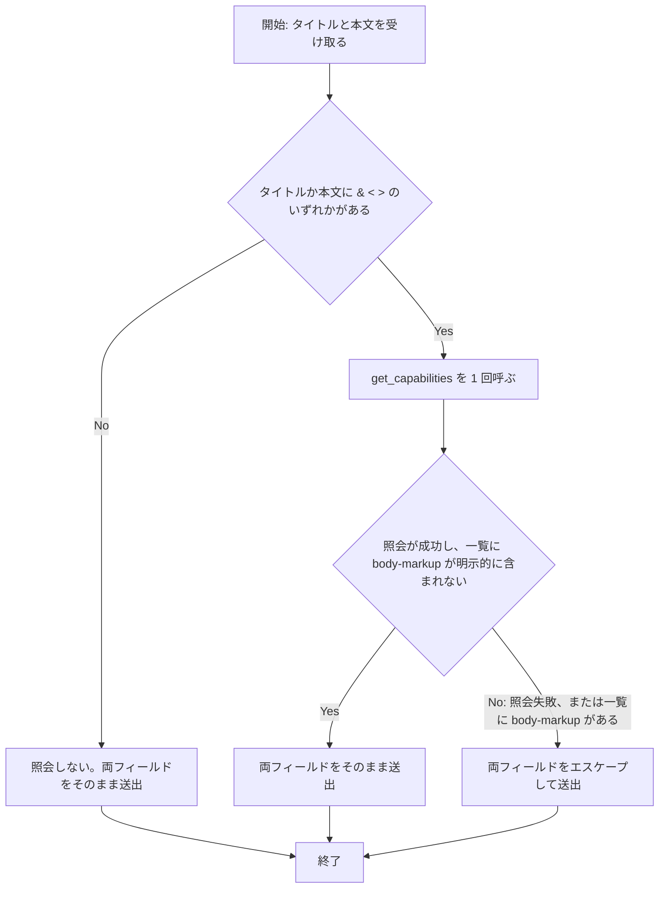

# notification-capability-query-skip - 要件定義書

## 1. 概要

### 1.1 背景
現状、通知ワーカーは通知のたびに `notify_rust::get_capabilities()` を無条件で呼んでいる。
そのため 1 通知あたり、ブロッキングの D-Bus 接続 2 本と往復 2 回（capability 照会と `.show()`）がかかっている。本来は接続 1 本と往復 1 回で済む。

### 1.2 目的
- 通知のたびに無条件で `notify_rust::get_capabilities()` を呼ぶのをやめる。
- notification-markup-fail-closed で導入した fail-closed のマークアップエスケープ保証を、そのまま維持する。

### 1.3 スコープ
- 対象: Unix における通知ワーカー（`src-tauri/src/callbacks.rs` の `notify_worker`）の capability 照会を、タイトルまたは本文にメタ文字（`&`、`<`、`>`）が含まれるときだけ行うよう変更する。
- 対象: 照会するかどうかの判定と、それに続くエスケープ判定を、D-Bus 接続なしでテストできる単位にする。
- 対象: `src-tauri/src/callbacks.rs` 内の、capability 照会を通知ごとに毎回行うと記述しているコメントを更新する。
- 対象外: capability のキャッシュ（NFR1）。
- 対象外: Windows の送出経路（NFR3、A5）。
- 対象外: 過去のフィーチャー文書の編集（A4）。
- 対象外: `pending_notifications` の doc コメント更新（A3）。

## 2. ビジネス要件

### 2.1 ビジネス目標
- 通知のたびに無条件で `notify_rust::get_capabilities()` を呼ぶのをやめる。
- fail-closed のマークアップエスケープ保証を、現状のまま維持する。

### 2.2 対象ユーザー
| ユーザータイプ | 説明 |
|----------------|------|
| （記載なし） | requirements_analysis に対象ユーザーの定義はない |

### 2.3 期待される効果
- タイトル・本文のどちらにもメタ文字を含まない通知では、capability 照会の D-Bus 接続と往復が発生しない。
- 送出されるタイトル・本文は、変更前とバイト単位で同一のまま保たれる。

## 3. ユースケース

### 3.1 ユースケース一覧
該当なし。本フィーチャーは `src-tauri/src/callbacks.rs` 内の通知ワーカーに閉じたバックエンドのみの Rust 変更であり、UI の追加・変更はない。

### 3.2 ユースケース詳細
該当なし。

## 4. 機能要件

### 4.1 機能一覧
| ID | 機能名 | 説明 | 優先度 |
|----|--------|------|--------|
| FR1 | メタ文字を含まないテキストでは capability 照会を行わない | タイトルにも本文にも `&`、`<`、`>` が含まれないとき、`get_capabilities()` を呼ばずに両フィールドをそのまま送出する | 高 |
| FR2 | メタ文字を含むときは通知ごとに 1 回だけ照会する | タイトルか本文にメタ文字があるとき、その通知について `get_capabilities()` をちょうど 1 回呼び、既存の fail-closed 規則で両フィールドのエスケープを決める | 高 |
| FR3 | 送出テキストはバイト単位で同一 | 入力と照会結果のあらゆる組み合わせで、`notify_rust::Notification` に渡す summary と body が現行実装とバイト単位で同一 | 高 |
| FR4 | 照会判定を単体テスト可能にする | 照会するかどうかの判定と、それに続くエスケープ判定を、D-Bus 接続なしでテストできる単位に置く | 高 |
| FR5 | doc コメントを新しい挙動に合わせる | capability 照会を毎回行うと記述しているコメントを、条件付き照会の記述に書き換える | 中 |

### 4.2 機能詳細

#### FR1: メタ文字を含まないテキストでは capability 照会を行わない

**説明**: Unix において、通知ワーカー（`src-tauri/src/callbacks.rs` の `notify_worker`）は、タイトル（summary）にも本文（body）にも `&`、`<`、`>` のいずれの文字も含まれないとき、`notify_rust::get_capabilities()` を呼ばない。両フィールドを変更せずに送出する。

**入力**:
- タイトル（summary）: 文字列 - キューから受け取った通知タイトル
- 本文（body）: 文字列 - キューから受け取った通知本文

**出力**:
- summary / body: 文字列 - 入力と同一の値

**ビジネスルール**:
- 判定対象の文字は `&`、`<`、`>` の 3 文字だけとする。
- タイトルと本文の両方を判定対象とする。

#### FR2: メタ文字を含むときは通知ごとに 1 回だけ照会する

**説明**: タイトルか本文（または両方）に `&`、`<`、`>` が含まれるとき、ワーカーはその通知について `get_capabilities()` をちょうど 1 回呼ぶ。通知をまたいだキャッシュは行わない。その 1 回の結果で、既存の fail-closed 規則に従い両フィールドのエスケープを決める。

**入力**:
- タイトル（summary）: 文字列 - キューから受け取った通知タイトル
- 本文（body）: 文字列 - キューから受け取った通知本文
- capability 照会結果: 成功時は capability の一覧、失敗時はエラー

**出力**:
- summary / body: 文字列 - 下記ルールに従い、そのまま、または両方エスケープした値

**処理フロー**:

**ビジネスルール**:
- テキストをそのまま通すのは、照会が成功し、かつその一覧に `body-markup` が明示的に含まれないときだけとする。
- 照会が失敗したとき、または一覧に `body-markup` が含まれるときは、両フィールドをエスケープする。
- 1 通知につき照会は 1 回だけ行い、その結果で両フィールドを決める。
- 通知をまたいだキャッシュは行わない。

**エラーケース**:
| エラー | 条件 | 対応 |
|--------|------|------|
| capability 照会の失敗 | `get_capabilities()` がエラーを返す | 両フィールドをエスケープして送出する |

#### FR3: 送出テキストはバイト単位で同一

**説明**: 入力テキストと capability 照会結果のあらゆる組み合わせについて、`notify_rust::Notification` に渡す summary と body は、現行実装が生成するものとバイト単位で同一とする。

#### FR4: 照会判定を単体テスト可能にする

**説明**: 照会するかどうかの判定と、それに続くエスケープ判定を、D-Bus 接続なしでテストが実行できる単位に置く。たとえば、capability 照会を注入された遅延評価の呼び出し可能オブジェクトとして受け取る形にできる。テストは、照会が実行されたかどうかと、その回数を観測できる。

#### FR5: doc コメントを新しい挙動に合わせる

**説明**: `src-tauri/src/callbacks.rs` 内で、capability 照会を通知ごとに毎回行うと記述しているコメントを、条件付き照会の記述に書き換える。

**対象箇所**:
- `notify_worker` の doc コメント
- エスケープ判定の上にある D3 コメント
- `NotifyRustSink` の doc コメント
- `escape_for_send` の doc コメント（「queries get_capabilities() exactly once per send」）

**ビジネスルール**:
- PTY 処理スレッドまたは UI スレッド上で同期的な D-Bus 往復が発生すると主張するコメントを残さない。

## 5. 非機能要件

### 5.1 非機能要件一覧
| ID | 要件 |
|----|------|
| NFR1 | capability のキャッシュを一切行わない。`OnceLock`、TTL、通知をまたいだメモ化のいずれも使わない。notification-worker-thread の D3 の鮮度に関する決定と、fail-closed のセキュリティ方針を維持する。 |
| NFR2 | エスケープ出力を変えない。`escape_body_markup`（`&`、`<`、`>` の順）、`body_markup_absence_confirmed` の意味、`sanitize_title`、`NotificationRateLimiter` はすべて現状のままとする。 |
| NFR3 | プラットフォームの条件分岐を変えない。capability 照会とエスケープ判定は `#[cfg(unix)]` のままとする。Windows の送出経路と、enqueue / receive / dispatch の経路には新しい cfg 分岐を加えない。CLI のみのビルド（`--no-default-features`）が引き続きコンパイルできる。 |
| NFR4 | 秘匿化の順序を変えない。秘匿化したログ表示は、引き続きエスケープ前の、キューから受け取った生の値から導出する。 |
| NFR5 | 新しい依存を追加しない。 |
| NFR6 | `src-tauri/src/callbacks/tests.rs` にある既存の `escape_for_send`、`body_markup_absence_confirmed`、`escape_body_markup` のテストは、期待値を変えない。シグネチャが変わる場合も、変えてよいのは呼び出し側の書き方だけで、アサーションは変えない。 |

### 5.2 パフォーマンス要件
- タイトルにも本文にもメタ文字を含まない通知では、capability 照会を行わない（FR1）。
- 数値目標は requirements_analysis に記載なし。

### 5.3 セキュリティ要件
- fail-closed のエスケープ規則を維持する（FR2、NFR2）。
- capability のキャッシュを行わない（NFR1）。

### 5.4 保守性要件
- ログ出力: 秘匿化したログ表示は、エスケープ前の生の値から導出する（NFR4）。
- ドキュメント: `src-tauri/src/callbacks.rs` のコメントを条件付き照会の記述に合わせる（FR5）。
- テスト: 既存のエスケープ関連テストの期待値を変えない（NFR6）。

### 5.5 互換性要件
- プラットフォームの条件分岐を変えない（NFR3）。
- 新しい依存を追加しない（NFR5）。

## 6. UI/UX要件

該当なし。UI の追加・変更はない。

## 7. データ要件

該当なし。

## 8. 外部連携

### 8.1 連携システム
| システム名 | 連携方法 | データ |
|------------|----------|--------|
| デスクトップ通知サーバー（D-Bus、Unix） | `notify_rust::get_capabilities()` | capability の一覧 |
| デスクトップ通知サーバー（D-Bus、Unix） | `notify_rust::Notification` の `.show()` | summary、body |

### 8.2 API仕様要件
- `notify_rust::get_capabilities()` の呼び出しは、タイトルか本文にメタ文字があるときだけ、1 通知につき 1 回とする（FR1、FR2）。

## 9. 制約条件

### 9.1 技術的制約
- capability 照会とエスケープ判定は `#[cfg(unix)]` のままとする（NFR3）。
- CLI のみのビルド（`--no-default-features`）が引き続きコンパイルできる（NFR3）。
- 新しい依存を追加しない（NFR5）。
- capability のキャッシュを行わない（NFR1）。

### 9.2 ビジネス上の制約
- 過去のフィーチャー文書（`feature-docs/notification-worker-thread/IMPLEMENTATION.md`、`feature-docs/notification-markup-fail-closed/*`）は履歴として残し、編集しない（A4）。

### 9.3 スケジュール制約
- 記載なし。

### 9.4 宣言された変更集合

このフィーチャー固有のパスは手動で列挙せず、create-plan で `workflow.yaml` の各タスクの `files` から導出する（`references/phases/create-plan-phase.md`）。

**デフォルトメンバー**（SPEC作成者が明示的に除外しない限り、常に宣言に含まれる）:
- `feature-docs/notification-capability-query-skip/**`
- `test-docs/notification-capability-query-skip/**`

`feature-docs/notification-capability-query-skip/**` に含まれるもの: `REQUIREMENTS.md`、`SPEC.md`、`IMPLEMENTATION.md`、`workflow.yaml`、`phase-state/`、`tasks/`、`reviews/roundN.yaml`、`VERIFICATION.md`、`retrospect.yaml`、およびデザインステップが生成するデザイン成果物。生成主体は各フェーズドキュメントおよび `references/phase-state.md` を参照（引用のみ、ルールは再掲しない）。

`test-docs/notification-capability-query-skip/**` に含まれるもの: `{T}.tests.yaml`（パス形式: `test-docs/notification-capability-query-skip/{T}.tests.yaml`）。生成主体は `implement-phase.md` を参照（引用のみ、ルールは再掲しない）。

**意味論**:
- デフォルトのメンバーは、SPEC作成者が明示的に除外しない限り宣言に含まれる。除外は意図的な絞り込みであり、記載漏れによる省略ではない。
- この宣言はスーパーセット（superset）の主張であり、実際の変更集合は宣言に含まれる（CONTAINED IN）必要がある。実際には生成されないパスが宣言されていても違反にはならない。implementタスクを1つも生成しないフィーチャーは `test-docs/notification-capability-query-skip/` ディレクトリを生成しないが、宣言された `test-docs/notification-capability-query-skip/**` は依然として正しい。

## 10. 想定される課題とリスク

### 10.1 技術的課題
記載なし。

### 10.2 ビジネスリスク
記載なし。

## 11. 成功基準

### 11.1 受け入れ基準
- [ ] AC1: タイトルにも本文にも `&`、`<`、`>` が含まれないとき、capability 照会の実行回数が 0 回で、送出される組は入力の組と等しい。（FR1、FR3）
- [ ] AC2: タイトルだけにメタ文字が含まれるとき、capability 照会がちょうど 1 回実行される。照会の失敗時、または一覧に `body-markup` があるときは、両フィールドがエスケープされる。照会が成功し一覧に `body-markup` がないときは、両フィールドとも変更されない。（FR2、FR3）
- [ ] AC3: 本文だけにメタ文字が含まれるとき、フィールドを入れ替えた AC2 と同じ結果になる。（FR2、FR3）
- [ ] AC4: 既存のエスケープ関連テストが、期待値を変えずにすべて通る。（NFR2、NFR6）
- [ ] AC5: `CARGO_TARGET_DIR=src-tauri/target cargo test --manifest-path src-tauri/Cargo.toml --lib` が通る。（タスク記述）
- [ ] AC6: `CARGO_TARGET_DIR=src-tauri/target cargo check --manifest-path src-tauri/Cargo.toml --no-default-features` が通る。（NFR3）
- [ ] AC7: `src-tauri/src/callbacks.rs` の doc コメントに、capability 照会を無条件に行う、または通知ごとにちょうど 1 回行うと記述している箇所が残っていない。（FR5）

### 11.2 KPI
記載なし。

## 12. テストシナリオ

### 12.1 テスト観点
- [ ] TS1（正常系・境界値）: `&`、`<`、`>` を含まない ASCII および非 ASCII のタイトル・本文（空のタイトルまたは本文、フォールバックタイトル `emterm` を含む）で、注入した照会スタブの呼び出し記録が 0 回、出力が入力と等しい。（AC1）
- [ ] TS2（正常系・異常系）: タイトルだけにメタ文字がある場合（例: OSC 9 フォールバック由来の `<tab title>`）を、3 通りの capability 結果（Err、`body-markup` を含む Ok、`body-markup` を含まない Ok）それぞれで確認する。スタブの呼び出し記録がちょうど 1 回、出力が現行の `escape_for_send` の結果と一致する。（AC2）
- [ ] TS3（正常系・異常系）: 本文だけにメタ文字がある場合（単独の `&` と、既存の `&amp;` を含む）を、同じ 3 通りの結果で確認する。呼び出しはちょうど 1 回、出力は同様に一致する。（AC3）
- [ ] TS4（正常系）: 両フィールドにメタ文字がある場合、呼び出しはちょうど 1 回で、その 1 回の結果で両フィールドが決まる。（AC2、AC3）
- [ ] TS5（境界値）: 引用符（`"`、`'`）やその他メタ文字以外の記号では照会が発生しない。（AC1）
- [ ] TS6（回帰）: `--lib` のテストスイート全体と、`--no-default-features` のチェック。（AC4、AC5、AC6）

## 13. 用語定義

| 用語 | 定義 |
|------|------|
| メタ文字 | `&`、`<`、`>` の 3 文字 |
| capability 照会 | `notify_rust::get_capabilities()` の呼び出し |
| `body-markup` | capability 照会の一覧に含まれうる項目。含まれるときはエスケープを行う |
| fail-closed | 照会が成功し、かつ一覧に `body-markup` が明示的に含まれないときだけテキストをそのまま通し、照会の失敗時または一覧に `body-markup` があるときは両フィールドをエスケープする規則 |
| 通知ワーカー | 専用スレッド `emterm-notify` 上で D-Bus の処理を行う `notify_worker` |

## 14. 確認事項

### 14.1 確認済み事項
本フィーチャーは batch モードで作成しており、ユーザーとの対話による確認は行っていない。requirements-analyst が採用した前提（いずれも可逆）を以下に記録する。

- [x] A1: タスクの選択肢のうち (a) メタ文字による短絡を採用する。(c) ホットパスからの送出の切り離しは、すでにコードベースにある。`NotifyRustSink::send` は上限付きキューに積むだけで、専用ワーカースレッド `emterm-notify` が D-Bus の処理を行う（callbacks.rs 202-429、フィーチャー notification-worker-thread 由来）。そのため PTY 読み取りスレッドと UI フレームは D-Bus でブロックしない。ワーカー上では照会が今も無条件に実行されており（callbacks.rs:323）、これが残る欠陥である。(b) キャッシュは、notification-worker-thread の D3（通知ごとに新しく照会し、キャッシュしない）を覆し fail-closed の方針を弱めるため採用しない。`escape_body_markup` は `&`、`<`、`>` を含まないテキストに対して恒等関数なので、(a) は出力を変えない。
- [x] A2: 短絡の判定はタイトルと本文の両方を見る。現行の `escape_for_send` が両フィールドをエスケープしているため（callbacks.rs:444-454）。タスク記述が本文だけに触れているのは、タイトルのエスケープ導入より前に書かれたためである。
- [x] A3: タスクの代替基準（callbacks.rs:279-281 の `pending_notifications` の doc コメントを更新する）は適用しない。そのコメントは callbacks.rs にもう存在しない。`pending_notifications` は現在 app/mod.rs（1016、1288、1391）のローカル変数で、そのコメントは D-Bus について何も主張していない。タスク記述の行番号（callbacks.rs:157、:279-281、:458、app/mod.rs:827、:1328）は現在のツリーでは古い。コメントの正確さに関する意図は FR5 が引き継ぐ。
- [x] A4: 過去のフィーチャー文書（`feature-docs/notification-worker-thread/IMPLEMENTATION.md` の D3「exactly once per notification」、`feature-docs/notification-markup-fail-closed/*`）は履歴として残し、編集しない。本フィーチャーの SPEC に、D3 の「exactly once」が「メタ文字があるときだけ、高々 1 回」に変わり、「キャッシュしない」は維持されることを記録する。
- [x] A5: Windows の挙動は固定する。Windows の notify-rust には `get_capabilities()` がないため、Windows では照会もエスケープも行わない。これは変更前も変更後も同じである。

### 14.2 未確認・保留事項
なし。

## 15. 参考資料

- `src-tauri/src/callbacks.rs`: 通知ワーカー、`NotifyRustSink`、`escape_for_send` の実装
- `src-tauri/src/callbacks/tests.rs`: 既存のエスケープ関連テスト
- `feature-docs/notification-worker-thread/IMPLEMENTATION.md`: D3（通知ごとの照会、キャッシュなし）
- `feature-docs/notification-markup-fail-closed/`: fail-closed のマークアップエスケープ
