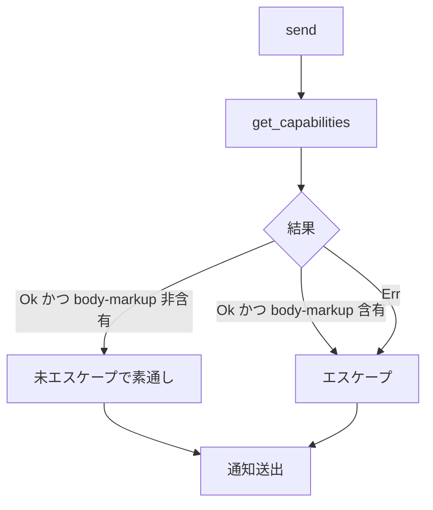

# notification-markup-fail-closed - 要件定義書

## 1. 概要

### 1.1 背景

現行の `NotifyRustSink::send`（`src-tauri/src/callbacks.rs`）は、通知サーバーの
capability 取得が失敗した場合（`get_capabilities()` が `Err(_)`）にエスケープを
スキップする fail-open 実装になっている。この結果、GetCapabilities のみ失敗し
直後の Notify が成功する窓では、body-markup 対応サーバ（GNOME Shell / dunst）へ
OSC 9 由来の `<a href>` / `` が素通りする。

本件は PR #35 レビュー round1 の finding `eade9e7f97a29a29`
（severity medium / category security / confidence 100、Claude と Codex の
クロスモデル合意）として指摘された。

### 1.2 目的

エスケープ判定の既定を安全側（fail-closed）に倒し、上記の通知内フィッシング経路を
塞ぐ。判定の失敗コストは非対称であり、過剰エスケープは `&lt;` のリテラル表示という
表示劣化にとどまる。

### 1.3 スコープ

**対象**

- `NotifyRustSink::send` の capability 判定分岐（`#[cfg(unix)]` 配下）の反転
- fail-open を前提としたコード内 doc コメントの更新
- 上記を固定する単体テスト
- 本 feature の SPEC における fail-closed の規範化

**対象外**

- `summary(title)` 専用のエスケープ施策（別タスク）
- 通知経路の非同期化

## 2. ビジネス要件

### 2.1 ビジネス目標

- GetCapabilities のみ失敗し直後の Notify が成功する窓で、body-markup 対応サーバ
  （GNOME Shell / dunst）へ OSC 9 由来の `<a href>` / `` が素通りする
  通知内フィッシング経路を塞ぐ
- PR #35 レビュー round1 の finding `eade9e7f97a29a29`
  （severity medium / category security / confidence 100、Claude と Codex の
  クロスモデル合意）をクローズする
- 失敗コストの非対称性（過剰エスケープは `&lt;` のリテラル表示という表示劣化に
  とどまる）に基づき、エスケープ判定の既定を安全側に倒す

### 2.2 対象ユーザー

| ユーザータイプ | 説明 |
|----------------|------|
| eMterm 利用者（Linux / body-markup 対応通知サーバ） | OSC 9 由来のデスクトップ通知を受け取る側。通知内フィッシングの被害対象 |
| eMterm 利用者（Linux / プレーンテキスト通知サーバ） | エスケープが不要なサーバー。過剰エスケープによる表示劣化の影響を受ける側 |

### 2.3 期待される効果

- capability 取得失敗時に通知本文のマークアップが素通りしなくなる
- finding `eade9e7f97a29a29` のクローズ根拠が仕様として残る

## 3. ユースケース

### 3.1 ユースケース一覧

| ID | ユースケース名 | アクター | 優先度 |
|----|----------------|----------|--------|
| UC01 | capability 取得失敗時の通知送出 | eMterm 通知経路 (Linux) | 高 |
| UC02 | body-markup 非対応サーバへの通知送出 | eMterm 通知経路 (Linux) | 高 |
| UC03 | body-markup 対応サーバへの通知送出 | eMterm 通知経路 (Linux) | 高 |

### 3.2 ユースケース詳細

#### UC01: capability 取得失敗時の通知送出

**アクター**: eMterm 通知経路 (Linux)

**事前条件**:
- OSC 9 由来の通知テキストが `NotifyRustSink::send` に渡っている
- `get_capabilities()` が `Err(_)` を返す

**基本フロー**:
1. `escape_for_send` が capability 判定を評価する
2. 判定が「未確認」となる
3. title(summary) と body の双方にエスケープを適用する
4. エスケープ済みの内容で通知を送出する

**事後条件**:
- 通知サーバーが body-markup 対応であっても `<a href>` / `` は
  マークアップとして解釈されない

#### UC02: body-markup 非対応サーバへの通知送出

**アクター**: eMterm 通知経路 (Linux)

**事前条件**:
- `get_capabilities()` が `Ok` を返し、返却リストが body-markup を含まない

**基本フロー**:
1. `escape_for_send` が capability 判定を評価する
2. 判定が「body-markup 非対応と明示された」となる
3. title と body を未エスケープで素通しする

**事後条件**:
- プレーンテキストサーバーで `&` が生表示されない（前タスク US2 の保証を維持）

#### UC03: body-markup 対応サーバへの通知送出

**アクター**: eMterm 通知経路 (Linux)

**事前条件**:
- `get_capabilities()` が `Ok` を返し、返却リストが body-markup を含む

**基本フロー**:
1. `escape_for_send` が capability 判定を評価する
2. 判定が「body-markup 対応」となる
3. title と body の双方にエスケープを適用する

**事後条件**:
- 従来どおりの挙動（回帰なし）

## 4. 機能要件

### 4.1 機能一覧

| ID | 機能名 | 説明 | 優先度 |
|----|--------|------|--------|
| FR1 | capability 判定を fail-closed に反転する | 明示的な非対応確認時のみ素通し、それ以外はエスケープ | 高 |
| FR2 | Ok 経路の既存挙動を保持する | `Ok` 時の 2 分岐は従来どおり | 高 |
| FR3 | fail-closed 判定は per-send 単一判定として title/body 双方に適用する | 1 send につき 1 回の判定 | 高 |
| FR4 | Windows 通知経路は変更しない | 判定は Linux 固有 | 高 |
| FR5 | 仕様記録を fail-closed に改める | 前タスク SPEC の FR3 を supersede | 高 |

### 4.2 機能詳細

#### FR1: capability 判定を fail-closed に反転する

**説明**: `NotifyRustSink::send` のエスケープ判定を「`get_capabilities()` が成功し、
かつ返却リストが body-markup を含まないと明示したときだけ未エスケープで素通しする。
それ以外（`Err(_)` = 取得失敗を含む）はエスケープする」に変更する。現行の
`body_markup_confirmed`（`src-tauri/src/callbacks.rs:220`、`Err` を未確認として
エスケープをスキップ）を置き換える。

**入力**:
- `get_capabilities()` の結果: `Result<Vec<String>, _>` - 通知サーバーの capability リスト

**出力**:
- エスケープ判定: `bool` - エスケープするか素通しするか

**処理フロー**:

**ビジネスルール**:
- 素通しは「非対応であると明示的に確認できた」ときに限る
- 取得失敗は素通しの根拠にならない

**エラーケース**:
| エラー | 条件 | 対応 |
|--------|------|------|
| capability 取得失敗 | `get_capabilities()` が `Err(_)` | エスケープしたうえで通知を送出する |

#### FR2: Ok 経路の既存挙動を保持する

**説明**: `get_capabilities()` が成功した場合の挙動は変えない。リストに body-markup を
含む → エスケープ（従来どおり）、含まない → 未エスケープで素通し（従来どおり。
プレーンテキストサーバーで `&` が生表示されない前タスク US2 の保証を維持する）。

**ビジネスルール**:
- `Ok` 経路の 2 分岐はいずれも回帰させない

#### FR3: fail-closed 判定は per-send 単一判定として title/body 双方に適用する

**説明**: エスケープ判定は現行の `escape_for_send`（`src-tauri/src/callbacks.rs:186`）の
単一評価構造（D2: 1 回の send につき 1 回の判定が title と body の双方を駆動する）を
維持し、`Err(_)` 時は title(summary) と body の両方がエスケープされる。

**ビジネスルール**:
- 判定を title 用 / body 用に分岐させない

#### FR4: Windows 通知経路は変更しない

**説明**: capability 判定は Linux 固有（D-Bus 上の `org.freedesktop.Notifications`）で
あり、エスケープゲート全体は現行どおり `#[cfg(unix)]` 配下に置く。Windows 側の通知経路
（`.show()` 呼び出し）には capability 判定もエスケープ処理も追加しない。

#### FR5: 仕様記録を fail-closed に改める

**説明**: 本 feature の SPEC は fail-closed を規範として明記し、前タスク SPEC
（`feature-docs/notification-body-markup-escape/SPEC.md`）の FR3「確認できない場合は
未エスケープで渡す」を仕様上 supersede する（リスク受容ではなく仕様変更の側を採る）。

## 5. 非機能要件

### 5.1 パフォーマンス要件

該当なし。

### 5.2 セキュリティ要件

- 入力検証: capability 未確認時は body-markup とみなしてエスケープする（FR1）

### 5.3 可用性要件

該当なし。

### 5.4 保守性要件

- ドキュメント（NFR2）: 現行コードの fail-open を前提とした doc コメント
  （`escape_for_send` の「fail-open parity, FR1/FR3」、`body_markup_confirmed` の
  「fail-safe side (FR3): callers must not escape on unconfirmed」等）を fail-closed の
  新仕様と整合するよう更新し、必要なら関数名も新しい意味論に合わせる。

### 5.5 互換性要件

- NFR1（フィーチャーゲート / プラットフォームゲート衛生の維持）: notify-rust は gui
  フィーチャーのオプショナル依存であるため、変更後も既存の `#[cfg(feature = "gui")]` /
  `#[cfg(unix)]` / `#[cfg(windows)]` ゲート規約に従い、`--no-default-features`
  （CLI のみ）ビルドと Windows ビルドがコンパイル可能な状態を維持する。
- NFR3（既存サニタイズパイプラインの無変更）: `sanitize_title` の既存挙動
  （CSI 除去、制御文字除去、入力上限、100 文字トランケート）とエスケープ実行順序
  （トランケート後にエスケープ）、および通知レートリミッタは変更しない。変更は
  capability 判定の分岐のみ。

## 6. UI/UX要件

該当なし（バックエンドのみの変更）。

## 7. データ要件

該当なし。

## 8. 外部連携

### 8.1 連携システム

| システム名 | 連携方法 | データ |
|------------|----------|--------|
| `org.freedesktop.Notifications`（GNOME Shell / dunst 等） | D-Bus（notify-rust 経由） | capability リスト、通知の summary / body |

### 8.2 API仕様要件

- `get_capabilities()` の返却リストに body-markup が含まれるかどうかのみを判定に用いる
- 判定に失敗した場合（`Err(_)`）はエスケープ側に倒す

## 9. 制約条件

### 9.1 技術的制約

- capability 判定は Linux 固有であり `#[cfg(unix)]` 配下に置く（FR4）
- notify-rust は gui フィーチャーのオプショナル依存（NFR1）
- 変更対象は `src-tauri/src/callbacks.rs` の capability 判定分岐のみ（NFR3）

### 9.2 ビジネス上の制約

- 過剰エスケープは `&lt;` のリテラル表示という表示劣化にとどまる（判定を安全側に
  倒す根拠）

### 9.3 スケジュール制約

該当なし。

## 10. 想定される課題とリスク

### 10.1 技術的課題

| 課題 | 影響度 | 対応策 |
|------|--------|--------|
| capability 取得失敗時の過剰エスケープによる表示劣化 | 低 | 失敗コストの非対称性に基づき受容する（`&lt;` のリテラル表示にとどまる） |

### 10.2 ビジネスリスク

| リスク | 発生確率 | 影響度 | 対応策 |
|--------|----------|--------|--------|
| GetCapabilities 失敗直後に Notify が成功する窓で `<a href>` / `` が素通りする | 中 | 中 | fail-closed への反転（FR1） |

## 11. 成功基準

### 11.1 受け入れ基準

- [ ] `get_capabilities()` が `Err(_)` のとき `escape_for_send` が title と body の双方に
      エスケープを適用することを固定する単体テストが存在する
- [ ] `get_capabilities()` が `Ok` で body-markup を含まないリストを返したときは
      未エスケープで素通しされる（既存テスト期待値を新仕様に沿って維持・更新）
- [ ] `get_capabilities()` が `Ok` で body-markup を含むときはエスケープされる
      （既存挙動の回帰なし）
- [ ] `CARGO_TARGET_DIR=src-tauri/target cargo test --manifest-path src-tauri/Cargo.toml --lib` が通る
- [ ] SPEC が fail-closed を規範として明記し、finding `eade9e7f97a29a29` のクローズ根拠になる

### 11.2 KPI

該当なし。

## 12. テストシナリオ

### 12.1 テスト観点

- [ ] セキュリティ (TS1 / FR1・FR3): capabilities = `Err` のとき `escape_for_send` が
      (エスケープ済み title, エスケープ済み body) を返すことを固定する単体テストを追加する
- [ ] 正常系 (TS2 / FR2): capabilities = `Ok(空リスト or body-markup 非含有)` のとき
      両フィールドがバイト同一で素通しされることを確認する
- [ ] 正常系 (TS3 / FR2 回帰): capabilities = `Ok(["body-markup", ...])` のとき
      `&` → `&amp;` 先行の 3 文字エスケープが両フィールドに適用される既存挙動が保たれる
- [ ] 回帰 (TS4 / NFR3): `--lib` スイート全体が通る（`tabs.rs` replay テストが不安定な
      場合は `-- --test-threads=1` で再実行）
- [ ] 互換性 (TS5 / NFR1): `CARGO_TARGET_DIR=src-tauri/target cargo check --manifest-path src-tauri/Cargo.toml --no-default-features` が通る
      （CLI ビルドのゲート衛生確認）

## 13. 用語定義

| 用語 | 定義 |
|------|------|
| fail-closed | 判定が確定しない場合に安全側（エスケープする側）へ倒す既定 |
| fail-open | 判定が確定しない場合に素通し側へ倒す既定。現行実装の挙動 |
| body-markup | `org.freedesktop.Notifications` の capability。通知 body 内のマークアップ解釈を示す |
| OSC 9 | デスクトップ通知を要求する制御シーケンス。本件のテキスト供給元 |

## 14. 確認事項

### 14.1 確認済み事項

- [x] FR3 を fail-closed に改めるか、リスク受容として明記するかの二択 (A1): タスク本文の
      「やりたいこと」（fail-closed に倒す、エスケープする側の既定に変える）により
      fail-closed 側で解決済みとして扱う。受け入れ条件 1 項目目は決定要求だが、同じ
      タスク記述の必須セクションが選択肢を明示指定している。影響度 low / 可逆
- [x] fail-closed の仕様記録先 (A2): 本 feature 自身の SPEC とし、前タスクの
      `feature-docs/notification-body-markup-escape/SPEC.md` は履歴として残す
      （本 feature の SPEC が FR3 を supersede する旨を参照で明示する）。前タスク SPEC
      ファイル本体の遡及編集は受け入れ条件に含めない。feature-docs は feature ごとの
      スナップショットであり、round1.yaml の resolution_reason も「別タスクへ繰り越し」
      = 本タスクでの新規仕様化を指す。影響度 low / 可逆
- [x] `Err(_)` 時のエスケープ対象範囲 (A3): title(summary) にも及ぶ（`escape_for_send` の
      単一判定構造の帰結）。タスクのスコープ外記載「summary(title) のエスケープ（別タスク）」は
      独立した title 専用施策を指し、この共有判定の帰結を除外するものではない。現行コード
      （PR #35 反映後）は確認時に title と body の双方をエスケープしており、判定を分岐ごとに
      分ける方がかえって仕様を複雑化する。影響度 low / 可逆

### 14.2 未確認・保留事項

なし。

## 15. 参考資料

- 前タスク SPEC: `feature-docs/notification-body-markup-escape/SPEC.md`（FR3 を本 feature が supersede）
- PR #35 レビュー round1 finding: `eade9e7f97a29a29`（severity medium / category security / confidence 100）
- 実装対象: `src-tauri/src/callbacks.rs`（`escape_for_send`:186、`body_markup_confirmed`:220）
