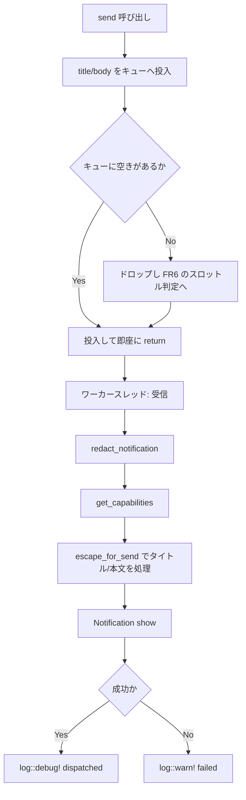

# notification-worker-thread - 要件定義書

## 1. 概要

### 1.1 背景

デスクトップ通知の送出が winit/egui のイベントループスレッド上で同期的に行われている。
`NotifyRustSink::send` は、同期的な Unix ラウンドトリップを 2 回インラインで実行する。

- `notify_rust::get_capabilities()` (src-tauri/src/callbacks.rs:231)
- `Notification::new()....show()` (src-tauri/src/callbacks.rs:237-241)

D-Bus の通知デーモンが遅い・ハングしている・存在しない場合、この 2 回のラウンドトリップが
イベントループを塞ぐ。

### 1.2 目的

デスクトップ通知の送出がイベントループを一切ブロックしないようにする。
`NotificationSink` トレイト境界と、既存の全プロデューサ呼び出し箇所（OSC 9、タブ活動、
エージェント状態、リンク処理）は変更しない。

### 1.3 スコープ

**対象**:

- 本番実装である `NotifyRustSink` の内部構造（ワーカースレッド化、境界付きキュー、
  ドロップ観測、シャットダウン）
- `NotifyRustSink` の唯一の本番構築箇所 `Arc::new(NotifyRustSink)` (src-tauri/src/app/mod.rs:574)
- キュー挙動のヘッドレスなユニットテスト追加

**対象外（スコープ除外）**:

- 通知本文のサニタイズ（別タスクで扱う）
- 通知の発火条件の変更
- レートリミットの変更

## 2. ビジネス要件

### 2.1 ビジネス目標

- D-Bus 通知デーモンが遅い・ハングしている・存在しない場合でも、デスクトップ通知の送出が
  winit/egui のイベントループを塞がず、タイプ入力のレイテンシとフレームペーシングに影響を
  与えないこと。
- 既存の `NotificationSink` トレイト境界と、全プロデューサ呼び出し箇所（OSC 9、タブ活動、
  エージェント状態、リンク処理）が変更されないこと。修正は本番シンクの内部に閉じる。

### 2.2 対象ユーザー

| ユーザータイプ | 説明 |
|----------------|------|
| eMterm 利用者（Linux / Windows の開発者） | 通知デーモンの状態にかかわらず、ターミナルの入力応答性が保たれる |
| eMterm 開発者 | トレイト境界とテストダブルが不変のため、既存テストを書き換えずに変更を取り込める |

### 2.3 期待される効果

- 外部デーモンでブロックしうるシステムコールがイベントループスレッド上から無くなる。
- 通知デーモンの不在・ハングが、通知のドロップとログ記録への劣化に封じ込められる。
- 保留中の通知が占めるメモリが、プロデューサの発行レートによらず容量 8 のキューに収まる。

## 3. ユースケース

### 3.1 ユースケース一覧

| ID | ユースケース名 | アクター | 優先度 |
|----|----------------|----------|--------|
| UC01 | 通知を送出する | 通知プロデューサ（OSC 9 / タブ活動 / エージェント状態 / リンク処理） | 高 |
| UC02 | 通知デーモンが応答しない状態で通知が発生する | 通知プロデューサ | 高 |
| UC03 | プロセスを終了する | `App` のティアダウン | 高 |

### 3.2 ユースケース詳細

#### UC01: 通知を送出する

**アクター**: 通知プロデューサ（`App::notify` (src-tauri/src/app/mod.rs:836)、`NativeCallbacks` の
OSC 9、タブ活動、`maybe_notify_agent_transition` (src-tauri/src/app/agent_status.rs:187)、リンク処理）

**事前条件**:

- シンク構築時にワーカースレッドが起動済みである。

**基本フロー**:

1. プロデューサが `send(title, body)` を呼ぶ。
2. `send` は `(title, body)` を境界付きチャネルへノンブロッキングで投入し、呼び出し元に戻る。
3. ワーカースレッドが `redact_notification(title, body)` を受領値に対して実行する。
4. ワーカースレッドが `notify_rust::get_capabilities()` を 1 通知につき 1 回照会する。
5. その単一の結果が `escape_for_send` (src-tauri/src/callbacks.rs:267-277) を通じてタイトルと
   本文双方のエスケープ判断を駆動する。
6. ワーカースレッドが `Notification::new()....show()` を実行する。
7. 成功時、ワーカースレッドが `log::debug!("notify-rust dispatched: {redacted}")` (:246) を出す。

**代替フロー**:

- `show()` が失敗した場合、ワーカースレッドが `log::warn!("notify-rust failed: {e}")` (:249) を出す。

**事後条件**:

- 呼び出しスレッド上では D-Bus I/O が一切行われていない。

#### UC02: 通知デーモンが応答しない状態で通知が発生する

**アクター**: 通知プロデューサ

**事前条件**:

- ワーカースレッドが D-Bus 呼び出しでブロックしている。

**基本フロー**:

1. プロデューサが `send` を呼ぶ。
2. キューに空きがあれば投入され、`send` は直ちに戻る。
3. キューが満杯（容量 8）の場合、その通知はドロップされる。
4. 飽和エピソードの最初のドロップで `log::warn!` を 1 件出す。

**代替フロー**:

- 同一エピソード内の以降のドロップは記録しない。
- キューが捌けた時点で警告が再武装され、次のドロップで再び記録される。

**事後条件**:

- どのプロデューサもブロックしていない。キューは無制限に伸びていない。

#### UC03: プロセスを終了する

**アクター**: `App` のティアダウン

**事前条件**:

- 最後の `Arc<NotifyRustSink>` クローンが解放される。

**基本フロー**:

1. `Drop for NotifyRustSink` が送信側をドロップする。
2. ワーカーの受信ループが終了する。
3. 短い境界付き待機でワーカーを join する。

**代替フロー**:

- 期限を過ぎた場合、join を諦めてスレッドをデタッチする。

**事後条件**:

- D-Bus 呼び出しで固まっていても、プロセス終了がハングしない。

## 4. 機能要件

### 4.1 機能一覧

| ID | 機能名 | 説明 | 優先度 |
|----|--------|------|--------|
| FR1 | ノンブロッキングな `send` | `send` は D-Bus I/O を行わずワーカースレッドへ受け渡すのみ | 高 |
| FR2 | トレイト境界の不変性 | `NotificationSink` の宣言をバイト単位で不変に保つ | 高 |
| FR3 | 送出ごとの capability 意味論の維持 | `get_capabilities()` は通知ごとに 1 回照会、キャッシュしない | 高 |
| FR4 | ログ記録の維持 | redaction と 2 種のログ記録を文言ごと維持する | 高 |
| FR5 | 境界付きキューと満杯時ドロップ | 容量 8 の境界付きチャネル。満杯時はドロップ | 高 |
| FR6 | スロットル付きドロップ観測 | 飽和エピソードごとに 1 件の `log::warn!` | 高 |
| FR7 | 即時起動・プロセス寿命のワーカー | 構築時に起動しプロセス寿命まで生存 | 高 |
| FR8 | 境界付き join によるシャットダウン | 送信側ドロップ＋短い境界付き join、期限超過でデタッチ | 高 |
| FR9 | プラットフォーム挙動の統一 | Linux / Windows 双方に適用、ディスパッチ経路に cfg 分岐なし | 高 |
| FR10 | シンクがワーカー状態を所有する | `NotifyRustSink` が送信側と `JoinHandle` を所有する | 高 |

### 4.2 機能詳細

#### FR1: ノンブロッキングな `send`

**説明**: `NotifyRustSink::send` は D-Bus I/O を一切行わずに呼び出し元へ戻る。
`(title, body)` をワーカースレッドへ受け渡すのみを行う。現在インラインで実行されている
同期的な Unix ラウンドトリップ 2 件 — `notify_rust::get_capabilities()`
(src-tauri/src/callbacks.rs:231) と `Notification::new()....show()` (:237-241) — は
ワーカースレッド上で実行される。

**入力**:

- `title`: `&str` - 通知タイトル
- `body`: `&str` - 通知本文

**出力**:

- なし（`()`）

**処理フロー**:

**ビジネスルール**:

- 呼び出しスレッド上に、外部デーモンでブロックしうるシステムコールを残さない。

#### FR2: トレイト境界の不変性

**説明**: `pub trait NotificationSink: Send + Sync { fn send(&self, title: &str, body: &str); }`
(src-tauri/src/callbacks.rs:191-193) はバイト単位で不変に保つ。`send` は引き続き `&self` と
`&str` 引数を取り `()` を返す。

**ビジネスルール**:

- 既存のテストダブルが無変更でコンパイルできること。
  - `TestSink` (src-tauri/src/callbacks/tests.rs:22)
  - `TestNotifySink` (src-tauri/src/app/tests/agent_status.rs:22)
  - `NoopSink` (src-tauri/src/tabs/tests.rs:12)

#### FR3: 送出ごとの capability 意味論の維持

**説明**: fail-closed な body-markup エスケープゲートは現在の意味論を維持する。
`get_capabilities()` は通知ごとに 1 回だけ再照会され（キャッシュしない）、その単一の結果が
`escape_for_send` (src-tauri/src/callbacks.rs:267-277) を通じてタイトルと本文双方のエスケープ
判断を駆動する。照会をワーカースレッドへ移しても送出ごとの鮮度は保たれる。

**ビジネスルール**:

- capability の照会結果をプロセス全体・複数通知間でキャッシュしない。

#### FR4: ログ記録の維持

**説明**: `redact_notification(title, body)` (src-tauri/src/callbacks.rs:214) は、エスケープ
ゲートが値をシャドウする前の「受領したままの値」に対して実行され続ける。その結果は
`log::debug!("notify-rust dispatched: {redacted}")` (:246) の成功記録と
`log::warn!("notify-rust failed: {e}")` (:249) のエラー記録に供給され続ける。両記録は
ワーカースレッドから、リテラル接頭辞を変えずに出力される。

**エラーケース**:

| エラー | 条件 | 対応 |
|--------|------|------|
| 通知の表示失敗 | `Notification::show()` がエラーを返す | `log::warn!("notify-rust failed: {e}")` を出力する |

#### FR5: 境界付きキューと満杯時ドロップ

**説明**: シンクは容量 8 の境界付きチャネルを所有する。投入はノンブロッキングであり、
キューが満杯のときはブロックもキューの無制限成長もせず、その通知をドロップする。

**ビジネスルール**:

- キューの容量は 8。
- 満杯時の投入はブロックしない。

#### FR6: スロットル付きドロップ観測

**説明**: 飽和エピソードの最初のドロップで `log::warn!` 記録を 1 件出す。同一エピソード内の
以降のドロップは記録しない。キューが捌けた時点で警告が再武装されるため、持続的な停滞では
ドロップごとではなくエピソードごとに 1 件の記録となる。

#### FR7: 即時起動・プロセス寿命のワーカー

**説明**: ワーカースレッドはシンク構築時に起動され、プロセスの寿命まで生存する。
初回送出時の遅延起動も、通知ごとのスレッド生成も行わない。

#### FR8: 境界付き join によるシャットダウン

**説明**: シンクのドロップ時に送信側をドロップしてワーカーの受信ループを終了させ、短い
境界付き待機でワーカーを join する。その期限を過ぎたら join を諦めてスレッドをデタッチし、
固まった D-Bus 呼び出しでプロセス終了がハングしないようにする。シャットダウンは
`Drop for NotifyRustSink` に置かれ、`App` のティアダウンで最後の `Arc` クローンが解放された
時点で発火する。

#### FR9: プラットフォーム挙動の統一

**説明**: ワーカースレッド経由のディスパッチ経路は、サポート対象の全プラットフォーム
（Linux および Windows）に適用され、ディスパッチ経路上に `cfg` 分岐を持たない。既存の
`#[cfg(unix)]` ゲートは、現在と同様に capability 照会とエスケープゲートに限定される。

#### FR10: シンクがワーカー状態を所有する

**説明**: `NotifyRustSink` はユニット構造体 (src-tauri/src/callbacks.rs:199) から、
境界付きチャネルの送信側とワーカーの `JoinHandle` を所有する構造体に変わる。プロセス
グローバルな `OnceLock` / `static` は導入しない。唯一の本番構築箇所
`Arc::new(NotifyRustSink)` (src-tauri/src/app/mod.rs:574) はコンストラクタ呼び出しになる。

## 5. 非機能要件

### 5.1 パフォーマンス要件

- **NFR1 - イベントループのレイテンシ**: `send` は呼び出しスレッド上で、境界の定まった
  アロケーションの軽い時間で完了する。外部デーモンでブロックしうるシステムコールは
  winit/egui スレッド上に残さない。
- **NFR3 - メモリ境界**: 保留中の通知が占めるメモリは、プロデューサの発行レートによらず
  容量 8 のキューに収まる。

### 5.2 セキュリティ要件

- 入力検証: FR3 の fail-closed な body-markup エスケープゲートを現在の意味論のまま維持する
  （capability 照会の結果が、タイトルと本文双方のエスケープ判断を駆動する）。
- 通知本文のサニタイズ自体は本タスクのスコープ外（別タスクで扱う）。

### 5.3 可用性要件

- **NFR2 - 障害の封じ込め**: 通知デーモンの不在やハングは、通知のドロップとログ記録への
  劣化に留まる。パニックせず、デッドロックせず、境界付き join の期限を超えてプロセス終了を
  遅延させない。

### 5.4 保守性要件

- ログ出力: FR4 の 2 記録（`notify-rust dispatched:` / `notify-rust failed:`）を文言ごと維持し、
  FR6 のドロップ警告を追加する。
- **NFR4 - ヘッドレスなテスト容易性**: キュー挙動（ノンブロッキング投入、満杯時ドロップ、
  警告の再武装）は D-Bus 接続なしでユニットテスト可能であること。これは、実 D-Bus 接続
  なしでテストできるよう `escape_for_send` を切り出した既存の方針
  (src-tauri/src/callbacks.rs:263-265) に合わせる。

### 5.5 互換性要件

- **NFR5 - フィーチャーゲート互換性**: 変更は既存のモジュール構成の内側に留め、
  `--no-default-features`（CLI 専用）ビルドを壊さないこと。
- プラットフォーム: Linux / Windows の双方で同一のディスパッチ経路（FR9）。

## 6. UI/UX要件

該当なし。本タスクはユーザーに見える面を持たない。UI・レイアウト・デザイントークン・
新規のユーザー向け文字列のいずれも関与しない（デザインステップはスキップ）。

## 7. データ要件

該当なし。永続データモデルの変更はない。プロセス内の保留データは、容量 8 の境界付き
キューが保持する `(title, body)` のみで、その寿命はワーカーが取り出すまでである。

## 8. 外部連携

### 8.1 連携システム

| システム名 | 連携方法 | データ |
|------------|----------|--------|
| デスクトップ通知デーモン | `notify_rust`（Linux は D-Bus、Windows はトースト） | 通知タイトル / 本文 |

### 8.2 API仕様要件

`notify_rust::get_capabilities()` と `Notification::new()....show()` の呼び出し自体は現行の
ままで、実行スレッドのみがワーカースレッドへ移る。

## 9. 制約条件

### 9.1 技術的制約

- `NotificationSink` トレイト宣言 (src-tauri/src/callbacks.rs:191-193) をバイト単位で不変に保つ
  こと（FR2）。
- 既存のプロデューサ呼び出し箇所を一切変更しないこと。本番側の変更は
  `Arc::new(NotifyRustSink)` (src-tauri/src/app/mod.rs:574) の構築箇所のみ。
- プロセスグローバルな `OnceLock` / `static` を導入しないこと（FR10）。
- `--no-default-features` ビルドを壊さないこと（NFR5）。
- `log::warn!` 以上のみがリリースビルドのログに残る（.claude/rules/debugging-constraints.md）。

### 9.2 ビジネス上の制約

- 通知の発火条件とレートリミットは変更しない（スコープ外）。
- 通知本文のサニタイズは別タスクが扱う（スコープ外）。

### 9.3 スケジュール制約

特になし。

### 9.4 宣言された変更集合

このフィーチャー固有のパスは手動で列挙せず、create-plan で `workflow.yaml` の各タスクの
`files` から導出する（`references/phases/create-plan-phase.md`）。

**デフォルトメンバー**（明示的に除外しない限り、常に宣言に含まれる）:

- `feature-docs/notification-worker-thread/**`
- `test-docs/notification-worker-thread/**`

`feature-docs/{feature}/**` に含まれるもの: `REQUIREMENTS.md`、`SPEC.md`、`IMPLEMENTATION.md`、
`workflow.yaml`、`phase-state/`、`tasks/`、`reviews/roundN.yaml`、`VERIFICATION.md`、
`retrospect.yaml`、およびデザインステップが生成するデザイン成果物。

`test-docs/{feature}/**` に含まれるもの: `{T}.tests.yaml`。

**意味論**:

- デフォルトのメンバーは、明示的に除外しない限り宣言に含まれる。
- この宣言はスーパーセットの主張であり、実際の変更集合は宣言に含まれる必要がある。

## 10. 想定される課題とリスク

### 10.1 技術的課題

| 課題 | 影響度 | 対応策 |
|------|--------|--------|
| 固まった D-Bus 呼び出しでプロセス終了がハングする | 高 | 短い境界付き join、期限超過でデタッチ（FR8） |
| 持続的な停滞でドロップ警告がログを埋める | 中 | エピソード単位のスロットルと再武装（FR6） |
| 実 `App` を構築するテストが本番ワーカースレッドを起動し即座にドロップする | 低 | 境界付き join によるドロップ経路が `cargo test` 下で健全であることを保つ（A9） |

### 10.2 ビジネスリスク

| リスク | 発生確率 | 影響度 | 対応策 |
|--------|----------|--------|--------|
| 通知デーモンの停滞中に通知が失われる | 中 | 低 | ドロップを許容し、エピソードごとに `log::warn!` で可観測にする（FR5 / FR6） |

## 11. 成功基準

### 11.1 受け入れ基準

- [ ] AC1: `NotifyRustSink::send` は、呼び出しスレッド上で `notify_rust::get_capabilities()` も
      `Notification::show()` も呼ばない。両者はワーカースレッドの本体にのみ現れる。
- [ ] AC2: src-tauri/src/callbacks.rs:191-193 の `NotificationSink` トレイト宣言が変更前と
      バイト単位で同一であり、既存の 3 つのテストシンクが無変更でコンパイルできる。
- [ ] AC3: 既存の通知プロデューサ呼び出し箇所（`App::notify` at src-tauri/src/app/mod.rs:836、
      `NativeCallbacks` の OSC 9、タブ活動、`maybe_notify_agent_transition` at
      src-tauri/src/app/agent_status.rs:187、リンク処理）がすべて無変更であり、本番側の
      唯一の構築箇所の変更は src-tauri/src/app/mod.rs:574 の `Arc::new(NotifyRustSink)` が
      コンストラクタ呼び出しになる点のみである。
- [ ] AC4: ワーカーがブロックしている間に投入された通知について `send` が速やかに戻る。
      ブロック中のワーカーに対して 9 件以上が保留になると超過分はドロップされ、どの
      プロデューサもブロックしない。
- [ ] AC5: 飽和エピソードの最初のドロップがちょうど 1 件の `log::warn!` 記録を生み、同一
      エピソード内の以降のドロップは記録を生まない。キューが捌けた後、新たなドロップは
      再び警告記録を生む。
- [ ] AC6: FR4 の redaction 記録の意味論が保たれる。`log::debug!("notify-rust dispatched: {redacted}")`
      と `log::warn!("notify-rust failed: {e}")` はリテラル接頭辞を維持し、redact 後の表現は
      エスケープ後の値ではなく受領したままの値から導出される。
- [ ] AC7: 送出ごとの capability 照会が引き続き通知ごとに 1 回行われ、その単一の
      `escape_for_send` 評価がタイトルと本文の双方を駆動する。
- [ ] AC8: ワーカーが D-Bus 呼び出しでブロックしていても、最後の `Arc<NotifyRustSink>` の
      ドロップが境界付き join の期限内に戻る。
- [ ] AC9: `cargo test --manifest-path src-tauri/Cargo.toml` が通り、
      `cargo check --manifest-path src-tauri/Cargo.toml --no-default-features` が引き続き
      コンパイルできる。

### 11.2 KPI

| 指標 | 目標値 | 測定方法 |
|------|--------|----------|
| イベントループスレッド上の D-Bus 同期呼び出し数 | 0 | `send` 本体のコード検査（AC1） |
| 保留通知の上限 | 8 | キュー容量（FR5 / NFR3） |

## 12. テストシナリオ

### 12.1 テスト観点

- [ ] TS1 正常系（ユニット / ヘッドレス）: ワーカーが占有されている状態でも投入がブロック
      せずに戻る。キュー側の抽象を、notify-rust トランスポートから切り離して直接検証する。
- [ ] TS2 境界値（ユニット / ヘッドレス）: 容量 8 のキューを満たしてもう 1 件投入すると、
      その超過分がドロップされ、ドロップが報告され、プロデューサはブロックしない。
- [ ] TS3 異常系（ユニット / ヘッドレス）: ドロップ警告の武装 — エピソード最初のドロップは
      報告し、同一エピソード内の以降のドロップは報告しない。キューが捌けると再武装され、
      次のドロップは再び報告される。
- [ ] TS4 異常系（ユニット / ヘッドレス）: シャットダウンで送信側がドロップされ、ワーカー
      ループが終了し、境界付き join が期限内に戻る。
- [ ] TS5 回帰: 既存の `escape_for_send` / fail-closed capability テスト
      (src-tauri/src/callbacks/tests.rs:691-860) と、既存のレートリミット / redaction テストが
      無変更で通り続ける。
- [ ] TS6 回帰: 既存のエージェント状態通知テスト (src-tauri/src/app/tests/agent_status.rs) が、
      キャプチャ用シンクを変更しないまま通り続ける。
- [ ] TS7 ビルド: `cargo check --no-default-features` により CLI 専用のフィーチャーゲートが
      影響を受けていないことを確認する。

## 13. 用語定義

| 用語 | 定義 |
|------|------|
| シンク | `NotificationSink` トレイトの実装。本番実装は `NotifyRustSink` |
| ワーカースレッド | 通知の D-Bus / トースト送出を実行する、シンクが所有するスレッド |
| 飽和エピソード | キューが満杯になってからキューが捌けるまでの一区間 |
| 再武装 | キューが捌いた時点でドロップ警告の出力可否を再び有効にすること |
| fail-closed エスケープゲート | capability 照会に基づき、安全側に倒してマークアップをエスケープする判定 |

## 14. 確認事項

### 14.1 確認済み事項

- [x] A2 ワーカーのライフサイクル: シャットダウンは送信側をドロップし、短い境界付き待機で
      ワーカーを join する。期限を過ぎたらデタッチする。（`requirement.worker-lifecycle` /
      `join_bounded`。バッチ協議で決定。バッチ方針
      `create-spec.requirement-clarification` の `record_as_assumption: true` により想定として
      記録。固まった D-Bus 呼び出しで終了がハングしないことを保証しつつ、通常時は
      フラッシュできる。）（可逆）
- [x] A3 チャネル容量: 境界付きチャネルの容量は 8。（`requirement.channel-capacity` / `cap_8`。
      同ゲートの `record_as_assumption: true` により記録。タブ活動 / エージェント状態通知の
      バーストを吸収でき、かつメモリを抑え、ハングしたデーモンの背後に古い通知が積み上がる
      のを防ぐ大きさ。この数値は調整可能な定数であり、構造上の確定事項ではない。）（可逆）
- [x] A4 ドロップの可観測性: ドロップした通知は、飽和エピソードの最初のドロップで
      `log::warn` を出し、キューが捌いた時点で再武装される。（`requirement.drop-observability` /
      `log_warn_throttled`。同ゲートの方針により記録。`warn` は
      .claude/rules/debugging-constraints.md の通りリリースビルドで残る最下位レベルであり、
      再武装により持続的な停滞が emterm.log を埋めるのを防ぐ。）（可逆）
- [x] A5 プラットフォーム範囲: ワーカースレッド経路は Linux と Windows の双方に同様に適用し、
      ディスパッチ経路に cfg 分岐を持たない。（`requirement.platform-scope` / `all_platforms`。
      同ゲートの方針により記録。Windows の `notify_rust` トースト送出もブロックしうるうえ、
      単一経路であれば CI が通らない Windows 専用経路を増やさずに済む。既存の
      `#[cfg(unix)]` ゲートは影響を受けない。）（可逆）
- [x] A6 起動タイミング: ワーカースレッドはシンク構築時に即時起動し、プロセスの寿命まで
      生存する。（`requirement.spawn-timing` / `eager_on_construction`。同ゲートの方針により
      記録。本番シンクはちょうど 1 回だけ構築される (src-tauri/src/app/mod.rs:574) ため、
      即時起動のコストはプロセスあたり 1 スレッドで済み、送出経路での遅延初期化同期を
      避けられる。）（可逆）
- [x] A7 ドロップのテストカバレッジ: ノンブロッキング投入と満杯時ドロップを覆うユニット
      テストを追加し、ヘッドレスに走るよう notify-rust トランスポートから切り離す。
      （`requirement.drop-test-coverage` / `add_queue_tests`。同ゲートの方針により記録。実
      D-Bus 接続なしでテストできるよう `escape_for_send` を切り出した既存の前例
      (src-tauri/src/callbacks.rs:263-265) に沿い、CI を通知デーモン依存から切り離す。）（可逆）
- [x] A8 ワーカー状態の所有: `NotifyRustSink` はプロセスグローバルな `OnceLock` ではなく、
      所有フィールド（境界付きチャネルの送信側とワーカーの `JoinHandle`）を持ち、
      シャットダウンは `Drop for NotifyRustSink` に置く。（A2-A7 と同じバッチ協議から採用し、
      同じ `record_as_assumption: true` 方針で記録。所有状態はワーカーの寿命をシンクの寿命に
      結びつけ、それが `Drop` ベースの境界付き join（A2）を定義可能にする。グローバルには
      決定的なティアダウン点が無い。トレイト宣言は不変のままなので、変更は
      src-tauri/src/app/mod.rs:574 の構築箇所のみ — トレイト境界の変更ではなく構築箇所の
      変更であり、AC2 / AC3 と両立する。）（可逆）
- [x] A9 テストにおける本番ワーカーの起動: 実 `App` を構築するテストは本番ワーカースレッドを
      起動して即座にドロップする。src-tauri/src/app/tests/agent_status.rs:49 が
      `app.notification_sink` をテストシンクで上書きするのは `App` 構築の後だからである。
      （即時起動の決定（A6）の直接の帰結として requirements-analyst がラウンド 2 で観測。
      境界付き join によるシャットダウン（A2）があるため挙動上は無害だが、そうしたテストの
      たびにドロップ経路が実行されるため、`cargo test` 下で健全であり続ける必要がある。）（可逆）
- [x] デザインステップ: スキップ。（`design-step.decision` / `decide_autonomously`。ユーザーに
      見える面を持たず、変更されない `NotificationSink` トレイト境界の背後で同期 D-Bus
      ラウンドトリップ 2 件をイベントループスレッドから移すだけであるため。本プロジェクトで
      検出されたデザインシステム候補 2 件（doc/UI-DESIGN-GUIDELINES.yaml、
      src-tauri/web-shared/styles.css）はいずれも影響を受けない。）

### 14.2 未確認・保留事項

なし。全要件が `status: resolved`。

## 15. 参考資料

- SPEC.md: feature-docs/notification-worker-thread/SPEC.md
- ログの制約: .claude/rules/debugging-constraints.md
- ビルド・テストコマンド: .claude/rules/core-commands.md
