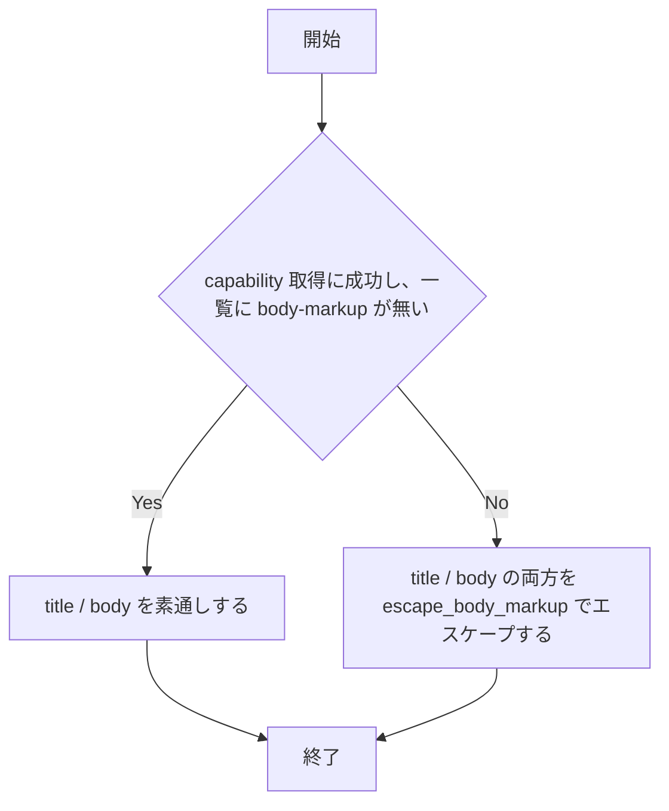
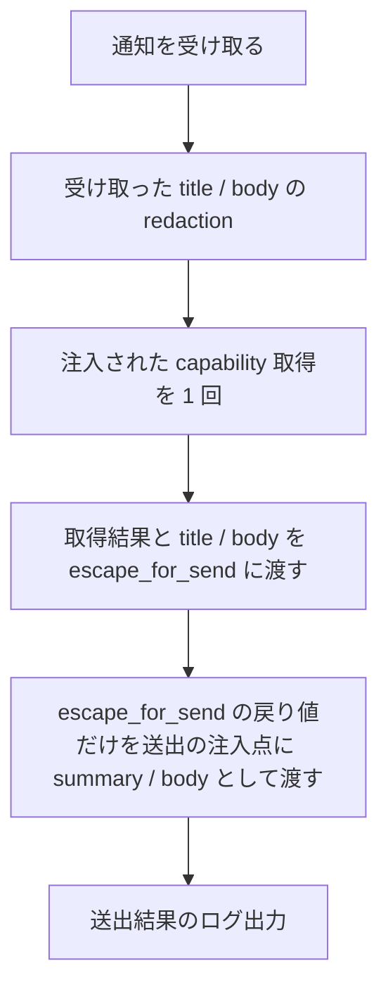

# notify-escape-test-production-path - 要件定義書

## 1. 概要

### 1.1 背景
`src-tauri/src/callbacks/tests.rs` の `mod body_markup_escape` は、送出側と同じ分岐（`body_markup_absence_confirmed` の結果で `escape_body_markup` を呼ぶかどうか）を 3 箇所でテスト内に自前で書いている。このため、これらのテストが検証しているのは本番の判断ではなくテスト内のコピーになっている。また、ワーカー本体 `notify_worker` は `notify_rust::get_capabilities()`（実 D-Bus 接続が必要）を直接呼んでいるため、`notify_worker` がエスケープ済みの値を送出に渡していることを検証するテストが無い。

### 1.2 目的
- 通知のエスケープ判断（capability 結果から summary / body の送出値を決める処理）と、その結果を送出に渡す処理を、テストが本番と同じコードを通って検証する状態にする。
- `callbacks/tests.rs` に残っている、本番の分岐を複製した inline な if/else を無くす。本番側の判断や、`notify_worker` でのエスケープ呼び出しを変えたときにテストが赤になるようにする。

### 1.3 スコープ
- 対象: `src-tauri/src/callbacks.rs`（`escape_for_send`、`notify_worker`、`NotifyRustSink::new` のワーカー起動、関連する doc コメント）、`src-tauri/src/callbacks/tests.rs`（`mod body_markup_escape` の 3 箇所の置き換え、ワーカー単位のテストの追加、関連するコメント）
- スコープ外:
    - D-Bus 自体の模擬実装と `.show()` の検証
    - 通知経路の非同期化

## 2. ビジネス要件

### 2.1 ビジネス目標
- 通知のエスケープ判断と、その結果を送出に渡す処理を、テストが本番と同じコードを通って検証する状態にする。
- テスト内に本番の分岐の複製を置かず、本番側の判断や `notify_worker` でのエスケープ呼び出しを変えたときにテストが赤になるようにする。

### 2.2 対象ユーザー
該当なし（ワーカーの注入点とテストだけを変える内部のリファクタリングで、UI・画面・利用者から見える振る舞いは変わらない）。

### 2.3 期待される効果
- `escape_for_send` の条件の反転や、エスケープ側の分岐でのエスケープ漏れを、テストが検出する。
- `notify_worker` から `escape_for_send` の呼び出しを外す変異や、エスケープ前の値を送出に渡す変異を、テストが検出する。

## 3. ユースケース

該当なし（利用者から見える振る舞いは変わらない）。

## 4. 機能要件

### 4.1 機能一覧
| ID | 機能名 | 説明 | 優先度 |
|----|--------|------|--------|
| FR1 | I/O と body 決定の境界を純関数にする | 既存の `escape_for_send` を capability 取得と summary / body 決定の境界の関数として使う | 高 |
| FR2 | notify_worker に capability 取得と送出の注入点を設ける | capability 取得と送出をクロージャまたは同等の注入点として受け取る | 高 |
| FR3 | テスト内の inline な if/else 3 箇所を純関数の呼び出しに置き換える | `mod body_markup_escape` の 3 箇所を `escape_for_send` の呼び出しにする | 高 |
| FR4 | notify_worker 本体を通すワーカー単位のテストを追加する | 偽の capability 取得と記録用の送出で `notify_worker` を検証する | 高 |
| FR5 | cfg(unix) を保ち Windows の送出フローを変えない | unix 側の関数と注入点は `#[cfg(unix)]` のまま、Windows のフローは変えない | 高 |
| FR6 | 呼び出し元を示すコメントを実際の呼び出し元に合わせる | `NotifyRustSink::send` と書いているコメントを `notify_worker` に直す | 中 |

### 4.2 機能詳細

#### FR1: I/O と body 決定の境界を純関数にする

**説明**: capability 取得（`notify_rust::get_capabilities()`、I/O）と、その結果から notify-rust に渡す summary / body を決める処理（純粋ロジック）の境界を関数として切り出す。現行コードでは `#[cfg(unix)] fn escape_for_send<E>(title: &str, body: &str, capabilities: &Result<Vec<String>, E>) -> (String, String)`（`src-tauri/src/callbacks.rs:443-454`）がこの純関数に当たる。この関数をそのまま境界として使い、名前・シグネチャ・振る舞いは変えない。

**入力**:
- `title`: `&str` - 受け取った title
- `body`: `&str` - 受け取った body
- `capabilities`: `&Result<Vec<String>, E>` - capability 取得の結果

**出力**:
- `(String, String)` - notify-rust に渡す summary / body

**処理フロー**:

**ビジネスルール**:
- title と body を 1 回の capability 評価で決める。
- fail-closed で動く。取得に成功し、一覧に body-markup が無いときだけ素通しし、それ以外は両方を `escape_body_markup` でエスケープする。

#### FR2: notify_worker に capability 取得と送出の注入点を設ける

**説明**: ワーカー本体 `notify_worker`（`src-tauri/src/callbacks.rs:299-340`）は、capability 取得と送出（`Notification::new().summary().body().show()`）を、クロージャまたは同等の注入点として受け取る形にする。本番の経路（`NotifyRustSink::new` が起動するワーカースレッド、`:368-371`）は、今と同じ `notify_rust::get_capabilities()` と notify-rust の送出を渡す。タスク文の `NotifyRustSink::send` は、今のコードでは `notify_worker` に当たる。`NotifyRustSink::send`（`:385-391`）はキューに入れるだけなので変えない。

**処理フロー**:

**ビジネスルール**:
- ワーカーは受け取った各通知について、上の順で処理する。
- エスケープ有無の分岐とエスケープ処理は `escape_for_send` の外に置かない。
- capability 取得の注入点は、テストから D-Bus なしで「body-markup あり」「body-markup なし」「取得失敗」を返せる形にする。
- 送出の注入点が成功・失敗のどちらを返したかはワーカーから見え、今と同じログを出せるようにする。

#### FR3: テスト内の inline な if/else 3 箇所を純関数の呼び出しに置き換える

**説明**: `src-tauri/src/callbacks/tests.rs` の `mod body_markup_escape` にある 3 箇所の `if body_markup_absence_confirmed(&caps) { x.to_string()/x.clone() } else { escape_body_markup(x) }` を `escape_for_send` の呼び出しに置き換え、戻り値の body で検証する。

**対象**:
| テスト | 箇所 | 期待 |
|--------|------|------|
| `unconfirmed_capabilities_leave_the_body_unchanged` | `:784-788` | absence が確認済みなので body は変わらない |
| `tab_activity_and_agent_bodies_are_both_escaped_when_confirmed` の tab-activity 側 | `:813-817` | body-markup が確認済みなのでエスケープされる |
| `tab_activity_and_agent_bodies_are_both_escaped_when_confirmed` の agent-status 側 | `:836-840` | body-markup が確認済みなのでエスケープされる |

**ビジネスルール**:
- 各テストの入力 fixture と assert の内容は変えない。

#### FR4: notify_worker 本体を通すワーカー単位のテストを追加する

**説明**: `notify_worker` 本体に有限個の通知を流すテストを追加する。

**ビジネスルール**:
- capability 取得を偽物に差し替えて「body-markup あり」「body-markup なし」「取得失敗」の 3 通りを試す。
- 送出の注入点が受け取った summary / body を記録し、期待値と完全一致で比べる。
- 通知を送り終えたら送信側を閉じ、ワーカーのループが止まってから記録を検証する。
- 実 D-Bus 接続と notify-rust の送出を使わない。
- テストは `#[cfg(unix)]` のテストモジュールに置く。

#### FR5: cfg(unix) を保ち Windows の送出フローを変えない

**説明**: `escape_for_send`、`escape_body_markup`、`body_markup_absence_confirmed` と、capability 取得の注入点は `#[cfg(unix)]` のままにする。Windows の `notify_worker` は、capability を取得せず、エスケープもせず、受け取った title / body をそのまま `Notification::new().summary().body().show()` で送る。この流れは変えない。

#### FR6: 呼び出し元を示すコメントを実際の呼び出し元に合わせる

**説明**: `escape_for_send` / `escape_body_markup` の呼び出し元を `NotifyRustSink::send` と書いているコメント（`callbacks.rs:440`、`:463`）と、置き換え対象のテストを説明するコメント（`tests.rs:694`、`:777`）を直す。実際の呼び出し元は `notify_worker` で、置き換え後のテストは `escape_for_send` を通る。`notify_worker` の doc コメントには、注入点の役割と本番で渡すものを書く。

**ビジネスルール**:
- 変更するのは FR2・FR3・FR4 で触る範囲と、`escape_for_send` / `escape_body_markup` / `notify_worker` の doc コメントだけにする。

## 5. 非機能要件

### 5.1 パフォーマンス要件
- capability は通知ごとに 1 回だけ取得し、キャッシュしない（NFR1）。

### 5.2 セキュリティ要件
- エスケープの規則と fail-closed の判断は変えない（NFR1）。
- redaction は受け取ったままの title / body に対してエスケープの前に行う（NFR1）。

### 5.3 可用性要件
該当なし。

### 5.4 保守性要件
- ログ出力: 文言とレベルを変えない。成功は debug の `notify-rust dispatched: {redacted}`、失敗は warn の `notify-rust failed: {e}`（NFR1）。
- ドキュメント: 呼び出し元を示すコメントを実際の呼び出し元に合わせる（FR6）。

### 5.5 互換性要件
- Windows の送出フロー（capability 取得とエスケープをしない）を変えない（NFR1、FR5）。

### 非機能要件一覧
| ID | 要件名 | 内容 |
|----|--------|------|
| NFR1 | 振る舞いを変えない | 本番の通知の summary / body の値は、変更前とバイト単位で同じにする。次の点も変えない。エスケープの規則と fail-closed の判断。redaction は受け取ったままの title / body に対してエスケープの前に行う。capability は通知ごとに 1 回だけ取得し、キャッシュしない。ログの文言とレベル（成功は debug の `notify-rust dispatched: {redacted}`、失敗は warn の `notify-rust failed: {e}`）。キューの容量、ワーカースレッドの起動・終了の手順。Windows の送出フロー（capability 取得とエスケープをしない）。 |
| NFR2 | テストは D-Bus を使わない | 境界の純関数は D-Bus などの I/O を呼ばず、引数だけで結果が決まる。純関数のテストもワーカー単位のテストも、実 D-Bus 接続と notify-rust の送出を使わずに通る。 |
| NFR3 | 依存を増やさない | `Cargo.toml` に依存を追加しない。 |
| NFR4 | 既存テストをすべて通す | `CARGO_TARGET_DIR=src-tauri/target cargo test --manifest-path src-tauri/Cargo.toml --lib` がすべて通る。 |

## 6. UI/UX要件

該当なし（UI・画面は変わらない）。

## 7. データ要件

該当なし。

## 8. 外部連携

### 8.1 連携システム
| システム名 | 連携方法 | データ |
|------------|----------|--------|
| デスクトップ通知（notify-rust 経由の D-Bus） | 本番の経路は `notify_rust::get_capabilities()` と `Notification::new().summary().body().show()` を渡す（変更なし） | capability 一覧、通知の summary / body |

### 8.2 API仕様要件
連携方法は変えない。テストでは D-Bus と notify-rust の送出を使わない（NFR2）。

## 9. 制約条件

### 9.1 技術的制約
- `escape_for_send`、`escape_body_markup`、`body_markup_absence_confirmed` と capability 取得の注入点は `#[cfg(unix)]` のままにする（FR5）。
- `escape_for_send` の名前・シグネチャ・振る舞いは変えない（FR1）。
- `Cargo.toml` に依存を追加しない（NFR3）。

### 9.2 ビジネス上の制約
該当なし。

### 9.3 スケジュール制約
該当なし。

### 9.4 宣言された変更集合

このフィーチャー固有のパスは手動で列挙せず、create-plan で `workflow.yaml` の各タスクの `files` から導出する（`references/phases/create-plan-phase.md`）。

**デフォルトメンバー**（SPEC作成者が明示的に除外しない限り、常に宣言に含まれる）:
- `feature-docs/notify-escape-test-production-path/**`
- `test-docs/notify-escape-test-production-path/**`

`feature-docs/notify-escape-test-production-path/**` に含まれるもの: `REQUIREMENTS.md`、`SPEC.md`、`IMPLEMENTATION.md`、`workflow.yaml`、`phase-state/`、`tasks/`、`reviews/roundN.yaml`、`VERIFICATION.md`、`retrospect.yaml`、およびデザインステップが生成するデザイン成果物。生成主体は各フェーズドキュメントおよび `references/phase-state.md` を参照（引用のみ、ルールは再掲しない）。

`test-docs/notify-escape-test-production-path/**` に含まれるもの: `{T}.tests.yaml`（パス形式: `test-docs/notify-escape-test-production-path/{T}.tests.yaml`）。生成主体は `implement-phase.md` を参照（引用のみ、ルールは再掲しない）。

**意味論**:
- デフォルトのメンバーは、SPEC作成者が明示的に除外しない限り宣言に含まれる。除外は意図的な絞り込みであり、記載漏れによる省略ではない。
- この宣言はスーパーセット（superset）の主張であり、実際の変更集合は宣言に含まれる（CONTAINED IN）必要がある。実際には生成されないパスが宣言されていても違反にはならない。implementタスクを1つも生成しないフィーチャーは `test-docs/notify-escape-test-production-path/` ディレクトリを生成しないが、宣言された `test-docs/notify-escape-test-production-path/**` は依然として正しい。

## 10. 想定される課題とリスク

該当なし。

## 11. 成功基準

### 11.1 受け入れ基準
- [ ] AC-1: capability 取得（I/O）と summary / body の決定（純粋ロジック）の境界が関数（`escape_for_send`）になっていて、`#[cfg(unix)]` の下にある。（FR1、FR5）
- [ ] AC-2: `notify_worker` は capability 取得と送出を注入点として受け取る。本番の経路は `get_capabilities()` と notify-rust の送出を渡している。`notify_worker` は注入された取得結果を `escape_for_send` に渡し、その戻り値だけを送出の注入点に summary / body として渡す。`escape_for_send` の外にエスケープの分岐やエスケープ処理は無い。（FR2）
- [ ] AC-3: `src-tauri/src/callbacks/tests.rs` に、`body_markup_absence_confirmed` の結果で `escape_body_markup` を呼ぶかどうかを自前で分岐するコードが残っていない。元の 3 箇所は `escape_for_send` の呼び出しになっている。（FR3）
- [ ] AC-4: 次の変異をそれぞれ単独で入れると、`--lib` のテストのどれかが赤になる。(a) `escape_for_send` の `body_markup_absence_confirmed` の条件を反転する。(b) `escape_for_send` のエスケープ側の分岐で `escape_body_markup` を呼ばずに入力をそのまま返す（title だけ、body だけ、両方の各場合）。(c) `notify_worker` から `escape_for_send` の呼び出しを外し、受け取った title / body をそのまま送出の注入点に渡す。(d) `notify_worker` で `escape_for_send` を呼んだまま、送出の注入点にエスケープ前の title または body を渡す。確認用の変異はコミットしない。（FR1、FR2、FR3、FR4）
- [ ] AC-5: `notify_worker` を通すテストがある。そのテストは capability 取得を「body-markup あり」「body-markup なし」「取得失敗」に差し替え、送出の注入点が受け取る summary / body を期待値と完全一致で比べる。D-Bus 接続と notify-rust の送出は使わない。（FR4、NFR2）
- [ ] AC-6: `CARGO_TARGET_DIR=src-tauri/target cargo test --manifest-path src-tauri/Cargo.toml --lib` が通る。（NFR4）
- [ ] AC-7: Windows の `notify_worker` は capability を取得せず、エスケープもせず、受け取った title / body をそのまま送る。redaction の位置、通知ごとに 1 回の capability 取得、ログの文言とレベルは変更前と同じ。（FR5、NFR1）

### 11.2 KPI
該当なし。

## 12. テストシナリオ

### 12.1 テスト観点
- [ ] 正常系 TS-1: absence 確認済みでは body が変わらない（置き換え後）。`Ok(["actions"])` とともに渡した `escape_for_send` の戻り値の body が、入力 `Tom & Jerry &amp; <b>bold</b>` と同じになる。（AC-3、AC-4）
- [ ] 正常系 TS-2: tab-activity の body が 1 つの判断でエスケープされる（置き換え後）。`sanitize_title` と `notification_body` で作った `<` を含む body を、`Ok(["body-markup"])` とともに `escape_for_send` に渡す。戻り値の body に `<` / `>` が残らない。（AC-3、AC-4）
- [ ] 正常系 TS-3: agent-status の body が 1 つの判断でエスケープされる（置き換え後）。`agent_notification_body` で作った `<script>` を含む body を、`Ok(["body-markup"])` とともに `escape_for_send` に渡す。戻り値の body に `<` / `>` が残らない。（AC-3、AC-4）
- [ ] 正常系 TS-4: ワーカー: body-markup ありならエスケープされた値が送出に届く。capability 取得を `Ok(["body-markup"])` を返す偽物にし、`&` / `<` / `>` を含む title / body を 1 件 `notify_worker` に流す。送出の注入点が受け取る summary / body が、`escape_body_markup` を通した期待値（例: title `a<b` は `a&lt;b`、body `Tom & <b>` は `Tom &amp; &lt;b&gt;`）と完全一致する。（AC-2、AC-4、AC-5）
- [ ] 正常系 TS-5: ワーカー: body-markup なしなら受け取った値がそのまま送出に届く。capability 取得を `Ok(["actions"])` を返す偽物にし、TS-4 と同じ title / body を流す。送出の注入点が受け取る summary / body が入力と完全一致する。（AC-2、AC-4、AC-5）
- [ ] 異常系 TS-6: ワーカー: capability 取得に失敗したらエスケープされた値が送出に届く。capability 取得を `Err` を返す偽物にし、TS-4 と同じ title / body を流す。送出の注入点が受け取る summary / body が、TS-4 と同じエスケープ済みの期待値と完全一致する。（AC-2、AC-4、AC-5）
- [ ] 境界値 TS-7: ワーカー: 通知ごとに capability を 1 回だけ取得する。複数件の通知を流し、送信側を閉じてからワーカーが止まるのを待つ。capability 取得の呼び出し回数と送出の呼び出し回数がどちらも通知の件数と同じで、送出が受け取る順番が投入の順番と同じになる。（AC-5、AC-7）
- [ ] 手動確認 TS-8: 変異の検出。AC-4 の変異 (a)〜(d) を 1 つずつ入れて `--lib` テストを実行し、それぞれで 1 本以上が失敗することを確かめてから元に戻す。（AC-4）
- [ ] 回帰 TS-9: 全体の回帰。`CARGO_TARGET_DIR=src-tauri/target cargo test --manifest-path src-tauri/Cargo.toml --lib` が通る。既存の `mod summary_markup_escape`、`mod worker_thread`（`NotifyRustSink` の生成・終了を含む）、`body_markup_absence_confirmed` / `escape_body_markup` の単体テストも、変更なしで通る。（AC-6、AC-7）

## 13. 用語定義

| 用語 | 定義 |
|------|------|
| 境界の純関数 | capability 取得の結果と title / body から、notify-rust に渡す summary / body を決める関数。`escape_for_send` を指す |
| 注入点 | `notify_worker` が受け取る、capability 取得と送出のクロージャまたは同等のもの |
| fail-closed | capability 取得に成功し、一覧に body-markup が無いときだけ素通しし、それ以外は title / body の両方をエスケープする判断 |

## 14. 確認事項

### 14.1 確認済み事項

- [x] `notify_worker` の呼び出し箇所から `escape_for_send` を外す変異の検出方法: 単体テストで検出できるようにする。`notify_worker` を、capability 取得と送出（`Notification::new().summary().body().show()`）をクロージャ（または同等の注入点）として受け取る形にし、本番は現在と同じ `get_capabilities()` と notify-rust 送出を渡す。テストは `notify_worker` 本体に有限個の通知を流し、capability 取得を「body-markup あり / なし / 取得失敗」に差し替え、送出クロージャが受け取る summary / body を期待値と完全一致で比較する。D-Bus 自体の模擬実装・`.show()` の検証・非同期化はしない（スコープ外を維持）。redaction の位置、通知ごとに capability を 1 回だけ取得すること、ログ文言、Windows の送出フロー（capability 取得・エスケープなし）は変えない。`escape_for_send` は残し、`tests.rs` の 3 箇所はその呼び出しに置き換える。

### 14.2 前提事項
- A-1: タスクが書かれた後で、通知の送出はワーカースレッドに移った（notification-worker-thread）。また、title / body の両方を 1 回の capability 評価で決める純関数 `escape_for_send` が入った（notification-markup-fail-closed）。タスクの例にある `body_for_send(body, &capabilities) -> String` は新しく作らず、既存の `escape_for_send` を境界の関数として使う。タスク文の `NotifyRustSink::send` は `notify_worker` に読み替える。タスク文の行番号（`callbacks.rs:156`、`tests.rs:754` / `:768`）は今のコードと合わず、置き換え対象は `tests.rs:784` / `:813` / `:836` にある。
- A-2: `escape_for_send` の名前・シグネチャ・振る舞いは変えない。`mod summary_markup_escape` の 9 本のテストがこれを固定している。
- A-3: `notify_worker` の呼び出し箇所から `escape_for_send` を外す変異は、既知の制限にせず単体テストで検出する。検出には、`notify_worker` に capability 取得と送出の注入点を設け（FR2）、ワーカー単位のテスト（FR4）を追加する方法を使う。
- A-4: PR #35 はマージ済み。base `f5b661b` には `escape_for_send` / `body_markup_absence_confirmed` / `escape_body_markup` と対応するテストがそろっている。
- A-5: `body_markup_absence_confirmed` と `escape_body_markup` は `escape_for_send` の中で使われていて、単体テスト（`tests.rs:703-773`、`:1099-1107`）も残すので削除しない。
- A-6: スコープ外は次の 2 つのまま。D-Bus 自体の模擬実装と `.show()` の検証。通知経路の非同期化。

### 14.3 未確認・保留事項
なし。

## 15. 参考資料

- `src-tauri/src/callbacks.rs`
- `src-tauri/src/callbacks/tests.rs`
