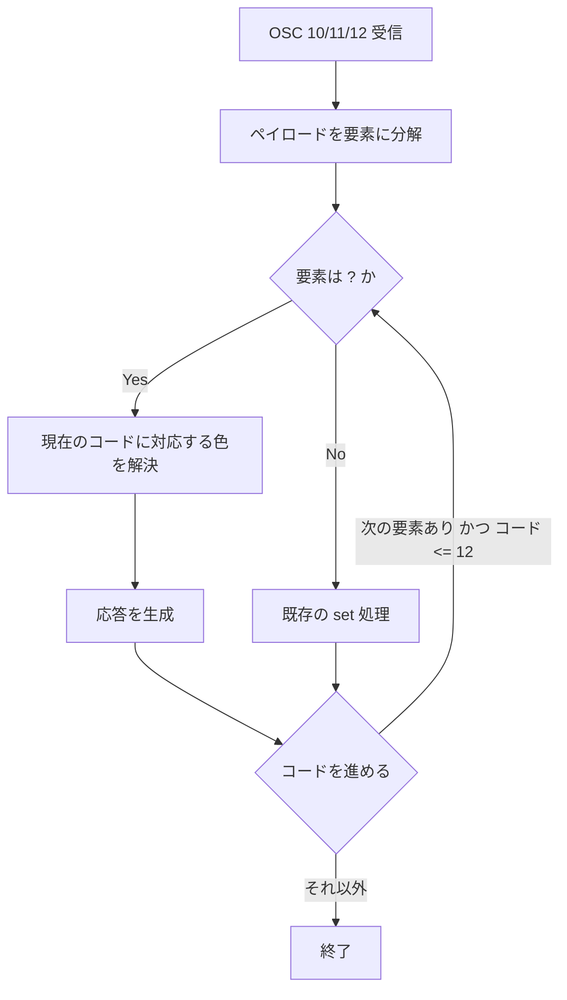

# osc-color-query-response - 要件定義書

## 1. 概要

### 1.1 背景

eMterm は OSC 4 / 10 / 11 / 12 の色照会（ペイロードが照会トークン `?`）を破棄しており、応答を返していない。このため端末から前景色・背景色・カーソル色・パレット色を取得して自身の配色を決めるプログラムは、応答を得られないまま推測した明暗テーマにフォールバックする。

報告された事例は Codex TUI（codex-cli 0.154.0）で、起動時に `ESC]10;?ESC\` と `ESC]11;?ESC\` を送出するが応答が返らないため、入力欄が塗られないまま表示される。

加えて、照会が返す値と描画が実際に使う値を一致させるには、既存の 2 つのリセット経路（OSC 110 / 111 と OSC 104）を訂正する必要がある。現状これらは、アクティブなカラースキームが指定していない色をテーマに残す。

### 1.2 目的

- OSC 4 / 10 / 11 / 12 の色照会に PTY 上で応答し、端末の色を問い合わせるプログラム（Claude Code、tmux、vim/neovim の背景色判定、`$COLORFGBG` 相当のヒューリスティクスなど）が沈黙ではなく実際の値を受け取れるようにする。
- 照会が報告する値を、描画が実際に使っている値と同一にする。そのために OSC 110 / 111 と OSC 104 のリセット先を訂正する。
- すべての応答を既存の単一のデバイス応答経路で配送し、tmux-startup-query-response-leak（応答が稼働中シェルの標準入力に届きプロンプトに打ち込まれる）と同種の不具合が再発しないようにする。

### 1.3 スコープ

**対象**:

- OSC 10 / 11 / 12 の照会応答（FR1）
- OSC 4 のパレット照会応答と照会値の解決（FR2、FR3）
- set と照会が混在するペイロードの扱い（FR4）
- 応答の文字列終端子（FR5）
- 応答の PTY 配送経路（FR6）
- リセット後に照会が返す値（FR7）と、そのために必要な OSC 110 / 111（FR8）、OSC 104（FR9）のリセット先訂正
- 不正・非対応・非照会入力の無害化（FR10）

**対象外**:

- UI 面の変更。本機能は端末制御シーケンスの挙動変更であり、画面・ダイアログ・レイアウト・コンポーネント・デザイントークンを新設しない（デザインステップは skipped）。
- macOS 対応（NFR6）。

## 2. ビジネス要件

### 2.1 ビジネス目標

1. OSC 4 / 10 / 11 / 12 の色照会（`?` トークン付き）に PTY 上で応答し、端末の前景色・背景色・カーソル色・パレット色を調べるプログラム — とりわけ Claude Code、tmux、vim/neovim の背景色判定、`$COLORFGBG` 相当のヒューリスティクス — が沈黙ではなく実際の応答を受け取り、推測した明暗テーマにフォールバックしないようにする。
2. 照会が報告する値を、描画が実際に使う値と同一にする。これには、アクティブなカラースキームが指定していない色をテーマに残してしまう既存の 2 つのリセット経路（OSC 110 / 111 と OSC 104）の訂正が必要になる。
3. すべての応答を既存の単一のデバイス応答経路で配送し、tmux-startup-query-response-leak と同種の不具合（応答が稼働中シェルの標準入力に届き、プロンプトに打ち込まれる）が再発しないようにする。

### 2.2 対象ユーザー

| ユーザータイプ | 説明 |
|----------------|------|
| 端末の色を照会するプログラム | Claude Code、tmux、vim/neovim の背景色判定、`$COLORFGBG` 相当のヒューリスティクス、Codex TUI。端末に色を問い合わせて自身の配色を決める |
| eMterm 利用者 | 非デフォルトのカラースキームを設定して eMterm を使う開発者。OSC 110 / 104 後の描画色がスキームどおりになることの影響を受ける |

### 2.3 期待される効果

- 色を照会するプログラムが、推測した明暗テーマではなく端末の実際の色に基づいて描画できる。
- OSC 110 / 111 後にスキームの前景色・背景色で再描画され、フォールバックの `0x40ff40`（明るい緑）や黒が表示されなくなる。
- OSC 4 で設定したパレット色が OSC 104 後に恒久的に残る不具合が解消し、アクティブなスキームの色に戻る。
- 応答が画面上のテキストやシェルプロンプトに漏れ出さない状態が維持される。

## 3. ユースケース

### 3.1 ユースケース一覧

| ID | ユースケース名 | アクター | 優先度 |
|----|----------------|----------|--------|
| UC01 | 前景色・背景色・カーソル色の照会 | 端末内で動作するプログラム | 高 |
| UC02 | パレット色の照会 | 端末内で動作するプログラム | 高 |
| UC03 | リセット後の照会と再描画 | 端末内で動作するプログラム / eMterm 利用者 | 高 |

### 3.2 ユースケース詳細

#### UC01: 前景色・背景色・カーソル色の照会

**アクター**: 端末内で動作するプログラム（Codex TUI、Claude Code、tmux、vim/neovim など）

**事前条件**:

- プログラムが eMterm の PTY 上で動作している。

**基本フロー**:

1. プログラムが `ESC ] 10 ; ? <terminator>`、`ESC ] 11 ; ? <terminator>` または `ESC ] 12 ; ? <terminator>` を送出する。
2. eMterm がライブテーマの現在値（`fg` / `bg` / `cursor_fg`）を解決する。
3. eMterm が `ESC ] <n> ; rgb:rrrr/gggg/bbbb <terminator>` を PTY に送出する（FR1）。終端子は要求の終端子に一致する（FR5）。
4. プログラムが応答を読み取り、自身の配色を決める。

**代替フロー**:

- 連鎖ペイロード（例 `?;?;?`）では、要素ごとにコードが 10 → 11 → 12 と進み、各 `?` 要素がそれぞれのコードに対する応答を得る。コードが 12 を超えた時点で停止する（FR1）。
- ペイロードが `?` ではなく色指定（set）である場合、応答は発生しない（FR1、FR10）。

**事後条件**:

- テーマの状態は変化せず、グリッドは dirty にならない（FR1）。

#### UC02: パレット色の照会

**アクター**: 端末内で動作するプログラム

**事前条件**:

- プログラムが eMterm の PTY 上で動作している。

**基本フロー**:

1. プログラムが `ESC ] 4 ; index ; ? <terminator>` を送出する。
2. eMterm がそのインデックスについて描画が使う色を解決する（オーバーレイ `palette256[i]` が `Some` ならその値、未設定で `i < 16` なら `palette16[i]`、未設定で `16..=255` なら xterm の 256 色キューブ / グレースケール式）（FR3）。
3. eMterm が `ESC ] 4 ; index ; rgb:rrrr/gggg/bbbb <terminator>` を送出する（FR2）。

**代替フロー**:

- ペイロードは複数ペアを連鎖できる（例 `1;?;200;rgb:00/aa/00;5;?`）。各 `?` ペアはペイロード順にそれぞれの応答要素を生成する（FR2）。
- インデックスが 10 進整数として解釈できない、または 256 以上のペアは、応答も状態変化も発生しない（FR2、FR10）。

**事後条件**:

- 照会部分についてテーマの状態は変化しない。同一ペイロード内の set は従来どおり適用される（FR4）。

#### UC03: リセット後の照会と再描画

**アクター**: 端末内で動作するプログラム / eMterm 利用者

**事前条件**:

- 非デフォルトの `terminal_color_scheme` が有効である（無効な場合は `Theme::default()` のシード値が対象となる）。

**基本フロー**:

1. プログラムが OSC 110 / 111 / 112 / 104 のいずれかを送出する。
2. eMterm がアクティブなカラースキームの値へリセットする（FR8、FR9。OSC 112 は既存の挙動）。
3. 画面がスキームの色で再描画される。
4. プログラムが対応する照会を送出すると、同じスキームの値が返る（FR7）。

**代替フロー**:

- アクティブなカラースキームが無い場合（`settings.terminal_color_scheme` が空または未知で `apply_color_scheme` がテーマを変更しない場合）、スキーム値は `Theme::default()` のシードである `DEFAULT_TERMINAL_FG` / `DEFAULT_TERMINAL_BG` / `DEFAULT_PALETTE16` となる（FR7）。
- OSC 104 に明示インデックス列がある場合、列挙されたインデックスのみが復元される（FR9）。

**事後条件**:

- リセット後の照会が、描画が同時に使っていない値を報告することはない（FR7）。

**ユースケース図**:

```mermaid
graph LR
    App[端末内のプログラム] --> Q[OSC 4/10/11/12 照会]
    Q --> Term[eMterm]
    Term --> Resp[ESC ] n ; rgb:rrrr/gggg/bbbb]
    Resp --> App
```

## 4. 機能要件

### 4.1 機能一覧

| ID | 機能名 | 説明 | 優先度 |
|----|--------|------|--------|
| FR1 | OSC 10 / 11 / 12 色照会応答 | 前景色・背景色・カーソル色の照会に応答する | 高 |
| FR2 | OSC 4 パレット照会応答 | `index;?` 形式のパレット照会に応答する | 高 |
| FR3 | 照会するパレット値の解決 | 描画が使う値と同じ値を解決する | 高 |
| FR4 | set と照会が混在するペイロード | ペイロード順に set 適用と照会応答を行う | 高 |
| FR5 | 応答の文字列終端子 | 要求の終端子（BEL / ST）に一致させる | 高 |
| FR6 | 応答の単一 PTY 配送経路 | 既存の単一スロット応答バッファ経由でのみ配送する | 高 |
| FR7 | リセット後の照会が返す値 | リセット後はアクティブなスキームの値を返す | 高 |
| FR8 | OSC 110 / 111 のリセット先訂正 | スキームの前景色・背景色へリセットする | 高 |
| FR9 | OSC 104 の palette16 復元 | スキームから `palette16` を復元する | 高 |
| FR10 | 不正・非対応・非照会入力の無害化 | 応答バイトも状態変化も生じさせない | 高 |

### 4.2 機能詳細

#### FR1: OSC 10 / 11 / 12 色照会応答

**説明**: OSC 10、11 または 12 のペイロード要素が照会トークン `?` である場合、端末は PTY に `ESC ] <n> ; rgb:rrrr/gggg/bbbb <terminator>` を送出する。`<n>` はその要素が解決するコード（10 = デフォルト前景色、11 = デフォルト背景色、12 = カーソル前景色）であり、色はライブテーマの現在の `fg` / `bg` / `cursor_fg` である。連鎖ペイロードは、`Theme::apply_default_color_set` が既に行っているとおり要素ごとにコードを進める（10 → 11 → 12、対象が 12 を超えた時点で停止）。したがって連鎖内の各 `?` 要素は自分のコードに対する応答を得る。照会への応答はテーマの状態を変化させず、グリッドを dirty にしない。

**入力**:

- OSC コード: 10 / 11 / 12
- ペイロード要素: `?`（照会トークン）または色指定

**出力**:

- 応答バイト列: `ESC ] <n> ; rgb:rrrr/gggg/bbbb <terminator>`

**処理フロー**:



**ビジネスルール**:

- コードの進行は既存の `Theme::apply_default_color_set` と同一。
- 応答生成はテーマ状態を変更しない。

**エラーケース**:

| エラー | 条件 | 対応 |
|--------|------|------|
| 非対応コードの `?` | テーマが所有しない OSC コードに `?` が現れる | 応答なし・状態変化なし（FR10） |

#### FR2: OSC 4 パレット照会応答

**説明**: OSC 4 のペイロードペアが `index;?` の形式である場合、`ESC ] 4 ; index ; rgb:rrrr/gggg/bbbb <terminator>` を送出する。ペイロードは複数ペアを連鎖できる（`1;?;200;rgb:00/aa/00;5;?`）。各 `?` ペアはペイロード順にそれぞれの応答要素を生成する。インデックスが 10 進整数として解釈できないペア、またはインデックスが 256 以上のペアは、応答も状態変化も生じない — 既存の `apply_palette_set` のスキップ挙動（`src-tauri/src/render/theme.rs:330-341`）に倣う。

**入力**:

- OSC コード: 4
- ペイロード: `index;?` ペアの連鎖（set ペアとの混在可）

**出力**:

- 応答バイト列: `ESC ] 4 ; index ; rgb:rrrr/gggg/bbbb <terminator>`

**バリデーション**:

| 項目 | ルール | エラーメッセージ |
|------|--------|------------------|
| index | 10 進整数として解釈できる | なし（応答も状態変化も生じない） |
| index | 256 未満である | なし（応答も状態変化も生じない） |

**エラーケース**:

| エラー | 条件 | 対応 |
|--------|------|------|
| インデックス範囲外 | `index >= 256` | 応答なし・状態変化なし |
| インデックス解釈不能 | 10 進整数として解釈できない | 応答なし・状態変化なし |

#### FR3: 照会するパレット値の解決

**説明**: パレットインデックス `i` について報告する色は、その時点で描画が `i` に対して使う色と厳密に一致する。すなわち、疎なオーバーレイが `Some` を保持していれば `palette256[i]`、そうでなく `i < 16` なら `palette16[i]`、そうでなく `16..=255` なら xterm の 256 色キューブ / グレースケール式である。`Theme::palette256` は疎なオーバーレイであり `None` は「デフォルトを使う」を意味する（`src-tauri/src/render/theme.rs:62-66`）ため、照会が `None` を欠損として報告することがあってはならない。

**出力**:

- 解決された色（8 ビット成分の RGB）

**ビジネスルール**:

- 解決順序: `palette256[i]` が `Some` → `palette16[i]`（`i < 16`）→ xterm キューブ / グレースケール式（`16..=255`）。

#### FR4: set と照会が混在するペイロード

**説明**: set と照会が混在するペイロードは、ペイロード順に各 set を適用し、各照会に応答する。既存の set 意味論は変更しない。OSC 4 で `i < 16` の場合は `palette256[i]` と `palette16[i]` の両方に書き込む（`src-tauri/src/render/theme.rs:342-348`）。OSC 12 は `cursor_fg_override_active` を立てる（`:376-380`）。空または解釈不能な spec 要素は状態を変えずにスキップする（`:362-365`）。連鎖の途中にある照会要素は、次の要素を消費せず、連鎖のコード進行をずらさない。

**ビジネスルール**:

- 処理順序はペイロード順。
- 照会要素は連鎖の構造（要素消費・コード進行）に影響しない。

#### FR5: 応答の文字列終端子

**説明**: 応答の文字列終端子は、それを引き起こした要求の終端子に一致させる。BEL 終端の要求には BEL（`0x07`）、ST 終端の要求には ST（`ESC \`）。現状 `handle_osc_internal(param, data)`（`crates/term_core/src/osc_handler.rs:50`）に到達する OSC ディスパッチは param とペイロードしか運んでいないため、いずれか一方をハードコードするのではなく、終端子を応答生成箇所まで引き回す。

**入力**:

- 要求の終端子: BEL（`0x07`）または ST（`ESC \`）

**出力**:

- 同じ終端子を持つ応答

#### FR6: 応答の単一 PTY 配送経路

**説明**: すべての色照会応答は `TerminalCore` の既存の単一スロット応答バッファに置かれ、`TerminalCore::take_response` を通じてのみ PTY に到達する。ドレインは `Tab::write_device_response` へ転送する既存の 3 箇所 — `process_outer_via_core`（`src-tauri/src/tabs/output_pipeline.rs:117-128`）、`apply_active_pane_output`（`:186-204`）、`apply_queued_live_output`（`src-tauri/src/tabs/replay.rs:822-835`）で行われる。新たな PTY 書き込み経路は導入せず、`take_response` のライブ消費者を追加しない。mux 越しでは、応答は現在の CPR 応答と同様に発信元のリモートペインへフレーミングして返される。

**ビジネスルール**:

- 新しい PTY 書き込み経路を作らない。
- `take_response` のライブ消費者を増やさない。

#### FR7: リセット後に照会が返す値

**説明**: リセットシーケンスの後、照会はすべての場合においてアクティブなカラースキームの値を報告する。OSC 110 の後、OSC 10 の照会はスキームの前景色を報告する。OSC 111 の後、OSC 11 の照会はスキームの背景色を報告する。OSC 112 の後、OSC 12 の照会は `scheme_cursor_fg` を報告する（`src-tauri/src/render/theme.rs:313-321` で既に実現されている挙動）。OSC 104 の後、OSC 4 の照会はインデックス 0-15 についてスキームのパレット値を、16-255 について xterm キューブ / グレースケール値を報告する。リセット後の照会が、描画が同時に使っていない値を報告することはない。アクティブなカラースキームが無い場合（`settings.terminal_color_scheme` が空または未知で `apply_color_scheme` がテーマを変更しない — `:585-610`）、スキーム値は `Theme::default()` のシードである `DEFAULT_TERMINAL_FG` / `DEFAULT_TERMINAL_BG` / `DEFAULT_PALETTE16` である。

#### FR8: OSC 110 / 111 をアクティブなスキームの前景色 / 背景色へリセット

**説明**: `Theme` に `scheme_fg` と `scheme_bg` を追加する。既存の `scheme_cursor_fg`（`src-tauri/src/render/theme.rs:45-51`）に倣い、`Theme::default()` で `DEFAULT_TERMINAL_FG` / `DEFAULT_TERMINAL_BG` からシードし（`:166-167`）、`apply_color_scheme` のプリセット分岐で `theme.fg` / `theme.bg` と並んで更新し（`:600-607`）、`apply_user_scheme` では `theme.fg` / `theme.bg` を更新するのと同じパースガード条件下で更新する（`:612-622`）。OSC 10 / 11 自体はこれらのフィールドを変更しない。`Theme::apply_osc(110)` と `(111)` は、`DEFAULT_TERMINAL_FG` / `DEFAULT_TERMINAL_BG` 定数ではなくこれらのフィールドから `fg` / `bg` を復元する（`:305-312`）。これは照会だけの問題ではなく描画に現れる。非デフォルトのスキーム下では、OSC 110 は現在フォールバックの明るい緑 `0x40ff40` で画面を再描画するが、本変更後はスキームの前景色で再描画する。定数は `Theme::default()` のシードとして残る。

**ビジネスルール**:

- OSC 10 / 11 はスキームミラーのフィールドを変更しない。
- `apply_user_scheme` ではユーザーの色指定がパースできた場合にのみ更新する。

#### FR9: OSC 104 がアクティブなスキームから palette16 を復元する

**説明**: `Theme` に `palette16` のミラーである `scheme_palette16` を追加し、`DEFAULT_PALETTE16` からシードして、カラースキームが適用されるすべての箇所（`apply_color_scheme` のプリセット分岐、および `apply_user_scheme` の既存パースガード下でインデックスごと）で更新する。`apply_palette_reset` は、ペイロードが空の場合に `palette256` オーバーレイ全体をクリアし、加えて `scheme_palette16` から `palette16` を復元する。明示インデックス列がある場合は、列挙された各インデックスについてオーバーレイのスロットをクリアし、`index < 16` であれば `scheme_palette16[index]` から `palette16[index]` を復元する。`changed` の戻り値は、オーバーレイまたは `palette16` のいずれかが実際に変化したときに true となり、新たにカバーされるケースでも描画が dirty としてマークされる。これは照会だけの問題ではなく描画に現れる。OSC 4 は `i < 16` について `palette256[i]` だけでなく `palette16[i]` にも書き込むため、「インデックス 5 を設定してから OSC 104」を行うと、現状インデックス 5 は OSC 4 の色で恒久的に描画され続ける。これを呼び出し側に委ねる旨の古いコメント（`src-tauri/src/render/theme.rs:409-411`）は削除する。

**エラーケース**:

| エラー | 条件 | 対応 |
|--------|------|------|
| 変化なし | オーバーレイも `palette16` も変化しない | `changed` は false を返す |

#### FR10: 不正・非対応・非照会入力の無害化

**説明**: テーマが所有しない OSC コード中の `?`、範囲外または解釈不能なパレットインデックス、不正な連鎖ペア、`?` でもパース可能な色指定でもない spec 要素は、応答バイトも状態変化も生じさせない。`Theme::apply_osc` の既存の「目に見える変化が無ければ false を返す」という契約は維持され、照会への応答が不要な `mark_all_dirty` を引き起こすことはない。

## 5. 非機能要件

### 5.1 パフォーマンス要件

- NFR2（コアレスによる応答の消失・上書き禁止）: `TerminalCore` の応答バッファは単一スロットであるため、OSC 色照会を運ぶ mux の `PtyOutput` フレームは、後続の照会が未配送の先行応答を上書きしうる形でバッチ処理されてはならない。既存のゲートは `Tab::pty_output_batch_eligible` → `payload_has_device_query`（`src-tauri/src/tabs/output_pipeline.rs:167-175`、`super::input` からインポート）であり、「照会を含むフレームは、後続の照会が term_core の単一スロット応答バッファを上書きする前に応答を確保できるよう、単独でパースされなければならない」と文書化されている。この分類器が OSC 色照会をデバイス照会として扱うか、さもなくばコアレス経路がそれらに対して安全であることを示す必要がある。
- FR1: 照会への応答はグリッドを dirty にしない。
- FR10: 照会への応答が不要な `mark_all_dirty` を引き起こさない。

### 5.2 セキュリティ要件

- NFR3（リプレイ隔離の維持）: リプレイ経路およびオフスレッドスワップ経路は、保留中のデバイス応答を破棄し続ける（`src-tauri/src/tabs/replay.rs:96-105`、および `:569` の同等箇所）。これにより、とうに終了したプログラムがスナップショットのバイト列に焼き込んだ色照会が、稼働中シェルの標準入力に届くことはない。この破棄を固定している既存の回帰テストは、変更なしで通り続けなければならない。
- FR6: 応答は既存の単一の配送経路のみを通る。新たな PTY 書き込み経路を導入しない。
- FR10: 不正入力は応答バイトを生じさせない。

### 5.3 可用性要件

- 該当なし（本機能に稼働率・障害復旧時間の要件は定義されていない）。

### 5.4 保守性要件

- NFR1（既存の応答フォーマッタの再利用）: 応答は既存の `term_core::color_spec::format_color_response`（`crates/term_core/src/color_spec.rs:89-96`）でフォーマットする。この関数は各 8 ビット成分を 16 ビットに展開し（`0xAB -> 0xABAB`）、`rgb:rrrr/gggg/bbbb` を返す。2 つ目のフォーマッタは導入しない。現在この関数の唯一の呼び出し元は自身のインラインテストであり、本機能が初めて製品コードの呼び出し元を与える。
- NFR4（レイヤリング: term_core は GUI テーマから独立を保つ）: `crates/term_core` は応答バッファを所有するが、`src-tauri/src/render/theme.rs` にアクセスできない。照会は GUI 層のライブな `Theme` から応答する必要があり、その際 term_core が GUI クレートや `Theme` への依存を獲得してはならない。

### 5.5 互換性要件

- NFR5（CLI 専用ビルドへの非影響）: term_core 側の変更は `--no-default-features` でコンパイルでき、GUI 専用の依存を導入しない。`CARGO_TARGET_DIR=src-tauri/target cargo check --manifest-path src-tauri/Cargo.toml --no-default-features` で検証する。
- NFR6（クロスプラットフォーム同等性）: 挙動は Linux と Windows で同一である。応答経路のいかなる部分も Unix 専用 API に依存してはならない（プロジェクトは `libc` を `cfg(unix)` でゲートしている）。macOS は対象外。

## 6. UI/UX要件

### 6.1 画面設計要件

該当なし。本機能は端末制御シーケンスの挙動変更であり、ユーザー向けの UI 面を持たない。新しい画面・ダイアログ・レイアウト・コンポーネント・デザイントークンを導入せず、デザインシステムのミラー（`doc/UI-DESIGN-GUIDELINES.yaml`、`src-tauri/src/ui/md3.rs`、`src-tauri/web-shared/styles.css`）のいずれにも触れない。FR8 / FR9 の描画に現れる結果は、ユーザーが既に設定済みのカラースキームを画面に反映させる訂正であり、新規のビジュアルデザインではない。デザインステップは `skipped`。

### 6.2 画面遷移

該当なし。

### 6.3 レスポンシブ対応

該当なし。

## 7. データ要件

### 7.1 データモデル概要

永続データの追加はない。本機能が追加するのは `Theme` 上のスキームミラーのフィールドのみである（FR8、FR9）。

### 7.2 データ項目

| エンティティ | 項目名 | 型 | 必須 | 説明 |
|--------------|--------|-----|------|------|
| Theme | `scheme_fg` | 色 | ○ | アクティブなスキームの前景色。OSC 110 のリセット先（FR8） |
| Theme | `scheme_bg` | 色 | ○ | アクティブなスキームの背景色。OSC 111 のリセット先（FR8） |
| Theme | `scheme_palette16` | 色の配列（16 要素） | ○ | アクティブなスキームの `palette16` ミラー。OSC 104 の復元元（FR9） |

### 7.3 データ保持期間

| データ種別 | 保持期間 |
|------------|----------|
| スキームミラーのフィールド | `Theme` のライフタイムと同じ（永続化しない） |
| 応答バッファ（単一スロット） | `TerminalCore::take_response` でドレインされるまで |

## 8. 外部連携

### 8.1 連携システム

| システム名 | 連携方法 | データ |
|------------|----------|--------|
| 端末内のプログラム | PTY 上の OSC 制御シーケンス | OSC 4 / 10 / 11 / 12 の照会と、その応答 |
| mux のリモートペイン | 既存の CPR 応答と同じフレーミング | 色照会応答（FR6） |

### 8.2 API仕様要件

| 要求 | 応答 |
|------|------|
| `ESC ] 10 ; ? <terminator>` | `ESC ] 10 ; rgb:rrrr/gggg/bbbb <terminator>` |
| `ESC ] 11 ; ? <terminator>` | `ESC ] 11 ; rgb:rrrr/gggg/bbbb <terminator>` |
| `ESC ] 12 ; ? <terminator>` | `ESC ] 12 ; rgb:rrrr/gggg/bbbb <terminator>` |
| `ESC ] 4 ; index ; ? <terminator>` | `ESC ] 4 ; index ; rgb:rrrr/gggg/bbbb <terminator>` |

`<terminator>` は要求の終端子に一致する（FR5）。

## 9. 制約条件

### 9.1 技術的制約

- `crates/term_core` は応答バッファを所有するが `src-tauri/src/render/theme.rs` にアクセスできない。照会は GUI 層のライブな `Theme` から応答する必要がある（NFR4）。
- `Theme` は `Settings` のハンドルを持たないため、ミラーフィールドから復元することが `apply_osc` に利用可能な唯一のインプレース機構である（A3）。
- FR8 / FR9 が導入するスキームミラーのフィールドは `scheme_cursor_fg` のパターンに厳密に従う。`apply_user_scheme` では、ユーザーの色指定がパースできたときにのみフィールドを更新するという規則も含む（A3）。
- term_core 側の変更は `--no-default-features` でコンパイルできる必要がある（NFR5）。
- 応答経路は Unix 専用 API に依存できない（NFR6）。
- `TerminalCore::take_response` が合成応答の唯一のライブ PTY 配送経路であり、2 つ目のライブ消費者を追加すると tmux-startup-query-response-leak を再導入する（A4）。
- リプレイ経路とオフスレッドスワップ経路が保留中の応答を破棄することは、本機能が緩和しない不変条件である（A5）。

### 9.2 ビジネス上の制約

- macOS は対象外（NFR6）。

### 9.3 スケジュール制約

- 該当なし。

### 9.4 宣言された変更集合

このフィーチャー固有のパスは手動で列挙せず、create-plan で `workflow.yaml` の各タスクの `files` から導出する（`references/phases/create-plan-phase.md`）。

**デフォルトメンバー**（SPEC作成者が明示的に除外しない限り、常に宣言に含まれる）:

- `feature-docs/osc-color-query-response/**`
- `test-docs/osc-color-query-response/**`

`feature-docs/osc-color-query-response/**` に含まれるもの: `REQUIREMENTS.md`、`SPEC.md`、`IMPLEMENTATION.md`、`workflow.yaml`、`phase-state/`、`tasks/`、`reviews/roundN.yaml`、`VERIFICATION.md`、`retrospect.yaml`、およびデザインステップが生成するデザイン成果物。生成主体は各フェーズドキュメントおよび `references/phase-state.md` を参照。

`test-docs/osc-color-query-response/**` に含まれるもの: `{T}.tests.yaml`（パス形式: `test-docs/osc-color-query-response/{T}.tests.yaml`）。生成主体は `implement-phase.md` を参照。

**意味論**:

- デフォルトのメンバーは、SPEC作成者が明示的に除外しない限り宣言に含まれる。除外は意図的な絞り込みであり、記載漏れによる省略ではない。
- この宣言はスーパーセット（superset）の主張であり、実際の変更集合は宣言に含まれる（CONTAINED IN）必要がある。実際には生成されないパスが宣言されていても違反にはならない。

## 10. 想定される課題とリスク

### 10.1 技術的課題

| 課題 | 影響度 | 対応策 |
|------|--------|--------|
| `crates/term_core` の OSC パーサーが、到着した文字列終端子（BEL か ST か）を保持しているかが未検証（A6） | 中 | FR5 は要件を述べるに留め、引き回しの実装は plan フェーズに委ねる |
| `payload_has_device_query`（`src-tauri/src/tabs/input.rs`）が OSC 色照会を既に認識しているかが未検証（A7） | 中 | NFR2 は要件を述べ、現状の可否を断定しない。plan フェーズで確認する |
| 単一スロット応答バッファのコアレスによる応答の消失・上書き | 高 | NFR2。照会を含むフレームを単独でパースする、またはコアレス経路の安全性を示す |
| term_core が GUI の `Theme` に依存してしまう | 高 | NFR4。GUI 層のライブな `Theme` から応答し、term_core に依存を持ち込まない |

### 10.2 ビジネスリスク

| リスク | 発生確率 | 影響度 | 対応策 |
|--------|----------|--------|--------|
| 応答が稼働中シェルの標準入力に漏れ、プロンプトに打ち込まれる（tmux-startup-query-response-leak の再発） | 中 | 高 | FR6 の単一配送経路と NFR3 のリプレイ破棄維持。既存の回帰テストを変更なしで通す |
| FR8 / FR9 の描画に現れる変更がリセット後の見た目を変える | 中 | 中 | E2E ハーネスが無いため手動検証を行う（A9）。変更後の見た目はユーザーが設定済みのスキームに一致する |

## 11. 成功基準

### 11.1 受け入れ基準

- [ ] eMterm 内で動作するシェルで `printf '\033]11;?\007'` を実行すると `\033]11;rgb:rrrr/gggg/bbbb\007` の形式の応答が表示され、報告された色が端末が描画している背景色と一致する。
- [ ] `printf '\033]10;?\033\\'` は ST 終端の応答を受け取り、同じ照会を BEL 終端で送ると BEL 終端の応答を受け取る。
- [ ] `printf '\033]4;5;?\007'` はインデックス 5 の現在描画されている色を応答し、`\033]4;5;rgb:11/22/33\007` の後は同じ照会が `rgb:1111/2222/3333` を応答する。
- [ ] 一度も設定されていない 16..255 のインデックスに対する OSC 4 照会は、そのインデックスの xterm キューブ / グレースケール色を応答する。
- [ ] 非デフォルトのカラースキーム下で、OSC 110 の後に OSC 10 の照会を行うとスキームの前景色が報告され、画面上の可視テキスト色が `0x40ff40` ではなくスキームの前景色になる。
- [ ] 非デフォルトのカラースキーム下で、OSC 111 の後に OSC 11 の照会を行うとスキームの背景色が報告され、可視背景が黒ではなくスキームの背景色になる。
- [ ] `\033]4;5;rgb:11/22/33\007` の後に `\033]104\007` を送ると、インデックス 5 が再びアクティブなスキームの色 5 で描画され、インデックス 5 の OSC 4 照会も同じスキーム色を報告する。
- [ ] `\033]104;5\007`（明示インデックス）はインデックス 5 のみを復元し、OSC 4 で設定済みの他のインデックスは描画・照会応答の両方で値を保つ。
- [ ] OSC 112 の後の OSC 12 照会は `scheme_cursor_fg` を報告する（既存挙動が本機能で変わらない）。
- [ ] 照会が画面上にテキストとして現れることはなく、ウィンドウ切替・detach/attach サイクル・スクロールバック復元の後にシェルプロンプトに現れることもない。
- [ ] 不正な照会（`\033]4;999;?\007`、`\033]4;abc;?\007`）は PTY にバイトを出さず、テーマを変更しない。
- [ ] `CARGO_TARGET_DIR=src-tauri/target cargo test --manifest-path src-tauri/Cargo.toml --lib` と `crates/term_core` の同等コマンドが通り、`cargo check --no-default-features` が通る。

### 11.2 KPI

| 指標 | 目標値 | 測定方法 |
|------|--------|----------|
| 該当なし | - | 本機能に KPI は定義されていない |

## 12. テストシナリオ

### 12.1 テスト観点

- [ ] 正常系: OSC 10 / 11 / 12 の単一照会がライブの `fg` / `bg` / `cursor_fg` を返し、ペイロードが `?` ではなく set の場合は応答を返さない（theme 単体）。
- [ ] 正常系: OSC 4 の照会値解決 — オーバーレイ設定済み（`palette256[i] = Some`）、オーバーレイ未設定で `i < 16`（`palette16[i]` にフォールバック）、オーバーレイ未設定で `i >= 16`（xterm キューブ / グレースケール式）（theme 単体）。
- [ ] 正常系: 混在ペイロード `1;rgb:10/00/00;5;?` がインデックス 1 の set を適用し、インデックス 5 の照会に順序どおり応答する（theme 単体）。
- [ ] 正常系: チャンク中に生成された応答が `take_response` でドレインされ、`write_device_response` 経由で 1 回転送される。別々にパースされた 2 つのフレームの照会はそれぞれ自分の応答を得る（tabs 単体）。
- [ ] 境界値: `format_color_response` の出力形状を境界成分（0x00、0x7f、0xff）で確認する — `crates/term_core/src/color_spec.rs` の既存インラインテストを拡張する（term_core 単体）。
- [ ] 境界値: 連鎖 OSC 10 ペイロード `?;?;?` がコード 10、11、12 の順に 3 つの応答を生成し、4 要素の連鎖はコード 12 の後で停止する（theme 単体）。
- [ ] 境界値: プリセットスキームが有効なとき OSC 110 が `fg` を `scheme_fg` から復元する（`DEFAULT_TERMINAL_FG` ではない）。`src-tauri/src/render/theme.rs:891-898` の既存テスト `apply_osc_112_resets_cursor_fg_to_active_scheme_not_hardcoded_default` の直接的な類似。OSC 111 / `scheme_bg` も同様（theme 単体）。
- [ ] 境界値: `foreground` / `background` の指定がパースに失敗するユーザー定義スキーム下での OSC 110 / 111 は、`apply_user_scheme` のパースガード付き更新に一致して `Theme::default()` のシードにフォールバックする（theme 単体）。
- [ ] 境界値: `apply_osc(4, "5;rgb:11/22/33")` の後の `apply_osc(104, "")` がオーバーレイをクリアし、かつ `palette16[5]` をアクティブなスキームの色 5 に復元する。`apply_osc(104, "5")` はインデックス 5 の `palette16` エントリのみを復元する（theme 単体）。
- [ ] 境界値: `apply_osc(104, ...)` は `palette16` のみが変化した場合（オーバーレイが既にクリア）に `true` を返し、新たにカバーされるケースで描画が dirty にマークされる。何も変化しない場合は引き続き `false` を返す（theme 単体）。
- [ ] 異常系: 既存テスト `apply_osc_110_resets_fg`、`apply_osc_111_resets_bg`、`apply_osc_104_empty_resets_all`、`apply_osc_104_indexed_resets_only_listed`、`apply_osc_104_no_change_returns_false` を削除ではなく新しいリセット意味論に更新する（theme 単体）。
- [ ] セキュリティ: `reset_frame_for_replay` がリプレイするスナップショットバイトに埋め込まれた色照会は PTY 書き込みを生じない — 既存の破棄回帰テストを DA1 / DSR だけでなく OSC 色照会ペイロードも対象にするよう拡張する（tabs/replay 回帰）。
- [ ] パフォーマンス: OSC 色照会を運ぶ `PtyOutput` フレームが後続フレームとコアレスされない（NFR2）（tabs 回帰）。
- [ ] 手動: E2E ハーネスが無いため、`.claude/rules/debugging-constraints.md` に従い `emterm.log` と画面観察で検証する。非デフォルトの `terminal_color_scheme` を設定した実際の eMterm セッションで上記の `printf` プローブを実行し、OSC 110 / 104 の描画訂正を目視確認する。

## 13. 用語定義

| 用語 | 定義 |
|------|------|
| OSC | Operating System Command。`ESC ]` で始まる制御シーケンス |
| 照会トークン | OSC ペイロード中の `?`。設定ではなく現在値の問い合わせを表す |
| BEL | 文字列終端子の一形式。`0x07` |
| ST | 文字列終端子の一形式。`ESC \` |
| `palette16` | インデックス 0-15 の色配列。OSC 4 は `i < 16` のときここにも書き込む |
| `palette256` | 疎なオーバーレイ。`None` は「デフォルトを使う」を意味する |
| スキームミラーのフィールド | `scheme_fg` / `scheme_bg` / `scheme_cursor_fg` / `scheme_palette16`。アクティブなカラースキームの値を保持し、リセットの復元元となる |
| 単一スロット応答バッファ | `TerminalCore` が合成応答を 1 件だけ保持するバッファ。`take_response` でドレインされる |
| tmux-startup-query-response-leak | 応答が稼働中シェルの標準入力に届き、プロンプトに打ち込まれる種類の不具合 |

## 14. 確認事項

### 14.1 確認済み事項

- [x] OSC 110 / 111 のリセット先: `DEFAULT_TERMINAL_FG` / `DEFAULT_TERMINAL_BG` 定数ではなく、アクティブなカラースキームの前景色 / 背景色へリセットする（A1、FR8）。
- [x] OSC 104 の挙動: `palette256` オーバーレイのクリアに加えて、アクティブなカラースキームから `palette16` を復元する（A2、FR9）。
- [x] デザインステップ: `skipped`。本機能は端末制御シーケンスの挙動変更であり UI 面を持たない。
- [x] スキームミラーのフィールドは `scheme_cursor_fg` のパターンに厳密に従う。`Theme` は `Settings` のハンドルを持たないため、ミラーからの復元が `apply_osc` に利用可能な唯一のインプレース機構（A3、`src-tauri/src/render/theme.rs:45-51, 600-628` で確認）。
- [x] `TerminalCore::take_response` が合成応答の唯一のライブ PTY 配送経路（A4）。
- [x] リプレイ経路とオフスレッドスワップ経路の応答破棄は、本機能が緩和しない不変条件（A5）。
- [x] ライセンス: プロジェクトは MIT で配布される。新規ソースファイルに適用されるファイル単位のライセンスヘッダ規約は観測されなかった（A8）。
- [x] E2E ハーネスが存在しないため、FR8 / FR9 の描画に現れる訂正のエンドツーエンド確認はユーザーによる手動検証で行う（A9、`test/README.md:97-101`）。

### 14.2 未確認・保留事項

- [ ] `crates/term_core` の OSC パーサーが、到着した文字列終端子（BEL か ST か）を現在保持しているかは未検証。`handle_osc_internal` は `(param, data)` しか受け取らず、パーサーのソースは本ディスパッチの読み取り可能な入力集合の外にある。FR5 は要件を述べ、引き回しは plan フェーズに委ねる（A6）。
- [ ] `payload_has_device_query`（`src-tauri/src/tabs/input.rs`）が OSC 色照会を既に認識しているかは未検証。当該ファイルは本ディスパッチの読み取り可能な入力集合の外にある。NFR2 は現状の可否を断定せずに要件を述べる（A7）。

## 15. 参考資料

- タスクトラッカー: [https://www.notion.so/3d93509ec8ee81dc8fa3c31cc698e212](https://www.notion.so/3d93509ec8ee81dc8fa3c31cc698e212)
- `src-tauri/src/render/theme.rs`: `Theme`、`apply_osc`、`apply_palette_set`、`apply_palette_reset`、`apply_color_scheme`、`apply_user_scheme`
- `crates/term_core/src/color_spec.rs`: `format_color_response`（`:89-96`）
- `crates/term_core/src/osc_handler.rs`: `handle_osc_internal`（`:50`）
- `src-tauri/src/tabs/output_pipeline.rs`: `process_outer_via_core`（`:117-128`）、`apply_active_pane_output`（`:186-204`）、`pty_output_batch_eligible`（`:167-175`）
- `src-tauri/src/tabs/replay.rs`: 応答破棄（`:96-105`、`:569`）、`apply_queued_live_output`（`:822-835`）
- `.claude/rules/debugging-constraints.md`: 調査は `emterm.log` 経由で行う
- `test/README.md`（`:97-101`）: E2E ハーネスが存在しないこと
