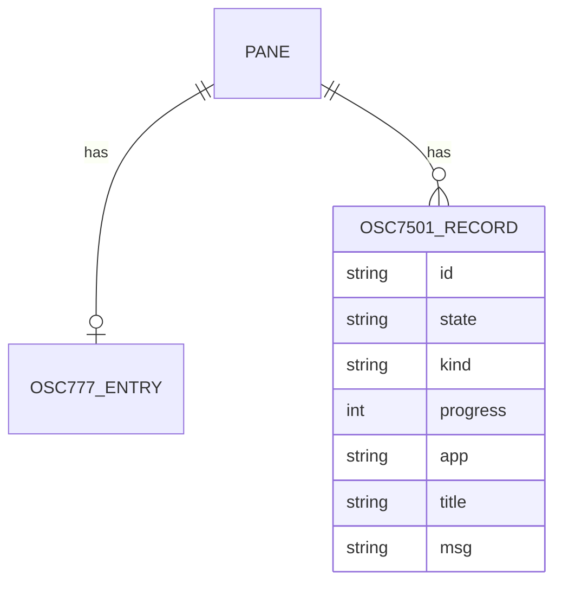

# osc7501-program-status - 要件定義書

## 1. 概要

### 1.1 背景
eMterm は OSC 777 emterm;agent-status でエージェント状態を受け取り、タブバッジ・mux サイドバー・通知に表示している。OSC 7501（Program Status Protocol draft 0.3）で状態を報告するエージェントの状態は、現在は表示されない。

### 1.2 目的
- OSC 7501（Program Status Protocol draft 0.3）を受信し、既存のエージェント状態表示（タブバッジ・mux サイドバー・通知・ステータスバーのテンプレート変数）に反映する。
- eMterm 専用のフックなしで、OSC 7501 対応エージェントの状態を表示できるようにする。
- 既存の OSC 777 emterm;agent-status の挙動を変えない。

### 1.3 スコープ
- 対象: 通常タブと mux ペインでの OSC 7501 の受信・解析・レコード保持・寿命管理・照会応答、OSC 777 との状態合成、error 状態の追加、通知、ステータスバーのテンプレート変数 `{agent_status}`、mux daemon での配信・リプレイ除去・hot-upgrade の引き継ぎ、mux エージェント API と `emterm mux wait` の error 対応。
- 対象外（FR19）: OSC 9;4 の対応付け、terminfo の Pst capability、kind・progress・msg の表示。既存の OSC 9 通知処理は変更しない。

## 2. ビジネス要件

### 2.1 ビジネス目標
- OSC 7501 対応エージェントの状態を、eMterm 専用のフックなしで既存のエージェント状態表示に反映する。
- 既存の OSC 777 emterm;agent-status の挙動を変えない。

### 2.2 対象ユーザー
| ユーザータイプ | 説明 |
|----------------|------|
| OSC 7501 対応エージェントの利用者 | OSC 7501 で状態を報告するエージェントを eMterm の通常タブまたは mux ペインで動かす |
| OSC 777 agent-status の利用者 | 既存の OSC 777 emterm;agent-status で状態を報告している |

### 2.3 期待される効果
- OSC 7501 対応エージェントの状態が、タブバッジ・mux サイドバー・通知・ステータスバーに表示される。
- OSC 777 だけを使うペインの表示・通知・mux API の結果は変わらない。

## 3. ユースケース

### 3.1 ユースケース一覧
| ID | ユースケース名 | アクター | 優先度 |
|----|----------------|----------|--------|
| UC01 | 通常タブで OSC 7501 の状態を表示する | OSC 7501 対応エージェント | 高 |
| UC02 | mux ペインで OSC 7501 の状態を表示する | OSC 7501 対応エージェント | 高 |
| UC03 | OSC 7501 の対応を照会する | OSC 7501 対応エージェント | 中 |
| UC04 | error への遷移を通知する | OSC 7501 対応エージェント | 中 |

### 3.2 ユースケース詳細

#### UC01: 通常タブで OSC 7501 の状態を表示する

**アクター**: OSC 7501 対応エージェント

**事前条件**:
- エージェントが通常タブの PTY で動いている。

**基本フロー**:
1. エージェントが `OSC 7501 ; state=...` を BEL 終端または ST 終端で送る。
2. eMterm が body を解析し、その id のレコードを置き換える。
3. OSC 777 の状態と OSC 7501 の集約状態を合成し、タブバッジと `{agent_status}` に反映する。

**代替フロー**:
- 破棄条件（FR3）に当たる報告は丸ごと破棄する。state が欠落・未知値、または id が不正な報告は無視する。
- `state=clear` は対象 id とその子孫（id 無指定なら全レコード）を削除する。

**事後条件**:
- タブバッジと `{agent_status}` が合成済みの状態を示す。

#### UC02: mux ペインで OSC 7501 の状態を表示する

**アクター**: OSC 7501 対応エージェント

**事前条件**:
- エージェントが mux ペインで動いている。

**基本フロー**:
1. エージェントが OSC 7501 を送る。
2. daemon の AgentStatusFeedScanner が OSC 777 報告・OSC 133 mark と同じ順序付きフィードで認識し、daemon がレコード表を更新する（GUI の接続の有無を問わない）。
3. daemon が wire の OSC 7501 用の項目またはメッセージで GUI に届け、ペインの revision を上げる。
4. GUI がタブバッジ・mux サイドバー・通知・`{agent_status}` に反映する。

**代替フロー**:
- スナップショット・再アタッチ・ウィンドウ切替の後は replay_derived（通知なし）で再同期する。

**事後条件**:
- 未接続中に受けた報告も、接続後の表示に反映されている。

#### UC03: OSC 7501 の対応を照会する

**アクター**: OSC 7501 対応エージェント

**事前条件**:
- なし。

**基本フロー**:
1. エージェントが body がちょうど `?` の `OSC 7501 ; ? ST` を送る。
2. eMterm が照会と同じ終端子で body `?` の OSC 7501 を返す。

**代替フロー**:
- mux ペインでは、接続中の GUI の term_core が PtyInput 経由で返す（A3）。

**事後条件**:
- レコードは変更されない。

#### UC04: error への遷移を通知する

**アクター**: OSC 7501 対応エージェント

**事前条件**:
- agent_notify_on_done が有効で、既存の通知ゲートを満たす。

**基本フロー**:
1. エージェントが `state=error` を報告する。
2. 合成後のペイン状態が error に遷移する。
3. eMterm が通知を送る。名前は無害化済みの title、無ければ継承した app、無ければ OSC 777 の name、無ければ既存の代替名。

**事後条件**:
- error のレコードは明示的な clear、RIS、タブまたはペインの終了まで残る。

## 4. 機能要件

### 4.1 機能一覧
| ID | 機能名 | 説明 | 優先度 |
|----|--------|------|--------|
| FR1 | 受信 | BEL 終端・ST 終端の OSC 7501 を通常タブと mux ペインで受信する | 高 |
| FR2 | 解析規則 | key=value を `:` で連結した body を解析する | 高 |
| FR3 | 破棄条件 | サイズ・base64・UTF-8・制御文字・state・id の条件で破棄または無視する | 高 |
| FR4 | state とレコード置換 | 6 値の state、レコードの完全置換、clear による削除 | 高 |
| FR5 | 任意 key の解析と保持 | kind・progress・app・title・msg を解析して保持する | 高 |
| FR6 | レコード上限 | タブまたはペインあたり 256 件、最古更新から追い出す | 中 |
| FR7 | 寿命 | OSC 133 A・RIS・終了によるレコード削除 | 高 |
| FR8 | 照会応答 | `OSC 7501 ; ?` に同じ終端子で応答する | 中 |
| FR9 | ストア構成と合成 | OSC 777 エントリーと別に OSC 7501 のレコード表を持ち、状態を合成する | 高 |
| FR10 | 階層 id の集約 | 全レコードのうち最も優先順位の高い状態を集約状態にする | 高 |
| FR11 | error 状態 | AgentState に Error を追加し、集約順位と表示を定める | 高 |
| FR12 | 通知 | 合成後の状態が blocked・done・error に遷移したら通知する | 高 |
| FR13 | ステータスバーのテンプレート変数 | `{agent_status}` を追加する | 中 |
| FR14 | mux 配信 | daemon で解析・保持し、wire で GUI に届ける | 高 |
| FR15 | mux リプレイ除去 | スクロールバックリングとスナップショットから OSC 7501 を取り除く | 高 |
| FR16 | mux エージェント API と CLI | 合成状態を対象にし、`emterm mux wait` に error を追加する | 中 |
| FR17 | hot-upgrade の引き継ぎ | レコードと更新順を handoff ファイルで引き継ぐ | 中 |
| FR18 | OSC 777 互換 | OSC 777 の挙動を変えない | 高 |
| FR19 | 対象外 | OSC 9;4・Pst capability・kind/progress/msg の表示は扱わない | - |

### 4.2 機能詳細

#### FR1: 受信

**説明**: `OSC 7501 ; <body>` を BEL 終端と ST（ESC \）終端の両方で受信する。通常タブでは TerminalCore::register_osc_app_param で 7501 を未使用の内部番号に写像する（term_core には 7501 を埋め込まない）。mux ペインでは daemon の AgentStatusFeedScanner が OSC 本文の `7501;` を認識し、OSC 777 報告・OSC 133 mark と同じ 1 本の順序付きフィードで処理する。

**入力**:
- OSC 7501 シーケンス: バイト列 - BEL または ST で終端する

#### FR2: 解析規則

**説明**: body は key=value を `:` で連結したもの。key は `[a-z]+`、value は `[A-Za-z0-9_.,+/=-]*`。

**ビジネスルール**:
- 形式に合わないペアは読み飛ばす。
- 未知の key は無視する。
- 重複する key は後勝ちとする。
- progress が 0〜100 の整数でなければ不正ペアとして読み飛ばす（A5）。

#### FR3: 破棄条件

**説明**: 条件に当たる報告を丸ごと破棄、または無視する。

**エラーケース**:
| エラー | 条件 | 対応 |
|--------|------|------|
| シーケンス長超過 | シーケンス全体が 4096 バイトを超える | 報告を丸ごと破棄 |
| title 長超過 | エンコード後 256 バイトまたはデコード後 192 バイトを超える | 報告を丸ごと破棄 |
| msg 長超過 | エンコード後 2732 バイトまたはデコード後 2048 バイトを超える | 報告を丸ごと破棄 |
| base64 不正 | title・msg の base64 が不正 | 報告を丸ごと破棄 |
| デコード結果不正 | title・msg のデコード結果が UTF-8 でないか制御文字を含む | 報告を丸ごと破棄 |
| state 不正 | state が欠落しているか未知値 | 報告を無視 |
| id 不正 | 各セグメントが `[A-Za-z0-9_.+-]{1,32}` でない、8 階層を超える、128 バイトを超える | 報告を無視 |

#### FR4: state とレコード置換

**説明**: state は idle / working / done / blocked / error / clear の 6 値。

**ビジネスルール**:
- clear 以外の報告は、その id のレコードを完全に置き換える（省略した key はレコードから消える）。
- state=clear は対象 id とその子孫のレコードを削除する。id が無指定なら全レコードを削除する。

#### FR5: 任意 key の解析と保持

**説明**: kind（permission / question / auth）、progress（0〜100 の整数）、app（`[A-Za-z0-9_.+-]{1,32}`）、title・msg（base64 の UTF-8）を解析してレコードに保持する。

**ビジネスルール**:
- kind は state=blocked のときだけ保持する。
- progress は state=working / blocked のときだけ保持する。
- app を持たないレコードは、最も近い祖先レコードの app を継承する。
- kind・progress・msg は表示にも通知にも使わない。

#### FR6: レコード上限

**説明**: OSC 7501 のレコードはタブまたは mux ペインあたり 256 件まで。

**ビジネスルール**:
- 上限を超えるときは、最後の更新が最も古いレコードを追い出す。

#### FR7: 寿命

**説明**: レコードの削除契機を定める。

**ビジネスルール**:
- live・main screen の OSC 133 A を受けたら、state が working・blocked・idle のレコードを削除する（直前の OSC 133 D は条件にしない）。
- done・error のレコードは、明示的な clear、RIS、タブまたはペインの終了まで残す。
- RIS で全レコードを削除する。
- DECSTR と alt screen の切替ではレコードを削除しない。
- タブまたは mux ペインが閉じたときは、レコードをエントリーごと破棄する。

#### FR8: 照会応答

**説明**: body がちょうど `?` の `OSC 7501 ; ? ST` に、body `?` の OSC 7501 で応答する。

**ビジネスルール**:
- 終端子は照会と同じもの（BEL または ST）を使う。
- 照会はレコードを変更しない。

#### FR9: ストア構成と合成

**説明**: 既存の OSC 777 エントリー（AgentStatusModel と daemon の MuxPane の agent-status）はそのまま残す。それとは別に、タブまたはペインごとに OSC 7501 のレコード表を持つ。

**ビジネスルール**:
- 表示・通知・mux API が使うペインの状態は、OSC 777 の状態と OSC 7501 の集約状態を FR11 の優先順位で合成したもの。
- OSC 777 だけを受けたペインの合成状態は、現在の OSC 777 の状態と一致する。

#### FR10: 階層 id の集約

**説明**: ペインの OSC 7501 集約状態は、ルートと子孫を含む全レコードのうち、FR11 の優先順位で最も高い状態とする。

#### FR11: error 状態

**説明**: core の AgentState と mux wire の mux_ipc::protocol::AgentState に Error を追加する。

**ビジネスルール**:
- 既読・未読の扱いは done と同じ。
- 集約順位は blocked > 未読 error > 未読 done > working > 既読 error > 既読 done > idle。
- タブバッジと mux サイドバーでは、error に専用の絵文字と md3 の error 系の色を使う。

#### FR12: 通知

**説明**: 合成後のペイン状態が blocked・done・error に遷移したときに通知する。

**ビジネスルール**:
- error への遷移は agent_notify_on_done のトグルで制御し、設定は追加しない。
- それ以外のゲート（notification_enabled、agent_status_notifications、agent_notify_visible_pane、ペインごと 30 秒のレート制限）は既存のものを使う。
- 通知本文の名前には、合成状態を決めた OSC 7501 レコードの無害化済み title を使う。title が無ければ継承した app、どちらも無ければ OSC 777 の name、それも無ければ既存の代替名を使う。

#### FR13: ステータスバーのテンプレート変数

**説明**: ステータスバーのテンプレート変数 `{agent_status}` を追加する。

**出力**:
- `{agent_status}`: 文字列 - アクティブタブの合成済み集約状態（タブ自身の状態と、mux 接続中ならウィンドウグループ内の全ペイン）。状態が無いときは空文字列。

**ビジネスルール**:
- 集約状態が変わったら、変数のバージョンを上げて再描画を要求する。
- 既定のテンプレートには追加しない。

#### FR14: mux 配信

**説明**: mux ペインでは daemon が OSC 7501 を解析してレコード表を保持する（GUI の接続の有無を問わない）。

**ビジネスルール**:
- 合成状態の計算と通知名の決定に必要な情報は、wire に OSC 7501 用の項目またはメッセージを追加して GUI に届ける。
- どちらのソースが変わっても、ペインの revision を上げる。
- スナップショット・再アタッチ・ウィンドウ切替の後は replay_derived（通知なし）で再同期する。
- GUI は、mux の内側コンテンツを解析して得た OSC 7501 を、既存の OSC 777 と同じく捨てる。
- daemon は RIS を検出し、そのペインのレコードを全削除する。

#### FR15: mux リプレイ除去

**説明**: daemon のスクロールバックリングとスナップショットから、OSC 7501 の報告と照会（`?`）を取り除く。

**ビジネスルール**:
- 再アタッチ時のリプレイで、レコードの再適用も照会への再応答も起こさない。

#### FR16: mux エージェント API と CLI

**説明**: WaitAgentState などの mux エージェント API は、合成後のペイン状態を対象にする。

**ビジネスルール**:
- `emterm mux wait` の状態指定に error を追加する。
- `emterm agent-status` CLI は変更しない（引き続き OSC 777 を送る）。
- OSC 7501 のレコードを照会する API は追加しない。

#### FR17: hot-upgrade の引き継ぎ

**説明**: mux daemon の hot-upgrade では、各ペインの OSC 7501 の全レコードと、追い出しに使う更新順を handoff ファイルに含めて引き継ぐ。

#### FR18: OSC 777 互換

**説明**: OSC 777 emterm;agent-status の解析・推論クリア（D→A latch）・mux 配信・CLI の挙動を変えない。OSC 7501 を受けていないペインの表示と通知は現在と同じ。

#### FR19: 対象外

**説明**: OSC 9;4 の対応付け、terminfo の Pst capability、kind・progress・msg の表示は扱わない。既存の OSC 9 通知処理は変更しない。

## 5. 非機能要件

### 5.1 パフォーマンス要件
- NFR4（UI スレッド）: OSC 7501 の処理と通知の送出で UI スレッドをブロックしない。

### 5.2 セキュリティ要件
- NFR5（セキュリティ）: title・msg をマークアップとして解釈しない。名前に使う title は、制御文字と、双方向制御文字などの不可視文字を取り除き、80 文字までに切り詰める。`{agent_status}` の値は固定の状態語だけにし、端末から受け取った文字列を含めない。
- 入力検証: FR2・FR3 の解析規則と破棄条件に従う。

### 5.3 可用性要件
- 該当なし。

### 5.4 保守性要件
- NFR1（ビルド構成）: OSC 7501 の解析モジュールとレコード表は gui feature に依存させず、`--no-default-features` のビルドでもコンパイルできるようにする。

### 5.5 互換性要件
- NFR3（対応プラットフォーム）: Linux と Windows の両方で動作する。
- FR18: OSC 777 emterm;agent-status の挙動を変えない。

## 6. UI/UX要件

### 6.1 画面設計要件
- タブバッジと mux サイドバーで、error に専用の絵文字と md3 の error 系の色を使う（FR11）。
- ステータスバーにテンプレート変数 `{agent_status}` を追加する。既定のテンプレートには追加しない（FR13）。
- デザインステップはスキップした: 既存のバッジの仕組み（12px スロット、絵文字、md3 の色ロール）に error 用の絵文字と色を 1 組足し、ステータスバーにはテキストのテンプレート変数を足すだけで、新しい視覚要素を作らない。

### 6.2 画面遷移
- 該当なし。

### 6.3 レスポンシブ対応
- 該当なし。

## 7. データ要件

### 7.1 データモデル概要

### 7.2 データ項目
| エンティティ | 項目名 | 型 | 必須 | 説明 |
|--------------|--------|-----|------|------|
| OSC 7501 レコード | id | 文字列 | × | 階層 id。各セグメント `[A-Za-z0-9_.+-]{1,32}`、8 階層まで、128 バイトまで |
| OSC 7501 レコード | state | 列挙 | ○ | idle / working / done / blocked / error |
| OSC 7501 レコード | kind | 列挙 | × | permission / question / auth。state=blocked のときだけ保持 |
| OSC 7501 レコード | progress | 整数 | × | 0〜100。state=working / blocked のときだけ保持 |
| OSC 7501 レコード | app | 文字列 | × | `[A-Za-z0-9_.+-]{1,32}`。無ければ最も近い祖先レコードの app を継承 |
| OSC 7501 レコード | title | 文字列 | × | base64 の UTF-8 |
| OSC 7501 レコード | msg | 文字列 | × | base64 の UTF-8 |
| OSC 7501 レコード表 | 更新順 | 順序 | ○ | 追い出しに使う最後の更新の順序 |

### 7.3 データ保持期間
| データ種別 | 保持期間 |
|------------|----------|
| state が working・blocked・idle のレコード | live・main screen の OSC 133 A、clear、RIS、タブまたはペインの終了まで |
| state が done・error のレコード | 明示的な clear、RIS、タブまたはペインの終了まで |
| レコード表全体 | タブまたは mux ペインが閉じるまで。mux daemon の hot-upgrade では引き継ぐ |

## 8. 外部連携

### 8.1 連携システム
| システム名 | 連携方法 | データ |
|------------|----------|--------|
| OSC 7501 対応エージェント | PTY 出力の OSC 7501 | 状態の報告と照会 |
| mux daemon と GUI | mux wire | OSC 7501 用の項目またはメッセージ、AgentState の Error |

### 8.2 API仕様要件
- mux wire の mux_ipc::protocol::AgentState に Error を追加する（FR11）。
- 合成状態の計算と通知名の決定に必要な情報を、wire に OSC 7501 用の項目またはメッセージを追加して届ける（FR14）。
- WaitAgentState などの mux エージェント API は合成後のペイン状態を対象にする。OSC 7501 のレコードを照会する API は追加しない（FR16）。

## 9. 制約条件

### 9.1 技術的制約
- NFR1: 解析モジュールとレコード表は gui feature に依存させない。
- NFR3: Linux と Windows の両方で動作する。
- NFR4: UI スレッドをブロックしない。
- 通常タブでは term_core に 7501 を埋め込まない（FR1）。

### 9.2 ビジネス上の制約
- NFR2: 外部実装のコードは転用しない。参照するのは仕様書と解説記事だけとする。

### 9.3 スケジュール制約
- 該当なし。

### 9.4 宣言された変更集合

このフィーチャー固有のパスは手動で列挙せず、create-plan で `workflow.yaml` の各タスクの `files` から導出する（`references/phases/create-plan-phase.md`）。

**デフォルトメンバー**（SPEC作成者が明示的に除外しない限り、常に宣言に含まれる）:
- `feature-docs/osc7501-program-status/**`
- `test-docs/osc7501-program-status/**`

`feature-docs/osc7501-program-status/**` に含まれるもの: `REQUIREMENTS.md`、`SPEC.md`、`IMPLEMENTATION.md`、`workflow.yaml`、`phase-state/`、`tasks/`、`reviews/roundN.yaml`、`VERIFICATION.md`、`retrospect.yaml`、およびデザインステップが生成するデザイン成果物。生成主体は各フェーズドキュメントおよび `references/phase-state.md` を参照（引用のみ、ルールは再掲しない）。

`test-docs/osc7501-program-status/**` に含まれるもの: `{T}.tests.yaml`（パス形式: `test-docs/osc7501-program-status/{T}.tests.yaml`）。生成主体は `implement-phase.md` を参照（引用のみ、ルールは再掲しない）。

**意味論**:
- デフォルトのメンバーは、SPEC作成者が明示的に除外しない限り宣言に含まれる。除外は意図的な絞り込みであり、記載漏れによる省略ではない。
- この宣言はスーパーセット（superset）の主張であり、実際の変更集合は宣言に含まれる（CONTAINED IN）必要がある。実際には生成されないパスが宣言されていても違反にはならない。implementタスクを1つも生成しないフィーチャーは `test-docs/osc7501-program-status/` ディレクトリを生成しないが、宣言された `test-docs/osc7501-program-status/**` は依然として正しい。

## 10. 想定される課題とリスク

### 10.1 技術的課題
| 課題 | 影響度 | 対応策 |
|------|--------|--------|
| GUI と mux daemon のバージョン混在 | 中 | 同じバージョンで動かす前提とする。混在時、未知の変種や項目は既存の「malformed AgentStatusUpdate payload」警告経路で捨てられることを許容する（A8） |

### 10.2 ビジネスリスク
| リスク | 発生確率 | 影響度 | 対応策 |
|--------|----------|--------|--------|
| 該当なし | - | - | - |

## 11. 成功基準

### 11.1 受け入れ基準
- [ ] AC1: OSC 7501 ; state=... を BEL 終端と ST 終端の両方で受信し、通常タブのタブバッジと `{agent_status}` に状態が反映される。（FR1, FR9, FR13）
- [ ] AC2: state の 6 値を仕様どおり扱う: レコードの完全置換、clear による部分木と全体の削除、error の独立した表示と集約順位。（FR4, FR10, FR11）
- [ ] AC3: 解析規則と破棄条件を満たす: 不正ペアの読み飛ばし、未知 key の無視、後勝ち、4096 バイト・title・msg・id の上限、256 件を超えたときの最古更新レコードの追い出し。（FR2, FR3, FR6）
- [ ] AC4: msg・title の base64 をデコードし、不正な base64、上限超過、制御文字を含むデコード結果をもつ報告を丸ごと拒否する。（FR3, FR5）
- [ ] AC5: OSC 7501 ; ? に、同じ終端子で body ? の応答を返す。（FR8）
- [ ] AC6: live・main screen の OSC 133 A で working・blocked・idle のレコードが消え、done・error は残る。タブまたはペインの終了で全レコードが消え、RIS で全レコードが消える。DECSTR と alt screen の切替では残る。（FR7）
- [ ] AC7: error への遷移は agent_notify_on_done が有効なときに通知され、本文の名前には無害化済みの title（無ければ app）が使われる。（FR11, FR12）
- [ ] AC8: mux ペインでも同じように動作する: daemon 経由で GUI に届き、未接続中の報告も反映され、再アタッチ後に通知なしで再同期され、リプレイで照会に再応答しない。WaitAgentState は合成状態を対象にし、error を待てる。（FR14, FR15, FR16）
- [ ] AC9: mux daemon の hot-upgrade の後も、OSC 7501 のレコードと追い出し順が保たれる。（FR17）
- [ ] AC10: 既存の OSC 777 agent-status のテストがすべて通り、OSC 7501 を受けていないペインの表示・通知・mux API の結果が変わらない。（FR18）

### 11.2 KPI
| 指標 | 目標値 | 測定方法 |
|------|--------|----------|
| 該当なし | - | - |

## 12. テストシナリオ

### 12.1 テスト観点
- [ ] 正常系: TS4 — callbacks・term_core 経由で、BEL 終端と ST 終端の受信、`?` への同じ終端子での応答、OSC 777 と OSC 7501 の合成。
- [ ] 正常系: TS2 — レコード表の完全置換、clear による部分木と全体の削除、app の継承、kind・progress の条件付き保持、256 件超過時の最古更新レコードの追い出し。
- [ ] 正常系: TS3 — OSC 133 A で working・blocked・idle が消え done・error が残ること、RIS で全削除されること、DECSTR と alt screen では残ること、alt screen 上の A では消えないこと。
- [ ] 正常系: TS5 — error を含む集約順位、error のバッジ表示（未読と既読）、`{agent_status}` の値と空文字列、バージョン更新。
- [ ] 正常系: TS6 — error が agent_notify_on_done で制御されること、名前の選択順（title、app、OSC 777 の name、代替名）、title の無害化。
- [ ] 正常系: TS7 — daemon スキャナが 7501 を OSC 133・777 とのバイト順どおりに出すこと、Error と 7501 項目の wire serde 往復、replay_derived での再同期、リングとスナップショットからの 7501 報告・照会の除去、WaitAgentState が error と合成状態を扱うこと、daemon での RIS 検出。
- [ ] 正常系: TS8 — hot-upgrade の handoff で、7501 のレコードと更新順が往復で保たれること。
- [ ] 異常系・境界値: TS1 — 解析器の単体テスト: 6 つの state、不正ペアの読み飛ばし、未知 key、重複 key の後勝ち、state の欠落と未知値、id の各上限、title・msg の base64 不正・上限超過・制御文字、4096 バイト超過。
- [ ] セキュリティ: TS6 — title の無害化。
- [ ] 回帰: TS9 — 既存の agent_status・agent_status_model・exit_latch・notifications・mux agent-status のテストを全件実行する。

## 13. 用語定義

| 用語 | 定義 |
|------|------|
| OSC 7501 | Program Status Protocol draft 0.3 の状態報告シーケンス |
| レコード | OSC 7501 の id ごとの状態。タブまたは mux ペインごとのレコード表に保持する |
| 集約状態 | ペインの OSC 7501 の全レコードのうち、FR11 の優先順位で最も高い状態 |
| 合成状態 | OSC 777 の状態と OSC 7501 の集約状態を FR11 の優先順位で合成したペインの状態 |

## 14. 確認事項

### 14.1 確認済み事項

- [x] デザインステップ: スキップする（design-step.recommendation の回答: decide_autonomously でスキップ推奨を採用）。

### 14.2 未確認・保留事項
- なし。

### 14.3 前提

| ID | 内容 | 影響度 | 可逆 |
|----|------|--------|------|
| A1 | 仕様の「接続プロセス終了時」は、PTY 子プロセスの終了でタブまたは mux ペインが閉じることとし、既存の discard 経路（タブを閉じたとき、または PtyExited）でレコードを破棄する。 | 中 | ○ |
| A2 | 通常タブでは register_osc_app_param で 7501 を未使用の内部番号に写像し、term_core に 7501 を埋め込まない。 | 低 | ○ |
| A3 | 照会応答は body `?` で、照会と同じ終端子を使う。mux ペインでは、既存のデバイス照会と同じく、接続中の GUI の term_core が PtyInput 経由で返す。 | 低 | ○ |
| A4 | レコード上限はタブまたはペインあたり 256 件とし、最後の更新が最も古いレコードから追い出す。 | 低 | ○ |
| A5 | progress が 0〜100 の整数でなければ不正ペアとして読み飛ばす。kind は blocked 以外、progress は working・blocked 以外では保持しない。 | 低 | ○ |
| A6 | 寿命判定に使う OSC 133 A は live・main screen の mark だけとする。alt screen の切替と DECSTR ではレコードを消さず、RIS では全消去する。 | 中 | ○ |
| A7 | OSC 7501 の解析モジュールは gui feature に依存させない（agent_status.rs と同じ配置）。 | 中 | ○ |
| A8 | GUI と mux daemon は同じバージョンで動かす前提とする。旧バージョンが混在した場合、未知の変種や項目は既存の「malformed AgentStatusUpdate payload」警告経路で捨てられることを許容する。 | 中 | ○ |
| A9 | OSC 7501 由来の通知にも既存のゲートを使う（設定、可視ペイン、30 秒のレート制限、unix ではマークアップのエスケープ）。 | 低 | ○ |
| A10 | daemon のリングとスナップショットから OSC 7501 の報告と照会を取り除き、状態の再同期は replay_derived で行う。 | 中 | ○ |
| A11 | `{agent_status}` の値は状態の wire 名（idle / working / blocked / done / error）とし、状態が無いときは空文字列にする。 | 低 | ○ |
| A12 | error のバッジは、未読のとき U+274C（CROSS MARK）、既読のとき done と同じく IDLE_BADGE_EMOJI（U+1F4A4）を使う。代替の円は done と同じく未読で塗りつぶし、既読でリング。色は md3 の error ロールを使う。 | 低 | ○ |
| A13 | 通知名に使う title・app は、OSC 7501 集約状態を決めたレコードから取る。同じ順位のレコードが複数あれば、最後の更新が最も新しいものを使う。 | 低 | ○ |
| A14 | error 通知の状態語は、英語で "error"、日本語で "エラー" とする。 | 低 | ○ |

## 15. 参考資料

- Program Status Protocol draft 0.3（OSC 7501）
